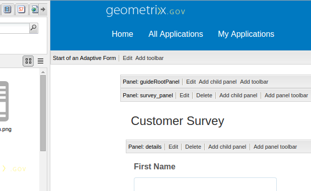

# Invio di un avviso di invio del modulo tramite e-mail{#sending-a-form-submission-acknowledgement-via-email}

## Invio di dati modulo adattivo {#adaptive-form-data-submission}

I moduli adattivi forniscono diversi flussi di lavoro per l&#39; [invio di azioni](../../forms/using/configuring-submit-actions.md) out-of-the-box per l&#39;invio dei dati del modulo a endpoint diversi.

Ad esempio, l’azione **Invia azione** e-mail invia un messaggio e-mail all’invio corretto di un modulo adattivo. È inoltre possibile configurare l&#39;invio tramite e-mail dei dati del modulo e del PDF.

Questo articolo descrive i passaggi per attivare l’azione E-mail su un modulo adattivo e le diverse configurazioni che fornisce.

>[!NOTE]
>
>È inoltre possibile utilizzare l&#39;azione **PDF** E-mail per inviare il modulo compilato via e-mail come allegato PDF. Le opzioni di configurazione disponibili per questa azione sono le stesse opzioni disponibili per l’azione E-mail. L&#39;azione e-mail PDF è disponibile solo per i moduli adattivi basati su XFA

## Email action {#email-action}

L’azione E-mail consente all’autore di inviare automaticamente e-mail a uno o più destinatari all’invio corretto di un modulo adattivo.

>[!NOTE]
>
>Per usare l’azione E-mail, dovete configurare il servizio e-mail AEM come descritto in [Configurazione del servizio]e-mail (/help/sites-administering/notification.md#configuring the mail service).

### Attivazione dell&#39;azione e-mail in un modulo adattivo {#enabling-email-action-on-an-adaptive-form}

1. Aprire un modulo adattivo in modalità di modifica.

1. Fare clic su **Modifica** accanto all&#39; **inizio di una barra degli strumenti Modulo** adattivo.

   Viene visualizzata la finestra di dialogo Modifica componente.

   

1. Selezionate la scheda **Invia azioni** e scegliete Azione **e-** mail dall’elenco a discesa Invia azione.

   Nella scheda sono visualizzate le opzioni per configurare l&#39;azione E-mail per il modulo corrente.

   

1. Specificate ID e-mail validi nei campi Mailto, CC e CCN.

   Specificate l’oggetto e il corpo dell’e-mail rispettivamente nei campi Oggetto e Modello e-mail.

   È inoltre possibile specificare segnaposto variabili nei campi, nel qual caso i valori dei campi vengono elaborati quando l&#39;utente finale invia correttamente il modulo. Per ulteriori informazioni, vedere [Uso dei nomi dei campi modulo adattivi per creare contenuti](../../forms/using/form-submission-receipt-via-email.md#p-using-adaptive-form-field-names-to-dynamically-create-email-content-p)e-mail in modo dinamico.

   Selezionare Includi allegati se il modulo include allegati e si desidera allegare tali file all&#39;e-mail.

   >[!NOTE]
   >
   >Se scegliete l’azione **PDF** e-mail, dovete selezionare l’opzione Includi allegati.

1. Fate clic su **OK** per salvare le modifiche.

### Uso dei nomi dei campi modulo adattivi per creare contenuto e-mail dinamico {#using-adaptive-form-field-names-to-dynamically-create-email-content}

I nomi dei campi di un modulo adattivo sono denominati segnaposto che vengono sostituiti con il valore di tale campo dopo l&#39;invio del modulo da parte dell&#39;utente.

Nella scheda Azioni e-mail è possibile utilizzare i segnaposto elaborati al momento dell&#39;esecuzione dell&#39;azione. Ciò implica che le intestazioni del messaggio e-mail (come Mailto, CC, CCN, oggetto) vengono generate al momento dell&#39;invio del modulo da parte dell&#39;utente.

Per definire un segnaposto, specificare `${<field name>}` un campo nella scheda Azioni di invio.

Ad esempio, se il modulo contiene il campo Indirizzo **e-mail, denominato** `email_addr`, per l’acquisizione dell’ID e-mail di un utente, è possibile specificare quanto segue nei campi Mailto, CC o CCN.

`${email_addr}`

Quando un utente invia il modulo, viene inviato un messaggio e-mail all&#39;ID e-mail immesso nel `email_addr` campo del modulo.

>[!NOTE]
>
>È possibile trovare il nome di un campo nella finestra di dialogo **Modifica** del campo.

I segnaposto variabili possono essere utilizzati anche nei campi **Oggetto** e Modello **** e-mail.

Esempio:

`Hi ${first_name} ${last_name},`

`Your form has been received by our department. It usually takes ten business days to process the request.`

`Regards`

`Administrator`

>[!NOTE]
>
>I campi nei pannelli ripetibili non possono essere utilizzati come segnaposto variabili.

