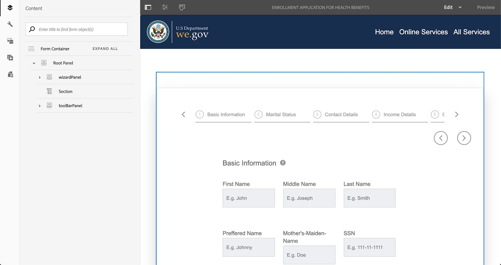

# Procedura dettagliata sul sito di riferimento We.Gov e We.Finance {#we-gov-reference-site-walkthrough}

## Prerequisiti {#pre-requisites}

Configura il sito di riferimento come descritto in [Impostare e configurare il sito di riferimento We.Gov e We.Finance](../../forms/using/forms-install-configure-gov-reference-site.md).

## Storia utente {#user-story}

* AEM Forms

   * Conversione moduli automatica
   * Authoring  
   * Modelli di dati modulo/Origini dati

* AEM Forms

   * Acquisizione dati
   * (Facoltativo) Integrazione dei dati (MS® Dynamics)
   * (Facoltativo) Adobe Sign

* Flusso di lavoro
* Notifiche e-mail
* (Facoltativo) Comunicazioni con i clienti

   * Canale di stampa
   * Canale web

* Adobe Analytics
* Integrazioni di origini dati

### Utenti e gruppi fittizi {#fictitious-users-and-groups}

Il pacchetto demo We.Gov è dotato dei seguenti utenti fittizi incorporati:

* **Aya Tan**: Cittadino idoneo a ricevere un Servizio da un&#39;agenzia governativa


* **George Lang**: analista aziendale di We.Gov


* **Camila Santos**: Lead CX di We.Gov Agency


Sono inclusi anche i seguenti gruppi:

* **Utenti Forms We.Gov**

   * George Lang (membro)
   * Camila Santos (membro)

* **Utenti We.Gov**

   * George Lang (membro)
   * Camila Santos (membro)
   * Aya Tan (membro)

### Legenda dei termini della panoramica della demo {#demo-overview-terms-legend}

1. **Impersona**: definizione di utenti e gruppi nella demo dell’AEM.
1. **Pulsante**: rettangolo colorato o freccia circolare per la navigazione.
1. **Clic**: per eseguire un’azione nella storia utente.
1. **Collegamenti**: nella parte superiore del menu principale nel sito We.Gov.
1. **Istruzioni utente**: set di passaggi numerici da seguire per spostarsi all’interno del brano dell’utente.
1. **Forms Portal**: *https://&lt;aemserver>:&lt;port>/content/we-gov/formsportal.html*
1. **Visualizzazione mobile**:We.Gov per replicare una visualizzazione mobile con un browser ridimensionato.
1. **Vista desktop**: utente We.gov per visualizzare una demo su un laptop o desktop.
1. **Modulo di pre-screening**: modulo nella home page del sito We.Gov.
1. **Modulo adattivo**: modulo di iscrizione per la demo We.gov.

   *https://&lt;aemserver>:&lt;port>/content/forms/af/adobe-gov-forms/enrollment-application-for-health-benefits.html*

1. **Adobe del sito We.Gov**: *https://&lt;aemserver>:&lt;port>/content/we-gov/home.html*
1. **Casella in entrata Adobe**: barra dei menu superiore [Icona Campana](assets/bell.svg) nel back-end AEM.

   *https://&lt;aemserver>:&lt;port>/aem/start.html*

1. **Client e-mail**: metodo preferito per visualizzare le e-mail (Gmail, Outlook)
1. **CTA**: Invito all’azione
1. **Naviga**: per individuare un punto di riferimento specifico nella pagina del browser.
1. **AFC**: AUTOMATED FORMS CONVERSION

## Automated forms conversion (Camila) {#automated-forms-conversion}

**Questa sezione**: Camila il lead CX ha un modulo esistente basato su PDF che è stato utilizzato come parte di un processo cartaceo. Come parte di un progetto di modernizzazione, Camila vuole utilizzare questo modulo PDF per creare automaticamente un moderno Forms adattivo.

### Automated forms conversion - We.Gov (Camila) {#automated-forms-conversion-wegov}

1. Accedi a *https://&lt;aemserver>:&lt;port>/aem/start.html*

1. Accedi con:
   * **Utente**: camila.santos
   * **Password**: password
1. Dalla pagina principale, seleziona Forms > Forms &amp; Documents > AEM Forms We.gov Forms > AFC.
1. Camila carica il PDF su AEM Forms.

   

1. Camilla seleziona quindi il modulo PDF e fa clic su **Avvia conversione automatica** per avviare il processo di conversione. Potrebbe essere necessario fare clic su **Sovrascrivi conversione** se il modulo è stato convertito.

   >[!NOTE]
   >
   >Le impostazioni in AFC sono preconfigurate per l&#39;utente finale, il che significa che non devono essere modificate.

   * **Facoltativo**: se desideri utilizzare il tema Ultramarine accessibile, fai clic su Specifica un tema per moduli adattivi e seleziona il tema Ultramarine accessibile visualizzato nell’elenco delle opzioni.

   

   

   Lo stato di completamento della percentuale viene visualizzato durante la conversione. Una volta visualizzato lo stato **Convertito**, fare clic su **output** cartella, seleziona il modulo adattivo e fai clic su **Modifica** per aprire il modulo convertito.

1. Camilla esamina il modulo e si accerta che tutti i campi siano presenti

   

1. Camilla inizia quindi a modificare il modulo e seleziona Root Panel (Pannello principale) > Edit (Modifica (chiave inglese) > select Tabs on Top (Schede in alto) dal menu a discesa Panel Layout (Layout pannello) > seleziona la casella di controllo.

   

1. Camilla aggiunge quindi tutte le modifiche CSS e sul campo necessarie per produrre il prodotto finale.

   

### Modello dati modulo e origini dati (Camila) {#data-sources}

**Questa sezione**: dopo la conversione del documento e la generazione di un modulo adattivo, Campaign deve collegare il modulo adattivo a un’origine dati.

1. Camila apre le Proprietà nel modulo convertito in [Automated forms conversion - We.Gov](#automated-forms-conversion-wegov).

1. Camila seleziona quindi Modello modulo > Seleziona modello dati modulo dal menu a discesa Seleziona da > Seleziona FDM di iscrizione We.gov dall’elenco di opzioni.

1. Fai clic su Salva e chiudi.

   

1. Camila fa clic su **output** seleziona il modulo adattivo e fa clic su **Modifica** per aprire il modulo We.Gov completato.
1. Camila seleziona un campo di modulo adattivo e fa clic su  e crea l’associazione con le entità del modello dati del modulo utilizzando **Riferimento binding** campo. Camila ripete questo passaggio per tutti i campi del modulo adattivo.

### Test di accessibilità dei moduli (Camila) {#form-accessibility-testing}

Camila verifica inoltre che il contenuto creato sia stato creato correttamente e completamente accessibile in base agli standard aziendali.

1. Camila fa clic su **output** seleziona il modulo adattivo e fa clic su **Anteprima** per aprire il modulo We.Gov completato.

1. Apre la scheda Audit nello strumento Chrome Developer Tool.

1. Esegue una verifica di accessibilità per convalidare il modulo adattivo.

   

## Demo Vista Mobile Modulo Adattivo (Aya) {#mobile-view-demo}

**Questa sezione deve essere eseguita prima della dimostrazione.**

**Istruzioni utente:**

1. Accedi a: *https://&lt;aemserver>:&lt;port>/content/we-gov/home.html*
1. Accedi con:

   1. **Utente**: aya.tan
   1. **Password**: password

1. Ridimensiona la finestra del browser o utilizza l’emulatore del browser per replicare le dimensioni di un dispositivo mobile.

### Sito Web We.Gov (Aya) {#aya-user-story-we-gov-website}


**Questa sezione**: Aya è una cittadina e sente da un amico che potrebbe essere idonea a ricevere un Servizio da un&#39;agenzia governativa. Aya accede al sito web We.Gov dal suo telefono cellulare per saperne di più sui servizi a cui ha diritto.

### Pre-Screener We.Gov (Aya) {#aya-user-story-we-gov-pre-screener}

Aya risponde ad alcune domande per confermare la sua idoneità compilando un breve modulo adattivo sul suo telefono cellulare.

**Istruzioni utente:**

1. Effettua una selezione in ciascun campo a discesa.

   >[!NOTE]
   >
   >Se l’utente guadagna più di $ 200.000/anno, non è idoneo.

1. Clic **Sono Idoneo?**.
1. Clic **Applica ora** per procedere.

   

### Modulo Adattivo We.Gov (Aya) {#aya-user-story-we-gov-adaptive-form}

Aya scopre di essere idonea e inizia a compilare la sua applicazione per richiedere il servizio sul suo dispositivo mobile.

Aya deve rivedere alcuni documenti a casa prima di poter completare l&#39;applicazione di richiesta di assistenza. Salva e chiude l’applicazione dal suo dispositivo mobile.

**Istruzioni utente:**

1. Compila i campi Informazioni di base. Di seguito sono riportati i campi obbligatori e i menu a discesa:

   1. Informazioni di base

      1. Nome
      1. Cognome
      1. Data di nascita
      1. E-mail

1. Utilizza quanto segue **logica dinamica** per illustrare una feature dinamica utilizzando **Stato della famiglia** elenco a discesa:

   1. **Singolo**: mostra pannello superiore
   1. **Coniugato**: Mostra pannello dipendente da matrimonio
   1. **Divorziato**: mostra pannello superiore
   1. **Vedovo**: mostra pannello superiore
   1. **Ha dei figli?**: (Sì/No) per visualizzare il pannello dipendente dall’elemento secondario.

      1. (Aggiungi/Rimuovi) per aggiungere/rimuovere più pannelli figlio dipendenti.

1. Fare clic sulla freccia destra nella barra dei menu grigia.
1. Fai clic sul pulsante Salva in basso.

   

## Demo desktop {#desktop-demo}

**Questa sezione:** Tornata a casa, Aya ha trovato le informazioni necessarie e riprende l&#39;applicazione dal suo desktop. Aya passa al portale Forms online per riprendere l’applicazione. Con alcune semplici personalizzazioni, le agenzie possono anche generare automaticamente e inviare tramite e-mail un collegamento per riprendere l’applicazione.

### Modulo Adattivo Continuo (Aya) {#aya-user-story-continued-adaptive-form}

**Istruzioni utente:**

1. Accedi a *https://&lt;aemserver>:&lt;port>/content/we-gov/home.html*
1. Dalla barra di navigazione, seleziona **Servizi online**.
1. Dal pannello &quot;Bozza Forms&quot;, selezionare la &quot;Applicazione di iscrizione per benefici per la salute&quot; esistente.

   

   Il look and feel è lo stesso e non ha bisogno di inserire nuovamente alcun dato.

   **Istruzioni utente:**

1. Fate clic con il pulsante destro del mouse su Circle CTA (Circle CTA) per passare alla sezione successiva.

   

   Il modulo viene compilato fino al punto dell&#39;ultima voce di Aya. Aya ha inserito tutte le sue informazioni ed è pronta a inviarle.

   

   >[!NOTE]
   >
   >Quando Aya compila il campo del numero di telefono, deve compilarlo come numero continuo di 11 cifre senza trattini, spazi o trattini.

   Dopo l’invio, Aya riceve una pagina di ringraziamento. Facoltativamente, Aya riceve anche un’e-mail che può aprire per firmare il documento di record elettronicamente con Adobe Sign.

### Facoltativo: Adobe Sign (Aya) {#adobe-sign}

**Istruzioni utente:**

1. Passa al client e-mail e trova l’e-mail di Adobe Sign.
1. Fai clic sul collegamento ad Adobe Sign.

   

**Istruzioni utente:**

1. Verifica **Accetto**.
1. Clic **Accetta**.
1. Scorrere fino alla parte inferiore del documento revisionato.
1. Fare clic sulla scheda gialla evidenziata per firmare il documento.

    

## Agente governativo (George) {#government-agent-george}


**Questa sezione:** George è un analista commerciale presso l&#39;agenzia governativa Aya richiede un servizio a. George dispone di un&#39;unica dashboard in cui è possibile visualizzare tutte le applicazioni di richiesta di servizio che gli sono state assegnate per la revisione.

### Casella in entrata AEM (George) {#george-user-story-aem-inbox}

**Istruzioni utente:**

1. Accedi a *https://&lt;aemserver>:&lt;port>/aem/start.html*
1. Fai clic sull’icona utente (angolo in alto a destra) e utilizza **Esci** o **Impersona** opzione di menu se si è attualmente connessi con un utente amministratore.

   1. Accedi con:

      1. **Utente:** george.lang
      1. **Password:** password

   1. Oppure rappresenta:

      1. Tipo `George` nel **Impersona** campo.

      1. Fai clic su OK per rappresentare.

1. Nell’angolo in alto a destra, fai clic sull’icona della notifica (campana).
1. Clic **Visualizza tutto** per passare alla cartella Posta in arrivo.
1. Dalla Casella in entrata, apri la più recente **Valutazione dell&#39;applicazione Health Benefits** attività.

   

### Facoltativo: Casella in entrata AEM e MS® Dynamics (George) {#george-user-story-aem-inbox-and-ms-dynamics}

Grazie alle integrazioni di dati e ai flussi di lavoro automatizzati, viene visualizzata l’applicazione di Aya, insieme a un record di gestione delle relazioni con i clienti che è stato generato automaticamente al momento dell’invio dei dati.

**Istruzioni utente:**

1. Apri e controlla il modulo adattivo di sola lettura.
1. Clic **Apri MS® Dynamics** per aprire il record MS® Dynamics in una nuova finestra.
1. Nel CRM, puoi visualizzare tutte le informazioni che possono essere aggiornate.

   1. Facoltativamente, aggiungi alcune note di revisione direttamente in Dynamics.

1. Chiudere e tornare alla casella in entrata AEM.

   

### Torna a Casella in entrata AEM (George) {#george-user-story-back-to-aem-inbox}

George approva l&#39;applicazione di Aya e, grazie a un flusso di lavoro automatico esistente, viene inviata anche un&#39;e-mail di conferma ad Aya.

**Istruzioni utente:**

1. Passa all’angolo in alto a sinistra e fai clic su **Approva** per approvare l&#39;applicazione.
1. Nella finestra modale, puoi lasciare un messaggio per il lead CX.
1. Fai clic su Fine.
1. (Ruolo cittadino) Apri il client e-mail per visualizzare l’e-mail inviata ad Aya.

   

## Lead CX (Camila) {#cx-lead-camila}


**Questa sezione:** Camila the CX Lead stabilisce una telefonata di benvenuto con Aya per spiegare come utilizzare i servizi governativi per i quali è approvata.

### (Facoltativo) Casella in entrata AEM e MS® Dynamics {#camila-user-story-aem-inbox-ms-dynamics}

**Istruzioni utente:**

1. Accedi a *https://&lt;aemserver>:&lt;port>/aem/start.html*
1. Fai clic sull’icona utente (angolo in alto a destra) e utilizza **Esci** o **Impersona** opzione di menu se si è attualmente connessi con un utente amministratore.

   1. Accedi con:

      1. **Utente**: camila.santos
      1. **Password**: password

   1. Oppure rappresenta:

      1. Tipo `Camila` nel **Impersona** campo.

      1. Fai clic su OK per rappresentare.

1. Nell’angolo in alto a destra, fai clic sull’icona Notifica (campana).
1. Clic **Visualizza tutto** per passare alla cartella Posta in arrivo.
1. Dalla Casella in entrata, apri la più recente **Approvazione nuovo contatto** attività.


**(Facoltativo) Istruzioni utente:**

1. Apri e controlla il modulo adattivo di sola lettura.
1. Clic **Apri MS® Dynamics** per aprire il record MS® Dynamics in una nuova finestra.
1. Nel sistema di gestione delle relazioni con i clienti puoi visualizzare tutte le informazioni che possono essere aggiornate.

   1. Facoltativamente, aggiungi un’attività di chiamata direttamente in Dynamics.
   1. Apri **Attività** sezione.
   1. Clic **Nuova telefonata**.
   1. Aggiungi i dettagli della telefonata.
   1. Salvare e chiudere la finestra.

1. Torna a AEM, passa all’angolo in alto a sinistra e fai clic su **Invia** per presentare la domanda.
1. Nel modale, puoi lasciare un messaggio.
1. Fai clic su Fine.

    

## (Facoltativo) Welcome Kit Citizen (Aya) {#welcome-kit-citizen-aya}

**Questa sezione:** Aya riceve un’e-mail contenente un collegamento a una comunicazione interattiva che riassume i suoi vantaggi e include anche campi modulo da compilare. Con l’istruzione sui vantaggi PDF allegata e il collegamento alla lettera di comunicazione interattiva nell’e-mail (con lo stesso tema/branding della comunicazione interattiva).

### Notifica Client E-Mail (Aya) {#aya-user-story-email-client}

**Istruzioni utente:**

1. Individua e apri l’e-mail del kit di benvenuto.
1. Scorri fino all’allegato PDF nella parte inferiore della pagina.
1. Fare clic per aprire l&#39;allegato PDF.
1. Scorri verso l’alto nel client e-mail e fai clic su **Visualizza il kit di benvenuto online**.

   1. Viene aperta la versione del canale web dello stesso documento.

1. Per un rapido riferimento direttamente a PDF:

   *https://&lt;aemserver>:&lt;port>/aem/formdetails.html/content/dam/formsanddocuments/adobe-gov-forms/welcome-handbook/we-gov-welcome-handbook*

1. Per un rapido riferimento direttamente all&#39;IC:

   *https://&lt;aemserver>:&lt;port>/content/dam/formsanddocuments/adobe-gov-forms/welcome-handbook/we-gov-welcome-handbook/jcr:content?channel=web&amp;mode=preview&amp;wcmmode=disabled*

    

## Cittadino Promemoria Rinnovo (Aya) {#renewal-reminder-citizen-aya}

**Questa sezione:** Camila pianifica anche un promemoria di comunicazione così un anno dopo. (Passaggio del flusso di lavoro che automatizza/esegue e invia e-mail).

### Notifica Client E-Mail (Aya) {#aya-user-story-email-client-updated}

**Istruzioni utente:**

1. Passa al client e-mail.
1. Individua e apri l’e-mail di Promemoria per il rinnovo.
1. Clic **Inviare una nuova domanda** in modo da poter aprire il modulo adattivo.

   1. Questa sezione viene intenzionalmente lasciata vuota per supportare la precompilazione dei dati nella fase 2.

   

## (Facoltativo) Modello dati modulo (Camila) {#form-data-model}

**Questa sezione**: Camila passa a Integrazioni dati di AEM Forms dove può eseguire un test rapido per verificare che le informazioni inviate all’origine dati esterna tramite l’integrazione del modello dati del modulo siano effettivamente presenti.

### Modello dati modulo (Camila) {#form-data-model-camila}

**Questa sezione**: Camila passa alla pagina Origini dati per convalidare i dati replicati dal server all’interno del database Derby.

1. Al termine dell’esperienza utente e al termine dell’invio da parte dell’utente, Camila passa alla scheda Origini dati in AEM Forms (**Forms** > **Integrazioni di dati**)

1. Camila seleziona quindi AEM Forms We.gov FDM e quindi modifica il **FDM iscrizione We.gov**.

1. Camila seleziona quindi il **Contatto** > **Servizio di lettura** da testare.

   

1. Camila fornisce quindi al servizio di test un ID contatto e fa clic su **Test**. Ad esempio, 1 o 2, se il modulo è stato inviato. Se non hai inviato il modulo, non vengono restituiti dati.

   

1. Camila può quindi verificare che i dati siano stati inseriti correttamente nell’origine dati.

   * I dati all&#39;interno di Derby DS sono simili al seguente formato:

   ```xml
      [
         {
         "ADDRESS_COUNTRY": "USA",
         "LAST_NAME": "Tan",
         "ADDRESS_CITY": "New York",
         "FIRST_NAME": "Aya",
         "ADDRESS_STATE": "AL",
         "ADDRESS_LINE1": "123 Street crescent",
         "GENDER_CODE": "2",
         "ADDRESS_LINE2": "123 Street crescent",
         "ADDRESS_POSTAL_CODE": "90210",
         "BIRTH_DATE": "1991-12-12",
         "CONTACT_ID": 1,
         "MIDDLE_NAME": "M",
         "HAS_CHILDREN_CODE": "0"
         }
   ]
   ```

## (Facoltativo) Analytics (Camila) {#analytics-cx-lead-camila}

**Questa sezione:** Camila passa a una dashboard in cui può vedere i KPI dell’agenzia, come la percentuale di cittadini che iniziano a compilare e ad abbandonare un modulo di richiesta di assistenza, il periodo di tempo medio tra la presentazione della richiesta e la risposta di approvazione/rifiuto e le statistiche di coinvolgimento per i manuali sui benefit che ha inviato ai cittadini.

### Rapporti sui siti di Adobe Analytics (Camila) {#camila-reviews-sites-reporting-we-gov-adobe-analytics}

1. Accedi a *https://&lt;aemserver>:&lt;port>/sites.html/content*
1. Seleziona **Sito We.Gov di AEM Forms** per visualizzare le pagine del sito.
1. Selezionare una delle pagine del sito (ad esempio Home) e scegliere **Analytics e Recommendations**.

   

1. In questa pagina vengono visualizzate le informazioni recuperate da Adobe Analytics relative alla pagina di AEM Sites (NOTA: per progettazione queste informazioni vengono periodicamente aggiornate da Adobe Analytics e non vengono visualizzate in tempo reale).

   

1. Tornando alla pagina di visualizzazione della pagina (a cui si accede al passaggio 3), è possibile visualizzare le informazioni di visualizzazione della pagina modificando l&#39;impostazione di visualizzazione in modo da visualizzare gli elementi in **Vista a elenco**.
1. Individua il **Visualizza** menu a discesa e selezionare **Vista a elenco**.

   

1. Dallo stesso menu, seleziona **Visualizza impostazione** e selezionare le colonne da visualizzare dal **Analytics** sezione.

   

1. Clic **Aggiorna** per rendere disponibili le nuove colonne.

   

### Rapporti di Adobe Analytics Forms (Camila) {#camila-reviews-forms-reporting-we-gov-adobe-analytics}

1. Accedi a

   *https://&lt;aemserver>:&lt;port>/aem/forms.html/content/dam/formsanddocuments/adobe-gov-forms*

1. Seleziona la **Domanda Di Iscrizione Per Benefici Sanitari** modulo adattivo e seleziona la **Rapporto di Analytics** opzione.

   

1. Attendi che la pagina venga caricata e visualizza i dati del rapporto di Analytics.

   
