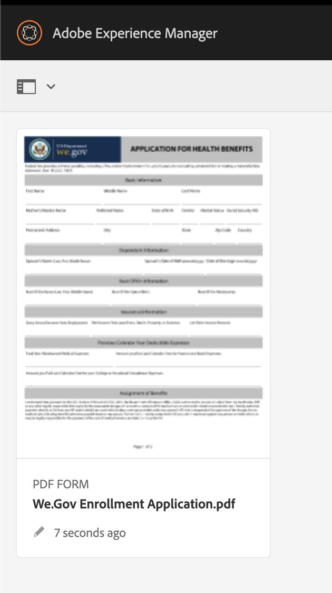

# Procedura dettagliata sul sito di riferimento We.Gov e We.Finance {#we-gov-reference-site-walkthrough}

## Prerequisiti {#pre-requisites}

Imposta il sito di riferimento come descritto in [Configurare e configurare il sito di riferimento We.Gov e We.Finance](../../forms/using/forms-install-configure-gov-reference-site.md).

## Storia utente {#user-story}

* AEM Forms

   * Conversione moduli automatica
   * Authoring  
   * Modelli di dati per moduli/Origini dati

* AEM Forms

   * Acquisizione dati
   * (Facoltativo) Integrazione dei dati (MS Dynamics)
   * (Facoltativo) Adobe Sign

* Flusso di lavoro
* Notifiche e-mail
* (Facoltativo) Comunicazioni con i clienti

   * Canale di stampa
   * Canale web

* Adobe Analytics
* Integrazioni di origini dati

### Utenti e gruppi fittizi {#fictitious-users-and-groups}

Il pacchetto demo We.Gov include i seguenti utenti fittizi incorporati:

* **Aya Tan**: Cittadino idoneo a un servizio da un&#39;agenzia governativa


* **George Lang**: Agenzia governativa Business Analytics


* **Camila Santos**: Lead CX di We.Gov Agency


Sono inclusi anche i seguenti gruppi:

* **Utenti Forms We.Gov**

   * George Lang (membro)
   * Camila Santos (membro)

* **Utenti We.Gov**

   * George Lang (membro)
   * Camila Santos (membro)
   * Aya Tan (membro)

### Legenda dei termini della panoramica della demo {#demo-overview-terms-legend}

1. **Impersona**: Utenti e gruppi definiti nella demo AEM.
1. **Pulsante**: Rettangolo colorato o freccia cerchiata per la navigazione.
1. **Fai clic su**: Per eseguire un&#39;azione nel brano utente.
1. **Collegamenti**: Situato nella parte superiore del menu principale nel sito We.Gov.
1. **Istruzioni utente**: Una serie di passaggi numerici da seguire durante la navigazione nella storia dell’utente.
1. **Portale Forms**: *https://&lt;aemserver>:&lt;port>/content/we-gov/formsportal.html*
1. **Visualizzazione mobile**: utente We.Gov per replicare una visualizzazione mobile con un browser ridimensionato.
1. **Vista desktop**: Utente We.gov per visualizzare la demo su un computer portatile o desktop.
1. **Modulo pre-screening**: Modulo sulla home page del sito We.Gov.
1. **Modulo adattivo**: Modulo di richiesta di iscrizione per la demo We.gov.

   *https://&lt;aemserver>:&lt;port>/content/forms/af/adobe-gov-forms/enrollment-application-for-health-benefits.html*

1. **Sito Adobe We.Gov**: *https://&lt;aemserver>:&lt;port>/content/we-gov/home.html*
1. **Casella in entrata Adobe**: Barra dei menu superiore [Icona Bell](assets/bell.svg) nel backend AEM.

   *https://&lt;aemserver>:&lt;port>/aem/start.html*

1. **Client e-mail**: Modo preferito per visualizzare le e-mail (Gmail, Outlook)
1. **CTA**: Invito all&#39;azione
1. **Naviga**: Per individuare un punto di riferimento specifico nella pagina del browser.
1. **AFC**: automated forms conversion

## automated forms conversion (Camila) {#automated-forms-conversion}

**Questa sezione**: Camila il lead CX dispone di un modulo basato su PDF esistente utilizzato come parte di un processo basato su carta. Come parte di uno sforzo di modernizzazione vuole utilizzare questo modulo PDF per creare automaticamente un nuovo Forms adattivo moderno.

### automated forms conversion - We.Gov (Camila) {#automated-forms-conversion-wegov}

1. Passa a *https://&lt;aemserver>:&lt;port>/aem/start.html*

1. Accedi con:
   * **Utente**: camila.santos
   * **Password**: password
1. Dalla pagina principale seleziona Forms > Forms &amp; Documents > AEM Forms We.gov Forms > AFC.
1. Camila carica il PDF su AEM Forms.

   

1. Camilla seleziona quindi il modulo PDF e clicca **Avvia conversione automatica** per avviare il processo di conversione. Potrebbe essere necessario fare clic su **Sovrascrivi conversione** se il modulo è stato convertito.

   >[!NOTE]
   >
   >Tieni presente che le impostazioni in AFC sono preconfigurate per l’utente finale, il che significa che non devono essere modificate.

   * **Facoltativo**: Se si desidera utilizzare il tema Accessible Ultramarine, è sufficiente fare clic sul tema Specificare un modulo adattivo e selezionare il tema Accessible-Ultramarine che appare nell&#39;elenco delle opzioni.

   

   

   Durante la conversione viene visualizzato lo stato di completamento della percentuale. Una volta visualizzato lo stato **Convertito**, fai clic su **output** , seleziona il modulo adattivo e fai clic su **Modifica** per aprire il modulo convertito.

1. Camilla poi rivede il modulo e si assicura che tutti i campi siano presenti

   

1. Camilla inizia quindi a modificare il modulo. Seleziona Pannello principale > Modifica (chiave inglese) > seleziona le schede in alto dal menu a discesa Layout pannello > seleziona la casella di controllo.

   

1. Camilla aggiunge quindi tutte le modifiche necessarie CSS e sul campo per produrre il prodotto finale.

   

### Modello dati modulo e origini dati (Camila) {#data-sources}

**Questa sezione**: Una volta convertito il documento e prodotto un Modulo adattivo, Camila deve collegare il Modulo adattivo a un’origine dati.

1. Camila apre le Proprietà nel modulo convertito in [automated forms conversion - We.Gov](#automated-forms-conversion-wegov).

1. Camila seleziona quindi Modello modulo > Seleziona Modello dati modulo dal menu a discesa Seleziona da > Seleziona FDM iscrizione We.gov dall&#39;elenco delle opzioni.

1. Fai clic sul pulsante Salva e chiudi .

   

1. Camila clicca sul pulsante **output** cartella, seleziona il modulo adattivo e fai clic su **Modifica** per aprire il modulo We.Gov completato.
1. Camila seleziona un campo modulo adattivo e clicca . Crea un binding con le entità del modello dati del modulo utilizzando **Riferimento a un&#39;associazione** campo . Ripete questo passaggio per tutti i campi del modulo adattivo.

### Test di accessibilità dei moduli (Camila) {#form-accessibility-testing}

Camila inoltre verifica che i contenuti creati siano creati correttamente e completamente accessibili in base agli standard aziendali.

1. Camila clicca sul pulsante **output** cartella, seleziona il modulo adattivo e fai clic su **Anteprima** per aprire il modulo We.Gov completato.

1. Apre la scheda Audit nello strumento per sviluppatori Chrome.

1. Esegue un controllo di accessibilità per convalidare il modulo adattivo.

   

## Demo Della Visualizzazione Mobile Del Modulo Adattivo (Aya) {#mobile-view-demo}

**Questa sezione deve essere eseguita prima della dimostrazione.**

**Istruzioni utente:**

1. Passa a: *https://&lt;aemserver>:&lt;port>/content/we-gov/home.html*
1. Accedi con:

   1. **Utente**: aya.tan
   1. **Password**: password

1. Ridimensiona la finestra del browser o utilizza l’emulatore del browser per replicare le dimensioni di un dispositivo mobile.

### Sito Web We.Gov (Aya) {#aya-user-story-we-gov-website}


**Questa sezione**: Aya è una cittadina. Sente ad un amico che potrebbe essere idoneo a ricevere un Servizio da un&#39;agenzia governativa. Aya naviga al sito web We.Gov dal suo cellulare per saperne di più sui servizi a cui ha diritto.

### Pre-Screener We.Gov (Aya) {#aya-user-story-we-gov-pre-screener}

Aya risponde ad alcune domande per confermare la sua idoneità compilando un breve modulo adattivo sul suo cellulare.

**Istruzioni utente:**

1. Effettua una selezione in ciascun campo a discesa.

   >[!NOTE]
   >
   >Se l’utente guadagna più di $200.000/anno, non è idoneo.

1. Fai clic su &quot;**Sono Idoneo?**&quot; pulsante.
1. Fai clic su &quot;**Applica**&quot; pulsante per continuare.

   

### Modulo Adattivo We.Gov (Aya) {#aya-user-story-we-gov-adaptive-form}

Aya scopre di essere idoneo e inizia a compilare la sua applicazione per richiedere il servizio sul suo dispositivo mobile.

Aya deve rivedere alcuni documenti a casa prima di poter completare l&#39;applicazione di richiesta del servizio. Salva ed esce dall&#39;applicazione dal suo dispositivo mobile.

**Istruzioni utente:**

1. Compila i campi Informazioni di base, i seguenti sono campi obbligatori e i seguenti elenchi a discesa:

   1. Informazioni di base

      1. Nome
      1. Cognome
      1. Data di nascita
      1. E-mail

1. Utilizza quanto segue **logica dinamica** per illustrare la funzione dinamica utilizzando **Stato familiare** menu a discesa:

   1. **Singolo**: Mostra il pannello successivo della kin
   1. **Sposato**: Mostra pannello dipendente coniugale
   1. **Divorziato**: Mostra il pannello successivo della kin
   1. **Vedovo**: Mostra il pannello successivo della kin
   1. **Lei ha dei figli?**: (Sì/No) pulsante di scelta per visualizzare il pannello figlio dipendente.

      1. Pulsante Aggiungi/Rimuovi per aggiungere/rimuovere più pannelli figlio dipendenti.

1. Fare clic sulla freccia destra nella barra dei menu grigia.
1. Fai clic sul pulsante Salva in basso.

   

## Demo del desktop {#desktop-demo}

**Questa sezione:** Tornato a casa, Aya ha trovato le informazioni di cui aveva bisogno e riprende l&#39;applicazione dal suo desktop. Aya passa al portale moduli online per riprendere la sua applicazione. Con alcune semplici personalizzazioni, le agenzie possono anche generare automaticamente e inviare un link per riprendere l&#39;applicazione.

### Modulo adattivo continuo (Aya) {#aya-user-story-continued-adaptive-form}

**Istruzioni utente:**

1. Passa a *https://&lt;aemserver>:&lt;port>/content/we-gov/home.html*
1. Dalla barra di navigazione, seleziona fai clic su &quot;**Servizi online**&quot;.
1. Dal pannello &quot;Bozza di Forms&quot;, selezionare l&#39;applicazione esistente &quot;Iscrizione per benefici per l&#39;integrità&quot;.

   

   L&#39;aspetto e la sensazione sono gli stessi, e non ha bisogno di reinserire dati.

   **Istruzioni utente:**

1. Fai clic su CTA cerchio destro per passare alla sezione successiva.

   

   Il modulo viene compilato fino al punto dell’ultima voce di Aya. Aya ha inserito tutte le sue informazioni ed è pronta a inviare.

   

   >[!NOTE]
   >
   >Quando Aya riempie il campo del numero di telefono deve riempirlo come numero continuo di 11 cifre senza trattini, spazi o trattini.

   Dopo aver inviato Aya riceve una pagina di ringraziamento. Facoltativamente riceverà anche un’e-mail che potrà aprire per firmare il documento di registrazione elettronicamente con Adobe Sign.

### Facoltativo: Adobe Sign (Aya) {#adobe-sign}

**Istruzioni utente:**

1. Passa al client e-mail e trova l’e-mail di Adobe Sign.
1. Fai clic sul collegamento ad Adobe Sign.

   

**Istruzioni utente:**

1. Controlla &quot;**Sono d&#39;accordo**&quot; box.
1. Fai clic su &quot;**Accetta**&quot;.
1. Scorri fino alla parte inferiore del documento rivisto.
1. Fare clic sulla scheda gialla evidenziata per firmare il documento.

    

## Agente governativo (George) {#government-agent-george}


**Questa sezione:** George è un analista d&#39;affari dell&#39;agenzia governativa Aya che richiede un servizio da. George ha un singolo dashboard dove può vedere tutte le applicazioni di richiesta di servizio che gli sono state assegnate per la revisione.

### Casella in entrata AEM (George) {#george-user-story-aem-inbox}

**Istruzioni utente:**

1. Passa a *https://&lt;aemserver>:&lt;port>/aem/start.html*
1. Fai clic sull’icona dell’utente (nell’angolo in alto a destra) e utilizza il **Esci**&quot;, o &quot;**Impersona come**&quot; opzione di menu se hai effettuato l&#39;accesso con un utente amministrativo.

   1. Accedi con:

      1. **Utente:** george.lang
      1. **Password:** password
   1. Oppure Impersona:

      1. Tipo &quot;**George**&quot; nella &quot;**Impersona come**&quot; campo.

      1. Fai clic su OK per impersonare.


1. Nell’angolo in alto a destra, fai clic sull’icona Notifica (campana).
1. Fai clic su &quot;**Visualizza tutto**&quot; per passare alla casella in entrata.
1. Dalla casella in entrata, apri l’ultima &quot;**Revisione dell&#39;applicazione dei benefici sanitari**&quot;.

   

### Facoltativo: AEM Posta in arrivo e MS Dynamics (George) {#george-user-story-aem-inbox-and-ms-dynamics}

Grazie alle integrazioni di dati e ai flussi di lavoro automatizzati, appare l’applicazione di Aya, insieme a un record CRM che è stato generato automaticamente al momento dell’invio dei dati.

**Istruzioni utente:**

1. Aprire ed esaminare il modulo adattivo di sola lettura.
1. Fai clic su &quot;**Apri MS Dynamics**&quot; per aprire il record MS Dynamics in una nuova finestra.
1. Nel CRM puoi vedere che tutte le informazioni possono essere aggiornate

   1. Facoltativamente, aggiungi alcune note di revisione direttamente in Dynamics.

1. Chiudi e torna alla casella in entrata AEM.

   

### Torna alla casella in entrata AEM (George) {#george-user-story-back-to-aem-inbox}

George approva l’applicazione di Aya e grazie a un flusso di lavoro automatizzato esistente viene inviata ad Aya un’e-mail di conferma.

**Istruzioni utente:**

1. Passa all’angolo in alto a sinistra e fai clic su &quot;**Approva**&quot; per approvare l&#39;applicazione.
1. Nel modulo , puoi lasciare un messaggio per il lead CX.
1. Fai clic su Fine.
1. (Ruolo cittadino) Apri il client e-mail per visualizzare l’e-mail inviata ad Aya.

   

## Piombo CX (Camila) {#cx-lead-camila}


**Questa sezione:** Camila il CX Lead ha organizzato una telefonata di benvenuto con Aya per spiegare come utilizzare i servizi governativi per i quali è stata approvata.

### (Facoltativo) AEM Posta in arrivo e MS Dynamics {#camila-user-story-aem-inbox-ms-dynamics}

**Istruzioni utente:**

1. Passa a *https://&lt;aemserver>:&lt;port>/aem/start.html*
1. Fai clic sull’icona dell’utente (nell’angolo in alto a destra) e utilizza il **Esci**&quot;, o &quot;**Impersona come**&quot; opzione di menu se hai effettuato l&#39;accesso con un utente amministrativo.

   1. Accedi con:

      1. **Utente**: camila.santos
      1. **Password**: password
   1. Oppure Impersona:

      1. Tipo &quot;**Camila**&quot; nella &quot;**Impersona come**&quot; campo.

      1. Fai clic su OK per impersonare.


1. Nell&#39;angolo in alto a destra, fai clic sull&#39;icona Notifica (campana).
1. Fai clic su &quot;**Visualizza tutto**&quot; per passare alla casella in entrata.
1. Dalla casella in entrata, apri l’ultima &quot;**Nuova approvazione contatto**&quot;.


**(Facoltativo) Istruzioni utente:**

1. Aprire ed esaminare il modulo adattivo di sola lettura.
1. Fai clic su &quot;**Apri MS Dynamics**&quot; per aprire il record MS Dynamics in una nuova finestra.
1. Nel CRM puoi vedere che tutte le informazioni possono essere aggiornate

   1. Facoltativamente, aggiungi una nuova attività di chiamata direttamente in Dynamics.
   1. Apri &quot;**Attività**&quot; sezione.
   1. Fai clic su &quot;**Nuova chiamata telefonica**&quot; opzione.
   1. Aggiungi i dettagli della chiamata telefonica.
   1. Salva e chiudi la finestra.

1. Indietro in AEM, accedi all&#39;angolo in alto a sinistra e fai clic su &quot;**Invia**&quot; per presentare la domanda.
1. Nel modale , puoi lasciare un messaggio.
1. Fai clic su Fine.

    

## (Facoltativo) Welcome Kit Citizen (Aya) {#welcome-kit-citizen-aya}

**Questa sezione:** Aya riceve un&#39;e-mail contenente un collegamento a una comunicazione interattiva che riepiloga i suoi vantaggi e include anche campi modulo da compilare. Con l’istruzione PDF benefit allegata e il collegamento alla lettera di comunicazione interattiva nella posta (con lo stesso tema/marchio della comunicazione interattiva).

### Notifica Client E-Mail (Aya) {#aya-user-story-email-client}

**Istruzioni utente:**

1. Individua e apri l’e-mail del kit di benvenuto.
1. Scorri fino all’allegato di PDF nella parte inferiore della pagina.
1. Fare clic per aprire l&#39;allegato PDF.
1. Scorri verso l’alto nel client e-mail e fai clic su &quot;**Visualizza kit di benvenuto online**&quot;.

   1. Verrà aperta la versione del canale Web dello stesso documento.

1. Per un riferimento rapido direttamente a PDF:

   *https://&lt;aemserver>:&lt;port>/aem/formdetails.html/content/dam/formsanddocuments/adobe-gov-forms/welcome-handbook/we-gov-welcome-handbook*

1. Per un rapido riferimento a IC direttamente:

   *https://&lt;aemserver>:&lt;port>/content/dam/formsanddocuments/adobe-gov-forms/welcome-handbook/we-gov-welcome-handbook/jcr:content?channel=web&amp;mode=preview&amp;wcmmode=disabled*

    

## Rinnovo Cittadino Promemoria (Aya) {#renewal-reminder-citizen-aya}

**Questa sezione:** Camila pianifica anche un promemoria di comunicazione un anno dopo. (Passaggio del flusso di lavoro che automatizza/esegue e invia e-mail).

### Notifica Client E-Mail (Aya) {#aya-user-story-email-client-updated}

**Istruzioni utente:**

1. Passa al client e-mail.
1. Individua e apri l’e-mail di Renewal Reminder .
1. Fai clic su &quot;**Invia una nuova applicazione**&quot; per aprire il modulo adattivo.

   1. Questa sezione viene lasciata intenzionalmente vuota per supportare la precompilazione dei dati nella fase 2.

   

## (Facoltativo) Modello dati modulo (Camila) {#form-data-model}

**Questa sezione**: Camila passa ad AEM Forms Data Integrations, dove può eseguire un rapido test per verificare che le informazioni inviate all’origine dati esterna tramite l’integrazione con Form Data Model siano effettivamente presenti.

### Modello dati modulo (Camila) {#form-data-model-camila}

**Questa sezione**: Camila passa alla pagina Origini dati per convalidare i dati replicati dal server all’interno del database Derby.

1. Una volta completata l’esperienza utente e completata l’invio da parte dell’utente, Camila passa alla scheda Origini dati di AEM Forms (**Forms** > **Integrazioni dati**)

1. Camila seleziona poi AEM Forms **FDM di We.gov** e quindi modificare il **Registrazione We.gov FDM**.

1. Camila seleziona poi **Contatto** > **Servizio di lettura** da sottoporre a prova.

   

1. Camila fornisce quindi il servizio di test con un id contatto e poi clicca sul pulsante Test. Ad esempio, 1 o 2, se il modulo è stato inviato. Se il modulo non è stato inviato, non verranno restituiti dati.

   

1. Camila può quindi verificare che i dati siano stati inseriti correttamente nell’origine dati.

   * I dati all&#39;interno di Derby DS sono simili al seguente formato:

   ```xml
      [
         {
         "ADDRESS_COUNTRY": "USA",
         "LAST_NAME": "Tan",
         "ADDRESS_CITY": "New York",
         "FIRST_NAME": "Aya",
         "ADDRESS_STATE": "AL",
         "ADDRESS_LINE1": "123 Street crescent",
         "GENDER_CODE": "2",
         "ADDRESS_LINE2": "123 Street crescent",
         "ADDRESS_POSTAL_CODE": "90210",
         "BIRTH_DATE": "1991-12-12",
         "CONTACT_ID": 1,
         "MIDDLE_NAME": "M",
         "HAS_CHILDREN_CODE": "0"
         }
   ]
   ```

## (Facoltativo) Analytics (Camila) {#analytics-cx-lead-camila}

**Questa sezione:** Camila passa a un dashboard in cui può vedere i KPI dell’agenzia come la percentuale di cittadini che iniziano a compilare un modulo di richiesta di servizio e abbandonano, la durata media del tempo che intercorre tra la presentazione della richiesta e la risposta di approvazione/diniego e le statistiche di coinvolgimento per i manuali sui benefici che ha inviato ai cittadini.

### Rapporti di Adobe Analytics Sites (Camila) {#camila-reviews-sites-reporting-we-gov-adobe-analytics}

1. Passa a *https://&lt;aemserver>:&lt;port>/sites.html/content*
1. Seleziona il &quot;**Sito AEM Forms We.Gov**&quot; per visualizzare le pagine del sito.
1. Seleziona una delle pagine del sito (ad esempio Home) e scegli &quot;**Analytics e Recommendations**&quot;.

   

1. In questa pagina vengono visualizzate le informazioni recuperate da Adobe Analytics relative alla pagina AEM Sites (NOTA: in base alla progettazione, queste informazioni vengono aggiornate periodicamente da Adobe Analytics e non vengono visualizzate in tempo reale).

   

1. Tornando alla pagina di visualizzazione della pagina (a cui si accede nel passaggio 3), è inoltre possibile visualizzare le informazioni di visualizzazione della pagina modificando l&#39;impostazione di visualizzazione per visualizzare gli elementi nel &quot;**Vista a elenco**&quot;.
1. Individua &quot;**Visualizza**&quot; menu a discesa e seleziona &quot;**Vista a elenco**&quot;.

   

1. Nello stesso menu, selezionare &quot;**Impostazione visualizzazione**&quot; e selezionare le colonne che si desidera visualizzare dal &quot;**Analytics**&quot; sezione.

   

1. Fai clic su &quot;**Aggiorna**&quot; per rendere disponibili le nuove colonne.

   

### Rapporti Adobe Analytics Forms (Camila) {#camila-reviews-forms-reporting-we-gov-adobe-analytics}

1. Accedi a

   *https://&lt;aemserver>:&lt;port>/aem/forms.html/content/dam/formsanddocuments/adobe-gov-forms*

1. Seleziona il &quot;**Domanda Di Iscrizione Per Benefici Per La Salute**&quot; modulo adattivo e seleziona &quot;**Rapporto di Analytics**&quot; opzione.

   

1. Attendi il caricamento della pagina e visualizza i dati del rapporto di Analytics.

   
