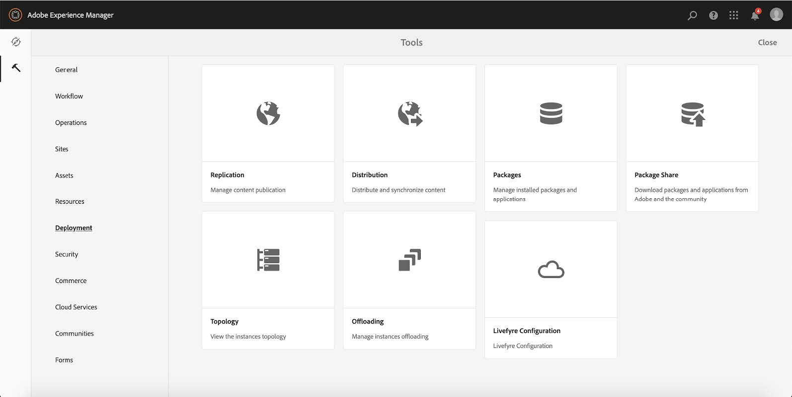

# Configurare e configurare il sito di riferimento We.Gov{#set-up-and-configure-we-gov-reference-site}

## Dettagli del pacchetto dimostrativo {#demo-package-details}

### Prerequisiti per l’installazione {#installation-prerequisites}

Questo pacchetto è stato creato per **AEM Forms 6.4 OSGI Author**, è stato testato ed è pertanto supportato nelle seguenti versioni della piattaforma:

| VERSIONE AEM | VERSIONE DEL PACCHETTO AEM FORMS | STATO |
|---|---|---|
| 6.4 | 5.0.86 | **Supportato** |
| 6.5 | 6.0.80 | **Supportato** |

Questo pacchetto contiene la configurazione cloud che supporta le seguenti versioni della piattaforma:

| CLOUD FORVIDER | VERSIONE DEL SERVIZIO | STATO |
|---|---|---|
| Adobe Sign | API v5 | **Supportato** |
| Microsoft Dynamics 365 | 1710 (9.1.0.3020) | **Supportato** |

**Considerazioni sull’installazione del pacchetto:**

* Il pacchetto deve essere installato su un server pulito, senza altri pacchetti demo o versioni precedenti del pacchetto demo
* Il pacchetto deve essere installato su un server OSGI, in esecuzione in modalità Autore

### Cosa include questo pacchetto {#what-does-this-package-include}

Il pacchetto demo AEM Forms We.Gov ( **we-gov-forms.pkg.all-&lt;versione>.zip **) viene fornito come pacchetto che include diversi altri pacchetti e servizi secondari. Il pacchetto include i seguenti moduli:

* **we-gov-forms.pkg.all-&lt;versione>.zip** -* Pacchetto demo completo*

   * **we-gov-forms.ui.apps-&lt;versione>.zip** *- Contiene tutti i componenti, le librerie client, gli esempi di utenti, i modelli di workflow, ecc.*

      * **we-gov-forms.core-&lt;versione>.jar*** - Contiene tutti i servizi OSGI, implementazione personalizzata dei passaggi del flusso di lavoro, ecc.*

      * **core.wcm.components.all-2.0.4.zip** - *Raccolta di componenti WCM di esempio*

      * **grid-aem.ui.apps-1.0-SNAPSHOT.zip** - pacchetto di layout Griglia di siti *AEM per il controllo delle colonne della pagina Siti*
   * **we-gov-forms.ui.coentent-&lt;versione>.zip*** - Contiene tutti i contenuti, le pagine, le immagini, *moduli, risorse di comunicazione interattiva, ecc.

   * **we-gov-forms.config.public-&lt;versione>.zip** - *Contiene tutti i nodi di configurazione predefiniti, incluse le configurazioni cloud segnaposto per evitare modelli di dati dei moduli e problemi di binding dei servizi.*

Le risorse incluse in questo pacchetto includono:

* Pagine del sito AEM con modelli modificabili
* AEM Forms - Moduli adattivi
* AEM Forms Interactive Communications (Stampa e Canale Web)
* Documento XDP di AEM Forms
* Modello dati AEM Forms MS Dynamics Forms
* Integrazione di Adobe Sign
* Modello flusso di lavoro AEM
* Immagini di esempio di AEM Assets

## Opzioni di configurazione {#configuration-options}

Questa sezione include informazioni sulle opzioni di configurazione. In questa fase, questa sezione è intenzionalmente vuota.

## Installazione del pacchetto dimostrativo {#demo-package-installation}

Questa sezione contiene informazioni sull&#39;installazione del pacchetto dimostrativo.

### Dalla condivisione del pacchetto {#from-package-share}

1. Andate a *https://&lt;aemserver>:&lt;porta>/crx/packageshare/*

   Oppure, in AEM, fate clic su Distribuzione e selezionate Icona Condivisione pacchetti.

   

1. Effettuate l&#39;accesso con il vostro Adobe ID.
1. Cercate e individuate il pacchetto **we-gov-forms.pkg.all-&lt;version>** .
1. Selezionate l&#39;opzione &quot;Scarica&quot; e accettate i termini e le condizioni.
1. Una volta scaricato, selezionate l&#39;opzione &quot;Scaricato&quot; per individuare il pacchetto in Gestione pacchetti.
1. Selezionate l&#39;opzione &quot;Install&quot; per installare il pacchetto.

   

1. Consentire il completamento del processo di installazione.
1. Andate a *https://&lt;aemserver>:&lt;porta>/content/we-gov/home.html?wcmmode=disabled* per verificare che l&#39;installazione sia stata completata correttamente.

### Da un file ZIP locale {#from-a-local-zip-file}

1. Scaricate e individuate il file **we-gov-forms.pkg.all-&lt;versione>.zip** .
1. Andate a *https://&lt;aemserver>:&lt;porta>/crx/packmgr/index.jsp*.
1. Selezionate l&#39;opzione &quot;Carica pacchetto&quot;.

   

1. Utilizzate il browser dei file per individuare e selezionare il file ZIP scaricato.
1. Fate clic su &quot;Apri&quot; per caricare.
1. Una volta caricato il pacchetto, selezionate l&#39;opzione &quot;Installa&quot; per installarlo.

   

1. Consentire il completamento del processo di installazione.
1. Andate a *https://&lt;aemserver>:&lt;porta>/content/we-gov/home.html?wcmmode=disabled* per verificare che l&#39;installazione sia stata completata correttamente.

### Installazione delle nuove versioni del pacchetto {#installing-new-package-versions}

Per installare la nuova versione del pacchetto, seguite i passaggi definiti in 4.1 e 4.2. È possibile installare una versione di pacchetto più recente mentre è già installato un altro pacchetto precedente, ma si consiglia di disinstallare prima la versione di pacchetto precedente. A tal fine, attenetevi alla procedura seguente.

1. Andate a *https://&lt;aemserver>:&lt;porta>/crx/packmgr/index.jsp*
1. Individuate il file **we-gov-forms.pkg.all-&lt;versione>.zip** precedente.
1. Selezionate l&#39;opzione &quot;Altro&quot;.
1. Dal menu a discesa, selezionate l&#39;opzione &quot;Disinstalla&quot;.

   

1. Al momento della conferma, selezionate di nuovo &quot;Disinstalla&quot; e consentite il completamento del processo di disinstallazione.

## Configurazione del pacchetto dimostrativo {#demo-package-configuration}

Questa sezione contiene informazioni e istruzioni sulla configurazione post-distribuzione del pacchetto demo prima della presentazione.

### Configurazione immaginaria dell&#39;utente {#fictional-user-configuration}

1. Andate a *https://&lt;aemserver>:&lt;porta>/libs/granite/security/content/groupadmin.html*
1. Cercate &quot;**workflow**&quot;.
1. Selezionate il gruppo &quot;**workflow-users**&quot; e fate clic su &quot;Properties&quot;.
1. Passate alla scheda &quot;Membri&quot;.
1. Digitare **il valore** in &quot;Seleziona utente o gruppo&quot;.
1. Selezionate dal menu a discesa &quot;**We.Gov Form Users**&quot;.

   

1. Fate clic su &quot;Save and Close&quot; (Salva e chiudi) nella barra dei menu.
1. Ripetete i passaggi da 2 a 7 cercando &quot;**analytics**&quot;, selezionando il gruppo &quot;**Analytics Administrators**&quot; e aggiungendo il gruppo &quot;**We.Gov Form Users**&quot; come membro.
1. Ripetere i passaggi da 2 a 7 cercando &quot;**Form users**&quot;, selezionando il gruppo &quot;**forms-power-users**&quot; e aggiungendo il gruppo &quot;**We.Gov Form Users**&quot; come membro.
1. Ripetere i passaggi da 2 a 7 cercando &quot;**Form users**&quot;, selezionando il gruppo &quot;**forms-users**&quot; e aggiungendo il gruppo &quot;*** We.Gov Users**&quot; come membro.

### Configurazione server e-mail {#email-server-configuration}

1. Consulta la documentazione di configurazione [Configurazione delle notifiche e-mail](/help/sites-administering/notification.md)

1. Andate a *https://&lt;aemserver>:&lt;porta>/system/console/configMgr*
1. Individuare e fare clic sul servizio **Day CQ Mail Service **per configurare.

   

1. Configurare il servizio per la connessione al server SMTP di tua scelta:

   1. **Nome host** server SMTP: ad esempio (smtp.gmail.com)
   1. **Porta** server: ad esempio (465) per la posta elettronica che utilizza SSL
   1. **** Utente SMTP: demo@ &lt;nome azienda> .com
   1. **Indirizzo**&quot;Da&quot;: aemformsdemo@adobe.com
   

1. Fate clic su &quot;Salva&quot; per salvare la configurazione.

### Configurazione SSL AEM {#aemsslconfig}

Questa sezione contiene informazioni sulla configurazione di SSL nell’istanza di AEM per poter configurare la configurazione di Adobe Sign Cloud.

**Riferimenti:**

1. [SSL per impostazione predefinita](/help/sites-administering/ssl-by-default.md)

**Note:**

1. Andate a https://&lt;aemserver>:&lt;porta>/aem/inbox dove potrete completare il processo descritto nel collegamento della documentazione di riferimento precedente.
1. Il pacchetto **we-gov-forms.pkg.all-&lt;versione>.zip** include una chiave SSL di esempio e un certificato a cui è possibile accedere estraendo la cartella **we-gov-forms.pkg.all-&lt;versione>.zip/ssl** che fa parte del pacchetto.

1. Certificato SSL e dettagli chiave:

   1. rilasciato a &quot;CN=localhost&quot;
   1. 10 anni di validità
   1. valore password di &quot;password&quot;

### Adobe Sign cloud configuration {#adobe-sign-cloud-configuration}

Questa sezione contiene informazioni e istruzioni sulla configurazione di Adobe Sign Cloud.

**Riferimenti:**

1. [Integrazione di Adobe Sign con AEM Forms](adobe-sign-integration-adaptive-forms.md)

#### Cloud configuration {#cloud-configuration}

1. **Esaminate i prerequisiti. Consultate Configurazione[SSL](../../forms/using/forms-install-configure-gov-reference-site.md#aemsslconfig)AEM per la configurazione SSL richiesta.**
1. Accedi a:

   *https://&lt;aemserver>:&lt;porta>/libs/adobesign/cloudservices/adobesign.html/conf/we-gov*

   >[!NOTE]
   >
   >L&#39;URL utilizzato per accedere al server AEM deve corrispondere all&#39;URL configurato nell&#39;URI di reindirizzamento OAuth di Adobe Sign per evitare problemi di configurazione (ad esempio *https://&lt;server aemserver>:&lt;porta>/mnt/overlay/adobesign/cloudservices/adobesign/properties.html*)

1. Selezionare la configurazione &quot;We.gov Adobe Sign&quot;.
1. Fare clic su &quot;Proprietà&quot;.
1. Passate alla scheda &quot;Impostazioni&quot;.
1. Immettete l’URL di autenticazione, ad esempio: [https://secure.na1.echosign.com/public/oauth](https://secure.na1.echosign.com/public/oauth)
1. Fornire l&#39;ID client e il Segreto cliente configurati dall&#39;istanza Adobe Sign configurata.
1. Fare clic su &quot;Connetti ad Adobe Sign&quot;.
1. Dopo la connessione, fate clic su &quot;Save and Close&quot; (Salva e chiudi) per completare l&#39;integrazione.

### Configurazione di MS Dynamics cloud {#ms-dynamics-cloud-configuration}

Questa sezione contiene informazioni e istruzioni sulla configurazione di MS Dynamics Cloud.

**Riferimenti:**

1. [Configurazione di Microsoft Dynamics OData](https://docs.adobe.com/content/help/en/experience-manager-64/forms/form-data-model/ms-dynamics-odata-configuration.html)
1. [Configurazione di Microsoft Dynamics per AEM Forms](https://helpx.adobe.com/experience-manager/kt/forms/using/config-dynamics-for-aem-forms.html)

#### Servizio cloud MS Dynamics OData {#ms-dynamics-odata-cloud-service}

1. Accedi a:

   https://&lt;aemserver>:&lt;porta>/libs/fd/fdm/gui/components/admin/fdmcloudservice/fdm.html/conf/we-gov

   1. Assicurarsi di accedere al server utilizzando lo stesso URL di reindirizzamento configurato nella registrazione dell&#39;applicazione MS Dynamics.

1. Selezionare la configurazione &quot;Microsoft Dynamics OData Cloud Service&quot;.
1. Fare clic su &quot;Proprietà&quot;.

   

1. Passate alla scheda &quot;Impostazioni autenticazione&quot;.
1. Inserite i seguenti dettagli:

   1. **** Radice servizio: ad esempio https://msdynamicsserver.api.crm3.dynamics.com/api/data/v9.1/
   1. **** Tipo di autenticazione: OAuth 2.0
   1. **Impostazioni** autenticazione (vedere Impostazioni [di configurazione di](../../forms/using/forms-install-configure-gov-reference-site.md#dynamicsconfig) MS Dynamics cloud per raccogliere queste informazioni):

      1. ID client - anche denominato ID applicazione
      1. Segreto client
      1. URL OAuth, ad esempio [https://login.windows.net/common/oauth2/authorize](https://login.windows.net/common/oauth2/authorize)
      1. Aggiorna URL token, ad esempio [https://login.windows.net/common/oauth2/token](https://login.windows.net/common/oauth2/token)
      1. URL token di accesso, ad esempio [https://login.windows.net/common/oauth2/token](https://login.windows.net/common/oauth2/token)
      1. Ambito di autorizzazione - **open id**
      1. Intestazione autenticazione - **Titolare autorizzazione**
      1. Risorsa, ad esempio [https://msdynamicsserver.api.crm3.dynamics.com](https://msdynamicsserver.api.crm3.dynamics.com)
   1. Fate clic su &quot;Connetti a OAuth&quot;.

1. Dopo l&#39;autenticazione, fate clic su &quot;Save &amp; Close&quot; (Salva e chiudi) per completare l&#39;integrazione.

#### Impostazioni di configurazione di MS Dynamics cloud {#dynamicsconfig}

I passaggi descritti in questa sezione sono inclusi per individuare l&#39;ID client, il Segreto cliente e i dettagli dall&#39;istanza di MS Dynamics Cloud.

1. Andate a [https://portal.azure.com/](https://portal.azure.com/) e accedete.
1. Dal menu a sinistra selezionare &quot;Tutti i servizi&quot;.
1. Cerca o passa a &quot;Registrazione app&quot;.
1. Create o selezionate una registrazione di applicazione esistente.
1. Copiate l&#39;ID **** applicazione da usare come ID **** client OAuthnella configurazione cloud AEM
1. Fate clic su &quot;Settings&quot; (Impostazioni) o &quot;Manifest&quot; (Manifest) per configurare gli URL di **risposta.**

   1. Questo URL deve corrispondere all’URL utilizzato per accedere al server AEM durante la configurazione del servizio OData.

1. Nella visualizzazione Impostazioni, fate clic su &quot;Tasti&quot; per visualizzare la nuova chiave (utilizzata come Segreto cliente in AEM).

   1. Accertatevi di conservare una copia della chiave in quanto non potrete visualizzarla in seguito in Azure o AEM.

1. Per individuare l&#39;URL di risorsa/l&#39;URL di directory principale del servizio, andate al dashboard dell&#39;istanza di MS Dynamics.
1. Nella barra di navigazione superiore, fate clic su &quot;Vendite&quot; o sul tipo di istanza desiderato e su &quot;Seleziona impostazioni&quot;.
1. Fare clic su &quot;Personalizzazioni&quot; e &quot;Risorse per sviluppatori&quot; in basso a destra.
1. L’URL della directory principale del servizio è il seguente: ad esempio

* [https://msdynamicsserver.api.crm3.dynamics.com/api/data/v9.1/](https://msdynamicsserver.api.crm3.dynamics.com/api/data/v9.1/)*

1. I dettagli sull&#39;URL di aggiornamento e accesso token sono disponibili qui:

* [https://docs.microsoft.com/en-us/rest/api/datacatalog/authenticate-a-client-app](https://docs.microsoft.com/en-us/rest/api/datacatalog/authenticate-a-client-app)*

#### Verifica del modello dati del modulo {#testing-the-form-data-model}

Una volta completata la configurazione cloud, potrebbe essere necessario verificare il modello dati del modulo.

1. Accedi a

   *https://&lt;aemserver>:&lt;porta>/aem/forms.html/content/dam/formsanddocuments-fdm/we-gov*

1. Selezionate &quot;We.gov Microsoft Dynamics CRM FDM&quot; e selezionate &quot;Properties&quot;.

   

1. Passate alla scheda &quot;Aggiorna origine&quot;.
1. Assicurarsi che la &quot;configurazione in base al contesto&quot; sia impostata su &quot;/conf/we-gov&quot; e che l&#39;origine dati configurata sia &quot;ms-ddynamic-odata-cloud-service&quot;.

   

1. Modificare il modello dati del modulo.

   >[!NOTE]
   Per evitare problemi che richiedono la reinstallazione, fate clic su **Annulla** invece di **Salva e chiudi** .

1. Verificare i servizi per assicurarsi che si connettano correttamente all&#39;origine dati configurata.

   >[!NOTE]
   È stato segnalato che era necessario riavviare AEM Server affinché l&#39;origine dati si connettesse correttamente al FDM.

### Adobe Analytics configuration {#adobe-analytics-configuration}

Questa sezione contiene informazioni e istruzioni sulla configurazione di Adobe Analytics Cloud.

**Riferimenti:**

* [Integrazione con Adobe Analytics](../../sites-administering/adobeanalytics.md)

* [Connessione ad Adobe Analytics e creazione di framework](../../sites-administering/adobeanalytics-connect.md)

* [Visualizzazione dei dati analitici sulle pagine](../../sites-authoring/pa-using.md)

* [Configurazione di analisi e rapporti](configure-analytics-forms-documents.md)

* [Visualizzazione e comprensione dei rapporti di analisi di AEM Forms](view-understand-aem-forms-analytics-reports.md)

### Configurazione del servizio cloud Adobe Analytics {#adobe-analytics-cloud-service-configuration}

Questo pacchetto è preconfigurato per la connessione ad Adobe Analytics. Vengono forniti i seguenti passaggi per consentire l&#39;aggiornamento della configurazione.

1. Andate a *https://&lt;aemserver>:&lt;porta>/libs/cq/core/content/tools/cloudservices.html*
1. Individuate la sezione Adobe Analytics e selezionate il collegamento &quot;Mostra configurazioni&quot;.
1. Selezionate la configurazione &quot;We.Gov Adobe Analytics (Analytics Configuration)&quot;.

   

1. Fate clic sul pulsante &quot;Modifica&quot; per aggiornare la configurazione di Adobe Analytics (sarà necessario fornire il Segreto condiviso). Fate clic su &quot;Connetti ad Analytics&quot; per connettersi e su &quot;OK&quot; per completare.

   

1. Dalla stessa pagina, fate clic su &quot;We.Gov Adobe Analytics Framework (Analytics Framework)&quot; se desiderate aggiornare le configurazioni del framework (consultate [Abilitare l&#39;authoring](../../forms/using/forms-install-configure-gov-reference-site.md#enableauthoring) AEM per abilitare l&#39;authoring).

### Report di Adobe Analytics {#adobe-analytics-reporting}

#### Visualizzazione dei rapporti sui siti di Adobe Analytics {#view-adobe-analytics-sites-reporting}

1. Andate a *https://&lt;aemserver>:&lt;porta>/sites.html/content*
1. Selezionate &quot;AEM Forms We.Gov Site&quot; per visualizzare le pagine del sito.
1. Selezionate una delle pagine del sito (ad esempio Home) e scegliete &quot;Analytics &amp; Recommendations&quot;.

   

1. In questa pagina, vedrai le informazioni recuperate da Adobe Analytics relative alla pagina Siti AEM (nota: in base alla progettazione, queste informazioni vengono aggiornate periodicamente da Adobe Analytics e non vengono visualizzate in tempo reale).

   

1. Tornando alla pagina di visualizzazione della pagina (a cui si accede al punto 3), è possibile visualizzare anche le informazioni di visualizzazione della pagina modificando l&#39;impostazione di visualizzazione per visualizzare gli elementi nella &quot;Vista a elenco&quot;.
1. Individuate il menu a discesa &quot;Visualizza&quot; e selezionate &quot;Visualizzazione elenco&quot;.

   

1. Nello stesso menu, selezionate &quot;Visualizza impostazione&quot; e selezionate le colonne da visualizzare nella sezione &quot;Analisi&quot;.

   

1. Fare clic su &quot;Aggiorna&quot; per rendere disponibili le nuove colonne.

   

#### Visualizzazione dei rapporti sui moduli di Adobe Analytics {#view-adobe-analytics-forms-reporting}

1. Accedi a

   *https://&lt;aemserver>:&lt;porta>/aem/forms.html/content/dam/formsanddocuments/adobe-gov-forms*

1. Selezionate il modulo adattivo &quot;Iscrizione applicazione per benefici sanitari&quot; e selezionate l&#39;opzione &quot;Report di Analytics&quot;.

   

1. Attendete che la pagina venga caricata e visualizzate i dati del report di Analytics.

   

#### Visualizzare i rapporti di Adobe Analytics {#view-adobe-analytics-reporting}

Facoltativamente, puoi accedere direttamente ad Adobe Analytics per visualizzare i dati di analisi.

1. Andate a [https://my.omniture.com/login/](https://my.omniture.com/login/)
1. Effettua l&#39;accesso con le tue credenziali:

   1. **** Società: Demo su AEM Forms
   1. **** Utente: &lt;disponibile su richiesta>
   1. **** Password: &lt;disponibile su richiesta>

1. Selezionate il &quot;Sito di riferimento We.Gov&quot; dalle suite di rapporti.

   

1. Selezionare uno dei report disponibili per visualizzare i dati di analisi di tale report.

   

## Personalizzazioni del pacchetto dimostrativo {#demo-package-customizations}

Questa sezione include istruzioni sulla personalizzazione della demo.

### Abilita creazione AEM {#enableauthoring}

Questo pacchetto demo include un file di configurazione del servizio OSGI che controlla il comportamento del servizio WCM Filter sul server Author di destinazione. Questa configurazione rende il server operativo in modalità di creazione disattivata (equivalente a ?wcmmode=disabled) per consentire la dimostrazione. Per aggiornare questa configurazione e abilitare l’authoring, effettuate le seguenti operazioni:

1. Andate a *https://&lt;aemserver>:&lt;porta>/system/console/configMgr*
1. Individuare e fare clic sul **Day CQ WCM Filter **Service service per configurare.

   

1. Impostate il valore di &quot;**WCM Mode**&quot; su &quot;**Edit**&quot;.
1. Fate clic su &quot;**Salva**&quot; per applicare la configurazione.

### Personalizzazione dei modelli {#templates-customization}

I modelli modificabili si trovano nel seguente percorso:

*https://&lt;aemserver>:&lt;porta>/libs/wcm/core/content/sites/templates.html/conf/we-gov*

Questi modelli includono i modelli di sito AEM, modulo adattivo e comunicazioni interattive, creati e assemblati con componenti disponibili all&#39;indirizzo:

*https://&lt;aemserver>:&lt;porta>/crx/de/index.jsp#/apps/we-gov/components*

#### Style system {#customizetemplates}

Questo sito include anche le librerie client, una delle quali importa Bootstrap 4 ( [https://getbootstrap.com/](https://getbootstrap.com/) ). Questa libreria client è disponibile in

*https://&lt;aemserver>:&lt;porta>/crx/de/index.jsp#/apps/we-gov/clientlibs/clientlib-base/css/bootstrap*

I modelli modificabili inclusi in questo pacchetto sono inoltre preconfigurati con criteri di modello/pagina che utilizzano le classi CSS di Bootstrap 4 per l&#39;impaginazione, lo stile ecc. Non tutte le classi sono state aggiunte ai criteri dei modelli, ma qualsiasi classe supportata da Bootstrap 4 può essere aggiunta ai criteri. Consultate la pagina iniziale per un elenco delle classi disponibili:

[https://getbootstrap.com/docs/4.1/getting-started/introduction/](https://getbootstrap.com/docs/4.1/getting-started/introduction/)

I modelli inclusi in questo pacchetto supportano anche Style System:

[Sistema di stili](../../sites-authoring/style-system.md)

#### Logo del modello {#template-logos}

Risorse DAM progetto include anche loghi e immagini We.Gov. Le risorse disponibili sono:

*https://&lt;aemserver>:&lt;porta>/assets.html/content/dam/we-gov*

Quando si modificano i modelli di pagina e di modulo, è possibile scegliere di aggiornare i logo del marchio modificando i componenti Navigazione e Piè di pagina. Questi componenti offrono una finestra di dialogo di marchio e logo configurabile che può essere utilizzata per aggiornare i logo:

Consultate Modifica del contenuto della pagina per ulteriori informazioni:

[Modifica del contenuto di una pagina](../../sites-authoring/editing-content.md)

### Personalizzazione delle pagine dei siti {#sites-pages-customization}

Tutte le pagine del sito sono disponibili da: *https://&lt;aemserver>:&lt;porta>/sites.html/content/we-gov*

Queste pagine del sito utilizzano anche il pacchetto AEM Grid per controllare il layout di alcuni componenti.

#### Style system {#style-system}

Anche le pagine incluse in questo pacchetto supportano Style System:

[Sistema di stili](../../sites-authoring/style-system.md)

Per la documentazione sugli stili supportati potete anche fare riferimento al sistema [di stile di personalizzazione](../../forms/using/forms-install-configure-gov-reference-site.md#customizetemplates) Modelli.

### Personalizzazione di moduli adattivi {#adaptive-forms-customization}

Tutti i moduli adattivi sono disponibili da:

*https://&lt;aemserver>:&lt;porta>/aem/forms.html/content/dam/formsanddocuments/adobe-gov-forms*

Questi moduli possono essere personalizzati in base a determinati casi di utilizzo. Tenere presente che alcuni campi e la logica di invio non devono essere modificati per garantire il corretto funzionamento del modulo. Ciò include:

**Domanda Di Iscrizione Per Prestazioni Sanitarie:**

* contact_id - Campo nascosto utilizzato per ricevere l&#39;ID contatto di MS Dynamics durante l&#39;invio
* Invia - La logica del pulsante Invia richiede la personalizzazione per supportare le callback. La personalizzazione è documentata, ma era necessario uno script di grandi dimensioni per inviare il modulo durante l&#39;esecuzione di un&#39;operazione POST e GET a MS Dynamics tramite Forms Data Model.
* Pannello principale - L&#39;evento Initialize viene utilizzato per aggiungere un pulsante MS Dynamics alla Casella in entrata AEM nel modo meno invadente possibile, poiché tutti i componenti dell&#39;interfaccia Granite di AEM Inbox non sono modificabili.

#### Stile modulo adattivo {#adaptive-form-styling}

I moduli adattivi possono essere formattati anche utilizzando l&#39;Editor di stile o l&#39;Editor tema:

* [Stile in linea dei componenti per moduli adattivi](inline-style-adaptive-forms.md)
* [Creazione e utilizzo di temi](themes.md)

### Personalizzazione del flusso di lavoro {#workflow-customization}

Il modulo adattivo per l’iscrizione può essere inviato a un flusso di lavoro OSGI per l’elaborazione. Questo flusso di lavoro è disponibile all&#39;indirizzo* https://&lt;aemserver>:&lt;porta>/conf/we-gov/settings/models/we-gov-process.html*.

A causa di alcune limitazioni, questo flusso di lavoro contiene diversi script e passaggi personalizzati del processo di flusso di lavoro OSGI. Questi passaggi del flusso di lavoro sono stati creati come passaggi generici e non sono stati creati con le finestre di dialogo di configurazione. Al momento, la configurazione dei passaggi del flusso di lavoro si basa sugli argomenti del processo.

Tutto il codice Java del passaggio del flusso di lavoro è contenuto nel pacchetto **we-gov-forms.core-&lt;versione>.jar** .

## Considerazioni dimostrative e problemi noti {#demo-considerations-and-known-issues}

Questa sezione contiene informazioni sulle funzioni dimostrative e sulle decisioni di progettazione che potrebbero richiedere considerazioni speciali durante il processo di dimostrazione.

### Considerazioni sulla demo {#demo-considerations}

* Come da AGRS-159, assicurarsi che il nome (primo, intermedio e ultimo) del contatto utilizzato nel modulo adattivo per l&#39;iscrizione sia univoco.
* Il modulo adattivo per l&#39;iscrizione invierà l&#39;e-mail di Adobe Sign all&#39;indirizzo specificato nel campo e-mail del modulo. Tale indirizzo e-mail non può essere lo stesso indirizzo e-mail utilizzato per configurare la configurazione cloud di Adobe Sign.
* Per impostazione predefinita, il pacchetto demo include diverse configurazioni di servizio OSGI per controllare il comportamento complessivo del server di destinazione che ospita la demo. Queste configurazioni includono una configurazione del servizio filtro WCM che per impostazione predefinita rende il server operativo in modalità di creazione **** disabilitata (equivalente a ?wcmmode=disabled). Consultate [Attivare l’authoring](../../forms/using/forms-install-configure-gov-reference-site.md#enableauthoring) AEM per consentire l’authoring delle pagine.

### Problemi noti {#known-issues}

* (AGRS-120) Il componente Navigazione siti attualmente non supporta pagine figlie nidificate con profondità superiore a 2 livelli.
* (AGRS-159) L&#39;FDM corrente di MS Dynamics deve eseguire due operazioni per prima, POST i dati del modulo adattivo per l&#39;iscrizione a Dynamics, quindi recuperare il record utente per recuperare l&#39;ID contatto. Nel suo stato corrente, il recupero dell&#39;ID contatto avrà esito negativo se più di due utenti con lo stesso nome sono presenti in Dynamics, il che non consentirà l&#39;invio del modulo adattivo per l&#39;iscrizione.

## Passaggi successivi {#next-steps}

Ora siete tutti pronti per esplorare il sito di riferimento We.Gov. Per ulteriori informazioni sul flusso di lavoro e i passaggi del sito di riferimento We.Gov, consulta la procedura dettagliata [del sito di riferimento](../../forms/using/forms-gov-reference-site-user-demo.md)We.Gov.
