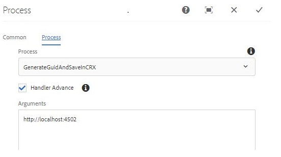
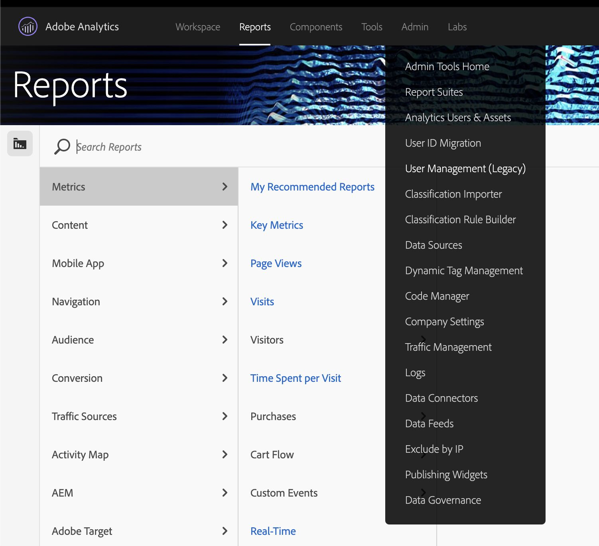
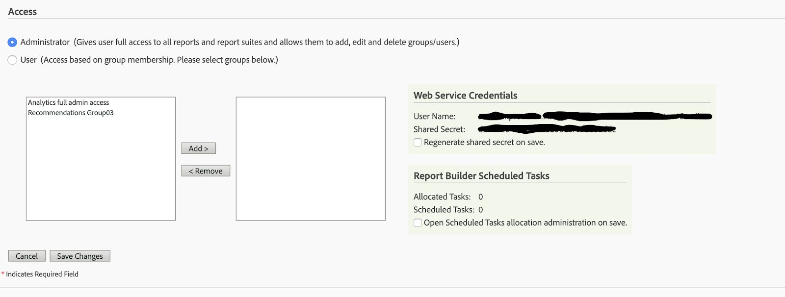
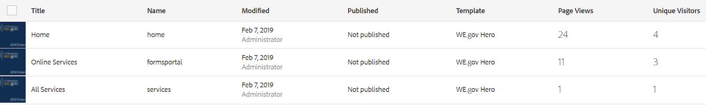

# Configurare e configurare il sito di riferimento We.Gov {#set-up-and-configure-we-gov-reference-site}

## Dettagli del pacchetto dimostrativo {#demo-package-details}

### Prerequisiti per l’installazione {#installation-prerequisites}

Questo pacchetto è stato creato per **AEM Forms 6.4 OSGI Author**, è stato testato ed è pertanto supportato nelle seguenti versioni della piattaforma:

| VERSIONE AEM | VERSIONE DEL PACCHETTO AEM FORMS | STATO |
|---|---|---|
| 6.4 | 5.0.86 | **Supportato** |
| 6.5 | 6.0.80 | **Supportato** |
| 6.5.3 | 6.0.122 | **Supportato** |

Questo pacchetto contiene la configurazione cloud che supporta le seguenti versioni della piattaforma:

| CLOUD FORVIDER | VERSIONE DEL SERVIZIO | STATO |
|---|---|---|
| Adobe Sign | API v5 | **Supportato** |
| Microsoft Dynamics 365 | 1710 (9.1.0.3020) | **Supportato** |
| Adobe Analytics | v1.4 Rest API | **Supportato** |
**Considerazioni sull’installazione del pacchetto:**

* Il pacchetto deve essere installato su un server pulito, senza altri pacchetti demo o versioni precedenti del pacchetto demo
* Il pacchetto deve essere installato su un server OSGI, in esecuzione in modalità Autore

### Cosa include questo pacchetto {#what-does-this-package-include}

Il pacchetto demo di AEM Forms We.Gov (**we-gov-forms.pkg.all-&lt;versione>.zip**) viene fornito come un pacchetto che include diversi altri pacchetti e servizi secondari. Il pacchetto include i seguenti moduli:

* **we-gov-forms.pkg.all-&lt;versione>.zip** - Pacchetto demo *completo*

   * **we-gov-forms.ui.apps-&lt;versione>.zip** *- Contiene tutti i componenti, le librerie client, gli esempi di utenti, i modelli di workflow, ecc.*

      * **we-gov-forms.core-&lt;versione>.jar** - *Contiene tutti i servizi OSGI, implementazione personalizzata dei passaggi del flusso di lavoro, ecc.*

      * **we-gov-forms.derby&lt;versione>.jar** - *Contiene tutti i servizi OSGI, lo schema del database, ecc.*

      * **core.wcm.components.all-2.0.4.zip** - *Raccolta di componenti WCM di esempio*

      * **grid-aem.ui.apps-1.0-SNAPSHOT.zip** - Pacchetto di layout Griglia *AEM Sites per il controllo della colonna Siti*
   * **we-gov-forms.ui.coentent-&lt;versione>.zip** - *Contiene tutti i contenuti, le pagine, le immagini, i moduli, le risorse di comunicazione interattiva, ecc.*

   * **we-gov-forms.ui.analytics-&lt;versione>.zip** - *Contiene tutti i dati di Analytics LiveCycle Forms  da memorizzare nell&#39;archivio.*

   * **we-gov-forms.config.public-&lt;versione>.zip** - *Contiene tutti i nodi di configurazione predefiniti, incluse le configurazioni cloud segnaposto per evitare modelli di dati dei moduli e problemi di binding dei servizi.*

Le risorse incluse in questo pacchetto includono:

* Pagine del sito AEM con modelli modificabili
* AEM Forms - Moduli adattivi
* Comunicazioni interattive AEM Forms (stampa e canale Web)
* Documento XDP AEM Forms
* AEM Forms MS Dynamics Forms Data Model
* Integrazione di Adobe Sign
* Modello flusso di lavoro AEM
* AEM Assets Immagini Di Esempio
* Database Apache Derby Di Esempio (In Memoria)
* Origine dati Apache Derby (per l&#39;utilizzo con Form Data Model)

## Installazione del pacchetto dimostrativo {#demo-package-installation}

Questa sezione contiene informazioni sull&#39;installazione del pacchetto dimostrativo.

### Da distribuzione software {#from-software-distribution}

1. Apri distribuzione software. È necessario un Adobe ID  per accedere a Distribuzione software.
1. Toccate **[!UICONTROL Adobe Experience Manager]** disponibile nel menu dell&#39;intestazione.
1. Nella sezione **[!UICONTROL Filtri]** :
   1. Selezionare **[!UICONTROL Forms]** dall&#39;elenco a discesa **[!UICONTROL Soluzione]** .
   2. Selezionate la versione e digitate il tipo di pacchetto. Potete anche utilizzare l&#39;opzione Download **[!UICONTROL di]** ricerca per filtrare i risultati.
1. Toccate il nome del pacchetto **we-gov-forms.pkg.all-&lt;versione>.zip** , selezionate **[!UICONTROL Accetta termini]** EULA e toccate **[!UICONTROL Scarica]**.
1. Aprite [Package Manager](https://docs.adobe.com/content/help/en/experience-manager-65/administering/contentmanagement/package-manager.html) e fate clic su **[!UICONTROL Carica pacchetto]** per caricare il pacchetto.
1. Select the package and click **[!UICONTROL Install]**.

   

1. Consentire il completamento del processo di installazione.
1. Andate a *https://&lt;aemserver>:&lt;porta>/content/we-gov/home.html?wcmmode=disabled* per verificare che l&#39;installazione sia stata completata correttamente.

### Da un file ZIP locale {#from-a-local-zip-file}

1. Scaricate e individuate il file **we-gov-forms.pkg.all-&lt;versione>.zip** .
1. Andate a *https://&lt;aemserver>:&lt;porta>/crx/packmgr/index.jsp*.
1. Selezionate l&#39;opzione &quot;Carica pacchetto&quot;.

   

1. Utilizzate il browser dei file per individuare e selezionare il file ZIP scaricato.
1. Fate clic su &quot;Apri&quot; per caricare.
1. Una volta caricato il pacchetto, selezionate l&#39;opzione &quot;Installa&quot; per installarlo.

   

1. Consentire il completamento del processo di installazione.
1. Andate a *https://&lt;aemserver>:&lt;porta>/content/we-gov/home.html?wcmmode=disabled* per verificare che l&#39;installazione sia stata completata correttamente.

### Installazione delle nuove versioni del pacchetto {#installing-new-package-versions}

Per installare la nuova versione del pacchetto, seguite i passaggi definiti in 4.1 e 4.2. È possibile installare una versione di pacchetto più recente mentre è già installato un altro pacchetto precedente, ma si consiglia di disinstallare prima la versione di pacchetto precedente. A tal fine, attenetevi alla procedura indicata di seguito.

1. Andate a *https://&lt;aemserver>:&lt;porta>/crx/packmgr/index.jsp*
1. Individuate il file **we-gov-forms.pkg.all-&lt;versione>.zip** precedente.
1. Selezionate l&#39;opzione &quot;Altro&quot;.
1. Dal menu a discesa, selezionate l&#39;opzione &quot;Disinstalla&quot;.

   

1. Al momento della conferma, selezionate di nuovo &quot;Disinstalla&quot; e consentite il completamento del processo di disinstallazione.

## Configurazione del pacchetto dimostrativo {#demo-package-configuration}

Questa sezione contiene informazioni e istruzioni sulla configurazione post-distribuzione del pacchetto demo prima della presentazione.

### Configurazione immaginaria dell&#39;utente {#fictional-user-configuration}

1. Andate a *https://&lt;aemserver>:&lt;porta>/libs/granite/security/content/groupadmin.html*
1. Effettuare il login come amministratore per eseguire le operazioni riportate di seguito.
1. Scorrete verso il basso fino alla fine della pagina per caricare tutti i gruppi di utenti.
1. Cercate &quot;**workflow**&quot;.
1. Selezionate il gruppo &quot;**workflow-users**&quot; e fate clic su &quot;Properties&quot;.
1. Passate alla scheda &quot;Membri&quot;.
1. Digitare **il valore** in &quot;Seleziona utente o gruppo&quot;.
1. Selezionare dall&#39;elenco a discesa &quot;**We.Gov Forms Users**&quot;.

   

1. Fate clic su &quot;Save and Close&quot; (Salva e chiudi) nella barra dei menu.
1. Ripetete i passaggi da 2 a 7 cercando &quot;**analytics**&quot;, selezionando il gruppo &quot;**amministratori** Analytics&quot; e aggiungendo il gruppo &quot;**We.Gov Forms Users**&quot; come membro.
1. Ripetere i passaggi da 2 a 7 cercando &quot;**Form users**&quot;, selezionando il gruppo &quot;**forms-power-users**&quot; e aggiungendo il gruppo &quot;**We.Gov Forms Users**&quot; come membro.
1. Ripetete i passaggi da 2 a 7 cercando &quot;**forms-users**&quot;, selezionando il gruppo &quot;**forms-users**&quot; e aggiungendo il gruppo &quot;**We.Gov Users**&quot; come membro.

### Configurazione server e-mail {#email-server-configuration}

1. Consulta la documentazione di configurazione [Configurazione delle notifiche e-mail](/help/sites-administering/notification.md)
1. Effettuate il login come amministratore per eseguire questa attività.
1. Andate a *https://&lt;aemserver>:&lt;porta>/system/console/configMgr*
1. Individuate e fate clic sul servizio **Day CQ Mail Service** da configurare.

   

1. Configurare il servizio per la connessione al server SMTP di tua scelta:

   1. **Nome host** server SMTP: ad esempio (smtp.gmail.com)
   1. **Porta** server: ad esempio (465) per la posta elettronica che utilizza SSL
   1. **Utente SMTP:** demo@ &lt;nome azienda> .com
   1. **Indirizzo**&quot;Da&quot;: aemformsdemo@adobe.com

   

1. Fate clic su &quot;Salva&quot; per salvare la configurazione.

### (Facoltativo) Configurazione SSL AEM {#aemsslconfig}

Questa sezione contiene informazioni sulla configurazione di SSL nell’istanza di AEM per poter configurare la configurazione di Adobe Sign Cloud.

**Riferimenti:**

1. [SSL per impostazione predefinita](/help/sites-administering/ssl-by-default.md)

**Note:**

1. Andate a https://&lt;aemserver>:&lt;porta>/aem/inbox dove potrete completare il processo descritto nel collegamento della documentazione di riferimento precedente.
1. Il `we-gov-forms.pkg.all-[version].zip` pacchetto include una chiave SSL di esempio e un certificato a cui è possibile accedere estraendo la `we-gov-forms.pkg.all-[version].zip/ssl` cartella che fa parte del pacchetto.

1. Certificato SSL e dettagli chiave:

   1. rilasciato a &quot;CN=localhost&quot;
   1. 10 anni di validità
   1. valore password di &quot;password&quot;
1. La chiave privata è *localhostprivate.der*.
1. Il certificato è *localhost.crt*.
1. Fai clic su Avanti.
1. Il nome host HTTPS deve essere impostato su *localhost*.
1. La porta deve essere impostata su una porta esposta dal sistema.

### (Optional) Adobe Sign cloud configuration {#adobe-sign-cloud-configuration}

Questa sezione contiene informazioni e istruzioni sulla configurazione di Adobe Sign Cloud.

**Riferimenti:**

1. [Integrazione di Adobe Sign con i AEM Forms](adobe-sign-integration-adaptive-forms.md)

#### Cloud configuration {#cloud-configuration}

1. Esaminate i prerequisiti. Consultate Configurazione [SSL](../../forms/using/forms-install-configure-gov-reference-site.md#aemsslconfig) AEM per la configurazione SSL richiesta.
1. Accedi a:

   *https://&lt;aemserver>:&lt;porta>/libs/adobesign/cloudservices/adobesign.html/conf/we-gov*

   >[!NOTE]
   >
   >L&#39;URL utilizzato per accedere al server AEM deve corrispondere all&#39;URL configurato nell&#39;URI di reindirizzamento OAuth di Adobe Sign per evitare problemi di configurazione (ad esempio *https://&lt;server aemserver>:&lt;porta>/mnt/overlay/adobesign/cloudservices/adobesign/properties.html*)

1. Selezionare la configurazione &quot;We.gov Adobe Sign&quot;.
1. Fare clic su &quot;Proprietà&quot;.
1. Passate alla scheda &quot;Impostazioni&quot;.
1. Immettete l’URL di autenticazione, ad esempio: [https://secure.na1.echosign.com/public/oauth](https://secure.na1.echosign.com/public/oauth)
1. Fornire l&#39;ID client e il Segreto cliente configurati dall&#39;istanza Adobe Sign configurata.
1. Fare clic su &quot;Connetti ad Adobe Sign&quot;.
1. Dopo la connessione, fate clic su &quot;Save and Close&quot; (Salva e chiudi) per completare l&#39;integrazione.

### Compilare e firmare più moduli {#fill-sign-multiple-forms}

Questo documento descrive i passaggi necessari per impostare la capacità di compilare e firmare più moduli. Puoi anche provare la [stessa funzionalità qui](https://forms.enablementadobe.com/content/dam/formsanddocuments/formsandsigndemo/refinanceform/jcr:content?wcmmode=disabled). Questo esempio memorizza i dati necessari per questo esempio nell’archivio di AEM. Questa procedura consente di distribuire risorse demo sul server locale in modo semplice. Nella vita reale archivieremo le stesse informazioni in RDMS di vostra scelta.

#### Prerequisiti {#pre-requisites-fill-sign-multiple-forms}

* [Configura servizio di posta CQ Day](https://docs.adobe.com/content/help/en/experience-manager-65/communities/administer/email.html)

* [Configurare i AEM Forms con Adobe Sign](https://docs.adobe.com/content/help/en/experience-manager-65/forms/adaptive-forms-advanced-authoring/adobe-sign-integration-adaptive-forms.html)

#### Impostare l’esempio sul server locale {#setup-sample-local-server}

Per impostare l’esempio sul server locale, effettuate le seguenti operazioni:

1. Installate il pacchetto. Questo pacchetto contiene i seguenti elementi:
   * Moduli adattivi. I moduli si trovano nella cartella **formsandsigndemo**
   * Pacchetti OSGI personalizzati
   * Flussi di lavoro
1. Configura il modulo [di](http://localhost:4502/editor.html/content/forms/af/formsandsigndemo/consentform.html) consenso per utilizzare la configurazione di Adobe Sign.
1. Configura il modulo di blocco [interessi](http://localhost:4502/editor.html/content/forms/af/formsandsigndemo/multistateinterestratelock.html) con più stati per utilizzare la configurazione di Adobe Sign.
1. Apri modello di flusso di lavoro [Formsandsigningdemo](http://localhost:4502/editor.html/conf/global/settings/workflow/models/formsandsigningdemo.html) :
   1. Aprire il passaggio Salva moduli in CRX.
   1. Modificate l’host locale nell’indirizzo IP di AEM Server.
   1. Salvare le modifiche.
   1. Sincronizzate il flusso di lavoro per generare il modello di runtime.

      

   1. Aprire il modulo Rifinanzia.
   1. Compila i campi richiesti. Assicurarsi di fornire un indirizzo e-mail valido e selezionare uno o più moduli per firmare e inviare il modulo.
Viene inviato un messaggio e-mail contenente un collegamento per la compilazione e la firma dei moduli.

#### Risoluzione dei problemi {#troubleshoot-sign-multiple-forms}

* I registri di debug vengono scritti nel `signingmultipleforms.log` file presente nella cartella di registro del server.

* I moduli da firmare sono memorizzati in `/content/formsforsigning`.

* Accertatevi di disporre di tutti i bundle nello stato attivo.

* Controllare la configurazione del server di posta elettronica.

### (Facoltativo) Configurazione di MS Dynamics cloud {#ms-dynamics-cloud-configuration}

Questa sezione contiene informazioni e istruzioni sulla configurazione di MS Dynamics Cloud.

**Riferimenti:**

1. [Configurazione di Microsoft Dynamics OData](https://docs.adobe.com/content/help/en/experience-manager-64/forms/form-data-model/ms-dynamics-odata-configuration.html)
1. [Configurazione di Microsoft Dynamics per AEM Forms](https://helpx.adobe.com/experience-manager/kt/forms/using/config-dynamics-for-aem-forms.html)

#### Servizio cloud MS Dynamics OData {#ms-dynamics-odata-cloud-service}

1. Accedi a:

   https://&lt;aemserver>:&lt;porta>/libs/fd/fdm/gui/components/admin/fdmcloudservice/fdm.html/conf/we-gov

   1. Assicurarsi di accedere al server utilizzando lo stesso URL di reindirizzamento configurato nella registrazione dell&#39;applicazione MS Dynamics.

1. Selezionare la configurazione &quot;Microsoft Dynamics OData Cloud Service&quot;.
1. Fare clic su &quot;Proprietà&quot;.

   

1. Passate alla scheda &quot;Impostazioni autenticazione&quot;.
1. Inserite i seguenti dettagli:

   1. **Radice servizio:** ad esempio https://msdynamicsserver.api.crm3.dynamics.com/api/data/v9.1/
   1. **Tipo di autenticazione:** OAuth 2.0
   1. **Impostazioni** autenticazione (vedere Impostazioni [di configurazione di](../../forms/using/forms-install-configure-gov-reference-site.md#dynamicsconfig) MS Dynamics cloud per raccogliere queste informazioni):

      1. ID client - anche denominato ID applicazione
      1. Segreto client
      1. URL OAuth, ad esempio [https://login.windows.net/common/oauth2/authorize](https://login.windows.net/common/oauth2/authorize)
      1. Aggiorna URL token, ad esempio [https://login.windows.net/common/oauth2/token](https://login.windows.net/common/oauth2/token)
      1. URL token di accesso, ad esempio [https://login.windows.net/common/oauth2/token](https://login.windows.net/common/oauth2/token)
      1. Ambito di autorizzazione - **open id**
      1. Intestazione autenticazione - **Titolare autorizzazione**
      1. Risorsa, ad esempio [https://msdynamicsserver.api.crm3.dynamics.com](https://msdynamicsserver.api.crm3.dynamics.com)
   1. Fate clic su &quot;Connetti a OAuth&quot;.

1. Dopo l&#39;autenticazione, fate clic su &quot;Save &amp; Close&quot; (Salva e chiudi) per completare l&#39;integrazione.

#### Impostazioni di configurazione di MS Dynamics cloud {#dynamicsconfig}

I passaggi descritti in questa sezione sono inclusi per individuare l&#39;ID client, il Segreto cliente e i dettagli dall&#39;istanza di MS Dynamics Cloud.

1. Andate a [https://portal.azure.com/](https://portal.azure.com/) e accedete.
1. Dal menu a sinistra selezionare &quot;Tutti i servizi&quot;.
1. Cerca o passa a &quot;Registrazione app&quot;.
1. Create o selezionate una registrazione di applicazione esistente.
1. Copiate l&#39;ID **** applicazione da usare come ID **** client OAuthnella configurazione cloud AEM
1. Fate clic su &quot;Settings&quot; (Impostazioni) o &quot;Manifest&quot; (Manifest) per configurare gli URL di **risposta.**

   1. Questo URL deve corrispondere all’URL utilizzato per accedere al server AEM durante la configurazione del servizio OData.

1. Nella visualizzazione Impostazioni, fate clic su &quot;Tasti&quot; per visualizzare la nuova chiave creata (utilizzata come Segreto cliente in AEM).

   1. Accertatevi di conservare una copia della chiave in quanto non potrete visualizzarla in seguito in Azure o AEM.

1. Per individuare l&#39;URL di risorsa/l&#39;URL di directory principale del servizio, andate al dashboard dell&#39;istanza di MS Dynamics.
1. Nella barra di navigazione superiore, fate clic su &quot;Vendite&quot; o sul tipo di istanza desiderato e su &quot;Seleziona impostazioni&quot;.
1. Fare clic su &quot;Personalizzazioni&quot; e &quot;Risorse per sviluppatori&quot; in basso a destra.
1. L’URL della directory principale del servizio è il seguente: ad esempio

   *[https://msdynamicsserver.api.crm3.dynamics.com/api/data/v9.1/](https://msdynamicsserver.api.crm3.dynamics.com/api/data/v9.1/)*

1. I dettagli sull&#39;URL di aggiornamento e accesso del token sono disponibili qui:

   *[https://docs.microsoft.com/en-us/rest/api/datacatalog/authenticate-a-client-app](https://docs.microsoft.com/en-us/rest/api/datacatalog/authenticate-a-client-app)*

#### Verifica del modello dati Forms (Dynamics) {#testing-the-form-data-model}

Una volta completata la configurazione cloud, potrebbe essere necessario verificare il modello dati del modulo.

1. Accedi a

   *https://&lt;aemserver>:&lt;porta>/aem/forms.html/content/dam/formsanddocuments-fdm/we-gov*

1. Selezionate &quot;We.gov Microsoft Dynamics CRM FDM&quot; e selezionate &quot;Properties&quot;.

   

1. Passate alla scheda &quot;Aggiorna origine&quot;.
1. Assicurarsi che la &quot;configurazione in base al contesto&quot; sia impostata su &quot;/conf/we-gov&quot; e che l&#39;origine dati configurata sia &quot;ms-ddynamic-odata-cloud-service&quot;.

   

1. Modificare il modello dati del modulo.

1. Verificare i servizi per assicurarsi che si connettano correttamente all&#39;origine dati configurata.

   >[!NOTE]
   Dopo aver verificato i servizi, fare clic su **Annulla** per assicurarsi che le modifiche involontarie non vengano propagate al modello dati del modulo.

   >[!NOTE]
   È stato segnalato che era necessario riavviare AEM Server affinché l&#39;origine dati si connettesse correttamente al FDM.

#### Verifica del modello dati Forms (Derby) {#test-fdm-derby}

Una volta completata la configurazione cloud, potrebbe essere necessario verificare il modello dati del modulo.

1. Andate a *https://&lt;aemserver>:&lt;porta>/aem/forms.html/content/dam/formsanddocuments-fdm/we-gov*

1. Selezionate **We.gov Enrollment FDM** e selezionate **Proprietà**.

   

1. Passate alla scheda **Aggiorna origine** .

1. Assicurarsi che la configurazione **in base al** contesto sia impostata su `/conf/we-gov` e che l&#39;origine dati configurata sia **We.Gov Derby DS**.

   

1. Click on **Save and Close**.

1. [Verificare i servizi](work-with-form-data-model.md#test-data-model-objects-and-services) per assicurarsi che si connettano correttamente all&#39;origine dati configurata

   * Per verificare la connessione, selezionate **HOMEMORTGAGEACCOUNT** e fornitegli un servizio get. Verificate che gli amministratori di sistema e di servizio possano vedere i dati recuperati.

### Configurazione Adobe  Analytics (facoltativo) {#adobe-analytics-configuration}

Questa sezione contiene informazioni e istruzioni sulla configurazione di Adobe  Analytics Cloud.

**Riferimenti:**

* [Integrazione con Adobe Analytics](../../sites-administering/adobeanalytics.md)

* [Connessione ad Adobe  Analytics e creazione di framework](../../sites-administering/adobeanalytics-connect.md)

* [Visualizzazione dei dati analitici sulle pagine](../../sites-authoring/pa-using.md)

* [Configurazione di analisi e rapporti](configure-analytics-forms-documents.md)

* [Visualizzare e comprendere i report di analisi AEM Forms](view-understand-aem-forms-analytics-reports.md)

### Configurazione del servizio cloud Adobe  Analytics {#adobe-analytics-cloud-service-configuration}

Questo pacchetto è preconfigurato per la connessione ad Adobe  Analytics. Vengono forniti i seguenti passaggi per consentire l&#39;aggiornamento di questa configurazione.

1. Andate a *https://&lt;aemserver>:&lt;porta>/libs/cq/core/content/tools/cloudservices.html*
1. Individuate la sezione Adobe  Analytics e selezionate il collegamento &quot;Mostra configurazioni&quot;.
1. Selezionate la configurazione &quot;We.Gov Adobe  Analytics ( Analytics Configuration)&quot;.

   

1. Fate clic sul pulsante &quot;Modifica&quot; per aggiornare la configurazione di Adobe  Analytics (sarà necessario fornire il Segreto condiviso). Fate clic su &quot;Connetti a  Analytics&quot; per connettersi e su &quot;OK&quot; per completare.

   

1. Dalla stessa pagina, fate clic su &quot;We.Gov Adobe  Analytics Framework ( Analytics Framework)&quot; se desiderate aggiornare le configurazioni del framework (consultate [Abilitare l’authoring](../../forms/using/forms-install-configure-gov-reference-site.md#enableauthoring) con AEM).

#### Adobe  Analytics Individuazione delle credenziali utente {#analytics-locating-user-credentials}

Per individuare le credenziali utente per un account Adobe  Analytics, l&#39;amministratore di account deve eseguire le seguenti operazioni.

1. Andate al portale Adobe Experience Cloud.
   * Accedi con le credenziali di amministratore
1. Selezionate l’icona Adobe  Analytics nella dashboard principale.
   
1. Passa alla scheda Amministratore e seleziona l&#39;elemento Gestione utente (legacy)
   
1. Select the **Users** tab.
   
1. Selezionate l’utente desiderato dall’elenco di utenti.
1. Scorrete fino in fondo alla pagina e le informazioni di autenticazione degli utenti verranno visualizzate in fondo alla pagina.
   
1. Il nome utente e le informazioni sul segreto condiviso verranno visualizzati sul lato destro della casella delle autorizzazioni.
1. Notate che il nome utente avrà due punti all&#39;interno del nome, tutte le informazioni a sinistra dei due punti sono il nome utente, e tutte le informazioni a destra dei due punti saranno il nome della società.
   * Esempio: *username : nome società*

#### Configurazione dell’autenticazione utente in Adobe  Analytics {#setup-user-authentication}

Gli amministratori possono fornire agli utenti le autorizzazioni di analisi AEM eseguendo le azioni seguenti.

1. Andate ad Adobe  Admin Console.

1. Fate clic sull&#39;istanza di Analytics  che è esposta all&#39;Admin Console.

   * Si trova nella pagina principale della pagina di amministrazione.

1. Selezionate  accesso completo all&#39;amministratore Analytics.

1. Aggiungete un utente al profilo.

   

1. Fate clic sulla scheda delle autorizzazioni una volta che l&#39;ID utente è stato mappato nel profilo.

1. Assicurati che tutte le autorizzazioni siano mappate sul profilo.

   

1. Una volta mappate le autorizzazioni sulla capacità di accesso di un utente, potrebbero essere necessarie alcune ore.

### Report di Adobe  Analytics {#adobe-analytics-reporting}

#### Visualizzazione dei rapporti sui siti Adobe  Analytics {#view-adobe-analytics-sites-reporting}

>[!NOTE]
AEM Forms  dati Analytics sono disponibili quando sono offline o senza una configurazione cloud di Adobe  Analytics se è installato il `we-gov-forms.ui.analytics-<version>.zip` pacchetto, ma i dati dei AEM Sites richiedono una configurazione cloud attiva.

1. Andate a *https://&lt;aemserver>:&lt;porta>/sites.html/content*
1. Selezionate &quot;AEM Forms We.Gov Site&quot; per visualizzare le pagine del sito.
1. Selezionate una delle pagine del sito (ad es. Home) e scegliete &quot; Analytics e Recommendations&quot;.

   

1. In questa pagina verranno visualizzate le informazioni recuperate da Adobe  Analytics relative alla pagina dei AEM Sites (nota: in base alla progettazione, queste informazioni vengono aggiornate periodicamente da Adobe  Analytics e non vengono visualizzate in tempo reale).

   

1. Tornando alla pagina di visualizzazione della pagina (a cui si accede al punto 3), è possibile visualizzare anche le informazioni di visualizzazione della pagina modificando l&#39;impostazione di visualizzazione per visualizzare gli elementi nella &quot;Vista a elenco&quot;.
1. Individuate il menu a discesa &quot;Visualizza&quot; e selezionate &quot;Visualizzazione elenco&quot;.

   

1. Nello stesso menu, selezionare &quot;Visualizza impostazione&quot; e selezionare le colonne da visualizzare nella sezione &quot; Analytics&quot;.

   

1. Fare clic su &quot;Aggiorna&quot; per rendere disponibili le nuove colonne.

   

#### Visualizzazione dei rapporti sui moduli Adobe  Analytics {#view-adobe-analytics-forms-reporting}

>[!NOTE]
AEM Forms  dati Analytics sono disponibili quando sono offline o senza una configurazione cloud di Adobe  Analytics se è installato il `we-gov-forms.ui.analytics-<version>.zip` pacchetto, ma i dati dei AEM Sites richiedono una configurazione cloud attiva.

1. Accedi a

   *https://&lt;aemserver>:&lt;porta>/aem/forms.html/content/dam/formsanddocuments/adobe-gov-forms*

1. Selezionate il modulo adattivo &quot;Iscrizione applicazione per benefici sanitari&quot; e selezionate l&#39;opzione &quot; rapporto Analytics&quot;.

   

1. Attendete che la pagina venga caricata e visualizzate i dati  report Analytics.

   

### Abilitazione alla configurazione Adobe Automated Forms {#automated-forms-enablement}

Per installare e configurare AEM Forms con Adobe Forms, gli utenti dello strumento di conversione devono disporre dei seguenti elementi.

1. Accesso ad Adobe IO.

1. Autorizzazione per creare un&#39;integrazione con il servizio Adobe Forms Conversion.

1. Ultimo service pack di Adobe AEM 6.5 in esecuzione come autore.

Prima di leggere ulteriori istruzioni, consulta:

* [Configurazione del servizio di conversione automatica dei moduli](https://docs.adobe.com/content/help/en/aem-forms-automated-conversion-service/using/configure-service.html)

#### Creazione di una configurazione IMS Parte 1 {#creating-ims-config}

Per configurare il servizio in modo che comunichi correttamente con lo strumento di conversione moduli, gli utenti devono configurare il servizio  Identity Management System (IMS) per poter effettuare la registrazione con Adobe I/O.

1. Andate a https://&lt;aemserver>:&lt;porta> > Fate clic su Adobe Experience Manager in alto a sinistra > Strumenti > Protezione > Configurazione Adobe IMS.

1. Fai clic su Crea.

1. Esegui le azioni riportate di seguito.

   

1. Accertatevi di scaricare il certificato.

1. Non procedere con il resto della sezione di configurazione - revisione [Creazione dell&#39;integrazione in Adobe I/O](#create-integration-adobeio)

>[!NOTE]
Il certificato creato in questa sezione verrà utilizzato per creare il servizio di integrazione in Adobe I/O. Una volta creati dagli utenti nel servizio di integrazione, gli utenti possono utilizzare tali informazioni dall’I/O di Adobe per completare la configurazione.

#### Creazione dell&#39;integrazione in Adobe I/O {#create-integration-adobeio}

Se non contattate l’amministratore di sistema per farlo, accertatevi di poter creare un’integrazione all’interno del dominio Adobe.

1. Andate alla console [I/O di](https://console.adobe.io/)Adobe.

1. Fai clic su Create Integration (Crea integrazione).

1. Selezionate Accesso a un&#39;API.

1. Accertatevi di essere nel gruppo corretto (elenco a discesa in alto a destra).

1. Nella sezione  Experience Cloud selezionare lo strumento di conversione moduli.

1. Fai clic su Continua.

1. Immettete il nome e la descrizione dell’integrazione.

1. Utilizzando la chiave pubblica della sezione 2.1 posizionarla all&#39;interno dell&#39;integrazione della chiave.

1. Selezionare un profilo per la conversione automatica dei moduli.

   

#### Creazione della configurazione IMS Parte 2 {#create-ims-config-part-next}

Dopo aver creato un&#39;integrazione, è possibile completare l&#39;installazione della configurazione IMS.

1. Fate clic sull&#39;integrazione nell&#39;I/O di Adobe per esporre i dettagli della connessione.

1. Passa alla configurazione IMS in AEM (Strumenti > Protezione > IMS)

1. Fate clic su Avanti nella schermata IMS Configuration (Configurazione IMS).

1. Immettere il server di autorizzazione (valore visualizzato nello screenshot).

1. Immettete la chiave API.

1. Immettere il segreto del client (fare clic su Mostra nell&#39;integrazione nell&#39;I/O di Adobe per visualizzarlo).

1. Fate clic sulla scheda JWT in Adobe I/O per ottenere il payload JWT e incollarlo nel payload della configurazione IMS.

   

1. Dopo aver creato un clic su IMS Configuration (Configurazione IMS) e selezionare Health Check (Controllo integrità), gli utenti dovrebbero vedere il seguente risultato.

   

#### Configurare la configurazione cloud (produzione AFC We.Gov) {#configure-cloud-configuration}

Una volta completata la configurazione IMS, possiamo procedere alla verifica della configurazione cloud in AEM. Se la configurazione non esiste, effettua i seguenti passaggi per creare la configurazione cloud in AEM:

1. Aprite il browser e andate all&#39;URL del sistema https://&lt;nome_dominio>:&lt;porta_sistema>

1. Fate clic  Adobe Experience Manager nell&#39;angolo in alto a sinistra della schermata > Strumenti > Servizi cloud > Configurazione della conversazione automatizzata dei moduli.

1. Selezionate la cartella di configurazione in cui desiderate inserire la configurazione.

1. Fai clic su Crea.

1. Inserite le informazioni nella schermata sottostante.

   

1. Fornire alla configurazione un Titolo e un Nome.

1. L&#39;URL del servizio per il sistema è impostato su https://aemformsconversion.adobe.io/.

1. URL modello */conf/we-gov/settings/wcm/templates/we-gov-flamingo-template*.

1. URL tema: */content/dam/formsanddocuments-topics/adobe-gov-forms-topics/we-gov-themine*

1. Fai clic su Avanti.

1. Per questa configurazione, abbiamo lasciato vuoti i due valori delle caselle di controllo.

   * Per ulteriori informazioni su queste opzioni, consulta [Configurare il servizio](https://docs.adobe.com/content/help/en/aem-forms-automated-conversion-service/using/configure-service.html#configure-the-cloud-service)cloud.

#### Configurare la configurazione cloud (produzione AFC We.Finance) {#configure-cloud-configuration-wefinance}

Una volta completata la configurazione IMS, possiamo procedere alla creazione della configurazione cloud in AEM.

1. Aprite il browser e passate all&#39;URL del sistema https://&lt;nome_dominio>:&lt;porta_sistema>

1. Fate clic  Adobe Experience Manager nell&#39;angolo in alto a sinistra della schermata > Strumenti > Servizi cloud > Configurazione della conversazione automatizzata dei moduli.

1. Selezionate la cartella di configurazione in cui desiderate inserire la configurazione.

1. Fai clic su Crea.

1. Inserite le informazioni nella schermata sottostante.

   

1. Fornire alla configurazione un Titolo e un Nome.

1. L&#39;URL del servizio per il sistema è impostato su https://aemformsconversion.adobe.io/

1. URL modello: */conf/we-finance/settings/wcm/templates/we-finance-adaptive-form*

1. URL tema: */content/dam/formsanddocuments-topics/adobe-finance-forms-topics/we-finance-temine*

1. Fai clic su Avanti.

1. Per questa configurazione, abbiamo lasciato vuoti i due valori delle caselle di controllo.

   * Per ulteriori informazioni su queste opzioni, consulta [Configurare il servizio](https://docs.adobe.com/content/help/en/aem-forms-automated-conversion-service/using/configure-service.html#configure-the-cloud-service)cloud.

#### Verifica della conversione dei moduli (applicazione di iscrizione We.Gov) {#test-forms-conversion}

Una volta impostata la configurazione, gli utenti possono eseguire il test caricando un documento PDF.

1. Andate al sistema AEM https://&lt;nome_dominio>:&lt;porta_sistema>

1. Fare clic su Moduli > Moduli e documenti > AEM Forms We.gov Forms > AFC.

1. Selezionate il PDF dell’applicazione di iscrizione We.Gov.

1. Fare clic sul pulsante **Avvia conversione** automatica nell&#39;angolo superiore destro.

1. Gli utenti dovrebbero essere in grado di visualizzare l&#39;opzione come mostrato di seguito.

   

1. Dopo aver selezionato il pulsante, gli utenti avranno a disposizione le seguenti opzioni

   * Accertatevi che gli utenti selezionino la configurazione *We.Gov AFC Production*

   

   

1. Selezionate Avvia conversione una volta configurate tutte le opzioni desiderate.

1. All’inizio del processo di conversione, gli utenti devono visualizzare la schermata seguente:

   

1. Al termine della conversione, gli utenti visualizzeranno la schermata seguente:

   

   Fare clic sulla cartella **Output** per visualizzare il modulo adattivo generato.

#### Problemi noti e note {#known-issues-notes}

Il servizio di conversione dei moduli automatizzati include alcune [best practice, pattern](https://docs.adobe.com/content/help/en/aem-forms-automated-conversion-service/using/styles-and-pattern-considerations-and-best-practices.html)complessi noti e problemi noti. Esaminare questi dati prima di iniziare a utilizzare il servizio di conversione dei moduli automatizzati di AEM Forms.

1. Se si desidera eseguire un binding del modulo con un modulo FDM dopo la conversione, generare il modulo con l&#39;opzione Genera moduli adattivi senza binding dei dati abilitata.

1. Verificate che la cartella del modello disponga dell&#39;autorizzazione jcr:read per tutti. In caso contrario, l&#39;utente del servizio non sarà in grado di leggere il modello dall&#39;archivio e la conversione non riuscirà.

## Personalizzazioni del pacchetto dimostrativo {#demo-package-customizations}

Questa sezione include istruzioni sulla personalizzazione della demo.

### Personalizzazione dei modelli {#templates-customization}

I modelli modificabili si trovano nel seguente percorso:

*https://&lt;aemserver>:&lt;porta>/libs/wcm/core/content/sites/templates.html/conf/we-gov*

Questi modelli includono i modelli di sito AEM, modulo adattivo e comunicazioni interattive, creati e assemblati con componenti disponibili all&#39;indirizzo:

*https://&lt;aemserver>:&lt;porta>/crx/de/index.jsp#/apps/we-gov/components*

#### Style system {#customizetemplates}

Questo sito include anche le librerie client, una delle quali importa Bootstrap 4 ( [https://getbootstrap.com/](https://getbootstrap.com/) ). Questa libreria client è disponibile in

*https://&lt;aemserver>:&lt;porta>/crx/de/index.jsp#/apps/we-gov/clientlibs/clientlib-base/css/bootstrap*

I modelli modificabili inclusi in questo pacchetto sono inoltre preconfigurati con criteri di modello/pagina che utilizzano le classi CSS di Bootstrap 4 per l&#39;impaginazione, lo stile e così via. Non tutte le classi sono state aggiunte ai criteri dei modelli, ma qualsiasi classe supportata da Bootstrap 4 può essere aggiunta ai criteri. Consultate la pagina iniziale per un elenco delle classi disponibili:

[https://getbootstrap.com/docs/4.1/getting-started/introduction/](https://getbootstrap.com/docs/4.1/getting-started/introduction/)

I modelli inclusi in questo pacchetto supportano anche Style System:

[Sistema di stili](../../sites-authoring/style-system.md)

#### Logo del modello {#template-logos}

Risorse DAM progetto include anche loghi e immagini We.Gov. Tali risorse sono disponibili all’indirizzo:

*https://&lt;aemserver>:&lt;porta>/assets.html/content/dam/we-gov*

Quando si modificano i modelli di pagina e di modulo, è possibile scegliere di aggiornare i logo del marchio modificando i componenti Navigazione e Piè di pagina. Questi componenti offrono una finestra di dialogo di marchio e logo configurabile che può essere utilizzata per aggiornare i logo:

Consultate Modifica del contenuto della pagina per ulteriori informazioni:

[Modifica del contenuto di una pagina](../../sites-authoring/editing-content.md)

### Personalizzazione delle pagine dei siti {#sites-pages-customization}

Tutte le pagine del sito sono disponibili da: *https://&lt;aemserver>:&lt;porta>/sites.html/content/we-gov*

Queste pagine del sito utilizzano anche il pacchetto AEM Grid per controllare il layout di alcuni componenti.

#### Style system {#style-system}

Anche le pagine incluse in questo pacchetto supportano Style System:

[Sistema di stili](../../sites-authoring/style-system.md)

Per la documentazione sugli stili supportati, potete anche fare riferimento al sistema [di stile di personalizzazione](../../forms/using/forms-install-configure-gov-reference-site.md#customizetemplates) Modelli.

### Personalizzazione di moduli adattivi {#adaptive-forms-customization}

Tutti i moduli adattivi sono disponibili da:

*https://&lt;aemserver>:&lt;porta>/aem/forms.html/content/dam/formsanddocuments/adobe-gov-forms*

Questi moduli possono essere personalizzati in base a determinati casi di utilizzo. Tenere presente che alcuni campi e la logica di invio non devono essere modificati per garantire il corretto funzionamento del modulo. Ciò include:

**Domanda Di Iscrizione Per Prestazioni Sanitarie:**

* contact_id - Campo nascosto utilizzato per ricevere l&#39;ID contatto di MS Dynamics durante l&#39;invio
* Invia - La logica del pulsante Invia richiede la personalizzazione per supportare le callback. La personalizzazione è documentata, ma era necessario uno script di grandi dimensioni per inviare il modulo durante l&#39;esecuzione di un&#39;operazione POST e GET a MS Dynamics tramite Forms Data Model.
* Pannello principale - L&#39;evento Initialize viene utilizzato per aggiungere un pulsante MS Dynamics alla Casella in entrata AEM nel modo meno invadente possibile, poiché tutti i componenti dell&#39;interfaccia Granite di AEM Inbox non sono modificabili.

#### Stile modulo adattivo {#adaptive-form-styling}

I moduli adattivi possono essere formattati anche utilizzando l&#39;Editor di stile o l&#39;Editor tema:

* [Stile in linea dei componenti per moduli adattivi](inline-style-adaptive-forms.md)
* [Creazione e utilizzo di temi](themes.md)

### Personalizzazione del flusso di lavoro {#workflow-customization}

Il modulo adattivo per l’iscrizione può essere inviato a un flusso di lavoro OSGI per l’elaborazione. Questo flusso di lavoro si trova in *https://&lt;aemserver>:&lt;porta>/conf/we-gov/settings/models/we-gov-process.html*.

A causa di alcune limitazioni, questo flusso di lavoro contiene diversi script e passaggi personalizzati del processo di flusso di lavoro OSGI. Questi passaggi del flusso di lavoro sono stati creati come passaggi generici e non sono stati creati con le finestre di dialogo di configurazione. Al momento, la configurazione dei passaggi del flusso di lavoro si basa sugli argomenti del processo.

Tutto il codice Java del passaggio del flusso di lavoro è contenuto nel pacchetto **we-gov-forms.core-&lt;versione>.jar** .

## Considerazioni dimostrative e problemi noti {#demo-considerations-and-known-issues}

Questa sezione contiene informazioni sulle funzioni dimostrative e sulle decisioni di progettazione che potrebbero richiedere considerazioni speciali durante il processo di dimostrazione.

### Considerazioni sulla demo {#demo-considerations}

* Come da AGRS-159, assicurarsi che il nome (primo, intermedio e ultimo) del contatto utilizzato nel modulo adattivo per l&#39;iscrizione sia univoco.
* Il modulo adattivo per l&#39;iscrizione invierà l&#39;e-mail di Adobe Sign all&#39;indirizzo specificato nel campo e-mail del modulo. Tale indirizzo e-mail non può essere lo stesso indirizzo e-mail utilizzato per configurare la configurazione cloud di Adobe Sign.

### Problemi noti {#known-issues}

* (AGRS-120) Il componente Navigazione siti attualmente non supporta pagine figlie nidificate con profondità superiore a 2 livelli.
* (AGRS-159) L&#39;FDM corrente di MS Dynamics deve eseguire due operazioni per prima, POST i dati del modulo adattivo per l&#39;iscrizione a Dynamics, quindi recuperare il record utente per recuperare l&#39;ID contatto. Nel suo stato corrente, il recupero dell&#39;ID contatto avrà esito negativo se più di due utenti con lo stesso nome sono presenti in Dynamics, il che non consentirà l&#39;invio del modulo adattivo per l&#39;iscrizione.

## Configurazione del test di accessibilità {#configure-accessibility-testing}

### Abilitazione del componente aggiuntivo Chrome Test Accessibilità {#enable-chrome-add-on}

Per eseguire i test di accessibilità prima è necessario installare il plugin Chrome, questo può essere trovato [qui](https://chrome.google.com/webstore/detail/accessibility-developer-t/fpkknkljclfencbdbgkenhalefipecmb?hl=en).

Una volta installata, caricate la pagina che desiderate verificare nel browser Chrome (Nota: Se si aprono più schede, è preferibile avere una sola scheda aperta). Una volta caricata **la pagina, fare clic** con il pulsante destro del mouse sulla pagina e selezionare la scheda **Audit** . Gli sviluppatori possono selezionare il tipo di controllo da eseguire dal plug-in Accessibilità. Dopo aver selezionato tutte le opzioni desiderate, l&#39;utente può selezionare il pulsante Genera rapporto. Questo genererà un documento PDF che mostra il livello di accessibilità complessivo e ciò che può essere utilizzato per aumentare il livello di accessibilità complessivo.

Una volta eseguito il rapporto, gli utenti possono visualizzare quanto segue:

Il numero visualizzato davanti agli utenti corrisponde al livello di accessibilità globale acquisito. È inoltre disponibile una descrizione di come è stato calcolato dopo la valutazione.

Se gli utenti desiderano esportare questo prodotto possono fare clic sui tre pulsanti a destra dello schermo e selezionare tra le altre opzioni che il plugin offre.

### Tema Ultramarina {#ultramarine-theme}

Il tema Ultramarine disponibile pubblicamente gestito da Adobe è integrato nel`we-gov-forms.pkg.all-<version>.zip` file ZIP installabile. Una volta installato il pacchetto con CRX.

Gestione pacchetti, gli utenti possono accedere al tema Ultramarine nei AEM Forms accedendo a **Forms** > **Themes** > **Reference Themes** > **Ultramarine-Accessible**.

## Opzioni di configurazione {#configuration-options}

Gli utenti possono configurare diverse opzioni del servizio del flusso di lavoro, tra cui:

1. Voce di Microsoft Dynamics
1. Adobe Sign
1. Gestione delle comunicazioni personalizzate AEM
1. Adobe Analytics

Per configurarli in modo che siano attivati nel Flusso di lavoro, gli utenti devono eseguire le seguenti attività.

1. Andate a https://&#39;[server]:[port]&#39;/system/console/configMgr.

1. Individuate le configurazioni *WeGov*.

1. Aprite la definizione del servizio e abilitate i servizi selezionati a essere richiamati all&#39;interno del flusso di lavoro.

>[!NOTE]
Solo perché un utente abilita il servizio nella pagina Configuration Manager, gli utenti devono comunque impostare una configurazione di servizio per comunicare con i servizi esterni richiesti.

1. Al termine, fare clic sul pulsante Salva per salvare le impostazioni.

## Passaggi successivi {#next-steps}

Ora siete tutti pronti per esplorare il sito di riferimento We.Gov. Per ulteriori informazioni sul flusso di lavoro e i passaggi del sito di riferimento We.Gov, consulta la procedura dettagliata [del sito di riferimento](../../forms/using/forms-gov-reference-site-user-demo.md)We.Gov.
