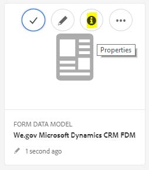
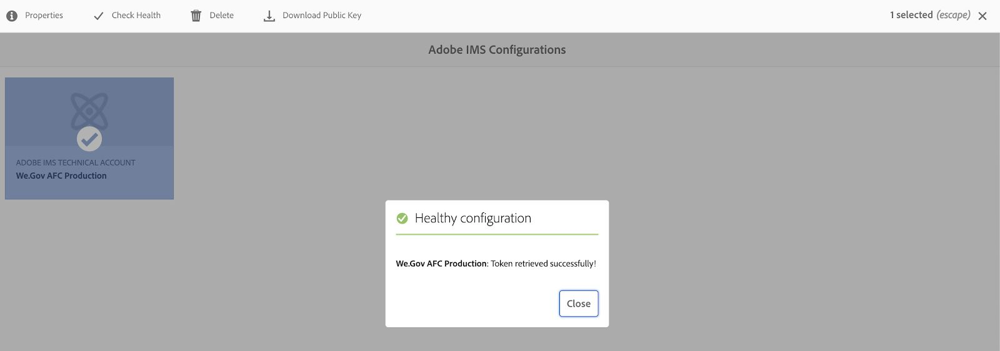
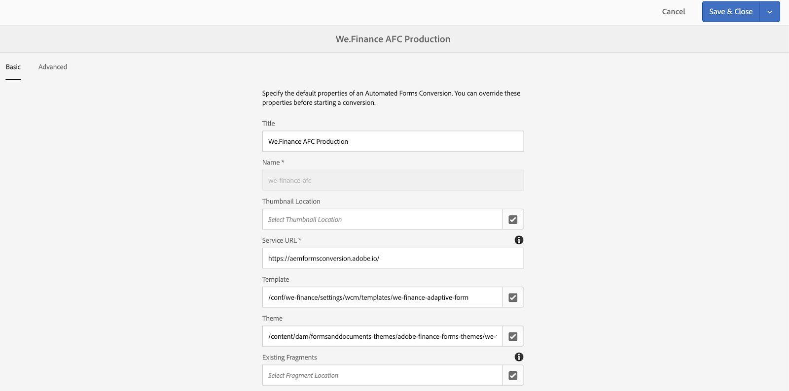
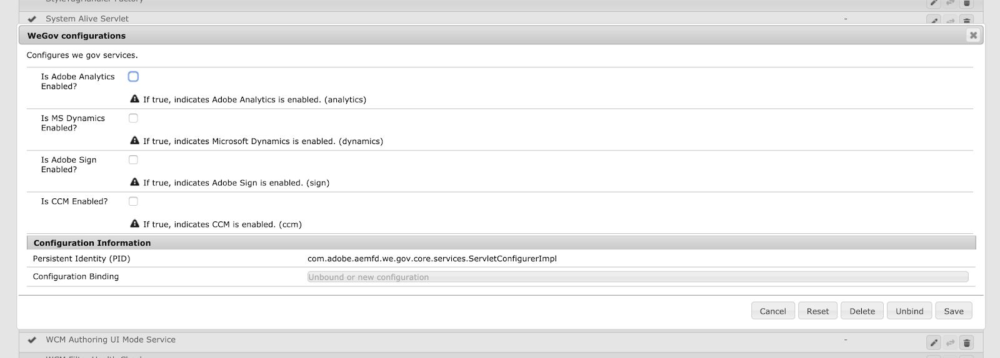

# Impostare e configurare il sito di riferimento We.Gov e We.Finance {#set-up-and-configure-we-gov-reference-site}

## Dettagli pacchetto demo {#demo-package-details}

### Prerequisiti per l’installazione {#installation-prerequisites}

Questo pacchetto è stato creato per **AEM Forms 6.4 OSGI Author**, è stato testato ed è pertanto supportato dalle seguenti versioni di piattaforma:

| VERSIONE AEM | VERSIONE PACCHETTO AEM FORMS | STATO |
|---|---|---|
| 6.4 | 5.0.86 | **Funzione supportata** |
| 6.5 | 6.0.80 | **Funzione supportata** |
| 6.5.3 | 6.0.122 | **Funzione supportata** |

Questo pacchetto contiene una configurazione cloud che supporta le seguenti versioni della piattaforma:

| PROVIDER CLOUD | VERSIONE SERVIZIO | STATO |
|---|---|---|
| Adobe Sign | API v5 | **Funzione supportata** |
| Microsoft® Dynamics 365 | 1710 (9.1.0.3020) | **Funzione supportata** |
| Adobe Analytics | API Rest v1.4 | **Funzione supportata** |
**Considerazioni sull’installazione del pacchetto:**

* Il pacchetto deve essere installato su un server pulito, senza altri pacchetti demo o versioni di pacchetti demo precedenti
* Il pacchetto deve essere installato su un server OSGI, in esecuzione in modalità Creazione

### Cosa include questo pacchetto {#what-does-this-package-include}

Il [Pacchetto dimostrativo We.Gov per AEM Forms](https://experience.adobe.com/#/downloads/content/software-distribution/en/aem.html?package=/content/software-distribution/en/details.html/content/dam/aem/public/adobe/packages/cq650/featurepack/we-gov-forms.pkg.all-2.0.2.zip) (**we-gov-forms.pkg.all-&lt;version>.zip**) viene fornito come pacchetto che include diversi altri pacchetti secondari e servizi. Il pacchetto include i seguenti moduli:

* **we-gov-forms.pkg.all-&lt;version>.zip** - *Pacchetto demo completo*

   * **we-gov-forms.ui.apps-&lt;version>.zip** *: contiene tutti i componenti, le librerie client, gli utenti di esempio, i modelli di flusso di lavoro e così via.*

      * **we-gov-forms.core-&lt;version>.jar** - *Contiene tutti i servizi OSGI, l’implementazione personalizzata dei passaggi del flusso di lavoro e così via.*

      * **we-gov-forms.derby&lt;version>.jar** - *Contiene tutti i servizi OSGI, lo schema del database e così via.*

      * **core.wcm.components.all-2.0.4.zip** - *Raccolta di esempi di componenti WCM*

      * **grid-aem.ui.apps-1.0-SNAPSHOT.zip** - *Pacchetto di layout Griglia AEM Sites per il controllo colonna della pagina Sites*

   * **we-gov-forms.ui.content-&lt;version>.zip** - *Contiene tutti i contenuti, pagine, immagini, moduli, risorse di comunicazione interattiva e così via.*

   * **we-gov-forms.ui.analytics-&lt;version>.zip** - *Contiene tutti i dati di Forms Analytics di We.Gov da archiviare nell’archivio.*

   * **we-gov-forms.config.public-&lt;version>.zip** - *Contiene tutti i nodi di configurazione predefiniti, incluse le configurazioni cloud di segnaposto, per evitare problemi di associazione dei servizi e di modello dati di forms.*

Le risorse incluse in questo pacchetto includono:

* Pagine del sito AEM con modelli modificabili
* AEM Forms Adaptive Forms
* Comunicazioni interattive AEM Forms (stampa e canale web)
* Documento di record XDP di AEM Forms
* Modello dati AEM Forms MS® Dynamics Forms
* Integrazione di Adobe Sign
* Modello flusso di lavoro AEM
* Immagini di esempio di AEM Assets
* Esempio (In Memoria) Di Database Derby Apache
* Origine dati Apache Derby (per l’utilizzo con il modello dati del modulo)

## Installazione del pacchetto demo {#demo-package-installation}

Questa sezione contiene informazioni sull’installazione del pacchetto demo.

### Da Software Distribution {#from-software-distribution}

1. Apri [Software Distribution](https://experience.adobe.com/downloads). Per accedere a Software Distribution è necessario disporre di un Adobe ID.
1. Tocca **[!UICONTROL Adobe Experience Manager]** che si trova nel menu di intestazione.
1. In **[!UICONTROL Filtri]** sezione:
   1. Seleziona **[!UICONTROL Forms]** dal **[!UICONTROL Soluzione]** elenco a discesa.
   2. Seleziona la versione e digita per il pacchetto. È inoltre possibile utilizzare **[!UICONTROL Cerca download]** per filtrare i risultati.
1. Tocca il **we-gov-forms.pkg.all-&lt;version>.zip** nome del pacchetto, seleziona **[!UICONTROL Accetta termini EULA]**, e tocca **[!UICONTROL Scarica]**.
1. Apri [Gestione pacchetti](https://experienceleague.adobe.com/docs/experience-manager-65/administering/contentmanagement/package-manager.html?lang=it) e fai clic su **[!UICONTROL Carica pacchetto]** per caricarlo.
1. Seleziona il pacchetto e fai clic su **[!UICONTROL Installa]**.

   

1. Consenti il completamento del processo di installazione.
1. Accedi a *https://&lt;aemserver>:&lt;port>/content/we-gov/home.html?wcmmode=disabled* per verificare che l&#39;installazione sia stata eseguita correttamente.

### Da un file ZIP locale {#from-a-local-zip-file}

1. Scarica e individua la **we-gov-forms.pkg.all-&lt;version>.zip** file.
1. Accedi a *https://&lt;aemserver>:&lt;port>/crx/packmgr/index.jsp*.
1. Seleziona l’opzione &quot;Carica pacchetto&quot;.

   

1. Utilizza il browser dei file per passare al file ZIP scaricato e selezionarlo.
1. Fai clic su &quot;Apri&quot; per caricare.
1. Una volta caricato, seleziona l’opzione &quot;Installa&quot; per installare il pacchetto.

   

1. Consenti il completamento del processo di installazione.
1. Accedi a *https://&lt;aemserver>:&lt;port>/content/we-gov/home.html?wcmmode=disabled* per verificare che l&#39;installazione sia stata eseguita correttamente.

### Installazione di nuove versioni del pacchetto {#installing-new-package-versions}

Per installare una nuova versione del pacchetto, segui i passaggi definiti nelle sezioni 4.1 e 4.2. È possibile installare una versione più recente del pacchetto mentre è già installato un altro pacchetto precedente, ma si consiglia di disinstallare prima la versione precedente. Per farlo, segui la procedura indicata di seguito.

1. Accedi a *https://&lt;aemserver>:&lt;port>/crx/packmgr/index.jsp*
1. Individua la cartella **we-gov-forms.pkg.all-&lt;version>.zip** file.
1. Selezionare l&#39;opzione &quot;More&quot; (Altro).
1. Dall’elenco a discesa, seleziona l’opzione &quot;Disinstalla&quot;.

   

1. Al momento della conferma, selezionare nuovamente &quot;Disinstalla&quot; e consentire il completamento del processo di disinstallazione.

## Configurazione del pacchetto demo {#demo-package-configuration}

Questa sezione contiene dettagli e istruzioni sulla configurazione post-distribuzione del pacchetto demo prima della presentazione.

### Configurazione utente fittizia {#fictional-user-configuration}

1. Accedi a *https://&lt;aemserver>:&lt;port>/libs/granite/security/content/groupadmin.html*
1. Accedi come amministratore per eseguire le operazioni seguenti.
1. Scorri verso il basso fino alla fine della pagina per caricare tutti i gruppi di utenti.
1. Cerca &quot;**workflow**&quot;.
1. Seleziona la &quot;**workflow-users**&quot; e fare clic su &quot;Proprietà&quot;.
1. Passare alla scheda Membri.
1. Digitare in **wegov** nel campo &quot;Seleziona utente o gruppo&quot;.
1. Seleziona dal menu a discesa &quot;**Utenti Forms We.Gov**&quot;.

   

1. Fare clic su Salva e chiudi nella barra dei menu.
1. Ripeti i passaggi da 2 a 7 cercando &quot;**analisi**&quot;, selezionando &quot;**Amministratori di Analytics**&quot; e aggiungendo il &quot;**Utenti Forms We.Gov**&quot; come membro.
1. Ripeti i passaggi da 2 a 7 cercando &quot;**utenti di Forms**&quot;, selezionando &quot;**forms-power-users**&quot; e aggiungendo il &quot;**Utenti Forms We.Gov**&quot; come membro.
1. Ripeti i passaggi da 2 a 7 cercando &quot;**forms-users**&quot;, selezionando &quot;**forms-users**&quot; e questa volta aggiungendo il &quot;**Utenti We.Gov**&quot; come membro.

### Configurazione del server e-mail {#email-server-configuration}

1. Consulta la documentazione di configurazione [Configurazione delle notifiche e-mail](/help/sites-administering/notification.md)
1. Accedi come amministratore per eseguire questa attività.
1. Accedi a *https://&lt;aemserver>:&lt;port>/system/console/configMgr*
1. Individua e fai clic su **Day CQ Mail Service** servizio da configurare.

   

1. Configurare il servizio per la connessione al server SMTP desiderato:

   1. **Nome host del server SMTP**: ad esempio, (smtp.gmail.com)
   1. **Porta server**: ad esempio, (465) per gmail con SSL
   1. **Utente SMTP:** demo@ &lt;companyname> .com
   1. **Indirizzo &quot;Da&quot;**: aemformsdemo@adobe.com

   

1. Fai clic su Salva per salvare la configurazione.

### (Facoltativo) Configurazione SSL dell’AEM {#aemsslconfig}

Questa sezione contiene informazioni dettagliate sulla configurazione di SSL nell’istanza AEM per poter configurare la configurazione di Adobe Sign Cloud.

**Riferimenti:**

1. [SSL per impostazione predefinita](/help/sites-administering/ssl-by-default.md)

**Note:**

1. Passa a https://&lt;aemserver>:&lt;port>/aem/inbox dove puoi completare il processo descritto nel collegamento alla documentazione di riferimento riportato sopra.
1. Il `we-gov-forms.pkg.all-[version].zip` include una chiave SSL di esempio e un certificato a cui è possibile accedere estraendo il `we-gov-forms.pkg.all-[version].zip/ssl` cartella che fa parte del pacchetto.

1. Dettagli certificato SSL e chiave:

   1. rilasciato a &quot;CN=localhost&quot;
   1. validità di 10 anni
   1. valore password di &quot;password&quot;
1. La chiave privata è *localhostprivate.der*.
1. Il certificato è il *localhost.crt*.
1. Fai clic su Avanti.
1. Il nome host HTTPS deve essere impostato su *localhost*.
1. La porta deve essere impostata su una porta esposta dal sistema.

### (Facoltativo) Configurazione cloud Adobe Sign {#adobe-sign-cloud-configuration}

Questa sezione contiene dettagli e istruzioni sulla configurazione di Adobe Sign Cloud.

**Riferimenti:**

1. [Integrare Adobe Sign con AEM Forms](adobe-sign-integration-adaptive-forms.md)

#### Configurazione cloud {#cloud-configuration}

1. Esamina i prerequisiti. Consulta [Configurazione SSL AEM](../../forms/using/forms-install-configure-gov-reference-site.md#aemsslconfig) per la configurazione SSL richiesta.
1. Accedi a:

   *https://&lt;aemserver>:&lt;port>/libs/adobesign/cloudservices/adobesign.html/conf/we-gov*

   >[!NOTE]
   >
   >L’URL utilizzato per accedere al server AEM deve corrispondere a quello configurato nell’URI di reindirizzamento di Adobe Sign OAuth per evitare problemi di configurazione (ad esempio, *https://&lt;aemserver>:&lt;port>/mnt/overlay/adobesign/cloudservices/adobesign/properties.html*)

1. Seleziona la configurazione &quot;We.gov Adobe Sign&quot;.
1. Fare clic su Proprietà.
1. Passare alla scheda Impostazioni.
1. Inserisci l’URL OAuth, ad esempio: [https://secure.na1.echosign.com/public/oauth](https://secure.na1.echosign.com/public/oauth)
1. Specifica l’ID client e il segreto client configurati dall’istanza Adobe Sign configurata.
1. Fai clic su &quot;Connetti ad Adobe Sign&quot;.
1. Una volta stabilita la connessione, fare clic su Salva e chiudi per completare l&#39;integrazione.

### (Facoltativo) Configurazione cloud MS® Dynamics {#ms-dynamics-cloud-configuration}

Questa sezione contiene dettagli e istruzioni sulla configurazione di MS® Dynamics Cloud.

**Riferimenti:**

1. [Microsoft](/help/forms/using/ms-dynamics-odata-configuration.md)
1. [Configurazione di Microsoft® Dynamics per AEM Forms](https://experienceleague.adobe.com/docs/experience-manager-learn/forms/adaptive-forms/using-ms-dynamics-with-aem-forms.html)

#### Servizio cloud MS® Dynamics OData {#ms-dynamics-odata-cloud-service}

1. Accedi a:

   https://&lt;aemserver>:&lt;port>/libs/fd/fdm/gui/components/admin/fdmcloudservice/fdm.html/conf/we-gov

   1. Assicurati di accedere al server utilizzando lo stesso URL di reindirizzamento configurato nella registrazione dell’applicazione MS® Dynamics.

1. Selezionare la configurazione &quot;Cloud Service Microsoft® Dynamics OData&quot;.
1. Fare clic su Proprietà.

   

1. Passare alla scheda Impostazioni autenticazione.
1. Immetti i seguenti dettagli:

   1. **Directory principale servizio:** ad esempio: `https://msdynamicsserver.api.crm3.dynamics.com/api/data/v9.1/`
   1. **Tipo di autenticazione:** OAuth 2.0
   1. **Impostazioni di autenticazione** (vedere [Impostazioni di configurazione cloud MS® Dynamics](../../forms/using/forms-install-configure-gov-reference-site.md#dynamicsconfig) per raccogliere queste informazioni):

      1. ID client, detto anche ID applicazione
      1. Segreto client
      1. URL OAuth - ad esempio, [https://login.microsoftonline.com/common/oauth2/authorize](https://login.microsoftonline.com/common/oauth2/authorize)
      1. Aggiorna URL token: ad esempio, [https://login.windows.net/common/oauth2/token](https://login.windows.net/common/oauth2/token)
      1. URL token di accesso: ad esempio, [https://login.windows.net/common/oauth2/token](https://login.windows.net/common/oauth2/token)
      1. Ambito autorizzazione - **openid**
      1. Intestazione autenticazione - **Bearer autorizzazione**
      1. Risorsa: ad esempio, `https://msdynamicsserver.api.crm3.dynamics.com`

   1. Fai clic su &quot;Connetti a OAuth&quot;.

1. Dopo aver eseguito correttamente l’autenticazione, fai clic su &quot;Salva e chiudi&quot; per completare l’integrazione.

#### Impostazioni di configurazione cloud MS® Dynamics {#dynamicsconfig}

I passaggi descritti in questa sezione sono inclusi per individuare l’ID client, il segreto client e i dettagli dell’istanza di MS® Dynamics Cloud.

1. Accedi a [https://portal.azure.com/](https://portal.azure.com/) e accesso.
1. Dal menu di sinistra, selezionare &quot;All Services&quot;.
1. Cerca o passa a &quot;Registrazione app&quot;.
1. Crea o seleziona una registrazione applicazione esistente.
1. Copia il **ID applicazione** da utilizzare come OAuth **ID client** nella configurazione cloud AEM
1. Fai clic su &quot;Impostazioni&quot; o &quot;Manifesto&quot; per configurare il **URL di risposta.**

   1. Questo URL deve corrispondere all&#39;URL utilizzato per accedere al server AEM durante la configurazione del servizio OData.

1. Nella vista Setting (Impostazioni), fai clic su &quot;Keys&quot; (Chiavi) per visualizzare la nuova chiave (utilizzata come Segreto client nell’AEM).

   1. Assicurati di conservare una copia della chiave in quanto non potrai visualizzarla in seguito in Azure o AEM.

1. Per individuare l’URL della risorsa o l’URL principale del servizio, passa al dashboard dell’istanza di MS® Dynamics.
1. Nella barra di navigazione superiore, fai clic su &quot;Vendite&quot; o sul tipo di istanza personale e su &quot;Seleziona impostazioni&quot;.
1. Fai clic su &quot;Personalizzazioni&quot; e &quot;Risorse per sviluppatori&quot; in basso a destra.
1. L’URL principale del servizio è, ad esempio:

   *`https://msdynamicsserver.api.crm3.dynamics.com/api/data/v9.1/`

1. I dettagli sull’URL del token di accesso e aggiornamento sono disponibili qui:

   *[https://learn.microsoft.com/en-us/rest/api/datacatalog/authenticate-a-client-app](https://learn.microsoft.com/en-us/rest/api/datacatalog/authenticate-a-client-app)*

#### Test del modello dati di Forms (Dynamics) {#testing-the-form-data-model}

Una volta completata la configurazione cloud, potrebbe essere utile testare il modello dati del modulo.

1. Accedi a

   *https://&lt;aemserver>:&lt;port>/aem/forms.html/content/dam/formsanddocuments-fdm/we-gov*

1. Selezionare &quot;We.gov Microsoft® Dynamics CRM FDM&quot; e selezionare &quot;Proprietà&quot;.

   

1. Passare alla scheda &quot;Aggiorna origine&quot;.
1. Assicurati che &quot;Context-Aware Configuration&quot; sia impostato su &quot;/conf/we-gov&quot; e che l’origine dati configurata sia &quot;ms-dynamics-odata-cloud-service&quot;.

   

1. Modifica il modello dati del modulo.

1. Verificare che i servizi si connettano correttamente all&#39;origine dati configurata.

   >[!NOTE]
   >
   Dopo aver testato i servizi, fai clic su **Annulla** per garantire che le modifiche involontarie non vengano propagate al modello dati del modulo.

   >[!NOTE]
   >
   È stato segnalato che era necessario riavviare il server AEM affinché l’origine dati potesse essere associata correttamente a FDM.

#### Test del modello dati di Forms (Derby) {#test-fdm-derby}

Una volta completata la configurazione cloud, potrebbe essere utile testare il modello dati dei moduli.

1. Accedi a *https://&lt;aemserver>:&lt;port>/aem/forms.html/content/dam/formsanddocuments-fdm/we-gov*

1. Seleziona la **FDM iscrizione We.gov** e seleziona **Proprietà**.

   

1. Accedi a **Aggiorna origine** scheda.

1. Assicurati che **Configurazione in base al contesto** è impostato su `/conf/we-gov` e che l’origine dati configurata sia **Derby We.Gov DS**.

   

1. Fai clic su **Salva e chiudi**.

1. [Test dei servizi](work-with-form-data-model.md#test-data-model-objects-and-services) per verificare che si connettano correttamente all’origine dati configurata

   * Per verificare la connessione, selezionare **HOME** e fornisci un servizio di recupero. Eseguire il test del servizio e gli amministratori di sistema possono visualizzare i dati recuperati.

### Configurazione Adobe Analytics (opzionale) {#adobe-analytics-configuration}

Questa sezione contiene dettagli e istruzioni sulla configurazione di Adobe Analytics Cloud.

**Riferimenti:**

* [Integrazione con Adobe Analytics](../../sites-administering/adobeanalytics.md)

* [Connessione ad Adobe Analytics e creazione di framework](../../sites-administering/adobeanalytics-connect.md)

* [Visualizzazione dei dati di analisi delle pagine](../../sites-authoring/pa-using.md)

* [Configurazione di analisi e rapporti](configure-analytics-forms-documents.md)

* [Visualizzare e comprendere i rapporti di AEM Forms Analytics](view-understand-aem-forms-analytics-reports.md)

### Configurazione del servizio Adobe Analytics Cloud {#adobe-analytics-cloud-service-configuration}

Questo pacchetto è preconfigurato per la connessione ad Adobe Analytics. I passaggi seguenti sono forniti per consentire l’aggiornamento di questa configurazione.

1. Accedi a *https://&lt;aemserver>:&lt;port>/libs/cq/core/content/tools/cloudservices.html*
1. Individua la sezione Adobe Analytics e seleziona il collegamento &quot;Mostra configurazioni&quot;.
1. Seleziona la configurazione &quot;We.Gov Adobe Analytics (Analytics Configuration)&quot;.

   

1. Fai clic sul pulsante &quot;Modifica&quot; per aggiornare la configurazione di Adobe Analytics (devi fornire il segreto condiviso). Fai clic su &quot;Connetti ad Analytics&quot; per connetterti e su &quot;OK&quot; per completare.

   

1. Dalla stessa pagina, fai clic su &quot;We.Gov Adobe Analytics Framework (Analytics Framework)&quot; se desideri aggiornare le configurazioni del framework (consulta [Abilita creazione AEM](../../forms/using/forms-install-configure-gov-reference-site.md#enableauthoring) per abilitare l&#39;authoring).

#### Adobe Analytics - Individuazione delle credenziali utente {#analytics-locating-user-credentials}

Per individuare le credenziali utente per un account Adobe Analytics, l’amministratore dell’account deve eseguire le seguenti attività.

1. Passa al portale Adobe Experience Cloud.
   * Accedi con le credenziali di amministratore
1. Seleziona l’icona Adobe Analytics nel dashboard principale.
   
1. Passa alla scheda Amministratore e seleziona l’elemento Gestione utente (legacy).
   
1. Seleziona la **Utenti** scheda.
   
1. Seleziona l’utente desiderato dall’elenco degli utenti.
1. Scorri fino alla parte inferiore della pagina e le informazioni di autenticazione degli utenti verranno visualizzate nella parte inferiore della pagina.
   
1. Il nome utente e le informazioni segrete condivise vengono visualizzati sul lato destro della casella delle autorizzazioni.
1. Il nome utente contiene due punti, tutte le informazioni a sinistra dei due punti sono il nome utente e tutte le informazioni a destra dei due punti sono il nome dell’azienda.
   * Ecco un esempio: *nome utente : nome società*

#### Configurare l’autenticazione utente in Adobe Analytics {#setup-user-authentication}

Gli amministratori possono fornire agli utenti le autorizzazioni per l’analisi dell’AEM eseguendo le azioni seguenti.

1. Passa a Adobe Admin Console.

1. Fai clic sull’istanza di Analytics esposta all’Admin Console.

   * Si trova nella pagina principale della pagina di amministrazione.

1. Seleziona Accesso completo come amministratore di Analytics.

1. Aggiungi un utente al profilo.

   

1. Una volta mappato l’ID utente nel profilo, fai clic sulla scheda delle autorizzazioni.

1. Assicurati che tutte le autorizzazioni siano mappate sul profilo.

   

1. Una volta mappate le autorizzazioni, la possibilità per un utente di effettuare l’accesso potrebbe richiedere alcune ore.

### Reportistica di Adobe Analytics {#adobe-analytics-reporting}

#### Visualizza rapporti sui siti di Adobe Analytics {#view-adobe-analytics-sites-reporting}

>[!NOTE]
>
I dati di AEM Forms Analytics sono disponibili offline o senza una configurazione Adobe Analytics Cloud se `we-gov-forms.ui.analytics-<version>.zip` il pacchetto è installato, ma i dati di AEM Sites richiedono una configurazione cloud attiva.

1. Accedi a *https://&lt;aemserver>:&lt;port>/sites.html/content*
1. Seleziona il &quot;Sito We.Gov di AEM Forms&quot; per visualizzare le pagine del sito.
1. Seleziona una delle pagine del sito (ad esempio Home) e scegli &quot;Analytics &amp; Recommendations&quot;.

   

1. In questa pagina vengono visualizzate le informazioni recuperate da Adobe Analytics relative alla pagina di AEM Sites (nota: per progettazione queste informazioni vengono periodicamente aggiornate da Adobe Analytics e non vengono visualizzate in tempo reale).

   

1. Tornando alla pagina di visualizzazione della pagina (a cui si accede al punto 3), è possibile visualizzare le informazioni di visualizzazione della pagina modificando l&#39;impostazione di visualizzazione in modo da visualizzare gli elementi nella &quot;Vista a elenco&quot;.
1. Individuare il menu a discesa &quot;View&quot; (Visualizza) e selezionare &quot;List View&quot; (Vista elenco).

   

1. Nello stesso menu, selezionare &quot;View Setting&quot; (Impostazioni visualizzazione) e selezionare le colonne da visualizzare dalla sezione &quot;Analytics&quot;.

   

1. Fai clic su &quot;Aggiorna&quot; per rendere disponibili le nuove colonne.

   

#### Visualizzare i rapporti di Adobe Analytics Forms {#view-adobe-analytics-forms-reporting}

>[!NOTE]
>
I dati di AEM Forms Analytics sono disponibili offline o senza una configurazione Adobe Analytics Cloud se `we-gov-forms.ui.analytics-<version>.zip` il pacchetto è installato, ma i dati di AEM Sites richiedono una configurazione cloud attiva.

1. Accedi a

   *https://&lt;aemserver>:&lt;port>/aem/forms.html/content/dam/formsanddocuments/adobe-gov-forms*

1. Seleziona il modulo adattivo &quot;Applicazione di iscrizione per benefici per la salute&quot; e seleziona l’opzione &quot;Rapporto di Analytics&quot;.

   

1. Attendi il caricamento della pagina e visualizza i dati del rapporto di Analytics.

   

### Adobe di abilitazione della configurazione di Automated Forms {#automated-forms-enablement}

Per installare e configurare AEM Forms con Adobe Forms, gli utenti dello strumento di conversione devono disporre dei seguenti elementi.

1. Accesso ad Adobe Developer.

1. Autorizzazione per la creazione di un’integrazione con il servizio Adobe Forms Conversion.

1. Adobe AEM 6.5: service pack più recente in esecuzione come autore.

Prima di leggere ulteriori istruzioni, leggere quanto segue:

* [Configurazione del servizio di conversione automatica dei moduli](https://experienceleague.adobe.com/docs/aem-forms-automated-conversion-service/using/configure-service.html?lang=it)

#### Creazione di una configurazione IMS Parte 1 {#creating-ims-config}

Per configurare il servizio in modo da comunicare correttamente con lo strumento di conversione moduli, gli utenti devono configurare il servizio Identity Management System (IMS) per la registrazione ad Adobe I/O.

1. Passa a https://&lt;aemserver>:&lt;port> > Fai clic su Adobe Experience Manager in alto a sinistra > Strumenti > Sicurezza > Configurazione Adobe IMS.

1. Fai clic su Crea.

1. Effettua le azioni riportate nell’immagine seguente.

   

1. Assicurati di scaricare il certificato.

1. Non procedere con il resto della configurazione - sezione Revisione [Creazione dell’integrazione in Adobe I/O](#create-integration-adobeio)

>[!NOTE]
>
Il certificato creato in questa sezione verrà utilizzato per creare il servizio di integrazione in Adobe I/O. Dopo che gli utenti hanno creato nel servizio di integrazione possono utilizzare tali informazioni da Adobe I/O per completare la configurazione.

#### Creazione dell’integrazione in Adobe I/O {#create-integration-adobeio}

Se non contatti l’amministratore di Adobe, assicurati di poter creare un’integrazione all’interno del dominio di esempio.

1. Accedi a [Console Adobi I/O](https://developer.adobe.com/console/).

1. Fai clic su Create Integration (Crea integrazione).

1. Seleziona Accedi a un’API.

1. Assicurati di essere nel gruppo corretto (elenco a discesa in alto a destra).

1. Nella sezione Experience Cloud, seleziona Forms Conversion Tool.

1. Fai clic su Continua.

1. Immetti il nome e la descrizione dell’integrazione.

1. Utilizzando la chiave pubblica di cui alla sezione 2.1, inseriscila all’interno dell’integrazione della chiave.

1. Seleziona un profilo per il automated forms conversion.

   

#### Creazione della configurazione IMS - Parte 2 {#create-ims-config-part-next}

Ora che hai creato un’integrazione, completiamo l’installazione della configurazione IMS.

1. Fai clic sull’integrazione in Adobe I/O per esporre i dettagli della connessione.

1. Passare alla configurazione IMS in AEM (Strumenti > Sicurezza > IMS)

1. Fai clic su Avanti nella schermata Configurazione IMS.

1. Immetti il server di autorizzazione (il valore visualizzato nella schermata).

1. Immetti la chiave API.

1. Inserisci il segreto del client (per visualizzarlo, fai clic su esponi sull’integrazione nell’Adobe I/O ).

1. Fai clic sulla scheda JWT nell’Adobe I/O per ottenere il payload JWT e incollarlo nel payload della configurazione IMS.

   

1. Una volta creata la configurazione IMS, fai clic su Configurazione IMS e seleziona Verifica stato. Gli utenti dovrebbero visualizzare il seguente risultato.

   

#### Configurare la configurazione cloud (produzione AFC We.Gov) {#configure-cloud-configuration}

Una volta completata la configurazione IMS, puoi procedere con la revisione della configurazione cloud in AEM. Se la configurazione non esiste, procedi come segue per creare la configurazione cloud in AEM:

1. Apri il browser e passa all’URL di sistema https://&lt;domain_name>:&lt;system_port>

1. Fai clic su Adobe Experience Manager nell’angolo in alto a sinistra della schermata > Strumenti > Cloud Service > Configurazione conversazione automatica Forms.

1. Seleziona la cartella di configurazione in cui desideri inserire la configurazione.

1. Fai clic su Crea.

1. Inserisci le informazioni nella schermata seguente.

   

1. Fornisci alla configurazione un Titolo e un Nome.

1. L&#39;URL del servizio per il sistema è impostato su https://aemformsconversion.adobe.io/.

1. URL modello */conf/we-gov/settings/wcm/templates/we-gov-flamingo-template*.

1. URL tema: */content/dam/formsanddocuments-theme/adobe-gov-forms-theme/we-gov-theme*

1. Fai clic su Avanti.

1. Per questa configurazione, abbiamo lasciato vuoti i due valori delle caselle di controllo.

   * Per ulteriori informazioni su queste opzioni, consulta [Configurare il servizio cloud](https://experienceleague.adobe.com/docs/aem-forms-automated-conversion-service/using/configure-service.html#configure-the-cloud-service).

#### Configurare la configurazione cloud (produzione AFC We.Finance) {#configure-cloud-configuration-wefinance}

Una volta completata la configurazione IMS, possiamo procedere alla creazione della configurazione cloud in AEM.

1. Apri il browser e passa all’URL di sistema https://&lt;domain_name>:&lt;system_port>

1. Fai clic su Adobe Experience Manager nell’angolo in alto a sinistra della schermata > Strumenti > Cloud Service > Configurazione conversazione automatica Forms.

1. Seleziona la cartella di configurazione in cui desideri inserire la configurazione.

1. Fai clic su Crea.

1. Inserisci le informazioni nella schermata seguente.

   

1. Fornisci alla configurazione un Titolo e un Nome.

1. L&#39;URL del servizio per il sistema è impostato su https://aemformsconversion.adobe.io/

1. URL modello: */conf/we-finance/settings/wcm/templates/we-finance-adaptive-form*

1. URL tema: */content/dam/formsanddocuments-theme/adobe-finance-forms-theme/we-finance-theme*

1. Fai clic su Avanti.

1. Per questa configurazione, abbiamo lasciato vuoti i due valori delle caselle di controllo.

   * Per ulteriori informazioni su queste opzioni, consulta [Configurare il servizio cloud](https://experienceleague.adobe.com/docs/aem-forms-automated-conversion-service/using/configure-service.html#configure-the-cloud-service).

#### Verifica della conversione dei moduli (applicazione di iscrizione We.Gov) {#test-forms-conversion}

Una volta configurata la configurazione, gli utenti possono testarla caricando un documento PDF.

1. Passa al sistema AEM https://&lt;domain_name>:&lt;system_port>

1. Fai clic su Forms > Forms &amp; Documents > AEM Forms We.gov Forms > AFC.

1. Seleziona il PDF dell&#39;applicazione di registrazione We.Gov.

1. Clic **Avvia conversione automatica** in alto a destra.

1. Gli utenti dovrebbero essere in grado di visualizzare l’opzione come mostrato di seguito.

   

1. Dopo aver selezionato il pulsante, agli utenti vengono visualizzate le seguenti opzioni

   * Assicurati che gli utenti selezionino *Produzione AFC We.Gov* configurazione

   

   

1. Seleziona avvia conversione dopo aver configurato tutte le opzioni che desideri utilizzare.

1. All’inizio del processo di conversione, gli utenti dovrebbero visualizzare la seguente schermata:

   

1. Al termine della conversione, gli utenti visualizzeranno la seguente schermata:

   

   Fai clic su **Output** per visualizzare il modulo adattivo generato.

#### Problemi noti e note {#known-issues-notes}

Il servizio di Automated forms conversion include alcuni [best practice, pattern complessi noti](https://experienceleague.adobe.com/docs/aem-forms-automated-conversion-service/using/styles-and-pattern-considerations-and-best-practices.html), e [problemi noti](https://experienceleague.adobe.com/docs/aem-forms-automated-conversion-service/using/known-issues.html). Rivedi questi elementi prima di iniziare a utilizzare il servizio AEM Forms Automated forms conversion.

1. Genera il modulo con Genera moduli adattivi senza associazioni di dati abilitate se desideri associare il modulo a un FDM dopo la conversione.

1. Assicurati che nella cartella dei modelli sia abilitata l’autorizzazione jcr:read for Everyone, altrimenti l’utente del servizio non sarà in grado di leggere il modello dall’archivio e la conversione non riuscirà.

## Personalizzazioni dei pacchetti demo {#demo-package-customizations}

Questa sezione include istruzioni sulla personalizzazione della demo.

### Personalizzazione dei modelli {#templates-customization}

I modelli modificabili si trovano nella posizione seguente:

*https://&lt;aemserver>:&lt;port>/libs/wcm/core/content/sites/templates.html/conf/we-gov*

Questi modelli includono il sito AEM, il modulo adattivo e i modelli di comunicazione interattiva, creati e assemblati con i componenti reperibili all’indirizzo:

*https://&lt;aemserver>:&lt;port>/crx/de/index.jsp#/apps/we-gov/components*

#### Sistema di stili {#customizetemplates}

Questo sito include anche librerie client, una delle quali importa Bootstrap 4 ( [https://getbootstrap.com/](https://getbootstrap.com/) ). Questa libreria client è disponibile all&#39;indirizzo

*https://&lt;aemserver>:&lt;port>/crx/de/index.jsp#/apps/we-gov/clientlibs/clientlib-base/css/bootstrap*

I modelli modificabili inclusi in questo pacchetto sono anche preconfigurati con criteri di modello/pagina che utilizzano le classi CSS Bootstrap 4 per l’impaginazione, lo stile e così via. Non tutte le classi sono state aggiunte ai criteri del modello, ma è possibile aggiungere ai criteri qualsiasi classe supportata dalla Bootstrap 4. Per un elenco delle classi disponibili, consulta la pagina guida introduttiva:

[https://getbootstrap.com/docs/4.1/getting-started/introduction/](https://getbootstrap.com/docs/4.1/getting-started/introduction/)

I modelli inclusi in questo pacchetto supportano anche il sistema di stili:

[Sistema di stili](../../sites-authoring/style-system.md)

#### Logo dei modelli {#template-logos}

Il progetto DAM Assets include anche loghi e immagini We.Gov. Queste risorse sono disponibili all’indirizzo:

*https://&lt;aemserver>:&lt;port>/assets.html/content/dam/we-gov*

Quando si modificano i modelli di pagina e modulo, si può scegliere di aggiornare i loghi dei marchi modificando i componenti Navigazione e Piè di pagina. Questi componenti offrono una finestra di dialogo configurabile per marchio e logo da utilizzare per aggiornare i logo:

Per ulteriori informazioni, consulta Modifica del contenuto di una pagina:

[Modifica del contenuto di una pagina](../../sites-authoring/editing-content.md)

### Personalizzazione delle pagine dei siti {#sites-pages-customization}

Tutte le pagine del sito sono disponibili da: *https://&lt;aemserver>:&lt;port>/sites.html/content/we-gov*

Queste pagine del sito utilizzano anche il pacchetto AEM Grid per controllare il layout di alcuni componenti.

#### Sistema di stili {#style-system}

Le pagine incluse in questo pacchetto supportano anche il sistema di stili:

[Sistema di stili](../../sites-authoring/style-system.md)

Puoi anche vedere [Sistema di stili di personalizzazione dei modelli](../../forms/using/forms-install-configure-gov-reference-site.md#customizetemplates) per la documentazione sugli stili supportati

### Personalizzazione dei moduli adattivi {#adaptive-forms-customization}

Tutti i moduli adattivi sono disponibili da:

*https://&lt;aemserver>:&lt;port>/aem/forms.html/content/dam/formsanddocuments/adobe-gov-forms*

Questi moduli possono essere personalizzati per adattarsi a determinati casi d’uso. Alcuni campi e la logica di invio non devono essere modificati per garantire il corretto funzionamento del modulo. Ciò include:

**Domanda Di Iscrizione Per I Benefici Sanitari:**

* contact_id - Campo nascosto utilizzato per ricevere l’ID contatto di MS® Dynamics durante l’invio
* Invia: la logica del pulsante Invia richiede la personalizzazione per supportare i callback. La personalizzazione è documentata, ma era necessario uno script di grandi dimensioni per inviare il modulo durante l’esecuzione di un’operazione POST e GET a MS® Dynamics tramite il modello dati di Forms.
* Pannello principale - L’evento Initialize viene utilizzato per aggiungere un pulsante MS® Dynamics alla casella in entrata dell’AEM nel modo meno intrusivo possibile, poiché tutti i componenti dell’interfaccia utente Granite della casella in entrata dell’AEM non sono modificabili.

#### Stile modulo adattivo {#adaptive-form-styling}

Lo stile dei moduli adattivi può essere impostato anche utilizzando l’Editor di stile o l’Editor tema:

* [Stile in linea dei componenti di moduli adattivi](inline-style-adaptive-forms.md)
* [Creazione e utilizzo di temi](themes.md)

### Personalizzazione del flusso di lavoro {#workflow-customization}

Il modulo adattivo di iscrizione viene inviato a un flusso di lavoro OSGI per l’elaborazione. Questo flusso di lavoro è disponibile all’indirizzo *https://&lt;aemserver>:&lt;port>/conf/we-gov/settings/models/we-gov-process.html*.

A causa di alcune limitazioni, questo flusso di lavoro contiene diversi script e passaggi di processo del flusso di lavoro OSGI personalizzati. Questi passaggi del flusso di lavoro sono stati creati come passaggi generici e non sono stati creati con le finestre di dialogo di configurazione. Attualmente, la configurazione dei passaggi del flusso di lavoro si basa sugli argomenti del processo.

Tutto il codice Java™ del passaggio del flusso di lavoro è contenuto nel **we-gov-forms.core-&lt;version>.jar** pacchetto.

## Considerazioni sulla demo e problemi noti {#demo-considerations-and-known-issues}

Questa sezione contiene informazioni sulle funzioni demo e sulle decisioni di progettazione che possono richiedere considerazioni speciali durante il processo di dimostrazione.

### Considerazioni sulla demo {#demo-considerations}

* In base all’AGRS-159, accertati che il nome (primo, secondo e ultimo) del contatto utilizzato nel modulo adattivo di iscrizione sia univoco.
* Il modulo adattivo di iscrizione invierà l’e-mail di Adobe Sign all’e-mail specificata nel campo e-mail del modulo. Tale indirizzo e-mail non può essere lo stesso indirizzo utilizzato per configurare la configurazione cloud di Adobe Sign.

### Problemi noti {#known-issues}

* (AGRS-120) Al momento il componente Navigazione sito non supporta le pagine figlie nidificate con una profondità superiore a due livelli.
* (AGRS-159) L’FDM di MS® Dynamics corrente deve eseguire prima due operazioni, eseguire il POST dei dati del modulo adattivo di iscrizione a Dynamics e quindi recuperare il record utente per recuperare l’ID contatto. Nello stato corrente, il recupero dell’ID contatto non riesce se in Dynamics sono presenti più di due utenti con lo stesso nome, il che non consente l’invio del modulo adattivo di iscrizione.

## Configurazione del test di accessibilità {#configure-accessibility-testing}

### Abilitazione del test di accessibilità del componente aggiuntivo Chrome {#enable-chrome-add-on}

Per eseguire il test di accessibilità, installa il plug-in Chrome disponibile qui `https://chrome.google.com/webstore/detail/accessibility-developer-t/fpkknkljclfencbdbgkenhalefipecmb?hl=en`. <!-- This URL is a 404. As such, fix and update this entire topic. We ought not to be writing about third-party software that we have no control over to avoid these 404s. Consider making this topic entirely generic and leaving it up to the user to choose their own Accessibility Testing add-on. -->

Dopo l’installazione, carica la pagina da testare nel browser Chrome (nota: l’apertura di più schede può influire sul punteggio, è preferibile aprirne una sola). Una volta caricata la pagina, **clic con il pulsante destro del mouse** sulla pagina e seleziona **Audit** scheda. In questa sezione gli sviluppatori possono selezionare il tipo di controllo di audit che deve essere eseguito dal plug-in Accessibilità. Dopo aver selezionato tutte le opzioni desiderate, l’utente può fare clic sul pulsante Genera rapporto. Questo genera un documento PDF che mostra la valutazione complessiva dell’accessibilità e cosa può essere utilizzato per aumentarla complessivamente.

Dopo l’esecuzione del rapporto, gli utenti potranno visualizzare quanto segue:

Il numero visualizzato davanti agli utenti è la valutazione complessiva dell’accessibilità acquisita. È inoltre disponibile una descrizione del metodo di calcolo seguito al punteggio.

Se gli utenti desiderano esportare questo file, possono fare clic sui tre pulsanti a destra dello schermo e selezionare tra le altre opzioni offerte dal plug-in.

### Tema Ultramarine {#ultramarine-theme}

Il tema Ultramarine pubblicamente disponibile mantenuto da Adobe è incorporato nel
`we-gov-forms.pkg.all-<version>.zip` file ZIP installabile. Una volta installato il pacchetto con CRX.

Gestione pacchetti, gli utenti possono accedere al tema Ultramarine in AEM Forms passando a **Forms** > **Temi** > **Temi di riferimento** > **Ultramarine-Accessibile**.

## Opzioni di configurazione {#configuration-options}

Gli utenti possono configurare varie opzioni del servizio del flusso di lavoro, tra cui:

1. Voce Microsoft® Dynamics
1. Adobe Sign
1. Gestione personalizzata delle comunicazioni AEM
1. Adobe Analytics

Per configurarli in modo che siano abilitati all’interno del flusso di lavoro, gli utenti devono eseguire le seguenti attività.

1. Passa a https://&#39;[server]:[porta]&#39;/system/console/configMgr.

1. Individua il *Configurazioni WeGov*.

1. Apri la definizione del servizio e abilita i servizi selezionati da richiamare all’interno del flusso di lavoro.

   >[!NOTE]
   >
   Solo perché un utente abilita il servizio all’interno della pagina di Configuration Manager, gli utenti devono comunque impostare una configurazione del servizio per comunicare con i servizi esterni richiesti.

   

1. Al termine, fai clic su Salva per salvare le impostazioni.

## Passaggi successivi {#next-steps}

Ora è possibile esplorare il sito di riferimento We.Gov. Per ulteriori informazioni sul flusso di lavoro e sui passaggi del sito di riferimento We.Gov, consulta [Procedura dettagliata sul sito di riferimento We.Gov](../../forms/using/forms-gov-reference-site-user-demo.md).
