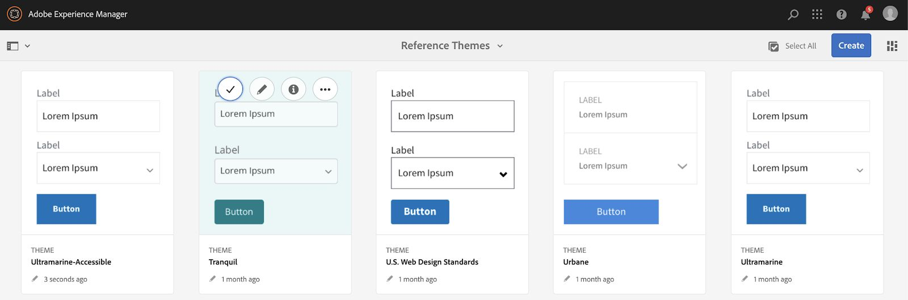

# Configurare e configurare il sito di riferimento We.Gov e We.Finance {#set-up-and-configure-we-gov-reference-site}

## Dettagli del pacchetto demo {#demo-package-details}

### Prerequisiti per l’installazione {#installation-prerequisites}

Il pacchetto è stato creato per **Autore di AEM Forms 6.4 OSGI**, è stato testato ed è pertanto supportato nelle seguenti versioni della piattaforma:

| VERSIONE AEM | VERSIONE DEL PACCHETTO AEM FORMS | STATO |
|---|---|---|
| 6.4 | 5.0.86 | **Funzione supportata** |
| 6.5 | 6.0.80 | **Funzione supportata** |
| 6.5.3 | 6.0.122 | **Funzione supportata** |

Questo pacchetto contiene la configurazione cloud che supporta le seguenti versioni della piattaforma:

| FORNITORE CLOUD | VERSIONE DEL SERVIZIO | STATO |
|---|---|---|
| Adobe Sign | API v5 | **Funzione supportata** |
| Microsoft Dynamics 365 | 1710 (9.1.0.3020) | **Funzione supportata** |
| Adobe Analytics | API per il resto v1.4 | **Funzione supportata** |
**Considerazioni sull’installazione del pacchetto:**

* Il pacchetto deve essere installato su un server pulito, privo di altri pacchetti demo o versioni precedenti del pacchetto demo
* Il pacchetto deve essere installato su un server OSGI, in esecuzione in modalità Autore

### Cosa include questo pacchetto {#what-does-this-package-include}

La [Pacchetto dimostrativo AEM Forms We.Gov](https://experience.adobe.com/#/downloads/content/software-distribution/en/aem.html?package=/content/software-distribution/en/details.html/content/dam/aem/public/adobe/packages/cq650/featurepack/we-gov-forms.pkg.all-2.0.2.zip) (**we-gov-forms.pkg.all-&lt;version>.zip**) viene fornito come pacchetto che include diversi altri pacchetti e servizi secondari. Il pacchetto include i seguenti moduli:

* **we-gov-forms.pkg.all-&lt;version>.zip** - *Pacchetto dimostrativo completo*

   * **we-gov-forms.ui.apps-&lt;version>.zip** *- Contiene tutti i componenti, le librerie client, gli utenti di esempio, i modelli di flusso di lavoro, ecc.*

      * **we-gov-forms.core-&lt;version>.jar** - *Contiene tutti i servizi OSGI, l’implementazione personalizzata dei passaggi del flusso di lavoro, ecc.*

      * **we-gov-forms.derby&lt;version>.jar** - *Contiene tutti i servizi OSGI, lo schema del database, ecc.*

      * **core.wcm.components.all-2.0.4.zip** - *Raccolta di componenti WCM di esempio*

      * **grid-aem.ui.apps-1.0-SNAPSHOT.zip** - *Pacchetto layout griglia di AEM Sites per il controllo colonna della pagina Sites*
   * **we-gov-forms.ui.content-&lt;version>.zip** - *Contiene tutti i contenuti, le pagine, le immagini, i moduli, le risorse di comunicazione interattive, ecc.*

   * **we-gov-forms.ui.ananalytics-&lt;version>.zip** - *Contiene tutti i dati di Forms Analytics We.Gov da memorizzare nell’archivio.*

   * **we-gov-forms.config.public-&lt;version>.zip** - *Contiene tutti i nodi di configurazione predefiniti, incluse le configurazioni cloud dei segnaposto per evitare modelli di dati dei moduli e problemi di binding del servizio.*

Le risorse incluse in questo pacchetto includono:

* AEM pagine del sito con modelli modificabili
* AEM Forms Adaptive Forms
* Comunicazioni interattive AEM Forms (stampa e canale web)
* Documento di record XDP di AEM Forms
* Modello dati di AEM Forms MS Dynamics Forms
* Integrazione Adobe Sign
* Modello di flusso di lavoro AEM
* Immagini di esempio di AEM Assets
* Database Apache Derby Di Esempio (In Memoria)
* Origine dati Apache Derby (per l’utilizzo con Form Data Model)

## Installazione del pacchetto demo {#demo-package-installation}

Questa sezione contiene informazioni sull’installazione del pacchetto demo.

### Da Distribuzione software {#from-software-distribution}

1. Apri [Software Distribution](https://experience.adobe.com/downloads). Per accedere a Software Distribution è necessario disporre di un Adobe ID.
1. Tocca **[!UICONTROL Adobe Experience Manager]** che si trova nel menu di intestazione.
1. In **[!UICONTROL Filtri]** sezione:
   1. Seleziona **[!UICONTROL Forms]** dal **[!UICONTROL Soluzione]** elenco a discesa.
   2. Seleziona la versione e digita il pacchetto. È inoltre possibile utilizzare **[!UICONTROL Download di ricerca]** per filtrare i risultati.
1. Tocca **we-gov-forms.pkg.all-&lt;version>.zip** nome pacchetto, seleziona **[!UICONTROL Accettare i termini dell&#39;EULA]**, e tocca **[!UICONTROL Scarica]**.
1. Apri [Gestione pacchetti](https://experienceleague.adobe.com/docs/experience-manager-65/administering/contentmanagement/package-manager.html?lang=it) e fai clic su **[!UICONTROL Carica pacchetto]** per caricarlo.
1. Seleziona il pacchetto e fai clic su **[!UICONTROL Installa]**.

   

1. Consenti il completamento del processo di installazione.
1. Passa a *https://&lt;aemserver>:&lt;port>/content/we-gov/home.html?wcmmode=disabled* per garantire il successo dell&#39;installazione.

### Da un file ZIP locale {#from-a-local-zip-file}

1. Scarica e individua la **we-gov-forms.pkg.all-&lt;version>.zip** file.
1. Passa a *https://&lt;aemserver>:&lt;port>/crx/packmgr/index.jsp*.
1. Seleziona l’opzione &quot;Carica pacchetto&quot;.

   

1. Utilizza il browser dei file per navigare e selezionare il file ZIP scaricato.
1. Fai clic su &quot;Apri&quot; per caricare.
1. Una volta caricato, seleziona l&#39;opzione &quot;Installa&quot; per installare il pacchetto.

   

1. Consenti il completamento del processo di installazione.
1. Passa a *https://&lt;aemserver>:&lt;port>/content/we-gov/home.html?wcmmode=disabled* per garantire il successo dell&#39;installazione.

### Installazione delle nuove versioni del pacchetto {#installing-new-package-versions}

Per installare una nuova versione del pacchetto, segui i passaggi definiti in 4.1 e 4.2. È possibile installare una versione più recente del pacchetto mentre è già installato un altro pacchetto precedente, ma è consigliabile disinstallare prima la versione precedente del pacchetto. Per farlo, segui i passaggi seguenti.

1. Passa a *https://&lt;aemserver>:&lt;port>/crx/packmgr/index.jsp*
1. Individua la cartella **we-gov-forms.pkg.all-&lt;version>.zip** file.
1. Selezionare l&#39;opzione &quot;Altro&quot;.
1. Dal menu a discesa, seleziona l’opzione &quot;Disinstalla&quot;.

   

1. Al momento della conferma, seleziona nuovamente &quot;Disinstalla&quot; e consenti il completamento del processo di disinstallazione.

## Configurazione del pacchetto demo {#demo-package-configuration}

Questa sezione contiene dettagli e istruzioni sulla configurazione post-distribuzione del pacchetto demo prima della presentazione.

### Configurazione dell&#39;utente immaginario {#fictional-user-configuration}

1. Passa a *https://&lt;aemserver>:&lt;port>/libs/granite/security/content/groupadmin.html*
1. Effettua l’accesso come amministratore per eseguire le attività riportate di seguito.
1. Scorri verso il basso fino alla fine della pagina per caricare tutti i gruppi di utenti.
1. Cerca &quot;**workflow**&quot;.
1. Seleziona il &quot;**utenti del flusso di lavoro**&quot; e fare clic su &quot;Proprietà&quot;.
1. Passa alla scheda &quot;Membri&quot;.
1. Digitare in **lampo** nel campo &quot;Seleziona utente o gruppo&quot;.
1. Seleziona dal menu a discesa &quot;**Utenti Forms We.Gov**&quot;.

   

1. Fai clic su &quot;Salva e chiudi&quot; nella barra dei menu.
1. Ripeti i passaggi 2-7 cercando &quot;**analytics**&quot;, selezionando &quot;**Amministratori di Analytics**&quot; e aggiungere il &quot;**Utenti Forms We.Gov**&quot; come membro.
1. Ripeti i passaggi 2-7 cercando &quot;**utenti dei moduli**&quot;, selezionando &quot;**utenti di moduli**&quot; e aggiungere il &quot;**Utenti Forms We.Gov**&quot; come membro.
1. Ripeti i passaggi 2-7 cercando &quot;**utenti dei moduli**&quot;, selezionando &quot;**utenti dei moduli**&quot; e questa volta aggiungere il &quot;**Utenti We.Gov**&quot; come membro.

### Configurazione del server e-mail {#email-server-configuration}

1. Consulta la documentazione di configurazione [Configurazione della notifica e-mail](/help/sites-administering/notification.md)
1. Accedi come amministratore per eseguire questa attività.
1. Passa a *https://&lt;aemserver>:&lt;port>/system/console/configMgr*
1. Individua e fai clic sul pulsante **Servizio e-mail Day CQ** da configurare.

   

1. Configura il servizio per la connessione al server SMTP di tua scelta:

   1. **Nome host server SMTP**: ad esempio (smtp.gmail.com)
   1. **Porta server**: ad esempio (465) per la posta elettronica che utilizza SSL
   1. **Utente SMTP:** demo@ &lt;companyname> .com
   1. **Indirizzo &quot;Da&quot;**: aemformsdemo@adobe.com

   

1. Fai clic su &quot;Salva&quot; per salvare la configurazione.

### (Facoltativo) Configurazione AEM SSL {#aemsslconfig}

Questa sezione contiene dettagli sulla configurazione di SSL sull’istanza AEM per poter configurare la configurazione di Adobe Sign Cloud.

**Riferimenti:**

1. [SSL per impostazione predefinita](/help/sites-administering/ssl-by-default.md)

**Note:**

1. Vai su https://&lt;aemserver>:&lt;port>/aem/inbox dove potrai completare il processo illustrato nel collegamento alla documentazione di riferimento precedente.
1. La `we-gov-forms.pkg.all-[version].zip` il pacchetto include una chiave e un certificato SSL di esempio a cui è possibile accedere estraendo `we-gov-forms.pkg.all-[version].zip/ssl` cartella che fa parte del pacchetto.

1. Certificato SSL e dettagli chiave:

   1. rilasciato a &quot;CN=localhost&quot;
   1. validità 10 anni
   1. valore password di &quot;password&quot;
1. La chiave privata è *localhostprivate.der*.
1. Il certificato è *localhost.crt*.
1. Fai clic su Avanti.
1. Il nome host HTTPS deve essere impostato su *localhost*.
1. La porta deve essere impostata su una porta esposta dal sistema.

### (Facoltativo) Configurazione cloud Adobe Sign {#adobe-sign-cloud-configuration}

Questa sezione contiene dettagli e istruzioni sulla configurazione di Adobe Sign Cloud.

**Riferimenti:**

1. [Integrare Adobe Sign con AEM Forms](adobe-sign-integration-adaptive-forms.md)

#### Configurazione cloud {#cloud-configuration}

1. Esamina i prerequisiti. Vedi [Configurazione SSL AEM](../../forms/using/forms-install-configure-gov-reference-site.md#aemsslconfig) per la configurazione SSL richiesta.
1. Accedi a:

   *https://&lt;aemserver>:&lt;port>/libs/adobesign/cloudservices/adobesign.html/conf/we-gov*

   >[!NOTE]
   >
   >L’URL utilizzato per accedere al server AEM deve corrispondere all’URL configurato nell’URI di reindirizzamento OAuth di Adobe Sign per evitare problemi di configurazione (ad esempio *https://&lt;aemserver>:&lt;port>/mnt/overlay/adobesign/cloudservices/adobesign/properties.html*)

1. Seleziona la configurazione &quot;We.gov Adobe Sign&quot;.
1. Fai clic su &quot;Proprietà&quot;.
1. Passa alla scheda &quot;Impostazioni&quot;.
1. Inserisci l’URL oAuth, ad esempio: [https://secure.na1.echosign.com/public/oauth](https://secure.na1.echosign.com/public/oauth)
1. Fornisci l’ID client e il segreto client configurati dall’istanza Adobe Sign configurata.
1. Fai clic su &quot;Connetti ad Adobe Sign&quot;.
1. Dopo la connessione, fai clic su &quot;Salva e chiudi&quot; per completare l’integrazione.

### (Facoltativo) Configurazione di MS Dynamics cloud {#ms-dynamics-cloud-configuration}

Questa sezione contiene dettagli e istruzioni sulla configurazione di MS Dynamics Cloud.

**Riferimenti:**

1. [Configurazione di Microsoft Dynamics OData](/help/forms/using/ms-dynamics-odata-configuration.md)
1. [Configurazione di Microsoft Dynamics per AEM Forms](https://experienceleague.adobe.com/docs/experience-manager-learn/forms/adaptive-forms/using-ms-dynamics-with-aem-forms.html)

#### Servizio cloud MS Dynamics OData {#ms-dynamics-odata-cloud-service}

1. Accedi a:

   https://&lt;aemserver>:&lt;port>/libs/fd/fdm/gui/components/admin/fdmcloudservice/fdm.html/conf/we-gov

   1. Assicurati di accedere al server utilizzando lo stesso URL di reindirizzamento configurato nella registrazione dell’applicazione MS Dynamics.

1. Seleziona la configurazione &quot;Microsoft Dynamics OData Cloud Service&quot;.
1. Fai clic su &quot;Proprietà&quot;.

   

1. Passa alla scheda &quot;Impostazioni di autenticazione&quot;.
1. Immetti i seguenti dettagli:

   1. **Directory principale servizio:** ad esempio `https://msdynamicsserver.api.crm3.dynamics.com/api/data/v9.1/`
   1. **Tipo di autenticazione:** OAuth 2.0
   1. **Impostazioni di autenticazione** (vedi [Impostazioni di configurazione di MS Dynamics cloud](../../forms/using/forms-install-configure-gov-reference-site.md#dynamicsconfig) per raccogliere queste informazioni):

      1. ID client - indicato anche come ID applicazione
      1. Segreto client
      1. URL OAuth - ad esempio [https://login.windows.net/common/oauth2/authorize](https://login.windows.net/common/oauth2/authorize)
      1. Aggiorna URL token, ad esempio [https://login.windows.net/common/oauth2/token](https://login.windows.net/common/oauth2/token)
      1. URL token di accesso, ad esempio [https://login.windows.net/common/oauth2/token](https://login.windows.net/common/oauth2/token)
      1. Ambito dell&#39;autorizzazione - **openid**
      1. Intestazione di autenticazione - **Titolare dell’autorizzazione**
      1. Risorsa - ad esempio `https://msdynamicsserver.api.crm3.dynamics.com`
   1. Fai clic su &quot;Connetti a OAuth&quot;.

1. Dopo l’autenticazione, fai clic su &quot;Salva e chiudi&quot; per completare l’integrazione.

#### Impostazioni di configurazione di MS Dynamics cloud {#dynamicsconfig}

I passaggi descritti in questa sezione sono inclusi per individuare ID client, Segreto client e dettagli dall’istanza di MS Dynamics Cloud.

1. Passa a [https://portal.azure.com/](https://portal.azure.com/) e accedi.
1. Dal menu a sinistra selezionare &quot;Tutti i servizi&quot;.
1. Cerca o passa a &quot;Registrazione app&quot;.
1. Crea o seleziona una registrazione di applicazione esistente.
1. Copia il **ID applicazione** da utilizzare come OAuth **ID client** nella configurazione cloud AEM
1. Fai clic su &quot;Impostazioni&quot; o &quot;Manifest&quot; per configurare il **URL di risposta.**

   1. Questo URL deve corrispondere all&#39;URL utilizzato per accedere al server AEM durante la configurazione del servizio OData.

1. Nella vista Impostazione, fai clic su &quot;Tasti&quot; per visualizzare la creazione di una nuova chiave (utilizzata come Segreto client in AEM ).

   1. Assicurati di conservare una copia della chiave in quanto non potrai visualizzarla in un secondo momento in Azure o AEM.

1. Per individuare l’URL risorsa/URL principale del servizio, passa al dashboard dell’istanza di MS Dynamics.
1. Nella barra di navigazione superiore, fai clic su &quot;Vendite&quot; o sul tipo di istanza desiderato e su &quot;Seleziona impostazioni&quot;.
1. Fai clic su &quot;Personalizzazioni&quot; e &quot;Risorse per sviluppatori&quot; in basso a destra.
1. Qui trovi l&#39;URL principale del servizio: ad esempio

   *`https://msdynamicsserver.api.crm3.dynamics.com/api/data/v9.1/`

1. I dettagli sull’URL del token di aggiornamento e accesso sono disponibili qui:

   *[https://docs.microsoft.com/en-us/rest/api/datacatalog/authenticate-a-client-app](https://docs.microsoft.com/en-us/rest/api/datacatalog/authenticate-a-client-app)*

#### Verifica di Forms Data Model (Dynamics) {#testing-the-form-data-model}

Una volta completata la configurazione del cloud, potrebbe essere necessario verificare il modello dati del modulo.

1. Accedi a

   *https://&lt;aemserver>:&lt;port>/aem/forms.html/content/dam/formsanddocuments-fdm/we-gov*

1. Seleziona &quot;We.gov Microsoft Dynamics CRM FDM&quot; e seleziona &quot;Properties&quot;.

   

1. Passa alla scheda &quot;Aggiorna origine&quot;.
1. Assicurati che la &quot;configurazione in base al contesto&quot; sia impostata su &quot;/conf/we-gov&quot; e che l&#39;origine dati configurata sia &quot;ms-dynamics-odata-cloud-service&quot;.

   

1. Modificare il modello dati del modulo.

1. Verifica i servizi per assicurarti che si connettano correttamente all’origine dati configurata.

   >[!NOTE]
   Dopo aver verificato i servizi, fai clic su **Annulla** per evitare la propagazione di modifiche involontarie al modello dati del modulo.

   >[!NOTE]
   È stato segnalato che era necessario un riavvio del server AEM affinché l&#39;origine dati si associasse correttamente all&#39;FDM.

#### Test di Forms Data Model (Derby) {#test-fdm-derby}

Una volta completata la configurazione del cloud, potrebbe essere necessario verificare il modello dati del modulo.

1. Passa a *https://&lt;aemserver>:&lt;port>/aem/forms.html/content/dam/formsanddocuments-fdm/we-gov*

1. Seleziona la **Registrazione We.gov FDM** e seleziona **Proprietà**.

   

1. Passa a **Aggiorna origine** scheda .

1. Assicurati che **Configurazione in base al contesto** è impostato su `/conf/we-gov` e che l&#39;origine dati configurata è **DS di We.Gov Derby**.

   

1. Fai clic su **Salva e chiudi**.

1. [Test dei servizi](work-with-form-data-model.md#test-data-model-objects-and-services) per garantire che si connettano correttamente all’origine dati configurata

   * Per verificare la connessione, seleziona la **HOMEMORTGAGEACCOUNT** e gli dia un servizio get. Verifica che gli amministratori di sistema e di servizio possano vedere i dati recuperati.

### Configurazione di Adobe Analytics (facoltativo) {#adobe-analytics-configuration}

Questa sezione contiene dettagli e istruzioni sulla configurazione di Adobe Analytics Cloud.

**Riferimenti:**

* [Integrazione con Adobe Analytics ](../../sites-administering/adobeanalytics.md)

* [Connessione ad Adobe Analytics e creazione di framework](../../sites-administering/adobeanalytics-connect.md)

* [Visualizzazione dei dati di analisi delle pagine](../../sites-authoring/pa-using.md)

* [Configurazione di analisi e rapporti](configure-analytics-forms-documents.md)

* [Visualizzare e comprendere i rapporti di AEM Forms Analytics](view-understand-aem-forms-analytics-reports.md)

### Configurazione del servizio cloud Adobe Analytics {#adobe-analytics-cloud-service-configuration}

Questo pacchetto è preconfigurato per la connessione ad Adobe Analytics. I passaggi seguenti sono forniti per consentire l’aggiornamento di questa configurazione.

1. Passa a *https://&lt;aemserver>:&lt;port>/libs/cq/core/content/tools/cloudservices.html*
1. Individua la sezione Adobe Analytics e seleziona il collegamento &quot;Mostra configurazioni&quot;.
1. Seleziona la configurazione &quot;We.Gov Adobe Analytics (Analytics Configuration)&quot;.

   

1. Fai clic sul pulsante &quot;Modifica&quot; per aggiornare la configurazione di Adobe Analytics (dovrai fornire il Segreto condiviso). Fai clic su &quot;Connetti ad Analytics&quot; per connettersi e su &quot;OK&quot; per completare.

   

1. Dalla stessa pagina, fai clic su &quot;We.Gov Adobe Analytics Framework (Analytics Framework)&quot; per aggiornare le configurazioni del framework (vedi [Abilitare AEM authoring](../../forms/using/forms-install-configure-gov-reference-site.md#enableauthoring) per abilitare l’authoring).

#### Individuazione delle credenziali utente in Adobe Analytics {#analytics-locating-user-credentials}

Per individuare le credenziali utente per un account Adobe Analytics, l’amministratore dell’account deve eseguire le seguenti attività.

1. Passa al portale Adobe Experience Cloud.
   * Accedi con le credenziali di amministratore
1. Seleziona l’icona Adobe Analytics nel dashboard principale.
   
1. Passa alla scheda Amministratore e seleziona l’elemento Gestione utente (legacy)
   
1. Seleziona la **Utenti** scheda .
   
1. Seleziona l’utente desiderato dall’elenco degli utenti.
1. Scorri fino alla parte inferiore della pagina e le informazioni di autenticazione degli utenti verranno visualizzate nella parte inferiore della pagina.
   
1. Il nome utente e le informazioni segrete condivise verranno visualizzate sul lato destro della casella delle autorizzazioni.
1. Nota che il nome utente avrà un due punti all&#39;interno del nome tutte le informazioni a sinistra del colon sono il nome utente e tutte le informazioni a destra del colon saranno il nome dell&#39;azienda.
   * Ecco un esempio: *username : nome società*

#### Configurazione dell’autenticazione utente in Adobe Analytics {#setup-user-authentication}

Gli amministratori possono fornire agli utenti AEM autorizzazioni di analisi eseguendo le operazioni seguenti.

1. Passa a Adobe Admin Console.

1. Fai clic sull’istanza di Analytics esposta ad Admin Console.

   * Si trova nella pagina principale della pagina di amministrazione.

1. Seleziona l’accesso completo all’amministratore di Analytics.

1. Aggiungi un utente al profilo.

   

1. Una volta mappato l’ID utente nel profilo, fai clic sulla scheda autorizzazioni .

1. Assicurati che tutte le autorizzazioni siano mappate sul profilo.

   

1. Tieni presente che una volta mappate le autorizzazioni sulla capacità di accesso di un utente potrebbe essere necessario qualche ora.

### Reportistica di Adobe Analytics {#adobe-analytics-reporting}

#### Visualizzare i rapporti sui siti Adobe Analytics {#view-adobe-analytics-sites-reporting}

>[!NOTE]
I dati di AEM Forms Analytics sono disponibili offline o senza una configurazione cloud di Adobe Analytics se la variabile `we-gov-forms.ui.analytics-<version>.zip` Il pacchetto è installato, ma i dati di AEM Sites richiedono una configurazione cloud attiva.

1. Passa a *https://&lt;aemserver>:&lt;port>/sites.html/content*
1. Seleziona il &quot;Sito AEM Forms We.Gov&quot; per visualizzare le pagine del sito.
1. Seleziona una delle pagine del sito (ad esempio Home) e scegli &quot;Analytics &amp; Recommendations&quot;.

   

1. In questa pagina vengono visualizzate le informazioni recuperate da Adobe Analytics relative alla pagina AEM Sites (nota: in base alla progettazione, queste informazioni vengono aggiornate periodicamente da Adobe Analytics e non vengono visualizzate in tempo reale).

   

1. Nella pagina di visualizzazione della pagina (a cui si accede nel passaggio 3), è inoltre possibile visualizzare le informazioni di visualizzazione della pagina modificando l&#39;impostazione di visualizzazione per visualizzare gli elementi nella &quot;Vista a elenco&quot;.
1. Individuare il menu a discesa &quot;Visualizza&quot; e selezionare &quot;Vista a elenco&quot;.

   

1. Nello stesso menu, selezionare &quot;Visualizza impostazione&quot; e selezionare le colonne da visualizzare nella sezione &quot;Analytics&quot;.

   

1. Fai clic su &quot;Aggiorna&quot; per rendere disponibili le nuove colonne.

   

#### Visualizzare i rapporti di Adobe Analytics forms {#view-adobe-analytics-forms-reporting}

>[!NOTE]
I dati di AEM Forms Analytics sono disponibili offline o senza una configurazione cloud di Adobe Analytics se la variabile `we-gov-forms.ui.analytics-<version>.zip` Il pacchetto è installato, ma i dati di AEM Sites richiedono una configurazione cloud attiva.

1. Accedi a

   *https://&lt;aemserver>:&lt;port>/aem/forms.html/content/dam/formsanddocuments/adobe-gov-forms*

1. Selezionare il modulo adattivo &quot;Iscrizione all&#39;applicazione per benefici sulla salute&quot; e selezionare l&#39;opzione &quot;Rapporto Analytics&quot;.

   

1. Attendi il caricamento della pagina e visualizza i dati del rapporto di Analytics.

   

### Abilitazione automatica alla configurazione di Adobe Forms {#automated-forms-enablement}

Per installare e configurare AEM Forms con Adobe Forms, gli utenti dello strumento di conversione devono disporre delle seguenti caratteristiche.

1. Accesso all&#39;Adobe I/O.

1. Autorizzazione a creare un’integrazione con il servizio Adobe Forms Conversion.

1. Adobe AEM Service Pack 6.5 più recente in esecuzione come autore.

Prima di leggere ulteriori istruzioni, controlla quanto segue:

* [Configurazione del servizio di conversione automatica dei moduli](https://experienceleague.adobe.com/docs/aem-forms-automated-conversion-service/using/configure-service.html?lang=it)

#### Creazione di una parte 1 della configurazione IMS {#creating-ims-config}

Per configurare il servizio in modo che comunichi correttamente con lo strumento di conversione moduli, gli utenti devono configurare il servizio Identity Management System (IMS) per poter eseguire la registrazione con Adobe I/O.

1. Vai su https://&lt;aemserver>:&lt;port> > Fai clic su Adobe Experience Manager in alto a sinistra > Strumenti > Sicurezza > Configurazione Adobe IMS.

1. Fai clic su Crea.

1. Esegui le azioni riportate di seguito.

   

1. Assicurati di scaricare il certificato.

1. Non procedere con il resto della sezione configurazione - revisione [Creazione di un’integrazione in Adobe I/O](#create-integration-adobeio)

>[!NOTE]
Il certificato creato in questa sezione verrà utilizzato per creare il servizio di integrazione in Adobe I/O. Una volta creati gli utenti nel servizio di integrazione, gli utenti possono utilizzare tali informazioni da Adobe I/O per completare la configurazione.

#### Creazione di un’integrazione in Adobe I/O {#create-integration-adobeio}

Assicurati di poter creare un’integrazione all’interno del dominio di Adobe se non contatta l’amministratore di sistema per farlo.

1. Passa a [Console Adobe I/O](https://console.adobe.io/).

1. Fai clic su Create Integration (Crea integrazione).

1. Seleziona Accedi a un’API .

1. Assicurati di essere nel gruppo corretto (elenco a discesa in alto a destra).

1. Nella sezione Experience Cloud, seleziona lo strumento di conversione Forms.

1. Fai clic su Continua.

1. Immetti il nome e la descrizione dell’integrazione.

1. Utilizzando la chiave pubblica della sezione 2.1 posizionala all’interno dell’integrazione della chiave.

1. Seleziona un profilo per il tuo automated forms conversion.

   

#### Creazione della parte 2 della configurazione IMS {#create-ims-config-part-next}

Ora che hai creato un’integrazione, completa l’installazione della configurazione IMS.

1. Fai clic sull’integrazione in Adobe I/O per esporre i dettagli della connessione.

1. Passa alla configurazione IMS in AEM (Strumenti > Protezione > IMS).

1. Fai clic su Avanti nella schermata IMS Configuration.

1. Immetti il server di autorizzazione (valore visualizzato nella schermata ).

1. Immetti la chiave API .

1. Immetti il segreto client (per rivelarlo, fai clic su esponi sull&#39;integrazione nell&#39;Adobe I/O ).

1. Fai clic sulla scheda JWT in Adobe I/O per ottenere il payload JWT e incollarlo nel payload della configurazione IMS.

   

1. Una volta creato, fai clic su Configurazione IMS e seleziona Verifica stato, gli utenti dovranno visualizzare il seguente risultato.

   

#### Configurare la configurazione cloud (produzione AFC We.Gov) {#configure-cloud-configuration}

Una volta completata la configurazione IMS, possiamo procedere alla revisione della configurazione cloud in AEM. Se la configurazione non esiste, utilizza i seguenti passaggi per creare la configurazione cloud in AEM:

1. Apri il browser e passa all’URL del sistema https://&lt;domain_name>:&lt;system_port>

1. Fai clic su Adobe Experience Manager nell’angolo in alto a sinistra dello schermo > Strumenti > Cloud Services > Configurazione automatizzata della conversazione di Forms.

1. Seleziona la cartella di configurazione in cui desideri inserire la configurazione.

1. Fai clic su Crea.

1. Immetti le informazioni nella schermata seguente.

   

1. Fornisci alla configurazione un Titolo e un Nome.

1. L’URL del servizio per il sistema è impostato su https://aemformsconversion.adobe.io/.

1. URL modello */conf/we-gov/settings/wcm/templates/we-gov-flamingo-template*.

1. URL tema: */content/dam/formsanddocuments-theme/adobe-gov-forms-theme/we-gov-theme*

1. Fai clic su Avanti.

1. Per questa configurazione, abbiamo lasciato vuoti i due valori di casella di controllo.

   * Per ulteriori informazioni su queste opzioni, consulta [Configurare il servizio cloud](https://experienceleague.adobe.com/docs/aem-forms-automated-conversion-service/using/configure-service.html#configure-the-cloud-service).

#### Configurare la configurazione cloud (produzione AFC We.Finance) {#configure-cloud-configuration-wefinance}

Una volta completata la configurazione IMS, possiamo procedere alla creazione della configurazione cloud in AEM.

1. Apri il browser e passa all’URL del sistema https://&lt;domain_name>:&lt;system_port>

1. Fai clic su Adobe Experience Manager nell’angolo in alto a sinistra dello schermo > Strumenti > Cloud Services > Configurazione automatizzata della conversazione di Forms.

1. Seleziona la cartella di configurazione in cui desideri inserire la configurazione.

1. Fai clic su Crea.

1. Immetti le informazioni nella schermata seguente.

   

1. Fornisci alla configurazione un Titolo e un Nome.

1. L’URL del servizio per il sistema è impostato su https://aemformsconversion.adobe.io/

1. URL modello: */conf/we-finance/settings/wcm/templates/we-finance-adaptive-form*

1. URL tema: */content/dam/formsanddocuments-theme/adobe-finance-forms-theme/we-finance-theme*

1. Fai clic su Avanti.

1. Per questa configurazione, abbiamo lasciato vuoti i due valori di casella di controllo.

   * Per ulteriori informazioni su queste opzioni, consulta [Configurare il servizio cloud](https://experienceleague.adobe.com/docs/aem-forms-automated-conversion-service/using/configure-service.html#configure-the-cloud-service).

#### Verifica della conversione dei moduli (applicazione di iscrizione We.Gov) {#test-forms-conversion}

Una volta impostata la configurazione, gli utenti possono eseguire il test caricando un documento PDF.

1. Passa al sistema AEM https://&lt;domain_name>:&lt;system_port>

1. Fai clic su Forms > Forms &amp; Documents > AEM Forms We.gov Forms > AFC.

1. Selezionare il PDF dell&#39;applicazione di registrazione We.Gov.

1. Fai clic sul pulsante **Avvia conversione automatica** nell&#39;angolo in alto a destra.

1. Gli utenti dovrebbero essere in grado di visualizzare l’opzione come mostrato di seguito.

   

1. Dopo aver selezionato il pulsante, agli utenti verranno presentate le seguenti opzioni

   * Assicurati che gli utenti selezionino il *Produzione AFC We.Gov* configurazione

   

   

1. Seleziona avvia la conversione dopo aver configurato tutte le opzioni che desideri utilizzare.

1. All’inizio del processo di conversione, gli utenti dovrebbero visualizzare la seguente schermata:

   

1. Al termine della conversione, gli utenti visualizzeranno la seguente schermata:

   

   Fai clic sul pulsante **Uscita** per visualizzare il modulo adattivo generato.

#### Problemi noti e note {#known-issues-notes}

Il servizio di Automated forms conversion include alcuni [best practice, pattern complessi noti](https://experienceleague.adobe.com/docs/aem-forms-automated-conversion-service/using/styles-and-pattern-considerations-and-best-practices.html)e [problemi noti](https://experienceleague.adobe.com/docs/aem-forms-automated-conversion-service/using/known-issues.html). Esamina questi elementi prima di iniziare a utilizzare il servizio AEM Forms Automated forms conversion.

1. Se si desidera eseguire il binding del modulo a un modulo FDM dopo la conversione, generare il modulo con Genera modulo adattivo senza abilitare i binding dei dati.

1. Assicurati che la cartella del modello abbia jcr:read per tutti l&#39;autorizzazione abilitata, altrimenti l&#39;utente del servizio non sarà in grado di leggere il modello dal repository e la conversione avrà esito negativo.

## Personalizzazioni del pacchetto demo {#demo-package-customizations}

Questa sezione include istruzioni su come personalizzare la demo.

### Personalizzazione dei modelli {#templates-customization}

I modelli modificabili si trovano nella posizione seguente:

*https://&lt;aemserver>:&lt;port>/libs/wcm/core/content/sites/templates.html/conf/we-gov*

Questi modelli includono i modelli Sito AEM, Modulo adattivo e Comunicazioni interattive, creati e assemblati con i componenti disponibili in:

*https://&lt;aemserver>:&lt;port>/crx/de/index.jsp#/apps/we-gov/components*

#### Sistema di stili {#customizetemplates}

Questo sito dispone anche di librerie client, una delle quali importa la Bootstrap 4 ( [https://getbootstrap.com/](https://getbootstrap.com/) ). Questa libreria client è disponibile in

*https://&lt;aemserver>:&lt;port>/crx/de/index.jsp#/apps/we-gov/clientlibs/clientlib-base/css/bootstrap*

I modelli modificabili inclusi in questo pacchetto sono inoltre preconfigurati con criteri di modello/pagina che utilizzano le classi CSS Bootstrap 4 per l’impaginazione, lo stile e così via. Non tutte le classi sono state aggiunte ai criteri dei modelli, ma è possibile aggiungere ai criteri qualsiasi classe supportata dalla Bootstrap 4. Consulta la pagina guida introduttiva per un elenco delle classi disponibili:

[https://getbootstrap.com/docs/4.1/getting-started/introduction/](https://getbootstrap.com/docs/4.1/getting-started/introduction/)

I modelli inclusi in questo pacchetto supportano anche il sistema di stili:

[Sistema di stili](../../sites-authoring/style-system.md)

#### Logo dei modelli {#template-logos}

Le risorse DAM del progetto includono anche loghi e immagini We.Gov. Queste risorse sono disponibili all’indirizzo:

*https://&lt;aemserver>:&lt;port>/assets.html/content/dam/we-gov*

Quando si modificano i modelli di pagina e di modulo, è possibile scegliere di aggiornare i loghi dei marchi modificando i componenti Navigazione e Piè di pagina. Questi componenti offrono una finestra di dialogo configurabile del marchio e del logo che può essere utilizzata per aggiornare i logo:

Consulta Modifica del contenuto di una pagina per ulteriori informazioni:

[Modifica del contenuto di una pagina](../../sites-authoring/editing-content.md)

### Personalizzazione delle pagine dei siti {#sites-pages-customization}

Tutte le pagine del sito sono disponibili da: *https://&lt;aemserver>:&lt;port>/sites.html/content/we-gov*

Queste pagine del sito utilizzano anche il pacchetto Griglia AEM per controllare il layout di alcuni componenti.

#### Sistema di stili {#style-system}

Anche le pagine incluse in questo pacchetto supportano il sistema di stili:

[Sistema di stili](../../sites-authoring/style-system.md)

Puoi anche fare riferimento a [Sistema di stili di personalizzazione dei modelli](../../forms/using/forms-install-configure-gov-reference-site.md#customizetemplates) per la documentazione sugli stili supportati.

### Personalizzazione dei moduli adattivi {#adaptive-forms-customization}

Tutti i moduli adattivi sono disponibili da:

*https://&lt;aemserver>:&lt;port>/aem/forms.html/content/dam/formsanddocuments/adobe-gov-forms*

Questi moduli possono essere personalizzati in base a determinati casi d’uso. Tieni presente che alcuni campi e la logica di invio non devono essere modificati per garantire il corretto funzionamento del modulo. Ciò include:

**Domanda Di Iscrizione Per Benefici Per La Salute:**

* contact_id - Campo nascosto utilizzato per ricevere l’ID contatto di MS Dynamics durante l’invio
* Invia : per supportare i callback è necessaria una personalizzazione della logica dei pulsanti di invio. È documentata la personalizzazione, ma era necessario uno script di grandi dimensioni per inviare il modulo durante l’esecuzione di un’operazione POST e GET a MS Dynamics tramite Forms Data Model.
* Pannello principale - L’evento Inizializza viene utilizzato per aggiungere un pulsante MS Dynamics alla casella in entrata AEM nel modo meno invasivo possibile, in quanto tutti i componenti AEM Casella in entrata Granite UI non sono modificabili.

#### Stile del modulo adattivo {#adaptive-form-styling}

I moduli adattivi possono essere formattati anche utilizzando l’Editor di stile o l’editor di temi:

* [Stile in linea dei componenti per moduli adattivi](inline-style-adaptive-forms.md)
* [Creazione e utilizzo dei temi](themes.md)

### Personalizzazione del flusso di lavoro {#workflow-customization}

Il modulo adattivo di registrazione viene inviato a un flusso di lavoro OSGI per l’elaborazione. Questo flusso di lavoro si trova in *https://&lt;aemserver>:&lt;port>/conf/we-gov/settings/models/we-gov-process.html*.

A causa di alcune limitazioni, questo flusso di lavoro contiene diversi script e passaggi del processo di flusso di lavoro OSGI personalizzati. Questi passaggi del flusso di lavoro sono stati creati come passaggi generici e non sono stati creati con finestre di dialogo di configurazione. Al momento, la configurazione dei passaggi del flusso di lavoro si basa su argomenti di processo.

Tutto il codice Java del passaggio del flusso di lavoro è contenuto nel **we-gov-forms.core-&lt;version>.jar** pacchetto.

## Considerazioni sulla demo e problemi noti {#demo-considerations-and-known-issues}

Questa sezione contiene informazioni sulle funzioni demo e sulle decisioni di progettazione che possono richiedere considerazioni speciali durante il processo dimostrativo.

### Considerazioni sulla demo {#demo-considerations}

* Come da AGRS-159, assicurati che il nome (primo, intermedio e ultimo) del contatto utilizzato nel Modulo adattivo di iscrizione sia univoco.
* Il modulo adattivo per la registrazione invierà l’e-mail di Adobe Sign all’e-mail specificata nel campo e-mail del modulo. Tale indirizzo e-mail non può essere lo stesso indirizzo e-mail utilizzato per configurare la configurazione cloud di Adobe Sign.

### Problemi noti {#known-issues}

* (AGRS-120) Il componente Navigazione siti non supporta attualmente le pagine figlie nidificate con profondità superiore a 2 livelli.
* (AGRS-159) L’FDM di MS Dynamics corrente deve eseguire prima 2 operazioni, quindi POST i dati del modulo adattivo di registrazione a Dynamics e quindi recuperare il record utente per recuperare l’ID contatto. Nel suo stato corrente, il recupero dell’ID contatto avrà esito negativo se più di due utenti con lo stesso nome sono presenti in Dynamics, il che non consentirà l’invio del modulo adattivo di registrazione.

## Configurazione del test di accessibilità {#configure-accessibility-testing}

### Abilitazione del componente aggiuntivo Chrome per il test di accessibilità {#enable-chrome-add-on}

Per eseguire il test di accessibilità, installa il plug-in Chrome qui a `https://chrome.google.com/webstore/detail/accessibility-developer-t/fpkknkljclfencbdbgkenhalefipecmb?hl=en`. <!-- This URL is a 404. As such, please fix and update this entire topic. We ought not to be writing about third-party software that we have no control over to avoid these 404s. Consider making this topic entirely generic and leaving it up to the user to choose their own Accessibility Testing add-on. -->

Dopo l&#39;installazione, carica la pagina da testare nel browser Chrome (Nota: La presenza di più schede aperte potrebbe influenzare il punteggio, è preferibile avere una sola scheda aperta). Una volta caricata la pagina
**clic destro** nella pagina e seleziona **Audit** scheda . Alcuni sviluppatori possono selezionare il tipo di controllo da eseguire dal plug-in Accessibilità. Dopo aver selezionato tutte le opzioni desiderate, l’utente può fare clic sul pulsante Genera report . Questo genera un documento PDF che mostra il punteggio complessivo di accessibilità e ciò che può essere utilizzato per aumentare il livello complessivo di accessibilità.

Dopo l’esecuzione del rapporto, gli utenti possono vedere quanto segue:

Il numero visualizzato davanti agli utenti corrisponde alla valutazione complessiva dell’accessibilità acquisita. C&#39;è anche una descrizione di come è stato calcolato dopo il punteggio.

Se gli utenti desiderano esportarlo possono fare clic sui tre pulsanti sulla destra dello schermo e selezionare tra le altre opzioni offerte dal plug-in.

### Tema ultramarino {#ultramarine-theme}

Il tema ultramarino accessibile al pubblico, mantenuto dall&#39;Adobe, è integrato nel
`we-gov-forms.pkg.all-<version>.zip` file ZIP installabile. Una volta che questo pacchetto è installato usando CRX.

Gestione pacchetti, gli utenti possono accedere al tema Ultramarine in AEM Forms passando a **Forms** > **Temi** > **Temi di riferimento** > **Ultramarina-Accessibile**.

## Opzioni di configurazione {#configuration-options}

Gli utenti possono configurare varie opzioni del servizio del flusso di lavoro che includono:

1. Voce Microsoft Dynamics
1. Adobe Sign
1. Gestione delle comunicazioni personalizzate AEM
1. Adobe Analytics

Per configurarli in modo che siano attivati nel Flusso di lavoro, gli utenti devono eseguire le seguenti attività.

1. Vai su https://&#39;[server]:[porta]&#39;/system/console/configMgr.

1. Individua il *Configurazioni WeGov*.

1. Apri la definizione del servizio e abilita i servizi selezionati per essere richiamati all&#39;interno del flusso di lavoro.

   >[!NOTE]
   Solo perché un utente abilita il servizio all&#39;interno della pagina Configuration Manager, gli utenti devono comunque impostare una configurazione del servizio per comunicare con i servizi esterni richiesti.

   

1. Al termine, fai clic sul pulsante Salva per salvare le impostazioni.

## Passaggi successivi {#next-steps}

Ora siete tutti pronti per esplorare il sito di riferimento We.Gov. Per ulteriori informazioni sul flusso di lavoro e sui passaggi del sito di riferimento We.Gov, vedi [Procedura dettagliata sul sito di riferimento We.Gov](../../forms/using/forms-gov-reference-site-user-demo.md).
