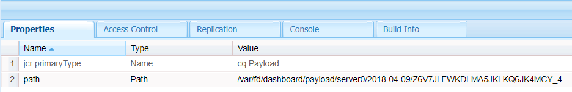

# Flussi di lavoro Forms incentrati su OSGi | Gestione dei dati utente {#forms-centric-workflows-on-osgi-handling-user-data}

I flussi di AEM Forms consentono di automatizzare i processi aziendali Forms incentrati sul mondo reale. I flussi di lavoro sono composti da una serie di passaggi eseguiti in un ordine specificato nel modello di flusso di lavoro associato. Ogni passaggio esegue un’azione specifica, ad esempio l’assegnazione di un’attività a un utente o l’invio di un messaggio e-mail. I flussi di lavoro possono interagire con le risorse presenti nell’archivio, negli account utente e nei servizi. Pertanto, i flussi di lavoro possono coordinare attività complesse che coinvolgono qualsiasi aspetto del Experience Manager .

È possibile avviare o avviare un flusso di lavoro incentrato sui moduli tramite uno dei seguenti metodi:

* Invio di un&#39;applicazione dalla AEM Posta in arrivo
* Invio di un&#39;applicazione da AEM [!DNL Forms] app
* Invio di un modulo adattivo
* Utilizzo di una cartella esaminata
* Invio di una comunicazione interattiva o di una lettera

Per ulteriori informazioni sui flussi di lavoro e sulle funzionalità di AEM incentrati su Forms, consulta Flusso di lavoro incentrato su [Forms in OSGi](/help/forms/using/aem-forms-workflow.md).

## Archivio dati utente e data {#user-data-and-data-stores}

Quando un flusso di lavoro viene attivato, viene generato automaticamente un payload per l’istanza del flusso di lavoro. A ogni istanza del flusso di lavoro viene assegnato un ID istanza univoco e un ID payload associato. Il payload contiene le posizioni dell&#39;archivio per i dati utente e del modulo associati a un&#39;istanza del flusso di lavoro. Inoltre, le bozze e i dati della cronologia per un&#39;istanza del flusso di lavoro vengono memorizzati anche nell&#39;archivio AEM.

Le posizioni predefinite dell&#39;archivio in cui risiedono payload, bozze e cronologia di un&#39;istanza del flusso di lavoro sono le seguenti:

>[!NOTE]
>
>È possibile configurare posizioni diverse per memorizzare i dati di payload, bozza e cronologia durante la creazione di un flusso di lavoro o un&#39;applicazione. Per identificare le posizioni in cui un flusso di lavoro o un&#39;applicazione ha memorizzato i dati, controlla il flusso di lavoro.

<table>
 <tbody>
  <tr>
   <td> </td>
   <td><b>AEM 6.4 [!DNL Forms]</b></td>
   <td><b>AEM 6.3 [!DNL Forms]</b></td>
  </tr>
  <tr>
   <td><strong>Istanza   del flusso di lavoro</strong></td>
   <td>/var/workflow/instance/[server_id]/&lt;data&gt;/[workflow-instance]/</td>
   <td>/etc/workflow/instance/[server_id]/[data]/[workflow-instance]/</td>
  </tr>
  <tr>
   <td><strong>Payload</strong></td>
   <td>/var/fd/dashboard/payload/[server_id]/[data]/  [payload-id]/</td>
   <td>/etc/fd/dashboard/payload/[server_id]/[data]/  [payload-id]/</td>
  </tr>
  <tr>
   <td><strong>Bozze</strong></td>
   <td>/var/fd/dashboard/instance/[server_id]/  [data]/[workflow-instance]/draft/[workitem]/</td>
   <td>/etc/fd/dashboard/instance/[server_id]/  [date]/[workflow-instance]/draft/[workitem]/</td>
  </tr>
  <tr>
   <td><strong>Storia</strong></td>
   <td>/var/fd/dashboard/instance/[server_id]/  [data]/[workflow_instance]/history/</td>
   <td>/etc/fd/dashboard/instance/[server_id]/  [date]/[workflow_instance]/history/</td>
  </tr>
 </tbody>
</table>

## Accesso ed eliminazione dei dati utente {#access-and-delete-user-data}

Potete accedere ed eliminare i dati utente da un’istanza di workflow nella directory archivio. A tal fine, è necessario conoscere l&#39;ID istanza dell&#39;istanza del flusso di lavoro associata all&#39;utente. Potete trovare l&#39;ID di istanza di un&#39;istanza del flusso di lavoro utilizzando il nome utente dell&#39;utente che ha avviato l&#39;istanza del flusso di lavoro o che è l&#39;assegnatario corrente dell&#39;istanza del flusso di lavoro.

Tuttavia, non è possibile identificare i flussi di lavoro associati a un iniziatore oppure i risultati potrebbero essere ambigui nei seguenti scenari:

* **Flusso di lavoro avviato tramite una cartella** controllata: Impossibile identificare un&#39;istanza del flusso di lavoro utilizzando il relativo iniziatore se il flusso di lavoro viene attivato da una cartella esaminata. In questo caso, le informazioni utente sono codificate nei dati memorizzati.
* **Flusso di lavoro avviato dall’istanza** pubblica AEM: Tutte le istanze del flusso di lavoro vengono create utilizzando un utente di servizio quando moduli adattivi, comunicazioni interattive o lettere vengono inviate dall’istanza di AEM pubblicazione. In questi casi, il nome utente dell’utente connesso non viene acquisito nei dati dell’istanza del flusso di lavoro.

### Accesso ai dati utente {#access}

Per identificare e accedere ai dati utente memorizzati per un&#39;istanza di workflow, effettua le seguenti operazioni:

1. AEM’istanza di creazione, andate a `https://'[server]:[port]'/crx/de` Strumenti > **[!UICONTROL Query]**.

   Selezionare **[!UICONTROL SQL2]** dal menu a discesa **[!UICONTROL Tipo]** .

1. A seconda delle informazioni disponibili, eseguite una delle seguenti query:

   * Esegui quanto segue se l&#39;iniziatore del flusso di lavoro è noto:

   `SELECT &ast; FROM [cq:Workflow] AS s WHERE ISDESCENDANTNODE([path-to-workflow-instances]) and s.[initiator]='*initiator-ID*'`

   * Esegui quanto segue se l&#39;utente i cui dati si trovano sono l&#39;assegnatario del flusso di lavoro corrente:

   `SELECT &ast; FROM [cq:WorkItem] AS s WHERE ISDESCENDANTNODE([path-to-workflow-instances]) and s.[assignee]='*assignee-id*'`

   La query restituisce la posizione di tutte le istanze del flusso di lavoro per l&#39;iniziatore del flusso di lavoro specificato o per l&#39;assegnatario del flusso di lavoro corrente.

   Ad esempio, la seguente query restituisce due istanze del flusso di lavoro dal `/var/workflow/instances` nodo il cui iniziatore del flusso di lavoro è `srose`.

   

1. Passare a un percorso di istanza del flusso di lavoro restituito dalla query. La proprietà status visualizza lo stato corrente dell&#39;istanza del flusso di lavoro.

   

1. Nel nodo dell&#39;istanza del flusso di lavoro, passare a `data/payload/`. La `path` proprietà memorizza il percorso del payload per l&#39;istanza del flusso di lavoro. È possibile accedere al percorso per accedere ai dati memorizzati nel payload.

   

1. Andate alle posizioni per le bozze e la cronologia per l&#39;istanza del flusso di lavoro.

   Esempio:

   `/var/fd/dashboard/instances/server0/2018-04-09/_var_workflow_instances_server0_2018-04-09_basicmodel_54/draft/`

   `/var/fd/dashboard/instances/server0/2018-04-09/_var_workflow_instances_server0_2018-04-09_basicmodel_54/history/`

1. Ripetere i passaggi da 3 a 5 per tutte le istanze del flusso di lavoro restituite dalla query al punto 2.

   >[!NOTE]
   >
   >AEM&#39; [!DNL Forms] app memorizza anche i dati in modalità offline. È possibile che i dati per un&#39;istanza del flusso di lavoro siano memorizzati localmente su singoli dispositivi e che vengano inviati al [!DNL Forms] server quando l&#39;app si sincronizza con il server.

### Eliminare i dati utente {#delete-user-data}

È necessario essere un amministratore AEM per eliminare i dati utente dalle istanze del flusso di lavoro, eseguendo la procedura seguente:

1. Seguite le istruzioni riportate in [Accesso ai dati](/help/forms/using/forms-workflow-osgi-handling-user-data.md#access) utente e prendete nota di quanto segue:

   * Percorsi alle istanze del flusso di lavoro associate all&#39;utente
   * Stato delle istanze del flusso di lavoro
   * Percorsi ai payload per le istanze del flusso di lavoro
   * Percorsi alle bozze e alla cronologia per le istanze del flusso di lavoro

1. Per le istanze del flusso di lavoro in stato **ESECUZIONE**, **SOSPENSIONE** o **STALE** , eseguite questo passaggio:

   1. Accedete a `https://'[server]:[port]'/aem/start.html` e accedete con le credenziali di amministratore.
   1. Passare a **[!UICONTROL Strumenti > Flusso di lavoro > Istanze]**.
   1. Selezionate le istanze del flusso di lavoro rilevanti per l&#39;utente e toccate **[!UICONTROL Termina]** per terminare le istanze in esecuzione.

      Per ulteriori informazioni sull&#39;utilizzo delle istanze del flusso di lavoro, consulta [Amministrazione delle istanze](/help/sites-administering/workflows-administering.md)del flusso di lavoro.

1. Passate alla [!DNL CRXDE Lite] console, individuate il percorso di payload per un’istanza di workflow ed eliminate il `payload` nodo.
1. Andate al percorso delle bozze per un&#39;istanza di workflow ed eliminate il `draft` nodo.
1. Andate al percorso della cronologia per un&#39;istanza del flusso di lavoro ed eliminate il `history` nodo.
1. Andate al percorso dell&#39;istanza del flusso di lavoro per un&#39;istanza del flusso di lavoro ed eliminate il `[workflow-instance-ID]` nodo del flusso di lavoro.

   >[!NOTE]
   >
   >Eliminando il nodo di istanza del flusso di lavoro, verrà rimossa l’istanza del flusso di lavoro per tutti i partecipanti al flusso di lavoro.

1. Ripetete i passaggi da 2 a 6 per tutte le istanze del flusso di lavoro identificate per un utente.
1. Identificare ed eliminare i dati di bozza e invio offline dalla AEM [!DNL Forms] outbox dell&#39;app dei partecipanti al flusso di lavoro per evitare l&#39;invio al server.

Potete inoltre utilizzare le API per accedere e rimuovere nodi e proprietà. Per ulteriori informazioni, consulta i seguenti documenti.

* [Come accedere a AEM JCR a livello di programmazione](/help/sites-developing/access-jcr.md)
* [Rimozione di nodi e proprietà](https://docs.adobe.com/docs/en/spec/jcr/2.0/10_Writing.html#10.9%20Removing%20Nodes%20and%20Properties)
* [Riferimento API](https://helpx.adobe.com/experience-manager/6-3/sites-developing/reference-materials/javadoc/overview-summary.html)

