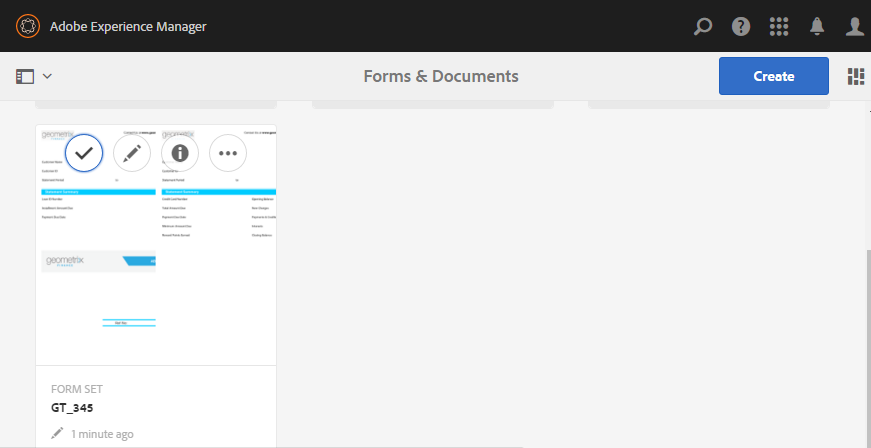

# Set di moduli in AEM Forms{#form-set-in-aem-forms}

## Panoramica {#overview}

Ai clienti viene spesso richiesto di inviare più moduli per richiedere un servizio o un benefit. Comporta la ricerca di tutti i moduli pertinenti; e compilarli, inviarli e tenerli traccia separatamente. Inoltre, devono compilare i dettagli comuni più volte tra i moduli. L’intero processo diventa ingombrante e soggetto a errori se comporta un numero elevato di moduli. La funzione set di moduli di AEM Forms consente di semplificare l’esperienza utente in tali scenari.

Un set di moduli è una raccolta di moduli di HTML5 raggruppati e presentati agli utenti finali come un unico set di moduli. Quando gli utenti finali iniziano a compilare un set di moduli, passano facilmente da un modulo all’altro. Alla fine, è possibile inviare tutti i moduli con un solo clic.

AEM Forms offre agli autori dei moduli un’interfaccia utente intuitiva per creare, configurare e gestire i set di moduli. In qualità di autore, è possibile ordinare i moduli in una sequenza specifica che gli utenti finali dovranno seguire. Inoltre, è possibile applicare condizioni o espressioni di idoneità su singoli moduli per controllarne la visibilità in base agli input dell’utente. Ad esempio, è possibile configurare la maschera dei dettagli del coniuge in modo che venga visualizzata solo quando lo stato del matrimonio è impostato su Sposato.

È inoltre possibile configurare campi comuni in diversi moduli per condividere binding dei dati comuni. In presenza di binding dei dati appropriati, gli utenti finali devono compilare le informazioni comuni solo una volta che i moduli successivi saranno compilati automaticamente.

I set di moduli sono supportati anche nell’app AEM Forms e consentono alla forza lavoro sul campo di impostare un modulo offline, di visitare i clienti, di inserire dati e di eseguire la sincronizzazione in un secondo momento con il server AEM Forms per inviare i dati dei moduli ai processi aziendali.

## Creazione e gestione del set di moduli {#creating-and-managing-form-set}

È possibile associare diversi XDP o modelli di modulo creati con Designer a un set di moduli. I set di moduli possono quindi essere utilizzati per eseguire il rendering selettivo degli XDP in base ai valori immessi dagli utenti nei moduli iniziali e nei relativi profili.

Utilizzo [Interfaccia utente di AEM Forms](../../forms/using/introduction-managing-forms.md) per gestire tutti i moduli, i set di moduli e le relative risorse.

### Creare un set di moduli {#create-a-form-set}

Per creare un set di moduli, procedere come segue:

1. Selezionare Forms > Forms e Documenti.
1. Selezionare Crea > Set di moduli.

1. Nella pagina Aggiungi proprietà aggiungere i dettagli seguenti e fare clic su Avanti.

   * Titolo: Specifica il titolo del documento. Il titolo consente di identificare il set di moduli nell’interfaccia utente di AEM Forms.
   * Descrizione: Specifica le informazioni dettagliate sul documento.
   * Tag: Specifica i tag per identificare in modo univoco il set di moduli. I tag consentono di cercare il set di moduli. Per creare i tag, digitate nuovi nomi di tag nella casella Tag.
   * URL di invio: Specifica l’URL in cui vengono inviati i dati per il rendering autonomo del set di moduli (caso d’uso per app non AEM Forms). I dati vengono inviati a questo endpoint come dati multipart/formdata con il seguente parametro di richiesta:
   * dataXML: Questo parametro contiene una rappresentazione XML dei dati del set di moduli inviati. Se tutti i moduli del set di moduli utilizzano uno schema comune, il codice XML viene generato in base a tale schema. In caso contrario, il tag radice XML contiene un tag secondario per ciascun modulo compilato nel set di moduli contenente i dati relativi agli allegati del modulo.
   * formsetPath: Percorso del modulo impostato in CRXDE, inviato.
   * Profilo di rendering di HTML: È possibile configurare determinate opzioni, ad esempio campi mobili, allegati e supporto per le bozze (per il rendering del set di moduli autonomo) per personalizzare l’aspetto, il comportamento e le interazioni del set di moduli. È possibile personalizzare o estendere il profilo esistente per modificare le impostazioni di qualsiasi profilo modulo di HTML.

   

1. Nella schermata Seleziona moduli vengono visualizzati i moduli XDP o i file XDP disponibili. Cercare e selezionare i moduli da includere nel set di moduli, quindi fare clic su Aggiungi al set di moduli. Se necessario, eseguire di nuovo la ricerca dei moduli da aggiungere. Dopo aver aggiunto tutti i moduli al set di moduli, fare clic su Avanti.

   >[!NOTE]
   >
   >Assicurarsi che i nomi dei campi nei moduli XDP non contengano il carattere punto. In caso contrario, gli script che tentano di risolvere i campi, che contengono caratteri punto, non sono in grado di risolverli.

1. Nella pagina Configura moduli è possibile effettuare le seguenti operazioni:

   * Ordine modulo: Trascinare i moduli per riordinarli. L’ordine del modulo definisce l’ordine in cui i moduli vengono mostrati all’utente finale nell’app AEM Forms e nel rendering autonomo.
   * Identificatore modulo: Specifica un&#39;identità univoca per i moduli da utilizzare nelle espressioni di idoneità.
   * Livello principale dati: Per ciascun modulo del set di moduli, l’autore può configurare l’XPATH in cui i dati di quel particolare modulo sono posizionati nel codice XML inviato. Il valore predefinito è /. Se tutti i moduli del set di moduli sono associati allo schema e condividono lo stesso schema XML, è possibile modificare tale valore. È consigliabile che ogni campo del modulo abbia un binding dei dati appropriato specificato in XDP. Se due campi di due moduli diversi condividono il binding dei dati comune, il campo del secondo modulo mostra i valori precompilati del primo modulo. Non associare due sottomoduli con lo stesso contenuto interno allo stesso nodo XML. Per ulteriori informazioni sulla struttura XML del set di moduli, vedere [XML di precompilazione per il set di moduli](../../forms/using/formset-in-aem-forms.md#p-prefill-xml-for-form-set-p).
   * Espressione di idoneità: Specifica un&#39;espressione JavaScript che valuta un valore booleano e indica se un modulo nel set di moduli è idoneo per la compilazione. Se false, all’utente non viene richiesto o persino mostrato il modulo da compilare. In genere, l’espressione si basa sui valori dei campi acquisiti prima del modulo. Le espressioni contengono anche chiamate al set di moduli API fs.valueOf per estrarre i valori compilati dall’utente in un campo di un modulo del set di moduli:

   *fs.valueOf(&lt;form identifier=&quot;&quot;>, &lt;fieldsom expression=&quot;&quot;>) > &lt;value>*

   Ad esempio, se nel set di moduli sono presenti due moduli: spese aziendali e spese di viaggio, è possibile aggiungere uno snippet JavaScript nel campo Espressione di idoneità per entrambi i moduli per controllare l’input dell’utente per il tipo di spesa in un modulo. Se l&#39;utente sceglie Spese aziendali, il modulo Spese aziendali viene reso all&#39;utente finale. Oppure, se l&#39;utente sceglie le spese di viaggio, viene eseguito il rendering di un modulo diverso per l&#39;utente finale. Per ulteriori informazioni, vedere Espressione di idoneità.

   Inoltre, l’autore può anche scegliere di rimuovere un modulo dal set di moduli utilizzando l’icona Elimina presente nell’angolo a destra di ogni riga o aggiungere un altro set di moduli utilizzando &quot;**+** Icona &#39; nella barra degli strumenti. Questo **+** L&#39;icona &#39; riporta l&#39;utente al passaggio precedente della procedura guidata, utilizzato per selezionare i moduli. Le selezioni esistenti vengono mantenute e tutte le selezioni aggiuntive effettuate devono essere aggiunte al set di moduli utilizzando l’icona Aggiungi al set di moduli presente nella pagina.

   

   >[!NOTE]
   >
   >Tutti i moduli utilizzati nel set di moduli sono gestiti dall’interfaccia utente di AEM Forms.

### Gestione di un set di moduli {#managing-a-form-set}

Una volta creato un set di moduli, è possibile eseguire le azioni seguenti su tale set di moduli:

* Clic singolo: Quando il set di moduli viene creato ed elencato nella pagina della risorsa principale, è possibile fare clic sul set di moduli per visualizzarlo. Un set di moduli apre e visualizza tutti i modelli di modulo (XDP) presenti in quel set di moduli.
* Modifica: Facendo clic su Modifica dopo aver selezionato un set di moduli, si apre la schermata Configura modulo (i moduli) mostrata sopra in Passaggi per creare un set di moduli. Puoi eseguire tutte le funzionalità descritte al punto qui.
* Copia + Incolla: Questo consente di copiare l’intero set di moduli da una posizione e incollarlo nello stesso percorso o in qualsiasi altra posizione o cartella.
* Download: È possibile scaricare il set di moduli con tutte le relative dipendenze.
* Avvia/Gestisci revisione: Una volta creato il set di moduli, è possibile impostarne la revisione facendo clic su Avvia revisione. Una volta avviata la revisione di un set di moduli, l’opzione Gestisci revisione viene visualizzata all’utente. Nella schermata Gestisci revisione puoi aggiornare/terminare la revisione. Per le revisioni aggiunte, è possibile controllare la revisione e aggiungere eventuali commenti.
* Elimina: Elimina l’intero set di moduli. I moduli nel set di moduli eliminato rimangono nella directory archivio.
* Pubblica/Annulla pubblicazione: Pubblica/annulla la pubblicazione del set di moduli insieme a tutti i moduli in esso contenuti e alle relative risorse.
* Anteprima: L’anteprima offre due opzioni: Anteprima come HTML (senza dati) e anteprima personalizzata con dati di esempio.
* Visualizza/Modifica proprietà: È possibile visualizzare/modificare le proprietà dei metadati di un set di moduli selezionato.



### Modificare un set di moduli {#edit-a-form-set}

Per modificare un set di moduli, effettuare le seguenti operazioni:

1. Selezionare Forms > Forms e Documenti.
1. Individuare il set di moduli da modificare. Passa il puntatore del mouse su di esso e seleziona Modifica ( ).
1. Nella pagina Configura moduli è possibile modificare quanto segue:

   * Ordine modulo
   * Identificatore  modulo
   * Radice dati
   * Espressione di idoneità

   È inoltre possibile fare clic sull’icona Elimina corrispondente per eliminare il modulo dal set di moduli.

## Set di moduli in Process Management {#form-set-in-process-management}

Dopo aver creato un set di moduli utilizzando l’interfaccia utente di Gestione AEM Forms, è possibile utilizzare il set di moduli in un’attività Punto iniziale o Assegna attività tramite Workbench.

### Utilizzo del set di moduli in Task o Start point {#using-form-set-in-task-or-start-point}

1. Durante la progettazione di un processo, nella sezione Presentazione e dati di Assegna task/punto iniziale selezionare **utilizzare una risorsa CRX**. Viene visualizzato il browser Risorse CRX.

   

1. Seleziona il set di moduli per filtrare il set di moduli AEM archivio (CRX).

   

1. Seleziona un set di moduli e fai clic su OK.

## Espressioni di idoneità {#eligibility-expressions}

Le espressioni di idoneità in un set di moduli vengono utilizzate per definire e controllare in modo dinamico i moduli visualizzati dall’utente. Ad esempio, per visualizzare un modulo specifico solo se l’utente appartiene a un particolare gruppo di età. Specificare e modificare un&#39;espressione di idoneità utilizzando Forms Manager.

Un&#39;espressione di idoneità può essere qualsiasi istruzione JavaScript valida che restituisce un valore booleano. L’ultima istruzione nello snippet di codice JavaScript viene trattata come un valore booleano che determina l’idoneità del modulo in base all’elaborazione nelle altre righe (righe precedenti) dello snippet di codice JavaScript. Se il valore dell’espressione è true, il modulo può essere visualizzato all’utente. Tali moduli sono noti come moduli idonei.

>[!NOTE]
>
>L’espressione di idoneità per il primo modulo nel set di moduli non viene eseguita. Il primo modulo viene sempre visualizzato indipendentemente dall’espressione di idoneità.

Oltre alle funzioni JavaScript standard, il set di moduli espone anche l’API fs.valueOf che fornisce l’accesso al valore di un campo di un modulo in un set di moduli. Utilizzare questa API per accedere al valore di un campo modulo in un set di moduli. La sintassi API è fs.valueOf (formUid, fieldSOM), dove:

* formUid (stringa): Un ID univoco di un modulo nel set di moduli. È possibile specificarlo durante la creazione del set di moduli nell’interfaccia utente di Forms Manager. Per impostazione predefinita, è il nome del modulo.
* fieldSOM (stringa): Espressione SOM del campo nel modulo specificato da formUid. L&#39;espressione SOM o l&#39;espressione del modello di oggetto script viene utilizzata per fare riferimento a valori, proprietà e metodi all&#39;interno di un particolare modello di oggetto documento (DOM). È possibile visualizzarlo in Form Designer sotto la scheda Script mentre il campo è selezionato.

>[!NOTE]
>
>Entrambi i parametri formUid e fieldSOM devono essere stringhe letterali.

### Esempi {#examples}

Utilizzo valido dell’API:

`fs.valueOf("form1", "xfa.form.form1.subform1.field1")`

Utilizzo dell&#39;API non valido:

```javascript
var formUid = "form1";
 var fieldSOM = "xfa.form.form1.subform1.field1"; fs.valueOf(formUid, fieldSOM);
```

## XML di precompilazione per il set di moduli {#prefill-xml-for-form-set}

Il set di moduli è una raccolta di più moduli di HTML5 con schemi comuni o diversi. Il set di moduli supporta la precompilazione dei campi modulo tramite un file XML. È possibile associare un file XML a un set di moduli in modo che, quando si apre un modulo nel set di moduli, alcuni campi del modulo vengano prepolulati.

Il file XML di precompilazione viene specificato utilizzando il parametro dataRef dell’URL del set di moduli. Il parametro dataRef specifica il percorso assoluto del file XML di dati unito al set di moduli.

Ad esempio, nel set di moduli sono presenti tre moduli (modulo1, modulo2 e modulo3) con la seguente struttura:

form1

campo modulo1

form2

campo form2field

form3

campo form3field

Ogni modulo dispone di un campo denominato comune denominato &quot;field&quot; e di un campo denominato in modo univoco denominato &quot;form field&quot;.

È possibile precompilare il set di moduli utilizzando un XML con la seguente struttura:

```xml
<?xml version="1.0" encoding="UTF-8" ?>
<formSetRootTag>
 <field>common field value</field>
 <form1field>value1</form1field>
 <form2field>value2</form2field>
 <form3field>value3</form3field>
</formSetRootTag>
```

>[!NOTE]
>
>Il tag radice XML può avere un nome qualsiasi, ma i tag elemento corrispondenti ai campi devono avere lo stesso nome del campo. La gerarchia dell’XML deve simulare la gerarchia del modulo, il che significa che l’XML deve disporre dei tag corrispondenti per il wrapping dei sottomoduli.

Lo snippet XML di cui sopra mostra che l’XML di precompilazione per il set di moduli è un’unione dei frammenti XML di precompilazione dei singoli moduli. Se alcuni campi nei diversi moduli presentano una gerarchia/uno schema di dati simili l’uno all’altro, i campi vengono precompilati con gli stessi valori. In questo esempio, tutti e tre i moduli sono precompilati con lo stesso valore per il campo comune &quot;field&quot;. Questo è un modo semplice per trasferire i dati da un modulo all’altro. È inoltre possibile eseguire il binding dei campi con lo stesso schema o riferimento dati. Se si desidera separare i dati del set di moduli in base allo schema dei moduli. Questo può essere ottenuto specificando l&#39;attributo &quot;data root&quot; del modulo durante la creazione del set di moduli (il valore predefinito è &quot;/&quot;, che viene mappato sul tag principale del set di moduli).

Nell&#39;esempio precedente, se si specificano le radici dati: Per i tre moduli, rispettivamente &quot;/form1&quot;, &quot;/form2&quot; e &quot;/form3&quot;, è necessario utilizzare un XML di precompilazione della seguente struttura:

```xml
<?xml version="1.0" encoding="UTF-8" ?>
<formSetRootTag>
 <form1>
  <field>field value1</field>
  <form1field>value1</form1field>
 </form1>
 <form2>
  <field>field value2</field>
  <form2field>value2</form2field>
 </form2>
 <form3>
  <field>field value3</field>
  <form3field>value3</form3field>
 </form3>
</formSetRootTag>
```

In un set di moduli, l’XML ha definito uno schema XML con la seguente sintassi:

```xml
<formset>
 <fs_data>
  <xdp:xdp xmlns:xdp="https://ns.adobe.com/xdp/">
  <xfa:datasets xmlns:xfa="https://www.xfa.org/schema/xfa-data/1.0/">
   <xfa:data>
   <rootElement>
    ... data ....
   </rootElement>
   </xfa:data>
  </xfa:datasets>
  </xdp:xdp>
 </fs_data>
 <fs_draft>
  ... private data...
 </fs_draft>
</formset>
```

>[!NOTE]
>
>Se esistono due moduli con radici dati sovrapposte o la gerarchia di elementi di un modulo si sovrappone alla gerarchia radice dati di un altro modulo, nel file xml di precompilazione i valori degli elementi sovrapposti vengono uniti. L&#39;XML di invio ha una struttura simile a quella del XML di precompilazione, ma l&#39;XML di invio ha più tag wrapper e alcuni tag di dati contestuali del set di moduli sono aggiunti alla fine.

### Descrizione degli elementi XML di precompilazione {#prefill-xml-elements-description}

Regole di sintassi per la creazione di un file XML di precompilazione:

* elementi padre: elemento o elementi che possono essere i relativi elementi principali, dove null indica che l’elemento può trovarsi nella directory principale dell’XML.
* cardinalità: rappresenta il numero di volte in cui l’elemento può essere utilizzato all’interno del relativo elemento padre.
* submitXML: indica se l’elemento è sempre presente(P) o facoltativo(O) nell’invio di XML.
* prefillXML: indica se l’elemento è obbligatorio(R) o facoltativo(O) nel file XML di precompilazione.
* bambini: indica quali elementi possono essere i relativi figli.

### FORMSET {#formset}

`parent elements:`

`null`

`cardinality: [0,1]`

`submitXML: P`

`prefillXML: O`

`children: fs_data`

L&#39;elemento principale del set di moduli XML. È consigliabile non utilizzare questa parola come nome del rootSubform di qualsiasi modulo del set di moduli.

### FS_DATA {#fs-data}

`parent elements:`

`formset`

cardinalità: [1]

submitXML: P

prefillXML: O

`children: xdp:xdp/rootElement`

La sottostruttura indica i dati dei moduli nel set di moduli. L’elemento è facoltativo nel file XML di precompilazione solo se l’elemento del set di moduli non è presente

### XDP:XDP {#xdp-xdp}

`parent elements: fs_data/null`

`cardinality: [0,1]`

`submitXML: O`

`prefillXML: O`

`children: xfa:datasets`

Questo tag indica l&#39;inizio del modulo XML di HTML5. Questo viene aggiunto nel file XML di invio se è presente nel file XML di precompilazione o se non è presente alcun XML di precompilazione. Questo tag può essere rimosso dal file XML di precompilazione.

### XFA:SET DI DATI {#xfa-datasets}

`parent elements: xdp:xdp`

`cardinality: [1]`

`submitXML: O`

`prefillXML: O`

`children: xfa:data`

### XFA:DATI {#xfa-data}

`parent elements: xfa:datasets`

`cardinality: [1]`

`submitXML: O`

`prefillXML: O`

`children: rootElement`

### ROOTELEMENT {#rootelement}

`parent elements: xfa:datasets/fs_data/null`

`cardinality: [0,1]`

`submitXML: P`

`prefillXML: O`

`children: controlled by the Forms in Form set`

Il nome rootElement è solo un segnaposto. Il nome effettivo viene preso dai moduli utilizzati nel set di moduli. La sottostruttura che inizia con rootElement contiene i dati dei campi e dei sottomoduli all’interno di Forms nel set di moduli. Esistono diversi fattori che determinano la struttura dell&#39;elemento radice e dei relativi elementi secondari.

In XML di precompilazione, questo tag è facoltativo, ma se manca, l&#39;intero XML viene ignorato.

NOME DEL TAG ELEMENTO PRINCIPALE

Nel caso in cui vi sia un elemento principale nell&#39;XML di precompilazione, il nome di tale elemento viene preso anche nell&#39;XML di invio. Nei casi in cui non è presente un xml di precompilazione, il nome dell&#39;elemento radice è il nome del sottomodulo principale del primo modulo del set di moduli con una proprietà dataRoot impostata su &quot;/&quot;. Se non esiste una forma simile, il nome rootElement è **fs_dummy_root**, che è una parola chiave riservata.

## Set di moduli nell’app AEM Forms {#formset-in-workspace-app}

L’app AEM Forms consente ai lavoratori sul campo di sincronizzare i propri dispositivi mobili con un server AEM Forms e di lavorare sulle attività. L&#39;applicazione funziona anche quando il dispositivo è offline, salvando i dati localmente sul dispositivo. Utilizzando le funzioni di annotazione, ad esempio le fotografie, i dipendenti sul campo possono fornire informazioni precise da integrare nei processi aziendali.

<!-- Update link as it is a 404 - For more information on AEM Forms app, see [AEM Forms app overview](/help/forms/using/mobile-workspace-overview.md).-->

## Limitazioni note: pattern non completamente supportati nel set di moduli {#known-limitations-patterns-not-fully-supported-in-form-set}

I seguenti pattern di dati non sono completamente supportati nel set di moduli:

<table>
 <tbody>
  <tr>
   <td><strong>Pattern non completamente supportato nel set di moduli</strong></td>
   <td><strong>Esempio</strong></td>
  </tr>
  <tr>
   <td>Dimensione dell'input e dimensione del pattern non corrispondenti</td>
   <td><p>Quando pattern= num{z,zzz}</p> <p>E input=</p> <p>12.345 o</p> <p>1,23</p> </td>
  </tr>
  <tr>
   <td>Pattern di clausole immagine con parentesi graffe "(" ")"</td>
   <td>num{(zz,zzz)}</td>
  </tr>
  <tr>
   <td>Pattern di dati multipli</td>
   <td>num{zz,zzz} | num{z,zzz,zzz}</td>
  </tr>
  <tr>
   <td>Pattern a breve </td>
   <td><p>num.integer{},</p> <p>num.decimal{},</p> <p>num.percent{}, oppure</p> <p>num.currency{}</p> </td>
  </tr>
 </tbody>
</table>
