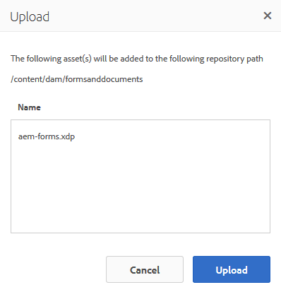
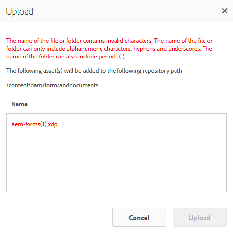

# Recupero documenti XDP e PDF in AEM Forms{#getting-xdp-and-pdf-documents-in-aem-forms}

## Panoramica {#overview}

Puoi importare i moduli dal file system locale all’archivio CRX, caricandoli in AEM Forms. L’operazione di caricamento è supportata per i seguenti tipi di risorse:

* Modelli di modulo (moduli XFA)
* PDF forms
* Documento (documenti Flat PDF)

Puoi caricare i tipi di risorse supportati singolarmente o come archivio ZIP. Puoi caricare una risorsa di questo tipo `Resource`, solo insieme a un modulo XFA in un archivio ZIP.

>[!NOTE]
>
>Assicurati di essere membro della `form-power-users` per caricare i file XDP. Contatta l’amministratore per diventare membro del gruppo.

## Caricamento moduli {#uploading-forms}

1. Accedi all’interfaccia utente di AEM Forms accedendo a `https://'[server]:[port]'/aem/forms.html`.
1. Passare alla cartella in cui si desidera caricare il modulo o alla cartella contenente i moduli.
1. Nella barra delle azioni, seleziona **Crea > Caricamento file**.

   

1. La finestra di dialogo Carica moduli o pacchetto ti consente di sfogliare e scegliere il file da caricare. Nel browser di file vengono visualizzati solo i formati di file supportati (ZIP, XDP e PDF).

   >[!NOTE]
   >
   >Un nome file può contenere solo caratteri alfanumerici, trattini o trattini bassi.

1. Fai clic su Carica dopo la selezione del file per caricare i file o su Annulla per annullare il caricamento. Un pop-up elenca le risorse aggiunte e quelle aggiornate nella posizione corrente.

   >[!NOTE]
   >
   >Per un file ZIP, vengono visualizzati i percorsi relativi di tutte le risorse supportate. Le risorse non supportate nel file ZIP vengono ignorate e non elencate. Tuttavia, se l’archivio ZIP contiene solo le risorse non supportate, viene visualizzato un messaggio di errore al posto della finestra di dialogo a comparsa.

   

1. Se una o più risorse hanno un nome file non valido, viene visualizzato un errore. Correggi i nomi dei file evidenziati in rosso e ricaricali.

   

Una volta completato il caricamento, un flusso di lavoro in background genera le miniature per ogni risorsa, in base all’anteprima della risorsa. Le versioni più recenti delle risorse, se caricate, sovrascrivono quelle esistenti.

### Modalità protetta {#protected-mode}

Il server AEM Forms consente di eseguire il codice JavaScript. Un codice JavaScript dannoso può danneggiare un ambiente AEM Forms. La modalità protetta impedisce ad AEM Forms di eseguire file XDP solo da posizioni e risorse attendibili. Tutti gli XDP disponibili nell’interfaccia utente di AEM Forms sono considerati risorse attendibili.

Per impostazione predefinita, la modalità protetta è attivata. Se necessario, puoi disattivare la modalità protetta:

1. Accedi alla console web dell’AEM come amministratore. L’URL è https://&#39;[server]:[porta]&#39;/system/console/configMgr
1. Apri Configurazioni Forms per dispositivi mobili per la modifica.
1. Deseleziona l’opzione Modalità protetta e fai clic su **Salva**. La modalità protetta è disabilitata.

## Aggiornamento dei moduli XFA di riferimento {#updating-referenced-xfa-forms}

In AEM Forms, è possibile fare riferimento a un modello di modulo XFA da un modulo adattivo o da un altro modello di modulo XFA. Inoltre, un modello può fare riferimento a una risorsa o a un altro modello XFA.

Un modulo adattivo che fa riferimento a un XFA ha i suoi campi associati a quelli disponibili nell’XFA. Quando si aggiorna un modello di modulo, il modulo adattivo associato tenta di eseguire la sincronizzazione con l’XFA. Per ulteriori dettagli, consulta [Sincronizzazione dei moduli adattivi con l’XFA associato](../../forms/using/synchronizing-adaptive-forms-xfa.md).

La rimozione di un modello di modulo danneggia il modulo adattivo o il modello di modulo dipendente. Un modulo adattivo di questo tipo è talvolta indicato informalmente come modulo sporco. Nell’interfaccia utente di AEM Forms, puoi trovare i moduli dirty nei due modi seguenti.

* Nella miniatura del modulo adattivo nell’elenco delle risorse viene visualizzata un’icona di avviso e il seguente messaggio viene visualizzato quando passi il puntatore sull’icona di avviso.\
  `Schema/Form Template for this adaptive form has been updated so go to Authoring mode and rebase it with new version.`

Viene mantenuto un flag per indicare se un modulo adattivo è sporco. Queste informazioni sono disponibili nella pagina delle proprietà del modulo, insieme ai metadati del modulo. Solo per i moduli adattivi sporchi, una proprietà di metadati `Model Refresh` display `Recommended` valore.

