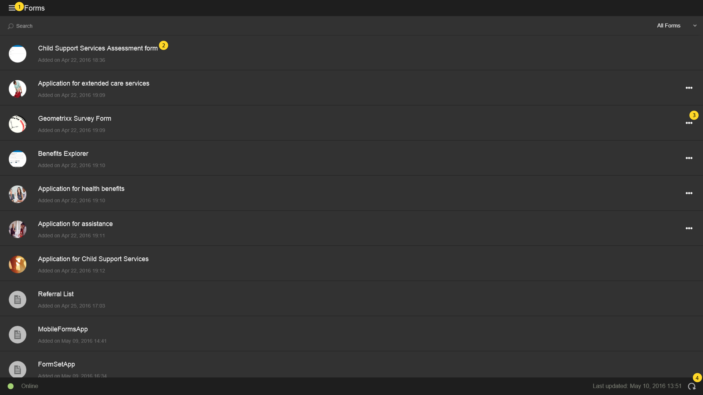

# Schermata principale{#home-screen}

Quando accedi all’app AEM Forms, vieni reindirizzato alla schermata iniziale.

## Schermata Home predefinita {#default-home-screen}

Per impostazione predefinita, nella schermata iniziale sono visualizzati tutti i moduli, compresi i punti di avvio e le attività (se il server connesso è abilitato per AEM Forms Workflow), insieme alle miniature associate. Puoi specificare le miniature nel server AEM Forms.

La figura seguente viene annotata con le chiamate ai componenti essenziali nella schermata iniziale predefinita.

<!--Click to enlarge

-->

1. **Pulsante Menu**: Tocca **Menu** per passare a Attività, Forms, Posta in uscita e Impostazioni. Se l’app AEM Forms è connessa a un server JEE di AEM Forms, puoi visualizzare l’opzione Attività . L&#39;opzione Task consente inoltre di memorizzare le bozze create dalle attività in un processo. Per i server OSGi di AEM Forms, l&#39;opzione Attività è nascosta. In Posta in uscita vengono memorizzati i moduli salvati e le bozze prima della sincronizzazione con il server. Tutti i moduli e le bozze salvati nella casella in uscita vengono caricati sul server AEM Forms quando l’app è [sincronizzato con il server](../../forms/using/sync-app.md). Per informazioni sulle impostazioni, consulta [Aggiorna impostazioni generali](../../forms/using/update-general-settings.md).
1. **Attività o modulo**: Toccare l’attività o il modulo elencato con cui si desidera lavorare.
1. **Ellissi orizzontale**: Indica che per il modulo sono disponibili azioni. Tocca i puntini di sospensione per visualizzare le azioni e le descrizioni fornite dall’autore. La **Elimina bozza** e **Completa** è visibile quando tocchi i puntini di sospensione.
1. **Icona Aggiorna**: Tocca l’icona di aggiornamento per sincronizzare l’app con il server AEM Forms.

### Personalizzazione della schermata iniziale {#customizing-the-home-screen}

Puoi modificare la schermata iniziale predefinita dell’app da **[Impostazioni generali](../../forms/using/update-general-settings.md)** dell&#39;app o dal **Preferenza** in HTML Workspace.

La modifica apportata all’impostazione della schermata iniziale sull’app ha effetto sulla schermata iniziale dell’utente attualmente registrato o sul dispositivo mobile corrente.

Tuttavia, la modifica apportata in HTML Workspace ha effetto su tutti gli utenti delle app AEM Forms che hanno effettuato l’accesso al server AEM Forms.
