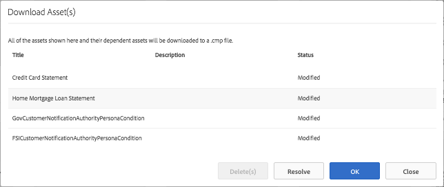

# Importazione ed esportazione di risorse in AEM Forms{#importing-and-exporting-assets-to-aem-forms}

È possibile spostare moduli e risorse, temi, dizionari dati, frammenti di documenti e lettere correlati tra diverse istanze di AEM Forms. Tale spostamento è necessario per la migrazione di sistemi o lo spostamento di moduli da un server stage a un server di produzione. Per le risorse di cui è supportato il caricamento e l’importazione tramite l’interfaccia utente di AEM Forms, l’utilizzo dell’interfaccia utente di Forms è il metodo consigliato per l’esportazione o l’importazione. Non è consigliabile utilizzare Gestione pacchetti AEM per esportare o importare tali risorse.

>[!NOTE]
>
>* In AEM 6.4 Forms, la struttura e i percorsi dell’archivio crx sono cambiati. Se importi risorse da una versione precedente a Forms AEM 6.4 e il modulo presenta alcune dipendenze dalla struttura precedente, devi esportare manualmente le dipendenze. Per informazioni dettagliate sulle modifiche apportate alla struttura e ai percorsi dell’archivio, consulta [Ristrutturazione dell’archivio dell’AEM](/help/sites-deploying/repository-restructuring.md).
>

## Scaricare o caricare risorse Forms &amp; Documents {#download-or-upload-forms-amp-documents-assets}

L’interfaccia utente di AEM Forms consente di esportare le risorse da un’istanza AEM scaricandole come file binari o in un pacchetto AEM CRX. Puoi quindi importare il pacchetto AEM CRX scaricato o il file binario in un’altra istanza AEM.

L’esportazione e l’importazione tramite l’interfaccia utente di AEM Forms sono supportate per tutte le risorse, ad eccezione dei modelli di moduli adattivi e dei criteri per il contenuto dei moduli adattivi. Pertanto, all’esportazione di un modulo adattivo dall’interfaccia utente di AEM Forms, il modello di modulo adattivo e i criteri del contenuto correlati non vengono esportati automaticamente come altre risorse correlate.

Per questi tipi di risorse, devi utilizzare Gestione pacchetti AEM per creare un pacchetto CRX sul server AEM di origine e installare il pacchetto sul server di destinazione. Per informazioni sulla creazione e l&#39;installazione dei pacchetti, vedere [Utilizzo dei pacchetti](/help/sites-administering/package-manager.md).

### Scaricare risorse Forms e Documents {#download-forms-amp-documents-assets}

Per scaricare le risorse Forms e Documents:

1. Accedi all’istanza di AEM Forms.
1. Seleziona Experience Manager  icona > navigazione  icon> Forms > Forms &amp; Documents (e documenti).
1. Seleziona le risorse dei moduli e fai clic su **Scarica** icona.
1. In Scarica risorse, scegli una delle seguenti opzioni e seleziona **Scarica**.

   * **Scarica come pacchetto CRX:** Utilizza l’opzione per scaricare e spostare tutte le risorse selezionate e le relative dipendenze da un’istanza di AEM Forms a un’altra. Scarica tutte le risorse e le cartelle come pacchetto crx. Qualsiasi risorsa di modulo, compresi i moduli creati in AEM (moduli adattivi, comunicazioni interattive e frammenti di moduli adattivi), i set di moduli, i modelli di modulo, i documenti PDF e le risorse (XSD, XFS, immagini) può essere scaricata come pacchetto dall’interfaccia utente di AEM Forms.
Il vantaggio di scaricare le risorse come pacchetto è che scarica anche le risorse utilizzate dalla risorsa selezionata per il download. Ad esempio, se disponi di un modulo adattivo che utilizza un modello di modulo, XSD e un’immagine. Quando selezioni questo modulo adattivo e lo scarichi come pacchetto, il pacchetto scaricato contiene anche il modello del modulo, XSD e l’immagine. Vengono scaricate anche tutte le proprietà di metadati (comprese le proprietà personalizzate) associate alla risorsa.

   * **Scaricate le risorse come file binari:** Utilizza l’opzione per scaricare solo modelli di modulo (XDP), PDF forms (PDF), documento (PDF) e risorse (immagini, schemi, fogli di stile). Puoi modificare queste risorse con applicazioni esterne. Scarica come file .zip le risorse dei moduli che hanno file binari, come XSD, XDP, immagini, PDF e XDP.
Non è possibile scaricare moduli adattivi, comunicazioni interattive, frammenti di moduli adattivi, temi e set di moduli con **Scarica risorse come file binari** opzione. Per scaricare queste risorse, utilizza **Scarica come pacchetto CRX** opzione.

   Le risorse selezionate vengono scaricate come archivio (file .zip).

   >[!NOTE]
   >
   >Sia il pacchetto AEM che i file binari vengono scaricati come archivio (file .zip). I modelli per le risorse non vengono scaricati insieme alle risorse. È necessario esportare i modelli di risorse separatamente.

### Caricare risorse Forms e Documenti {#upload-forms-amp-documents-assets}

Per caricare le risorse Forms e Documents:

<!--[!VIDEO](https://vimeo.com/)-->

1. Accedi all’istanza di AEM Forms.
1. Seleziona Experience Manager  icona > navigazione  icon> Forms> Forms e documenti.
1. Seleziona **Crea** >**Caricamento file**. Viene visualizzata la finestra di dialogo Carica moduli o pacchetto.
1. Nella finestra di dialogo, sfoglia e seleziona il pacchetto o l’archivio da importare. È inoltre possibile selezionare documenti PDF, XSD, immagini, fogli di stile e moduli XDP. Seleziona **Apri**. La cartella o il nome del file selezionato non deve contenere caratteri speciali.

   Nella finestra di dialogo, verifica i dettagli delle risorse caricate e seleziona **Carica**.

   Se carichi una risorsa Forms esistente, la risorsa viene aggiornata.

   >[!NOTE]
   >
   >Il caricamento di un pacchetto non sostituisce la gerarchia di cartelle esistente. Ad esempio, se disponi di un modulo adattivo denominato &quot;Training&quot; nella posizione /content/dam/formsanddocuments su un server. Scarica il modulo adattivo e carica il modulo su un altro server. Il secondo server dispone inoltre di una cartella denominata Training nella stessa posizione /content/dam/formsanddocuments. Caricamento non riuscito.

## Download o caricamento di un tema {#downloading-or-uploading-a-theme}

Con AEM Forms puoi creare, scaricare o caricare temi. Un tema viene creato come altre risorse, ad esempio moduli, documenti e lettere. Puoi creare un tema, scaricarlo e caricarlo in un’istanza separata per riutilizzarlo. Per ulteriori informazioni sui temi, vedi [Temi in AEM Forms](../../forms/using/themes.md).

### Download di un tema {#downloading-a-theme}

In AEM Forms puoi esportare temi che puoi utilizzare in altri progetti o istanze. AEM consente di scaricare il tema come file zip, che puoi caricare sull’istanza.

Per scaricare un tema:

1. Accedi all’istanza di AEM Forms.
1. Seleziona Experience Manager  icona > navigazione  icon> Forms> Temi.
1. Seleziona il tema e seleziona **Scarica**. Il tema viene scaricato come archivio (file .zip).

### Caricamento di un tema {#uploading-a-theme}

Puoi utilizzare i temi creati con predefiniti di stile sul progetto. Puoi importare pacchetti tema creati da altri caricandoli sul progetto.

Per caricare un tema:

1. Ad Experience Manager, passa a **Forms > Temi**.
1. Nella pagina Temi fare clic su **Crea > Caricamento file**.
1. Nella richiesta di caricamento file, individua e seleziona un pacchetto di temi sul computer e fai clic su **Carica**.
Il tema caricato è disponibile nella pagina dei temi.

1. Accedi all’istanza di AEM Forms.
1. Seleziona Experience Manager  icona > navigazione  icon> Forms> Temi.
1. click **Crea** > **Caricamento file**. Nella richiesta di caricamento file, individua e seleziona un pacchetto di temi sul computer e fai clic su **Carica**. Il tema viene caricato.

## Importare ed esportare risorse in Gestione della corrispondenza {#import-and-export-assets-in-correspondence-management}

Per condividere risorse, come dizionari dati, lettere e frammenti di documento, tra due diverse implementazioni di Gestione della corrispondenza, puoi creare e condividere file .cmp. Un file con estensione cmp può includere uno o più dizionari dati, lettere, frammenti di documento e moduli.

### Esporta frammenti documento, lettere e/o dizionari dati {#export-document-fragments-letters-and-or-data-dictionaries}

1. Nelle pagine delle lettere, dei frammenti di documento o del dizionario dati, seleziona e seleziona le risorse da esportare in un singolo pacchetto, quindi fai clic su Coda per il download. Le risorse sono allineate per l’esportazione.
1. Se necessario, ripeti il passaggio precedente per aggiungere lettere, frammenti di documento e dizionari dati.
1. Seleziona **Scarica**.
1. Gestione corrispondenza visualizza la finestra di dialogo Scarica risorse con un elenco di risorse nell’elenco di esportazione.

   

1. Per visualizzare le dipendenze esportate, selezionare Risolvi. Oppure passa al passaggio successivo. Anche se non selezioni Risolvi, le dipendenze vengono comunque esportate.
1. Per scaricare il file .cmp, seleziona **OK**.
1. Gestione corrispondenza scarica un file .cmp nel computer.

   Il file .cmp include le risorse esportate. Puoi condividere il file .cmp con altri utenti. Altri utenti possono importare il file .cmp in un server diverso per ottenere tutte le risorse nel nuovo server.

### Esporta tutte le risorse di Gestione della corrispondenza come pacchetto {#export-all-the-correspondence-management-assets-as-a-package}

Utilizza questa opzione per scaricare tutte le risorse di Gestione della corrispondenza e le relative dipendenze come pacchetto da un’istanza di AEM forms.

Ad esempio, se Gestione corrispondenza include una lettera che utilizza un’immagine e un testo, il pacchetto scaricato contiene anche l’immagine e il testo relativi alla lettera. Vengono scaricate anche tutte le proprietà di metadati (comprese le proprietà personalizzate) associate alla risorsa. Dopo aver scaricato il pacchetto (.cmp), puoi [importare il pacchetto in un’istanza AEM Forms diversa](../../forms/using/import-export-forms-templates.md#p-upload-forms-documents-assets-p).

La procedura seguente illustra come scaricare come pacchetto tutte le risorse di Gestione della corrispondenza e le relative dipendenze:

1. Accedi al server AEM Forms come utente di Forms.
1. Seleziona **Adobe Experience Manager** nella barra di navigazione globale.
1. Seleziona strumenti ( ) e quindi selezionare **Forms**.
1. Seleziona **Esporta risorse di gestione della corrispondenza**.

   

   ( &quot;Viene visualizzata la pagina Esporta tutte le risorse di gestione della corrispondenza con le informazioni relative all’ultimo tentativo di esportazione e un collegamento per scaricare l’ultimo pacchetto esportato correttamente.

   

1. Seleziona **Esporta** e nel messaggio di conferma seleziona **OK**.

   Al termine di un processo batch, vengono aggiornati i dettagli dell’ultima esecuzione e il collegamento per scaricare il pacchetto. Ciò include informazioni quali l’accesso dell’amministratore e se l’esecuzione del batch è riuscita o meno. Le risorse vengono esportate in un pacchetto e viene visualizzato il collegamento Scarica pacchetto esportato.

   >[!NOTE]
   >
   >Una volta avviato, il processo Esporta tutte le risorse non può essere annullato. Inoltre, mentre è in corso l’operazione di esportazione di tutte le risorse, non creare, eliminare, modificare o pubblicare risorse né avviare il processo Pubblica tutte le risorse.a

1. Seleziona la **Scarica pacchetto esportato** collegamento per scaricare il file del pacchetto.

   Per aggiungere le risorse nel pacchetto a un’altra istanza di Gestione della corrispondenza, [importare il pacchetto in un’istanza di AEM Forms](../../forms/using/import-export-forms-templates.md#p-upload-forms-documents-assets-p).

### Importare frammenti di documenti, lettere e/o dizionari di dati in Gestione corrispondenza {#import-document-fragments-letters-and-or-data-dictionaries-into-correspondence-management}

Puoi importare le risorse esportate in un file .cmp. Un file con estensione cmp può contenere una o più lettere, dizionari dati, frammenti di documenti e risorse dipendenti.

>[!NOTE]
>
>Durante l’importazione delle vecchie risorse di Gestione della corrispondenza per la migrazione, accedi con un account amministratore. Per ulteriori informazioni sulla migrazione delle vecchie risorse di Gestione della corrispondenza, consulta [Migrazione delle risorse di gestione della corrispondenza ai moduli AEM 6.1](/help/forms/using/migration-utility.md).

1. Nella pagina dizionario dati, lettere o frammenti di documento, seleziona **Crea > Caricamento file** e selezionare il file .cmp.
1. Gestione corrispondenza visualizza la finestra di dialogo Importa risorse con l’elenco delle risorse importate. Seleziona **Importa**.

   Dopo l’importazione delle risorse, le seguenti proprietà delle risorse vengono aggiornate, mentre le altre rimangono invariate:

   * Autore: visualizza l’ID dell’utente che ha importato la risorsa nel server
   * Modificato: ora in cui la risorsa è stata importata nel server

   >[!NOTE]
   >
   >Per poter caricare gli XDP (come parte del file cmp o in altro modo), devi far parte del gruppo forms-power-users. Per i diritti di accesso, contatta l’amministratore.

## Esportare un’applicazione del flusso di lavoro {#export-a-workflow-application}

Puoi utilizzare Gestione pacchetti AEM per esportare le applicazioni del flusso di lavoro. La procedura è descritta di seguito:

1. Apri Gestione pacchetti di AEM Forms. L’URL del gestore pacchetti è https://&lt;server>:&lt;port>/crx/packmgr.
1. Clic **[!UICONTROL Crea pacchetto]**. Il **[!UICONTROL Nuovo pacchetto]** viene visualizzata.
1. Specificare nome, versione e gruppo per il pacchetto. Fai clic su **[!UICONTROL OK]**.
1. Clic **[!UICONTROL Modifica]** e apri **[!UICONTROL Filtri]** scheda. Clic **[!UICONTROL Aggiungi filtro]**. Specifica il percorso dell’applicazione del flusso di lavoro. Ad esempio, /etc/fd/dashboard/startpoints/homemortgage. Clic **[!UICONTROL Aggiungi regola]**.

1. Apri **[!UICONTROL Avanzate]** scheda. Seleziona **[!UICONTROL Unisci]** o **[!UICONTROL Sovrascrivere]** nel campo Gestione ACL. Fai clic su **[!UICONTROL Salva]**.
1. Clic **[!UICONTROL Genera]** per creare il pacchetto.

   Una volta creato il pacchetto, è possibile scaricarlo e importarlo nell&#39;altro server. L’applicazione del flusso di lavoro viene visualizzata sul server in cui viene caricato il pacchetto.

   >[!NOTE]
   >
   >Affinché l’applicazione del flusso di lavoro funzioni correttamente, esporta anche il modulo adattivo e il modello di flusso di lavoro corrispondenti con l’applicazione di lavoro.

## Cartelle e organizzazione delle risorse {#folders-and-organizing-assets}

L’interfaccia utente di AEM Forms utilizza le cartelle per organizzare le risorse. Queste cartelle vengono utilizzate per disporre le risorse create all’interno dell’interfaccia utente di AEM Forms. È possibile rinominare, creare sottocartelle e archiviare risorse e documenti in queste cartelle. L’organizzazione di documenti e risorse in una cartella consente di raggruppare i file per semplificarne la gestione. Puoi selezionare una cartella e scegliere se scaricarla o eliminarla.

La procedura seguente illustra come creare una cartella:

### Crea una cartella {#create-a-folder}

1. Accedi all’interfaccia utente di AEM Forms all’indirizzo `https://<server>:<port>/aem/forms.html`.
1. Passare alla posizione in cui si desidera creare una cartella.
1. Seleziona Crea > Cartella.
1. Immetti i seguenti dettagli:

   * **Titolo:** Nome visualizzato per la cartella
   * **Nome:** *(Obbligatorio)* Nome del nodo in cui si desidera archiviare la cartella nell&#39;archivio

   >[!NOTE]
   >
   >Per impostazione predefinita, il valore del campo nome viene compilato automaticamente dal titolo. Il nome può contenere solo caratteri alfanumerici o trattini (-) e trattini bassi (_) caratteri speciali. Tutti gli altri caratteri speciali immessi nel titolo vengono automaticamente sostituiti da un trattino e viene richiesto di confermare il nuovo nome. Puoi scegliere di continuare con il nome suggerito o modificarlo ulteriormente.

1. Nell’elenco delle risorse, nella posizione corrente viene visualizzata una nuova cartella con il titolo definito.

   Se esiste una cartella con il nome specificato, l’invio non riesce e viene visualizzato un errore. Puoi visualizzare il messaggio di errore passando il cursore sopra l’errore  accanto al campo del nome.

   Puoi selezionare la cartella appena creata per entrarvi e creare risorse o cartelle al suo interno. Inoltre, puoi selezionare una cartella e scegliere di metterla in coda per il download, eliminarla o modificarne il nome.

   

### Creare copie di una o più risorse o lettere {#create-copies-of-one-or-more-assets-or-letters}

Puoi utilizzare una risorsa e delle lettere esistenti per creare rapidamente risorse e lettere con proprietà, contenuto e risorse ereditate simili. È possibile copiare e incollare dizionari dati, frammenti di documenti e lettere.

Per creare copie di risorse e lettere, completa i passaggi seguenti:

1. Nella pagina Risorse o lettere appropriata, seleziona una o più risorse o lettere. Nell’interfaccia utente viene visualizzata l’icona Copia.
1. Seleziona Copia. Nell’interfaccia viene visualizzata l’icona Incolla. Puoi anche scegliere di spostarti/spostarti all’interno di una cartella prima di incollarla. Cartelle diverse possono contenere risorse con gli stessi nomi. Per ulteriori informazioni sulle cartelle, consulta [Cartelle e organizzazione delle risorse](#folders-and-organizing-assets).
1. Seleziona Incolla. Viene visualizzata la finestra di dialogo Incolla. Il sistema genera automaticamente nomi e titoli nelle nuove copie di risorse/lettere, ma puoi modificare i titoli e i nomi delle risorse/lettere.

   Se copi e incolla le risorse o le lettere nella stessa posizione, viene aggiunto il suffisso &quot;-CopyXX&quot; al nome esistente della risorsa o della lettera. Se non esisteva alcun titolo per la risorsa o la lettera copiata, il campo del titolo generato automaticamente rimane vuoto.

1. Se necessario, modifica il Titolo e il Nome con cui vuoi salvare la copia della risorsa/lettera.
1. Seleziona Incolla. Vengono create nuove copie delle risorse copiate.

## Ricerca {#search-forms}

L’interfaccia utente di AEM Forms consente di eseguire ricerche nei contenuti. Utilizzando la barra superiore, puoi selezionare Cerca **[A]** per cercare nel contenuto risorse quali risorse e documenti.

Quando cerchi le risorse, AEM Forms visualizza il pannello laterale. Puoi anche selezionare  > Filtro **[B]** per richiamare il pannello laterale. Utilizzando i vari filtri nel pannello laterale, puoi restringere la ricerca. Il pannello laterale consente inoltre di salvare le ricerche.

**R.** Ricerca **B.** Filtro

Pannello laterale - Filtri

Nel pannello laterale puoi usare quanto segue per limitare i risultati della ricerca:

* Directory di ricerca
* Tag
* Criteri di ricerca, ad esempio Date modificate, Stato pubblicazione, Stato LiveCopy.

Il pannello laterale consente inoltre di salvare le impostazioni di ricerca con i nomi desiderati.

Per ulteriori informazioni e istruzioni sull’utilizzo di ricerca, filtri, ricerca salvata e pannello laterale, consulta [Ricerca](/help/sites-authoring/search.md).
