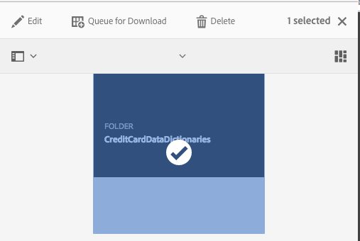

# Importazione ed esportazione di risorse in AEM Forms{#importing-and-exporting-assets-to-aem-forms}

È possibile spostare moduli e risorse correlate, temi, dizionari di dati, frammenti di documento e lettere tra istanze AEM Forms diverse. Tale spostamento è necessario quando si migrano sistemi o si spostano moduli da un server stage a un server di produzione. Per le risorse per le quali è supportato il caricamento e l’importazione tramite l’interfaccia utente di AEM Forms, l’utilizzo dell’interfaccia utente di Forms è il metodo consigliato per l’esportazione o l’importazione. Non è consigliabile utilizzare Gestione pacchetti AEM per esportare o importare tali risorse.

>[!NOTE]
>
>* In Forms 6.4 AEM, la struttura e i percorsi di crx-repository sono cambiati. Se importi le risorse da una versione precedente a Forms 6.4 AEM e il modulo ha alcune dipendenze dalla struttura precedente, devi esportare manualmente le dipendenze. Per informazioni dettagliate sulle modifiche nella struttura e nei percorsi dell&#39;archivio, vedere [Ristrutturazione dell&#39;archivio in AEM](/help/sites-deploying/repository-restructuring.md).

>

## Scaricare o caricare risorse Forms e Documenti {#download-or-upload-forms-amp-documents-assets}

L’interfaccia utente di AEM Forms ti consente di esportare le risorse da un’istanza AEM scaricandole come AEM pacchetto CRX o file binari. Puoi quindi importare il file AEM CRX-package scaricato o il file binario in un&#39;altra istanza AEM.

L’esportazione e l’importazione tramite l’interfaccia utente di AEM Forms è supportata per tutte le risorse, ad eccezione dei modelli di modulo adattivo e dei criteri per il contenuto dei moduli adattivi. Pertanto, durante l’esportazione di un modulo adattivo dall’interfaccia utente di AEM Forms, il relativo modello di modulo adattivo e i relativi criteri di contenuto non vengono esportati automaticamente come altre risorse correlate.

Per questi tipi di risorse, devi utilizzare Gestione pacchetti AEM per creare un pacchetto CRX sul server di AEM sorgente e installare il pacchetto sul server di destinazione. Per informazioni sulla creazione e l&#39;installazione dei pacchetti, vedere [Uso dei pacchetti](/help/sites-administering/package-manager.md).

### Download delle risorse di Forms e Documenti {#download-forms-amp-documents-assets}

Per scaricare le risorse di Forms e Documenti:

1. Accedi all&#39;istanza AEM Forms.
1. Tocca Experience Manager  > navigazione > Forms > Forms &amp; Documents.
1. Seleziona le risorse dei moduli e tocca l’icona **Scarica** .
1. In Scarica risorse , scegli una delle seguenti opzioni e tocca **Scarica**.

   * **Scarica come pacchetto CRX:** utilizza l’opzione per scaricare e spostare tutte le risorse selezionate e le dipendenze correlate da un’istanza di AEM Forms a un’altra. Scarica tutte le risorse e le cartelle come pacchetto crx. È possibile scaricare come pacchetto dall’interfaccia utente di AEM Forms tutte le risorse del modulo, compresi i moduli creati in AEM (moduli adattivi, comunicazioni interattive e frammenti di modulo adattivo), i set di moduli, i modelli di modulo, i documenti PDF e le risorse (XSD, XFS, immagini).
Il vantaggio di scaricare le risorse come pacchetto è che scarica anche le risorse utilizzate dalla risorsa selezionata per il download. Ad esempio, se si dispone di un modulo adattivo che utilizza un modello di modulo, XSD e un’immagine. Quando si seleziona questo modulo adattivo e lo si scarica come pacchetto, il pacchetto scaricato contiene anche il modello di modulo, XSD e l’immagine. Vengono scaricate anche tutte le proprietà di metadati (comprese le proprietà personalizzate) associate alla risorsa.

   * **Scarica le risorse come file binari:** utilizza l’opzione per scaricare solo i modelli di modulo (XDP), i PDF forms (PDF), il documento (PDF) e le risorse (immagini, schemi, fogli di stile). Puoi modificare queste risorse con applicazioni esterne. Scarica come file zip le risorse dei moduli che contengono file binari, come XSD, XDP, immagini, PDF e XDP.
Non è possibile scaricare moduli adattivi, comunicazioni interattive, frammenti di modulo adattivo, temi e set di moduli con l’opzione **Scarica risorse come file binari**. Per scaricare queste risorse, devi utilizzare l&#39;opzione **Scarica come pacchetto CRX** .

   Le risorse selezionate vengono scaricate come archivio (file .zip).

   >[!NOTE]
   >
   >Sia il pacchetto AEM che i file binari vengono scaricati come archivio (file .zip). I modelli per le risorse non vengono scaricati insieme alle risorse. È necessario esportare i modelli di risorse separatamente.

### Caricare risorse Forms e Documenti {#upload-forms-amp-documents-assets}

Per caricare le risorse di Forms e Documenti:

>[!VIDEO](https://vimeo.com/)

1. Accedi all&#39;istanza AEM Forms.
1. Tocca Experience Manager  > navigazione  Forms> Forms &amp; Documents.
1. Tocca **Crea** >**Caricamento file**. Viene visualizzata una finestra di dialogo per il caricamento di moduli o pacchetti.
1. Nella finestra di dialogo, sfoglia e seleziona il pacchetto o l’archivio da importare. È inoltre possibile selezionare moduli PDF, XSD, immagini, fogli di stile e XDP. Tocca **Apri**. La cartella o il nome del file selezionato non deve includere caratteri speciali.

   Nella finestra di dialogo, verifica i dettagli delle risorse caricate e tocca **Carica**.

   Se carichi una risorsa di moduli esistente, la risorsa viene aggiornata.

   >[!NOTE]
   >
   >Il caricamento di un pacchetto non sostituisce la gerarchia di cartelle esistente. Ad esempio, se disponi di un modulo adattivo denominato &quot;Training&quot; in posizione /content/dam/formsanddocuments su un server. Scarica il modulo adattivo e caricalo su un altro server. Il secondo server ha anche una cartella denominata &#39;Training&#39; nella stessa posizione /content/dam/formsanddocuments. Il caricamento non riesce.

## Download o caricamento di un tema {#downloading-or-uploading-a-theme}

Con AEM Forms puoi creare, scaricare o caricare temi. Un tema viene creato come altre risorse quali moduli, documenti e lettere. Puoi creare un tema, scaricarlo e caricarlo in un&#39;istanza separata per riutilizzarlo. Per ulteriori informazioni sui temi, consulta [Temi in AEM Forms](../../forms/using/themes.md).

### Download di un tema {#downloading-a-theme}

In AEM Forms puoi esportare i temi che puoi utilizzare in altri progetti o istanze. AEM consente di scaricare theme come file zip, da caricare sull’istanza.

Per scaricare un tema:

1. Accedi all&#39;istanza AEM Forms.
1. Tocca Experience Manager  > icona di navigazione  icona> Temi Forms>.
1. Seleziona il tema e tocca **Scarica**. Il tema viene scaricato come archivio (file .zip).

### Caricamento di un tema {#uploading-a-theme}

Puoi utilizzare i temi creati con i predefiniti di stile del progetto. Puoi importare pacchetti di temi creati da altri caricandoli sul tuo progetto.

Per caricare un tema:

1. Ad Experience Manager, passa a **Forms > Temi**.
1. Nella pagina Temi fare clic su **Crea > Caricamento file**.
1. Nel prompt Caricamento file, sfoglia e seleziona un pacchetto tema sul computer e fai clic su **Carica**.
Il tema caricato è disponibile nella pagina dei temi .

1. Accedi all&#39;istanza AEM Forms.
1. Tocca Experience Manager  > icona di navigazione  icona> Temi Forms>.
1. fai clic su **Crea** > **Caricamento file**. Nel prompt Caricamento file, sfoglia e seleziona un pacchetto tema sul computer e fai clic su **Carica**. Il tema viene caricato.

## Importare ed esportare risorse in Gestione Corrispondenza {#import-and-export-assets-in-correspondence-management}

Per condividere risorse, come dizionari di dati, lettere e frammenti di documento, tra due diverse implementazioni di Gestione Corrispondenza, puoi creare e condividere file .cmp. Un file .cmp può includere uno o più dizionari di dati, lettere, frammenti di documento e moduli.

### Esportare frammenti di documento, lettere e/o dizionari di dati {#export-document-fragments-letters-and-or-data-dictionaries}

1. Nelle pagine delle lettere, dei frammenti di documento o del dizionario dati, tocca e seleziona le risorse da esportare in un singolo pacchetto, quindi tocca Coda per il download. Le risorse sono allineate per l’esportazione.
1. Se necessario, ripetere il passaggio precedente per aggiungere lettere, frammenti di documento e dizionari di dati.
1. Tocca **Scarica**.
1. Gestione corrispondenza visualizza la finestra di dialogo Scarica risorse con un elenco di risorse nell’elenco di esportazione.

   

1. Per visualizzare le dipendenze esportate, tocca Risolvi . Oppure passa al passaggio successivo. Anche se non tocchi resolve, le dipendenze vengono comunque esportate.
1. Per scaricare il file .cmp, tocca **OK**.
1. Gestione corrispondenza scarica un file .cmp sul tuo computer.

   Il file .cmp include le risorse esportate. Puoi condividere il file .cmp con altri utenti. Altri utenti possono importare il file .cmp in un server diverso per ottenere tutte le risorse nel nuovo server.

### Esporta come pacchetto tutte le risorse di Gestione Corrispondenza {#export-all-the-correspondence-management-assets-as-a-package}

Utilizza questa opzione per scaricare tutte le risorse di Gestione Corrispondenza e le dipendenze correlate come pacchetto da un’istanza di moduli AEM.

Ad esempio, se Gestione corrispondenza ha una lettera che utilizza un&#39;immagine e un testo, il pacchetto scaricato contiene anche l&#39;immagine e il testo relativi alla lettera. Vengono scaricate anche tutte le proprietà di metadati (comprese le proprietà personalizzate) associate alla risorsa. Una volta scaricato il pacchetto (.cmp), puoi [importare il pacchetto in un&#39;altra istanza AEM Forms](../../forms/using/import-export-forms-templates.md#p-upload-forms-documents-assets-p).

Per scaricare come pacchetto tutte le risorse di Gestione Corrispondenza e le relative dipendenze, completa i seguenti passaggi:

1. Accedi al server AEM Forms come utente dei moduli.
1. Toccate **Adobe Experience Manager** nella barra di navigazione globale.
1. Tocca gli strumenti ( ), quindi tocca **Forms**.
1. Tocca **Esporta risorse di gestione corrispondenza**.

   

   ( &quot;Viene visualizzata la pagina Export All Correspondence Management Assets (Esporta tutte le risorse di gestione corrispondenza), in cui sono visualizzate le informazioni relative all’ultimo tentativo di esportazione del processo e un collegamento per scaricare l’ultimo pacchetto esportato correttamente.

   

1. Tocca **Esporta** e, nel messaggio di conferma, tocca **OK**.

   Al termine di un processo batch, vengono aggiornati gli ultimi dettagli di esecuzione e il collegamento per scaricare il pacchetto. Questo include informazioni quali l&#39;accesso Amministratore e se il batch viene eseguito correttamente o non è riuscito. Le risorse vengono esportate in un pacchetto e viene visualizzato il collegamento Scarica pacchetto esportato .

   >[!NOTE]
   >
   >Il processo Esporta tutte le risorse non può essere annullato una volta avviato. Inoltre, mentre l’esportazione di tutte le operazioni è in corso, non creare, eliminare, modificare o pubblicare risorse o avviare il processo Publish All Assets.a

1. Tocca il collegamento **Scarica pacchetto esportato** per scaricare il file del pacchetto.

   Per aggiungere le risorse nel pacchetto a un&#39;altra istanza di Gestione corrispondenza, [importa il pacchetto in un&#39;istanza AEM Forms](../../forms/using/import-export-forms-templates.md#p-upload-forms-documents-assets-p).

### Importare frammenti di documento, lettere e/o dizionari di dati in Gestione corrispondenza {#import-document-fragments-letters-and-or-data-dictionaries-into-correspondence-management}

Puoi importare le risorse esportate in un file .cmp. Un file .cmp può contenere una o più lettere, dizionari di dati, frammenti di documento e risorse dipendenti.

>[!NOTE]
>
>Durante l’importazione delle vecchie risorse di Gestione Corrispondenza per la migrazione, accedi utilizzando un account Amministratore. Per ulteriori informazioni sulla migrazione delle vecchie risorse di Gestione della corrispondenza, consulta [Migrare le risorse di Gestione della corrispondenza a AEM 6.1 forms](/help/forms/using/migration-utility.md).

1. Nella pagina del dizionario dati, delle lettere o dei frammenti di documento, tocca **Crea > Caricamento file** e seleziona il file .cmp.
1. Gestione corrispondenza visualizza la finestra di dialogo Importa risorse con l’elenco delle risorse importate. Tocca **Importa**.

   Dopo aver importato le risorse, le seguenti proprietà delle risorse vengono aggiornate mentre le altre proprietà rimangono uguali:

   * Autore: Visualizza l’ID dell’utente che ha importato la risorsa sul server
   * Modificato: Data e ora dell’importazione della risorsa sul server

   >[!NOTE]
   >
   >Per poter caricare XDP (come parte del file cmp o in altro modo), devi far parte del gruppo forms-power-users. Per i diritti di accesso, contatta l’amministratore.

## Esportare un’applicazione di flusso di lavoro {#export-a-workflow-application}

Puoi utilizzare AEM gestore di pacchetti per esportare le applicazioni del flusso di lavoro. La procedura è la seguente:

1. Apri Gestione pacchetti AEM Forms. L&#39;URL del gestore dei pacchetti è https://&lt;server>:&lt;port>/crx/packmgr.
1. Fai clic su **[!UICONTROL Crea pacchetto]**. Viene visualizzata la finestra di dialogo **[!UICONTROL Nuovo pacchetto]**.
1. Specifica nome, versione e gruppo per il pacchetto. Fai clic su **[!UICONTROL OK]**.
1. Fai clic su **[!UICONTROL Modifica]** e apri la scheda **[!UICONTROL Filtri]** . Fare clic su **[!UICONTROL Aggiungi filtro]**. Specifica il percorso dell’applicazione del flusso di lavoro. Ad esempio, /etc/fd/dashboard/startpoints/homemortgage. Fai clic su **[!UICONTROL Aggiungi regola]**.

1. Apri la scheda **[!UICONTROL Avanzate.]** Seleziona **[!UICONTROL Unisci]** o **[!UICONTROL Sovrascrivi]** nel campo Gestione ACL. Fai clic su **[!UICONTROL Salva]**.
1. Fai clic su **[!UICONTROL Genera]** per creare il pacchetto.

   Una volta generato il pacchetto, puoi scaricarlo e importarlo nell’altro server. L&#39;applicazione del flusso di lavoro viene visualizzata sul server in cui viene caricato il pacchetto.

   >[!NOTE]
   >
   >Affinché l’applicazione del flusso di lavoro funzioni correttamente, esporta anche il modulo adattivo e il modello di flusso di lavoro corrispondente con l’applicazione di lavoro.

## Cartelle e organizzazione delle risorse {#folders-and-organizing-assets}

L’interfaccia utente di AEM Forms utilizza le cartelle per disporre le risorse. Queste cartelle vengono utilizzate per disporre le risorse create all’interno dell’interfaccia utente di AEM Forms. È possibile rinominare, creare sottocartelle e archiviare risorse e documenti in queste cartelle. L’organizzazione di documenti e risorse in una cartella consente di raggruppare i file per facilitarne la gestione. È possibile selezionare una cartella e scegliere di scaricarla o eliminarla.

Per creare una cartella, completa i passaggi seguenti:

### Crea una cartella . {#create-a-folder}

1. Accedi all&#39;interfaccia utente di AEM Forms all&#39;indirizzo `https://<server>:<port>/aem/forms.html`.
1. Passa alla posizione in cui desideri creare una cartella.
1. Tocca Crea > Cartella .
1. Immetti i seguenti dettagli:

   * **Titolo:** nome visualizzato per la cartella
   * **Nome:** *(obbligatorio)* il nome del nodo in cui si desidera memorizzare la cartella nel repository

   >[!NOTE]
   >
   >Per impostazione predefinita, il valore del campo nome viene compilato automaticamente dal titolo. Il nome può contenere solo caratteri alfanumerici oppure i trattini (-) e i caratteri speciali carattere di sottolineatura (_). Tutti gli altri caratteri speciali immessi nel titolo vengono automaticamente sostituiti con un trattino e viene richiesto di confermare il nuovo nome. Puoi scegliere di continuare con il nome suggerito o modificarlo ulteriormente.

1. Nella posizione corrente nell’elenco delle risorse viene visualizzata una nuova cartella con il titolo definito.

   Se esiste una cartella con il nome specificato, l’invio non riesce e viene visualizzato un errore. Per visualizzare il messaggio di errore, passa il puntatore del mouse sull&#39;icona di errore  visualizzata accanto al campo del nome.

   Tocca la cartella appena creata per entrare nella cartella e creare risorse o cartelle all’interno della cartella. Inoltre, puoi selezionare una cartella e scegliere di accodarla per il download, eliminarla o modificarne il nome.

   

### Creare copie di una o più risorse o lettere {#create-copies-of-one-or-more-assets-or-letters}

È possibile utilizzare una risorsa e una lettera esistenti per creare rapidamente risorse e lettere con proprietà, contenuto e risorse ereditate simili. È possibile copiare e incollare dizionari di dati, frammenti di documento e lettere.

Per creare copie di risorse e lettere, effettua le seguenti operazioni:

1. Nella pagina Risorse o lettere pertinente, seleziona una o più risorse/lettere. Nell’interfaccia utente viene visualizzata l’icona Copia .
1. Tocca Copia. Nell’interfaccia utente viene visualizzata l’icona Incolla . È inoltre possibile scegliere di spostarsi o navigare all’interno di una cartella prima di incollare. Le cartelle diverse possono contenere risorse con gli stessi nomi. Per ulteriori informazioni sulle cartelle, consulta [Cartelle e organizzazione delle risorse](#folders-and-organizing-assets).
1. Tocca Incolla. Viene visualizzata la finestra di dialogo Incolla. Il sistema genera automaticamente nomi e titoli nelle nuove copie di risorse/lettere, ma puoi modificare i titoli e i nomi delle risorse/lettere.

   Se copi e incolla le risorse/lettere nella stessa posizione, viene aggiunto un suffisso &quot;-CopyXX&quot; al nome esistente della risorsa/lettera. Se non esiste alcun titolo per la risorsa o la lettera copiati, il campo del titolo generato automaticamente rimane vuoto.

1. Se necessario, modifica il Titolo e il Nome con cui vuoi salvare la copia della risorsa o della lettera.
1. Tocca Incolla. Vengono create nuove copie delle risorse copiate.

## Ricerca {#search-forms}

L’interfaccia utente di AEM Forms consente di cercare i contenuti. Utilizzando la barra superiore, puoi toccare Ricerca **[A]** per cercare nel contenuto risorse quali risorse e documenti.

Quando cerchi delle risorse, AEM Forms visualizza il pannello laterale. Puoi anche toccare  > Filtro **[B]** per richiamare il pannello laterale. Utilizzando i vari filtri nel pannello laterale, potete restringere la ricerca. Il pannello laterale consente inoltre di salvare le ricerche.

**A.** Ricerca  **B.** Filtro

Pannello laterale - Filtri

Nel pannello laterale, potete usare quanto segue per limitare i risultati della ricerca:

* Directory di ricerca
* Tag
* Criteri di ricerca, ad esempio Data di modifica, Stato pubblicazione, Stato LiveCopy.

Il pannello laterale consente inoltre di salvare le impostazioni di ricerca con i nomi desiderati.

Per ulteriori informazioni e istruzioni sull&#39;utilizzo di ricerca, filtri, ricerca salvata e pannello laterale, consulta [Ricerca](/help/sites-authoring/search.md).
