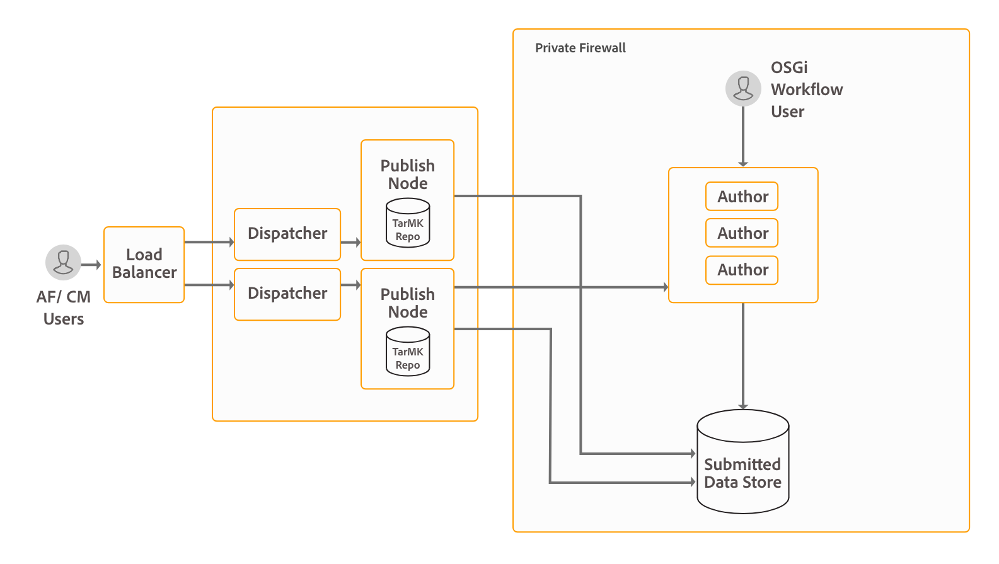

# Installazione e configurazione di un flusso di lavoro incentrato sui moduli in OSGi{#installing-and-configuring-forms-centric-workflow-on-osgi}

## Introduzione {#introduction}

Le aziende raccolgono ed elaborano dati da più moduli, sistemi back-end e altre origini dati. L&#39;elaborazione dei dati comporta procedure di revisione e approvazione, attività ripetitive e archiviazione dei dati. Ad esempio, rivedere un modulo e convertirlo in documento PDF. Se eseguite manualmente, le attività ripetitive possono richiedere molto tempo e risorse.

È possibile utilizzare il flusso di lavoro basato su [Forms su OSGi](../../forms/using/aem-forms-workflow.md) per creare rapidamente flussi di lavoro basati su moduli adattivi. Questi flussi di lavoro possono aiutarti ad automatizzare flussi di lavoro di revisione e approvazione, flussi di lavoro dei processi aziendali e altre attività ripetitive. Questi flussi di lavoro consentono inoltre di elaborare documenti (creare, assemblare, distribuire e archiviare documenti PDF, aggiungere firme digitali per limitare l&#39;accesso ai documenti, decodificare moduli con codice a barre e altro ancora) e utilizzare il flusso di lavoro di firma Adobe Sign con moduli e documenti.

Una volta configurati, questi flussi di lavoro possono essere attivati manualmente per completare un processo definito o eseguiti a livello di programmazione quando gli utenti inviano un modulo o una comunicazione interattiva. La funzionalità è inclusa nel pacchetto del componente aggiuntivo AEM Forms.

AEM Forms è una potente piattaforma di classe enterprise. Il flusso di lavoro basato su moduli in OSGi è solo una delle funzionalità dei AEM Forms. Per l&#39;elenco completo delle funzionalità, consultate [Introduzione ai AEM Forms](introduction-aem-forms.md).

>[!NOTE]
>
>Con il flusso di lavoro basato su Forms su OSGi, potete creare e implementare rapidamente flussi di lavoro per varie attività nello stack OSGi, senza dover installare la funzionalità di Process Management completa nello stack JEE. Per informazioni sulle differenze e le similarità tra le funzionalità, vedi un [confronto](capabilities-osgi-jee-workflows.md) dei flussi di lavoro AEM incentrati sui moduli in OSGi e Gestione dei processi in JEE.
>
>Dopo il confronto, se scegliete di installare la funzionalità Process Management sullo stack JEE, consultate [Installare o aggiornare AEM Forms in JEE](/help/forms/home.md) per informazioni dettagliate sull&#39;installazione e la configurazione dello stack JEE e delle funzionalità di Process Management.

## Topologia di distribuzione {#deployment-topology}

Il pacchetto aggiuntivo AEM Forms è un’applicazione distribuita in AEM. Per eseguire il flusso di lavoro basato su Forms sulla funzionalità OSGi, è necessario solo un AEM Author o un&#39;istanza di elaborazione (autore di produzione). Un&#39;istanza di elaborazione è un&#39;istanza AEM Author [](/help/forms/using/hardening-securing-aem-forms-environment.md) indurita. Non eseguite operazioni di authoring effettive, ad esempio la creazione di flussi di lavoro o moduli adattivi, sull’autore della produzione.

La topologia seguente è indicativa per l’esecuzione di AEM Forms Comunicazioni interattive, Gestione della corrispondenza, acquisizione dei dati AEM Forms e flusso di lavoro incentrato sui moduli sulle funzionalità OSGi. Per informazioni dettagliate sulla topologia, consultate Topologie di [architettura e distribuzione per AEM Forms](/help/forms/using/aem-forms-architecture-deployment.md).



AEM Forms Flusso di lavoro basato su moduli in OSGi esegue AEM Inbox e l’interfaccia utente per la creazione di modelli di flussi di lavoro AEM sulle istanze Author dei AEM Forms.

## Requisiti di sistema {#system-requirements}

>[!NOTE]
>
>Passate alla sezione Passaggi [](../../forms/using/installing-configuring-forms-centric-workflow-on-osgi.md#next-steps) successivi del documento, se avete già installato AEM Forms in OSGi come illustrato nell&#39;articolo [Installazione e configurazione delle funzionalità](../../forms/using/installing-configuring-aem-forms-osgi.md) di acquisizione dei dati.

Prima di iniziare a installare e configurare il flusso di lavoro incentrato su Forms in OSGi, assicurarsi che:

* L&#39;infrastruttura hardware e software è già in funzione. Per un elenco dettagliato di hardware e software supportati, consultate i requisiti [tecnici](/help/sites-deploying/technical-requirements.md).

* Il percorso di installazione dell’istanza AEM non contiene spazi bianchi.
* Un’istanza di AEM è attiva e in esecuzione. Nella terminologia di AEM, per &quot;istanza&quot; si intende una copia di AEM in esecuzione su un server in modalità di creazione o pubblicazione. Per eseguire il flusso di lavoro incentrato sui moduli in OSGi è necessaria almeno un’istanza di AEM (Author o Processing):

   * **Autore**: Un’istanza di AEM utilizzata per creare, caricare e modificare i contenuti e per amministrare il sito Web. Quando il contenuto è pronto per essere live, viene replicato nell’istanza di pubblicazione.
   * **Elaborazione:** Un&#39;istanza di elaborazione è un&#39;istanza AEM Author [](/help/forms/using/hardening-securing-aem-forms-environment.md) indurita. Potete impostare un&#39;istanza Author e renderla più indurita dopo l&#39;installazione.

   * **Pubblica**: Un’istanza di AEM che trasmette il contenuto pubblicato al pubblico su Internet o su una rete interna.

* I requisiti di memoria sono soddisfatti. Il pacchetto del componente aggiuntivo AEM Forms richiede:

   * 15 GB di spazio temporaneo per le installazioni basate su Microsoft Windows.
   * 6 GB di spazio temporaneo per le installazioni basate su UNIX.

* Requisiti aggiuntivi per i sistemi basati su UNIX: Se si utilizza il sistema operativo basato su UNIX, installare i pacchetti seguenti dal supporto di installazione del sistema operativo corrispondente.

<table>
 <tbody>
  <tr>
   <td>espatriato</td>
   <td>libxcb</td>
   <td>freetype</td>
   <td>libXau</td>
  </tr>
  <tr>
   <td>libSM</td>
   <td>zlib</td>
   <td>libICE</td>
   <td>libuuid</td>
  </tr>
  <tr>
   <td>glibc</td>
   <td>libXext</td>
   <td><p>nss-softokn-freebl</p> </td>
   <td>fontconfig</td>
  </tr>
  <tr>
   <td>libX11</td>
   <td>libXrendering</td>
   <td>libXrandr</td>
   <td>libXinerama</td>
  </tr>
 </tbody>
</table>

## Install AEM Forms add-on package {#install-aem-forms-add-on-package}

Il pacchetto aggiuntivo AEM Forms è un’applicazione distribuita in AEM. Il pacchetto contiene un flusso di lavoro incentrato su Forms su OSGi e altre funzionalità. Effettuate le seguenti operazioni per installare il pacchetto del componente aggiuntivo:

1. Apri distribuzione [](https://experience.adobe.com/downloads)software. È necessario un Adobe ID  per accedere a Distribuzione software.
1. Toccate **[!UICONTROL Adobe Experience Manager]** disponibile nel menu dell&#39;intestazione.
1. Nella sezione **[!UICONTROL Filtri]** :
   1. Selezionare **[!UICONTROL Forms]** dall&#39;elenco a discesa **[!UICONTROL Soluzione]** .
   2. Selezionate la versione e digitate il tipo di pacchetto. Potete anche utilizzare l&#39;opzione Download **[!UICONTROL di]** ricerca per filtrare i risultati.
1. Toccate il nome del pacchetto applicabile al sistema operativo in uso, selezionate **[!UICONTROL Accetta termini]** EULA e toccate **[!UICONTROL Scarica]**.
1. Aprite [Package Manager](https://docs.adobe.com/content/help/en/experience-manager-65/administering/contentmanagement/package-manager.html) e fate clic su **[!UICONTROL Carica pacchetto]** per caricare il pacchetto.
1. Select the package and click **[!UICONTROL Install]**.

   Potete anche scaricare il pacchetto tramite il collegamento diretto elencato nell&#39;articolo delle release [](https://helpx.adobe.com/it/aem-forms/kb/aem-forms-releases.html) AEM Forms.

1. Dopo l&#39;installazione del pacchetto, viene richiesto di riavviare l&#39;istanza di AEM. **Non riavviare immediatamente il server.** Prima di arrestare il server AEM Forms, attendete che i messaggi ServiceEvent REGISTERED e ServiceEvent UNREGISTERED non vengano visualizzati nel file [AEM-Installation-Directory]/crx-quickstart/logs/error.log e il registro sia stabile.
1. Ripetete i passaggi da 1 a 7 su tutte le istanze Author e Publish.

## Configurazioni post-installazione {#post-installation-configurations}

I AEM Forms hanno alcune configurazioni obbligatorie e facoltative. Le configurazioni obbligatorie includono la configurazione delle librerie BouncyCastle e dell&#39;agente di serializzazione. Le configurazioni facoltative includono la configurazione del dispatcher e  Adobe Target.

### Configurazioni post-installazione obbligatorie {#mandatory-post-installation-configurations}

#### Configurare le librerie RSA e BouncyCastle  {#configure-rsa-and-bouncycastle-libraries}

Per avviare la delega delle librerie, eseguite i seguenti passaggi su tutte le istanze Autore e Pubblica:

1. Interrompi l’istanza AEM sottostante.
1. Aprite il file [\crx-quickstart\conf\sling.properties della directory]di installazione di AEM per la modifica.

   Se avete utilizzato la directory [di installazione di]AEM [\crx-quickstart\bin\start.bat per avviare AEM, modificate le proprietà sling.properties ubicate in]AEM_root\crx-quickstart\.

1. Aggiungete le seguenti proprietà al file sling.properties:

   ```shell
   sling.bootdelegation.class.com.rsa.jsafe.provider.JsafeJCE=com.rsa.*
   sling.bootdelegation.class.org.bouncycastle.jce.provider.BouncyCastleProvider=org.bouncycastle.*
   ```

1. Salvate e chiudete il file e avviate l’istanza di AEM.
1. Ripetete i passaggi da 1 a 4 su tutte le istanze Author e Publish.

#### Configurare l’agente di serializzazione {#configure-the-serialization-agent}

Per aggiungere il pacchetto al inserire nell&#39;elenco Consentiti di , eseguite i seguenti passaggi su tutte le istanze Author e Publish:

1. Aprite AEM Configuration Manager in una finestra del browser. L’URL predefinito è https://&#39;[server]:[port]&#39;/system/console/configMgr.
1. Cerca e apri la configurazione **del firewall di** deserializzazione.
1. Aggiungete il pacchetto **sun.util.Calendar** al campo di **inserire nell&#39;elenco Consentiti** . Fate clic su Salva.
1. Ripetete i passaggi da 1 a 3 su tutte le istanze Author e Publish.

### Configurazioni di post-installazione facoltative {#optional-post-installation-configurations}

#### Configurare Dispatcher {#configure-dispatcher}

Dispatcher è uno strumento per il caching e il bilanciamento del carico per AEM. AEM Dispatcher aiuta anche a proteggere il server AEM dagli attacchi. Puoi aumentare la sicurezza dell’istanza AEM utilizzando Dispatcher insieme a un server Web di classe enterprise. Se utilizzate [Dispatcher](https://helpx.adobe.com/it/experience-manager/dispatcher/using/dispatcher-configuration.html), eseguite le seguenti configurazioni per i AEM Forms:

1. Configurare l&#39;accesso per i AEM Forms:

   Aprire il file dispatcher.any per la modifica. Andate alla sezione del filtro e aggiungete il seguente filtro alla sezione del filtro:

   `/0025 { /type "allow" /glob "* /bin/xfaforms/submitaction*" } # to enable AEM Forms submission`

   Salvate e chiudete il file. Per informazioni dettagliate sui filtri, consultate la documentazione [](https://helpx.adobe.com/it/experience-manager/dispatcher/using/dispatcher-configuration.html)Dispatcher.

1. Configurare il servizio filtro di riferimento:

   Accedete al gestore di configurazione Apache Felix come amministratore. L’URL predefinito del gestore di configurazione è https://&#39;server&#39;:[port_number]/system/console/configMgr. Nel menu **Configurazioni** , selezionate l&#39;opzione Filtro **di riferimento** Apache Sling. Nel campo Consenti ospitanti, immettete il nome host del dispatcher per consentirlo come referente e fate clic su **Salva**. The format of the entry is `https://'[server]:[port]'`.

#### Configura cache {#configure-cache}

La cache è un meccanismo per ridurre i tempi di accesso ai dati, ridurre la latenza e migliorare le velocità di ingresso/uscita (I/O). La cache dei moduli adattivi memorizza solo il contenuto HTML e la struttura JSON di un modulo adattivo senza salvare i dati precompilati. Consente di ridurre il tempo necessario per eseguire il rendering di un modulo adattivo.

* Utilizzando la cache dei moduli adattivi, utilizzare [AEM Dispatcher](https://helpx.adobe.com/it/experience-manager/dispatcher/using/dispatcher-configuration.html) per memorizzare nella cache le librerie client (CSS e JavaScript) di un modulo adattivo.
* Durante lo sviluppo di componenti personalizzati, mantenere disattivata la cache dei moduli adattivi sul server utilizzato per lo sviluppo.

Per configurare la cache dei moduli adattivi, effettuate le seguenti operazioni:

1. Andate al gestore di configurazione della console Web AEM all&#39;indirizzo `https://'[server]:[port]'/system/console/configMgr`.
1. Fare clic su Servizio **di configurazione del modulo** adattivo per modificarne i valori di configurazione. Nella finestra di dialogo Modifica valori di configurazione, specificare il numero massimo di moduli o documenti che un’istanza del server AEM Forms può memorizzare nella cache nel campo **Numero di moduli** adattivi. Il valore predefinito è 100. Fai clic su **Salva**.

   >[!NOTE]
   >
   >Per disabilitare la cache, impostare il valore nel campo Numero di moduli adattivi su **0**. La cache viene reimpostata e tutti i moduli e i documenti vengono rimossi dalla cache quando si disabilita o si modifica la configurazione della cache.

#### Configurare Adobe Sign {#configure-adobe-sign}

Adobe Sign consente flussi di lavoro di firma elettronica per i moduli adattivi. Le firme elettroniche migliorano i flussi di lavoro per l&#39;elaborazione di documenti per scopi legali, di vendita, di retribuzione, di gestione delle risorse umane e per molte altre aree.

In uno scenario OSGi con un flusso di lavoro tipico basato su Adobe Sign e Forms, un utente compila un modulo adattivo da **richiedere per un servizio**. Ad esempio, un&#39;applicazione con carta di credito e un benefit per i cittadini vengono modulo. Quando un utente compila, invia e firma il modulo di richiesta, viene avviato un flusso di lavoro di approvazione/rifiuto. Il provider di servizi controlla l’applicazione in AEM Inbox e utilizza Adobe Sign per firmare elettronicamente l’applicazione. Per abilitare flussi di lavoro di firma elettronica simili, è possibile integrare Adobe Sign con i AEM Forms.

Per utilizzare Adobe Sign con i AEM Forms, [integrare Adobe Sign con i AEM Forms](../../forms/using/adobe-sign-integration-adaptive-forms.md).

## Passaggi successivi {#next-steps}

È stato configurato un ambiente per l’utilizzo di un flusso di lavoro incentrato su Forms sulle funzionalità OSGi. Ora, i passi verso l&#39;utilizzo della funzionalità sono:

* [Utilizzo di un flusso di lavoro basato su moduli in OSGi](../../forms/using/aem-forms-workflow.md)
* [Riferimento passo flusso di lavoro](/help/sites-developing/workflows-step-ref.md)
* [Post-elaborazione di lettere e comunicazioni interattive](../../forms/using/submit-letter-topostprocess.md)

