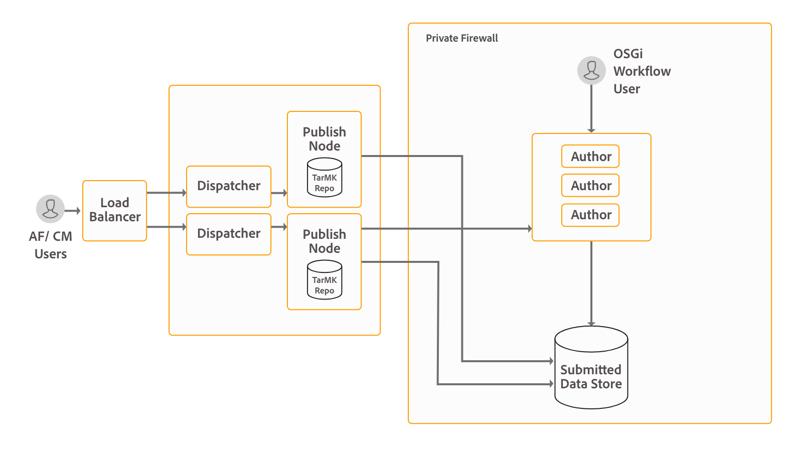

# Installare e configurare le comunicazioni interattive{#install-and-configure-interactive-communications}

## Introduzione {#introduction}

AEM Form è in grado di centralizzare la creazione, l&#39;assemblaggio, la gestione e la consegna di documenti sicuri e interattivi quali corrispondenza aziendale, documenti, rendiconti, note sui benefit, e-mail di marketing, fatture e kit di benvenuto. Questa funzionalità è nota come comunicazione interattiva. Questa funzionalità è inclusa nel pacchetto del componente aggiuntivo AEM Forms. Il pacchetto del componente aggiuntivo viene distribuito su un’istanza Author o Publish di AEM.

È possibile utilizzare la funzionalità di comunicazione interattiva per produrre comunicazioni in più formati. Ad esempio, web e PDF. È possibile integrare la comunicazione interattiva con AEM Workflow per elaborare e distribuire la comunicazione assemblata ai clienti sul canale desiderato. Ad esempio, inviando una comunicazione all’utente finale tramite e-mail.

Se si esegue l&#39;aggiornamento da una versione precedente e si è già investito nella gestione della corrispondenza, è possibile installare il [pacchetto di compatibilità](../../forms/using/installing-configuring-intreactive-communication-correspondence-management.md#install-compatibility-package) per continuare a utilizzare la gestione della corrispondenza. Per informazioni sulle differenze tra la comunicazione interattiva e la gestione della corrispondenza, vedere [Panoramica sulla comunicazione interattiva](/help/forms/using/interactive-communications-overview.md#interactive-communications-vs-correspondence-management).

AEM Forms è una potente piattaforma di classe enterprise. La comunicazione interattiva è solo una delle funzionalità di AEM Forms. Per l&#39;elenco completo delle funzionalità, vedere [Introduzione ad AEM Forms](../../forms/using/introduction-aem-forms.md).

## Topologia di distribuzione {#deployment-topology}

Il pacchetto del componente aggiuntivo AEM Forms è un’applicazione implementata in AEM. Per eseguire la funzionalità di comunicazione interattiva, è sufficiente almeno un’istanza di AEM Author and Processing. La topologia riportata di seguito è indicativa per l’esecuzione di comunicazioni interattive AEM Forms, gestione della corrispondenza, acquisizione dati AEM Forms e flusso di lavoro incentrato su Forms sulle funzionalità OSGi. Per informazioni dettagliate sulla topologia, vedere [Architettura e topologie di distribuzione per AEM Forms](/help/forms/using/aem-forms-architecture-deployment.md).



Le comunicazioni interattive di AEM Forms eseguono le interfacce utente di amministrazione, authoring e agente sulle istanze di authoring di AEM Forms. Le istanze Publish ospitano la versione finale delle comunicazioni interattive pronte per essere utilizzate dagli utenti finali.

## Requisiti di sistema {#system-requirements}

Prima di iniziare a installare e configurare le funzionalità di comunicazione interattiva e di gestione della corrispondenza di AEM Forms, assicurati che:

* Infrastruttura hardware e software già esistente. Per un elenco dettagliato di hardware e software supportati, vedere [requisiti tecnici](/help/sites-deploying/technical-requirements.md).

* Il percorso di installazione dell’istanza di AEM non contiene spazi vuoti.
* Un’istanza di AEM è attiva e in esecuzione. Nella terminologia di AEM, per &quot;istanza&quot; si intende una copia di AEM in esecuzione su un server in modalità di authoring o pubblicazione. Per eseguire le funzionalità di comunicazione interattiva e di gestione della corrispondenza di AEM Forms è necessaria almeno un’istanza di AEM (authoring o elaborazione):

   * **Autore**: istanza di AEM utilizzata per creare, caricare e modificare contenuti e amministrare il sito Web. Quando il contenuto è pronto per essere pubblicato, viene replicato nell’istanza di pubblicazione.
   * **Elaborazione:** Un&#39;istanza di elaborazione è un&#39;istanza [AEM Author](/help/forms/using/hardening-securing-aem-forms-environment.md) avanzata. Puoi impostare un’istanza Autore e irrigidirla dopo aver eseguito l’installazione.

   * **Pubblicazione**: istanza di AEM che fornisce il contenuto pubblicato al pubblico tramite Internet o una rete interna.

* I requisiti di memoria sono soddisfatti. Il pacchetto del componente aggiuntivo AEM Forms richiede:

   * 15 GB di spazio temporaneo per le installazioni basate su Microsoft® Windows.
   * 6 GB di spazio temporaneo per installazioni basate su UNIX.

* Requisiti aggiuntivi per i sistemi basati su UNIX: se si utilizza il sistema operativo basato su UNIX, installare i pacchetti seguenti dal supporto di installazione del rispettivo sistema operativo.

<table>
 <tbody>
  <tr>
   <td>expat</td>
   <td>libxcb</td>
   <td>freetype</td>
   <td>libXau</td>
  </tr>
  <tr>
   <td>libSM</td>
   <td>zlib</td>
   <td>libICE</td>
   <td>libuuide</td>
  </tr>
  <tr>
   <td>glibc</td>
   <td>libXext</td>
   <td><p>nss-softokn-freebl</p> </td>
   <td>fontconfig</td>
  </tr>
  <tr>
   <td>libX11</td>
   <td>libXrender</td>
   <td>libXrandr</td>
   <td>libXinerama</td>
  </tr>
 </tbody>
</table>

## Installare il pacchetto del componente aggiuntivo AEM Forms {#install-aem-forms-add-on-package}

Il pacchetto del componente aggiuntivo AEM Forms è un’applicazione implementata in AEM. Il pacchetto contiene la comunicazione interattiva di AEM Forms, la gestione della corrispondenza e altre funzionalità. Per installare il pacchetto aggiuntivo, effettua le seguenti operazioni:

1. Apri [Software Distribution](https://experience.adobe.com/downloads). Per accedere a Software Distribution è necessario disporre di un Adobe ID.
1. Seleziona **[!UICONTROL Adobe Experience Manager]** disponibile nel menu intestazione.
1. Nella sezione **[!UICONTROL Filtri]**:
   1. Selezionare **[!UICONTROL Forms]** dall&#39;elenco a discesa **[!UICONTROL Soluzione]**.
   2. Seleziona la versione e digita per il pacchetto. Puoi anche utilizzare l&#39;opzione **[!UICONTROL Cerca download]** per filtrare i risultati.
1. Selezionare il nome del pacchetto applicabile al sistema operativo in uso, selezionare **[!UICONTROL Accetta termini EULA]** e selezionare **[!UICONTROL Scarica]**.
1. Apri [Gestione pacchetti](https://experienceleague.adobe.com/docs/experience-manager-65/administering/contentmanagement/package-manager.html?lang=it) e fai clic su **[!UICONTROL Carica pacchetto]** per caricare il pacchetto.
1. Selezionare il pacchetto e fare clic su **[!UICONTROL Installa]**.

   Puoi scaricare il pacchetto anche tramite il collegamento diretto elencato nell&#39;articolo [Versioni di AEM Forms](https://experienceleague.adobe.com/docs/experience-manager-release-information/aem-release-updates/forms-updates/aem-forms-releases.html?lang=it).

1. Dopo l’installazione del pacchetto, viene richiesto di riavviare l’istanza di AEM. **Non riavviare immediatamente il server.** Prima di arrestare AEM Forms Server, attendere che i messaggi ServiceEvent REGISTERED e ServiceEvent UNREGISTERED non vengano visualizzati nel file [AEM-Installation-Directory]/crx-quickstart/logs/error.log e che il registro sia stabile.

   >[!NOTE]
   >
   > Si consiglia di utilizzare il comando “Ctrl + C” per riavviare SDK. Il riavvio di AEM SDK utilizzando metodi alternativi, ad esempio l’arresto dei processi Java, può causare incoerenze nell’ambiente di sviluppo AEM.

1. Ripeti i passaggi da 1 a 7 su tutte le istanze Author e Publish.

## Configurazioni post-installazione {#post-installation-configurations}

AEM Forms dispone di alcune configurazioni obbligatorie e opzionali. Le configurazioni obbligatorie includono la configurazione delle librerie BouncyCastle e dell’agente di serializzazione. Le configurazioni opzionali includono la configurazione di Dispatcher e Adobe Target.

### Configurazioni post-installazione obbligatorie {#mandatory-post-installation-configurations}

#### Configurare le librerie RSA e BouncyCastle  {#configure-rsa-and-bouncycastle-libraries}

Per avviare le librerie, esegui i seguenti passaggi su tutte le istanze Author e Publish:

1. Arresta l’istanza AEM sottostante.
1. Apri il file [directory di installazione di AEM]\crx-quickstart\conf\sling.properties per la modifica.

   Se hai utilizzato [la directory di installazione di AEM]\crx-quickstart\bin\start.bat per avviare AEM, modifica sling.properties in [AEM_root]\crx-quickstart\.

1. Aggiungi le seguenti proprietà al file sling.properties:

   ```shell
   sling.bootdelegation.class.com.rsa.jsafe.provider.JsafeJCE=com.rsa.*
   ```

1. Salva e chiudi il file e avvia l’istanza di AEM.
1. Ripeti i passaggi da 1 a 4 su tutte le istanze Author e Publish.

#### Configurare l’agente di serializzazione {#configure-the-serialization-agent}

Per aggiungere il pacchetto al inserisco nell&#39;elenco Consentiti di creazione, effettua le seguenti operazioni su tutte le istanze Author e Publish:

1. Apri AEM Configuration Manager in una finestra del browser. L&#39;URL predefinito è https://&#39;[server]:[porta]&#39;/system/console/configMgr.
1. Cerca e apri **Configurazione firewall deserializzazione**.
1. Aggiungere il pacchetto **sun.util.calendar** al campo **inserisce nell&#39;elenco Consentiti**. Fai clic su Salva.
1. Ripeti i passaggi 1-3 su tutte le istanze Author e Publish.

### Configurazioni opzionali post-installazione {#optional-post-installation-configurations}

#### Installare pacchetto di compatibilità {#install-compatibility-package}

La comunicazione interattiva è l’approccio predefinito e consigliato per creare comunicazioni con i clienti in AEM 6.5 Forms. Se si è eseguito l&#39;aggiornamento o la migrazione da una versione precedente e si intende continuare a utilizzare le lettere (Gestione corrispondenza), installare il [pacchetto di compatibilità AEMFD](https://experienceleague.adobe.com/docs/experience-manager-65/forms/upgrade-aem-forms/aem-forms-osgi-upgrade/compatibility-package.html?lang=it).

Il pacchetto di compatibilità per AEMFD consente di utilizzare le seguenti risorse di AEM 6.4 Forms, AEM 6.3 Forms e AEM 6.2 Forms su AEM 6.5 Forms:

* Frammenti di documenti
* Lettere
* Dizionari dati
* Moduli adattivi: modelli e pagine obsoleti

#### Configurare Dispatcher {#configure-dispatcher}

Dispatcher è lo strumento di caching e bilanciamento del carico di Adobe Experience Manager utilizzato con un server web di classe enterprise. Se utilizzi [Dispatcher](https://experienceleague.adobe.com/docs/experience-manager-dispatcher/using/configuring/dispatcher-configuration.html?lang=it), esegui le seguenti configurazioni per AEM Forms:

1. Configurare l’accesso per AEM Forms:

   Apri il file dispatcher.any per la modifica. Passa alla sezione del filtro e aggiungi il seguente filtro alla sezione del filtro:

   `/0025 { /type "allow" /glob "* /bin/xfaforms/submitaction*" } # to enable AEM Forms submission`

   Salvare e chiudere il file. Per informazioni dettagliate sui filtri, consulta la [documentazione di Dispatcher](https://experienceleague.adobe.com/docs/experience-manager-dispatcher/using/configuring/dispatcher-configuration.html?lang=it).

1. Configura il servizio filtro referenti:

   Accedi al gestore della configurazione Apache Felix come amministratore. L&#39;URL predefinito del gestore della configurazione è https://&#39;server&#39;:[port_number]/system/console/configMgr. Nel menu **Configurations**, seleziona l&#39;opzione **Apache Sling Referrer Filter**. Nel campo Consenti host, immetti il nome host di Dispatcher per consentirne l&#39;utilizzo come referrer e fai clic su **Salva**. Il formato della voce è https://&#39;[server]:[porta]&#39;.

#### Integrare Adobe Target {#integrate-adobe-target}

È probabile che i clienti abbandonino una comunicazione interattiva se l&#39;esperienza che offre non è coinvolgente. Se da un lato è frustrante per i clienti, dall&#39;altro aumenta il volume e i costi di supporto per la tua organizzazione. Identificare e fornire la giusta esperienza del cliente che aumenti il tasso di conversione è fondamentale e impegnativo. AEM Forms è la chiave di questo problema.

AEM Forms si integra con Adobe Target, una soluzione Adobe Experience Cloud, per fornire esperienze cliente personalizzate e coinvolgenti su più canali digitali. Per utilizzare Adobe Target per personalizzare una comunicazione interattiva, [Integra Adobe Target con AEM Forms](../../forms/using/ab-testing-adaptive-forms.md#setupandintegratetargetinaemforms).

#### Configurare la comunicazione SSL per il modello dati modulo  {#configure-ssl-communcation-for-form-data-model}

Puoi abilitare la comunicazione SSL per il modello dati modulo. Per abilitare la comunicazione SSL per il modello dati del modulo, prima di avviare qualsiasi istanza di AEM Forms, aggiungi i certificati all’archivio fonti attendibili Java™ di tutte le istanze. Puoi eseguire il comando seguente per aggiungere i certificati:

`keytool -import -alias <alias-name> -file <pathTo .cer certificate file> -keystore <<pathToJRE>\lib\security\cacerts>`

## Passaggi successivi {#next-steps}

Hai configurato un ambiente per l’utilizzo delle funzionalità di comunicazione interattiva e di gestione della corrispondenza. Ora, i passaggi per utilizzare la funzionalità sono i seguenti:

* [Panoramica sulla gestione della corrispondenza](/help/forms/using/interactive-communications-overview.md)

* [Creare una comunicazione interattiva](../../forms/using/create-interactive-communication.md)

* [Creare una lettera di gestione della corrispondenza](../../forms/using/create-letter.md)
