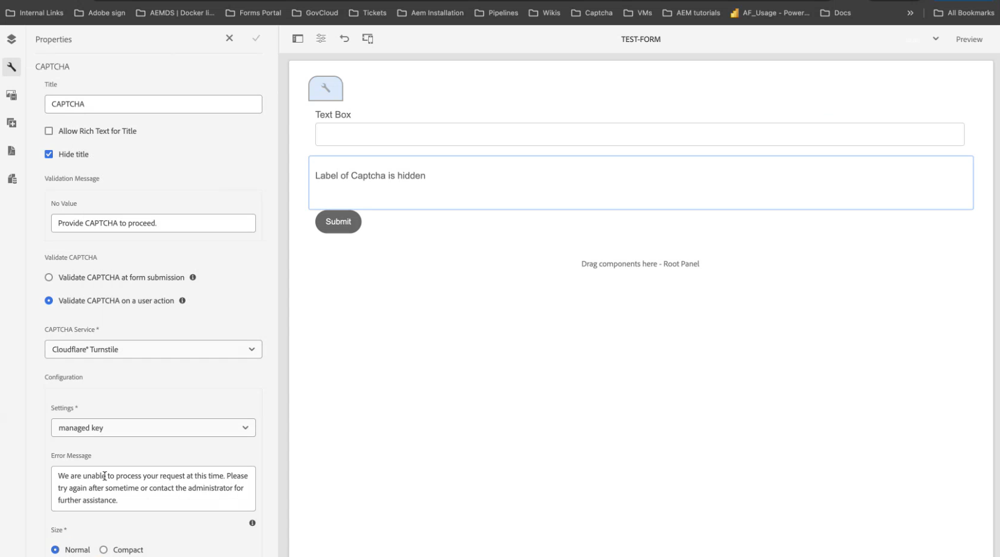

# Collegare l’ambiente AEM Forms con Turnstile {#connect-your-forms-environment-with-turnstile-service}

<!--
This feature is based on Feature Toggle id `FT_FORMS-12407`. To enable the feature, follow the steps given in the [Enable Feature Toggle](/help/forms/using/enable-feature-toggle.md) article. 
-->

Questa funzionalità non è attivata per impostazione predefinita. È possibile scrivere dal proprio indirizzo ufficiale all&#39;indirizzo aem-forms-ea@adobe.com per richiedere l&#39;accesso alla funzionalità.

Il CAPTCHA (Completely Automated Public Turing test to tell Computers and Humans Apart) è un programma comunemente utilizzato nelle transazioni online per distinguere tra esseri umani e programmi o bot automatizzati. Rappresenta una sfida e valuta la risposta dell’utente per determinare se si tratta di un essere umano o di un bot che interagisce con il sito. Impedisce all’utente di procedere se il test non riesce e contribuisce a rendere sicure le transazioni online impedendo ai bot di pubblicare spam o avere scopi dannosi.

AEM Forms 6.5 supporta le seguenti soluzioni CAPTCHA:

* [Captcha Turnstile](/help/forms/using/integrate-adaptive-forms-turnstile.md)
* [Google reCAPTCHA](/help/forms/using/captcha-adaptive-forms.md)
* [hCaptcha](/help/forms/using/integrate-adaptive-forms-hcaptcha.md)

<!-- -->

## Integrare l’ambiente AEM Forms con Turnstile Captcha

Il Turnstile Captcha di Cloudflare è una misura di sicurezza che mira a proteggere moduli e siti da bot automatizzati, attacchi dannosi, spam e traffico automatizzato indesiderato. Presenta una casella di controllo all’invio del modulo per verificare che sia umana, prima di consentire loro di inviare il modulo.

>[!VIDEO](https://video.tv.adobe.com/v/3440948?captions=ita)

### Prerequisiti per integrare l’ambiente AEM Forms con Turnstile Captcha {#prerequisite}

Per configurare Turnstile per AEM Forms, è necessario ottenere la [chiave del sito e la chiave segreta](https://developers.cloudflare.com/turnstile/get-started/) dal sito Web Turnstile.

### Configura tornello {#steps-to-configure-hcaptcha}

Per integrare AEM Forms con il servizio Turnstile, effettuare le seguenti operazioni:

1. Crea un Contenitore di configurazione nell’ambiente AEM Forms. Un contenitore di configurazione contiene le configurazioni cloud utilizzate per connettere AEM Forms a servizi esterni. Per creare un contenitore di configurazione:
   1. Apri il tuo ambiente AEM Forms.
   1. Vai a **[!UICONTROL Strumenti > Generale > Browser configurazioni]**.
   1. Nel Browser configurazioni, seleziona una cartella esistente o creane una nuova:
      * Per creare una **nuova cartella** e abilitare le configurazioni cloud:
         1. Nel browser configurazioni fare clic su **[!UICONTROL Crea]**.
         1. Nella finestra di dialogo Crea configurazione, specifica un nome, un titolo e seleziona **[!UICONTROL Configurazioni cloud]**.
         1. Fai clic su **[!UICONTROL Crea]**.
      * Per abilitare la configurazione cloud per una **cartella esistente**:
         1. Nel Browser configurazioni, selezionare la cartella e fare clic su **[!UICONTROL Proprietà]**.
         1. Nella finestra di dialogo Proprietà di configurazione, abilita **[!UICONTROL Configurazioni cloud]**.
         1. Fai clic su **[!UICONTROL Salva e chiudi]** per salvare la configurazione.

1. Configurare i Cloud Service:
   1. Nell&#39;istanza dell&#39;autore AEM, vai a  > **[!UICONTROL Cloud Service]** e fai clic su **[!UICONTROL Turnstile]**.

      
   1. Seleziona un Contenitore di configurazione, creato o aggiornato, come descritto nella sezione precedente. Fai clic su **[!UICONTROL Crea]**.

      
   1. Specificare **[!UICONTROL Tipo widget]** come gestito, non interattivo o invisibile.
   1. Fornisci altri dettagli come **[!UICONTROL Titolo]**, **[!UICONTROL Nome]**.
   1. Specificare **[!UICONTROL Chiave sito]** e **[!UICONTROL Chiave segreta]** per il servizio tornello [ottenuto nel prerequisito](#prerequisite).
   1. Fai clic su **[!UICONTROL Crea]**.

      

   >[!NOTE]
   > Gli utenti non devono modificare l’URL di convalida JavaScript lato client e l’URL di convalida lato server, in quanto sono già precompilati per la convalida lato client.

   Una volta configurato, il servizio Turnstile Captcha è disponibile per l’utilizzo nel modulo adattivo.

## Usa tornello in un modulo adattivo {#using-turnstile-aem-6.5}

1. Apri il tuo ambiente AEM Forms.
1. Vai a **[!UICONTROL Forms]** > **[!UICONTROL Forms e documenti]**.
1. Selezionare un modulo adattivo e fare clic su **[!UICONTROL Proprietà]**. In **[!UICONTROL Contenitore configurazione]**, selezionare il Contenitore configurazione che contiene la configurazione cloud che connette AEM Forms a Turnstile.
1. Fai clic su **[!UICONTROL Salva e chiudi]**.

   Se non disponi di un contenitore di configurazione per configurare il servizio Captcha, consulta la sezione [Configurare un contenitore di configurazione](#configure-turnstile-steps-to-configure-hcaptcha) per scoprire come creare un contenitore di configurazione.

   

1. Seleziona un modulo adattivo e fai clic su **[!UICONTROL Modifica]** per aprire il modulo adattivo nell&#39;editor.
1. Dal browser componenti, trascina il componente **[!UICONTROL Captcha]** nel modulo adattivo.
1. Seleziona il componente **[!UICONTROL Captcha]** e fai clic sull&#39;icona Proprietà . Apre la finestra di dialogo delle proprietà. Specifica le seguenti proprietà:

   <!---->
   

   * **[!UICONTROL Titolo]:** Specifica il titolo del componente Captcha. puoi identificare facilmente un componente modulo con il suo titolo univoco sia nel modulo che nell’editor di regole.
   * **[!UICONTROL Impostazioni configurazione]:** Selezionare una configurazione cloud configurata per Turnstile.
   * **[!UICONTROL Messaggio di convalida]:** Fornisci un messaggio di convalida per la convalida Captcha all&#39;invio del modulo o a un&#39;azione dell&#39;utente.
   * **[!UICONTROL Servizio Captcha]:** Seleziona il servizio CAPTCHA per l&#39;invio del modulo, qui selezioni Turnstile®.
   * **[!UICONTROL Impostazioni configurazione]:** Seleziona la configurazione cloud configurata per Turnstile®.

     >[!NOTE]
     >Puoi avere più configurazioni cloud nell’ambiente per uno scopo simile. Quindi, scegli il servizio con attenzione. Se non è elencato alcun servizio, consulta [Connettere l&#39;ambiente AEM Forms con Turnstile](#connect-your-forms-environment-with-turnstile-service) per scoprire come creare un Cloud Service che connette l&#39;ambiente AEM Forms con il servizio Turnstile.

   * **[!UICONTROL Messaggio di errore]:** Fornisci il messaggio di errore da visualizzare all&#39;utente quando l&#39;invio Captcha non riesce.
   * **Dimensione captcha:** È possibile selezionare la dimensione di visualizzazione della finestra di dialogo di verifica hCaptcha®. Utilizza l&#39;opzione **[!UICONTROL Compact]** per visualizzare una finestra di dialogo di richiesta di verifica hCaptcha® di piccole dimensioni e **[!UICONTROL Normal]** di dimensioni relativamente grandi.

1. Seleziona **[!UICONTROL Fine]**.

Ora, solo le forme legittime, in cui il compilatore di moduli elimina con successo la sfida posta dal servizio Turnstile sono consentite per l&#39;invio del modulo.

## Domande frequenti

* **Q: posso utilizzare più di un componente Captcha in un modulo adattivo?**
* **Ans:** L&#39;utilizzo di più componenti Captcha in un modulo adattivo non è supportato. Inoltre, si sconsiglia di utilizzare un componente Captcha in un frammento o in un pannello contrassegnato per il caricamento lento.

## Consulta anche {#see-also}

* [Utilizzo del CAPTCHA nei moduli adattivi](/help/forms/using/captcha-adaptive-forms.md)
* [Utilizzo di hCaptcha nei moduli adattivi](/help/forms/using/integrate-adaptive-forms-hcaptcha.md)
