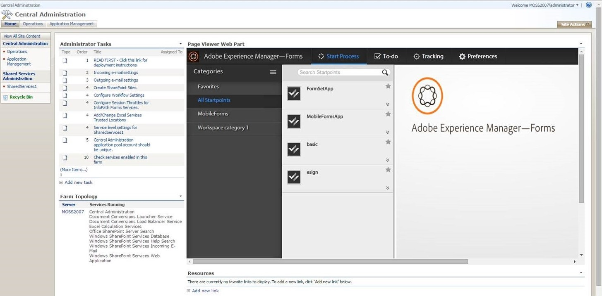

# Integrazione dell’area di lavoro dei moduli AEM con Microsoft Office SharePoint Server{#integrating-aem-forms-workspace-with-microsoft-office-sharepoint-server}

**- Requisiti**

**Conoscenze preliminari**
Prima di poter aggiungere AEM Forms Workspace a SharePoint Server, è necessario disporre dell&#39;accesso a SharePoint Server con i privilegi appropriati e conoscere l&#39;URL per accedere a Workspace. I passaggi seguenti presuppongono che tu abbia familiarità con SharePoint Server. Per ulteriori informazioni sulle web part in SharePoint Server, vedere Web part in Windows SharePoint Services.

**Livello utente**
Inizio

È possibile utilizzare AEM Forms Workspace come web part in Microsoft Office SharePoint Server (ad esempio, Microsoft Office SharePoint Server 2007). Gli utenti possono accedere ad AEM Forms Workspace connettendosi al tuo server SharePoint utilizzando un browser web per fornire un’esperienza unificata. In questo articolo vengono illustrati i passaggi di base per visualizzare AEM Forms Workspace come web part in Microsoft Office SharePoint Server. Puoi eseguire i passaggi descritti in questo articolo per fornire un’esperienza unificata in modo che gli utenti che si connettono al server SharePoint possano accedere ad AEM Forms Workspace dalla stessa porta.

>[!NOTE]
>
>I passaggi elencati in questo articolo sono specifici per Microsoft SharePoint Server 2007. È inoltre possibile configurare HTML Workspace con altre versioni supportate di Microsoft SharePoint.

## Integrare AEM Forms Workspace con Microsoft Office SharePoint Server 2007 {#integrate-aem-forms-workspace-with-microsoft-office-sharepoint-server}

Per integrare AEM Forms Workspace in una web part, effettuare le seguenti operazioni:

1. In un browser web, accedi al sito SharePoint, ad esempio `https://[myMOSSserver]:44299/default.aspx` dove `[myMOSSserver]` è il nome o l&#39;indirizzo IP del server Sharepoint.

   >[!NOTE]
   >
   >44299 è il numero di porta predefinito per il server SharePoint. Il numero di porta dipende dall&#39;installazione di SharePoint Server.

1. Nella parte superiore destra della pagina Web, fai clic su **Azioni del sito** e seleziona **Modifica pagina**.
1. Fai clic su **Aggiungere una web part** pulsante.
1. Nella finestra di dialogo Aggiungi web part - pagina Web, in Varie, selezionare **Web part Visualizzatore pagine** e quindi fare clic su **Aggiungi**.
1. Nella casella Web part Visualizzatore pagine fare clic su **modifica** e seleziona **Modifica web part condivisa**.

   >[!NOTE]
   >
   >La casella Web part Visualizzatore pagine viene visualizzata sotto **Aggiungere una web part** al punto 3, come illustrato nella figura seguente (Figura 1):

   

   Figura 1. - Casella web part Visualizzatore pagine nel server Microsoft Office SharePoint.

1. Nella pagina Visualizzatore pagine eseguire le operazioni seguenti:

   1. Nella casella Collegamento, digita l’URL di AEM Forms Workspace, ad esempio `https://[AEM_forms_Server]:8080/lc/ws` dove `[AEM_forms_Server]` rappresenta l’IP o il nome del server AEM forms.
   1. Clic **Aspetto** e modificare l’altezza, la larghezza e il titolo in modo da visualizzare l’intera interfaccia utente di Workspace. Ad esempio, è possibile impostare l&#39;altezza e la larghezza rispettivamente su 6 e 11 pollici.
   1. Clic **Test collegamento**. Viene visualizzata una nuova finestra del browser Web contenente l&#39;area di lavoro.
   1. (Facoltativo) Fai clic su **Layout** e modificare il layout di Workspace nella web part.
   1. (Facoltativo) Fai clic su **Avanzate** e modificare altre impostazioni, ad esempio la descrizione e la possibilità di ridurre a icona o chiudere Workspace nella web part.

      Clic **Applica**.

1. Clic **Esci dalla modalità di modifica** e verifica di poter accedere a Workspace.

Dopo aver completato i passaggi precedenti, il sito SharePoint sarà simile a quello della figura seguente (Figura 2):

Figura 2 - AEM Forms Workspace integrato con Microsoft Office SharePoint Server
