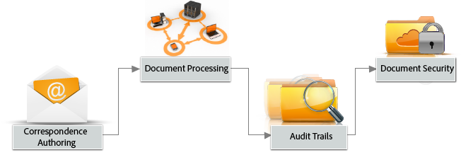

# Introduzione ad AEM Forms{#introduction-to-aem-forms}

| Versione | Collegamento articolo |
| -------- | ---------------------------- |
| AEM as a Cloud Service | [Fai clic qui](https://experienceleague.adobe.com/docs/experience-manager-cloud-service/content/forms/forms-overview/home.html) |
| AEM 6.5 | Questo articolo |

Per informazioni sulle funzioni e sui miglioramenti più recenti di AEM Forms, consulta [Novità di AEM Forms](../../forms/using/whats-new.md).

## Informazioni su AEM Forms {#about-aem-forms}

Adobe Experience Manager (AEM) fornisce una soluzione di facile utilizzo per la creazione, la gestione, la pubblicazione e l’aggiornamento di moduli digitali complessi, garantendo al contempo l’integrazione con i processi back-end, le regole aziendali e i dati.

AEM Forms combina le funzionalità di authoring, gestione e pubblicazione dei moduli con le funzionalità di gestione della corrispondenza, la sicurezza dei documenti e l’analisi integrata per creare esperienze end-to-end coinvolgenti. Progettato per funzionare su canali web e mobili, AEM Forms può essere integrato in modo efficiente nei processi aziendali, riducendo i processi cartacei e gli errori e migliorando l&#39;efficienza.

Nelle grandi aziende, i moduli sono spesso creati una volta sola, per poi essere riutilizzati copiandoli in un sistema di gestione dei contenuti. Mantenere aggiornato un ampio database di moduli e renderli individuabili può essere una sfida considerevole. AEM fornisce un Forms Portal personalizzabile che consente ai clienti di trovare e accedere ai moduli necessari sia sui canali web che mobile.

AEM Forms fornisce strumenti di gestione dei moduli che consentono non solo di gestire i moduli adattivi, ma anche i moduli XFA, i PDF forms e le risorse correlate. Per ulteriori informazioni, consulta [Introduzione alla gestione dei moduli](../../forms/using/introduction-managing-forms.md).

>[!NOTE]
>
>La funzione Forms adattivo, disponibile in [QuickStart per AEM 6.5](https://experienceleague.adobe.com/docs/experience-manager-65/deploying/deploying/deploy.html?lang=it), è progettata esclusivamente a scopo di esplorazione e valutazione. Per l’utilizzo in produzione, è essenziale ottenere una licenza valida per AEM Forms, in quanto la funzionalità Adaptive Forms richiede una licenza appropriata.

### Funzionalità principali {#key-capabilities}

In sintesi, AEM Forms fornisce potenti funzioni di gestione dei moduli, come le seguenti, che riducono i processi manuali e aumentano la soddisfazione dei clienti.

* Un portale Forms centralizzato per la progettazione e la distribuzione di moduli dinamici, tra cui PDF, HTML5 e adattivi
* Interfaccia grafica utente di facile utilizzo che consente agli utenti aziendali di importare, gestire, visualizzare in anteprima e pubblicare facilmente i moduli
* Una directory di moduli reattivi con potenti funzioni di ricerca che utilizzano parole chiave, tag e metadati
* Rilevamento dinamico del dispositivo e della posizione di un utente per eseguire il rendering appropriato del modulo tra canali web e mobili
* Integrazione con Adobe Analytics per misurare in modo efficace le metriche di utilizzo dei moduli
* Integrazione con i servizi Adobe Document Cloud eSign o Scribble per firmare elettronicamente i documenti contenenti informazioni riservate
* Funzionalità automatizzate di pubblicazione dei moduli e capacità di fornire comunicazioni tempestive, personalizzate e coerenti tramite più canali

## Tipi di moduli AEM {#aem-form-types}

AEM Forms ti consente di estendere i moduli nuovi ed esistenti per creare:

* HTML e PDF forms impaginati, perfetti per i pixel, che hanno un aspetto simile alla carta, oppure
* moduli adattivi con rendering automatico per il dispositivo e il browser di un utente.

**PDF forms**

I PDF forms possono essere compilati in modalità non in linea, salvati localmente e i dati del modulo possono essere inviati quando si è connessi in linea. È possibile utilizzare codici a barre 2D per acquisire i dati dei moduli e firme digitali per convalidarne l&#39;autenticità per gli utenti.

**Moduli HTML**

I moduli basati su browser HTML5 possono essere visualizzati sia su dispositivi mobili che su browser desktop. È possibile firmare elettronicamente i moduli HTML utilizzando i servizi Scribble o eSign.

**Moduli adattivi**

I moduli adattivi possono adattarsi dinamicamente alle risposte degli utenti aggiungendo o rimuovendo campi o sezioni in base alle esigenze. L’AEM consente di riutilizzare i modelli di modulo XML Adobi per creare moduli adattivi.

### Funzioni supportate {#supported-features}

Tutti i tipi di modulo supportano le seguenti funzionalità:

* Layout dinamico
* Convalida campo modulo
* Guida sensibile al contesto
* Gestione di script e dati XML
* Progettazione e controllo dell&#39;accessibilità
* Possibilità di salvare i moduli sul lato server
* Supporto per file allegati
* Integrazione con HTML Workspace per l’acquisizione dei dati

## Raccolta dati offline {#offline-data-collection}

Una volta inviati i dati del modulo, Adobe Experience Manager li collega ai sistemi esistenti, alle regole aziendali e alle persone necessarie.

AEM Forms fornisce Forms Workspace, un’app mobile che estende i processi aziendali digitali ai dispositivi mobili. Utilizzando Forms Workspace, puoi raccogliere e registrare dati anche offline. Forms Workspace utilizza le funzionalità del dispositivo mobile e consente di acquisire foto, video e raccogliere dati quali marche temporali e altre informazioni. Alla successiva connessione a una rete, è possibile sincronizzare i dati raccolti.

L&#39;acquisizione dei dati offline e la loro sincronizzazione alla successiva connessione è particolarmente utile per le persone sul campo. Migliora la produttività e riduce gli errori.

**Vantaggi dell’utilizzo di Forms Workspace per la raccolta dati offline**

* Applicazione HTML Workspace facile da usare per l&#39;assegnazione delle attività e il tracciamento
* Ambiente di progettazione del flusso di lavoro con trascinamento della selezione
* Connettori ECM (Enterprise Content Management)
* Supporto di standard aperti, inclusi XML e SOAP per la connessione dei dati dei moduli con i sistemi aziendali
* I report HTML predefiniti monitorano i backlog, le code di lavoro e gli indicatori di prestazioni chiave (KPI, Key Performance Indicators)
* Dashboard personalizzabili per informazioni in tempo reale sulle operazioni aziendali
* API per la connessione con strumenti di reporting di terze parti

## Comunicazione personalizzata {#personalized-communication}

Un componente importante di un’esperienza digitale self-service efficiente è la comunicazione tempestiva e personalizzata di informazioni a cui gli utenti possono accedere da qualsiasi luogo e su qualsiasi dispositivo. Le comunicazioni personalizzate e tempestive possono migliorare sia i tassi di conversione che la soddisfazione degli utenti.

Utilizzando AEM Forms, gli utenti aziendali possono creare esperienze utente personalizzate e coinvolgenti personalizzando i modelli di documento, incorporando informazioni dai processi back-end e includendo componenti interattivi. Un’interfaccia utente intuitiva consente agli utenti non tecnici di sviluppare regole di business che determinano quando generare una comunicazione basata su un’interrogazione o avviare una risposta generata dall’utente.

Documenti personalizzati come ricevute, kit di benvenuto e rendiconti possono essere facilmente consegnati su più canali. Le organizzazioni possono indirizzare il traffico verso portali web personalizzati, con conseguente registrazione o acquisto di servizi aggiuntivi.

**Funzioni principali**

* Ambiente di authoring della corrispondenza con supporto per modelli, blocchi di contenuto, regole aziendali e altro ancora
* Conversione e assemblaggio di documenti
* Supporto per la consegna di documenti in batch o on-demand tramite più canali, inclusi web, e-mail e carta
* Audit trail con cronologia modifiche
* Supporto per le firme digitali per la convalida dell&#39;integrità dei contenuti e dell&#39;identità del firmatario
* Componente aggiuntivo Document Security per AEM Forms, tra cui crittografia, criteri di utilizzo, tracciamento e controllo

Flusso di lavoro di comunicazione personalizzato semplificato

