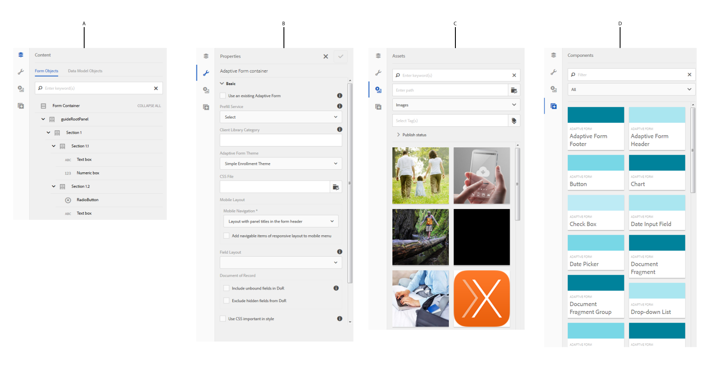

# Introduzione all’authoring di moduli adattivi {#introduction-to-authoring-adaptive-forms}

| Versione | Collegamento articolo |
| -------- | ---------------------------- |
| AEM as a Cloud Service | [Fai clic qui](https://experienceleague.adobe.com/docs/experience-manager-cloud-service/content/forms/adaptive-forms-authoring/authoring-adaptive-forms-foundation-components/create-an-adaptive-form-on-forms-cs/introduction-forms-authoring.html) |
| AEM 6.5 | Questo articolo |

## Panoramica {#overview}

I moduli adattivi consentono di creare moduli coinvolgenti, reattivi, dinamici e adattivi. AEM Forms fornisce un’interfaccia utente intuitiva e componenti pronti all’uso per la creazione e l’utilizzo di moduli adattivi. Puoi scegliere di creare un modulo adattivo basato su un modello di modulo o uno schema di modulo o senza un modello di modulo. È importante scegliere con attenzione il modello di modulo, che deve risultare adatto non solo alle proprie esigenze, ma deve consentire di accrescere gli investimenti e le risorse infrastrutturali esistenti. Puoi scegliere tra le seguenti opzioni per creare un modulo adattivo:

* **Seleziona un modello dati del modulo**
  [Integrazione dati](../../forms/using/data-integration.md) consente di integrare entità e servizi da diverse origini dati in un modello dati modulo che può essere utilizzato per creare moduli adattivi. Scegli il modello dati del modulo se il modulo adattivo che stai creando richiede il recupero e la scrittura di dati da e verso più origini dati.

* **Utilizzo di un modello di modulo XDP**
Si tratta di un modello di modulo ideale per gli investimenti in moduli basati su XFA o XDP. Fornisce un modo diretto per convertire i moduli basati su XFA in moduli adattivi. Eventuali regole XFA esistenti vengono mantenute nei moduli adattivi associati. I moduli adattivi risultanti supportano i costrutti XFA, ad esempio convalide, eventi, proprietà e modelli.

* **Utilizzo di una definizione di schema XML (XSD) o di uno schema JSON**
Gli schemi XML e JSON rappresentano la struttura in cui i dati vengono prodotti o utilizzati dal sistema back-end della tua organizzazione. È possibile associare lo schema a un modulo adattivo e utilizzarne gli elementi per aggiungere contenuto dinamico al modulo adattivo. Gli elementi dello schema saranno disponibili per l’utilizzo nella scheda Oggetti modello dati del browser Contenuto durante l’authoring di moduli adattivi.

* **Utilizzo di nessuno o senza un modello di modulo**
I moduli adattivi creati con questa opzione non utilizzano alcun modello di modulo. I dati XML generati da tali moduli hanno una struttura piatta con campi e valori corrispondenti.

Per ulteriori informazioni sulla creazione di un modulo adattivo, vedi [Creazione di un modulo adattivo](../../forms/using/creating-adaptive-form.md).

## Interfaccia utente per l’authoring di moduli adattivi {#adaptive-form-authoring-ui}

L’interfaccia utente ottimizzata per l’authoring di moduli adattivi è intuitiva e offre:

* Funzione di trascinamento
* Componenti standard per moduli
* Archivio integrato per le risorse

Quando crei o modifichi un modulo adattivo esistente, utilizzi i seguenti elementi dell’interfaccia utente:

* [Barra laterale](#sidebar)
* [Barra degli strumenti della pagina](#page-toolbar)
* [Barra degli strumenti del componente](#component-toolbar)
* [Pagina modulo adattivo](#af-page)

**A.** Barra laterale **B.** Barra laterale **C.** Pagina modulo adattivo

### Barra laterale {#sidebar}

La barra laterale consente di:

* Vedere il contenuto del modulo, ad esempio pannelli, componenti, campi e layout.
* Modificare le proprietà dei componenti.
* Cercare, visualizzare e utilizzare le risorse nell’archivio Digital Asset Management (DAM) di AEM.
* Aggiungere componenti al modulo.

**A.** Browser dei contenuti **B.** Browser delle proprietà **C.** Browser delle risorse **D.** Browser delle componenti

<!--Click to enlarge

](assets/sidebar-comps-1.png) -->

La barra laterale comprende i seguenti browser:

* **Browser contenuti**
Nel browser del contenuto puoi visualizzare

   * **Oggetti modulo**
Mostra la gerarchia degli oggetti del modulo. L’autore può passare a un componente specifico del modulo toccando quell’elemento nella struttura degli oggetti modulo. L’autore può cercare gli oggetti e riorganizzarli da questa struttura.

   * **Oggetti modello dati**
Consente di visualizzare la gerarchia del modello di modulo.
Consente di trascinare e rilasciare gli elementi del modello di modulo sul modulo adattivo. Gli elementi aggiunti vengono automaticamente convertiti in componenti modulo mantenendo le proprietà originali. È possibile visualizzare gli oggetti del modello dati quando il modulo utilizza lo schema XML, lo schema JSON o il modello XDP.

* **Browser proprietà**

  Consente di modificare le proprietà di un componente. Le proprietà cambiano in base a un componente. Per visualizzare le proprietà del contenitore di moduli adattivi:

  Seleziona un componente, quindi seleziona  > **[!UICONTROL Contenitore modulo adattivo]**, quindi seleziona .

* **Browser risorse**

  Separa contenuti di tipi diversi come immagini, documenti, pagine, filmati e così via.

* **Browser componenti**

  Include componenti che è possibile utilizzare per creare un modulo adattivo. Puoi trascinare i componenti da al modulo adattivo per aggiungere elementi al modulo e configurare un elemento aggiunto in base ai requisiti. La tabella seguente descrive i componenti elencati nel browser Componenti.

<table>
 <tbody>
  <tr>
   <th><strong>Componente</strong></th>
   <th><strong>Funzionalità</strong></th>
  </tr>
  <tr>
   <td>Blocco Adobe Sign</td>
   <td>Aggiunge un blocco di testo con segnaposto per la compilazione dei campi durante l’accesso tramite Adobe Sign.</td>
  </tr>
  <tr>
   <td>Pulsante</td>
   <td>Aggiunge un pulsante che è possibile configurare per eseguire azioni quali salvataggio, ripristino, passare a elemento precedente/successivo e così via.</td>
  </tr>
  <tr>
   <td>Captcha</td>
   <td>Aggiunge la convalida CAPTCHA tramite il servizio Google reCAPTCHA. Per informazioni dettagliate, consulta <a href="../../forms/using/captcha-adaptive-forms.md" target="_blank">Utilizzo del CAPTCHA nei moduli adattivi</a>.</td>
  </tr>
  <tr>
   <td>Grafico</td>
   <td>Aggiunge un grafico che è possibile utilizzare in moduli e documenti adattivi per la rappresentazione visiva di dati bidimensionali in pannelli e righe di tabella ripetibili.</td>
  </tr>
  <tr>
   <td>Casella di selezione</td>
   <td>Aggiunge una casella di controllo.</td>
  </tr>
  <tr>
   <td>Campo immissione data</td>
   <td>Utilizza il componente Campo di immissione data nel modulo per consentire ai clienti di compilare il giorno, il mese e l’anno in tre caselle separate. Puoi personalizzare l’aspetto del componente e modificare il formato della data. Ad esempio, puoi lasciare che i tuoi clienti inseriscano le date in formato MM/GG/AAAA o GG/MM/AAAA.</td>
  </tr>
  <tr>
   <td>Selettore data</td>
   <td>Aggiunge un campo calendario per scegliere una data.</td>
  </tr>
  <tr>
   <td>Frammento di documento</td>
   <td>Consente di aggiungere componenti riutilizzabili di una corrispondenza.</td>
  </tr>
  <tr>
   <td>Gruppo di frammenti di documenti</td>
   <td>Consente di aggiungere un gruppo di frammenti di documento correlati che è possibile utilizzare in un modello di lettera come una singola unità.</td>
  </tr>
  <tr>
   <td>Elenco a discesa</td>
   <td>Aggiunge un elenco a discesa, a selezione singola o multipla</td>
  </tr>
  <tr>
   <td>E-mail</td>
   <td>
Aggiunge un campo per acquisire l’indirizzo e-mail. Il componente E-mail, per impostazione predefinita, convalida gli indirizzi e-mail utilizzando la seguente espressione regolare.
 
<code>^[a-zA-Z0-9.!#$%&amp;'*+/=?^_`{|}~-]+@[a-zA-Z0-9-]+(?:.[a-zA-Z0-9-]+)*$</code>
 </td>
  </tr>
  <tr>
   <td>Allegato file</td>
   <td>
Aggiunge un pulsante che consente agli utenti di sfogliare e allegare documenti di supporto a un modulo. È possibile allegare più file a un componente File allegato. È inoltre possibile specificare le **[!UICONTROL Maximum File Size]** e **[!UICONTROL Supported File Types]** per gli allegati nel browser delle proprietà del componente. 
 
<strong> Nota: </strong><ul> <li> Il componente non supporta l'associazione di file il cui nome inizia con i caratteri (.) e che contengono i caratteri \ / : * ? " &lt; &gt; | ; % $, o contenente nomi di file speciali riservati per il sistema operativo Windows come nul, prn, con, lpt o com. </li> <li> Per allegare più file a un componente file allegato aperto nel browser Apple Safari, selezionare e allegare i file uno alla volta. Non è possibile selezionare e allegare più file contemporaneamente.</li> <li>Il componente File allegato supporta un set predefinito di formati di file nei moduli adattivi abilitati per Adobe Sign. Per ulteriori informazioni, consulta <a href="https://helpx.adobe.com/it/document-cloud/help/supported-file-formats-fill-sign.html#main-pars_text">Formati di file supportati</a>. </li></ul>
 </td>
  </tr>
  <tr>
   <td>Elenco allegato file</td>
   <td>Aggiunge un campo che elenca tutti gli allegati caricati utilizzando il componente Allegato file.</td>
  </tr>
  <tr>
   <td>Intestazione  </td>
   <td>Aggiunge l’intestazione di pagina che in genere include il logo di una società, il titolo del modulo e il riepilogo.  </td>
  </tr>
  <tr>
   <td>Piè di pagina</td>
   <td>Aggiunge il piè di pagina che in genere include informazioni sul copyright e collegamenti ad altre pagine. </td>
  </tr>
  <tr>
   <td>Immagine</td>
   <td>Consente di inserire un'immagine.</td>
  </tr>
  <tr>
   <td>Scelta dell'immagine</td>
   <td>Consente ai clienti di selezionare un’immagine per fornire informazioni. Puoi utilizzare le informazioni per fornire servizi personalizzati ai tuoi clienti.</td>
  </tr>
  <tr>
   <td>Pulsante Successivo</td>
   <td>Aggiunge un pulsante per passare al pannello successivo in un modulo.</td>
  </tr>
  <tr>
   <td>Casella numerica</td>
   <td>Aggiunge un campo per l’acquisizione di valori numerici</td>
  </tr>
  <tr>
   <td>Stepper numerico</td>
   <td>Utilizza l’opzione Stepper numerico nel modulo per consentire ai clienti di immettere un valore numerico che può aumentare o diminuire in base a un passaggio predefinito.</td>
  </tr>
  <tr>
   <td>Pannello</td>
   <td>
Aggiunge un pannello o un sottopannello.
 
Puoi anche aggiungere un componente pannello dalla barra degli strumenti del pannello principale utilizzando il pulsante Aggiungi pannello</code>  pulsante. Allo stesso modo, puoi aggiungere una barra degli strumenti specifica per il pannello utilizzando il pulsante Aggiungi barra degli strumenti del</code> pulsante. È possibile configurare la posizione della barra degli strumenti del pannello utilizzando la finestra di dialogo Modifica pannello.
 </td>
  </tr>
  <tr>
   <td>Casella password</td>
   <td>Aggiunge un campo per l’acquisizione di una password.</td>
  </tr>
  <tr>
   <td>Pulsante Indietro</td>
   <td>Aggiunge un pulsante necessario agli utenti per tornare alla pagina o al pannello precedente.</td>
  </tr>
  <tr>
   <td>Pulsante di scelta</td>
   <td>Aggiunge pulsanti di scelta.</td>
  </tr>
  <tr>
   <td>Pulsante Ripristina</td>
   <td>Aggiunge un pulsante per ripristinare i campi del modulo.</td>
  </tr>
  <tr>
   <td>Pulsante di salvataggio</td>
   <td>Aggiunge un pulsante per salvare i dati del modulo.</td>
  </tr>
  <tr>
   <td>Firma scarabocchio</td>
   <td>Aggiunge un campo per l’acquisizione delle firme scarabocchio.</td>
  </tr>
  <tr>
   <td>Separatore</td>
   <td>Abilita la separazione visiva dei pannelli nel modulo.</td>
  </tr>
  <tr>
   <td>Passaggio di firma</td>
   <td>Visualizza le informazioni fornite nel modulo e i campi firma che consentono all’utente di verificare e firmare il modulo.</td>
  </tr>
  <tr>
   <td>Testo</td>
   <td>Consente di specificare testo statico.</td>
  </tr>
  <tr>
   <td>Pulsante Invia</td>
   <td>Aggiunge un pulsante Invia per inviare il modulo all'azione di invio configurata.</td>
  </tr>
  <tr>
   <td>Passaggio di riepilogo</td>
   <td>Invia il modulo e visualizza il testo di riepilogo specificato dagli autori dopo l’invio del modulo. </td>
  </tr>
  <tr>
   <td>Interruttore</td>
   <td>Aggiunge un interruttore che esegue un’azione di mostra/nascondi o attivazione/disattivazione. Non è possibile aggiungere più di due opzioni nel componente Interruttore. Poiché un interruttore può avere solo due valori, on o off, obbligatorio non è applicabile. Almeno un valore viene salvato indipendentemente dall’input dell’utente.   </td>
  </tr>
  <tr>
   <td>Tabella</td>
   <td>Aggiunge una tabella che consente di organizzare i dati in righe e colonne. </td>
  </tr>
  <tr>
   <td>Telefono</td>
   <td>
Aggiunge un campo per acquisire il numero di telefono. Il componente Telefono permette agli autori di configurare uno dei seguenti tipi di numeri di telefono: Ciascun tipo è associato a un'espressione regolare predefinita per la convalida.

    <ul>
     <li>Tipo International è convalidato da <code>^[+][0-9]{0,14}$</code>.</li>
     <li>Il tipo USPhoneNumber viene convalidato da <code>{'+1 ('999') '999-9999}</code>.</li>
     <li>Il tipo UKPhoneNumber viene convalidato da <code>text{'+'99 999 999 9999}</code>.</li>
     <li>Il tipo personalizzato non fornisce un pattern di convalida predefinito. Prende il valore dell'ultimo tipo di numero di telefono selezionato. È inoltre possibile specificare un pattern di convalida personalizzato.</li>
    </ul> </td>
  </tr>
  <tr>
   <td>Condizioni d’uso  </td>
   <td>Aggiunge un campo che gli autori possono utilizzare per specificare i termini e le condizioni che gli utenti devono leggere prima di compilare il modulo.</td>
  </tr>
  <tr>
   <td>Casella di testo </td>
   <td>
Aggiunge una casella di testo in cui l’utente può specificare le informazioni richieste. 
 
Per impostazione predefinita, il componente Casella di testo accetta solo testo normale. È possibile abilitare un componente Casella di testo per accettare il testo RTF. Un componente testo RTF fornisce opzioni per aggiungere intestazioni, modificare gli stili dei caratteri (grassetto, corsivo, sottolineare i caratteri), creare elenchi ordinati e non ordinati, modificare lo sfondo del testo e il colore del testo e aggiungere collegamenti ipertestuali. Per abilitare il testo RTF per una casella di testo, attiva l’opzione<strong> Consenti RTF</strong> nelle proprietà del componente.
 </td>
  </tr>
  <tr>
   <td>Titolo</td>
   <td>Specifica un titolo per il modulo adattivo.</td>
  </tr>
  <tr>
   <td>Passaggio verifica</td>
   <td>
Aggiunge un segnaposto per visualizzare il modulo compilato per la verifica da parte dell’utente.
 
<strong>Nota</strong>: il modulo adattivo contenente il componente Verifica non supporta gli utenti anonimi. Inoltre, si sconsiglia di utilizzare il componente Verifica in un frammento di modulo adattivo.
 </td>
  </tr>
 </tbody>
</table>

#### Best practice per l’utilizzo dei componenti {#best-practices}

Di seguito sono riportate alcune best practice e punti chiave da tenere a mente quando si lavora con componenti di moduli adattivi:

* A ciascun componente sono associate proprietà che ne controllano l’aspetto e la funzionalità. Per configurare le proprietà di un componente, selezionarlo e selezionare  per aprire le proprietà del componente nel browser Proprietà.
* Un componente è identificato dal relativo nome elemento. Quando si seleziona , è possibile modificare il nome del componente modificando il valore del campo **[!UICONTROL Nome elemento]** nel browser delle proprietà. Il campo Nome elemento accetta solo lettere, numeri, trattini (-) e trattini bassi (_). Non sono consentiti altri caratteri speciali e il nome dell’elemento deve iniziare con una lettera.

* Puoi modificare la proprietà Title di un componente modulo adattivo in linea nell’editor di moduli senza aprire il browser Properties (Proprietà), purché il titolo sia visibile nel modulo. Per eseguire questa operazione:

   1. Selezionare per selezionare un componente con proprietà **[!UICONTROL Title]** e la cui proprietà **[!UICONTROL Hide title]** è disabilitata.

   1. Seleziona  per rendere modificabile il titolo.

   1. Modifica il titolo e seleziona il tasto Invio o seleziona un punto qualsiasi all’esterno del componente per salvare le modifiche. Selezionare la chiave Esc per ignorare le modifiche.

* Alcuni componenti dei moduli adattivi come E-mail e Telefono includono modelli di convalida predefiniti. Tuttavia, è possibile specificare la convalida personalizzata aggiornando il campo **[!UICONTROL Pattern di convalida]** nel pannello a soffietto Patterns nelle proprietà del componente. Per ulteriori informazioni sulle convalide predefinite, consulta le descrizioni dei componenti nella tabella precedente.

* I campi dei moduli adattivi, come Casella numerica e E-mail, possono essere configurati per includere tipi di input HTML5 specializzati. Quando questi campi sono attivati su dispositivi mobili e tablet, il tastierino mostra in anticipo caratteri, numeri e caratteri specifici che vengono comunemente utilizzati per immettere informazioni nei campi. Consente agli utenti di immettere rapidamente le informazioni senza dover passare da un set di caratteri all’altro sul tastierino. Per consentire l&#39;input specializzato per un componente, abilitare la casella di controllo **[!UICONTROL Usa numero tipo di HTML]** nelle proprietà del componente.

* È possibile abilitare un componente Casella di testo per accettare il testo RTF. Per abilitare il testo RTF per una casella di testo, abilitare la casella di controllo **[!UICONTROL Consenti testo RTF]** nelle proprietà del componente.

* È possibile abilitare i componenti Casella di testo, E-mail e Telefono per riempire automaticamente i valori di campi come nome, indirizzo, carta di credito, telefono ed e-mail dalle informazioni memorizzate nelle impostazioni di riempimento automatico del browser. Per abilitare questa funzione, selezionare **[!UICONTROL Abilita riempimento automatico]** nelle proprietà del componente e selezionare un **[!UICONTROL attributo riempimento automatico]**. Quando un utente compila un modulo adattivo, i valori vengono suggeriti dal profilo di riempimento automatico nel browser o in base ai valori precedentemente compilati dall’utente. Il riempimento automatico funziona se le impostazioni di riempimento automatico nel browser dell’utente sono attivate.

* Specificare i valori per gli elementi Pulsante di opzione e Casella di controllo nel formato `{value}={text}` nelle proprietà del componente.
* Per impostazione predefinita, il componente File allegato consente di allegare un solo file. Tuttavia, è possibile configurare le proprietà del componente per supportare più allegati. Inoltre, se un utente allega più file con lo stesso nome file, gli allegati possono causare alcuni problemi. Pertanto, si consiglia di associare un identificatore univoco per ogni allegato inviato al momento dell’invio del modulo. Per eseguire questa operazione:

   1. Sul tuo server AEM Forms, passa a **[!UICONTROL Adobe Experience Manager]** > **[!UICONTROL Strumenti]** > **[!UICONTROL Operazioni]** > **[!UICONTROL Console Web]**.
   1. Trova e seleziona **[!UICONTROL Servizio di configurazione adattivo di Forms]**.
   1. Nella finestra di dialogo Servizio configurazione Forms adattivo, abilita **[!UICONTROL Rendi univoci i nomi dei file]**. Per impostazione predefinita, è disabilitato.

* Per consentire agli utenti di allegare un PDF tramite il browser Safari, accertarsi che **application/pdf** sia aggiunto alla proprietà Tipi di file supportati del componente File allegato. I moduli adattivi creati con la versione precedente di AEM Forms possono contenere **.pdf** invece di **application/pdf** nella proprietà Tipi di file supportati.

Per ulteriori best practice sui moduli adattivi, consulta [Best practice per l&#39;utilizzo dei moduli adattivi](/help/forms/using/adaptive-forms-best-practices.md).

>[!NOTE]
>
>I componenti dei moduli adattivi non supportano le lingue da destra a sinistra (RTL). Ad esempio, ebraico.

### Barra degli strumenti della pagina {#page-toolbar}

La barra degli strumenti della pagina in alto contiene opzioni che consentono di visualizzare l’anteprima del modulo, modificarne le proprietà e il layout. È possibile visualizzare l’anteprima del modulo durante la creazione e apportare le modifiche necessarie. Nella barra degli strumenti della pagina sono disponibili le seguenti opzioni:

* **Attiva/Disattiva pannello laterale** : consente di mostrare o nascondere la barra laterale.

* **Informazioni sulla pagina** : consente di visualizzare le proprietà della pagina, pubblicare/annullare la pubblicazione di un modulo, avviare un flusso di lavoro del modulo e aprire il modulo nell’interfaccia classica.

* **Emulatore** : consente di emulare l’aspetto del modulo per diverse dimensioni di visualizzazione, ad esempio tablet e telefoni.

* **Modifica**: consente di selezionare altre modalità, ad esempio: **[!UICONTROL Modifica]**, **[!UICONTROL Stile]**, **[!UICONTROL Sviluppatore]** e **[!UICONTROL Progettazione]**.

   * **Modifica**: consente di modificare le proprietà del modulo e dei suoi componenti. Ad esempio, aggiungere un componente, rilasciare un’immagine e specificare campi obbligatori.
   * **Stile**: consente di definire lo stile dei componenti del modulo. Ad esempio, in modalità stile è possibile selezionare un pannello e specificarne il colore di sfondo.

   * **Sviluppatore**: consente a uno sviluppatore di:

      * Scoprire di quali moduli sono composti.
      * Eseguire il debug di ciò che sta accadendo dove e quando, che a sua volta aiuta a risolvere i problemi.

   * **Design**. Consente di abilitare o disabilitare i componenti personalizzati o i componenti predefiniti non elencati nella barra laterale.

* **Anteprima**: consente di visualizzare un’anteprima dell’aspetto del modulo quando viene pubblicato.

### Barra degli strumenti del componente {#component-toolbar}

Quando selezioni un componente, viene visualizzata una barra degli strumenti che consente di utilizzarlo. Sono disponibili opzioni per tagliare, incollare, spostare e specificare le proprietà dei componenti. Le opzioni disponibili sono:

A.**Configura**: quando selezioni **[!UICONTROL Configura]**, le proprietà del componente sono visibili nella barra laterale. La configurazione di queste proprietà ti consente di personalizzare l’esperienza di acquisizione dei dati. Puoi modificare il nome dell’elemento del componente, specificare il testo dell’etichetta nel campo Titolo del componente. Il nome dell’elemento consente di acquisire i valori immessi dall’utente utilizzando il componente. Nelle proprietà del componente, specifichi il comportamento del componente e gestisci l’input dell’utente. Configura le proprietà nella barra laterale per acquisire i dati utente e utilizzalo per un’ulteriore elaborazione. Le proprietà del contenitore di moduli adattivi consentono di specificare le librerie client, i layout, i temi, le impostazioni del documento di record, le impostazioni di salvataggio, le impostazioni di invio e le impostazioni dei metadati.

B.**Copia**: é possibile utilizzare l’opzione Copia per copiare un componente e incollarlo in altre posizioni del modulo Quando incolli un componente, il componente incollato ottiene un nuovo nome di elemento ma mantiene le proprietà del componente copiato.

C.**Taglia**: è possibile utilizzare l&#39;opzione Taglia per spostare un componente da una posizione all&#39;altra nel modulo adattivo.

D. **Elimina**: consente di eliminare il componente dal modulo.

E. **Inserisci**: consente di inserire un componente sopra il componente selezionato.

F. **Incolla**: consente di incollare il componente tagliato o copiato utilizzando le opzioni descritte in precedenza.

G. **Modifica regole**: consente di aprire l’editor di regole. Per ulteriori informazioni, vedere [Editor regole](../../forms/using/rule-editor.md).

H. **Gruppo**: consente di selezionare più componenti se si desidera tagliare, copiare o incollare più componenti contemporaneamente.

I. **Elemento principale**: consente di selezionare l’elemento principale di un componente. Ad esempio, un campo di testo si trova all’interno di una sottosezione, che si trova in una sezione. La sezione si trova nel pannello principale della guida e il contenitore di moduli adattivi è l’elemento principale del pannello principale della guida. Per un componente, è possibile visualizzare tutte le opzioni con la gerarchia ordinata dal basso verso l’alto.

Se ad esempio si seleziona **[!UICONTROL Elemento padre]** per una casella di testo, è possibile visualizzare:

* Sottosezione
* Sezione
* guideRootPanel
* Contenitore Modulo adattivo

J. **Altri**: fornisce ulteriori opzioni per lavorare con il componente selezionato.

* Visualizza espressione SOM
* Salva un pannello come frammento (solo per i pannelli)
* Aggiungi pannello figlio (solo per pannelli)
* Aggiungi barra degli strumenti del pannello (solo per i pannelli)
* Sostituisci (non per pannelli)

### Pagina modulo adattivo {#af-page}

La pagina del modulo adattivo è il modulo effettivo. È come qualsiasi altra pagina WCM modellata come il componente WCM `cq:Page`. L’immagine seguente mostra la struttura del contenuto di un tipico modulo adattivo.

La struttura del contenuto contiene in genere i seguenti componenti primari:

* **guideContainer**: radice di un modulo adattivo, contrassegnato come **[!UICONTROL Inizio del modulo adattivo]** nell&#39;interfaccia utente del modulo adattivo. In questo componente puoi specificare:

   * *Layout del modulo adattivo per dispositivi mobili*: definisce l&#39;aspetto del modulo sui dispositivi mobili.
   * *Pagina di ringraziamento*: definisce la pagina in cui l’utente viene reindirizzato dopo l’invio del modulo.
   * *Invia azione*: definisce la modalità di elaborazione del modulo sul server dopo l’invio del modulo da parte dell’utente.
   * *Attribuzione stile*: specifica il percorso del file CSS utilizzato per personalizzare l’aspetto del modulo.

* **rootPanel:** il pannello principale di un modulo adattivo. Può contenere pannelli secondari sotto il nodo elementi. A ogni pannello, incluso il pannello principale, può essere associato un layout. Il layout del pannello determina il layout del modulo. Ad esempio, nel layout Pannello a soffietto, i relativi elementi vengono disposti come passaggi del Pannello a soffietto.

* **barra degli strumenti:** a un contenitore di moduli adattivi è associata una barra degli strumenti globale, globale rispetto al modulo. Questa barra degli strumenti può essere aggiunta utilizzando **[!UICONTROL Aggiungi barra degli strumenti]** nella barra di modifica, che consente agli autori di aggiungere azioni come Invia, Salva, Ripristina e così via.

* **Risorse:** questo nodo contiene informazioni aggiuntive utilizzate per la creazione dei moduli. Ad esempio, dettagli del modello del modulo, dettagli di localizzazione e così via).
