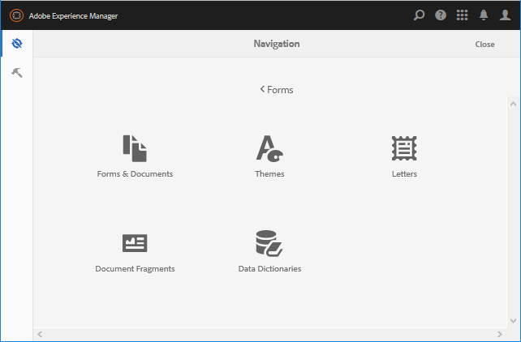
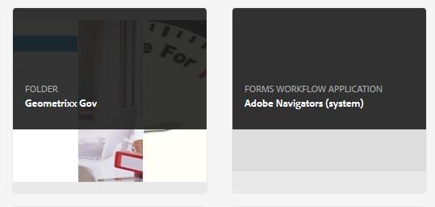

# Introduzione alla gestione dei moduli {#introduction-to-managing-forms}

AEM [!DNL Forms] fornisce un’interfaccia utente semplificata ma potente per creare e gestire moduli, documenti, temi, lettere, frammenti di documenti, dizionari dati e risorse correlate. Consente di gestire l&#39;intero ciclo di vita di moduli, documenti e risorse correlate, dal desktop di uno sviluppatore all&#39;offerta su un server portale per gli utenti finali. Può usare l’AEM [!DNL Forms] Interfaccia utente per:

* Accesso AEM [!DNL Forms] componenti
* Accesso AEM [!DNL Forms] Configurazioni

>[!NOTE]
>
>Per informazioni dettagliate su altri strumenti e opzioni dell’AEM, vedi [Authoring](/help/sites-authoring/author.md).

## Accedere ai componenti di AEM Forms {#access-aem-forms-components}

Oltre alle opzioni per la creazione di moduli, documenti e risorse correlate, l&#39;AEM fornisce opzioni per la creazione di siti, risorse, la gestione di un&#39;istanza dell&#39;AEM e altro ancora. Puoi fare clic su  Logo di Experience Manager per accedere a tutti gli strumenti disponibili. Oltre ai collegamenti alle console di altri componenti, contiene anche i collegamenti per l’AEM [!DNL Forms]. Passare all&#39;AEM [!DNL Forms], fai clic sul logo dell’Experience Manager  > navigazione  > **[!UICONTROL Forms]**. Vengono visualizzati i collegamenti delle seguenti console:

* Moduli e documenti
* Temi
* Lettere
* Frammenti del documento
* Dizionari dati

   

### Moduli e documenti  {#forms-documents}

In Forms &amp; Documents sono disponibili opzioni per la creazione di comunicazioni interattive, moduli adattivi, frammenti di moduli adattivi e set di moduli. Solo per AEM [!DNL Forms] in JEE, Forms &amp; Documents offre un’opzione per importare file dall’archiviazione locale e sincronizzare l’AEM [!DNL Forms] risorse con Workbench.

Il pulsante Crea è il punto iniziale del processo di creazione o caricamento dell’AEM [!DNL Forms] risorsa. Offre le opzioni per creare:

* **Comunicazione interattiva**: una comunicazione interattiva è una corrispondenza digitale, un’istruzione o un documento personalizzato, interattivo e compatibile con i dispositivi e basato su HTML. Le comunicazioni interattive sono per loro natura reattive e cambiano automaticamente layout e progettazione in base al dispositivo utente e alle impostazioni. Per informazioni dettagliate, consulta [Panoramica delle comunicazioni interattive](/help/forms/using/interactive-communications-overview.md)

* **Modulo adattivo:** Un modulo adattivo è un modulo coinvolgente e reattivo. Puoi creare un modulo adattivo per adattarlo dinamicamente agli input dell’utente aggiungendo o rimuovendo sezioni del modulo in base alla risposta dell’utente, al dispositivo o all’ambiente di lavoro. Il [Introduzione all’authoring di moduli adattivi](../../forms/using/introduction-forms-authoring.md) Questo articolo fornisce informazioni dettagliate sui moduli adattivi.

* **Frammento di modulo adattivo:** Anche se ogni modulo è progettato per uno scopo specifico, nella maggior parte dei moduli sono presenti alcuni segmenti comuni, ad esempio per fornire dati personali come nome e indirizzo, dettagli sulla famiglia, dettagli sul reddito e così via. Puoi creare una singola risorsa per tali sezioni. Questi segmenti riutilizzabili e autonomi sono denominati frammenti di modulo adattivi. Per informazioni dettagliate, consulta [frammenti di moduli adattivi](../../forms/using/adaptive-form-fragments.md) articolo.

* **Set di moduli:** Un set di moduli è un insieme di moduli HTML5 raggruppati e presentati come un unico set di moduli agli utenti finali. Quando gli utenti finali iniziano a compilare un set di moduli, i moduli vengono trasferiti facilmente da un modulo all’altro. Alla fine, un utente può inviare tutti i moduli come un’unica entità con un solo clic. Per informazioni dettagliate, consulta [Set di moduli in AEM Forms](../../forms/using/formset-in-aem-forms.md).

* **Cartella:** AEM [!DNL Forms] l’interfaccia utente utilizza le cartelle per disporre le risorse. Supporta due tipi di cartelle:

   * **Cartella generale:** Queste cartelle vengono utilizzate per le risorse create in AEM [!DNL Forms] dell&#39;utente. Queste cartelle non hanno una struttura di cartelle rigida. In queste cartelle è possibile rinominare, creare sottocartelle e archiviare moduli adattivi, comunicazioni interattive, frammenti di moduli adattivi, modelli di modulo (XDP), PDF forms, documenti e risorse correlate.
   * **Cartella Forms Workflow:** Le cartelle del flusso di lavoro di Forms vengono create quando i processi di Workbench (archivi di LiveCycle) vengono migrati e sincronizzati con l’AEM [!DNL Forms] dell&#39;utente. Non è consentito rinominare, creare una sottocartella, creare una comunicazione interattiva, un frammento di modulo adattivo o una comunicazione interattiva. Inoltre, non è consentito eliminare una cartella delle versioni o creare e caricare un modulo adattivo, un frammento di modulo adattivo o una comunicazione interattiva in parallelo alla cartella delle versioni.

   

   **R.** Cartella generale **B.** Cartella Forms Workflow

Il pannello Forms e documento fornisce inoltre le opzioni per:

* **Importa file dall&#39;archivio locale:** È possibile importare PDF forms e documenti, modelli di modulo (moduli XFA) e altre risorse (immagine e schema XML per XSD). Per istruzioni dettagliate, consulta [Importazione ed esportazione di risorse in AEM Forms](../../forms/using/import-export-forms-templates.md).
* **Sincronizza risorse AEM Forms con Workbench:** Puoi utilizzare l’opzione File da Workbench per sincronizzare le risorse tra l’interfaccia utente di AEM Forms e Workbench. In tal modo tutte le risorse saranno disponibili presso l&#39;AEM [!DNL Forms] l’interfaccia utente e la selezione delle risorse dell’archivio crx di Workbench.

### Temi  {#themes}

Un tema contiene dettagli sullo stile di componenti e pannelli. I temi hanno un&#39;identità indipendente. Quindi, puoi riutilizzare un tema su più moduli adattivi. È possibile specificare gli stili per un componente o modificare le proprietà CSS per vari componenti utilizzati nei moduli. Gli stili includono proprietà quali i colori di sfondo, i colori degli stati, la trasparenza e le dimensioni. È possibile salvare le personalizzazioni in un tema e trasferirle sui componenti del modulo come predefinito. Quando si aggiunge il tema al modulo, lo stile specificato viene applicato ai componenti corrispondenti del modulo. Con AEM 6.2 [!DNL Forms], è possibile creare temi e applicarli ai moduli.

Per informazioni sulla creazione e l&#39;utilizzo dei temi, vedere [Temi in AEM Forms](../../forms/using/themes.md).

### Lettere  {#letters}

Un AEM [!DNL Forms] letter è una corrispondenza sicura, personalizzata e interattiva. Può usare AEM [!DNL Forms] assemblare rapidamente in un processo semplificato le lettere (note anche come corrispondenze) di contenuti pre-approvati e personalizzati.

Per informazioni sulla creazione e l&#39;utilizzo delle lettere, vedere [Crea lettera](../../forms/using/create-letter.md).

### Frammenti del documento {#document-fragments}

I frammenti di documento sono parti o componenti riutilizzabili di una corrispondenza che consentono di comporre lettere. I frammenti di documento sono di tipo testo, elenco, condizione e layout. Per informazioni sulla creazione e l&#39;utilizzo di frammenti di documento, vedere [creazione di frammenti di documenti](/help/forms/using/document-fragments.md).

### Dizionari dati {#data-dictionaries}

In genere, gli utenti aziendali non devono conoscere le rappresentazioni di metadati come XSD (XML Schema) e le classi Java. Tuttavia, in genere richiedono l’accesso a tali strutture di dati e attributi per creare soluzioni. AEM [!DNL Forms] utilizza un dizionario dati che consente agli utenti aziendali di utilizzare informazioni provenienti da origini dati back-end senza conoscere dettagli tecnici sui modelli di dati sottostanti.

Per informazioni sulla creazione e l&#39;utilizzo dei dizionari dati, vedere creazione di [articolo del dizionario dati](../../forms/using/data-dictionary.md)

## Accesso all’AEM [!DNL Forms] Configurazioni {#accessing-aem-forms-configurations}

Il pannello strumenti dell’AEM contiene strumenti per vari componenti. Per accedere agli strumenti specifici di AEM Forms, fai clic sul logo dell’Experience Manager  > strumenti  > **[!UICONTROL Forms]**. Vengono visualizzati gli strumenti per eseguire le seguenti funzioni:

* **Configura cartella controllata:** Un amministratore può configurare una cartella di rete, nota come cartella controllata, in modo che, quando un utente inserisce un file (ad esempio un file PDF) nella cartella controllata, venga avviata un’operazione preconfigurata e il file venga manipolato. Per informazioni dettagliate, consulta [Creare e configurare una cartella controllata](/help/forms/using/creating-configure-watched-folder.md).
* **Configura servizio offline app Forms:** L&#39;AEM [!DNL Forms] il servizio app offline memorizza nella cache i percorsi o gli URL delle risorse utilizzate in un modulo. La memorizzazione nella cache di percorsi o URL delle risorse utilizzate in un modulo migliora le prestazioni lato server. Per configurare il componente offline lato server dell&#39;app AEM Forms, vedi [Utilizzo della modalità offline](/help/forms/using/work-offline-mode.md).

   

* **Configura PDF Generator:** Un amministratore può configurare l’AEM [!DNL Forms] PDF Generator, aggiungere account utente e importare o esportare la configurazione in PDF Generator.
* **Pubblica risorse di gestione della corrispondenza:** AEM [!DNL Forms] consente di pubblicare contemporaneamente tutte le lettere, i frammenti di documento e i dizionari di dati e le dipendenze correlate di un’istanza Autore. Le risorse pubblicate includono tutte le risorse di Gestione della corrispondenza e le relative dipendenze. Per informazioni dettagliate, consulta [Pubblicazione e annullamento della pubblicazione di moduli e documenti](../../forms/using/publishing-unpublishing-forms.md#publishallthecorrespondencemanagementassets).
* **Esporta risorse di gestione della corrispondenza:** Puoi scaricare tutte le risorse di Gestione della corrispondenza e le relative dipendenze come pacchetto da un AEM [!DNL Forms] dell&#39;istanza. Per i passaggi dettagliati, consulta [Importazione ed esportazione di risorse in AEM Forms](../../forms/using/import-export-forms-templates.md#importandexportassetsincorrespondencemanagement)

## Elementi comuni dell’interfaccia utente {#commonelements}

* **Barra a sinistra:** Puoi fare clic sull’icona della barra a sinistra  per rivelare le funzionalità della linea temporale e dei riferimenti dell’AEM [!DNL Forms].

   * **Timeline:** Puoi aggiungere e visualizzare commenti su una risorsa disponibile per la revisione nella timeline. Per istruzioni dettagliate, consulta [Creazione e gestione delle revisioni delle risorse nei moduli](../../forms/using/create-reviews-forms.md).
   * **Riferimenti:** Un AEM [!DNL Forms] risorsa può essere utilizzata in più AEM [!DNL Forms] risorse. Ad esempio, un frammento di documento può essere utilizzato in più lettere. I riferimenti sono un elenco di risorse (altre forme o risorse) in cui viene utilizzata la risorsa selezionata e anche l’elenco delle altre risorse utilizzate dalla risorsa selezionata.

* **Breadcrumb:** Un breadcrumb rappresenta il titolo della console o cartella corrente. Puoi fare clic sull’opzione Breadcrumb per spostarti tra i livelli di cartelle più elevati nella gerarchia.
* **Commutatore vista:** È possibile fare clic sull&#39;icona Visualizza commutatore  o  per passare rapidamente dalla vista a elenco a quella a schede. Per ulteriori informazioni sui componenti comuni dell’interfaccia utente, consulta [Authoring](/help/sites-authoring/author.md).
* **Cerca:** Opzione di ricerca  consente di trovare e passare rapidamente ai contenuti e agli strumenti necessari. Digita il nome del contenuto o della funzionalità e seleziona tra i suggerimenti; ad esempio, digita &quot;Documenti&quot; per trovare e passare rapidamente a **[!UICONTROL Forms e documenti]** o la console Frammenti di documento. Per ulteriori informazioni sulla ricerca, vedere AEM 6.2 [ricerca](/help/sites-authoring/search.md) articolo

* **Barra delle azioni**: quando selezioni una risorsa, la barra delle azioni viene visualizzata sopra l’elenco delle risorse. Contiene tutti gli strumenti di gestione per la risorsa selezionata. Passa il puntatore del mouse su un&#39;icona dello strumento per visualizzarne la descrizione della funzionalità

>[!NOTE]
>
>Quando un utente esegue una ricerca in una console di Forms &amp; Documents, la barra contiene solo **Filtri e opzioni**. Per eseguire ricerche avanzate, puoi utilizzare Filtri e opzioni.

* **Barra delle azioni**: quando selezioni una risorsa, la barra delle azioni viene visualizzata sopra l’elenco delle risorse. Contiene tutti gli strumenti di gestione per la risorsa selezionata. Passa il puntatore del mouse su un&#39;icona dello strumento per visualizzarne la descrizione della funzionalità

   

   Barra delle azioni per un modulo adattivo
