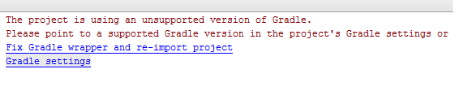

# Risolvere i problemi relativi all’app AEM Forms {#troubleshoot-aem-forms-app}

Questo articolo descrive i messaggi di errore che potrebbero essere visualizzati durante la creazione dell&#39;app AEM Forms e i passaggi per risolverli.

Le sezioni di questo articolo includono:

* [Perdita di allegati per gli utenti di iOS](/help/forms/using/issues-aem-forms-app.md#attachment-loss-for-ios-users)
* [Le bozze dei moduli di HTML5 inviate dagli utenti dell’area di lavoro non sono visibili sul portale](/help/forms/using/issues-aem-forms-app.md#html-form-drafts-submitted-by-workspace-users-are-not-visible-on-the-portal)
* [Impossibile caricare i moduli di HTML5 (non memorizzati nella cache) nell’app AEM Forms](/help/forms/using/issues-aem-forms-app.md#html-forms-not-cached-fail-to-load-in-aem-forms-app)
* [AEM Forms non sincronizzato su Windows](/help/forms/using/issues-aem-forms-app.md#aem-forms-do-not-sync-on-windows)
* [Versione non supportata di Gradle](/help/forms/using/issues-aem-forms-app.md#unsupported-version-of-gradle)
* [Problemi di compatibilità dei plug-in Gradle e Gradle per Gradle](/help/forms/using/issues-aem-forms-app.md#gradle-and-android-gradle-plug-in-compatibility-issues)

## Perdita di allegati per gli utenti di iOS {#attachment-loss-for-ios-users}

L’app AEM Forms per iOS configurata per la sincronizzazione con AEM Forms su OSGi supporta solo allegati a livello di campo. Tutti gli allegati devono avere nomi univoci. Se più allegati hanno lo stesso nome, viene conservato un solo allegato e tutti gli altri con lo stesso nome vengono persi. Esegui i seguenti passaggi per evitare che gli utenti su dispositivi iOS subiscano una perdita di dati:

1. Sul server connesso, passa a **Adobe Experience Manager > Strumenti > Operazioni > Console web**.
1. Trova e fai clic su **[!UICONTROL Configurazione del canale web per moduli adattivi e comunicazioni interattive]**.
1. In [!UICONTROL Configurazione del canale web per moduli adattivi e comunicazioni interattive] finestra di dialogo, attiva **Rendi univoci i nomi dei file**.

   Se **Rendi univoci i nomi dei file** se questa impostazione è disabilitata, gli utenti potrebbero perdere dati se tentano di inviare moduli adattivi con più allegati.

1. Fai clic su **Salva**.

## Le bozze dei moduli di HTML5 inviate dagli utenti dell’area di lavoro non sono visibili sul portale {#html-form-drafts-submitted-by-workspace-users-are-not-visible-on-the-portal}

Per i moduli HTML5 abilitati nell’app AEM Forms con **Salva come bozza** Profilo di rendering di HTML, le bozze salvate non sono visibili agli utenti dell’area di lavoro. Per visualizzare le bozze salvate dei moduli HTML5 inviati dagli utenti di workspace sul portale, eseguire le operazioni seguenti:

1. Apri CRXDE e accedi con le credenziali di amministratore.

   URL: `https://<server>:<port>/lc/crx/de/index.jsp`

1. Nel percorso principale del CRXDE, nell&#39;elenco Controllo accessi sotto Controllo accessi, fare clic su **+**.
1. In **Aggiungi nuova voce** fare clic sul pulsante di ricerca del gruppo nel campo Principale.
1. Nel campo Nome della finestra di dialogo Seleziona entità digitare `PERM_WORKSPACE_USER` e fai clic su **Ricerca**.
1. Seleziona `PERM_WORKSPACE_USER` nella finestra di dialogo Seleziona principale e fai clic su **OK**.
1. Nella finestra di dialogo Aggiungi nuova voce, `PERM_WORKSPACE_USER` gruppo selezionato nel campo Principale.

   Abilita `jcr:read` privilegi per il gruppo di utenti.

1. Fai clic su **OK**.

## Impossibile caricare i moduli di HTML5 (non memorizzati nella cache) nell’app AEM Forms {#html-forms-not-cached-fail-to-load-in-aem-forms-app}

Quando l’app AEM Forms è connessa a una versione precedente del server AEM Forms, i moduli non memorizzati nella cache di HTML5 non vengono caricati nell’app AEM Forms.

Esegui i seguenti passaggi per risolvere il problema:

1. Nell’istanza di authoring, passa a **Adobe Experience Manager > Strumenti > Configura servizio offline app Workspace > Configura ora**.
1. In **Servizio offline app Workspace** pagina, fai clic su **Cache delle risorse manuali**.

   URL: https://&lt;server>:&lt;port>/libs/fd/workspace-offline/content/config.html

1. In **Cache delle risorse manuali** fai clic sulla scheda **+** per aggiungere un percorso CRX.
1. In **Aggiungi una nuova risorsa** campo, tipo: /etc.clientlibs/fd/xfaforms/I18N/en_US.js e fai clic su **Aggiungi**.
1. Fai clic su **Salva**.

## AEM Forms non sincronizzato su Windows {#aem-forms-do-not-sync-on-windows}

Nell’app AEM Forms su Windows, un modulo non viene sincronizzato con il server connesso se il percorso del modulo o di una delle relative risorse contiene più o meno 256 caratteri.

Modificare il percorso del modulo e le relative risorse per ridurre il numero di caratteri a meno di 256 caratteri.

## Versione non supportata di Gradle {#unsupported-version-of-gradle}

**Messaggio di errore:** Il progetto utilizza una versione non supportata di Gradle.

Il messaggio di errore viene visualizzato quando si crea l&#39;app AEM Forms in Android Studio. Il problema si verifica a causa di una versione non supportata di Gradle supportata sul sistema.

**Risoluzione:** Fai clic su **Fissare il wrapper Gradle e reimportare il progetto** per risolvere il problema.

## Problemi di compatibilità dei plug-in Gradle e Gradle per Gradle {#gradle-and-android-gradle-plug-in-compatibility-issues}

**Messaggio di errore:** Le versioni del plug-in Gradle Android e Gradle non sono compatibili.

Il messaggio di errore viene visualizzato quando si seleziona **Creare APK** dall&#39;opzione **Crea** nell&#39;interfaccia utente di Android Studio.

**Risoluzione:** Apri **Script Gradle** > **gradle-wrapper.properties** e modifica il **distributionUrl** proprietà.

Ad esempio, la console Android Studio consiglia di scaricare la versione Gradle a 3.5. Modificare la versione in **distributionUrl** di **gradle-wrapper.properties** file.

Seleziona **Crea** > **Creare APK** di nuovo per risolvere l&#39;errore e generare il file .apk.

