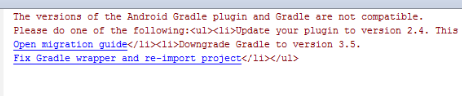

# Risolvere i problemi relativi all’app AEM Forms {#troubleshoot-aem-forms-app}

Questo articolo descrive i messaggi di errore che potrebbero essere visualizzati durante la creazione dell’app AEM Forms e i passaggi per risolverli.

Le sezioni in questo articolo includono:

* [Perdita di allegati per utenti iOS](/help/forms/using/issues-aem-forms-app.md#attachment-loss-for-ios-users)
* [Le bozze dei moduli di HTML5 inviate dagli utenti dell’area di lavoro non sono visibili nel portale](/help/forms/using/issues-aem-forms-app.md#html-form-drafts-submitted-by-workspace-users-are-not-visible-on-the-portal)
* [Impossibile caricare i moduli HTML5 (non memorizzati in cache) nell’app AEM Forms](/help/forms/using/issues-aem-forms-app.md#html-forms-not-cached-fail-to-load-in-aem-forms-app)
* [AEM Forms do not sync on Windows (Non sincronizzare su Windows)](/help/forms/using/issues-aem-forms-app.md#aem-forms-do-not-sync-on-windows)
* [Versione di Gradle non supportata](/help/forms/using/issues-aem-forms-app.md#unsupported-version-of-gradle)
* [Problemi di compatibilità del plug-in Gradle e Android](/help/forms/using/issues-aem-forms-app.md#gradle-and-android-gradle-plug-in-compatibility-issues)

## Perdita di allegati per utenti iOS {#attachment-loss-for-ios-users}

L’app AEM Forms per iOS configurata per la sincronizzazione con AEM Forms su OSGi supporta solo allegati a livello di campo. Tutti gli allegati devono avere nomi univoci. Se più allegati hanno lo stesso nome, viene conservato un solo allegato e tutti gli altri con lo stesso nome vengono persi. Per evitare che gli utenti dei dispositivi iOS subiscano una perdita di dati, effettua le seguenti operazioni:

1. Nel server connesso passare a **Adobe Experience Manager > Strumenti > Operazioni > Console web**.
1. Trova e fai clic su **[!UICONTROL Configurazione di un modulo adattivo e di un canale web di comunicazione interattiva]**.
1. In [!UICONTROL Configurazione di un modulo adattivo e di un canale web di comunicazione interattiva] finestra di dialogo, abilita **Imposta nomi file univoci**.

   Se **Imposta nomi file univoci** se l’impostazione è disabilitata, si verifica una perdita di dati se si tenta di inviare moduli adattivi con più allegati.

1. Fai clic su **Salva**.

## Le bozze dei moduli di HTML5 inviate dagli utenti dell’area di lavoro non sono visibili nel portale {#html-form-drafts-submitted-by-workspace-users-are-not-visible-on-the-portal}

Per i moduli HTML5 abilitati nell’app AEM Forms con **Salva come bozza** Profilo rendering HTML, le bozze salvate non sono visibili agli utenti dell’area di lavoro. Per visualizzare le bozze salvate dei moduli HTML5 inviati dagli utenti del workspace sul portale, effettuare le seguenti operazioni:

1. Apri CRXDE e accedi con le credenziali di amministratore.

   URL: `https://<server>:<port>/lc/crx/de/index.jsp`

1. Nel percorso principale di CRXDE, nell&#39;elenco di controllo di accesso in Controllo di accesso, fare clic su **+**.
1. In **Aggiungi nuova voce** fare clic sul pulsante di ricerca del gruppo nel campo Principal.
1. Nel campo Nome della finestra di dialogo Seleziona entità digitare `PERM_WORKSPACE_USER` e fai clic su **Ricerca**.
1. Seleziona `PERM_WORKSPACE_USER` nella finestra di dialogo Seleziona entità e fare clic su **OK**.
1. Nella finestra di dialogo Aggiungi nuova voce: `PERM_WORKSPACE_USER` gruppo selezionato nel campo Principal.

   Abilita `jcr:read` privilegi per il gruppo di utenti.

1. Fai clic su **OK**.

## Impossibile caricare i moduli HTML5 (non memorizzati in cache) nell’app AEM Forms {#html-forms-not-cached-fail-to-load-in-aem-forms-app}

Quando l’app AEM Forms è connessa a una versione precedente del server AEM Forms, i moduli HTML5 non memorizzati nella cache non vengono caricati nell’app AEM Forms.

Per risolvere il problema, effettua le seguenti operazioni:

1. Nell’istanza di authoring, passa a **Adobe Experience Manager > Strumenti > Configura servizio offline app Workspace > Configura ora**.
1. In entrata **Servizio offline app Workspace** pagina, fai clic su **Cache risorse manuale**.

   URL: https://&lt;server>:&lt;port>/libs/fd/workspace-offline/content/config.html

1. In **Cache risorse manuale** , fare clic sulla scheda **+** per aggiungere un percorso CRX.
1. In **Aggiungi una nuova risorsa** , digitare: /etc.clientlibs/fd/xfaforms/I18N/en_US.js e fare clic su **Aggiungi**.
1. Fai clic su **Salva**.

## AEM Forms do not sync on Windows (Non sincronizzare su Windows) {#aem-forms-do-not-sync-on-windows}

Nell’app AEM Forms su Windows, un modulo non viene sincronizzato con il server connesso se il percorso del modulo o una delle relative risorse contiene più di 256 caratteri o meno.

Modifica il percorso del modulo e delle relative risorse in modo da ridurre il numero di caratteri a meno di 256 caratteri.

## Versione di Gradle non supportata {#unsupported-version-of-gradle}

**Messaggio di errore:** Il progetto utilizza una versione non supportata di Gradle.

Il messaggio di errore viene visualizzato quando crei l’app AEM Forms in Android Studio. Il problema si verifica a causa di una versione non supportata di Gradle nel sistema.

**Risoluzione:** Clic **Correggi wrapper Gradle e reimporta il progetto** per risolvere il problema.

## Problemi di compatibilità del plug-in Gradle e Android {#gradle-and-android-gradle-plug-in-compatibility-issues}

**Messaggio di errore:** Le versioni del plug-in Android Gradle e Gradle non sono compatibili.

Il messaggio di errore viene visualizzato quando si seleziona **Genera APK** opzione dalla **Genera** nell&#39;interfaccia utente di Android Studio.

**Risoluzione:** Apri **Script Gradle** > **gradle-wrapper.properties** e modificare il **distributionUrl** proprietà.

Ad esempio, la console Android Studio consiglia di scaricare la versione Gradle a 3.5. Modificare la versione in **distributionUrl** di **gradle-wrapper.properties** file.

Seleziona **Genera** > **Genera APK** per risolvere l&#39;errore e generare il file apk.

