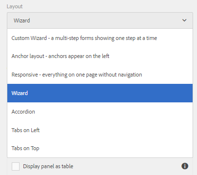
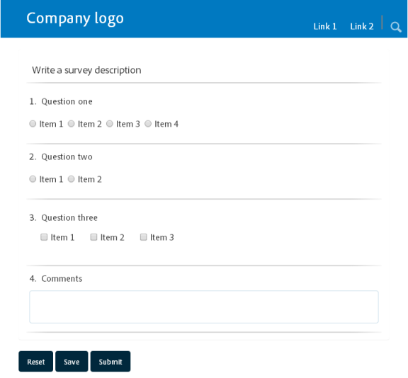
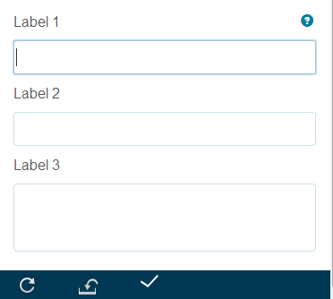

# Funzionalità di layout dei moduli adattivi{#layout-capabilities-of-adaptive-forms}

<span class="preview"> Adobe consiglia di utilizzare l&#39;acquisizione dati moderna ed estensibile [Componenti core](https://experienceleague.adobe.com/docs/experience-manager-core-components/using/adaptive-forms/introduction.html?lang=it) per [la creazione di un nuovo Forms adattivo](/help/forms/using/create-an-adaptive-form-core-components.md) o [l&#39;aggiunta di Forms adattivo alle pagine AEM Sites](/help/forms/using/create-or-add-an-adaptive-form-to-aem-sites-page.md). Questi componenti rappresentano un progresso significativo nella creazione di Forms adattivi, garantendo esperienze utente straordinarie. Questo articolo descrive un approccio precedente all’authoring di Forms adattivi utilizzando i componenti di base. </span>

| Versione | Collegamento articolo |
| -------- | ---------------------------- |
| AEM as a Cloud Service | [Fai clic qui](https://experienceleague.adobe.com/docs/experience-manager-cloud-service/content/forms/adaptive-forms-authoring/authoring-adaptive-forms-foundation-components/configure-layout-of-an-adaptive-form/layout-capabilities-adaptive-forms.html) |
| AEM 6.5 | Questo articolo |


Adobe Experience Manager (AEM) consente di creare moduli adattivi facili da usare che offrono esperienze dinamiche agli utenti finali. Il layout del modulo controlla il modo in cui gli elementi o i componenti vengono visualizzati in un modulo adattivo.

## Conoscenze preliminari {#prerequisite-knowledge}

Prima di scoprire le diverse funzionalità di layout dei moduli adattivi, leggi i seguenti articoli per ulteriori informazioni sui moduli adattivi.

[Introduzione ad AEM Forms](../../forms/using/introduction-aem-forms.md)

[Introduzione all’authoring dei moduli](../../forms/using/introduction-forms-authoring.md)

## Tipi di layout {#types-of-layouts}

Un modulo adattivo offre i seguenti tipi di layout:

**Layout pannello** Controlla la modalità di visualizzazione degli elementi o dei componenti di un pannello in un dispositivo.

**Layout dispositivo mobile** Controlla la navigazione di un modulo su un dispositivo mobile. Se la larghezza del dispositivo è di 768 pixel o più, il layout viene considerato un layout mobile e ottimizzato per un dispositivo mobile.

**Layout barra degli strumenti** Controlla la posizione dei pulsanti di azione nella barra degli strumenti della barra degli strumenti o del pannello in un modulo.

Tutti questi layout di pannello sono definiti nella posizione seguente:

`/libs/fd/af/layouts`.

>[!NOTE]
>
>Per modificare il layout di un modulo adattivo, utilizza la Modalità di authoring in AEM.


## Layout pannello {#panel-layout}

Un autore di moduli può associare un layout a ciascun pannello di un modulo adattivo, incluso il pannello principale.

I layout del pannello sono disponibili nel percorso `/libs/fd/af/layouts/panel`.



Elenco dei layout dei pannelli nei moduli adattivi

### Reattivo - tutto su una pagina senza navigazione {#responsive-everything-on-one-page-without-navigation-br}

Utilizza questo layout di pannello per creare un layout reattivo che si adatta alle dimensioni dello schermo del dispositivo senza alcuna necessità di navigazione specializzata.

Utilizzando questo layout, puoi inserire più componenti del **[!UICONTROL modulo adattivo per pannelli]** uno dopo l&#39;altro all&#39;interno del pannello.



Un modulo che utilizza il layout dinamico come visualizzato su un piccolo schermo


Un modulo che utilizza il layout dinamico come visualizzato su un grande schermo

### Procedura guidata: un modulo con più passaggi che mostra un passaggio alla volta {#wizard-a-multi-step-form-showing-one-step-at-a-time}

Utilizza questo layout di pannello per fornire una navigazione guidata all’interno di un modulo. Utilizzare ad esempio questo layout per acquisire informazioni obbligatorie in un modulo guidando gli utenti passo dopo passo.

Utilizza il componente `Panel adaptive form` per fornire una navigazione dettagliata all&#39;interno di un pannello. Quando utilizzi questo layout, un utente passa al passaggio successivo solo dopo aver completato il passaggio corrente

```javascript
window.guideBridge.validate([], this.panel.navigationContext.currentItem.somExpression)
```


Espressione di completamento passaggio nel layout della procedura guidata per un modulo con più passaggi


Maschera che utilizza la procedura guidata

### Layout per il pannello a soffietto {#layout-for-accordion-design}

Utilizzando questo layout, è possibile inserire il componente `Panel adaptive form` in un pannello con navigazione in stile Pannello a soffietto. Utilizzando questo layout, puoi anche creare pannelli ripetibili. I pannelli ripetibili consentono di aggiungere o rimuovere in modo dinamico i pannelli in base alle esigenze. Puoi definire il numero minimo e massimo di ripetizioni di un pannello. Inoltre, il titolo del pannello può essere determinato dinamicamente, in base alle informazioni fornite negli elementi del pannello.

L’espressione di riepilogo può essere utilizzata per mostrare i valori forniti dall’utente finale nel titolo del pannello ridotto a icona.


Pannelli ripetibili creati con il layout Pannello a soffietto

### Layout a schede: le schede vengono visualizzate a sinistra {#tabbed-layout-tabs-appear-on-the-left}

Utilizzando questo layout, è possibile inserire il componente `Panel adaptive form` in un pannello con navigazione tramite schede. Le schede vengono posizionate a sinistra del contenuto del pannello.


Schede visualizzate a sinistra di un pannello

### Layout a schede: le schede vengono visualizzate nella parte superiore {#tabbed-layout-tabs-appear-on-the-top}

Utilizzando questo layout, è possibile inserire il componente `Panel adaptive form` in un pannello con navigazione tramite schede. Le schede vengono posizionate sopra il contenuto del pannello.


Schede visualizzate nella parte superiore di un pannello

## Layout dispositivi mobili {#mobile-layouts}

I layout mobili consentono una navigazione semplice sui dispositivi mobili con schermi relativamente più piccoli. I layout mobili utilizzano gli stili a schede o della procedura guidata per la navigazione dei moduli. L’applicazione di un layout mobile fornisce un unico layout per l’intero modulo.

Questo layout controlla la navigazione tramite una barra di navigazione e un menu di navigazione. La barra di navigazione mostra l&#39;icona **&lt;** e **>** per indicare **i passaggi di navigazione successivi** e **precedenti** nel modulo.

I layout mobili sono disponibili nel percorso `/libs/fd/af/layouts/mobile/`. Per impostazione predefinita, i seguenti layout per dispositivi mobili sono disponibili nei moduli adattivi.


Elenco dei layout mobili nei moduli adattivi

Quando si utilizza un layout mobile, per accedere a vari pannelli del modulo tocca l’icona .

### Layout con titoli dei pannelli nell’intestazione del modulo {#layout-with-panel-titles-in-the-form-header}

Questo layout, come suggerisce il nome, mostra i titoli dei pannelli insieme al menu di navigazione e alla barra di navigazione. Questo layout fornisce anche le icone Successivo e Precedente per la navigazione.


Layout mobili con titoli dei pannelli nelle intestazioni dei moduli

### Layout senza titoli dei pannelli nell’intestazione del modulo {#layout-without-panel-titles-in-the-form-header}

Come suggerisce il nome, questo layout mostra solo il menu di navigazione e la barra di navigazione senza i titoli dei pannelli. Questo layout fornisce anche le icone Successivo e Precedente per la navigazione.


Layout mobili senza titoli dei pannelli nelle intestazioni dei moduli

## Layout della barra degli strumenti {#toolbar-layouts}

Un layout a barre degli strumenti controlla il posizionamento e la visualizzazione di eventuali pulsanti di azione aggiunti ai moduli adattivi. Il layout può essere aggiunto a livello di modulo o di pannello.


Elenco dei layout delle barre degli strumenti nei moduli adattivi

I layout della barra degli strumenti sono disponibili nel percorso `/libs/fd/af/layouts/toolbar`. per impostazione predefinita, i moduli adattivi forniscono i seguenti layout di barra degli strumenti.

### Layout predefinito per la barra degli strumenti {#default-layout-for-toolbar}

Questo layout viene selezionato come layout predefinito quando aggiungi pulsanti di azione in un modulo adattivo. Selezionando questo layout viene visualizzato lo stesso layout sia per i dispositivi desktop che per quelli mobili.

Inoltre, è possibile aggiungere più barre degli strumenti contenenti pulsanti di azione configurati con questo layout. Un pulsante di azione è associato a un controllo modulo. È possibile configurare le barre degli strumenti in modo che siano prima o dopo un pannello.


Visualizzazione predefinita per la barra degli strumenti

### Layout fisso mobile per barra degli strumenti {#mobile-fixed-layout-for-toolbar}

Selezionare questo layout per fornire layout alternativi per desktop e dispositivi mobili.

Per il layout del desktop, è possibile aggiungere pulsanti di azione utilizzando alcune etichette specifiche. Con questo layout è possibile configurare una sola barra degli strumenti. Se con questo layout sono configurate più barre degli strumenti, esiste una sovrapposizione per i dispositivi mobili e una sola barra degli strumenti è visibile. È possibile ad esempio disporre di una barra degli strumenti nella parte inferiore o superiore del modulo oppure, dopo o prima dei pannelli del modulo.

Per il layout mobile, puoi aggiungere pulsanti di azione utilizzando le icone.



Layout fisso mobile per barra degli strumenti
