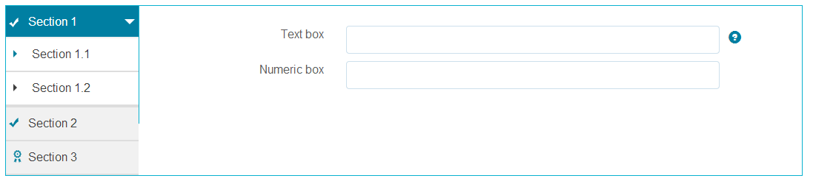

# Funzionalità di layout dei moduli adattivi{#layout-capabilities-of-adaptive-forms}

Adobe Experience Manager (AEM) consente di creare moduli adattivi di facile utilizzo che offrono esperienze dinamiche agli utenti finali. Il layout del modulo controlla la modalità di visualizzazione degli elementi o dei componenti in un modulo adattivo.

## Conoscenze preliminari {#prerequisite-knowledge}

Prima di apprendere le diverse funzionalità di layout dei moduli adattivi, leggi i seguenti articoli per ulteriori informazioni sui moduli adattivi.

[Introduzione ad AEM Forms](../../forms/using/introduction-aem-forms.md)

[Introduzione all’authoring dei moduli](../../forms/using/introduction-forms-authoring.md)

## Tipi di layout {#types-of-layouts}

Un modulo adattivo fornisce i seguenti tipi di layout:

**Layout** del pannelloControlla il modo in cui gli elementi o i componenti all’interno di un pannello vengono visualizzati su un dispositivo.

**Layout** mobileControlla la navigazione di un modulo su un dispositivo mobile. Se la larghezza del dispositivo è di 768 pixel o più, il layout viene considerato un layout mobile e ottimizzato per un dispositivo mobile.

**Layout barra degli strumentiConsente di controllare la posizione dei pulsanti Azione nella barra degli strumenti o nella barra degli strumenti del pannello all’interno di un modulo.** 

Tutti i layout di questi pannelli sono definiti nella posizione seguente:

`/libs/fd/af/layouts`.

>[!NOTE]
>
>Per modificare il layout di un modulo adattivo, utilizzare la modalità Creazione in AEM.


## Layout pannello {#panel-layout}

Un autore di moduli può associare un layout a ciascun pannello di un modulo adattivo, incluso il pannello principale.

I layout del pannello sono disponibili nella posizione `/libs/fd/af/layouts/panel` .


Elenco dei layout dei pannelli nei moduli adattivi

### Reattivo : tutto su una pagina senza navigazione {#responsive-everything-on-one-page-without-navigation-br}

Utilizza questo layout del pannello per creare un layout reattivo che si adatta alle dimensioni dello schermo del dispositivo senza necessità di una navigazione specializzata.

Utilizzando questo layout, è possibile inserire più componenti **[!UICONTROL Modulo adattivo per pannello]** uno dopo l’altro all’interno del pannello.


Un modulo con layout reattivo come visualizzato su un piccolo schermo


Un modulo con layout reattivo come visualizzato su uno schermo di grandi dimensioni

### Procedura guidata : un modulo a più passaggi che mostra un passaggio alla volta {#wizard-a-multi-step-form-showing-one-step-at-a-time}

Utilizzare questo layout del pannello per fornire la navigazione guidata all’interno di un modulo. Ad esempio, utilizzare questo layout quando si desidera acquisire informazioni obbligatorie in un modulo mentre gli utenti sono guidati passo dopo passo.

Utilizza il componente `Panel adaptive form` per fornire una navigazione dettagliata all’interno di un pannello. Quando si utilizza questo layout, un utente passa al passaggio successivo solo al completamento del passaggio corrente

```javascript
window.guideBridge.validate([], this.panel.navigationContext.currentItem.somExpression)
```


Espressione di completamento del passaggio nel layout della procedura guidata per un modulo a più passaggi


Modulo tramite procedura guidata

### Layout per progettazione a soffietto {#layout-for-accordion-design}

Utilizzando questo layout, è possibile posizionare il componente `Panel adaptive form` in un pannello con navigazione in stile pannello a soffietto. Utilizzando questo layout è possibile creare anche pannelli ripetibili. I pannelli ripetibili consentono di aggiungere o rimuovere dinamicamente i pannelli in base alle esigenze. Puoi definire il numero minimo e il numero massimo di ripetizioni di un pannello. Inoltre, il titolo del pannello può essere determinato dinamicamente, in base alle informazioni fornite negli elementi del pannello.

L’espressione Summary può essere utilizzata per mostrare i valori forniti dall’utente finale nel titolo del pannello minimizzato.


Pannelli ripetibili creati con layout a soffietto

### Layout a schede: le schede vengono visualizzate a sinistra {#tabbed-layout-tabs-appear-on-the-left}

Utilizzando questo layout, puoi posizionare il componente `Panel adaptive form` in un pannello con navigazione a schede. Le schede vengono posizionate a sinistra del contenuto del pannello.



Schede visualizzate a sinistra di un pannello

### Layout a schede: le schede vengono visualizzate nella parte superiore {#tabbed-layout-tabs-appear-on-the-top}

Utilizzando questo layout, puoi posizionare il componente `Panel adaptive form` in un pannello con navigazione a schede. Le schede vengono posizionate sopra il contenuto del pannello.


Schede visualizzate nella parte superiore di un pannello

## Layout dei dispositivi mobili {#mobile-layouts}

I layout per dispositivi mobili consentono una navigazione agevole sui dispositivi mobili con schermi relativamente più piccoli. I layout per dispositivi mobili utilizzano stili a schede o a procedura guidata per la navigazione nei moduli. L’applicazione di un layout mobile fornisce un singolo layout per l’intero modulo.

Questo layout controlla la navigazione tramite una barra di navigazione e un menu di navigazione. La barra di navigazione mostra l’icona **&lt;** e **** per indicare i passaggi di navigazione **successivo** e **precedenti** nel modulo.

I layout mobili sono disponibili nella posizione `/libs/fd/af/layouts/mobile/` . Per impostazione predefinita, nei moduli adattivi sono disponibili i seguenti layout per dispositivi mobili.


Elenco dei layout mobili nei moduli adattivi

Quando si utilizza un layout mobile, per accedere ai vari pannelli dei moduli è disponibile il menu dei moduli, toccando l’icona  .

### Layout con titoli dei pannelli nell’intestazione del modulo {#layout-with-panel-titles-in-the-form-header}

Questo layout, come suggerisce il nome, mostra i titoli dei pannelli insieme al menu di navigazione e alla barra di navigazione. Questo layout include anche le icone Successivo e Precedente per la navigazione.


Layout dei dispositivi mobili con titoli dei pannelli nelle intestazioni dei moduli

### Layout senza titoli del pannello nell’intestazione del modulo {#layout-without-panel-titles-in-the-form-header}

Questo layout, come suggerisce il nome, mostra solo il menu di navigazione e la barra di navigazione senza titoli del pannello. Questo layout include anche le icone Successivo e Precedente per la navigazione.


Layout dei dispositivi mobili senza titoli dei pannelli nelle intestazioni dei moduli

## Layout della barra degli strumenti {#toolbar-layouts}

Il layout della barra degli strumenti consente di posizionare e visualizzare i pulsanti di azione aggiunti ai moduli adattivi. Il layout può essere aggiunto a livello di modulo o di pannello.


Elenco dei layout della barra degli strumenti nei moduli adattivi

I layout della barra degli strumenti sono disponibili nella posizione `/libs/fd/af/layouts/toolbar` . per impostazione predefinita, i moduli adattivi forniscono i seguenti layout della barra degli strumenti.

### Layout predefinito per la barra degli strumenti {#default-layout-for-toolbar}

Questo layout viene selezionato come layout predefinito quando si aggiungono pulsanti di azione in un modulo adattivo. Selezionando questo layout viene visualizzato lo stesso layout sia per i dispositivi desktop che per quelli mobili.

Inoltre, è possibile aggiungere più barre degli strumenti contenenti pulsanti di azione configurati con questo layout. Un pulsante di azione è associato a un controllo modulo. È possibile configurare le barre degli strumenti prima o dopo un pannello.


Vista predefinita per barra degli strumenti

### Layout fisso mobile per la barra degli strumenti {#mobile-fixed-layout-for-toolbar}

Selezionare questo layout per fornire layout alternativi per desktop e dispositivi mobili.

Per il layout desktop, è possibile aggiungere pulsanti Azione utilizzando alcune etichette specifiche. Con questo layout è possibile configurare una sola barra degli strumenti. Se con questo layout sono configurate più di una barra degli strumenti, esiste una sovrapposizione per i dispositivi mobili e è visibile una sola barra degli strumenti. Ad esempio, è possibile disporre di una barra degli strumenti nella parte inferiore o superiore del modulo oppure, dopo o prima dei pannelli nel modulo.

Per il layout mobile, è possibile aggiungere pulsanti di azione utilizzando delle icone.


Layout fisso mobile per barra degli strumenti

