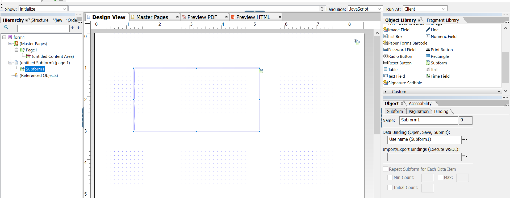

# Progettazione layout{#layout-design}

I modelli di modulo XFA o XDP sono i modelli per:

* [Lettere](/help/forms/using/create-letter.md)
* [Stampa canale](/help/forms/using/web-channel-print-channel.md#printchannel) di [Comunicazioni interattive](/help/forms/using/interactive-communications-overview.md)

* Frammenti di layout

Un XDP è progettato in Adobe Forms Designer. Questo articolo fornisce dettagli su come progettare XDP per creare corrispondenze efficaci/comunicazioni interattive, ad esempio dove utilizzare i campi modulo o le aree di destinazione e quando utilizzare i frammenti di layout.

## Creazione di un layout per le lettere o per il canale di stampa delle comunicazioni interattive {#creating-a-layout-for-letters-or-for-interactive-communications-print-channel}

Un layout definisce il layout grafico di un canale lettera/stampa di una comunicazione interattiva. Il layout può contenere campi modulo tipici come &quot;Indirizzo&quot; e &quot;Numero di riferimento&quot;. Contiene anche sottomaschere vuote che denotano le aree di destinazione. Creare il layout nella finestra di progettazione dei moduli e, al termine, lo specialista dell&#39;applicazione lo carica sul server AEM. Da qui, puoi selezionare il layout durante la creazione di un modello di corrispondenza o di un canale di stampa di una comunicazione interattiva.

Segui questi passaggi per creare layout per lettere/canale di stampa di comunicazioni interattive:

1. Analizzare il layout e determinare il contenuto da ripetere su tutte le pagine; in genere l&#39;intestazione e il piè di pagina rientrano in questa categoria. Questo contenuto viene inserito nelle pagine master del layout. Il contenuto rimanente passa alle pagine del corpo del layout. In una copertina, il logo e l’indirizzo dell’azienda possono essere aggiunti all’intestazione e al piè di pagina della pagina mastro. Ad esempio, Notifica di annullamento utilizza lo stesso layout.
1. Durante la progettazione delle pagine del corpo, suddivide il contenuto della pagina in sezioni. Ogni sezione è progettata come sottomodulo incorporato nel layout stesso o come layout di frammento. Se la sezione contiene una tabella, modellate la sezione come frammento di layout.
1. Un layout può essere progettato come segue:

   1. Creare ogni sezione come sottomaschera separata contenente tutti gli elementi della sezione.
   1. Rende ogni sottomaschera di sezione figlio della stessa sottomaschera padre. Il layout della sottomaschera padre è impostato su Flusso per consentire lo spostamento delle sezioni al di sotto se sono presenti dati di grandi dimensioni uniti nelle sezioni precedenti.
   1. La sezione Residenza principale può essere riutilizzata anche in altri layout. Crealo come layout di frammento.
   1. Sezione Ulteriori dettagli di interesse contiene solo due elementi posizionati uno sotto l&#39;altro, può contenere dati di grandi dimensioni ed è progettato come flusso.
   1. Altre sezioni contengono elementi in posizioni specifiche, in modo che vengano progettate come layout posizionato.
   1. Suddividere una sezione in sottomaschere se la sezione contiene elementi in posizioni specifiche e se questi elementi contengono grandi quantità di dati. Quindi disponi le sottomaschere per ottenere il comportamento desiderato.
   1. Per la sezione Residenza principale, aggiungi un’area di destinazione segnaposto. Questo segnaposto è associato al frammento Residenza principale al momento della progettazione della lettera/comunicazione interattiva.
   1. Carica il layout (e l’eventuale frammento che lo utilizza) nel server AEM Forms.

### Utilizzare un sottomodulo in un modello XDP {#usesubformxdp}

Dopo aver analizzato il layout necessario per la creazione della comunicazione interattiva, è possibile creare sottomoduli nel modello XDP utilizzando Forms Designer. I componenti del sottomodulo vuoti utilizzati nel modello XDP determinano la visualizzazione delle aree di destinazione nel canale Stampa della comunicazione interattiva.

>[!NOTE]
>
>Aggiungi contenuto al canale di stampa della comunicazione interattiva invece di aggiungere contenuto al componente del sottomodulo nel modello XDP. Aggiungere contenuto alle aree di destinazione nel canale di stampa tramite [frammenti di documenti, grafici, immagini](create-interactive-communication.md#step2)e frammenti di layout.

Per utilizzare un sottomodulo in un modello XDP, effettua le seguenti operazioni:

1. Apri Forms Designer, seleziona **File** > **Nuovo** > **Utilizza un modulo vuoto**, tocca **Successivo**, quindi tocca **Fine** per aprire il modulo per la creazione di modelli.

   Assicurati che **Libreria di oggetti** e **Oggetto** sono selezionate dall&#39;opzione **Finestra** menu.

1. Trascina la selezione **Sottomodulo** componente da **Libreria di oggetti** al modulo.

   

1. Selezionare la sottomaschera per visualizzare le opzioni della sottomaschera in **Oggetto** nel riquadro di destra.
1. Seleziona la **Sottomodulo** e seleziona **Flussi** dal **Contenuto** elenco a discesa. Trascinare il punto finale sinistro della sottomaschera per regolarne la lunghezza.

   

1. In **Binding** scheda:

   1. Specificare un nome per la sottomaschera nel **Nome** campo.
   1. Seleziona **Nessuna associazione dati** dal **Associazione dati** elenco a discesa.

1. Analogamente, selezionare la sottomaschera principale dal riquadro di sinistra.

   

1. Seleziona la **Sottomodulo** e seleziona **Flussi** dal **Contenuto** elenco a discesa. In **Associazioni** scheda:

   1. Specificare un nome per la sottomaschera nel **Nome** campo.
   1. Seleziona **Nessuna associazione dati** dal **Associazione dati** elenco a discesa.

   Ripeti i passaggi da 2 a 5 per aggiungere altri sottomoduli al modello XDP. Aggiungi [testo, frammenti di documenti, immagini e grafici](create-interactive-communication.md#step2) solo nelle aree di destinazione durante la creazione della comunicazione interattiva.

1. Seleziona **File** > **Salva con nome** per salvare il file nel file system locale:

   1. Passa alla posizione in cui salvare il file e specifica un nome per il modello XDP.
   1. Seleziona **.xdp** dal **Salva come tipo** elenco a discesa.

   1. Tocca **Salva**.

### Utilizzare il componente Campo immagine in un modello XDP {#use-image-field-component-in-an-xdp-template}

Utilizza il componente Campo immagine o Sottomodulo nel modello XDP e aggiungi un’immagine durante la creazione della comunicazione interattiva.

>[!NOTE]
>
>Aggiungi l’immagine al canale di stampa della comunicazione interattiva invece di aggiungere l’immagine al componente Campo immagine o Sottomodulo nel modello XDP. Per ulteriori informazioni, consulta [Aggiunta di contenuto alla comunicazione interattiva](../../forms/using/create-interactive-communication.md#step2).

Per utilizzare il componente Campo immagine in un modello XDP, effettua le seguenti operazioni:

1. Trascina la selezione **Campo immagine** componente da **Libreria di oggetti** al modulo.
1. Selezionare la sottomaschera per visualizzare le opzioni della sottomaschera in **Oggetto** nel riquadro di destra.
1. In **Binding** scheda:

   1. Specifica un nome per il campo immagine nel **Nome** campo.
   1. Seleziona **Nessuna associazione dati** dal **Associazione dati** elenco a discesa.

### Crea modello XDP per frammenti di layout {#xdplayoutfragments}

Utilizzare il componente Tabella in Forms Designer per creare frammenti di layout e quindi utilizzarli per creare tabelle durante la creazione del canale Stampa della comunicazione interattiva. L’utilizzo di frammenti di layout per creare tabelle assicura che il contenuto della tabella mantenga la struttura quando il canale web viene generato automaticamente utilizzando il canale di stampa.

>[!NOTE]
>
>Immettere il testo nelle celle della tabella oppure [creare un&#39;associazione con gli oggetti modello dati modulo](create-interactive-communication.md#step2) solo durante la creazione della comunicazione interattiva.

Per utilizzare il componente Table nel modello XDP, eseguire la procedura seguente utilizzando Forms Designer:

1. Trascina la selezione **Tabella** componente da **Libreria di oggetti** al modulo.
1. In **Inserisci tabella** finestra di dialogo:

   1. Specifica il numero di righe e colonne per la tabella.
   1. Seleziona la **Includi riga intestazione nella tabella** per includere una riga per l&#39;intestazione della tabella.
   1. Tocca **OK**.

1. Tocca **+** nel riquadro sinistro accanto al nome della tabella fare clic con il pulsante destro del mouse sui nomi di cella inclusi nell&#39;intestazione e in altre righe e selezionare **Rinomina oggetto** per rinominare le celle della tabella.
1. Fare clic sui campi di testo dell&#39;intestazione della tabella nel **Visualizzazione Progettazione** e rinominale.
1. Trascina la selezione **Campo di testo** componente da **Libreria di oggetti** in ogni cella della tabella **Visualizzazione Progettazione**. Esegui questo passaggio per poter associare le celle di una tabella agli oggetti modello dati del modulo durante la creazione della comunicazione interattiva.

   

1. Seleziona il nome della riga dal riquadro a sinistra e fai clic su **Oggetto** > **Binding** > **Ripeti riga per ogni elemento dati**. Eseguire questo passaggio per assicurarsi che, se viene creata un&#39;associazione tra le celle di questa riga con oggetti modello dati modulo di tipo raccolta, la riga tabella venga ripetuta automaticamente per ogni elemento dati disponibile nel database.

   Immettere il testo nelle celle della tabella oppure [creare un&#39;associazione con gli oggetti modello dati modulo](create-interactive-communication.md#step2) solo durante la creazione della comunicazione interattiva.

1. Seleziona **File** > **Salva con nome** per salvare il file nel file system locale:

   1. Passa alla posizione in cui salvare il file e specifica il nome per il modello XDP.
   1. Seleziona **.xdp** dal **Salva come tipo** elenco a discesa.

   1. Tocca **Salva**.

### Carica modello XDP sul server AEM Forms {#uploadxdptemplate}

Dopo aver creato un modello XDP utilizzando Forms Designer, è necessario caricarlo sul server AEM Forms in modo che sia disponibile per l’uso durante la creazione della comunicazione interattiva.

1. Seleziona **Forms** > **Forms e documenti**.
1. Tocca **Crea** > **Caricamento file**.
1. Passa alla posizione del modello XDP nel file system locale e tocca **Apri** per importare il modello XDP nel server AEM Forms.

## Utilizzo dello schema {#using-schema}

È possibile utilizzare uno schema in un layout o in un frammento di layout, ma non è necessario. Se utilizzi uno schema, assicurati di quanto segue:

1. Il layout e tutti i layout di frammento utilizzati in una lettera/comunicazione interattiva utilizzano lo stesso schema della lettera/comunicazione interattiva.
1. Tutti i campi che devono essere compilati con i dati sono associati allo schema.

## Creazione di campi correlati {#creating-relatable-fields}

Per impostazione predefinita, tutti i campi sono considerati relativi a varie altre origini dati. Se il layout contiene campi non correlati a un&#39;origine dati, denominare il campo con un suffisso &quot;_int&quot; (interno), ad esempio pageCount_int.

Un campo pertinente deve:

* essere un XFA &lt;field> o &lt;exclgroup>
* hanno un riferimento di binding XFA
* se si tratta di un &lt;exclgroup>, deve avere almeno un campo pulsante di scelta figlio; in caso contrario, non è possibile determinarne il tipo di valore

Un campo pertinente deve:

* avere un nome

Un campo pertinente non deve:

* Includi un suffisso &quot;_int&quot; nel nome
* hanno binding impostato come &quot;none&quot;
* essere figlio di un &lt;exclgroup> elemento

Se un campo correlabile soddisfa i criteri descritti in precedenza, può trovarsi in qualsiasi posizione e a qualsiasi profondità di nidificazione nel layout. È possibile utilizzare campi correlati all’interno di pagine master.

I campi sono più flessibili nella configurazione del layout rispetto alle sottomaschere dell’area di destinazione, ma sono legati a un singolo tipo di valore. È possibile ingrandire un campo o impostarlo su una larghezza e un&#39;altezza fisse e così via. Il risultato del modulo o della regola risolto viene inviato nel campo.

## Decidere quando utilizzare sottomaschere e campi di testo {#deciding-when-to-use-subforms-and-text-nbsp-fields}

Utilizzare una sottomaschera se si desidera acquisire più contenuti di modulo in un layout a flusso verticale dall&#39;alto verso il basso (più paragrafi o immagini). Il layout deve gestire il fatto che la sottomaschera cresce in altezza per adattarsi al contenuto. Se non si è certi che la lunghezza del contenuto associato alla sottomaschera o alla destinazione non superi mai lo spazio riservato alla sottomaschera nel layout, creare la sottomaschera come elemento secondario all&#39;interno di un contenitore di sottomaschere con flusso. Questo processo garantisce che gli oggetti layout al di sotto della sottomaschera scorrano verso il basso man mano che la sottomaschera cresce.

Utilizzare un campo se si desidera acquisire dati modulo o dati elemento dizionario dati nello schema del layout (perché i campi sono associati ai dati) o per visualizzare il contenuto modulo in una pagina master. Tenere presente che il contenuto di una pagina master non può scorrere con il contenuto della pagina del corpo, pertanto è necessario assicurarsi che il campo immagine venga utilizzato come logo dell&#39;intestazione. Questa tabella fornisce ulteriori criteri per decidere quando utilizzare una sottomaschera o un campo in un layout.

<table>
 <tbody>
  <tr>
   <td>
<strong>Utilizza un sottomodulo quando</strong>
 </td>
   <td>
<strong>Utilizza un campo di testo quando</strong>
 </td>
  </tr>
  <tr>
   <td>
Contiene una combinazione di elementi, ad esempio Cognome e Nome
 </td>
   <td>
Contiene un singolo elemento, ad esempio un numero di criterio.
 </td>
  </tr>
  <tr>
   <td>
Include più paragrafi
 </td>
   <td>
Il testo è racchiuso e giustificato
 </td>
  </tr>
  <tr>
   <td>
I gruppi di dati ripetuti, facoltativi e condizionali sono associati a sottomaschere per ridurre il rischio di errori di progettazione che potrebbero verificarsi se gli script vengono utilizzati per ottenere gli stessi risultati
 </td>
   <td>
Elementi quali il logo e l’indirizzo dell’organizzazione vengono visualizzati su tutte le pagine di una lettera o di una comunicazione interattiva. In questo caso, creare campi modulo per tali elementi e inserirli nella pagina master. Se si imposta l'associazione dei campi su "Nessuna associazione dati", i campi non disponibili verranno visualizzati come campi correlati nell'Editor comunicazioni lettera/interattive. Se si desidera correlare un tipo di contenuto a questi campi, è necessario che siano associati.
 
Se l'indirizzo della società contiene più righe di dati, utilizzare il campo di testo con l'opzione "Consenti più righe" per rappresentare l'indirizzo nel layout.
 
Se il tipo di dati di un campo di testo è impostato su testo normale, viene utilizzata la versione in testo normale dell’output del modulo anziché la versione in testo RTF (tutta la formattazione viene scartata). Per mantenere la formattazione, impostare il tipo di dati del campo di testo su RTF.
 </td>
  </tr>
  <tr>
   <td>
Il testo scorre
 </td>
   <td>
I campi di testo e i campi immagine vengono utilizzati nelle pagine master. Le pagine master non possono utilizzare le sottomaschere come aree di destinazione.
 </td>
  </tr>
  <tr>
   <td>
Gli oggetti sono raggruppati e organizzati senza associare il sottomodulo a un elemento dati
 </td>
   <td>
 
 </td>
  </tr>
  <tr>
   <td>
Nella sottomaschera è presente un campo di testo. La sottomaschera può crescere e non sovrascrivere altri oggetti al di sotto di essa sul layout.
 </td>
   <td>
Devi avere un facile accesso ai suoi dati nel processo di post.
 </td>
  </tr>
 </tbody>
</table>

## Impostazione di elementi ripetitivi {#setting-up-repetitive-elements}

Quando elementi quali il logo e l&#39;indirizzo dell&#39;organizzazione vengono visualizzati in tutte le pagine di una lettera o di una comunicazione interattiva, creare campi modulo per tali elementi e inserirli nella pagina master. Utilizzare l&#39;associazione Nome (Nome campo) per questi campi.

## Specifica il formato di rendering del server {#specify-the-server-nbsp-render-format}

Utilizza il formato di rendering del server del layout in Dynamic XML Form; in caso contrario, eventuali lettere o comunicazioni interattive basate su questo layout non potranno essere riprodotte correttamente. Per impostazione predefinita, il formato di rendering del server in Forms Designer è impostato su Modulo XML dinamico. Per assicurarsi di utilizzare il formato corretto:

* In Designer, fai clic su **File** > **Proprietà modulo** > **Valori predefiniti** e assicurarsi che l&#39;impostazione Rendering/Formato PDF sia impostata su Modulo XML dinamico.
