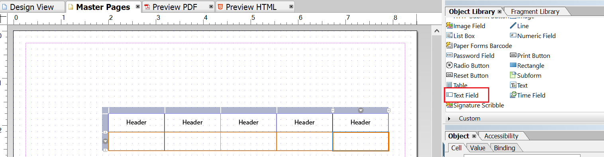

# Progettazione layout{#layout-design}

I modelli di modulo XFA o XDP sono i modelli per:

* [Lettere](/help/forms/using/create-letter.md)
* [Canale](/help/forms/using/web-channel-print-channel.md#printchannel) di stampa delle comunicazioni [interattive](/help/forms/using/interactive-communications-overview.md)

* Frammenti di layout

Un XDP è progettato in Forms Designer  Adobe. Questo articolo fornisce dettagli su come progettare i file XDP per la creazione di corrispondenze/comunicazioni interattive efficaci, ad esempio dove utilizzare i campi del modulo o le aree di destinazione e quando utilizzare i frammenti di layout.

## Creazione di un layout per le lettere o per il canale di stampa delle comunicazioni interattive {#creating-a-layout-for-letters-or-for-interactive-communications-print-channel}

Un layout definisce il layout grafico di un canale lettera/stampa di una comunicazione interattiva. Il layout può contenere campi modulo tipici come &quot;Indirizzo&quot; e &quot;Numero di riferimento&quot;. Contiene inoltre sottomoduli vuoti che indicano le aree di destinazione. Creare il layout nella finestra di progettazione del modulo e, al termine, caricarlo AEM server mediante Application Specialist. Da qui potete selezionare il layout quando create un modello di corrispondenza o un canale di stampa di una comunicazione interattiva.

Per creare layout per lettere/canale di stampa delle comunicazioni interattive, effettuate le seguenti operazioni:

1. Analizzare il layout e determinare il contenuto da ripetere su tutte le pagine; in genere l&#39;intestazione e il piè di pagina rientrano in questa categoria. Questo contenuto viene inserito nelle pagine master del layout. Il contenuto rimanente va alle pagine corpo del layout. In una giacca dei criteri, il logo e l&#39;indirizzo della società possono essere aggiunti all&#39;intestazione e al piè di pagina della pagina master. Ad esempio, Avviso di annullamento utilizza lo stesso layout.
1. Durante la progettazione delle pagine corpo, suddividere il contenuto della pagina in sezioni. Ogni sezione è progettata come un sottomodulo incorporato nel layout stesso o come layout di frammento. Se la sezione contiene una tabella, modellare la sezione come un frammento di layout.
1. Un layout può essere progettato come segue:

   1. Creare ciascuna sezione come sottomodulo separato contenente tutti gli elementi della sezione.
   1. Rendere ogni sottomodulo di sezione secondario dello stesso sottomodulo principale. Il layout del sottomodulo principale è impostato in modo da consentire lo spostamento verso il basso delle sezioni nel caso in cui dati di grandi dimensioni vengano uniti nelle sezioni precedenti.
   1. La residenza principale sezione può essere riutilizzata anche in altri layout. Crea come layout di frammento.
   1. Sezione I dettagli di interesse aggiuntivi contengono solo due elementi posizionati uno sotto l&#39;altro, possono contenere dati di grandi dimensioni ed è progettato come flusso.
   1. Altre sezioni contengono elementi in posizioni specifiche, in modo che siano progettati come layout posizionato.
   1. Suddividere una sezione in sottomoduli se la sezione contiene elementi in posizioni specifiche e questi elementi contengono grandi quantità di dati. Disporre quindi i sottomoduli per ottenere il comportamento desiderato.
   1. Per la sezione Residenza principale, aggiungere un&#39;area di destinazione segnaposto. Questo segnaposto è associato al frammento Residenza principale al momento della progettazione Lettera/Comunicazione interattiva.
   1. Caricate il layout (e l&#39;eventuale frammento che utilizza il layout) nel server AEM Forms .

### Utilizzare un sottomodulo in un modello XDP {#usesubformxdp}

Dopo aver analizzato il layout richiesto per creare la comunicazione interattiva, è possibile creare sottomoduli nel modello XDP utilizzando Forms Designer. I componenti sottomodulo vuoti utilizzati nel modello XDP consentono di visualizzare le aree di destinazione nel canale Stampa della comunicazione interattiva.

>[!NOTE]
>
>Aggiungere contenuto al canale Stampa della comunicazione interattiva anziché aggiungere contenuto al componente sottomodulo nel modello XDP. Aggiungere contenuti alle aree di destinazione del canale Stampa utilizzando frammenti di [documento, grafici, immagini](create-interactive-communication.md#step2)e frammenti di layout.

Effettuare le seguenti operazioni per utilizzare il sottomodulo in un modello XDP:

1. Aprire Forms Designer, selezionare **File** > **Nuovo** > **Usa un modulo** vuoto, toccare **Avanti**, quindi **Fine** per aprire il modulo per la creazione del modello.

   Assicurarsi che le opzioni Libreria **** oggetto e **Oggetto** siano selezionate dal menu **Finestra** .

1. Trascinare il componente **Sottomodulo** dalla Libreria **** oggetto al modulo.

   

1. Selezionare il sottomodulo per visualizzare le opzioni del sottomodulo nella finestra **Oggetto** , nel riquadro a destra.
1. Selezionare la scheda **Sottomodulo** e selezionare **Flusso** dall&#39;elenco a discesa **Contenuto** . Trascinare l&#39;endpoint sinistro del sottomodulo per regolare la lunghezza.

   

1. Nella scheda **Binding** :

   1. Specificare un nome per il sottomodulo nel campo **Nome** .
   1. Selezionare **Nessun binding** dati dall&#39;elenco a discesa Binding **** dati.

1. Analogamente, selezionare il sottomodulo principale dal riquadro a sinistra.

   

1. Selezionare la scheda **Sottomodulo** e selezionare **Flusso** dall&#39;elenco a discesa **Contenuto** . Nella scheda **Binding** :

   1. Specificare un nome per il sottomodulo nel campo **Nome** .
   1. Selezionare **Nessun binding** dati dall&#39;elenco a discesa Binding **** dati.

   Ripetere i passaggi da 2 a 5 per aggiungere altri sottomoduli al modello XDP. Aggiungere [testo, frammenti di documento, immagini e grafici](create-interactive-communication.md#step2) alle aree di destinazione solo durante la creazione della comunicazione interattiva.

1. Selezionare **File** > **Salva con nome** per salvare il file nel file system locale:

   1. Andate alla posizione in cui salvare il file e specificate un nome per il modello XDP.
   1. Selezionate **.xdp** dall&#39;elenco a discesa **Salva come** .

   1. Toccate **Salva**.

### Utilizzare il componente Campo immagine in un modello XDP {#use-image-field-component-in-an-xdp-template}

Utilizzare il componente Campo immagine o Sottomodulo nel modello XDP e aggiungere un’immagine durante la creazione della comunicazione interattiva.

>[!NOTE]
>
>Aggiungere un’immagine al canale di stampa della comunicazione interattiva invece di aggiungere un’immagine al componente Campo immagine o Sottomodulo nel modello XDP. Per ulteriori informazioni, consultate [Aggiunta di contenuti alla comunicazione](../../forms/using/create-interactive-communication.md#step2)interattiva.

Per usare il componente Campo immagine in un modello XDP, effettuate le seguenti operazioni:

1. Trascinare il componente Campo **** immagine dalla Libreria **** oggetto al modulo.
1. Selezionare il sottomodulo per visualizzare le opzioni del sottomodulo nella finestra **Oggetto** , nel riquadro a destra.
1. Nella scheda **Binding** :

   1. Specificate un nome per il campo immagine nel campo **Nome** .
   1. Selezionare **Nessun binding** dati dall&#39;elenco a discesa Binding **** dati.

### Creare un modello XDP per i frammenti di layout {#xdplayoutfragments}

Utilizzare il componente Tabella di Forms Designer per creare frammenti di layout, quindi utilizzarli per creare tabelle durante la creazione del canale di stampa della comunicazione interattiva. L&#39;utilizzo di frammenti di layout per creare tabelle garantisce che il contenuto della tabella mantenga la struttura quando il canale Web viene generato automaticamente utilizzando il canale di stampa.

>[!NOTE]
>
>Immettere il testo nelle celle della tabella o [creare il binding con gli oggetti](create-interactive-communication.md#step2) del modello dati del modulo solo durante la creazione della comunicazione interattiva.

Per utilizzare il componente Tabella nel modello XDP utilizzando Forms Designer, procedere come segue:

1. Trascinare il componente **Tabella** dalla Libreria **** oggetto al modulo.
1. Nella finestra di dialogo **Inserisci tabella** :

   1. Specificare il numero di righe e colonne della tabella.
   1. Selezionare la casella di controllo **Includi riga intestazione nella tabella** per includere una riga per l&#39;intestazione della tabella.
   1. Toccate **OK**.

1. Toccare **+** nel riquadro a sinistra accanto al nome della tabella, fare clic con il pulsante destro del mouse sui nomi delle celle inclusi nell&#39;intestazione e nelle altre righe, quindi selezionare **Rinomina oggetto** per rinominare le celle della tabella.
1. Fare clic sui campi di testo dell&#39;intestazione della tabella nella vista **** Struttura e rinominarli.
1. Trascinare il componente Campo **di** testo dalla Libreria **** oggetto a ciascuna cella della tabella nella vista **** Struttura. Eseguire questo passaggio per eseguire il binding delle celle della tabella con gli oggetti del modello dati del modulo durante la creazione della comunicazione interattiva.

   

1. Selezionare il nome della riga nel riquadro a sinistra, quindi selezionare **Oggetto** > **Binding** > **Ripeti riga per ogni elemento** dati. Eseguire questo passaggio per garantire che, se viene creato un binding tra le celle della tabella di questa riga e gli oggetti modello dati del modulo di tipo raccolta, la riga della tabella venga ripetuta automaticamente per ogni elemento dati disponibile nel database.

   Immettere il testo nelle celle della tabella o [creare il binding con gli oggetti](create-interactive-communication.md#step2) del modello dati del modulo solo durante la creazione della comunicazione interattiva.

1. Selezionare **File** > **Salva con nome** per salvare il file nel file system locale:

   1. Andate alla posizione in cui salvare il file e specificate il nome per il modello XDP.
   1. Selezionate **.xdp** dall&#39;elenco a discesa **Salva come** .

   1. Toccate **Salva**.

### Caricare il modello XDP sul server AEM Forms  {#uploadxdptemplate}

Dopo aver creato un modello XDP utilizzando Forms Designer, è necessario caricarlo  server AEM Forms in modo che sia disponibile per l&#39;uso durante la creazione della comunicazione interattiva.

1. Selezionate **Forms** > **Forms e documenti**.
1. Toccate **Crea** > Caricamento **** file.
1. Andate alla posizione del modello XDP nel file system locale e toccate **Apri** per importare il modello XDP nel server AEM Forms .

## Uso dello schema {#using-schema}

È possibile utilizzare uno schema in un layout o in un frammento di layout, ma non è obbligatorio. Se utilizzate uno schema, accertatevi di quanto segue:

1. Il layout e tutti i layout di frammento utilizzati in una lettera/comunicazione interattiva utilizzano lo stesso schema utilizzato per la comunicazione lettera/interattiva.
1. Tutti i campi necessari per essere compilati con i dati sono associati allo schema.

## Creazione di campi correlati {#creating-relatable-fields}

Per impostazione predefinita, tutti i campi sono considerati correlati a varie altre origini dati. Se il layout contiene campi che non possono essere correlati a un&#39;origine dati, assegnare al campo un nome con suffisso &quot;_int&quot; (interno); ad esempio, pageCount_int.

Un campo relativo deve:

* essere un XFA &lt;field> o &lt;exclGroup>
* avere un riferimento di binding XFA
* se è un &lt;exclGroup>, deve avere almeno un campo pulsante di scelta figlio; in caso contrario, il relativo tipo di valore non può essere determinato

Un campo relativo deve:

* avere un nome

Un campo relativo non può:

* Includere un suffisso &quot;_int&quot; nel nome
* con binding impostato su &quot;none&quot;
* essere figlio di un elemento &lt;exclGroup>

Fintanto che un campo relativo soddisfa i criteri descritti in precedenza, può trovarsi in qualsiasi posizione e a qualsiasi profondità di nidificazione nel layout. È possibile utilizzare campi correlati all&#39;interno delle pagine master.

I campi sono più flessibili nella configurazione del layout rispetto ai sottomoduli dell&#39;area di destinazione; tuttavia sono legati a un singolo tipo di valore. È possibile impostare un campo di grandi dimensioni o su una larghezza, un&#39;altezza e così via. Il risultato risolto del modulo o della regola viene inserito nel campo.

## Definizione di quando utilizzare sottomoduli e campi di testo {#deciding-when-to-use-subforms-and-text-nbsp-fields}

Utilizzare un sottomodulo se si desidera acquisire più contenuto del modulo in un layout verticale con scorrimento dall&#39;alto verso il basso (più paragrafi o immagini). Il layout deve gestire l&#39;aumento dell&#39;altezza del sottomodulo per adattarlo al contenuto. Se non si può essere certi che la lunghezza del contenuto associato al sottomodulo o alla destinazione non superi mai lo spazio riservato al sottomodulo nel layout, creare il sottomodulo come elemento secondario all&#39;interno di un contenitore di sottomoduli scorrevole. Questo processo assicura che gli oggetti layout sotto il sottomodulo scorrano verso il basso man mano che il sottomodulo cresce.

Utilizzare un campo se si desidera acquisire i dati del modulo o dei dati del dizionario dati nello schema del layout (in quanto i campi sono associati ai dati) o per visualizzare il contenuto del modulo in una pagina master. Tenere presente che il contenuto di una pagina master non può fluire con il contenuto della pagina corpo, pertanto è necessario assicurarsi che il campo immagine sia utilizzato come logo intestazione. Questa tabella fornisce ulteriori criteri per decidere quando utilizzare un sottomodulo o un campo in un layout.

<table>
 <tbody>
  <tr>
   <td>
<strong>Utilizzare un sottomodulo quando</strong>
 </td>
   <td>
<strong>Utilizzare un campo di testo quando</strong>
 </td>
  </tr>
  <tr>
   <td>
Contiene una combinazione di elementi, ad esempio Cognome e Nome
 </td>
   <td>
Contiene un singolo elemento, ad esempio un numero di criterio.
 </td>
  </tr>
  <tr>
   <td>
Include più paragrafi
 </td>
   <td>
Il testo è racchiuso e giustificato
 </td>
  </tr>
  <tr>
   <td>
I gruppi di dati ripetuti, facoltativi e condizionali sono associati a sottomoduli, per ridurre il rischio di errori di progettazione che potrebbero verificarsi se gli script vengono utilizzati per ottenere gli stessi risultati
 </td>
   <td>
Elementi quali il logo e l'indirizzo dell'azienda vengono visualizzati su tutte le pagine di una lettera o comunicazione interattiva. In questo caso, creare campi modulo per tali elementi e inserirli nella pagina master. Se si imposta il binding dei campi su "Nessun binding dei dati", i campi no vengono visualizzati come campi correlati nell'Editor di comunicazione interattiva/Lettera. Se si desidera mettere in relazione un certo tipo di contenuto con questi campi, è necessario che questi dispongano di binding.
 
Se l'indirizzo della società contiene più righe di dati, utilizzare il campo di testo con l'opzione "Consenti righe multiple" per rappresentare l'indirizzo nel layout.
 
Se il tipo di dati di un campo di testo è impostato su testo normale, viene utilizzata la versione in testo normale dell'output del modulo invece della versione in formato RTF (tutta la formattazione viene scartata). Per mantenere la formattazione, impostare il tipo di dati del campo di testo su RTF.
 </td>
  </tr>
  <tr>
   <td>
Il testo è scorrevole
 </td>
   <td>
I campi di testo e i campi immagine vengono utilizzati nelle pagine master. Le pagine master non possono utilizzare i sottomoduli come aree di destinazione.
 </td>
  </tr>
  <tr>
   <td>
Gli oggetti sono raggruppati e organizzati senza eseguire il binding del sottomodulo con un elemento dati
 </td>
   <td>
 
 </td>
  </tr>
  <tr>
   <td>
All'interno del sottomodulo è presente un campo di testo. Il sottomodulo può espandersi e non sovrascrivere gli altri oggetti sottostanti sul layout.
 </td>
   <td>
È necessario un facile accesso ai relativi dati nel processo di pubblicazione.
 </td>
  </tr>
 </tbody>
</table>

## Impostazione di elementi ripetitivi {#setting-up-repetitive-elements}

Quando elementi come il logo e l&#39;indirizzo dell&#39;organizzazione vengono visualizzati su tutte le pagine di una lettera o comunicazione interattiva, create campi modulo per tali elementi e inseriteli nella pagina master. Utilizzare il binding Nome (Nome campo) per questi campi.

## Specificare il formato di rendering del server {#specify-the-server-nbsp-render-format}

Utilizzare il formato di rendering del server del layout su Modulo XML dinamico; in caso contrario, il rendering di lettere/comunicazioni interattive basate su questo layout non può essere eseguito correttamente. Per impostazione predefinita, il formato di rendering del server in Forms Designer è impostato su Modulo XML dinamico. Per verificare di utilizzare il formato corretto:

* In Designer, fare clic su **File** > Proprietà **** modulo > **Valori predefiniti**, quindi assicurarsi che l&#39;impostazione Rendering/Formato PDF sia impostata su Modulo XML dinamico.

