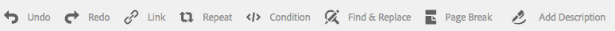
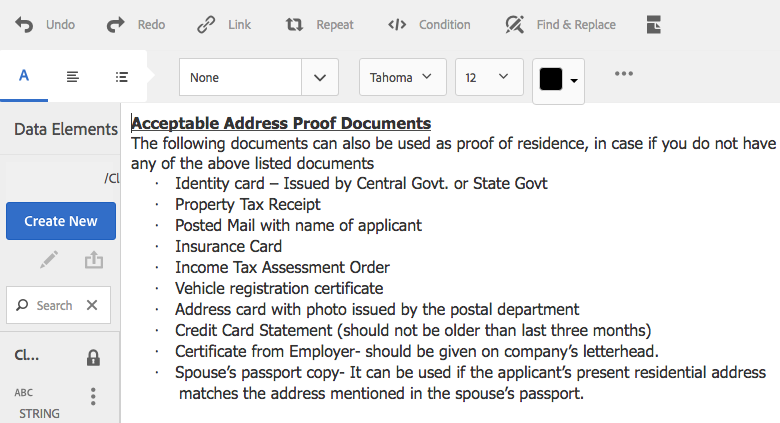
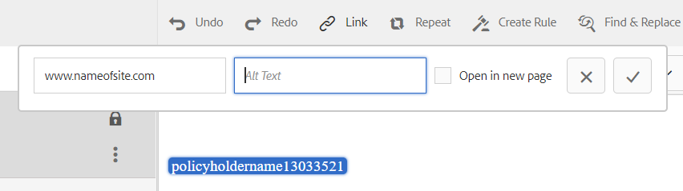
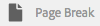

# Frammenti del documento{#document-fragments}

## Frammenti del documento {#document-fragments-1}

I frammenti di documento sono parti/componenti riutilizzabili di una corrispondenza che consente di comporre lettere/corrispondenza. I frammenti di documento sono di tipo:

* **Testo**: Una risorsa di testo è una parte di contenuto costituita da uno o più paragrafi di testo. Un paragrafo può essere statico o dinamico.
* **Elenco**: Elenco è un gruppo di frammenti di documento, inclusi testo, elenchi, condizioni e immagini. L’ordine degli elementi dell’elenco può essere fisso o modificabile. Durante la creazione di una lettera, è possibile utilizzare alcuni o tutti gli elementi dell’elenco per replicare un pattern di elementi riutilizzabili.
* **Condizione**: Le condizioni ti consentono di definire quale contenuto viene incluso al momento della creazione della corrispondenza, in base ai dati forniti. La condizione è descritta in termini di variabili di controllo. Una variabile di controllo può essere un elemento del dizionario dati o un segnaposto.
* **Frammento** di layout: Un frammento di layout è un layout utilizzabile all’interno di una o più lettere. Un frammento di layout viene utilizzato per creare pattern ripetibili, in particolare tabelle dinamiche. Il layout può contenere campi modulo tipici, ad esempio &quot;Indirizzo&quot; e &quot;Numero di riferimento&quot;. Contiene inoltre sottomoduli vuoti che indicano le aree di destinazione. I layout (XDP) vengono creati in Designer e quindi caricati in AEM Forms.

## Testo {#text}

Una risorsa di testo è una parte di contenuto costituita da uno o più paragrafi di testo. Un paragrafo può essere statico o dinamico. Un paragrafo dinamico contiene riferimenti agli elementi dati i cui valori vengono forniti in fase di esecuzione. Ad esempio, il nome del cliente in una formula introduttiva potrebbe essere un elemento dati dinamico, con il relativo valore reso disponibile in fase di esecuzione. Modificando questi valori, è possibile utilizzare lo stesso modello di lettera per generare lettere per clienti diversi.

La soluzione per la gestione della corrispondenza supporta due tipi di elementi di dati dinamici (dati variabili):

* **Elementi** del dizionario dati: Questi elementi sono associati al dizionario dati e ottengono i loro valori dall’origine dati fornita. Una variabile del dizionario dati può essere protetta o non protetta. Durante la creazione della corrispondenza, l’utente può modificare il valore predefinito delle variabili dei dizionari di dati non protette, ma non può modificare quelle protette.
* **Segnaposto**: Si tratta di variabili che non sono associate a un’origine dati back-end. Richiedono all’utente di compilare un valore durante la creazione della corrispondenza. Per impostazione predefinita, i segnaposto non sono protetti.

>[!NOTE]
>
>I modelli di gestione della corrispondenza non ti forzano a creare nomi univoci durante la creazione di segnaposto. Se si creano due segnaposto con lo stesso nome, ad esempio un testo e una condizione, e li si utilizzano entrambi in un modello di lettera, i valori dell&#39;ultimo segnaposto inserito vengono utilizzati per entrambi i segnaposto. Se due segnaposto hanno lo stesso nome, i loro tipi vengono confrontati. Se i tipi sono diversi, il loro tipo diventa Stringa. All’interno di un modulo, tuttavia, non è possibile creare più segnaposto con lo stesso nome.

### Crea testo {#create-text}

1. Selezionare **Forms** > **Frammenti documento**.
1. Tocca **Crea** > **Testo** Oppure seleziona una risorsa di testo e tocca **Modifica**.
1. Specifica le seguenti informazioni per il testo:

   * **Titolo: (Facoltativo)** Inserisci il titolo della risorsa di testo. I titoli non devono essere univoci e possono contenere caratteri speciali e caratteri non inglesi. I testi sono indicati dai loro titoli (se disponibili), ad esempio nelle miniature e nelle proprietà delle risorse.
   * **Nome:** il nome univoco della risorsa di testo. Non possono esistere due risorse (testo, condizione o elenco) in uno stato qualsiasi con lo stesso nome. Nel campo Nome è possibile immettere solo caratteri, numeri e trattini della lingua inglese. Il campo Nome viene compilato automaticamente in base al campo Titolo . I caratteri speciali, gli spazi, i numeri e i caratteri non inglesi immessi nel campo Titolo vengono sostituiti dai trattini nel campo Nome . Anche se il valore nel campo Titolo viene copiato automaticamente nel campo Nome, è possibile modificarlo.
   * **Descrizione**: Digita una descrizione della risorsa.
   * **Dizionario** dati: Facoltativamente, seleziona il dizionario dati in cui eseguire la mappatura. Questo attributo consente di aggiungere riferimenti agli elementi del dizionario dati nella risorsa di testo.
   * **Tag**: Facoltativamente, per creare un tag personalizzato inserisci il valore nel campo di testo e premi Invio. Il tag viene visualizzato sotto il campo di testo dei tag. Quando salvi questo testo, vengono creati anche i nuovi tag aggiunti.

1. Tocca **Avanti**. Gestione corrispondenza visualizza la pagina Editor in cui è possibile aggiungere al testo paragrafi di testo ed elementi dati.

   Il correttore ortografico predefinito nel browser controlla l’ortografia nell’editor di testo. Per gestire il controllo ortografico e grammaticale, è possibile modificare le impostazioni del correttore ortografico del browser o installare plugin/addons del browser per il controllo ortografico e grammaticale.

   È inoltre possibile utilizzare le varie scelte rapide da tastiera nell’editor di testo per gestire, modificare e formattare il testo. Per ulteriori informazioni sulle scelte rapide da tastiera di [Editor di testo](/help/forms/using/keyboard-shortcuts.md#p-formatting-p) nelle scelte rapide da tastiera di Gestione Corrispondenza.

1. Viene aperto un editor di testo e immetti il testo. Utilizza la barra degli strumenti nella parte superiore della pagina per formattare il testo, inserire condizioni, collegamento e interruzioni di pagina.

   

   * **Collegamento**: Inserisci   hypertextlink nel testo.
   * **Ripeti**: Ripeti l&#39;operazione di stampa dell&#39;elemento di raccolta nel dizionario dati utilizzando un delimitatore.
   * **Condizione**: Tocca per inserire una condizione. Inserisci testo in base alla condizione. Se la condizione è vera, il testo è visibile nella lettera, altrimenti non nella lettera.
   * **Aggiungi descrizione**: Aggiungi un&#39;annotazione a un testo. Sono metadati visibili all&#39;autore ma non una parte della lettera creata.
   * **Interruzione** pagina: Se si imposta l&#39;attributo page break di un modulo di testo su false, il modulo di testo non si suddivide tra le pagine.

   Viene aperto un editor di testo. Inserisci il testo. La barra degli strumenti cambia a seconda del tipo di modifica che scegli di apportare: Paragrafo, Allineamento o Elenco:

   

   Seleziona il tipo di barra degli strumenti: Paragrafo, Allineamento o Elenco

   

   Barra degli strumenti Paragrafo
   barra degli strumentiAllineamento

   

   Barra degli strumenti Elenco (fare clic per aprire un&#39;immagine di dimensioni complete)

1. Per riutilizzare uno o più paragrafi di testo esistenti in un&#39;altra applicazione, ad esempio da pagine MS Word o HTML, copiare e incollare il testo nell&#39;editor di testo. La formattazione del testo copiato viene mantenuta nell&#39;editor di testo.

   È possibile copiare e incollare uno o più paragrafi di testo in un modulo di testo modificabile. Ad esempio, è possibile che si disponga di un documento di MS Word con un elenco puntato di prove di residenza accettabili, come riportato di seguito:

   

   È possibile copiare e incollare direttamente il testo dal documento di MS Word in un modulo di testo modificabile. La formattazione, ad esempio l’elenco puntato, il font e il colore del testo, viene mantenuta nel modulo di testo.

   

   >[!NOTE]
   >
   >La formattazione del testo incollato, tuttavia, presenta alcune [limitazioni](https://helpx.adobe.com/aem-forms/kb/cm-copy-paste-text-limitations.html).

1. Se necessario, inserire caratteri speciali nel frammento di documento. Ad esempio, è possibile utilizzare la palette Caratteri speciali per inserire:

   * Simboli di valuta come €,¥ e £
   * Simboli matematici come ∑, Ö, , e ^
   * Simboli di punteggiatura come ‟ e&quot;

   

   Gestione della corrispondenza ha integrato il supporto per 210 caratteri speciali. L&#39;amministratore può [aggiungere supporto per caratteri speciali più/personalizzati tramite personalizzazione](/help/forms/using/custom-special-characters.md).

1. Per evidenziare\enfatizzare parti di testo in un modulo in linea modificabile, selezionate il testo e toccate Evidenzia colore.

   

   È possibile toccare direttamente un colore di base `**[A]**` presente nella palette Colori di base oppure toccare **Seleziona** dopo aver utilizzato il cursore `**[B]**` per scegliere l&#39;ombreggiatura appropriata del colore.

   Facoltativamente, puoi anche passare alla scheda Avanzate per selezionare la tonalità, la luminosità e la saturazione `**[C]**` appropriata per creare il colore preciso, quindi toccare Seleziona `**[D]**` per applicare il colore in modo da evidenziare il testo.

   

1. Dal pannello dati, trascina gli elementi del dizionario dati e gli elementi del segnaposto nel testo.

   A:

   * Aggiungi un elemento del dizionario dati nel testo, seleziona un elemento dati dall’elenco e tocca Inserisci ( ). Se selezioni Protetto, l’elemento del dizionario dati è di sola lettura e viene visualizzato nell’editor di lettere, ma non nell’interfaccia utente Crea corrispondenza o nel creatore di corrispondenza.
   * Aggiungi un elemento segnaposto nel testo, nel pannello Elementi dati tocca Crea nuovo, immetti i dettagli per il nuovo elemento dati e tocca Crea per aggiungere il nuovo elemento all’elenco. Il nuovo segnaposto può essere inserito nel testo nello stesso modo dell’elemento del dizionario dati. Per modificare un segnaposto, selezionane uno e tocca Modifica.

   

   Elementi segnaposto come specificato nel file di dati di esempio di un dizionario dati

   

   Valori degli elementi segnaposto nella vista CCR compilati dalle variabili del dizionario dati come specificato nel file di dati di esempio

   È inoltre possibile utilizzare il simbolo @ per cercare e aggiungere elementi dizionario dati e segnaposto all’editor di testo. Posizionare il cursore nel punto in cui si desidera inserire l’elemento. Digitare @ seguito dalla stringa di ricerca. L’editor di testo esegue l’operazione di ricerca su tutti gli elementi del dizionario dati e dei segnaposto disponibili nel frammento di documento di testo. L’operazione di ricerca recupera e visualizza gli elementi contenenti la stringa di ricerca come elenco a discesa. Passa tra i risultati della ricerca e fai clic sull’elemento che desideri inserire nella posizione del cursore. Premere Esc per nascondere i risultati della ricerca.

1. È possibile utilizzare condizioni in linea e ripetere per rendere la lettera altamente contestuale e ben strutturata. Per ulteriori informazioni sulle condizioni in linea e sulla ripetizione, vedere [Condizioni in linea e ripetere in lettere](/help/forms/using/cm-inline-condition.md).
1. Tocca **Salva**.

#### Inserire un collegamento ipertestuale in un testo {#insert-hyperlink}

Per creare un collegamento ipertestuale in una risorsa di testo, effettua le seguenti operazioni:

1. Selezionare l’oggetto testo o modello dati nell’editor di testo.

2. Tocca **[!UICONTROL Collega]**. Tocca il campo **[!UICONTROL Testo Alt]** per rimuovere il nome o il testo dell’oggetto modello dati esistente.

3. Specifica l&#39;URL e tocca .

#### Ricerca e sostituzione del testo {#searching-and-replacing-text}

Quando si lavora con elementi di testo contenenti un corpo di testo di grandi dimensioni, è necessario cercare una stringa di testo specifica. Potrebbe inoltre essere necessario sostituire una stringa di testo specifica con una stringa alternativa.

La funzione Trova e sostituisci consente di cercare (e sostituire) qualsiasi stringa di testo in un elemento di testo. La funzione include anche una potente ricerca di espressioni regolari.

#### Per cercare il testo in un modulo di testo {#to-search-text-in-a-text-module}

1. Apri il modulo di testo nell’editor di testo.

1. Tocca Trova e sostituisci.
1. Immettere il testo da cercare nella casella di testo Trova e premere Trova. Il testo di ricerca viene evidenziato nel modulo di testo.
1. Per cercare l&#39;istanza successiva del testo, premere di nuovo Trova.

   Se si continua a premere il pulsante Trova, la ricerca continua verso il basso nella pagina. Dopo aver trovato l&#39;ultima istanza del testo, il messaggio **Raggiunto fine del modulo** indica che non sono stati trovati altri risultati di ricerca.

   Tuttavia, se nel modulo di testo non viene trovata alcuna istanza del testo di ricerca, il messaggio visualizzato è: **Corrispondenza non trovata**.

1. Se si preme nuovamente Trova, la ricerca continua nella parte superiore della pagina.

#### Opzioni di ricerca {#search-options}

**Maiuscole/minuscole:** la ricerca restituisce i risultati solo con lo stesso caso.

**Parola intera:** Ricerca restituisce solo parole intere.

>[!NOTE]
>
>Se si immettono caratteri speciali nella casella di testo Trova, l&#39;opzione Parola intera è disabilitata.

**Reg ex:** cerca utilizzando espressioni regolari. Ad esempio, la seguente espressione regolare cerca gli indirizzi e-mail in un modulo di testo:

`[a-zA-Z0-9._%+-]+@[a-zA-Z0-9.-]+\.[a-zA-Z]{2,4}`

#### Per cercare e sostituire il testo in un modulo di testo {#to-search-and-replace-text-in-a-text-module}

1. Apri il modulo di testo nell’editor di testo.
1. Tocca Trova e sostituisci.
1. Immettere il testo da cercare nella casella di testo Trova e il testo da sostituire con il testo trovato e premere Sostituisci.
1. Se viene trovato il testo di ricerca, il testo viene sostituito dal testo Sostituisci.

   * Se viene trovata un&#39;altra istanza del testo di ricerca, tale istanza viene evidenziata nel modulo di testo. Se si preme nuovamente Sostituisci, l&#39;istanza evidenziata viene sostituita e il cursore si sposta in avanti, se viene trovata una terza istanza.
   * Se non viene trovata un&#39;altra istanza, il cursore si arresta all&#39;ultima istanza sostituita.

1. Se si preme nuovamente Trova, la ricerca continua nella parte superiore della pagina.

   Utilizzare l’opzione Sostituisci tutto per sostituire tutte le istanze di un testo nel modulo di testo. Quando si utilizza &quot;, il numero di sostituzioni viene visualizzato come messaggio nella finestra di dialogo Trova e sostituisci.

#### Best practice/suggerimenti e trucchi per i moduli di testo {#best-practices-tips-and-tricks-for-text-modules}

* Utilizza una convenzione di denominazione coerente per evitare duplicazioni.
* Utilizzare il binding appropriato del dizionario dati nei moduli di testo.
* Quando si modifica una risorsa di testo, si applicano le seguenti regole quando si utilizza l’Editor di testo:

   * **Aggiunta di variabile:** Consentita
   * **Rimozione della variabile:** Consentita
   * **Aggiornamento delle proprietà:** Consentito
   * **Modifica del dizionario dati:** consentito finché non viene utilizzato l’elemento del dizionario dati. Non è possibile modificare il dizionario dati in seguito all&#39;aggiornamento.

## Elenco {#list}

Un elenco è un gruppo di frammenti di documento, inclusi testo, (altri) elenchi, condizioni e immagini. L’ordine degli elementi dell’elenco può essere fisso o modificabile. Durante la creazione di una lettera, è possibile utilizzare alcuni o tutti gli elementi dell’elenco per replicare un pattern di elementi riutilizzabili. Gli elenchi si comportano fondamentalmente come destinazioni che possono essere nidificate all’interno di altri target.

### Implementazione di elenchi {#implementing-lists}

L’implementazione degli elenchi si articola in due fasi:

1. Definizione delle proprietà di base, ad esempio nome, descrizione e dizionario dati.
1. Sezione di contenuto che fa parte dell’elenco e quindi impostazione di proprietà quali l’ordine di blocco e l’accesso alla libreria per l’elenco.

### Crea un elenco {#create-a-list}

Un elenco è un gruppo di contenuti correlati che possono essere utilizzati in un modello di lettera come una singola unità. È possibile aggiungere qualsiasi tipo di contenuto a un elenco. È inoltre possibile nidificare gli elenchi. I moduli elenco possono essere specificati come segue:

* **ORDINATO**: Impossibile modificare l&#39;ordine nel runtime Crea corrispondenza.
* **Accesso** libreria: Gli utenti possono aggiungere moduli all’elenco. Questo flag specifica se l&#39;accesso alla libreria è abilitato. Se abilitato (apri), l’utente può aggiungere moduli all’elenco durante l’anteprima della lettera.
* Quando crei un elenco, puoi specificare un tipo, ad esempio:
* **Normale**: All’elenco non viene applicata alcuna formattazione aggiuntiva.
* **Punti elenco**: Elenco formattato con un semplice punto elenco.
* **Numerato**: Un elenco numerico con le cifre standard (1,2,...), superiore romano (I, II, ...) e inferiore romano (i, ii,...).
* **Letterato**: Un elenco alfabetico con la scelta delle lettere minuscole (a,b,...) e maiuscole (A,B,...).
* **Personalizzato**: Puoi creare qualsiasi tipo di carattere Numerato/Letterato e qualsiasi valore di prefisso e suffisso desiderato.

1. Selezionare **Forms** > **Frammenti documento**.

1. Seleziona **Crea** > **Elenco**.

1. Specifica le seguenti informazioni per l’elenco:

   * **Titolo (facoltativo):** Inserisci il titolo dell’elenco. Il titolo non deve essere univoco e può contenere caratteri speciali e caratteri non inglesi. Gli elenchi sono indicati dai loro titoli (se disponibili), ad esempio nelle miniature e nelle proprietà delle risorse.
   * **Nome:** il nome univoco dell’elenco. Non possono esistere due risorse (testo, condizione o elenco) in uno stato qualsiasi con lo stesso nome. Nel campo Nome è possibile immettere solo caratteri, numeri e trattini della lingua inglese. Il campo Nome viene compilato automaticamente con il valore nel campo Titolo . I caratteri speciali, gli spazi, i numeri e i caratteri non inglesi immessi nel campo Titolo vengono sostituiti dai trattini nel campo Nome . Anche se il valore nel campo Titolo viene copiato automaticamente nel campo Nome, è possibile modificarlo.
   * **Descrizione (facoltativo)**: Digita una descrizione della risorsa.
   * **Dizionario dati (facoltativo)**: Facoltativamente, selezionare il dizionario dati a cui connettersi. È possibile aggiungere all’elenco solo le risorse che utilizzano lo stesso dizionario dati dell’elenco o quelle a cui non è assegnato alcun dizionario dati. L’assegnazione di un dizionario dati a un elenco semplifica la ricerca dell’elenco appropriato da parte dell’utente che crea un modello di lettera.
   * **Tag (facoltativo)**: Selezionare i tag da applicare. Puoi anche digitare il nome di un nuovo tag e crearlo. (Il nuovo tag viene creato quando tocchi **Salva**.)

1. Tocca **Avanti**.
1. Tocca **Aggiungi risorsa**.
1. Per aggiungere risorse all’elenco, selezionale nella pagina Seleziona risorse e tocca **Fine**.

   

1. Le risorse vengono aggiunte alla pagina Elementi elenco .
Per modificare l’ordine delle risorse nell’elenco, tocca e tieni premuto l’icona delle frecce (  ) e trascina. Quando l’utente apre un modello di lettera nell’interfaccia utente Crea corrispondenza, il contenuto viene assemblato nell’ordine definito qui.

   

1. È possibile selezionare le seguenti opzioni per specificare il funzionamento dell’elenco nell’interfaccia utente CCR:

   * **Accesso** libreria: Per abilitare l’accesso alla libreria per l’aggiunta di risorse, tocca Accesso alla libreria . Quando Accesso alla libreria è abilitato, il regolatore delle attestazioni può aggiungere più contenuto all&#39;elenco. In caso contrario, l&#39;Aggiustatore di richieste è limitato al contenuto definito per l&#39;elenco.
   * **Ordine** di blocco: Per bloccare l&#39;ordine delle risorse nell&#39;elenco in modo che l&#39;Aggiustatore di richieste non possa modificare l&#39;ordine, toccare Blocca ordine. Se non si seleziona questa opzione, è possibile modificare l&#39;ordine degli elementi dell&#39;elenco.

   * **Aggiungi punti elenco**: Utilizzare questa opzione per applicare al modulo uno stile punto elenco o di numerazione. È possibile utilizzare uno stile di elenco predefinito o personalizzato. È inoltre possibile specificare il testo da visualizzare prima e dopo ciascuna voce dell’elenco.
   * **Interruzione** pagina: Selezionare questa opzione (  ) per aggiungere un’interruzione di pagina tra i contenuti dell’elenco. Se questa opzione non è selezionata ( ), se il contenuto dell’elenco è overflow nella pagina successiva, l’intero elenco viene spostato nella pagina successiva invece di essere interrotto nella pagina tra gli elenchi.

   * **Configurazione** assegnazione: Utilizza questa opzione per specificare il numero minimo e massimo di risorse che possono essere aggiunte all’elenco.

1. Puoi selezionare le seguenti opzioni per specificare il comportamento di ciascuna risorsa dell’elenco in fase di esecuzione:

   * **Modificabile:** quando questa opzione è selezionata, il contenuto può essere modificato nell’interfaccia utente Crea corrispondenza. Questa opzione non è disponibile per i moduli Elenco e Immagine .
   * **Obbligatorio:** quando questa opzione è selezionata, il contenuto è richiesto nell’interfaccia utente Crea corrispondenza.
   * **Selezionato:** quando questa opzione è selezionata, il contenuto è preselezionato nell’interfaccia utente Crea corrispondenza.
   * **Stile salta:** quando questa opzione è selezionata, il contenuto salta i punti elenco e la numerazione nell’interfaccia utente Crea corrispondenza. Questa opzione non è disponibile per i moduli immagine. Inoltre, tra Skip Style (Ignora stile), Compound (Composizione) e Ignore List Style (Ignora stile elenco), è possibile applicare a un modulo solo una delle opzioni disponibili. Una di queste opzioni può essere utilizzata per un modulo quando si seleziona Aggiungi punti elenco per un modulo.)
   * **Rientro:** puoi modificare il livello di rientro di ciascun modulo/contenuto selezionato come parte dell’elenco. Il rientro è specificato in termini di Livelli (a partire da zero), in modo che ogni livello di rientro corrisponda a una spaziatura di 36 punti.
   * **Composto:** se selezionata, la numerazione composta viene applicata come combinazione dello stile dell’elenco esterno (padre) e del relativo stile. La numerazione composta di questo elenco nidificato si basa sull&#39;ordine in cui questo elenco nidificato viene visualizzato nell&#39;elenco esterno.
   * **Ignora stile elenco:** se l’opzione Numerazione composta è deselezionata, l’opzione Ignora stile elenco è abilitata. Questa selezione ignora lo stile dell&#39;elenco nidificato e la numerazione continua dall&#39;elenco esterno. Pertanto, i moduli dell’elenco nidificato vengono trattati come parte dell’elenco esterno stesso, senza tenere conto degli stili specificati nell’elenco nidificato. Se l’opzione Ignora stile elenco è deselezionata per un elenco nidificato, i moduli che fanno parte di tale elenco nidificato hanno un proprio stile di numerazione.
   * **Mantieni con successivo:** imposta l’interruzione di pagina per le risorse contenute in un elenco. Se imposti la proprietà Mantieni con successivo di una risorsa di un elenco su **Su**, la risorsa e la risorsa successiva rimangono sulla stessa pagina. Ciò implica che il contenuto della risorsa selezionata e della risorsa successiva non verranno suddivisi tra le pagine.

1. Tocca **Salva**.

### Best practice/suggerimenti e trucchi {#best-practices-tips-and-tricks}

* Utilizza una convenzione di denominazione coerente per evitare duplicazioni.
* Usa binding appropriato del dizionario dati
* Quando si utilizza l’Editor elenco per modificare un elenco, si applicano le regole seguenti:

   * Aggiornamento delle proprietà: Consentito
   * **Modifica del dizionario dati:** consentito finché non viene associato alcun elemento che utilizza il dizionario dati. Non è possibile modificare il dizionario dati in seguito all&#39;aggiornamento.

## Condizioni {#conditions}

Le condizioni ti consentono di definire quale contenuto viene incluso al momento della creazione della corrispondenza/lettera, in base ai dati forniti. La condizione è descritta in termini di variabili di controllo. Quando aggiungi una condizione, puoi scegliere di includere una risorsa in base al valore della variabile di controllo.

In base alle opzioni selezionate, viene valutata solo la prima espressione che si è trovata vera, in base alla variabile della condizione corrente o a tutta la condizione. Durante la compilazione della lettera in Create Correspondence (CCR), le condizioni si comportano come &quot;scatole bianche&quot;. Se una condizione genera un elenco, vengono emessi tutti gli elementi obbligatori e preselezionati dell’elenco. Se uno qualsiasi di questi elementi è costituito da condizioni o elenchi stessi, il relativo contenuto risultante viene trasmesso in primo luogo in ordine di profondità, dall’alto verso il basso, sotto forma di elenco semplice di contenuto di testo e immagine. I risultati della condizione possono essere di qualsiasi tipo (testo, elenco, condizione o immagine).

### Condizioni di implementazione {#implementing-conditions}

L’editor delle condizioni viene fornito con un’interfaccia utente [Generatore di espressioni](/help/forms/using/expression-builder.md) che supporta la creazione di espressioni utilizzando sia segnaposto multipli che elementi del dizionario dati. In tali espressioni è possibile utilizzare operandi comuni e funzioni locali/globali. Ciascuna espressione può essere associata ad alcuni contenuti ed eventualmente potrebbe essere presente una sezione predefinita se nessuna delle espressioni restituisce true. Tutte le espressioni vengono valutate nella sequenza in cui sono definite e le prime espressioni che restituiscono true vengono selezionate e il relativo contenuto associato viene restituito da quel modulo condizionale.

Ad esempio, se il testo dei termini e delle condizioni in una lettera varia a seconda dello stato in cui si trova il cliente e il dizionario dati contiene un elemento denominato &quot;state&quot;, puoi aggiungere la condizione come segue:
・ stato = NY, selezionare il paragrafo di testo T&amp;C_NY
・ stato = NC, selezionare il paragrafo di testo T&amp;C_NC

L’editor Condizione consente di specificare una condizione predefinita. Se il valore delle variabili di controllo non corrisponde a nessuna delle condizioni, viene utilizzato il contenuto associato alla condizione predefinita. Nell’esempio precedente, è possibile aggiungere questa riga di condizione:
・ Predefinito, selezionare T&amp;C_Rest

### Creare una condizione {#create-a-condition}

1. Selezionare **Forms** > **Frammenti documento**.
1. Seleziona **Crea > Condizione**.
1. Specifica le seguenti informazioni per l’elenco:

   * **Titolo (facoltativo):** immettete il titolo della condizione. Il titolo non deve essere univoco e può contenere caratteri speciali e caratteri non inglesi. Le condizioni sono indicate dai loro titoli (se disponibili), ad esempio nelle miniature e nelle proprietà delle risorse.
   * **Nome:** il nome univoco della condizione. Non possono esistere due risorse (testo, condizione o elenco) in uno stato qualsiasi con lo stesso nome. Nel campo Nome è possibile immettere solo caratteri, numeri e trattini della lingua inglese. Il campo Nome viene compilato automaticamente in base al campo Titolo . I caratteri speciali, gli spazi, i numeri e i caratteri non inglesi immessi nel campo Titolo vengono sostituiti dai trattini nel campo Nome . Anche se il valore nel campo Titolo viene copiato automaticamente nel campo Nome, è possibile modificarlo.
   * **Descrizione (facoltativo)** Digita una descrizione della condizione.
   * **Dizionario dati (facoltativo)**: Facoltativamente, selezionare il dizionario dati a cui connettersi. È possibile aggiungere all’elenco solo le risorse che utilizzano lo stesso dizionario dati della condizione o quelle prive di dizionario dati. L’assegnazione di un dizionario dati a un elenco semplifica la ricerca della condizione appropriata da parte della persona che crea un modello di lettera.
   * **Tag (facoltativo)**: Facoltativamente, selezionare i tag da applicare. Puoi anche digitare il nome di un nuovo tag e crearlo. (Il nuovo tag viene creato quando tocchi **Salva**.)

1. Tocca **Avanti**.
1. Tocca **Aggiungi risorsa**.
1. Per aggiungere una risorsa alla condizione, selezionala nella pagina Seleziona risorse e tocca **Fine**. Le risorse vengono aggiunte al riquadro Espressione.
1. Puoi selezionare le seguenti opzioni per specificare il comportamento della condizione in fase di runtime:

   * **Disattiva la valutazione di più risultati\Attiva la valutazione** di più risultati: Quando questa opzione è abilitata (viene visualizzata come &quot;Abilita multipla...&quot;), vengono valutate tutte le condizioni e il risultato è la somma di tutte le condizioni effettive. Se questa opzione è disabilitata (viene visualizzata come &quot;Disabilita multiplo...&quot;), viene valutata solo la prima condizione che si trova vera e diventa l&#39;output della condizione.
   * **Interruzione** pagina: Seleziona questa opzione (  ) per aggiungere un’interruzione di pagina tra i moduli delle condizioni. Se questa opzione non è selezionata ( ), se una condizione è in overflow nella pagina successiva, l’intera condizione viene spostata nella pagina successiva invece di interrompere la pagina tra la condizione.

1. Per modificare l’ordine delle risorse all’interno della condizione, tocca e tieni premuto l’icona delle frecce (  ) e trascina. Quando l’utente apre un modello di lettera nell’interfaccia utente Crea corrispondenza, il contenuto viene assemblato nell’ordine definito qui.
1. Tocca **Elimina** per eliminare la riga. Se tocchi Elimina per la riga predefinita, cancella solo le informazioni sulla risorsa.
1. Tocca **Copia** per duplicare una riga.
1. Tocca **Modifica** per modificare la risorsa o l’espressione.

   Ulteriori informazioni:

   * Per aggiornare la risorsa, tocca l’icona della cartella nella colonna Risorsa .
   * Per aprire il Generatore di espressioni per inserire un’espressione, tocca l’icona della cartella sotto la colonna Espressione. Per ulteriori informazioni su Generatore di espressioni, consulta [Generatore di espressioni](/help/forms/using/expression-builder.md).

### Best practice/suggerimenti e trucchi {#best-practices-tips-and-tricks-1}

* Utilizza una convenzione di denominazione coerente per eseguire ricerche semplici ed evitare duplicazioni.
* Le condizioni si comportano come dichiarazioni maiuscole in minuscole, pertanto l’ordine di condizione è importante. Viene restituita la prima corrispondenza.
* Usa binding appropriato del dizionario dati
* Le regole seguenti si applicano quando si utilizza l’Editor di condizioni per modificare una condizione:

   * **Aggiunta di variabile:** Consentita
   * **Rimozione della variabile:** Consentita
   * **Aggiornamento delle proprietà:** Consentito
   * **Modifica del dizionario dati:** consentito finché non viene utilizzato l’elemento del dizionario dati.

## Frammenti di layout {#layoutfragments}

Un frammento di layout si basa sugli XDP creati in Designer. Per creare i frammenti di layout, è necessario creare gli XDP e [caricarli in AEM Forms](/help/forms/using/import-export-forms-templates.md).

Uno o più frammenti di layout possono formare parti di una lettera e definire il layout grafico di tali parti. Un frammento di layout può contenere campi modulo tipici, ad esempio Indirizzo e Numero di riferimento, e sottomoduli vuoti che indicano aree di destinazione. Inoltre, i frammenti di layout consentono di creare tabelle e inserirle in lettere.

Un caso d’uso comune è quello di individuare pattern di layout riutilizzabili in Lettere e creare frammenti di layout per tali pattern. Ad esempio, la formula introduttiva, l&#39;indirizzo e la parte oggetto della lettera, che viene visualizzata nello stesso ordine con più lettere. Un altro esempio potrebbe essere una tabella con un numero simile di righe e colonne utilizzate in più lettere.

È possibile creare un frammento di layout basato su un file XDP esistente. Un frammento di layout può essere costituito da campi e aree di destinazione o da una o più tabelle. Le tabelle di un layout possono essere statiche o dinamiche. In Designer viene creato un file XDP e [viene caricato su AEM Forms](/help/forms/using/import-export-forms-templates.md). Un XDP può formare la struttura di un frammento di layout o di una lettera. Ulteriori informazioni su [Progettazione layout](/help/forms/using/layout-design-details.md).

L’utilizzo di frammenti associati alle aree di destinazione consente di modificare la lettera al momento dell’authoring. È possibile creare un frammento di layout con dimensioni diverse e associare il frammento appropriato all’area di destinazione. I frammenti di layout consentono inoltre di personalizzare alcune proprietà della tabella:

1. Puoi aumentare il conteggio delle righe e delle colonne.
1. È possibile specificare il testo di intestazione e piè di pagina per ulteriori righe e colonne.
1. È possibile definire il rapporto tra la larghezza della colonna della tabella. In fase di esecuzione le colonne della tabella vengono ridimensionate in base al rapporto definito e allo spazio disponibile. Il rapporto larghezza deve essere pari a 100. Altrimenti non è applicabile.
1. Se una tabella è un segnaposto (contiene una sola cella vuota), è possibile definire il tipo (area/campo di destinazione) delle nuove colonne.
1. È possibile nascondere le righe di intestazione e piè di pagina.

Prima di eseguire questa procedura, creare un frammento XFA utilizzando Designer. Il frammento può contenere tabelle per l’organizzazione di campi e aree di destinazione. Designer consente la creazione di due tipi di tabelle: statica e dinamica. Le tabelle statiche contengono un numero fisso di righe. Le tabelle statiche possono contenere aree e campi di destinazione. Non è possibile associare l’area di destinazione e i campi a DDE ripetuti. Una tabella dinamica può avere anche una singola riga. I dati associati alle celle di una tabella determinano il numero di righe per le tabelle dinamiche. Una tabella dinamica può contenere solo campi. I DDE possono essere ripetuti o non ripetuti.

Quando si progettano le tabelle, tenere presente quanto segue:

1. Le tabelle possono essere personalizzate al momento della creazione del frammento di layout. Tuttavia, l’opzione personalizza è abilitata solo quando il sottomodulo principale della tabella è scorrevole.
1. Per le tabelle dinamiche di tutti i campi, le righe e le tabelle ripetibili utilizzano il binding &quot;nome utente&quot; per consentire la corretta unione dei dati.
1. Per le tabelle dinamiche, tutti i DDE ripetuti associati ai campi della tabella fanno parte della stessa gerarchia. Per i DDE non ripetuti, non esiste alcuna restrizione di questo tipo.
1. Al momento dell’unione del frammento di layout nelle tabelle dell’area di destinazione principali vengono ridimensionati in base allo spazio disponibile, tuttavia il ridimensionamento viene effettuato solo quando il frammento di layout non contiene alcuna area o campo di destinazione direttamente all’interno del sottomodulo di livello superiore. L’area di destinazione e i campi all’interno della tabella sono consentiti.
1. È possibile creare tabelle segnaposto. Le tabelle dei segnaposto hanno una sola cella vuota.

* Per le tabelle segnaposto, è possibile personalizzare le seguenti proprietà al momento della creazione del frammento.

   * conteggio delle righe
   * conteggio delle colonne
   * intestazione e piè di pagina di ogni colonna
   * tipo (area/campo target) di ciascuna colonna
   * rapporto di larghezza per ogni colonna

* Per una tabella non segnaposto, è possibile personalizzare le seguenti proprietà:

   * conteggio delle righe
   * conteggio delle colonne
   * intestazione e piè di pagina di una colonna aggiuntiva
   * rapporto di larghezza per ogni colonna

È possibile nidificare i frammenti in una lettera. È quindi possibile aggiungere un frammento all’interno di un frammento. La soluzione Gestione della corrispondenza supporta fino a quattro livelli di nidificazione all&#39;interno di una lettera: **Lettera**->**Frammento**->**Frammento**->**Frammento**->**Frammento.**

Per un esempio dettagliato sull’utilizzo di tabelle statiche e dinamiche nei frammenti di layout, vedere [Esempio con file di esempio: utilizzo di tabelle statiche e dinamiche in una lettera](#examplewithsamplefiles).

### Creazione di un frammento di layout {#creating-a-layout-fragment}

1. Selezionare **Crea** > **Frammento di layout**.
1. Gestione corrispondenza visualizza gli XDP disponibili. Seleziona l&#39;XDP su cui desideri basare il frammento di layout e tocca **Avanti**.
1. Specifica le seguenti informazioni per il layout:

   * **Titolo (facoltativo):** immettete il titolo per il frammento di layout. Il titolo non deve essere univoco e può contenere caratteri speciali e caratteri non inglesi. I frammenti di layout sono indicati dai rispettivi titoli (se disponibili), ad esempio nelle miniature e nelle proprietà delle risorse.
   * **Nome:** il nome univoco del frammento di layout. Non possono esistere due risorse (testo, condizione o elenco) in uno stato qualsiasi con lo stesso nome. Nel campo Nome è possibile immettere solo caratteri, numeri e trattini della lingua inglese. Il campo Nome viene compilato automaticamente in base al campo Titolo . I caratteri speciali, gli spazi, i numeri e i caratteri non inglesi immessi nel campo Titolo vengono sostituiti dai trattini nel campo Nome . Anche se il valore nel campo Titolo viene copiato automaticamente nel campo Nome, è possibile modificarlo. Questo nome viene visualizzato nell’elenco dell’interfaccia utente Gestione risorse .
   * **Descrizione (facoltativo)**: Descrizione visualizzata nell’elenco nell’interfaccia utente Gestione risorse .
   * **Tag (facoltativo)**: Facoltativamente, seleziona i tag da applicare alla condizione. Puoi anche digitare il nome di un nuovo tag e crearlo.

1. Tocca la scheda **Tabella** e specifica le seguenti informazioni per il layout:

   * **Configurazione per**: Selezionare la tabella da configurare.Come suffisso al nome della tabella nel menu a discesa è impostato su Statico se la tabella è statica o (dinamica) se la tabella è dinamica. Le tabelle statiche contengono un numero fisso di righe. Le tabelle statiche possono contenere aree e campi di destinazione. Non è possibile associare l’area di destinazione e i campi a DDE ripetuti. I dati associati alle celle di una tabella determinano il numero di righe per le tabelle dinamiche.

   * **Righe**: Selezionare il numero di righe per il layout. Il conteggio delle righe configurato deve essere maggiore o uguale al conteggio delle righe originale.
   * **Colonne**: selezionare il numero di colonne per il layout. Il conteggio delle colonne configurato deve essere maggiore o uguale al conteggio delle colonne originale.

   Per ciascuna colonna sono richiesti i seguenti dettagli:

   * **Intestazione**: testo da visualizzare per l’intestazione
   * **Piè di pagina**: testo da visualizzare per il piè di pagina
   * **Tipo**: tipo di colonna aggiuntiva. Campo o area di destinazione. Il tipo è abilitato per le tabelle dei segnaposto statici. Il tipo può essere definito a livello di colonna e non a livello di cella. Tutte le celle di una colonna estesa sono dello stesso tipo. Per una tabella dinamica, tutte le colonne sono di tipo Campo. Per le tabelle non segnaposto non è possibile definire il tipo di colonne aggiuntive. In questo caso, il tipo di celle supplementari nella colonna estesa è uguale al tipo dell&#39;ultima colonna di tale riga; e il tipo di cella in una riga aggiuntiva è lo stesso del tipo dell&#39;ultima cella in quella colonna.
   * **Rapporto larghezza:** rapporto tra le larghezze delle colonne della tabella.

   Per un esempio dettagliato sull’utilizzo di tabelle statiche e dinamiche nei frammenti di layout, vedere [Esempio con file di esempio: utilizzo di tabelle statiche e dinamiche in una lettera](#examplewithsamplefiles).

1. Tocca **Salva**.

### Caricare un XDP nella gestione della corrispondenza {#upload-an-xdp-to-correspondence-management}

Per istruzioni su come caricare/importare un XDP in Gestione Corrispondenza, consulta [Importazione ed esportazione di risorse in AEM Forms](/help/forms/using/import-export-forms-templates.md).

### Best practice/suggerimenti e trucchi {#best-practices-tips-and-tricks-2}

#### Impostare il binding del sottomodulo predefinito {#set-the-default-subform-binding}

Durante la creazione delle aree di destinazione in Designer, è consigliabile impostare il binding predefinito per tutti i nuovi sottomoduli su &quot;Nessuno&quot;.

Per impostare il binding predefinito:

1. In Designer, toccare **Strumenti** > **Opzioni** > **Binding dei dati** > **Binding dei sottomoduli**.

1. Nell’elenco Binding predefinito per nuovi sottomoduli, selezionare **Nessun binding di dati**.

In questo modo i sottomoduli inseriti utilizzando il comando Inserisci > Sottomodulo o trascinando dalla palette Oggetto, avranno un binding di &quot;nessuno&quot; per impostazione predefinita. Ciò significa che, per impostazione predefinita, qualsiasi nuovo sottomodulo è un’area di destinazione a meno che non vi si aggiunga contenuto, non si modifichi l’impostazione di binding o non si indichi il sottomodulo con un suffisso &quot;_int&quot;.

#### Conformità alla sezione 508 {#section-compliance}

Se la lettera finale creata nell’interfaccia utente Crea corrispondenza viene utilizzata per compilare un flusso di lavoro successivo. Segui queste raccomandazioni relative alla Sezione 508 durante la creazione del layout. In caso contrario, la lettera PDF è visualizzata e puoi tenere presenti le seguenti raccomandazioni:

* Tutti i sottomoduli area di destinazione e tutti i campi in un layout presentano un ordine di tabulazione.
* Per impostazione predefinita, i campi con didascalie sono conformi a 508. L’attributo /field/assist/speak@priority del campo è impostato su &quot;custom&quot; per impostazione predefinita, il che significa che, a meno che non venga fornito un testo personalizzato dell’assistente vocale, l’assistente vocale legge la didascalia del campo.
* I campi senza didascalie specificano una descrizione comandi e indicano che gli assistenti vocali leggono la descrizione comandi impostando

`/field/assist/speak@priority="toolTip"` e specifica del testo della descrizione comandi in  `/field/assist/toolTip`.

#### Formati di data in Designer e Asset Configuration Manager {#date-formats-in-designer-and-asset-configuration-manager}

Durante la progettazione di un layout in Designer, assicurarsi che i formati dei campi data corrispondano ai formati data specificati in Formati di visualizzazione dati in [Proprietà di configurazione della gestione della corrispondenza](/help/forms/using/cm-configuration-properties.md). Per ulteriori informazioni, vedere &quot;Formattazione dei valori dei campi e uso dei pattern&quot; nella Guida di Designer.

#### Acquisizione di intervalli di date {#capturing-date-ranges}

Quando si gestisce una combinazione di date, ad esempio startDate - endDate, utilizzare un singolo sottomodulo per garantire l’allineamento corretto nella lettera finale e ridurre al minimo il numero di campi.

#### Impostazione del binding a livello di modulo {#setting-form-level-binding}

Quando un layout contiene molti campi e aree di destinazione mappati a singoli elementi XML, utilizzare il binding a livello di modulo e creare un nodo separato per ciascun elemento. I campi associati a livello di modulo vengono ignorati durante la mappatura dei dati in Gestione corrispondenza.

#### Non utilizzare le aree di destinazione del sottomodulo in una pagina master {#do-not-use-subform-target-areas-in-a-master-page}

Le aree dei target dei sottomoduli in una pagina master non sono visibili nell’interfaccia utente Gestione risorse e i dati non possono essere mappati su di esse.

#### Scelta delle posizioni e dei tipi appropriati per le aree di destinazione {#choosing-appropriate-positions-and-types-for-target-areas}

Durante la progettazione del layout, tenere presente la scelta dei sottomoduli. Se il layout contiene un singolo sottomodulo, può essere di tipo scorrevole. Dopo aver posizionato i campi nel sottomodulo, è possibile racchiuderlo in un altro sottomodulo in modo che anche il sottomodulo racchiuso venga scorrevole e il layout non venga disturbato.

#### Inserimento di campi nelle pagine master {#placing-fields-on-master-pages}

Quando si inserisce un campo in una pagina master, tenere presente quanto segue:

* Impostare il binding dei campi della pagina master su Uso dei dati globali
* Non posizionare il campo direttamente sotto la pagina principale PageArea della pagina master.
* Racchiudere il campo in un sottomodulo denominato e assicurarsi che il binding del sottomodulo denominato sia impostato su Usa nome.

## Creazione di tabelle con frammenti di layout {#creating-tables-using-layout-fragments}

Molti modelli di lettera contengono tabelle. Le tabelle possono essere statiche, ad esempio una tabella di termini e condizioni, in cui ogni riga rappresenta una condizione e ogni parte viene visualizzata in una colonna separata. Le tabelle possono anche essere dinamiche, ad esempio le informazioni sul conto, che contengono informazioni quali il nome del cliente, l’ID del conto, il numero della transazione e l’importo della transazione.

* **Tabelle** statiche: Le tabelle vengono talvolta create con righe con un numero di colonne diverso, ad esempio per una tabella di termini e condizioni. Dove ogni riga rappresenta una condizione e ogni condizione può avere sottoparti diverse. Ogni parte viene visualizzata in una colonna separata.
* **Tabelle** dinamiche: I frammenti di layout consentono di associare i campi di una tabella dinamica a DDE di raccolta. Al momento della generazione della lettera le righe della tabella vengono generate in base alle dimensioni dei DDE della raccolta.

Il DD ha un elemento di raccolta Nominee_details che ha un elemento composito con tre elementi primitivi: Nominee_name, Nominee_address e Nominee_gender.
Anche l&#39;XDP dinamico ha le stesse intestazioni. Puoi mappare i campi XDP dinamici con i campi DD sopra menzionati.

### Esempio con file di esempio: Uso di tabelle statiche e dinamiche in una lettera {#examplewithsamplefiles}

In questo esempio viene illustrato come creare una tabella dinamica e statica, associare la tabella dinamica a DDE e quindi creare una lettera che includa queste due tabelle. Mentre si lavora con questo esempio, è possibile creare file da zero o utilizzare i file di input forniti nei passaggi.

1. Crea un dizionario dati (DD) da utilizzare nell’esempio, come rappresentato nell’immagine.

   Quindi seleziona DD ed esporta i dati di esempio. Il file XML che si ottiene contiene i dati dei dipendenti e tre istanze per Nominee_details (per impostazione predefinita vengono scaricate 3 istanze). È possibile aggiungere o eliminare in base alle proprie esigenze). Aggiorna i valori e quindi importa i dati del test in DD. Il file CMP è il pacchetto e contiene il DD. Quindi, importa l&#39;ID in Gestione Corrispondenza.

   Per ulteriori informazioni sulle operazioni con il dizionario dati e sui dati di test, consulta [Dizionario dati](/help/forms/using/data-dictionary.md#p-working-with-test-data-p).

   

   [Ottieni file](assets/exportpackage_1431709897770.cmp.zip)

1. In Designer, creare due XDP (frammenti di layout): una tabella dinamica e una tabella statica. Per entrambi i layout:

   * Aggiungere un sottomodulo alla colonna della tabella. Assicurarsi di modificare il layout del sottomodulo principale della tabella in modo che sia scorrevole e rimuovere i binding del sottomodulo nella tabella.
   * Aggiungere un sottomodulo alla cella della tabella. Assicurarsi di modificare il layout del sottomodulo principale della tabella in modo che sia scorrevole e rimuovere i binding del sottomodulo nella tabella.

   In alternativa, utilizza gli XDP statici e dinamici associati a questo passaggio.

   Per ulteriori informazioni sulle operazioni con i frammenti di layout, vedere [Frammenti di layout](#layoutfragments).
Per ulteriori informazioni sulla progettazione dei layout, vedere la [Guida di Designer](https://help.adobe.com/en_US/AEMForms/6.1/DesignerHelp/).

   [Ottieni file](assets/static.xdp.zip)

   [Ottieni file](assets/dynamic.xdp.zip)

1. Carica gli XDP in AEM Forms.
1. Crea un frammento di layout basato sull’XDP dinamico. Nella scheda Tabella delle proprietà viene visualizzato che la tabella è dinamica (campo Configurazione per ). Il numero di righe (1) e colonne (3) deriva dal frammento XDP/Layout.

   I campi di questo layout sono successivamente associati al DD importato e nella lettera il numero di righe viene creato in modo dinamico in base al numero di record nel file di dati di prova (il file di dati XML allegato al DD).

   

   Fare clic per aprire un&#39;immagine di dimensioni reali

1. Crea un frammento di layout basato sull’XDP statico. Nella scheda Tabella delle proprietà viene visualizzato che la tabella è statica (campo Configurazione per ). Il numero di righe (1) e colonne (3) deriva dal frammento XDP/Layout.

   È possibile modificare il numero di colonne e righe qui. In base alle opzioni selezionate in questa schermata, il numero di righe e colonne di una tabella statica rimane fisso nella lettera creata con questo layout.
   

1. Creare una lettera utilizzando entrambi i frammenti di layout. Quando si inserisce l&#39;XDP dinamico nella lettera, impostare il binding dei relativi campi agli elementi di raccolta del dizionario dati.

   Per ulteriori informazioni sulla creazione di modelli di lettere e lettere, vedere [Crea lettera](/help/forms/using/create-letter.md).

1. Salva la lettera e visualizzala in anteprima. Quando si visualizza l’anteprima della lettera, i valori del dizionario dati vengono visualizzati nella lettera. Per la tabella dinamica sono disponibili tre righe. Questo perché i dati del test hanno tre record per queste righe.

   Per la tabella statica, durante la creazione del frammento di layout sono disponibili tutte le righe e le colonne specificate.

   

   Per la tabella dinamica, le tre righe vengono visualizzate in base al numero di record presenti nel file di dati di prova. Ciò si verificava perché durante l’aggiunta del layout alla lettera, si creava un binding tra i campi della tabella dinamica e gli elementi di raccolta del dizionario dati. I valori Nome, Indirizzo e Genere vengono compilati dal file di dati di test utilizzato.

   

## Creare una copia di un frammento di documento {#create-a-copy-of-a-document-fragment}

Per creare rapidamente un frammento di documento con proprietà e contenuto simili a un frammento di documento esistente, è possibile copiarlo e incollarlo.

1. Dall’elenco dei frammenti di documento, selezionare uno o più frammenti di documento. Nell’interfaccia utente viene visualizzata l’icona Copia .
1. Tocca Copia. Nell’interfaccia utente viene visualizzata l’icona Incolla . È inoltre possibile scegliere di entrare in una cartella prima di incollare. Le cartelle diverse possono contenere risorse con gli stessi nomi. Per ulteriori informazioni sulle cartelle, consulta [Cartelle e organizzazione delle risorse](/help/forms/using/import-export-forms-templates.md#folders-and-organizing-assets).
1. Tocca Incolla. Viene visualizzata la finestra di dialogo Incolla. Se si copiano e si incollano i frammenti di documento nello stesso punto, il sistema assegna automaticamente nomi e titoli alle nuove copie di lettere, ma è possibile modificare i titoli e i nomi delle lettere.
1. Se necessario, modificare il Titolo e il Nome con cui si desidera salvare la copia del frammento di documento.
1. Tocca Incolla. Viene creata la copia del frammento di documento.

