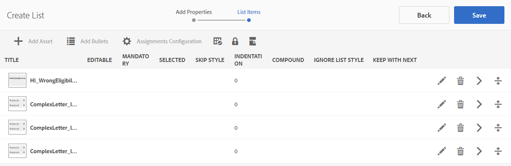

# Frammenti del documento{#document-fragments}

## Frammenti del documento {#document-fragments-1}

I frammenti di documento sono parti/componenti riutilizzabili di una corrispondenza mediante i quali è possibile comporre lettere/corrispondenza. I frammenti di documento sono dei tipi seguenti:

* **Testo**: Una risorsa di testo è una parte di contenuto costituita da uno o più paragrafi di testo. Un paragrafo può essere statico o dinamico.
* **Elenco**: Elenco è un gruppo di frammenti di documento, inclusi testo, elenchi, condizioni e immagini. L&#39;ordine degli elementi elenco può essere fisso o modificabile. Durante la creazione di una lettera, è possibile utilizzare alcuni o tutti gli elementi dell&#39;elenco per replicare un pattern di elementi riutilizzabili.
* **Condizione**: Le condizioni consentono di definire il contenuto da includere al momento della creazione della corrispondenza, in base ai dati forniti. La condizione è descritta in termini di variabili di controllo. Una variabile di controllo può essere un elemento del dizionario dati o un segnaposto.
* **Frammento** di layout: Un frammento di layout è un layout che può essere utilizzato all&#39;interno di una o più lettere. Un frammento di layout viene utilizzato per creare pattern ripetibili, in particolare tabelle dinamiche. Il layout può contenere campi modulo tipici come &quot;Indirizzo&quot; e &quot;Numero di riferimento&quot;. Contiene inoltre sottomoduli vuoti che indicano le aree di destinazione. I layout (XDP) vengono creati in Designer e quindi caricati in  AEM Forms.

## Testo {#text}

Una risorsa di testo è una parte di contenuto costituita da uno o più paragrafi di testo. Un paragrafo può essere statico o dinamico. Un paragrafo dinamico contiene riferimenti a elementi di dati, i cui valori vengono forniti in fase di esecuzione. Ad esempio, il nome del cliente in una formula di formula introduttiva potrebbe essere un elemento dati dinamico, con il relativo valore reso disponibile in fase di esecuzione. Modificando questi valori, lo stesso modello di lettera può essere utilizzato per generare lettere per clienti diversi.

La soluzione di gestione della corrispondenza supporta due tipi di elementi di dati dinamici (dati variabili):

* **Elementi** del dizionario dati: Questi elementi sono associati al dizionario dati e ottengono i relativi valori dall&#39;origine dati fornita. Una variabile del dizionario dati può essere protetta o non protetta. Durante la creazione della corrispondenza, l&#39;utente può modificare il valore predefinito delle variabili del dizionario dati non protette, ma non può modificare quelle protette.
* **Segnaposto**: Si tratta di variabili che non sono associate a un&#39;origine dati back-end. Richiedono all&#39;utente di compilare un valore durante la creazione della corrispondenza. Per impostazione predefinita, i segnaposto non sono protetti.

>[!NOTE]
>
>I modelli di gestione della corrispondenza non vi obbligano a creare nomi univoci al momento della creazione dei segnaposto. Se create due segnaposto con lo stesso nome, ad esempio un testo e una condizione, e li utilizzate entrambi in un modello di lettera, i valori dell&#39;ultimo segnaposto inserito vengono utilizzati per entrambi i segnaposto. Se due segnaposto hanno lo stesso nome, i loro tipi vengono confrontati. Se i tipi sono diversi, il relativo tipo diventa Stringa. All’interno di un modulo, tuttavia, non è possibile creare più segnaposto con lo stesso nome.

### Crea testo {#create-text}

1. Selezionare **Forms** > **Frammenti documento**.
1. Toccate **Crea** > **Testo** Oppure selezionate una risorsa di testo e toccate **Modifica**.
1. Specificate le seguenti informazioni per il testo:

   * **Titolo: (Facoltativo)** Inserite il titolo della risorsa di testo. I titoli non devono essere univoci e possono contenere caratteri speciali e caratteri non inglesi. I testi sono indicati dai titoli (se disponibili), ad esempio nelle miniature e nelle proprietà delle risorse.
   * **Nome:** nome univoco della risorsa di testo. Non sono disponibili due risorse (testo, condizione o elenco) in uno stato con lo stesso nome. Nel campo Nome, è possibile immettere solo caratteri, numeri e trattini della lingua inglese. Il campo Nome viene compilato automaticamente in base al campo Titolo. I caratteri speciali, gli spazi, i numeri e i caratteri non inglesi immessi nel campo Titolo vengono sostituiti con i trattini nel campo Nome. Anche se il valore nel campo Titolo viene automaticamente copiato nel campo Nome, è possibile modificarlo.
   * **Descrizione**: Digitate una descrizione della risorsa.
   * **Dizionario** dati: Facoltativamente, selezionare il dizionario dati in cui eseguire la mappatura. Questo attributo consente di aggiungere riferimenti agli elementi del dizionario dati nella risorsa di testo.
   * **Tag**: Se necessario, per creare un tag personalizzato immettete un valore nel campo di testo e premete Invio. Potete visualizzare il tag sotto il campo di testo dei tag. Quando salvate questo testo, vengono creati anche i nuovi tag aggiunti.

1. Toccare **Next**. Gestione corrispondenza visualizza la pagina Editor in cui è possibile aggiungere al testo paragrafi di testo ed elementi di dati.

   Il correttore ortografico predefinito nel browser esegue il controllo ortografia nell&#39;editor di testo. Per gestire il controllo ortografico e grammaticale, potete modificare le impostazioni del correttore ortografico del browser oppure installare plug-in/addons del browser per il controllo ortografico e grammaticale.

   È inoltre possibile utilizzare le varie scelte rapide da tastiera nell&#39;editor di testo per gestire, modificare e formattare il testo. Per ulteriori informazioni sulle scelte rapide da tastiera [Editor di testo](/help/forms/using/keyboard-shortcuts.md#p-formatting-p) nelle scelte rapide da tastiera di Gestione della corrispondenza.

1. Viene aperto un editor di testo e inserite il testo. Utilizzate la barra degli strumenti nella parte superiore della pagina per formattare il testo, inserire condizioni, collegamenti e interruzioni di pagina.

   

   * **Collegamento**: Inserisci   collegamento ipertestuale nel testo.
   * **Ripeti**: Ripete la stampa dell&#39;elemento raccolta nel dizionario dati utilizzando un delimitatore.
   * **Condizione**: Toccate per inserire una condizione. Inserisci testo in base alla condizione. Se la condizione è true, il testo è visibile nella lettera, altrimenti non è visibile.
   * **Aggiungi descrizione**: Aggiungete un’annotazione a un elemento di testo. Si tratta di metadati visibili all’autore, ma non a una parte della lettera creata.
   * **Interruzione** pagina: Se si imposta l&#39;attributo di interruzione di pagina di un modulo di testo su false, il modulo di testo non viene suddiviso tra le pagine.

   Viene aperto un editor di testo. Inserite il testo. La barra degli strumenti cambia a seconda del tipo di modifiche che si desidera apportare: Paragrafo, Allineamento o Elenco:

   

   Selezionare il tipo di barra degli strumenti: Paragrafo, Allineamento o Elenco

   

   Barra degli strumenti Paragrafo
   barra degli strumentiAllineamento

   

   Barra degli strumenti Elenco (fate clic per aprire l’immagine a dimensione intera)

1. Per riutilizzare uno o più paragrafi di testo esistenti in un’altra applicazione, ad esempio da pagine MS Word o HTML, copiate e incollate il testo nell’editor di testo. La formattazione del testo copiato viene mantenuta nell’editor di testo.

   È possibile copiare e incollare uno o più paragrafi di testo in un modulo di testo modificabile. Ad esempio, è possibile che si disponga di un documento MS Word con un elenco puntato di prove di residenza accettabili, come segue:

   

   È possibile copiare e incollare direttamente il testo dal documento di Microsoft Word a un modulo di testo modificabile. La formattazione, ad esempio l&#39;elenco puntato, il font e il colore del testo, viene mantenuta nel modulo di testo.

   

   >[!NOTE]
   >
   >La formattazione del testo incollato, tuttavia, presenta alcune [limitazioni](https://helpx.adobe.com/aem-forms/kb/cm-copy-paste-text-limitations.html).

1. Se necessario, inserire caratteri speciali nel frammento di documento. Ad esempio, è possibile utilizzare la palette Caratteri speciali per inserire:

   * Simboli di valuta come €,⇒ e £
   * Simboli matematici come i simboli all&#39;unisono, seguente:
   * Simboli di punteggiatura come ‟ e&quot;

   

   La gestione della corrispondenza è dotata di supporto per 210 caratteri speciali. L&#39;amministratore può [aggiungere supporto per più/personalizzare caratteri speciali mediante la personalizzazione](/help/forms/using/custom-special-characters.md).

1. Per evidenziare\enfatizzare parti di testo in un modulo in linea modificabile, selezionate il testo e toccate Colore evidenziazione.

   

   È possibile toccare direttamente un colore di base `**[A]**` presente nella palette Colori base oppure toccare **Seleziona** dopo aver utilizzato il cursore `**[B]**` per scegliere la tonalità appropriata del colore.

   Facoltativamente, è anche possibile passare alla scheda Avanzate per selezionare la tonalità, la luminosità e la saturazione `**[C]**` appropriata per creare il colore preciso, quindi toccare Seleziona `**[D]**` per applicare il colore per evidenziare il testo.

   

1. Dal pannello dati, trascinare gli elementi del dizionario dati e gli elementi segnaposto nel testo.

   A:

   * Aggiungete un elemento del dizionario dati nel testo, selezionate un elemento dati dall&#39;elenco e toccate Inserisci ( ). Se selezionate Protetto, l’elemento del dizionario dati è di sola lettura e viene visualizzato nell’editor di lettere, ma non nell’interfaccia utente Crea corrispondenza o in Creazione corrispondenza.
   * Aggiungi un elemento segnaposto nel testo, nel pannello Elementi dati tocca Crea nuovo, immetti i dettagli per il nuovo elemento dati e tocca Crea per aggiungere il nuovo elemento all&#39;elenco. Il nuovo segnaposto può essere inserito nel testo allo stesso modo dell&#39;elemento dizionario dati. Per modificare un segnaposto, selezionate un segnaposto e toccate Modifica.

   

   Elementi segnaposto come specificato nel file di dati di esempio di un dizionario dati

   

   Valori degli elementi segnaposto nella vista CCR popolati dalle variabili del dizionario dati come specificato nel file di dati di esempio

   È inoltre possibile utilizzare il simbolo @ per cercare e aggiungere all’editor di testo elementi di dizionario dati e segnaposto. Posizionare il cursore nel punto in cui si desidera inserire l&#39;elemento. Digitare @ seguito dalla stringa di ricerca. L&#39;editor di testo esegue l&#39;operazione di ricerca su tutti gli elementi del dizionario dati e del segnaposto disponibili nel frammento del documento di testo. L&#39;operazione di ricerca recupera e visualizza gli elementi che contengono la stringa di ricerca come un elenco a discesa. Scorri i risultati della ricerca e fai clic sull’elemento da inserire nella posizione del cursore. Premete Esc per nascondere i risultati della ricerca.

1. È possibile utilizzare le condizioni in linea e ripetere per rendere la lettera altamente contestuale e ben strutturata. Per ulteriori informazioni sulle condizioni in linea e sulla ripetizione, vedere [Condizioni in linea e ripetere in lettere](/help/forms/using/cm-inline-condition.md).
1. Toccate **Salva**.

#### Inserire un collegamento ipertestuale in un testo {#insert-hyperlink}

Per creare un collegamento ipertestuale in una risorsa di testo, effettuate le seguenti operazioni:

1. Selezionare l&#39;oggetto testo o modello dati nell&#39;editor di testo.

2. Toccate **[!UICONTROL Link]**. Toccate il campo **[!UICONTROL Testo Alt]** per rimuovere il nome o il testo dell&#39;oggetto modello dati esistente.

3. Specificate l&#39;URL e toccate .

#### Ricerca e sostituzione del testo {#searching-and-replacing-text}

Quando lavorate con elementi di testo contenenti un grande corpo di testo, dovete cercare una stringa di testo specifica. Potrebbe inoltre essere necessario sostituire una stringa di testo specifica con una stringa alternativa.

La funzione Trova e sostituisci consente di cercare (e sostituire) qualsiasi stringa di testo in un elemento di testo. La funzione include anche una potente ricerca di espressioni regolari.

#### Per cercare il testo in un modulo di testo {#to-search-text-in-a-text-module}

1. Aprite il modulo di testo nell’editor di testo.

1. Toccate Trova e sostituisci.
1. Immettete il testo da cercare nella casella di testo Trova e premete Trova. Il testo di ricerca è evidenziato nel modulo di testo.
1. Per cercare l’istanza successiva del testo, premere nuovamente Trova.

   Se si continua a premere il pulsante Trova, la ricerca continua verso il basso nella pagina. Dopo aver trovato l&#39;ultima istanza del testo, il messaggio **Raggiunto la fine del modulo** indica che non sono stati trovati altri risultati di ricerca.

   Tuttavia, se nel modulo di testo non viene trovata alcuna istanza del testo di ricerca, il messaggio visualizzato è: **Corrispondenza non trovata**.

1. Se premete nuovamente Trova, la ricerca continua nella parte superiore della pagina.

#### Opzioni di ricerca {#search-options}

**Maiuscole/minuscole:** la ricerca restituisce risultati solo con lo stesso maiuscole e minuscole.

**Parola intera:** Ricerca restituisce solo parole intere.

>[!NOTE]
>
>Se si immettono caratteri speciali nella casella di testo Trova, l&#39;opzione Parola intera è disabilitata.

**Reg ex:** ricerca utilizzando espressioni regolari. Ad esempio, la seguente espressione regolare cerca gli indirizzi e-mail in un modulo di testo:

`[a-zA-Z0-9._%+-]+@[a-zA-Z0-9.-]+\.[a-zA-Z]{2,4}`

#### Per cercare e sostituire il testo in un modulo di testo {#to-search-and-replace-text-in-a-text-module}

1. Aprite il modulo di testo nell’editor di testo.
1. Toccate Trova e sostituisci.
1. Immettete il testo da cercare nella casella di testo Trova e il testo con cui sostituire il testo da trovare e premete Sostituisci.
1. Se il testo di ricerca viene trovato, il testo viene sostituito dal testo Sostituisci.

   * Se viene trovata un&#39;altra istanza del testo di ricerca, tale istanza viene evidenziata nel modulo di testo. Se si preme nuovamente Sostituisci, l’istanza evidenziata viene sostituita e il cursore si sposta in avanti, se viene trovata una terza istanza.
   * Se non viene trovata un&#39;altra istanza, il cursore si arresta all&#39;ultima istanza sostituita.

1. Se premete nuovamente Trova, la ricerca continua nella parte superiore della pagina.

   Utilizzate l&#39;opzione Sostituisci tutto per sostituire tutte le istanze di un testo nel modulo di testo. Quando si utilizza &quot;, il numero di sostituzioni viene visualizzato come messaggio nella finestra di dialogo Trova e sostituisci.

#### Best practice/suggerimenti e trucchi per moduli di testo {#best-practices-tips-and-tricks-for-text-modules}

* Utilizzate una convenzione di denominazione coerente per evitare duplicazioni.
* Utilizzare il binding appropriato del dizionario dati nei moduli di testo.
* Quando si modifica una risorsa di testo si applicano le regole seguenti quando si utilizza l’Editor di testo:

   * **Aggiunta di variabile:** Consentita
   * **Rimozione di variabile:** Consentita
   * **Aggiornamento delle proprietà:** Consentito
   * **Modifica del dizionario dati:** consentita fino a quando non viene utilizzato l&#39;elemento del dizionario dati. Non è possibile modificare il dizionario dati in fase di aggiornamento.

## Elenco {#list}

Un elenco è un gruppo di frammenti di documento, inclusi testo, (altri) elenchi, condizioni e immagini. L&#39;ordine degli elementi elenco può essere fisso o modificabile. Durante la creazione di una lettera, è possibile utilizzare alcuni o tutti gli elementi dell&#39;elenco per replicare un pattern di elementi riutilizzabili. Gli elenchi si comportano fondamentalmente come destinazioni che possono essere nidificate all&#39;interno di altri target.

### Implementazione di elenchi {#implementing-lists}

Gli elenchi di implementazione si articolano in due fasi:

1. Definizione delle proprietà di base come nome, descrizione, dizionario dati.
1. Sezione del contenuto inclusa nell&#39;elenco e quindi impostazione delle proprietà quali l&#39;ordine di blocco e l&#39;accesso alla libreria per l&#39;elenco.

### Creare un elenco {#create-a-list}

Un elenco è un gruppo di contenuti correlati che possono essere utilizzati in un modello di lettera come singola unità. Qualsiasi tipo di contenuto può essere aggiunto a un elenco. Gli elenchi possono anche essere nidificati. I moduli elenco possono essere specificati come:

* **ORDINATO**: L&#39;ordine non può essere modificato nel runtime Crea corrispondenza.
* **Accesso** libreria: Gli utenti possono aggiungere moduli all&#39;elenco. Questo flag specifica se l&#39;accesso alla libreria è abilitato. Se attivato (aperto), l&#39;utente può aggiungere moduli all&#39;elenco durante la visualizzazione dell&#39;anteprima della lettera.
* Quando create un elenco, potete specificare un tipo, ad esempio:
* **Normale**: All&#39;elenco non viene applicata alcuna formattazione aggiuntiva dello stile.
* **Punti elenco**: Un elenco formattato con un semplice punto elenco.
* **Numerato**: Un elenco numerico con la scelta dei numeri Standard (1,2,...), Upper Roman (I, II, ...) e Lower Roman (i, ii,...).
* **Letterato**: Un elenco alfabetico con la scelta di lettere minuscole (a,b,...) e maiuscole (A,B,...).
* **Personalizzato**: Potete creare qualsiasi tipo di carattere Numerato/Letterato e i valori di prefisso e suffisso desiderati.

1. Selezionare **Forms** > **Frammenti documento**.

1. Selezionare **Crea** > **Elenco**.

1. Specificate le seguenti informazioni per l&#39;elenco:

   * **Titolo (facoltativo): Immettere** il titolo dell&#39;elenco. Il titolo non deve essere univoco e può contenere caratteri speciali e caratteri non inglesi. Gli elenchi sono indicati dai titoli (se disponibili), ad esempio nelle miniature e nelle proprietà delle risorse.
   * **Nome:** nome univoco dell&#39;elenco. Non sono disponibili due risorse (testo, condizione o elenco) in uno stato con lo stesso nome. Nel campo Nome, è possibile immettere solo caratteri, numeri e trattini della lingua inglese. Il campo Nome viene compilato automaticamente con il valore nel campo Titolo. I caratteri speciali, gli spazi, i numeri e i caratteri non inglesi immessi nel campo Titolo vengono sostituiti con i trattini nel campo Nome. Anche se il valore nel campo Titolo viene automaticamente copiato nel campo Nome, è possibile modificarlo.
   * **Descrizione (facoltativo)**: Digitate una descrizione della risorsa.
   * **Dizionario dati (facoltativo)**: Facoltativamente, selezionare il dizionario dati a cui connettersi. È possibile aggiungere all&#39;elenco solo le risorse che utilizzano lo stesso dizionario dati dell&#39;elenco o che non dispongono di un dizionario dati. L&#39;assegnazione di un dizionario dati a un elenco facilita la ricerca dell&#39;elenco da parte dell&#39;utente che crea un modello di lettera.
   * **Tag (facoltativo)**: Selezionare i tag da applicare. Potete anche digitare il nome di un nuovo tag e crearlo. (Il nuovo tag viene creato quando toccate **Salva**.)

1. Toccare **Next**.
1. Toccate **Aggiungi risorsa**.
1. Per aggiungere risorse all’elenco, selezionatele nella pagina Seleziona risorse e toccate **Fine**.

   

1. Le risorse vengono aggiunte alla pagina Elementi elenco.
Per modificare l&#39;ordine delle risorse nell&#39;elenco, toccate e tenete premuto l&#39;icona delle frecce (  ) e trascinate. Quando l&#39;utente apre un modello di lettera nell&#39;interfaccia utente Crea corrispondenza, il contenuto viene assemblato nell&#39;ordine definito qui.

   

1. Potete selezionare le seguenti opzioni per specificare il funzionamento dell&#39;elenco nell&#39;interfaccia utente CCR:

   * **Accesso** libreria: Per abilitare l&#39;accesso alla libreria per l&#39;aggiunta di risorse, toccate Accesso alla libreria. Quando Accesso libreria è abilitato, il regolatore delle attestazioni può aggiungere più contenuto all&#39;elenco. In caso contrario, l&#39;Aggiustatore di richieste di indennizzo è limitato al contenuto definito per l&#39;elenco.
   * **Blocca ordine**: Per bloccare l&#39;ordine delle risorse nell&#39;elenco in modo che l&#39;Aggiustatore crediti non possa modificare l&#39;ordine, toccate Blocca ordine. Se non si seleziona questa opzione, l&#39;Aggiustatore crediti può modificare l&#39;ordine delle voci dell&#39;elenco.

   * **Aggiungi punti elenco**: Utilizzare questa opzione per applicare uno stile di elenco puntato o di numerazione al modulo. È possibile utilizzare uno stile di elenco predefinito o personalizzato. Potete inoltre specificare il testo da visualizzare prima e dopo ciascuna voce dell’elenco.
   * **Interruzione** pagina: Selezionare questa opzione ( ) per aggiungere un&#39;interruzione di pagina tra il contenuto dell&#39;elenco. Se questa opzione non è selezionata ( ), se il contenuto dell&#39;elenco è overflow nella pagina successiva, l&#39;intero elenco viene spostato nella pagina successiva invece di essere suddiviso nella pagina tra l&#39;elenco.

   * **Configurazione** assegnazione: Utilizzate questa opzione per specificare il numero minimo e massimo di risorse che possono essere aggiunte all&#39;elenco.

1. Potete selezionare le seguenti opzioni per specificare il comportamento di ciascuna risorsa dell&#39;elenco in fase di esecuzione:

   * **Modificabile:** Quando questa opzione è selezionata, il contenuto può essere modificato nell&#39;interfaccia utente Crea corrispondenza. Questa opzione non è disponibile per i moduli Elenco e Immagine.
   * **Obbligatorio:** quando questa opzione è selezionata, il contenuto è richiesto nell&#39;interfaccia utente Crea corrispondenza.
   * **Selezionato:** quando questa opzione è selezionata, il contenuto è preselezionato nell&#39;interfaccia utente Crea corrispondenza.
   * **Skip Style:** quando questa opzione è selezionata, il contenuto salta gli elenchi puntati e la numerazione nell&#39;interfaccia utente Crea corrispondenza. Questa opzione non è disponibile per i moduli immagine. Inoltre, tra Skip Style, Compound e Ignore List Style (Ignora stile elenco) è possibile applicare a un modulo solo una delle opzioni disponibili. Una di queste opzioni può essere utilizzata per un modulo quando si seleziona Aggiungi punti elenco per un modulo.
   * **Rientro:** potete modificare il livello di rientro di ciascun modulo/contenuto selezionato come parte dell’elenco. Il rientro è specificato in termini di Livelli (a partire da zero), in modo che ogni livello di rientro corrisponda a una spaziatura di 36 punti.
   * **Composto:** se è selezionata, la numerazione composta viene applicata come combinazione dello stile dell&#39;Elenco esterno (primario) e del proprio stile. La numerazione composta di questo elenco nidificato si basa sull’ordine in cui questo elenco nidificato viene visualizzato nell’elenco esterno.
   * **Ignora stile elenco:** se l&#39;opzione Numerazione composta è deselezionata, l&#39;opzione Ignora stile elenco è attivata. Questa selezione ignora lo stile dell&#39;Elenco nidificato e la numerazione continua dall&#39;Elenco esterno. Pertanto, i moduli dell’elenco nidificato vengono trattati come parte dell’elenco esterno stesso, a prescindere dagli stili specificati nell’elenco nidificato. Se per un elenco nidificato è deselezionata l’opzione Ignora stile elenco, i moduli che fanno parte di tale elenco nidificato hanno un proprio stile di numerazione.
   * **Mantieni con successivo:** imposta l&#39;interruzione di pagina per le risorse contenute in un elenco. Se impostate la proprietà Mantieni con successivo di una risorsa di un elenco su **On**, la risorsa e la risorsa successiva restano sulla stessa pagina. Ciò implica che il contenuto della risorsa selezionata e della risorsa successiva non verrà suddiviso tra le pagine.

1. Toccate **Salva**.

### Best practice/suggerimenti e trucchi {#best-practices-tips-and-tricks}

* Utilizzate una convenzione di denominazione coerente per evitare duplicazioni.
* Usa binding dizionario dati appropriato
* Quando si utilizza l’Editor di elenco per modificare un elenco, si applicano le regole seguenti:

   * Aggiornamento delle proprietà: Consentita
   * **Modifica del dizionario dati:** Consentito finché non viene associato nessun elemento che utilizza il dizionario dati. Non è possibile modificare il dizionario dati in fase di aggiornamento.

## Condizioni {#conditions}

Le condizioni consentono di definire il contenuto da includere al momento della creazione della corrispondenza o della lettera, in base ai dati forniti. La condizione è descritta in termini di variabili di controllo. Quando aggiungete una condizione, potete scegliere di includere una risorsa in base al valore della variabile di controllo.

In base alle opzioni selezionate, viene valutata solo la prima espressione che si è rivelata vera, in base alla variabile di condizione corrente o a tutte le condizioni. Quando si compila la lettera in Crea corrispondenza (CCR), le condizioni si comportano come &quot;caselle bianche&quot;. Se una condizione restituisce un elenco, vengono generati tutti gli elementi obbligatori e preselezionati dell&#39;elenco. Se uno di questi elementi è costituito da condizioni o da elenchi stessi, il relativo contenuto viene anch’esso riprodotto in ordine di profondità, dall’alto verso il basso, come elenco semplice di testo e contenuti immagine. I risultati delle condizioni possono essere di qualsiasi tipo (testo, elenco, condizione o immagine).

### Condizioni di implementazione {#implementing-conditions}

L&#39;Editor condizioni è dotato di un&#39;interfaccia utente [Generatore di espressioni](/help/forms/using/expression-builder.md) che supporta la creazione di espressioni utilizzando sia segnaposto multipli che elementi del Dizionario dati. In tali espressioni è possibile utilizzare operandi comuni e funzioni locali/globali. Ciascuna espressione può essere associata ad alcuni contenuti ed eventualmente potrebbe essere presente una sezione predefinita se nessuna delle espressioni restituisce true. Tutte le espressioni vengono valutate nella sequenza in cui sono definite e le prime espressioni che restituiscono true vengono selezionate e il contenuto associato viene restituito da tale modulo condizionale.

Ad esempio, se il testo di termini e condizioni in una lettera varia a seconda dello stato in cui si trova il cliente e il dizionario dati contiene un elemento denominato &quot;state&quot;, è possibile aggiungere la condizione come segue:
・ stato = NY, selezionare il paragrafo di testo T&amp;C_NY
・ stato = NC, selezionare il paragrafo di testo T&amp;C_NC

L&#39;editor Condizione consente di specificare una condizione predefinita. Se il valore delle variabili di controllo non corrisponde ad alcuna condizione, viene utilizzato il contenuto associato alla condizione predefinita. Seguendo l&#39;esempio precedente, è possibile aggiungere questa riga di condizione:
・ Predefinito, selezionare T&amp;C_Rest

### Creare una condizione {#create-a-condition}

1. Selezionare **Forms** > **Frammenti documento**.
1. Selezionare **Crea > Condizione**.
1. Specificate le seguenti informazioni per l&#39;elenco:

   * **Titolo (facoltativo):** inserire il titolo della condizione. Il titolo non deve essere univoco e può contenere caratteri speciali e caratteri non inglesi. Le condizioni sono indicate dai titoli (quando disponibili), ad esempio nelle miniature e nelle proprietà delle risorse.
   * **Nome:** nome univoco della condizione. Non sono disponibili due risorse (testo, condizione o elenco) in uno stato con lo stesso nome. Nel campo Nome, è possibile immettere solo caratteri, numeri e trattini della lingua inglese. Il campo Nome viene compilato automaticamente in base al campo Titolo. I caratteri speciali, gli spazi, i numeri e i caratteri non inglesi immessi nel campo Titolo vengono sostituiti con i trattini nel campo Nome. Anche se il valore nel campo Titolo viene automaticamente copiato nel campo Nome, è possibile modificarlo.
   * **Descrizione (facoltativo)** Digitare una descrizione della condizione.
   * **Dizionario dati (facoltativo)**: Facoltativamente, selezionare il dizionario dati a cui connettersi. È possibile aggiungere all&#39;elenco solo le risorse che utilizzano lo stesso dizionario dati della condizione, o risorse a cui non è assegnato alcun dizionario dati. L&#39;assegnazione di un dizionario dati a un elenco facilita la ricerca della condizione appropriata da parte dell&#39;utente che crea un modello di lettera.
   * **Tag (facoltativo)**: Facoltativamente, selezionare i tag da applicare. Potete anche digitare il nome di un nuovo tag e crearlo. (Il nuovo tag viene creato quando toccate **Salva**.)

1. Toccare **Next**.
1. Toccate **Aggiungi risorsa**.
1. Per aggiungere una risorsa alla condizione, selezionatela nella pagina Seleziona risorse e toccate **Fine**. Le risorse vengono aggiunte al riquadro Espressione.
1. Potete selezionare le seguenti opzioni per specificare il comportamento della condizione in fase di esecuzione:

   * **Disattiva valutazione di più risultati\Abilita valutazione** di più risultati: Quando questa opzione è attivata (viene visualizzata come &quot;Abilita multipla...&quot;), tutte le condizioni vengono valutate e il risultato è la somma di tutte le condizioni vere. Se questa opzione è disattivata (viene visualizzata come &quot;Disattiva multipla...&quot;), viene valutata solo la prima condizione che risulta vera e diventa l&#39;output della condizione.
   * **Interruzione** pagina: Selezionare questa opzione ( ) per aggiungere un&#39;interruzione di pagina tra i moduli delle condizioni. Se questa opzione non è selezionata ( ), se una condizione è in eccesso sulla pagina successiva, l&#39;intera condizione viene spostata sulla pagina successiva invece di interrompere la pagina tra la condizione.

1. Per modificare l&#39;ordine delle risorse all&#39;interno della condizione, toccate e tenete premuto l&#39;icona delle frecce (  ) e trascinate. Quando l&#39;utente apre un modello di lettera nell&#39;interfaccia utente Crea corrispondenza, il contenuto viene assemblato nell&#39;ordine definito qui.
1. Toccate **Elimina** per eliminare la riga. Se toccate Elimina per la riga predefinita, vengono cancellate solo le informazioni sulla risorsa.
1. Toccate **Copia** per duplicare una riga.
1. Toccate **Modifica** per modificare la risorsa o l&#39;espressione.

   Ulteriori informazioni:

   * Per aggiornare la risorsa, toccate l’icona della cartella sotto la colonna Risorsa.
   * Per aprire il Generatore di espressioni per inserire un&#39;espressione, toccate l&#39;icona della cartella sotto la colonna Espressione. Per ulteriori informazioni su Generatore di espressioni, vedere [Generatore di espressioni](/help/forms/using/expression-builder.md).

### Best practice/suggerimenti e trucchi {#best-practices-tips-and-tricks-1}

* Utilizzate una convenzione di denominazione coerente per una ricerca semplice ed evitare duplicazioni.
* Le condizioni si comportano come le istruzioni caso, quindi l&#39;ordine delle condizioni è importante. Viene restituita la prima corrispondenza.
* Usa binding dizionario dati appropriato
* Quando si utilizza Editor condizione per modificare una condizione si applicano le regole seguenti:

   * **Aggiunta di variabile:** Consentita
   * **Rimozione di variabile:** Consentita
   * **Aggiornamento delle proprietà:** Consentito
   * **Modifica del dizionario dati:** consentita fino a quando non viene utilizzato l&#39;elemento del dizionario dati.

## Frammenti di layout {#layoutfragments}

Un frammento di layout è basato sugli XDP creati in Designer. Per creare i frammenti di layout, è necessario creare gli XDP e [caricarli in  AEM Forms](/help/forms/using/import-export-forms-templates.md).

Uno o più frammenti di layout possono formare parti di una lettera e definire il layout grafico di tali parti. Un frammento di layout può contenere campi modulo tipici, ad esempio Indirizzo e Numero di riferimento, e sottomoduli vuoti che indicano le aree di destinazione. Inoltre, i frammenti di layout consentono di creare tabelle e di inserirle in lettere.

Un caso comune è quello di individuare pattern di layout riutilizzabili in Lettere e creare frammenti di layout per tali pattern. Ad esempio, la formula introduttiva, l&#39;indirizzo e la parte oggetto della lettera, che vengono visualizzate nello stesso ordine con più lettere. Un altro esempio potrebbe essere una tabella con un numero di righe e colonne simile, utilizzata in più lettere.

È possibile creare un frammento di layout basato su un XDP esistente. Un frammento di layout può essere composto da campi e aree di destinazione o da una o più tabelle. Le tabelle di un layout possono essere statiche o dinamiche. Viene creato un file XDP in Designer e [caricato in  AEM Forms](/help/forms/using/import-export-forms-templates.md). Un XDP può formare la struttura di un frammento di layout o di una lettera. Ulteriori informazioni su [Layout Design](/help/forms/using/layout-design-details.md).

L’utilizzo di frammenti associati alle aree di destinazione consente di modificare la lettera al momento dell’authoring. È possibile creare un frammento di layout con dimensioni diverse e associare il frammento appropriato all&#39;area di destinazione. I frammenti di layout consentono inoltre di personalizzare alcune proprietà della tabella:

1. È possibile aumentare il numero di righe e colonne.
1. È possibile specificare il testo dell&#39;intestazione e del piè di pagina per più righe e colonne.
1. È possibile definire il rapporto tra la larghezza della colonna della tabella. In fase di esecuzione le colonne delle tabelle vengono ridimensionate in base al rapporto definito e allo spazio disponibile. Il rapporto larghezza deve essere pari a 100. In caso contrario non è applicabile.
1. Se una tabella è un segnaposto (contiene solo una cella vuota), è possibile definire il tipo (area/campo di destinazione) delle nuove colonne.
1. È possibile nascondere le righe di intestazione e piè di pagina.

Prima di eseguire questa procedura, creare un frammento XFA utilizzando Designer. Il frammento può contenere tabelle per l&#39;organizzazione di campi e aree di destinazione. Designer consente la creazione di due tipi di tabelle: statici e dinamici. Le tabelle statiche contengono un numero fisso di righe. Le tabelle statiche possono contenere aree e campi di destinazione. Impossibile associare l&#39;area di destinazione e i campi a DDE ripetuti. Una tabella dinamica può avere anche una sola riga. I dati associati alle celle delle tabelle determinano il numero di righe per le tabelle dinamiche. Una tabella dinamica può contenere solo campi. I DDE possono essere ripetuti o non ripetuti.

Durante la progettazione delle tabelle, tenere in considerazione i seguenti punti:

1. Le tabelle possono essere personalizzate al momento della creazione del frammento di layout. Tuttavia, l&#39;opzione di personalizzazione è abilitata solo quando il sottomodulo principale della tabella è scorrevole.
1. Per le tabelle dinamiche tutti i campi, le righe e le tabelle ripetibili utilizzano il binding &quot;use name&quot; per consentire la corretta unione dei dati.
1. Per le tabelle dinamiche, tutti i DDE ripetuti associati ai campi tabella fanno parte della stessa gerarchia. Per i DDE non ripetuti, non esiste tale limitazione.
1. Al momento dell&#39;unione del frammento di layout nelle tabelle dell&#39;area di destinazione principale, il ridimensionamento viene effettuato in base allo spazio disponibile, tuttavia, solo se il frammento di layout non contiene alcuna area di destinazione o campo direttamente all&#39;interno del sottomodulo di livello principale. Area di destinazione e campi all&#39;interno della tabella sono consentiti.
1. È possibile creare tabelle con segnaposto. Le tabelle dei segnaposto dispongono di una sola cella vuota.

* Per le tabelle segnaposto è possibile personalizzare le seguenti proprietà al momento della creazione del frammento.

   * numero di righe
   * conteggio colonne
   * intestazione e piè di pagina per ogni colonna
   * tipo (area/campo di destinazione) di ciascuna colonna
   * rapporto di larghezza per ogni colonna

* Per una tabella non segnaposto, è possibile personalizzare le seguenti proprietà:

   * numero di righe
   * conteggio colonne
   * intestazione e piè di pagina per colonna aggiuntiva
   * rapporto di larghezza per ogni colonna

È possibile nidificare i frammenti in una lettera. È quindi possibile aggiungere un frammento all&#39;interno di un frammento. La soluzione Correspondence Management supporta fino a quattro livelli di nidificazione all&#39;interno di una lettera: **Lettera**->**Frammento**->**Frammento**->**Frammento**->**Frammento.**

Per un esempio dettagliato sull&#39;utilizzo di tabelle statiche e dinamiche nei frammenti di layout, vedere [Esempio con file di esempio: utilizzo di tabelle statiche e dinamiche in una lettera](#examplewithsamplefiles).

### Creazione di un frammento di layout {#creating-a-layout-fragment}

1. Selezionare **Crea** > **Frammento di layout**.
1. Gestione corrispondenza visualizza gli XDP disponibili. Selezionare l&#39;XDP su cui si desidera basare il frammento di layout e toccare **Next**.
1. Specificate le seguenti informazioni per il layout:

   * **Titolo (facoltativo):** inserire il titolo del frammento di layout. Il titolo non deve essere univoco e può contenere caratteri speciali e caratteri non inglesi. I frammenti di layout sono indicati dai titoli (se disponibili), ad esempio nelle miniature e nelle proprietà delle risorse.
   * **Nome:** nome univoco per il frammento di layout. Non sono disponibili due risorse (testo, condizione o elenco) in uno stato con lo stesso nome. Nel campo Nome, è possibile immettere solo caratteri, numeri e trattini della lingua inglese. Il campo Nome viene compilato automaticamente in base al campo Titolo. I caratteri speciali, gli spazi, i numeri e i caratteri non inglesi immessi nel campo Titolo vengono sostituiti con i trattini nel campo Nome. Anche se il valore nel campo Titolo viene automaticamente copiato nel campo Nome, è possibile modificarlo. Questo nome viene visualizzato nell’elenco dell’interfaccia utente Gestisci risorse.
   * **Descrizione (facoltativo)**: Descrizione visualizzata nell’elenco nell’interfaccia utente Gestisci risorse.
   * **Tag (facoltativo)**: Facoltativamente, selezionare i tag da applicare alla condizione. Potete anche digitare il nome di un nuovo tag e crearlo.

1. Toccate la scheda **Tabella** e specificate le seguenti informazioni per il layout:

   * **Configurazione per**: Selezionare la tabella da configurare.Come suffisso il nome della tabella nel menu a discesa è (Static) se la tabella è statica o (Dynamic) se la tabella è dinamica. Le tabelle statiche contengono un numero fisso di righe. Le tabelle statiche possono contenere aree e campi di destinazione. Impossibile associare l&#39;area di destinazione e i campi a DDE ripetuti. I dati associati alle celle delle tabelle determinano il numero di righe per le tabelle dinamiche.

   * **Righe**: Selezionare il numero di righe per il layout. Il conteggio delle righe configurato deve essere maggiore o uguale al conteggio delle righe originale.
   * **Colonne**: selezionate il numero di colonne per il layout. Il numero di colonne configurato deve essere maggiore o uguale al numero di colonne originale.

   Per ogni colonna sono necessari i seguenti dettagli:

   * **Intestazione**: testo da visualizzare per l’intestazione
   * **Piè di pagina**: testo da visualizzare per il piè di pagina
   * **Tipo**: tipo di colonna aggiuntiva. Campo o Area di destinazione. Il tipo è abilitato per le tabelle dei segnaposto statici. Il tipo può essere definito a livello di colonna e non a livello di cella. Tutte le celle di una colonna estesa sarebbero dello stesso tipo. Per una tabella dinamica, tutte le colonne sono di tipo Field. Per le tabelle non segnaposto non è possibile definire il tipo di colonne aggiuntive. In questo caso, il tipo di celle aggiuntive nella colonna estesa è uguale al tipo dell&#39;ultima colonna in quella riga; e il tipo di cella nella riga aggiuntiva è uguale al tipo dell&#39;ultima cella in quella colonna.
   * **Rapporto larghezza:** rapporto tra le larghezze delle colonne della tabella.

   Per un esempio dettagliato sull&#39;utilizzo di tabelle statiche e dinamiche nei frammenti di layout, vedere [Esempio con file di esempio: utilizzo di tabelle statiche e dinamiche in una lettera](#examplewithsamplefiles).

1. Toccate **Salva**.

### Caricare un XDP in Gestione corrispondenza {#upload-an-xdp-to-correspondence-management}

Per istruzioni su come caricare/importare un XDP in Gestione corrispondenza, consultate [Importazione ed esportazione di risorse in  AEM Forms](/help/forms/using/import-export-forms-templates.md).

### Best practice/suggerimenti e trucchi {#best-practices-tips-and-tricks-2}

#### Impostare il binding del sottomodulo predefinito {#set-the-default-subform-binding}

Durante la creazione di aree di destinazione in Designer, è possibile impostare il binding predefinito per tutti i nuovi sottomoduli su &quot;none&quot;.

Per impostare il binding predefinito:

1. In Designer, toccare **Strumenti** > **Opzioni** > **Binding dei dati** > **Binding dei sottomoduli**.

1. Nell&#39;elenco Binding predefinito per nuovi sottomoduli, selezionare **Nessun binding dati**.

In questo modo, per impostazione predefinita, i sottomoduli inseriti mediante il comando Inserisci > Sottomodulo o trascinandoli dalla palette Oggetto hanno un binding &quot;none&quot;. Questo significa che per impostazione predefinita, qualsiasi nuovo sottomodulo è un&#39;area di destinazione, a meno che non vi si aggiunga contenuto, non si modifichi l&#39;impostazione di binding o non si denomini il sottomodulo con suffisso &quot;_int&quot;.

#### Conformità alla sezione 508 {#section-compliance}

Se la lettera finale creata nell’interfaccia utente Crea corrispondenza viene utilizzata per compilare un flusso di lavoro successivo. Seguite queste raccomandazioni relative alla sezione 508 durante la creazione del layout. In caso contrario, la lettera PDF è visualizzata e potete ignorare le seguenti raccomandazioni:

* Tutti i sottomoduli dell&#39;area di destinazione e tutti i campi in un layout hanno un ordine di tabulazione.
* Per impostazione predefinita, i campi con didascalie sono conformi a 508. Per impostazione predefinita, l&#39;attributo speak@priority del campo è impostato su &quot;custom&quot;; pertanto, a meno che non venga fornito testo personalizzato per l&#39;assistente vocale, l&#39;assistente vocale legge la didascalia del campo.
* I campi senza didascalie specificano una descrizione comandi e indicano che gli assistenti vocali leggono la descrizione comandi impostando

`/field/assist/speak@priority="toolTip"` e specifica del testo della descrizione comandi in  `/field/assist/toolTip`.

#### Formati data in Designer e Gestione configurazione risorse {#date-formats-in-designer-and-asset-configuration-manager}

Durante la progettazione di un layout in Designer, assicurarsi che i formati per i campi data corrispondano ai formati data specificati in Formati di visualizzazione dati in [Proprietà di configurazione della gestione della corrispondenza](/help/forms/using/cm-configuration-properties.md). Per ulteriori informazioni, vedere &quot;Formattazione dei valori dei campi e uso dei pattern&quot; nella Guida di Designer.

#### Intervalli di date di acquisizione {#capturing-date-ranges}

Per gestire una combinazione di date, ad esempio startDate - endDate, utilizzare un singolo sottomodulo per garantire l&#39;allineamento corretto nella lettera finale e ridurre al minimo il numero di campi.

#### Impostazione del binding a livello di modulo {#setting-form-level-binding}

Quando un layout contiene molti campi e aree di destinazione mappati a singoli elementi XML, utilizzare il binding a livello di modulo e creare un nodo separato per ciascun elemento. I campi associati a livello di modulo vengono ignorati durante la mappatura dei dati in Gestione corrispondenza.

#### Non utilizzare le aree di destinazione del sottomodulo in una pagina master {#do-not-use-subform-target-areas-in-a-master-page}

Le aree delle destinazioni sottomodulo in una pagina master non sono visibili nell&#39;interfaccia utente Gestisci risorse e non è possibile mappare i dati su di esse.

#### Scelta delle posizioni e dei tipi appropriati per le aree di destinazione {#choosing-appropriate-positions-and-types-for-target-areas}

Durante la progettazione del layout, prestare attenzione alla scelta dei sottomoduli. Se il layout contiene un singolo sottomodulo, può essere di tipo scorrevole. Dopo aver posizionato i campi nel sottomodulo, è possibile racchiudere i campi in un altro sottomodulo in modo che anche il sottomodulo racchiuso venga scorrevole e il layout non venga disturbato.

#### Inserimento di campi nelle pagine master {#placing-fields-on-master-pages}

Quando si inserisce un campo in una pagina master, tenere presente quanto segue:

* Impostare il binding dei campi della pagina master su Uso dei dati globali
* Non posizionare il campo direttamente sotto l&#39;area PageArea principale della pagina master.
* Racchiudere il campo in un sottomodulo denominato e assicurarsi che il binding del sottomodulo denominato sia impostato su Usa nome.

## Creazione di tabelle con frammenti di layout {#creating-tables-using-layout-fragments}

Molti modelli di lettera contengono tabelle. Le tabelle possono essere statiche, ad esempio una tabella di termini e condizioni, in cui ogni riga rappresenta una condizione e ogni parte viene visualizzata in una colonna separata. Le tabelle possono anche essere dinamiche come le informazioni sul conto, che contengono informazioni quali il nome del cliente, l&#39;ID del conto, il numero della transazione e l&#39;importo della transazione.

* **Tabelle** statiche: Talvolta le tabelle vengono create con righe con un numero diverso di colonne, ad esempio per una tabella di termini e condizioni. Dove ogni riga rappresenta una condizione e ogni condizione può avere sottoparti diverse. Ogni parte viene visualizzata in una colonna separata.
* **Tabelle** dinamiche: I frammenti di layout consentono di eseguire il binding dei campi di una tabella dinamica con i DDE della raccolta. Al momento della generazione delle lettere, le righe delle tabelle vengono generate in base alle dimensioni dei DDE della raccolta.

Il DD ha un elemento di raccolta Nominee_details con un elemento composito con tre elementi primitivi: Nominee_name, Nominee_address e Nominee_gender.
Anche l&#39;XDP dinamico ha le stesse intestazioni. È quindi possibile mappare i campi XDP dinamici con i campi DD indicati sopra.

### Esempio con file di esempio: Uso di tabelle statiche e dinamiche in una lettera {#examplewithsamplefiles}

Questo esempio mostra come creare una tabella dinamica e statica, eseguire un binding della tabella dinamica con DDE e quindi creare una lettera che includa queste due tabelle. Durante l&#39;utilizzo di questo esempio, potete creare file da zero o utilizzare i file di input forniti nei passaggi descritti.

1. Creare un dizionario dati (DD) che si desidera utilizzare nell&#39;esempio, come rappresentato nell&#39;elemento grafico.

   Quindi selezionate DD ed esportate i dati di esempio. Il file XML ottenuto contiene i dati Dipendente e tre istanze per Nominee_details (per impostazione predefinita vengono scaricate 3 istanze. Potete aggiungere o eliminare i contenuti in base alle vostre esigenze). Aggiornate i valori e importate i dati del test in DD. Il file CMP è il pacchetto e contiene il DD. Quindi, importate il DD in Gestione della corrispondenza.

   Per ulteriori informazioni sull&#39;utilizzo del dizionario dati e sui dati di prova, vedere [Dizionario dati](/help/forms/using/data-dictionary.md#p-working-with-test-data-p).

   

   [Ottieni file](assets/exportpackage_1431709897770.cmp.zip)

1. In Designer, creare due XDP (frammenti di layout): una tabella dinamica e una tabella statica. Per entrambi i layout:

   * Aggiungere un sottomodulo alla colonna della tabella. Assicurarsi di modificare il layout del sottomodulo principale della tabella in modo che sia scorrevole e rimuovere i binding del sottomodulo nella tabella.
   * Aggiungere un sottomodulo alla cella della tabella. Assicurarsi di modificare il layout del sottomodulo principale della tabella in modo che sia scorrevole e rimuovere i binding del sottomodulo nella tabella.

   In alternativa, utilizzate gli XDP statici e dinamici associati a questo passaggio.

   Per ulteriori informazioni sull&#39;uso dei frammenti di layout, vedere [Frammenti di layout](#layoutfragments).
Per ulteriori informazioni sulla progettazione dei layout, vedere [Guida di Designer](https://help.adobe.com/en_US/AEMForms/6.1/DesignerHelp/).

   [Ottieni file](assets/static.xdp.zip)

   [Ottieni file](assets/dynamic.xdp.zip)

1. Caricate gli XDP in  AEM Forms.
1. Creare un frammento di layout basato su XDP dinamico. La scheda Tabella delle proprietà mostra che la tabella è dinamica (campo Configuration For). Il numero di righe (1) e colonne (3) deriva dal frammento XDP/Layout.

   I campi di questo layout sono successivamente associati al DD importato e, nella lettera, il numero di righe viene creato in modo dinamico in base al numero di record nel file di dati di prova (il file di dati XML allegato al DD).

   

   Fare clic per aprire l&#39;immagine a dimensione intera

1. Creare un frammento di layout basato su XDP statico. La scheda Tabella delle proprietà mostra che la tabella è statica (campo Configuration For). Il numero di righe (1) e colonne (3) deriva dal frammento XDP/Layout.

   È possibile modificare il numero di colonne e righe. In base alle opzioni selezionate in questa schermata, il numero di righe e colonne di una tabella statica rimane fisso nella lettera creata con questo layout.
   

1. Creare una lettera utilizzando entrambi i frammenti di layout al suo interno. Quando si inserisce l&#39;XDP dinamico nella lettera, impostare il binding dei relativi campi agli elementi della raccolta del dizionario dati.

   Per ulteriori informazioni sulla creazione di modelli per lettere e lettere, vedere [Crea lettera](/help/forms/using/create-letter.md).

1. Salvate la lettera e visualizzatela in anteprima. Quando si visualizza l&#39;anteprima della lettera, i valori del dizionario dati sono visualizzati nella lettera. Per la tabella dinamica sono presenti tre righe. Questo perché i dati del test hanno tre record per queste righe.

   Per la tabella statica, durante la creazione del frammento di layout sono presenti tutte le righe e le colonne specificate.

   

   Per la tabella dinamica, le tre righe vengono visualizzate in base al numero di record nel file di dati di prova. Ciò si verificava in quanto durante l&#39;aggiunta del layout alla lettera, era stato creato un binding tra i campi della tabella dinamica e gli elementi della raccolta del dizionario dati. I valori Nome, Indirizzo e Genere vengono compilati dal file di dati di prova utilizzato.

   

## Creare una copia di un frammento di documento {#create-a-copy-of-a-document-fragment}

Per creare rapidamente un frammento di documento con proprietà e contenuto simili a un frammento di documento esistente, è possibile copiarlo e incollarlo.

1. Selezionare uno o più frammenti di documento dall&#39;elenco dei frammenti di documento. L’interfaccia utente presenta l’icona Copia.
1. Tocca Copia. Nell’interfaccia utente viene visualizzata l’icona Incolla. Potete anche scegliere di entrare in una cartella prima di incollare. Cartelle diverse possono contenere risorse con gli stessi nomi. Per ulteriori informazioni sulle cartelle, consultate [Cartelle e organizzazione delle risorse](/help/forms/using/import-export-forms-templates.md#folders-and-organizing-assets).
1. Toccate Incolla. Viene visualizzata la finestra di dialogo Incolla. Se si copia e incolla i frammenti di documento nello stesso punto, il sistema assegna automaticamente nomi e titoli alle nuove copie di lettere, ma è possibile modificare i titoli e i nomi delle lettere.
1. Se necessario, modificare il Titolo e il Nome con cui si desidera salvare la copia del frammento del documento.
1. Toccate Incolla. Viene creata la copia del frammento di documento.

