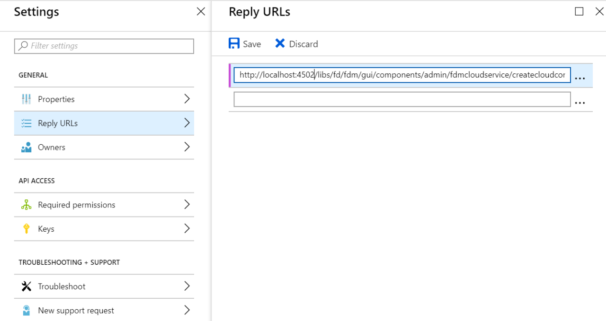

# Configurazione di Microsoft Dynamics OData{#microsoft-dynamics-odata-configuration}

| Versione | Collegamento articolo |
| -------- | ---------------------------- |
| AEM as a Cloud Service | [Fai clic qui](https://experienceleague.adobe.com/docs/experience-manager-cloud-service/content/forms/integrate/use-form-data-model/ms-dynamics-odata-configuration.html) |
| AEM 6.5 | Questo articolo |


Microsoft Dynamics è un software CRM (Customer Relationship Management) e ERP (Enterprise Resource Planning) che fornisce soluzioni aziendali per la creazione e la gestione di account cliente, contatti, lead, opportunità e casi. [AEM Forms Data Integration](../../forms/using/data-integration.md) fornisce una configurazione del servizio cloud OData per integrare Forms con il server Microsoft Dynamics online e on-premise. Consente di creare un modello di dati modulo basato su entità, attributi e servizi definiti nel servizio Microsoft Dynamics. Il modello per dati modulo può essere utilizzato per creare moduli adattivi che interagiscono con il server Microsoft Dynamics per abilitare i flussi di lavoro aziendali. Ad esempio:

* Eseguire query sul server Microsoft Dynamics per dati e precompilare moduli adattivi
* Scrivere dati in Microsoft Dynamics all’invio di moduli adattivi
* Scrivere dati in Microsoft Dynamics tramite entità personalizzate definite nel modello di dati del modulo e viceversa

Il pacchetto del componente aggiuntivo AEM Forms include anche la configurazione OData di riferimento che è possibile utilizzare per integrare rapidamente Microsoft Dynamics con AEM Forms.

Quando il pacchetto viene installato, nell’istanza AEM Forms sono disponibili le seguenti entità e servizi:

* CLOUD SERVICE OData MS Dynamics (servizio OData)
* Modello dati modulo con entità e servizi Microsoft Dynamics preconfigurati.

Le entità e i servizi Microsoft Dynamics preconfigurati in un modello dati modulo sono disponibili nell&#39;istanza AEM Forms solo se la modalità di esecuzione per l&#39;istanza AEM è impostata su `samplecontent` (impostazione predefinita). Il Cloud Service OData di MS Dynamics (servizio OData) è disponibile anche con altre modalità di esecuzione. Per ulteriori informazioni sulla configurazione delle modalità di esecuzione per un&#39;istanza AEM, vedere [Modalità di esecuzione](/help/sites-deploying/configure-runmodes.md).

## Prerequisiti {#prerequisites}

Prima di iniziare a configurare Microsoft Dynamics, assicurati di disporre dei seguenti elementi:

* È stato installato il [pacchetto del componente aggiuntivo AEM Forms](../../forms/using/installing-configuring-aem-forms-osgi.md)
* Microsoft Dynamics 365 configurato online o installato un&#39;istanza di una delle seguenti versioni di Microsoft Dynamics:

   * Microsoft Dynamics 365 on-premise
   * Microsoft Dynamics 2016 on-premise

* [Registrazione dell&#39;applicazione per il servizio in linea Microsoft Dynamics con Microsoft Azure Active Directory](https://docs.microsoft.com/en-us/dynamics365/customer-engagement/developer/walkthrough-register-dynamics-365-app-azure-active-directory). Prendi nota dei valori per l’ID client (noto anche come ID applicazione) e il segreto client per il servizio registrato. Questi valori vengono utilizzati durante [la configurazione del servizio cloud per il servizio Microsoft Dynamics](../../forms/using/ms-dynamics-odata-configuration.md#configure-cloud-service-for-your-microsoft-dynamics-service).

## Imposta URL di risposta per l&#39;applicazione Microsoft Dynamics registrata {#set-reply-url-for-registered-microsoft-dynamics-application}

Per impostare l&#39;URL di risposta per l&#39;applicazione Microsoft Dynamics registrata, eseguire le operazioni seguenti:

>[!NOTE]
>
>Utilizzare questa procedura solo durante l&#39;integrazione di AEM Forms con il server Microsoft Dynamics online.

1. Passare all&#39;account Microsoft Azure Active Directory e aggiungere il seguente URL di configurazione del servizio cloud nelle impostazioni **URL di risposta** per l&#39;applicazione registrata:

   `https://'[server]:[port]'/libs/fd/fdm/gui/components/admin/fdmcloudservice/createcloudconfigwizard/cloudservices.html`

   

1. Salva la configurazione.

## Configurare Microsoft Dynamics per IFD {#configure-microsoft-dynamics-for-ifd}

Microsoft Dynamics utilizza l&#39;autenticazione basata su attestazioni per fornire l&#39;accesso ai dati nel server Microsoft Dynamics CRM agli utenti esterni. Per abilitare questa funzionalità, eseguire le operazioni seguenti per configurare Microsoft Dynamics per la distribuzione con connessione Internet (IFD) e le impostazioni delle attestazioni.

>[!NOTE]
>
>Utilizzare questa procedura solo durante l&#39;integrazione di AEM Forms con il server Microsoft Dynamics locale.

1. Configurare l&#39;istanza locale di Microsoft Dynamics per IFD come descritto in [Configurare IFD per Microsoft Dynamics](https://technet.microsoft.com/en-us/library/dn609803.aspx).
1. Eseguire i comandi seguenti utilizzando Windows PowerShell per configurare le impostazioni delle attestazioni in Microsoft Dynamics abilitato per IFD:

   ```shell
   Add-PSSnapin Microsoft.Crm.PowerShell
    $ClaimsSettings = Get-CrmSetting -SettingType OAuthClaimsSettings
    $ClaimsSettings.Enabled = $true
    Set-CrmSetting -Setting $ClaimsSettings
   ```

   Per informazioni dettagliate, consulta [Registrazione app per CRM locale (IFD)](https://msdn.microsoft.com/sl-si/library/dn531010(v=crm.7).aspx#bkmk_ifd).

## Configurare il client OAuth nel computer AD FS {#configure-oauth-client-on-ad-fs-machine}

Per registrare un client OAuth nel computer Active Directory Federation Services (ADFS) e concedere l&#39;accesso al computer ADFS, eseguire le operazioni seguenti:

>[!NOTE]
>
>Utilizzare questa procedura solo durante l&#39;integrazione di AEM Forms con il server Microsoft Dynamics locale.

1. Esegui il comando seguente:

   `Add-AdfsClient -ClientId "<Client-ID>" -Name "<name>" -RedirectUri "<redirect-uri>" -GenerateClientSecret`

   Dove:

   * `Client-ID` è un ID client che può essere generato utilizzando qualsiasi generatore GUID.
   * `redirect-uri` è l&#39;URL del servizio cloud Microsoft Dynamics OData su AEM Forms. Il servizio cloud predefinito installato con il pacchetto AEM Forms viene distribuito al seguente URL:

     `https://'[server]:[port]'/libs/fd/fdm/gui/components/admin/fdmcloudservice/createcloudconfigwizard/cloudservices.html`

1. Eseguire il comando seguente per concedere l&#39;accesso al computer AD FS:

   `Grant-AdfsApplicationPermission -ClientRoleIdentifier "<Client-ID>" -ServerRoleIdentifier <resource> -ScopeNames openid`

   Dove:

   * `resource` è l&#39;URL dell&#39;organizzazione di Microsoft Dynamics.

1. Microsoft Dynamics utilizza il protocollo HTTPS. Per richiamare gli endpoint AD FS dal server Forms, installare il certificato del sito Microsoft Dynamics nell&#39;archivio certificati Java utilizzando il comando `keytool` nel computer che esegue AEM Forms.

## Configurare il servizio cloud per il servizio Microsoft Dynamics {#configure-cloud-service-for-your-microsoft-dynamics-service}

La configurazione del Cloud Service OData **MS Dynamics (servizio OData)** include la configurazione OData predefinita. Per configurarlo per la connessione al servizio Microsoft Dynamics, eseguire le operazioni seguenti.

1. Passare a **[!UICONTROL Strumenti > Cloud Service > Origini dati]** e selezionare la cartella di configurazione `global`.
1. Selezionare la configurazione **Cloud Service OData (servizio OData)** di MS Dynamics e selezionare **[!UICONTROL Proprietà]**. Viene visualizzata la finestra di dialogo della proprietà di configurazione del servizio cloud.

   Nella scheda **Impostazioni autenticazione**:

   1. Immettere il valore per il campo **Directory principale servizio**. Vai all&#39;istanza Dynamics e passa a **Risorse per sviluppatori** per visualizzare il valore del campo Service Root. Ad esempio, https://&lt;nome-tenant>/api/data/v9.1/

   1. Sostituisci i valori predefiniti nei campi **ID client**(indicato anche come **ID applicazione**), **Segreto client**, **URL OAuth**, **URL token di aggiornamento**, **URL token di accesso** e **Risorsa** con i valori della configurazione del servizio Microsoft Dynamics. È obbligatorio specificare l&#39;URL dell&#39;istanza di dinamica nel campo **Risorsa** per configurare Microsoft Dynamics con un modello dati modulo. Utilizza l’URL principale del servizio per derivare l’URL dell’istanza di Dynamics. Ad esempio, [https://org.crm.dynamics.com](https://org.crm.dynamics.com/).

   1. Specificare **openid** nel campo **Ambito autorizzazione** per il processo di autorizzazione in Microsoft Dynamics.

   

1. Fai clic su **[!UICONTROL Connetti a OAuth]**. Viene visualizzata la pagina di accesso di Microsoft Dynamics.
1. Accedi con le credenziali di Microsoft Dynamics e accetta per consentire alla configurazione del servizio cloud di connettersi al servizio Microsoft Dynamics. Stabilire la connessione tra il servizio cloud e il servizio è un’attività una tantum.

   Viene quindi reindirizzato alla pagina di configurazione del servizio cloud, in cui viene visualizzato un messaggio che informa che la configurazione OData è stata salvata correttamente.

Il servizio cloud Cloud Service OData (OData Service) di MS Dynamics è configurato e connesso al servizio Dynamics.

## Crea modello dati modulo {#create-form-data-model}

Quando installi il pacchetto AEM Forms, nell&#39;istanza AEM viene distribuito un modello di dati modulo,**Microsoft Dynamics FDM**. Per impostazione predefinita, il modello dati del modulo utilizza il servizio Microsoft Dynamics configurato nel Cloud Service OData di MS Dynamics (servizio OData) come origine dati.

Quando apre il modello dati del modulo per la prima volta, si connette al servizio Microsoft Dynamics configurato e recupera le entità dall’istanza di Microsoft Dynamics. Le entità &quot;contatto&quot; e &quot;lead&quot; da Microsoft Dynamics sono già aggiunte nel modello dati del modulo.

Per rivedere il modello dati del modulo, vai a **[!UICONTROL Forms > Integrazioni dati]**. Seleziona **Microsoft Dynamics FDM** e fai clic su **Modifica** per aprire il modello dati del modulo in modalità di modifica. In alternativa, è possibile aprire il modello dati del modulo direttamente dal seguente URL:

`https://'[server]:[port]'/aem/fdm/editor.html/content/dam/formsanddocuments-fdm/ms-dynamics-fdm`


Successivamente, puoi creare un modulo adattivo basato sul modello di dati del modulo e utilizzarlo in vari casi di utilizzo di moduli adattivi, ad esempio:

* Precompilare un modulo adattivo eseguendo una query sulle informazioni provenienti da entità e servizi di Microsoft Dynamics
* Richiama le operazioni del server Microsoft Dynamics definite in un modello di dati del modulo utilizzando le regole del modulo adattivo
* Scrivere i dati del modulo inviati alle entità Microsoft Dynamics

Si consiglia di creare una copia del modello dati del modulo fornito con il pacchetto AEM Forms e configurare modelli dati e servizi in base alle tue esigenze. In questo modo, tutti gli aggiornamenti futuri al pacchetto non sostituiranno il modello dati del modulo.

Per ulteriori informazioni sulla creazione e l&#39;utilizzo del modello dati modulo nei flussi di lavoro aziendali, vedere [Integrazione dati](../../forms/using/data-integration.md).
