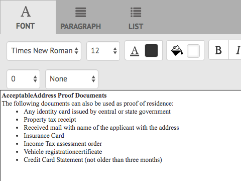
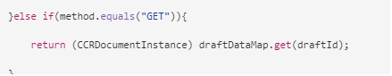

# Preparare e inviare comunicazioni interattive tramite l’interfaccia utente dell’agente {#prepare-and-send-interactive-communication-using-the-agent-ui}

L’interfaccia utente agente consente agli agenti di preparare e inviare la comunicazione interattiva al processo successivo. L’agente apporta le modifiche necessarie come consentito e invia la comunicazione interattiva a un processo successivo, ad esempio e-mail o stampa.

## Panoramica {#overview}

Dopo aver creato una comunicazione interattiva, l’agente può aprirla nell’interfaccia utente dell’agente e preparare una copia specifica per il destinatario immettendo i dati e gestendo il contenuto e gli allegati. Infine, l’agente può inviare la comunicazione interattiva a un processo successivo.

Durante la preparazione della comunicazione interattiva tramite l’interfaccia utente dell’agente, l’agente gestisce i seguenti aspetti della comunicazione interattiva nell’interfaccia utente dell’agente prima di inviarla a un processo successivo:

* **Dati**: la scheda Dati dell&#39;interfaccia utente agente visualizza tutte le variabili modificabili dall&#39;agente e le proprietà del modello dati del modulo sbloccate nella comunicazione interattiva. Queste variabili o proprietà vengono create durante la modifica o la creazione di frammenti di documento inclusi nella comunicazione interattiva. La scheda Dati include anche tutti i campi generati nel modello del canale di stampa/XDP. La scheda Dati viene visualizzata solo quando nella comunicazione interattiva sono presenti variabili, proprietà del modello dati del modulo o campi modificabili dall’agente.
* **Contenuto**: nella scheda Contenuto, l&#39;agente gestisce il contenuto, ad esempio frammenti di documento e variabili di contenuto, nella comunicazione interattiva. L’agente può apportare le modifiche nel frammento di documento come consentito durante la creazione della comunicazione interattiva nelle proprietà di tali frammenti di documento. L’agente può anche riordinare, aggiungere/rimuovere un frammento di documento e aggiungere interruzioni di pagina, se consentite.
* **Allegati**: la scheda Allegati viene visualizzata nell&#39;interfaccia utente dell&#39;agente solo se la comunicazione interattiva contiene allegati o se l&#39;agente dispone dell&#39;accesso alla libreria. L&#39;agente può o non può essere autorizzato a modificare gli allegati.

## Preparare la comunicazione interattiva tramite l’interfaccia utente dell’agente {#prepare-interactive-communication-using-the-agent-ui}

1. Selezionare **[!UICONTROL Forms]** > **[!UICONTROL Forms e documenti]**.
1. Selezionare la comunicazione interattiva appropriata e selezionare **[!UICONTROL Apri interfaccia utente agente]**.

   >[!NOTE]
   >
   >L&#39;interfaccia utente agente funziona solo se la comunicazione interattiva selezionata dispone di un canale di stampa.

   

   In base al contenuto e alle proprietà della comunicazione interattiva, l’interfaccia utente dell’agente viene visualizzata con le tre schede seguenti: Dati, Contenuto e Allegato.

   

   Procedi all’immissione dei dati, alla gestione del contenuto e alla gestione degli allegati.

### Inserisci dati {#enter-data}

1. Nella scheda Dati, immettere i dati per le variabili, le proprietà del modello di dati del modulo e i campi del modello di stampa (XDP), come richiesto. Compila tutti i campi obbligatori contrassegnati da un asterisco (&ast;) per abilitare il pulsante **Invia**.

   Seleziona un valore per un campo dati nell’anteprima della comunicazione interattiva per evidenziare il campo dati corrispondente nella scheda Dati o viceversa.

### Gestione contenuto {#manage-content}

Nella scheda Contenuto, gestisci il contenuto, ad esempio frammenti di documento e variabili di contenuto, nella comunicazione interattiva.

1. Seleziona **[!UICONTROL Contenuto]**. Viene visualizzata la scheda del contenuto della comunicazione interattiva.

   

1. Se necessario, modifica i frammenti di documento nella scheda Contenuto. Per spostare lo stato attivo sul frammento rilevante nella gerarchia del contenuto, puoi selezionare la riga o il paragrafo pertinente nell’anteprima della comunicazione interattiva oppure selezionare il frammento direttamente nella gerarchia del contenuto.

   Ad esempio, il frammento di documento con la riga &quot;Esegui un pagamento online ora ...&quot; è selezionato nell’anteprima dell’immagine seguente e lo stesso frammento di documento è stato selezionato nella scheda Contenuto.

   

   Nella scheda Contenuto o Dati, toccando Evidenzia moduli selezionati nel contenuto ( ) in alto a sinistra nell’anteprima, puoi disabilitare o abilitare la funzionalità per passare al frammento di documento quando il campo di testo, paragrafo o dati pertinente viene toccato/selezionato nell’anteprima.

   I frammenti che possono essere modificati dall&#39;agente durante la creazione della comunicazione interattiva presentano l&#39;icona Modifica contenuto selezionato ( ). Seleziona l’icona Modifica contenuto selezionato per avviare il frammento in modalità di modifica e apportarvi modifiche. Utilizza le seguenti opzioni per la formattazione e la gestione del testo:

   * [Opzioni di formattazione](#formattingtext)

      * [Copia e incolla testo formattato da altre applicazioni](#pasteformattedtext)
      * [Evidenzia parti di testo](#highlightemphasize)

   * [Caratteri speciali](#specialcharacters)
   * [Scelte rapide da tastiera](/help/forms/using/keyboard-shortcuts.md)

   Per ulteriori informazioni sulle azioni disponibili per vari frammenti di documento nell&#39;interfaccia utente dell&#39;agente, vedere [Azioni e informazioni disponibili nell&#39;interfaccia utente dell&#39;agente](#actionsagentui).

1. Per aggiungere un&#39;interruzione di pagina all&#39;output di stampa della comunicazione interattiva, posizionare il cursore nel punto in cui si desidera inserire un&#39;interruzione di pagina e selezionare Interruzione di pagina prima o Interruzione di pagina dopo ( ).

   Nella comunicazione interattiva viene inserito un segnaposto esplicito per l’interruzione di pagina. Per visualizzare in che modo un’interruzione di pagina esplicita influisce sulla comunicazione interattiva, consulta l’anteprima di stampa.

   

   Procedi alla gestione degli allegati della comunicazione interattiva.

### Gestisci allegati {#manage-attachments}

1. Seleziona **[!UICONTROL Allegato]**. Nell’interfaccia utente dell’agente vengono visualizzati gli allegati disponibili configurati durante la creazione della comunicazione interattiva.

   Per scegliere di non inviare un allegato insieme alla comunicazione interattiva, tocca l’icona di visualizzazione e puoi selezionare la croce nell’allegato per eliminarlo (se all’agente è consentito eliminare o nascondere l’allegato) dalla comunicazione interattiva. Per gli allegati specificati come obbligatori durante la creazione della comunicazione interattiva, le icone Visualizza ed Elimina sono disattivate.

   

1. Seleziona l&#39;icona Accesso libreria ( ) per accedere alla libreria dei contenuti e inserire risorse DAM come allegati.

   >[!NOTE]
   >
   >L’icona Accesso libreria è disponibile solo se l’accesso alla libreria è stato abilitato durante la creazione della comunicazione interattiva (nelle proprietà Contenitore documenti del canale di stampa).

1. Se l&#39;ordine degli allegati non è stato bloccato durante la creazione della comunicazione interattiva, è possibile riordinarli selezionando un allegato e toccando le frecce giù e su.
1. Utilizza Anteprima web e Anteprima di stampa per verificare se i due output corrispondono alle tue esigenze.

   Se le anteprime sono soddisfacenti, selezionare **[!UICONTROL Invia]** per inviare/inviare la comunicazione interattiva a un processo di post. Oppure, per apportare modifiche, esci dall’anteprima per tornare all’esecuzione delle modifiche.

## Formattazione del testo {#formattingtext}

Durante la modifica di un frammento di testo nell’interfaccia utente dell’agente, la barra degli strumenti cambia a seconda del tipo di modifiche che si sceglie di apportare: Carattere, Paragrafo o Elenco:

 

Barra degli strumenti Carattere


Barra degli strumenti Paragrafo


Barra degli strumenti Elenco

### Evidenzia/evidenzia parti di testo {#highlightemphasize}

Per evidenziare/enfatizzare parti di testo in un frammento modificabile, selezionate il testo e selezionate Colore evidenziazione.


### Incolla testo formattato {#pasteformattedtext}



### Inserisci caratteri speciali nel testo {#specialcharacters}

L’interfaccia utente dell’agente supporta 210 caratteri speciali. L&#39;amministratore può [aggiungere il supporto di caratteri speciali aggiuntivi/personalizzati tramite personalizzazione](/help/forms/using/custom-special-characters.md).

#### Consegna dell’allegato {#attachmentdelivery}

* Quando viene eseguito il rendering della comunicazione interattiva utilizzando le API lato server come PDF interattivo o non interattivo, il PDF sottoposto a rendering contiene allegati come allegati PDF.
* Quando un processo successivo associato a una comunicazione interattiva viene caricato come parte dell’interfaccia utente di invio tramite agente, gli allegati vengono passati come parametro List&lt;com.adobe.idp.Document> inAttachmentDocs.
* I flussi di lavoro del meccanismo di consegna, ad esempio e-mail e stampa, consegnano anche allegati insieme alla versione PDF della comunicazione interattiva.

## Azioni e informazioni disponibili nell’interfaccia utente dell’agente {#actionsagentui}

### Frammenti di documenti {#document-fragments}


* **Frecce su/giù**: Frecce per spostare i frammenti di documento verso l&#39;alto o verso il basso nella comunicazione interattiva.
* **Elimina**: se consentito, elimina il frammento di documento dalla comunicazione interattiva.
* **Interruzione di pagina prima di** (applicabile ai frammenti figlio dell&#39;area di destinazione): inserisce l&#39;interruzione di pagina prima del frammento del documento.
* **Rientro**: aumenta o diminuisce il rientro di un frammento di documento.
* **Interruzione di pagina dopo** (applicabile ai frammenti figlio dell&#39;area di destinazione): inserisce l&#39;interruzione di pagina dopo il frammento del documento.


* Modifica (solo frammenti di testo): apri l’editor Rich Text per modificare il frammento di documento di testo. Per ulteriori informazioni, vedere [Formattazione del testo](#formattingtext).

* Selezione (icona a forma di occhio): include\esclude il frammento di documento dalla comunicazione interattiva.
* Valori non compilati (informazioni): indica il numero di variabili non compilate nel frammento di documento.

### Elencare frammenti di documenti {#list-document-fragments}


* Inserisci riga vuota: inserisce una nuova riga vuota.
* Selezione (icona a forma di occhio): include\esclude il frammento di documento dalla comunicazione interattiva.
* Ignora punti elenco/numeri: consente di ignorare i punti elenco/la numerazione nel frammento di documento elenco.
* Valori non compilati (informazioni): indica il numero di variabili non compilate nel frammento di documento.

## Salvare le comunicazioni interattive come bozza {#save-as-draft}

Puoi utilizzare l’interfaccia utente dell’agente per salvare una o più bozze per ciascuna comunicazione interattiva e recuperare la bozza in un secondo momento, per continuare a lavorarci. Potete specificare un nome diverso per ogni bozza per identificarla.

L’Adobe consiglia di eseguire queste istruzioni in sequenza per salvare correttamente una comunicazione interattiva come bozza.

### Abilitare la funzione Salva come bozza {#before-save-as-draft}

Per impostazione predefinita, la funzione Salva come bozza non è attivata. Per abilitare la funzione, effettua le seguenti operazioni:

1. Implementare l&#39;interfaccia del provider di servizi (SPI) [ccrDocumentInstance](https://helpx.adobe.com/experience-manager/6-5/forms/javadocs/com/adobe/fd/ccm/ccr/ccrDocumentInstance/api/services/CCRDocumentInstanceService.html).

   La SPI consente di salvare nel database la versione bozza della comunicazione interattiva con un ID bozza come identificatore univoco. Queste istruzioni presuppongono una conoscenza preventiva di come creare un bundle OSGi utilizzando un progetto Maven.

   Per un esempio di implementazione SPI, vedere [Esempio di implementazione SPI ccrDocumentInstance](#sample-ccrDocumentInstance-spi).
1. Apri `http://<hostname>:<port>/ system/console/bundles` e seleziona **[!UICONTROL Installa/Aggiorna]** per caricare il bundle OSGi. Verificare che lo stato del pacchetto caricato sia **Attivo**. Riavviare il server se lo stato del pacchetto non è **Attivo**.
1. Passa a `https://'[server]:[port]'/system/console/configMgr`.
1. Selezionare **[!UICONTROL Crea configurazione corrispondenza]**.
1. Seleziona **[!UICONTROL Abilita salvataggio con CCRDocumentInstanceService]** e seleziona **[!UICONTROL Salva]**.

### Salvare una comunicazione interattiva come bozza {#save-as-draft-agent-ui}

Per salvare una comunicazione interattiva come bozza, effettua le seguenti operazioni:

1. Selezionare una comunicazione interattiva in Forms Manager e selezionare **[!UICONTROL Apri interfaccia utente agente]**.

1. Apportare le modifiche appropriate nell&#39;interfaccia utente agente e selezionare **[!UICONTROL Salva come bozza]**.

1. Specifica il nome della bozza nel campo **[!UICONTROL Name]** e seleziona **[!UICONTROL Done]**.

Dopo aver salvato la comunicazione interattiva come bozza, seleziona **[!UICONTROL Salva modifiche]** per salvare eventuali ulteriori modifiche alla bozza.

### Recuperare la bozza di una comunicazione interattiva {#retrieve-draft}

Dopo aver salvato una comunicazione interattiva come bozza, puoi recuperarla per continuare a lavorarci. Recupera la comunicazione interattiva utilizzando:

`https://server:port/aem/forms/createcorrespondence.hmtl?draftid=[draftid]`

[draftId] fa riferimento all&#39;identificatore univoco della bozza di versione che viene generato dopo il salvataggio di una comunicazione interattiva come bozza.

### Esempio di implementazione SPI ccrDocumentInstance {#sample-ccrDocumentInstance-spi}

Implementare l&#39;SPI `ccrDocumentInstance` per salvare una comunicazione interattiva come bozza. Di seguito è riportato un esempio di implementazione dell&#39;SPI `ccrDocumentInstance`.

```javascript
package Implementation;

import com.adobe.fd.ccm.ccr.ccrDocumentInstance.api.exception.CCRDocumentException;
import com.adobe.fd.ccm.ccr.ccrDocumentInstance.api.model.CCRDocumentInstance;
import com.adobe.fd.ccm.ccr.ccrDocumentInstance.api.services.CCRDocumentInstanceService;
import org.apache.commons.lang3.StringUtils;
import org.osgi.service.component.annotations.Component;
import org.slf4j.Logger;
import org.slf4j.LoggerFactory;

import java.util.*;


@Component(service = CCRDocumentInstanceService.class, immediate = true)
public class CCRDraftService implements CCRDocumentInstanceService {

    private static final Logger logger = LoggerFactory.getLogger(CCRDraftService.class);

    private HashMap<String, Object> draftDataMap = new HashMap<>();

    @Override
    public String save(CCRDocumentInstance ccrDocumentInstance) throws CCRDocumentException {
        String documentInstanceName = ccrDocumentInstance.getName();
        if (StringUtils.isNotEmpty(documentInstanceName)) {
            logger.info("Saving ccrData with name : {}", ccrDocumentInstance.getName());
            if (!CCRDocumentInstance.Status.SUBMIT.equals(ccrDocumentInstance.getStatus())) {
                ccrDocumentInstance = mySQLDataBaseServiceCRUD(ccrDocumentInstance,null, "SAVE");
            }
        } else {
            logger.error("Could not save data as draft name is empty");
        }
        return ccrDocumentInstance.getId();
    }

    @Override
    public void update(CCRDocumentInstance ccrDocumentInstance) throws CCRDocumentException {
        String documentInstanceName = ccrDocumentInstance.getName();
        if (StringUtils.isNotEmpty(documentInstanceName)) {
            logger.info("Saving ccrData with name : {}", documentInstanceName);
            mySQLDataBaseServiceCRUD(ccrDocumentInstance, ccrDocumentInstance.getId(), "UPDATE");
        } else {
            logger.error("Could not save data as draft Name is empty");
        }
    }

    @Override
    public CCRDocumentInstance get(String id) throws CCRDocumentException {
        CCRDocumentInstance cCRDocumentInstance;
        if (StringUtils.isEmpty(id)) {
            logger.error("Could not retrieve data as draftId is empty");
            cCRDocumentInstance = null;
        } else {
            cCRDocumentInstance = mySQLDataBaseServiceCRUD(null, id,"GET");
        }
        return cCRDocumentInstance;
    }

    @Override
    public List<CCRDocumentInstance> getAll(String userId, Date creationTime, Date updateTime,
                                            Map<String, Object> optionsParams) throws CCRDocumentException {
        List<CCRDocumentInstance> ccrDocumentInstancesList = new ArrayList<>();

        HashMap<String, Object> allSavedDraft = mySQLGetALLData();
        for (String key : allSavedDraft.keySet()) {
            ccrDocumentInstancesList.add((CCRDocumentInstance) allSavedDraft.get(key));
        }
        return ccrDocumentInstancesList;
    }

    //The APIs call the service in the database using the following section.
    private CCRDocumentInstance mySQLDataBaseServiceCRUD(CCRDocumentInstance ccrDocumentInstance,String draftId, String method){
        if(method.equals("SAVE")){

            String autoGenerateId = draftDataMap.size() + 1 +"";
            ccrDocumentInstance.setId(autoGenerateId);
            draftDataMap.put(autoGenerateId, ccrDocumentInstance);
            return ccrDocumentInstance;

        }else if (method.equals("UPDATE")){

            draftDataMap.put(ccrDocumentInstance.getId(), ccrDocumentInstance);
            return ccrDocumentInstance;

        }else if(method.equals("GET")){

            return (CCRDocumentInstance) draftDataMap.get(draftId);

        }
        return null;
    }

    private HashMap<String, Object> mySQLGetALLData(){
        return draftDataMap;
    }
}
```

Le operazioni `save`, `update`, `get` e `getAll` chiamano il servizio del database per salvare una comunicazione interattiva come bozza, aggiornare una comunicazione interattiva, recuperare i dati dal database e recuperare i dati per tutte le comunicazioni interattive disponibili nel database. In questo esempio viene utilizzato `mySQLDataBaseServiceCRUD` come nome del servizio di database.

Nella tabella seguente viene illustrata l&#39;implementazione SPI `ccrDocumentInstance` di esempio. Viene illustrato come le operazioni `save`, `update`, `get` e `getAll` chiamano il servizio di database nell&#39;implementazione di esempio.

<table> 
 <tbody>
 <tr>
  <td><p><strong>Operazione</strong></p></td>
  <td><p><strong>Esempi di servizi di database</strong></p></td> 
   </tr>
  <tr>
   <td><p>Puoi creare una bozza per una comunicazione interattiva o inviarla direttamente. L’API per l’operazione di salvataggio controlla se la comunicazione interattiva viene inviata come bozza e include un nome della bozza. L’API chiama quindi il servizio mySQLDataBaseServiceCRUD con Salva come metodo di input.</p></br></td>
   <td><p>Il servizio mySQLDataBaseServiceCRUD verifica il metodo Save come metodo di input e genera un ID bozza generato automaticamente e lo restituisce all'AEM. La logica per generare un ID bozza può variare in base al database.</p></br></td>
   </tr>
  <tr>
   <td><p>L’API per l’operazione di aggiornamento recupera lo stato della bozza di comunicazione interattiva e controlla se la comunicazione interattiva include un nome di bozza. L'API chiama il servizio mySQLDataBaseServiceCRUD per aggiornare tale stato nel database.</p></br></td>
   <td><p>Il servizio mySQLDataBaseServiceCRUD verifica Update come metodo di input e salva lo stato della bozza di comunicazione interattiva nel database.</br></p></td>
   </tr>
   <tr>
   <td><p>L’API per l’operazione GET controlla se la comunicazione interattiva include un ID bozza. L’API chiama quindi il servizio mySQLDataBaseServiceCRUD con Get come metodo di input per recuperare i dati per la comunicazione interattiva.</br></p></td>
   <td><p>Il servizio mySQLDataBaseServiceCRUD verifica Get come metodo di input e recupera i dati per la comunicazione interattiva in base all'ID bozza.</p></br></td>
   </tr>
   <tr>
   <td><p>L'API per l'operazione getAll chiama il servizio mySQLGetALLData per recuperare i dati per tutte le comunicazioni interattive salvate nel database.</br></p></td>
   <td><p>Il servizio mySQLGetALLData recupera i dati per tutte le comunicazioni interattive salvate nel database.</p></br></td>
   </tr>
  </tbody>
</table>

Di seguito è riportato un esempio del file `pom.xml` che fa parte dell&#39;implementazione:

```xml
<?xml version="1.0" encoding="UTF-8"?>
<project xmlns="https://maven.apache.org/POM/4.0.0"
         xmlns:xsi="https://www.w3.org/2001/XMLSchema-instance"
         xsi:schemaLocation="https://maven.apache.org/POM/4.0.0 https://maven.apache.org/xsd/maven-4.0.0.xsd">
    <modelVersion>4.0.0</modelVersion>

    <groupId>com.adobe.livecycle</groupId>
    <artifactId>draft-sample</artifactId>
    <version>2.0.0-SNAPSHOT</version>

    <name>Interact</name>
    <packaging>bundle</packaging>

    <dependencies>
        <dependency>
            <groupId>com.adobe.aemfd</groupId>
            <artifactId>aemfd-client-sdk</artifactId>
            <version>6.0.160</version>
        </dependency>
    </dependencies>


    <!-- ====================================================================== -->
    <!-- B U I L D D E F I N I T I O N -->
    <!-- ====================================================================== -->
    <build>
        <plugins>
            <plugin>
                <groupId>org.apache.felix</groupId>
                <artifactId>maven-bundle-plugin</artifactId>
                <version>3.3.0</version>
                <extensions>true</extensions>
                <executions>
                    <!--Configure extra execution of 'manifest' in process-classes phase to make sure SCR metadata is generated before unit test runs-->
                    <execution>
                        <id>scr-metadata</id>
                        <goals>
                            <goal>manifest</goal>
                        </goals>
                    </execution>
                </executions>
                <configuration>
                    <exportScr>true</exportScr>
                    <instructions>
                        <!-- Enable processing of OSGI DS component annotations -->
                        <_dsannotations>*</_dsannotations>
                        <!-- Enable processing of OSGI metatype annotations -->
                        <_metatypeannotations>*</_metatypeannotations>
                        <Bundle-SymbolicName>${project.groupId}-${project.artifactId}</Bundle-SymbolicName>
                    </instructions>
                </configuration>
            </plugin>
            <plugin>
                <groupId>org.apache.maven.plugins</groupId>
                <artifactId>maven-surefire-plugin</artifactId>
            </plugin>
            <plugin>
                <groupId>org.apache.maven.plugins</groupId>
                <artifactId>maven-compiler-plugin</artifactId>
                <configuration>
                    <source>8</source>
                    <target>8</target>
                </configuration>
            </plugin>
        </plugins>
    </build>
    <profiles>
        <profile>
            <id>autoInstall</id>
            <build>
                <plugins>
                    <plugin>
                        <groupId>org.apache.sling</groupId>
                        <artifactId>maven-sling-plugin</artifactId>
                        <executions>
                            <execution>
                                <id>install-bundle</id>
                                <phase>install</phase>
                                <goals>
                                    <goal>install</goal>
                                </goals>
                            </execution>
                        </executions>
                    </plugin>
                </plugins>
            </build>
        </profile>
    </profiles>

</project>
```

>[!NOTE]
>
>Assicurarsi di aggiornare la dipendenza `aemfd-client-sdk` alla versione 6.0.160 nel file `pom.xml`.
