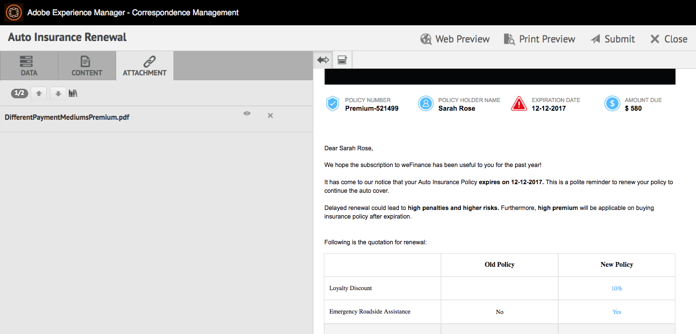
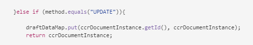

# Preparare e inviare comunicazioni interattive tramite l’interfaccia utente dell’agente {#prepare-and-send-interactive-communication-using-the-agent-ui}

L’interfaccia utente dell’agente consente agli agenti di preparare e inviare comunicazioni interattive al processo di pubblicazione. L’agente apporta le modifiche necessarie e invia la comunicazione interattiva a un processo di pubblicazione, ad esempio e-mail o stampa.

## Panoramica {#overview}

Dopo la creazione di una comunicazione interattiva, l’agente può aprire la comunicazione interattiva nell’interfaccia utente dell’agente e preparare una copia specifica per il destinatario immettendo i dati e gestendo il contenuto e gli allegati. Infine, l&#39;agente può inviare la comunicazione interattiva a un processo post.

Durante la preparazione della comunicazione interattiva tramite l’interfaccia utente dell’agente, l’agente gestisce i seguenti aspetti della comunicazione interattiva nell’interfaccia utente dell’agente prima di inviarla a un processo post:

* **Dati**: Nella scheda Dati dell’interfaccia utente dell’agente vengono visualizzate le variabili modificabili dall’agente e le proprietà del modello dati del modulo sbloccato nella comunicazione interattiva. Queste variabili/proprietà vengono create durante la modifica o la creazione di frammenti di documento inclusi nella comunicazione interattiva. La scheda Dati include anche tutti i campi generati nel modello di canale XDP/print. La scheda Dati viene visualizzata solo quando sono presenti variabili, proprietà del modello dati del modulo o campi nella comunicazione interattiva modificabili dall’agente.
* **Contenuto**: Nella scheda Contenuto , l’agente gestisce il contenuto, ad esempio frammenti di documento e variabili di contenuto, nella comunicazione interattiva. Durante la creazione della comunicazione interattiva nelle proprietà di tali frammenti di documento, l&#39;agente può apportare le modifiche desiderate nel frammento di documento. L&#39;agente può inoltre riordinare, aggiungere o rimuovere un frammento di documento e aggiungere interruzioni di pagina, se consentito.
* **Allegati**: La scheda Allegati viene visualizzata nell’interfaccia utente dell’agente solo se la comunicazione interattiva contiene allegati o se l’agente dispone dell’accesso alla libreria. L&#39;agente può o non può essere autorizzato a modificare o modificare gli allegati.

## Preparare la comunicazione interattiva tramite l’interfaccia utente dell’agente {#prepare-interactive-communication-using-the-agent-ui}

1. Seleziona **[!UICONTROL Forms]** > **[!UICONTROL Forms &amp; Documents]**.
1. Seleziona la comunicazione interattiva appropriata e tocca **[!UICONTROL Apri interfaccia utente agente]**.

   >[!NOTE]
   >
   >L’interfaccia utente dell’agente funziona solo se la comunicazione interattiva selezionata dispone di un canale di stampa.

   

   In base al contenuto e alle proprietà della comunicazione interattiva, l’interfaccia utente dell’agente viene visualizzata con le tre schede seguenti: Dati, contenuto e allegati.

   

   Procedi all’immissione dei dati, alla gestione del contenuto e alla gestione degli allegati.

### Inserisci dati {#enter-data}

1. Nella scheda Dati, immettere i dati necessari per i campi variabili, modello dati modulo e modello di stampa (XDP). Compila tutti i campi obbligatori contrassegnati da un asterisco (&amp;ast;) per abilitare il pulsante **Submit** .

   Tocca un valore del campo dati nell’anteprima Comunicazione interattiva per evidenziare il campo dati corrispondente nella scheda Dati o viceversa.

### Gestione contenuto {#manage-content}

Nella scheda Contenuto , gestisci il contenuto, ad esempio frammenti di documento e variabili di contenuto, nella comunicazione interattiva.

1. Seleziona **[!UICONTROL Contenuto]**. Viene visualizzata la scheda del contenuto della comunicazione interattiva.

   

1. Modificare i frammenti di documento, come necessario, nella scheda Contenuto. Per attivare il frammento pertinente nella gerarchia dei contenuti, tocca la riga o il paragrafo pertinente nell’anteprima Comunicazione interattiva oppure tocca il frammento direttamente nella gerarchia dei contenuti.

   Ad esempio, il frammento di documento con la riga &quot;Make a payment online now ...&quot; viene selezionato nell&#39;anteprima nell&#39;immagine seguente e lo stesso frammento di documento è stato selezionato nella scheda Contenuto.

   

   Nella scheda Contenuto o Dati, toccando Evidenzia moduli selezionati nel contenuto ( ) in alto a sinistra dell’anteprima, puoi disattivare o abilitare la funzionalità per passare al frammento di documento quando nell’anteprima viene toccato o selezionato il testo, il paragrafo o il campo dati pertinente.

   I frammenti che possono essere modificati dall’agente durante la creazione della comunicazione interattiva dispongono dell’icona Modifica contenuto selezionato ( ). Tocca l’icona Modifica contenuto selezionato per avviare il frammento in modalità di modifica e apportare le modifiche desiderate. Utilizzare le seguenti opzioni per la formattazione e la gestione del testo:

   * [Opzioni di formattazione](#formattingtext)

      * [Copia e incolla testo formattato da altre applicazioni](#pasteformattedtext)
      * [Evidenziare parti di testo](#highlightemphasize)
   * [Caratteri speciali](#specialcharacters)
   * [Scelte rapide da tastiera](/help/forms/using/keyboard-shortcuts.md)

   Per ulteriori informazioni sulle azioni disponibili per vari frammenti di documento nell&#39;interfaccia utente dell&#39;agente, vedere [Azioni e informazioni disponibili nell&#39;interfaccia utente dell&#39;agente](#actionsagentui).

1. Per aggiungere un’interruzione di pagina all’output di stampa della comunicazione interattiva, posizionare il cursore nel punto in cui si desidera inserire un’interruzione di pagina e selezionare Interruzione di pagina prima o Interruzione di pagina dopo ( ).

   Nella comunicazione interattiva viene inserito un segnaposto di interruzione di pagina esplicito. Per vedere in che modo un’interruzione di pagina esplicita influisce sulla comunicazione interattiva, vedere l’anteprima di stampa.

   

   Procedere alla gestione degli allegati della comunicazione interattiva.

### Gestisci allegati {#manage-attachments}

1. Selezionare **[!UICONTROL Allegato]**. Durante la creazione della comunicazione interattiva, l’interfaccia utente dell’agente visualizza gli allegati disponibili come configurati.

   È possibile scegliere di non inviare un allegato insieme alla comunicazione interattiva toccando l&#39;icona di visualizzazione e toccando la croce nell&#39;allegato per eliminarlo (se l&#39;agente è autorizzato a eliminare o nascondere l&#39;allegato) dalla comunicazione interattiva. Per gli allegati specificati come obbligatori durante la creazione della comunicazione interattiva, le icone Visualizza ed Elimina sono disabilitate.

   

1. Tocca l’icona Accesso libreria ( ) per accedere alla libreria dei contenuti e inserire risorse DAM come allegati.

   >[!NOTE]
   >
   >L&#39;icona Accesso libreria è disponibile solo se l&#39;accesso alla libreria è stato abilitato durante la creazione della comunicazione interattiva (nelle proprietà Contenitore documento del canale Stampa).

1. Se l’ordine degli allegati non è stato bloccato durante la creazione della comunicazione interattiva, è possibile riordinare gli allegati selezionando un allegato e toccando le frecce verso il basso e verso l’alto.
1. Utilizza Anteprima web e Anteprima di stampa per vedere se i due output sono conformi alle tue esigenze.

   Se trovi le anteprime soddisfacenti, tocca **[!UICONTROL Invia]** per inviare/inviare la comunicazione interattiva a un processo post. Oppure per apportare modifiche, esci dall’anteprima per tornare alle modifiche apportate.

## Formattazione del testo {#formattingtext}

Durante la modifica di un frammento di testo nell’interfaccia utente dell’agente, la barra degli strumenti cambia a seconda del tipo di modifica che scegli di apportare: Font, Paragrafo o Elenco:

 

Barra dei font


Barra degli strumenti Paragrafo


Barra degli strumenti dell’elenco

### Evidenziare/evidenziare parti di testo {#highlightemphasize}

Per evidenziare\enfatizzare parti di testo in un frammento modificabile, selezionarlo e toccare Evidenzia colore.


### Incolla il testo formattato {#pasteformattedtext}


### Inserisci caratteri speciali nel testo {#specialcharacters}

L&#39;interfaccia utente dell&#39;agente ha integrato il supporto per 210 caratteri speciali. L&#39;amministratore può [aggiungere supporto per caratteri speciali più/personalizzati tramite personalizzazione](/help/forms/using/custom-special-characters.md).

#### Consegna degli allegati {#attachmentdelivery}

* Quando viene eseguito il rendering della comunicazione interattiva utilizzando API lato server come PDF interattivo o non interattivo, il PDF di cui è stato effettuato il rendering contiene allegati come allegati PDF.
* Quando un processo post associato a una comunicazione interattiva viene caricato come parte dell&#39;interfaccia utente Invia tramite agente, gli allegati vengono passati come parametro List&lt;com.adobe.idp.Document> inAttachmentDocs .
* I flussi di lavoro che utilizzano i meccanismi di distribuzione, ad esempio e-mail e stampa, distribuiscono anche allegati insieme alla versione PDF della comunicazione interattiva.

## Azioni e informazioni disponibili nell’interfaccia utente dell’agente {#actionsagentui}

### Frammenti di documento {#document-fragments}


* **Frecce** Su/Giù: Frecce per spostare i frammenti di documento verso l’alto o il basso nella comunicazione interattiva.
* **Elimina**: Se consentito, elimina il frammento di documento dalla comunicazione interattiva.
* **Interruzione di pagina prima di**  (applicabile per frammenti figlio dell’area di destinazione): Inserisce un’interruzione di pagina prima del frammento del documento.
* **Rientro**: Aumenta o diminuisce il rientro di un frammento di documento.
* **Interruzione di pagina dopo**  (applicabile per frammenti figlio dell’area di destinazione): Inserisce un’interruzione di pagina dopo il frammento del documento.


* Modifica (solo frammenti di testo): Apri l’editor Rich Text per modificare il frammento di documento di testo. Per ulteriori informazioni, vedere [Formattazione del testo](#formattingtext).

* Selezione (icona occhio): Include\esclude frammenti di documento dalla comunicazione interattiva.
* Valori non compilati (informazioni): Indica il numero di variabili non compilate nel frammento di documento.

### Elencare frammenti di documento {#list-document-fragments}


* Inserisci linea vuota: Inserisce una nuova riga vuota.
* Selezione (icona occhio): Include\esclude frammenti di documento dalla comunicazione interattiva.
* Ignora punti/numeri: Consente di saltare elenchi puntati/numerati nel frammento di documento elenco.
* Valori non compilati (informazioni): Indica il numero di variabili non compilate nel frammento di documento.

## Salvare le comunicazioni interattive come bozza {#save-as-draft}

Puoi utilizzare l’interfaccia utente dell’agente per salvare una o più bozze per ogni comunicazione interattiva e recuperare la bozza in un secondo momento per continuare a lavorarci. Potete specificare un nome diverso per ogni bozza da identificare.

Adobe consiglia di eseguire queste istruzioni in sequenza per salvare correttamente una comunicazione interattiva come bozza.

### Abilita la funzione Salva come bozza {#before-save-as-draft}

Per impostazione predefinita, la funzione Salva come bozza non è abilitata. Esegui i seguenti passaggi per abilitare la funzione:

1. Implementa l&#39; [ccrDocumentInstance](https://helpx.adobe.com/experience-manager/6-5/forms/javadocs/com/adobe/fd/ccm/ccr/ccrDocumentInstance/api/services/CCRDocumentInstanceService.html) Service Provider Interface (SPI).

   L’SPI consente di salvare nel database la versione bozza della comunicazione interattiva con un ID bozza come identificatore univoco. Queste istruzioni presuppongono di avere conoscenze precedenti su come creare un bundle OSGi utilizzando un progetto Maven.

   Per un esempio di implementazione SPI, consulta [Esempio di implementazione ccrDocumentInstance SPI](#sample-ccrDocumentInstance-spi).
1. Apri `http://<hostname>:<port>/ system/console/bundles` e tocca **[!UICONTROL Installa/Aggiorna]** per caricare il bundle OSGi. Verifica che lo stato del pacchetto caricato sia visualizzato come **Attivo**. Riavvia il server se lo stato del pacchetto non viene visualizzato come **Attivo**.
1. Passa a `https://'[server]:[port]'/system/console/configMgr`.
1. Tocca **[!UICONTROL Crea configurazione corrispondenza]**.
1. Seleziona **[!UICONTROL Abilita il salvataggio utilizzando CCRDocumentInstanceService]** e tocca **[!UICONTROL Salva]**.

### Salvare una comunicazione interattiva come bozza {#save-as-draft-agent-ui}

Esegui i seguenti passaggi per salvare una comunicazione interattiva come bozza:

1. Seleziona una comunicazione interattiva in Forms Manager e tocca **[!UICONTROL Apri interfaccia utente agente]**.

1. Apporta le modifiche necessarie nell&#39;interfaccia utente dell&#39;agente e tocca **[!UICONTROL Salva come bozza]**.

1. Specifica il nome della bozza nel campo **[!UICONTROL Nome]** e tocca **[!UICONTROL Fine]**.

Una volta salvata la comunicazione interattiva come bozza, tocca **[!UICONTROL Salva modifiche]** per salvare eventuali ulteriori modifiche alla bozza.

### Recupera la bozza di una comunicazione interattiva {#retrieve-draft}

Dopo aver salvato una comunicazione interattiva come bozza, puoi recuperarla per continuare a lavorarci. Recupera la comunicazione interattiva utilizzando:

`https://server:port/aem/forms/createcorrespondence.hmtl?draftid=[draftid]`

[] per progetto si intende l’identificatore univoco della bozza di versione che viene generato dopo il salvataggio di una comunicazione interattiva come bozza.

### Esempio di implementazione SPI di ccrDocumentInstance {#sample-ccrDocumentInstance-spi}

Implementa l’ `ccrDocumentInstance` SPI per salvare una comunicazione interattiva come bozza. Di seguito è riportato un esempio di implementazione dell’ `ccrDocumentInstance` SPI .

```javascript
package Implementation;

import com.adobe.fd.ccm.ccr.ccrDocumentInstance.api.exception.CCRDocumentException;
import com.adobe.fd.ccm.ccr.ccrDocumentInstance.api.model.CCRDocumentInstance;
import com.adobe.fd.ccm.ccr.ccrDocumentInstance.api.services.CCRDocumentInstanceService;
import org.apache.commons.lang3.StringUtils;
import org.osgi.service.component.annotations.Component;
import org.slf4j.Logger;
import org.slf4j.LoggerFactory;

import java.util.*;


@Component(service = CCRDocumentInstanceService.class, immediate = true)
public class CCRDraftService implements CCRDocumentInstanceService {

    private static final Logger logger = LoggerFactory.getLogger(CCRDraftService.class);

    private HashMap<String, Object> draftDataMap = new HashMap<>();

    @Override
    public String save(CCRDocumentInstance ccrDocumentInstance) throws CCRDocumentException {
        String documentInstanceName = ccrDocumentInstance.getName();
        if (StringUtils.isNotEmpty(documentInstanceName)) {
            logger.info("Saving ccrData with name : {}", ccrDocumentInstance.getName());
            if (!CCRDocumentInstance.Status.SUBMIT.equals(ccrDocumentInstance.getStatus())) {
                ccrDocumentInstance = mySQLDataBaseServiceCRUD(ccrDocumentInstance,null, "SAVE");
            }
        } else {
            logger.error("Could not save data as draft name is empty");
        }
        return ccrDocumentInstance.getId();
    }

    @Override
    public void update(CCRDocumentInstance ccrDocumentInstance) throws CCRDocumentException {
        String documentInstanceName = ccrDocumentInstance.getName();
        if (StringUtils.isNotEmpty(documentInstanceName)) {
            logger.info("Saving ccrData with name : {}", documentInstanceName);
            mySQLDataBaseServiceCRUD(ccrDocumentInstance, ccrDocumentInstance.getId(), "UPDATE");
        } else {
            logger.error("Could not save data as draft Name is empty");
        }
    }

    @Override
    public CCRDocumentInstance get(String id) throws CCRDocumentException {
        CCRDocumentInstance cCRDocumentInstance;
        if (StringUtils.isEmpty(id)) {
            logger.error("Could not retrieve data as draftId is empty");
            cCRDocumentInstance = null;
        } else {
            cCRDocumentInstance = mySQLDataBaseServiceCRUD(null, id,"GET");
        }
        return cCRDocumentInstance;
    }

    @Override
    public List<CCRDocumentInstance> getAll(String userId, Date creationTime, Date updateTime,
                                            Map<String, Object> optionsParams) throws CCRDocumentException {
        List<CCRDocumentInstance> ccrDocumentInstancesList = new ArrayList<>();

        HashMap<String, Object> allSavedDraft = mySQLGetALLData();
        for (String key : allSavedDraft.keySet()) {
            ccrDocumentInstancesList.add((CCRDocumentInstance) allSavedDraft.get(key));
        }
        return ccrDocumentInstancesList;
    }

    //The APIs call the service in the database using the following section.
    private CCRDocumentInstance mySQLDataBaseServiceCRUD(CCRDocumentInstance ccrDocumentInstance,String draftId, String method){
        if(method.equals("SAVE")){

            String autoGenerateId = draftDataMap.size() + 1 +"";
            ccrDocumentInstance.setId(autoGenerateId);
            draftDataMap.put(autoGenerateId, ccrDocumentInstance);
            return ccrDocumentInstance;

        }else if (method.equals("UPDATE")){

            draftDataMap.put(ccrDocumentInstance.getId(), ccrDocumentInstance);
            return ccrDocumentInstance;

        }else if(method.equals("GET")){

            return (CCRDocumentInstance) draftDataMap.get(draftId);

        }
        return null;
    }

    private HashMap<String, Object> mySQLGetALLData(){
        return draftDataMap;
    }
}
```

Le operazioni `save`, `update`, `get` e `getAll` richiamano il servizio di database per salvare una comunicazione interattiva come bozza, aggiornare una comunicazione interattiva, recuperare i dati dal database e recuperare i dati per tutte le comunicazioni interattive disponibili nel database. Questo esempio utilizza `mySQLDataBaseServiceCRUD` come nome del servizio di database.

Nella tabella seguente viene illustrato l’implementazione SPI di esempio `ccrDocumentInstance`. Viene illustrato come le operazioni `save`, `update`, `get` e `getAll` chiamano il servizio di database nell&#39;implementazione di esempio.

<table> 
 <tbody>
 <tr>
  <td><p><strong>Operazione</strong></p></td>
  <td><p><strong>Esempi di servizi di database</strong></p></td> 
   </tr>
  <tr>
   <td><p>È possibile creare una bozza per una comunicazione interattiva o inviarla direttamente. L’API per l’operazione di salvataggio verifica se la comunicazione interattiva viene inviata come bozza e include un nome in bozza. L’API chiama quindi il servizio mySQLDataBaseServiceCRUD con Salva come metodo di input.</p></br></br>[#$sd1_sf1_dp9]</td>
   <td><p>Il servizio mySQLDataBaseServiceCRUD verifica il metodo Save come metodo di input e genera un ID bozza generato automaticamente e lo restituisce a AEM. La logica per generare una bozza di ID può variare in base al database.</p></br></br>[#$sd1_sf1_dp13]</td>
   </tr>
  <tr>
   <td><p>L’API per l’operazione di aggiornamento recupera lo stato della bozza di comunicazione interattiva e controlla se la comunicazione interattiva include un nome in bozza. L'API chiama il servizio mySQLDataBaseServiceCRUD per aggiornare tale stato nel database.</p></br></br>[#$sd1_sf1_dp17]</td>
   <td><p>Il servizio mySQLDataBaseServiceCRUD verifica l'aggiornamento come metodo di input e salva lo stato della bozza di comunicazione interattiva nel database.</br></p></td>
   </tr>
   <tr>
   <td><p>L’API per l’operazione get controlla se la comunicazione interattiva include una bozza di ID. L’API chiama quindi il servizio mySQLDataBaseServiceCRUD con Get come metodo di input per recuperare i dati per la comunicazione interattiva.</br></p></td>
   <td><p>Il servizio mySQLDataBaseServiceCRUD verifica Get come metodo di input e recupera i dati per la comunicazione interattiva in base all'ID bozza.</p></br></br>[#$sd1_sf1_dp29]</td>
   </tr>
   <tr>
   <td><p>L'API per l'operazione getAll chiama il servizio mySQLGetALLData per recuperare i dati per tutte le comunicazioni interattive salvate nel database.</br></p></td>
   <td><p>Il servizio mySQLGetALLData recupera i dati per tutte le comunicazioni interattive salvate nel database.</p></br></br>[#$sd1_sf1_dp37]</td>
   </tr>
  </tbody>
</table>

Di seguito è riportato un esempio del file `pom.xml` che fa parte dell&#39;implementazione:

```xml
<?xml version="1.0" encoding="UTF-8"?>
<project xmlns="http://maven.apache.org/POM/4.0.0"
         xmlns:xsi="http://www.w3.org/2001/XMLSchema-instance"
         xsi:schemaLocation="http://maven.apache.org/POM/4.0.0 http://maven.apache.org/xsd/maven-4.0.0.xsd">
    <modelVersion>4.0.0</modelVersion>

    <groupId>com.adobe.livecycle</groupId>
    <artifactId>draft-sample</artifactId>
    <version>2.0.0-SNAPSHOT</version>

    <name>Interact</name>
    <packaging>bundle</packaging>

    <dependencies>
        <dependency>
            <groupId>com.adobe.aemfd</groupId>
            <artifactId>aemfd-client-sdk</artifactId>
            <version>6.0.160</version>
        </dependency>
    </dependencies>


    <!-- ====================================================================== -->
    <!-- B U I L D D E F I N I T I O N -->
    <!-- ====================================================================== -->
    <build>
        <plugins>
            <plugin>
                <groupId>org.apache.felix</groupId>
                <artifactId>maven-bundle-plugin</artifactId>
                <version>3.3.0</version>
                <extensions>true</extensions>
                <executions>
                    <!--Configure extra execution of 'manifest' in process-classes phase to make sure SCR metadata is generated before unit test runs-->
                    <execution>
                        <id>scr-metadata</id>
                        <goals>
                            <goal>manifest</goal>
                        </goals>
                    </execution>
                </executions>
                <configuration>
                    <exportScr>true</exportScr>
                    <instructions>
                        <!-- Enable processing of OSGI DS component annotations -->
                        <_dsannotations>*</_dsannotations>
                        <!-- Enable processing of OSGI metatype annotations -->
                        <_metatypeannotations>*</_metatypeannotations>
                        <Bundle-SymbolicName>${project.groupId}-${project.artifactId}</Bundle-SymbolicName>
                    </instructions>
                </configuration>
            </plugin>
            <plugin>
                <groupId>org.apache.maven.plugins</groupId>
                <artifactId>maven-surefire-plugin</artifactId>
            </plugin>
            <plugin>
                <groupId>org.apache.maven.plugins</groupId>
                <artifactId>maven-compiler-plugin</artifactId>
                <configuration>
                    <source>8</source>
                    <target>8</target>
                </configuration>
            </plugin>
        </plugins>
    </build>
    <profiles>
        <profile>
            <id>autoInstall</id>
            <build>
                <plugins>
                    <plugin>
                        <groupId>org.apache.sling</groupId>
                        <artifactId>maven-sling-plugin</artifactId>
                        <executions>
                            <execution>
                                <id>install-bundle</id>
                                <phase>install</phase>
                                <goals>
                                    <goal>install</goal>
                                </goals>
                            </execution>
                        </executions>
                    </plugin>
                </plugins>
            </build>
        </profile>
    </profiles>

</project>
```

>[!NOTE]
>
>Assicurati di aggiornare la dipendenza `aemfd-client-sdk` alla versione 6.0.160 nel file `pom.xml`.
