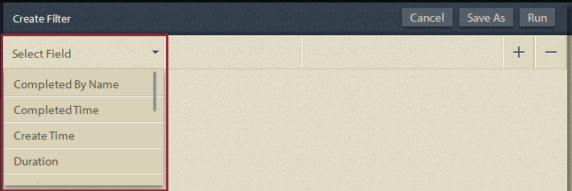

# Query ad hoc in Report di processo{#ad-hoc-queries-in-process-reporting}

## Query ad hoc in Process Reporting {#ad-hoc-queries-in-process-reporting-1}

Le query ad hoc in Process Reporting consentono di creare query personalizzate che è possibile utilizzare per cercare i dettagli dei processi e delle attività delle istanze di processo di AEM Forms definite nell&#39;ambiente AEM Forms.

È inoltre possibile definire query ad hoc utilizzando i filtri delle proprietà dei processi e delle attività. Questi filtri possono quindi essere salvati e utilizzati per eseguire i rapporti in un secondo momento.

[**Ricerca processi**](/help/forms/using/process-reporting/adhoc-queries-in-process-reporting.md#p-process-task-search-p): cerca le istanze del processo con un filtro di ricerca definito dall’utente in base agli attributi del processo.

[**Dettagli processo**](/help/forms/using/process-reporting/adhoc-queries-in-process-reporting.md#p-process-task-details-p): per visualizzare i dettagli di un’istanza del processo, specifica l’ID processo.

**Ricerca attività**: cerca le istanze delle attività con un filtro di ricerca definito dall’utente in base agli attributi delle attività.

**Dettagli Attività**: per visualizzare i dettagli di un’istanza dell’attività, specifica l’ID dell’attività.

### Processi e attività {#processes-and-tasks}

I passaggi da seguire per creare filtri ed eseguire query per i dettagli del processo sono gli stessi delle attività.

Ciò significa che le interfacce utente per la Ricerca processo e la Ricerca attività differiscono solo nei campi in base ai quali è possibile eseguire la ricerca e nei campi restituiti nei risultati della ricerca. Questo accade semplicemente perché, mentre molti campi sono identici, alcuni campi sono specifici dei processi e alcuni campi sono specifici delle attività.

Questo articolo descrive le sezioni Ricerca processo/task e Dettagli processo/task. Nei luoghi opportuni, saranno espressamente segnalate le eventuali differenze specifiche.

## Ricerca processo/attività {#process-task-search}

È possibile utilizzare la funzione Ricerca processo/task per definire i filtri per l&#39;esecuzione di query sulle istanze di processo/task.

### Per creare una query di ricerca di processi/attività {#to-create-a-process-task-search-query}

1. Per visualizzare le query di ricerca di processi/attività salvate o per creare una query, fare clic su **Query ad hoc** e quindi fare clic su **Ricerca processo/attività**.

   

   Il **I miei filtri** viene visualizzato a destra della visualizzazione struttura.

   In **I miei filtri** , puoi creare nuove query ad hoc e fare clic su per eseguire le query salvate in precedenza.

   

1. Per eseguire una query esistente, fai clic su di essa in **I miei filtri** pannello.
1. Per creare una query, fai clic su **Aggiungi** (+).

   Il **Crea filtro** viene visualizzato il pannello.

   

   Una query è costituita da uno o più filtri di query. Per creare un filtro, aggiungi una riga di filtro alla query. Per impostazione predefinita, alla query viene aggiunta una riga di filtro.

   **Per definire un filtro**

   1. Seleziona un campo.

      

      >[!NOTE]
      >
      >L’elenco dei campi contiene i campi specifici del processo/attività di AEM Forms.

   1. Seleziona una condizione.

      

      >[!NOTE]
      >
      >Le condizioni elencate dipendono dall’attributo selezionato per il filtro.

   1. Immetti un valore.

      

   1. Per aggiungere un altro filtro alla query, fai clic su **Aggiungi (+)** a destra della riga del filtro.

      Per rimuovere un filtro dalla query, fai clic su **Elimina (-)** a destra della riga del filtro.

      

Dopo aver creato una query, utilizza le opzioni nell’angolo superiore destro della **Crea filtro** pannello per:

* **Annulla**: annulla le modifiche e torna a **I miei filtri** pannello.
* **Esegui**: esegui la query corrente per visualizzare e/o verificare i risultati. In questo caso, non è necessario salvare la query prima di eseguirla. Puoi verificare i risultati, apportare modifiche se necessario e quindi salvare la query quando l’output è soddisfacente.
* **Salva**: salva il filtro. Il filtro può quindi essere visualizzato ed eseguito dal **I miei filtri** pannello.

### Opzioni nel pannello Filtri {#options-in-my-filters-panel}

Utilizza le opzioni in **I miei filtri** pannello a **Aggiungi** , **Modifica** , o **Elimina** una query ad hoc.

### Per eseguire una query di ricerca {#to-execute-a-search-query}

1. Per eseguire una query, fai clic sul filtro in **I miei filtri** o fai clic sul pulsante **Esegui** se si sta creando o modificando un filtro.
1. I risultati della query vengono visualizzati nel **Report** pannello del **Reporting sui processi** finestra.

   

   Puoi impaginare i risultati della ricerca con l’aiuto del pannello di impaginazione visualizzato nella parte inferiore del rapporto.

   

   In **Visualizzazione** scegliere il numero di risultati da visualizzare per pagina.

   In **Pagina** , immettere un numero di pagina per passare direttamente a tale pagina.

1. In un risultato di Ricerca processo vengono visualizzati i campi riportati di seguito.

   * **ID processo**: ID del processo. Il campo è un collegamento ipertestuale. Se fai clic su un ID processo in questo campo, vieni reindirizzato al **[!UICONTROL Dettagli processo]** per il processo.
   * **Iniziatore**: utente AEM Forms che ha avviato l’istanza del processo
   * **Ora di creazione**: data e ora di avvio dell’istanza del processo
   * **Ora completamento**: data e ora di completamento dell’istanza del processo
   * **Durata**: durata dall’inizio al completamento dell’istanza del processo
   * **Stato**: stato corrente dell’istanza del processo.

   Per impostazione predefinita, il risultato è ordinato in base all&#39;ID processo. Tuttavia, per ordinare il risultato in base a uno dei campi, fare clic sul titolo del campo.

   Poiché l’ordinamento è un’operazione di attivazione/disattivazione, fai clic su un’intestazione di colonna per ordinare il risultato in ordine crescente, quindi fai di nuovo clic su di esso per ordinare in modo decrescente.

   Analogamente, in un risultato di Ricerca attività vengono visualizzati i campi riportati di seguito.

   * **ID Attività**: ID dell’attività. Il campo è un collegamento ipertestuale. Se si fa clic su un ID attività in questo campo, si viene reindirizzati al **[!UICONTROL Dettagli Attività]** per l&#39;attività.
   * **Iniziatore**: utente AEM Forms che ha avviato l’istanza del processo
   * **Ora di creazione**: data e ora di avvio dell’istanza del processo
   * **Ora completamento**: data e ora di completamento dell’istanza del processo
   * **Durata**: durata dall’inizio al completamento dell’istanza del processo
   * **Stato**: stato corrente dell’istanza del processo.

   Per impostazione predefinita, il risultato è ordinato in base all’ID attività. Tuttavia, per ordinare il risultato in base a uno dei campi, fare clic sul titolo del campo. Il risultato viene ordinato in base alla colonna indicata da una freccia scura accanto all&#39;intestazione della colonna.

   Poiché l’ordinamento è un’operazione di attivazione/disattivazione, fai clic su un’intestazione di campo per ordinare il risultato in modo crescente e poi fai di nuovo clic su di esso per ordinare in modo decrescente. L’ordinamento corrente (crescente/decrescente) è indicato dalla direzione della freccia scura accanto all’intestazione della colonna.

   

1. Fai clic sul pulsante della barra  in alto a sinistra per comprimere la **I miei filtri** ed espande lo spazio disponibile per **Report** pannello.
1. Utilizza le opzioni nell’angolo superiore destro del pannello **Report **per eseguire operazioni sui risultati della query.

   * **Aggiorna**: aggiorna il rapporto con i dati più recenti presenti nell’archiviazione

   * **Esporta in CSV**: esporta i dati del rapporto in un file separato da virgole.

   >[!NOTE]
   >
   >Quando si esporta un rapporto, l’intero risultato della ricerca viene esportato in un file CSV e non solo nella pagina corrente

## Dettagli processo/attività {#process-task-details}

Utilizzi il **Dettagli processo** per visualizzare i dettagli di un processo specifico.

Analogamente, si utilizza **Dettagli Attività** per visualizzare i dettagli di un&#39;attività specifica.

### Per visualizzare i dettagli del processo/task {#to-view-process-task-details}

Puoi visualizzare i dettagli di un processo/attività AEM Forms specifico:

* **Da un risultato di ricerca processo/attività**
* **Inserendo l&#39;ID processo/task nel pannello Dettagli processo/task**

#### Da un risultato di ricerca processo/attività {#from-a-process-task-search-result}

1. Eseguire una ricerca di processo/attività. Per ulteriori informazioni, consulta [Per eseguire una query di ricerca processo](#to-execute-a-search-query).

   Si noti che gli ID processo visualizzati restituiti nel risultato sono collegamenti ipertestuali.

   

1. Fare clic su un ID processo nell&#39;elenco per visualizzare i dettagli del processo in **Dettagli processo** pannello.

   Il **Dettagli processo/attività** il risultato della query visualizza i dettagli delle attività/maschere contenute nel processo/task.

   Per impostazione predefinita, il risultato è ordinato in base all&#39;ID attività/modulo. Tuttavia, per ordinare il risultato in base a uno dei campi, fare clic sul titolo del campo. La colonna in base alla quale viene ordinato il risultato è indicata da una freccia scura accanto all&#39;intestazione della colonna.

   Poiché l’ordinamento è un’operazione di attivazione/disattivazione, fai clic su un’intestazione di campo per ordinare il risultato in modo crescente e poi fai di nuovo clic su di esso per ordinare in modo decrescente. L’ordinamento corrente (crescente/decrescente) è indicato dalla direzione della freccia scura accanto all’intestazione della colonna.

   **Risultato dettagli processo**

   

   **Pannello a sinistra:** Visualizza i dettagli seguenti del processo selezionato:

   * Nome del processo
   * Data e ora di creazione processo
   * Data e ora completamento processo
   * Durata del processo
   * Stato processo
   * Iniziatore processo

   **Pannello superiore destro:** Visualizza i dettagli seguenti delle attività che compongono il processo selezionato:

   * ID Attività
   * Nome attività
   * Proprietario attività
   * Data e ora di creazione attività
   * Data e ora di aggiornamento attività
   * Data e ora di completamento attività
   * Durata attività
   * Stato attività

   **Pannello inferiore destro:** Visualizza i dettagli seguenti della cronologia del processo selezionato:

   * Nome processo
   * Iniziatore processo
   * Elabora data/ora di aggiornamento
   * Data e ora completamento processo
   * Stato processo

   **Risultato dettagli attività**

   

   **Pannello a sinistra:** Visualizza i dettagli seguenti dell&#39;attività selezionata:

   * Nome attività
   * ID del processo a cui appartiene questa attività
   * Descrizione attività
   * Data e ora di creazione attività
   * Data e ora di completamento attività
   * Durata attività
   * Stato attività
   * Percorso dell&#39;attività selezionato

   **Pannello superiore destro:** Visualizza i dettagli seguenti dei moduli che compongono l&#39;attività selezionata:

   * ID modulo
   * Data e ora di creazione modulo
   * Data e ora di aggiornamento modulo
   * Url modello modulo

   **Pannello inferiore destro:** Visualizza i dettagli seguenti della cronologia del processo dell&#39;attività selezionata:

   * Tipo di assegnazione attività
   * Proprietario attività
   * Data e ora di creazione assegnazione attività
   * Data e ora di aggiornamento attività

1. Clic **Torna a Ricerca processi/attività** per tornare al risultato della ricerca da cui sono stati espansi i dettagli del processo/attività.

   

   Tuttavia, se i dettagli del processo/attività sono stati trovati immettendo un ID processo/attività specifico, facendo clic su Torna a processo/ricerca attività si ritorna a **Ricerca processo/attività**, senza visualizzare alcun risultato di ricerca.

#### Inserendo l&#39;ID processo/task nel pannello Dettagli processo/task {#by-entering-the-process-task-id-in-the-process-task-details-panel-br}

1. Vai a **Dettagli processo/attività** pannello.

   

1. Nella casella di testo ID processo/task immettere l&#39;ID processo/task.

   

   I campi nella sezione **Dettagli processo/attività** i risultati della query sono campi specifici di un processo/attività AEM Forms.

   Per un processo, il risultato della query visualizza i dettagli delle attività contenute nel processo.

   Per un&#39;attività, il risultato della query visualizza i dettagli delle maschere contenute nell&#39;attività.
