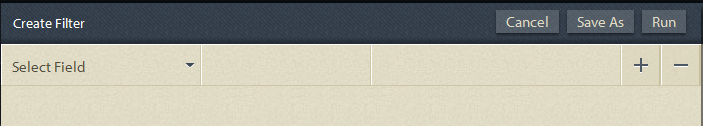

# Query ad hoc nel reporting dei processi{#ad-hoc-queries-in-process-reporting}

## Query ad hoc in Process Reporting {#ad-hoc-queries-in-process-reporting-1}

Le query ad hoc in Process Reporting consentono di creare query personalizzate da utilizzare per cercare i dettagli dei processi e delle attività delle istanze di processo AEM Forms definite nel proprio ambiente AEM Forms.

È inoltre possibile definire query ad hoc utilizzando i filtri di proprietà di processo e attività. Questi filtri possono quindi essere salvati e utilizzati per eseguire i rapporti in un secondo momento.

[**Ricerca dei processi**](/help/forms/using/process-reporting/adhoc-queries-in-process-reporting.md#p-process-task-search-p): Cerca le istanze di processo con un filtro di ricerca definito dall’utente in base agli attributi di processo.

[**Dettagli del processo**](/help/forms/using/process-reporting/adhoc-queries-in-process-reporting.md#p-process-task-details-p): Visualizzare i dettagli di un&#39;istanza di processo specificando l&#39;ID del processo.

**Ricerca attività**: Cercare le istanze delle attività con un filtro di ricerca definito dall&#39;utente in base agli attributi delle attività.

**Dettagli attività**: Visualizzare i dettagli di un&#39;istanza di attività specificando l&#39;ID attività.

### Processi e attività {#processes-and-tasks}

I passaggi da seguire per creare filtri ed eseguire query per i dettagli del processo sono gli stessi che per le attività.

Ciò significa che le interfacce utente per Ricerca processi e Ricerca attività differiscono solo nei campi che è possibile cercare e nei campi restituiti nei risultati della ricerca. Questo semplicemente perché, mentre molti campi sono identici, alcuni campi sono specifici ai processi e alcuni campi sono specifici alle attività.

Questo articolo descrive le sezioni Processo/Ricerca attività e Dettagli processo/attività . Nei luoghi appropriati, le eventuali differenze specifiche saranno specificamente richiamate.

## Ricerca di processi/attività {#process-task-search}

Utilizza Ricerca processi/task per definire i filtri per le istanze di processi/task di query.

### Per creare una query di ricerca di processi/task {#to-create-a-process-task-search-query}

1. Per visualizzare le query di ricerca di processi/task salvate o per creare una query, fare clic su **Query ad hoc** quindi fai clic su **Ricerca di processi/attività**.

   

   La **Filtri personali** viene visualizzato a destra della vista ad albero.

   In **Filtri personali** è possibile creare nuove query ad-hoc e fare clic su per eseguire query salvate in precedenza.

   

1. Per eseguire una query esistente, è sufficiente fare clic sulla query nel **Filtri personali** pannello.
1. Per creare una query, fai clic su **Aggiungi** (+).

   La **Crea filtro** viene visualizzato il pannello .

   

   Una query è costituita da uno o più filtri di query. Per creare un filtro, aggiungi una riga di filtro alla query. Per impostazione predefinita, alla query viene aggiunta una riga di filtro.

   **Per definire un filtro**

   1. Seleziona un campo.

      

      >[!NOTE]
      >
      >L’elenco dei campi contiene i campi specifici del processo/attività di AEM Forms.

   1. Seleziona una condizione.

      

      >[!NOTE]
      >
      >Le condizioni elencate dipendono dall’attributo selezionato per il filtro.

   1. Immetti un valore.

      

   1. Per aggiungere un altro filtro alla query, fai clic su **Aggiungi (+)** a destra della riga del filtro.

      Per rimuovere un filtro dalla query, fai clic su **Elimina (-)** a destra della riga del filtro.

      

Dopo aver creato una query, utilizza le opzioni nell’angolo superiore destro del **Crea filtro** pannello a:

* **Annulla**: Annulla le modifiche e torna al **Filtri personali** pannello.
* **Esegui**: Esegui la query corrente per visualizzare e/o verificare i risultati. In questo caso, non è necessario salvare la query prima di eseguire la query. Puoi verificare i risultati, apportare modifiche se necessario e quindi salvare la query quando sei soddisfatto dell’output.
* **Salva**: Salva il filtro. Il filtro può quindi essere visualizzato ed eseguito da **Filtri personali** pannello.

### Opzioni nel pannello Filtri personali {#options-in-my-filters-panel}

Utilizza le opzioni in **Filtri personali** pannello a **Aggiungi** , **Modifica** oppure **Elimina** una query ad-hoc.

### Per eseguire una query di ricerca {#to-execute-a-search-query}

1. Per eseguire una query, fai clic sul filtro nel **Filtri personali** oppure fai clic sul pulsante **Esegui** se stai creando o modificando un filtro.
1. I risultati della query vengono visualizzati nella **Rapporto** pannello **Reporting dei processi** finestra.

   

   Puoi impaginare i risultati della ricerca utilizzando il pannello di impaginazione visualizzato nella parte inferiore del rapporto.

   

   In **Visualizzazione** dall’elenco a discesa, scegli il numero di risultati da visualizzare per pagina.

   In **Pagina** casella di testo, immettere un numero di pagina per passare direttamente a tale pagina.

1. I campi seguenti vengono visualizzati in un risultato di Ricerca del processo:

   * **ID processo**: ID del processo. Il campo è ipercollegato. Se fai clic su un ID processo in questo campo, vieni reindirizzato al **[!UICONTROL Dettagli del processo]** pannello per il processo.
   * **Iniziatore**: Utente AEM Forms che ha avviato l&#39;istanza di processo
   * **Ora di creazione**: Data e ora di inizio dell&#39;istanza del processo
   * **Ora di completamento**: Data e ora in cui è stata completata l’istanza del processo
   * **Durata**: La durata dall&#39;inizio al completamento dell&#39;istanza del processo
   * **Stato**: Lo stato corrente dell&#39;istanza di processo.

   Per impostazione predefinita, il risultato è ordinato per ID processo. Tuttavia, per ordinare il risultato in base a uno qualsiasi dei campi, fare clic sul titolo del campo.

   Poiché l’ordinamento è un’operazione di attivazione/disattivazione, fai clic su un’intestazione di colonna per ordinare il risultato in senso crescente e fai di nuovo clic su di esso per ordinarlo in modo decrescente.

   Analogamente, i campi seguenti vengono visualizzati in un risultato di Ricerca attività:

   * **ID attività**: ID dell&#39;attività. Il campo è ipercollegato. Se fai clic su un ID attività in questo campo, vieni reindirizzato al **[!UICONTROL Dettagli attività]** pannello per l’attività.
   * **Iniziatore**: Utente AEM Forms che ha avviato l&#39;istanza di processo
   * **Ora di creazione**: Data e ora di inizio dell&#39;istanza del processo
   * **Ora di completamento**: Data e ora in cui è stata completata l’istanza del processo
   * **Durata**: La durata dall&#39;inizio al completamento dell&#39;istanza del processo
   * **Stato**: Lo stato corrente dell&#39;istanza di processo.

   Per impostazione predefinita, il risultato è ordinato per ID attività. Tuttavia, per ordinare il risultato in base a uno qualsiasi dei campi, fare clic sul titolo del campo. Il risultato è ordinato in base alla colonna indicata da una freccia scura accanto all’intestazione della colonna.

   Poiché l’ordinamento è un’operazione di attivazione/disattivazione, fai clic su un’intestazione di campo per ordinare il risultato in senso crescente e fai di nuovo clic su di esso per ordinare in modo decrescente. L’ordinamento corrente (crescente/decrescente) è indicato dalla direzione della freccia scura accanto all’intestazione della colonna.

   

1. Fai clic sul pulsante della barra  in alto a sinistra per comprimere il **Filtri personali** e espande lo spazio disponibile per il **Rapporto** pannello.
1. Utilizza le opzioni nell’angolo superiore destro del pannello **Report **per eseguire operazioni sul risultato della query.

   * **Aggiorna**: Aggiorna il report con i dati più recenti presenti nell&#39;archivio

   * **Esportazione in formato CSV**: Esporta i dati del rapporto in un file separato da virgole.
   >[!NOTE]
   >
   >Quando si esporta un rapporto, l’intero risultato della ricerca viene esportato in un file CSV e non solo nella pagina corrente

## Dettagli processo/attività {#process-task-details}

Utilizzi le **Dettagli del processo** per visualizzare i dettagli di un processo specifico.

Allo stesso modo, puoi utilizzare il **Dettagli attività** per visualizzare i dettagli di un’attività specifica.

### Per visualizzare i dettagli processo/attività {#to-view-process-task-details}

Puoi visualizzare i dettagli di un processo/attività AEM Forms specifico:

* **Da un risultato di Ricerca processo/attività**
* **Immettendo l’ID processo/attività nel pannello Dettagli processo/attività**

#### Da un risultato di Ricerca processo/attività {#from-a-process-task-search-result}

1. Eseguire una ricerca di processo/attività. Per maggiori dettagli, vedi [Per eseguire una query di ricerca del processo](#to-execute-a-search-query).

   Gli ID del processo visualizzati restituiti nel risultato sono collegati in modo ipertestuale.

   

1. Fai clic su un ID processo nell&#39;elenco per visualizzare i dettagli di questo processo nel **Dettagli del processo** pannello.

   La **Dettagli processo/attività** il risultato della query visualizza i dettagli delle attività/dei moduli contenuti nel processo/attività.

   Per impostazione predefinita, il risultato è ordinato per ID attività/modulo. Tuttavia, per ordinare il risultato in base a uno qualsiasi dei campi, fare clic sul titolo del campo. La colonna in base alla quale il risultato viene ordinato è indicata da una freccia scura accanto all’intestazione della colonna.

   Poiché l’ordinamento è un’operazione di attivazione/disattivazione, fai clic su un’intestazione di campo per ordinare il risultato in senso crescente e fai di nuovo clic su di esso per ordinare in modo decrescente. L’ordinamento corrente (crescente/decrescente) è indicato dalla direzione della freccia scura accanto all’intestazione della colonna.

   **Risultato dei dettagli del processo**

   

   **Pannello a sinistra:** Visualizza i seguenti dettagli del processo selezionato:

   * Nome del processo
   * Ora della data di creazione del processo
   * Ora di completamento del processo
   * Durata del processo
   * Stato del processo
   * Iniziatore del processo

   **Pannello in alto a destra:** Visualizza i dettagli seguenti delle attività che compongono il processo selezionato:

   * ID attività
   * Nome attività
   * Proprietario attività
   * Ora data creazione attività
   * Data e ora dell’aggiornamento dell’attività
   * Data e ora di completamento attività
   * Durata attività
   * Stato attività

   **Pannello in basso a destra:** Visualizza i seguenti dettagli della cronologia del processo selezionato:

   * Nome del processo
   * Iniziatore del processo
   * Ora dell&#39;aggiornamento del processo
   * Ora di completamento del processo
   * Stato del processo

   **Risultato Dettagli attività**

   

   **Pannello a sinistra:** Visualizza i dettagli seguenti dell&#39;attività selezionata:

   * Nome attività
   * ID del processo a cui appartiene l&#39;attività
   * Descrizione attività
   * Ora data creazione attività
   * Data e ora di completamento attività
   * Durata attività
   * Stato attività
   * Ciclo di attività selezionato

   **Pannello in alto a destra:** Visualizza i dettagli seguenti dei moduli che compongono l&#39;attività selezionata:

   * ID modulo
   * Data e ora della creazione del modulo
   * Data e ora dell’aggiornamento del modulo
   * Url modello di modulo

   **Pannello in basso a destra:** Visualizza i dettagli seguenti della cronologia del processo dell&#39;attività selezionata:

   * Tipo di assegnazione attività
   * Proprietario attività
   * Data e ora creazione assegnazione task
   * Data e ora dell’aggiornamento dell’attività

1. Fai clic su **Torna a Ricerca processo/attività** per tornare al risultato della ricerca dal quale sono stati trascinati i dettagli del processo/attività.

   

   Tuttavia, se i dettagli del processo/attività sono stati trovati immettendo un ID processo/attività specifico, facendo clic su Torna a processo/Ricerca attività si torna a **Ricerca di processi/attività**, senza visualizzare alcun risultato della ricerca.

#### Immettendo l’ID processo/attività nel pannello Dettagli processo/attività {#by-entering-the-process-task-id-in-the-process-task-details-panel-br}

1. Vai a **Dettagli processo/attività** pannello.

   

1. Nella casella di testo ID processo/attività, immettere l&#39;ID processo/attività.

   

   I campi nel **Dettagli processo/attività** risultati della query sono campi specifici di un processo/attività AEM Forms.

   Per un processo, il risultato della query visualizza i dettagli delle attività contenute nel processo.

   Per un’attività, il risultato della query visualizza i dettagli dei moduli contenuti nell’attività.
