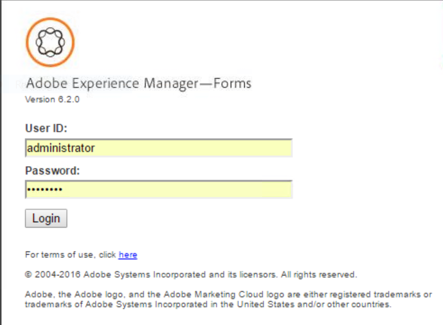

# Guida introduttiva ai report sui processi{#getting-started-with-process-reporting}

La funzione di reporting sui processi consente agli utenti di AEM Forms di eseguire query sulle informazioni sui processi di AEM Forms attualmente definiti nell’implementazione di AEM Forms. Tuttavia, il reporting dei processi non accede ai dati direttamente dall’archivio di AEM Forms. I dati vengono pubblicati per la prima volta nell&#39;archivio di report dei processi su base pianificata (*dal servizio ProcessDataPublisher e ProcessDataStorage* s). I report e le query in Process Reporting vengono quindi generati dai dati di Process Reporting pubblicati nel repository. Process Reporting viene installato come parte del modulo di Forms Workflow.

Questo articolo descrive i passaggi necessari per abilitare la pubblicazione dei dati di AEM Forms nell’archivio di Process Reporting. In seguito, sarà possibile utilizzare Report processi per eseguire report e query. Nell&#39;articolo vengono inoltre illustrate le opzioni disponibili per configurare i servizi di report dei processi.

## Prerequisiti per la generazione di rapporti sui processi {#process-reporting-pre-requisites}

### Eliminare i processi non essenziali {#purge-non-essential-processes}

Se si utilizza Forms Workflow, il database di AEM Forms potrebbe contenere una grande quantità di dati

I servizi di pubblicazione di Process Reporting pubblicano tutti i dati di AEM Forms attualmente disponibili nel database. Ciò implica che se il database contiene dati legacy sui quali non desideri eseguire report e query, anche tutti i dati verranno pubblicati nell’archivio, anche se non sono necessari per il reporting. Si consiglia di eliminare questi dati prima di eseguire i servizi per pubblicare i dati nel repository di Process Reporting. In questo modo si migliorano le prestazioni sia del servizio di pubblicazione che del servizio che esegue query sui dati per il reporting.

Per informazioni dettagliate sulla rimozione dei dati di processo di AEM Forms, consulta [Rimozione dati processo](/help/forms/using/admin-help/purging-process-data.md).

>[!NOTE]
>
>Per i suggerimenti e i trucchi di Purge Utility, vedere l&#39;articolo Adobe Developer Connection su [Rimozione di processi e processi](/help/forms/using/admin-help/purging-process-data.md).

## Configurazione di Process Reporting Services {#configuring-process-reporting-services}

### Pianifica pubblicazione dati processo {#schedule-process-data-publishing}

I servizi di report dei processi pubblicano i dati dal database di AEM Forms all&#39;archivio di report dei processi su base pianificata.

Questa operazione può richiedere molte risorse e può influire sulle prestazioni dei server AEM Forms. È consigliabile pianificare questa operazione all’esterno degli slot orari occupati del server AEM Forms.

Per impostazione predefinita, la pubblicazione dei dati viene pianificata per essere eseguita ogni giorno alle 02:00.

Per modificare la pianificazione di pubblicazione, effettuare le seguenti operazioni:

>[!NOTE]
>
>Se l’implementazione di AEM Forms viene eseguita su un cluster, effettua le seguenti operazioni su ciascun nodo del cluster.

1. Arresta l&#39;istanza di AEM Forms Server.
1. &#x200B;

   * (Per Windows) Apri il `[JBoss root]/bin/run.conf.bat` in un editor.
   * (per Linux®, AIX® e Solaris™) `[JBoss root]/bin/run.conf.sh` in un editor.

1. Aggiungi l’argomento JVM `-Dreporting.publisher.cron = <expression>.`

   Esempio: la seguente espressione cron induce Process Reporting a pubblicare i dati di AEM Forms nell’archivio di Process Reporting ogni cinque ore:

   * `-Dreporting.publisher.cron = 0_0_0/5_*_*_?`

1. Salva e chiudi `run.conf.bat` file.

1. Riavvia l’istanza di AEM Forms Server.

1. Arresta l&#39;istanza di AEM Forms Server.
1. Accedere a WebSphere® Administrative Console. Nella struttura di navigazione, fai clic su **Server** > **Server applicazioni** quindi, nel riquadro di destra, fare clic sul nome del server.

1. In Infrastruttura server fare clic su **Java™ e gestione dei processi** > **Definizione processo**.

1. In Proprietà aggiuntive, fai clic su **Java™ Virtual Machine**.

   Nella casella Argomenti JVM generici aggiungere l&#39;argomento `-Dreporting.publisher.cron = <expression>.`

   **Esempio**: la seguente espressione cron induce Process Reporting a pubblicare i dati di AEM Forms nell’archivio di Process Reporting ogni cinque ore:

   * `-Dreporting.publisher.cron = 0_0_0/5_*_*_?`

1. Clic **Applica**, scegliere OK e quindi fare clic su **Salva direttamente nella configurazione principale**.
1. Riavvia l’istanza di AEM Forms Server.
1. Arresta l&#39;istanza di AEM Forms Server.
1. Accedere alla console di amministrazione WebLogic. L&#39;indirizzo predefinito della console di amministrazione WebLogic è `https://[hostname]:[port]/console`.
1. In Cambia centro fare clic su **Blocca e modifica**.
1. In Struttura dominio, fai clic su **Ambiente** > **Server** nel riquadro di destra fare clic sul nome del server gestito.
1. Nella schermata successiva, fai clic su **Configurazione** scheda > **Avvio server** scheda.
1. Nella casella Argomenti aggiungere l&#39;argomento JVM `-Dreporting.publisher.cron = <expression>`.

   **Esempio**: la seguente espressione cron induce Process Reporting a pubblicare i dati di AEM Forms nell’archivio di Process Reporting ogni cinque ore:

   `-Dreporting.publisher.cron = 0_0_0/5_*_*_?`

1. Clic **Salva** e quindi fare clic su **Attiva modifiche**.
1. Riavvia l’istanza di AEM Forms Server.

### Servizio ProcessDataStorage {#processdatastorage-service}

Il servizio ProcessDataStorageProvider riceve i dati di processo dal servizio ProcessDataPublisher e li salva nel repository di Process Reporting.

A ogni ciclo di pubblicazione, i dati vengono salvati nelle sottocartelle di una cartella principale predefinita.

Puoi utilizzare la console di amministrazione per configurare la directory principale (**predefinito**: `/content/reporting/pm`) posizione e sottocartella (**predefinito**: `/yyyy/mm/dd/hh/mi/ss`) formato della gerarchia in cui memorizzare i dati del processo.

#### Per configurare i percorsi dell&#39;archivio di report dei processi {#to-configure-the-process-reporting-repository-locations}

1. Accedi a **Console di amministrazione** con le credenziali di amministratore. L’URL predefinito di Administration Console è `https://'[server]:[port]'/adminui`
1. Accedi a **Home** > **Servizi** > **Applicazioni e servizi** >**Gestione dei servizi** e apri **ProcessDataStorageProvider** servizio.

   

   **RootFolder**

   Posizione CRX in cui memorizzare i dati del processo per il reporting.

   `Default`: `/content/reporting/pm`

   **Gerarchia cartelle**

   Gerarchia di cartelle in cui memorizzare i dati del processo in base all&#39;ora di creazione del processo.

   `Default`: `/yyyy/mm/dd/hh/mi/ss`

1. Fai clic su **Salva**.

### Servizio ReportConfiguration {#reportconfiguration-service}

Il servizio ReportConfiguration viene utilizzato da Process Reporting per la configurazione del servizio query di report dei processi.

#### Per configurare il servizio ReportingConfiguration {#to-configure-the-reportingconfiguration-service}

1. Accedi a **Gestione configurazione** con le credenziali di amministratore CRX. L’URL predefinito di Configuration Manager è `https://'[server]:[port]'/lc/system/console/configMgr`
1. Apri **ConfigurazioneReporting** servizio.
1. **Numero di record**

   Quando si esegue una query nel repository, un risultato può potenzialmente contenere molti record. Se il set di risultati è grande, l’esecuzione della query può utilizzare risorse del server.

   Per gestire set di risultati di grandi dimensioni, il servizio ReportConfiguration suddivide l&#39;elaborazione della query in batch di record. In questo modo si riduce il carico del sistema.

   `Default`: `1000`

   **Percorso di archiviazione CRX**

   La posizione CRX in cui devono essere memorizzati i dati del processo a scopo di reporting.

   `Default`: `/content/reporting/pm`

   >[!NOTE]
   >
   >Questa posizione corrisponde a quella specificata nell&#39;opzione di configurazione ProcessDataStorage **Cartella principale**.
   >
   >
   >Se si aggiorna l&#39;opzione Root Folder nella configurazione ProcessDataStorage, è necessario aggiornare il percorso di archiviazione CRX nel servizio ReportConfiguration.

1. Clic **Salva** e chiudi **Gestione configurazione CQ**.

### Servizio ProcessDataPublisher {#processdatapublisher-service}

Il servizio ProcessDataPublisher importa i dati di processo dal database di AEM Forms e li pubblica nel servizio ProcessDataStorageProvider per l&#39;archiviazione.

#### Per configurare il servizio ProcessDataPublisher   {#to-configure-processdatapublisher-service-nbsp}

1. Accedi a **Console di amministrazione** con le credenziali di amministratore.

   L’URL predefinito è `https://'server':port]/adminui/`.

1. Accedi a **Home** > **Servizi** > **Applicazioni e servizi** >**Gestione dei servizi** e apri **ProcessDataPublisher** servizio.

**Pubblica dati**

Abilita questa opzione per avviare la pubblicazione dei dati del processo. Per impostazione predefinita, l’opzione è disabilitata.

Abilitare Process Reporting solo quando tutte le configurazioni correlate ai componenti di Process Reporting sono impostate in modo appropriato.

In alternativa, utilizzare questa opzione per disabilitare la pubblicazione dei dati di processo quando non è più necessaria.

`Default`: `Off`

**Intervallo batch (sec)**

Ogni volta che viene eseguito il servizio ProcessDataPublisher, il servizio suddivide per l&#39;intervallo batch il tempo trascorso dall&#39;ultima esecuzione del servizio. Il servizio elabora quindi separatamente ogni intervallo di dati di AEM Forms per controllare la dimensione dei dati elaborati dall’editore in modalità end-to-end durante ogni esecuzione (batch) di un ciclo.

Ad esempio, se l’editore viene eseguito ogni giorno, invece di elaborare tutti i dati per un giorno in una singola esecuzione, per impostazione predefinita l’elaborazione viene suddivisa in 24 batch da un’ora ciascuno.

`Default`: `3600`

`Unit`: `Seconds`

**Timeout blocco (sec)**

Il servizio di pubblicazione acquisisce un blocco quando inizia l&#39;elaborazione dei dati in modo che più istanze dell&#39;autore non inizino a eseguire ed elaborare i dati contemporaneamente.

Se un servizio di pubblicazione che ha acquisito un blocco è inattivo per il numero di secondi definito dal valore di Timeout blocco, il relativo blocco viene rilasciato in modo che altre istanze del servizio di pubblicazione possano continuare l&#39;elaborazione.

`Default`: `3600`

`Unit`: `Seconds`

**Pubblica dati da**

L’ambiente AEM Forms contiene i dati relativi al momento in cui è stato configurato.

Per impostazione predefinita, il servizio ProcessDataPublisher importa tutti i dati dal database di AEM Forms.

A seconda delle esigenze di reporting, se prevedi di eseguire rapporti e query sui dati dopo una certa data e ora, è consigliabile specificare la data e l’ora. Il servizio di pubblicazione pubblica quindi la data da tale data in poi.

`Default`: `01-01-1970 00:00:00`

`Format`: `dd-MM-yyyy HH:mm:ss`

## Accesso all&#39;interfaccia utente di Process Reporting {#accessing-the-process-reporting-user-interface}

L&#39;interfaccia utente di Process Reporting è basata su browser.

Dopo aver impostato Report processi, puoi iniziare a utilizzare Reporting processi nella seguente posizione nell’installazione di AEM Forms:

`https://<server>:<port>/lc/pr`

### Accedi a Reporting processi {#log-in-to-process-reporting}

Quando si passa all&#39;URL di Report processo (https://)&lt;server>:&lt;port>/lc/pr), viene visualizzata la schermata di accesso.

Per accedere al modulo Report processi, specificare le credenziali.

>[!NOTE]
>
>Per accedere all&#39;interfaccia utente di Process Reporting, è necessario disporre delle seguenti autorizzazioni AEM Forms:
>
>`PERM_PROCESS_REPORTING_USER`

Quando si esegue l&#39;accesso a Reporting processi, il **[!UICONTROL Home]** schermo.

### Schermata Home di Process Reporting {#process-reporting-home-screen}

**Visualizzazione struttura report processi:** La struttura ad albero sul lato sinistro della schermata Home contiene gli elementi per i moduli Report di processo.

La struttura ad albero è costituita dai seguenti elementi di primo livello:

**Rapporti:** Questo articolo contiene i report preconfigurati forniti con Process Reporting.

Per informazioni dettagliate sui rapporti predefiniti, consulta [Rapporti predefiniti nella generazione di rapporti](/help/forms/using/process-reporting/pre-defined-reports-in-process-reporting.md).

**Query ad hoc:** Questo elemento contiene le opzioni per eseguire la ricerca di processi e attività basata su filtri.

Per informazioni dettagliate sulle query ad hoc, consulta [Query ad hoc in Report di processo](/help/forms/using/process-reporting/adhoc-queries-in-process-reporting.md).

**Personalizzato:** Nel nodo Personalizzato vengono visualizzati i rapporti personalizzati creati dall&#39;utente.

Per la procedura per creare e visualizzare rapporti personalizzati, consulta [Rapporti personalizzati in Report di processo](/help/forms/using/process-reporting/process-reporting-custom-reports.md).

**Barra del titolo Report di processo:** La barra del titolo di Process Reporting contiene alcune opzioni generiche che è possibile utilizzare quando si lavora nell&#39;interfaccia utente.

**Titolo report processi:** Il titolo Report di processo viene visualizzato nell&#39;angolo sinistro della barra del titolo.

Fare clic sul titolo in qualsiasi momento per tornare alla schermata iniziale.

**Ora ultimo aggiornamento:** I dati del processo vengono pubblicati dal database di AEM Forms all’archivio di Process Reporting in base a una pianificazione.

Ora ultimo aggiornamento visualizza la data e l&#39;ora dell&#39;ultimo push degli aggiornamenti dei dati all&#39;archivio di report dei processi.

Per informazioni dettagliate sul servizio di pubblicazione dei dati e sulla pianificazione di tale servizio, consulta [Pianifica pubblicazione dati processo](/help/forms/using/process-reporting/install-start-process-reporting.md#p-schedule-process-data-publishing-p) nell&#39;articolo Guida introduttiva a Process Reporting.

**Utente report processi:** Il nome utente connesso viene visualizzato a destra dell&#39;ora dell&#39;ultimo aggiornamento.

**Elenco a discesa della barra del titolo Processi:** L&#39;elenco a discesa nell&#39;angolo destro della barra del titolo Report di processo contiene le opzioni seguenti:

* **[!UICONTROL Sincronizza]**: sincronizza l’archivio di Process Reporting incorporato con il database di AEM Forms.
* **[!UICONTROL Aiuto]**: consulta la documentazione di Aiuto su Reporting sui processi.
* **[!UICONTROL Disconnetti]**: disconnessione da Reporting processi
