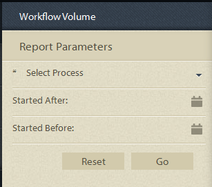

# Rapporti predefiniti nella generazione di rapporti sui processi {#pre-defined-reports-in-process-reporting}

## Rapporti predefiniti nella generazione di rapporti {#pre-defined-reports-in-process-reporting-1}

AEM Forms Process Reporting viene fornito con i seguenti *report predefiniti*:

* **[Processi a esecuzione prolungata](#long-running-processes)**: un report di tutti i processi AEM Forms il cui completamento ha richiesto più di un tempo specificato
* **[Grafico durata processo](#process-duration-report)**: un report di un processo AEM Forms specificato per durata
* **[Volume flusso di lavoro](#workflow-volume-report)**: un report delle istanze in esecuzione e completate del processo specificato per data

## Processi a esecuzione prolungata {#long-running-processes}

Nel rapporto Processi a esecuzione prolungata vengono visualizzati i processi di AEM Forms il cui completamento ha richiesto più di un tempo specificato.

### Per eseguire un report di processi a esecuzione prolungata {#to-execute-a-long-running-process-report}

1. Per visualizzare l&#39;elenco dei report predefiniti in Process Reporting, nella visualizzazione struttura **Process Reporting** fare clic sul nodo **Reports**.
1. Fare clic sul nodo del report **Processi a esecuzione prolungata**.

   

   Quando selezioni un report, il pannello **Parametri del report** viene visualizzato a destra della visualizzazione struttura.

   

   Parametri:

   * **Durata** (*obbligatoria*): specifica una durata e un&#39;unità di tempo. Visualizza tutti i processi AEM Forms eseguiti per una durata superiore a quella specificata.
   * **Iniziato dopo** (*facoltativo*): seleziona una data. Filtrare il report per visualizzare le istanze di processo avviate dopo la data specificata.
   * **Iniziato prima del** (*facoltativo*): seleziona una data. Filtrare il report per visualizzare le istanze di processo avviate prima della data specificata.

1. Fare clic su **Vai** per eseguire il report.

   Il report viene visualizzato nel pannello **Report** a destra della finestra **Report dei processi**.

   

   Utilizzare le opzioni nell&#39;angolo superiore destro del pannello **Report** per eseguire le operazioni seguenti nel report.

   * **Aggiorna**: aggiorna il report con i dati più recenti presenti nell&#39;archivio
   * **Cambia colore legenda**: selezionare e modificare il colore della legenda del report
   * **Esporta in CSV**: esporta e scarica i dati dal report in un file separato da virgole

## Rapporto Durata processo  {#process-duration-report}

Nel rapporto Durata processo viene visualizzato il numero di istanze di un processo Forms per numero di giorni di esecuzione di ogni istanza.

### Per eseguire un report Durata processo {#to-execute-a-process-duration-report}

1. Per visualizzare i report predefiniti in Process Reporting, nella visualizzazione struttura **Process Reporting** fare clic sul nodo **Reports**.
1. Fare clic sul nodo del report **Durata processi**.

   

   Quando selezioni un report, il pannello **Parametri del report** viene visualizzato a destra della visualizzazione struttura.

   

   Parametri:

   * **Seleziona processo** (*obbligatorio*): seleziona un processo AEM Forms.

1. Fare clic su **Vai** per eseguire il report.

   Il report viene visualizzato nel pannello **Report** a destra della finestra Report processi.

   

   Utilizzare le opzioni nell&#39;angolo superiore destro del pannello **Report** per eseguire le operazioni seguenti nel report.

   * **Aggiorna**: aggiorna il report con i dati più recenti presenti nell&#39;archivio
   * **Cambia colore legenda**: selezionare e modificare il colore della legenda del report
   * **Esporta in CSV**: esporta e scarica i dati dal report in un file separato da virgole

## Rapporto volume flusso di lavoro {#workflow-volume-report}

Nel rapporto Volume flusso di lavoro viene visualizzato il numero di istanze di un processo AEM Forms attualmente in esecuzione e completate per giorno di calendario.

### Per eseguire un report Volume flusso di lavoro {#to-execute-a-workflow-volume-report}

1. Per visualizzare i report predefiniti in Process Reporting, nella visualizzazione struttura **Process Reporting** fare clic sul nodo **Reports**.
1. Fare clic sul nodo del report **Volume flusso di lavoro**.

   

   Quando selezioni un report, il pannello **Parametri del report** viene visualizzato a destra della visualizzazione struttura.

   

   Parametri:

   * **Seleziona processo** (*obbligatorio*): seleziona un processo AEM Forms.

   * **Iniziato dopo** (*facoltativo*): seleziona una data. Filtra il report per visualizzare le istanze di processo avviate dopo la data specificata.

   * **Iniziato prima del** (*facoltativo*): seleziona una data. Filtra il report per visualizzare le istanze di processo avviate prima della data specificata.

1. Fare clic su **Vai** per eseguire il report.

   Il report viene visualizzato nel pannello **Report** a destra della finestra **Report dei processi**.

   

   Utilizzare le opzioni nell&#39;angolo superiore destro del pannello **Report** per eseguire le operazioni seguenti nel report.

   * **Aggiorna**: aggiorna il report con i dati più recenti presenti nell&#39;archivio
   * **Cambia colore legenda**: selezionare e modificare il colore della legenda del report
   * **Esporta in CSV**: esporta e scarica i dati dal report in un file separato da virgole
