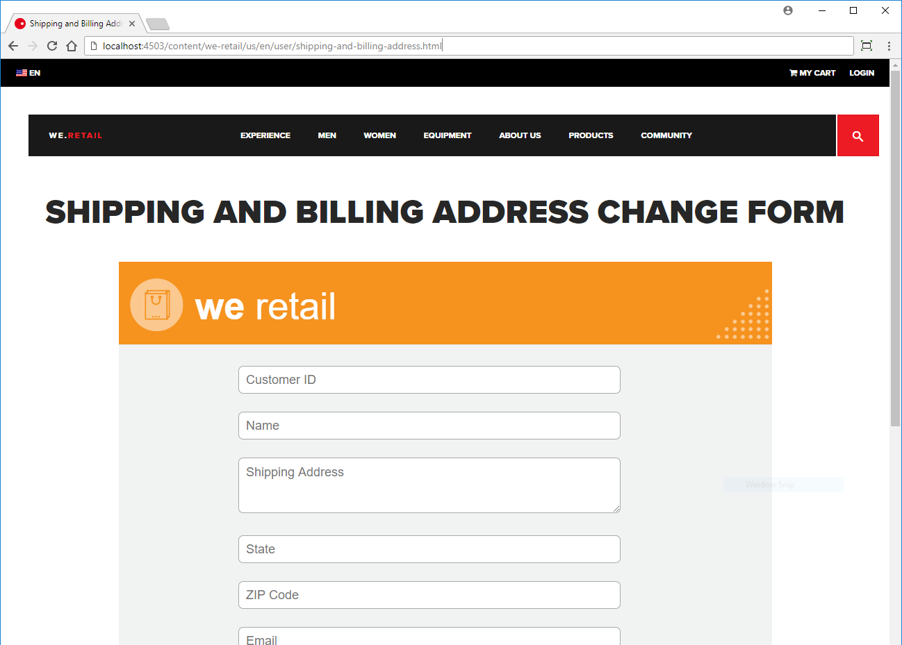

# Tutorial: pubblicare il modulo adattivo {#tutorial-publish-your-adaptive-form}

Questo tutorial è un passaggio del [Creare il primo modulo adattivo](https://helpx.adobe.com/it/experience-manager/6-3/forms/using/create-your-first-adaptive-form.html) serie. Si consiglia di seguire la serie in sequenza cronologica per comprendere, eseguire e dimostrare il caso di utilizzo completo dell’esercitazione.

Una volta che il modulo adattivo è pronto, puoi pubblicarlo per renderlo disponibile agli utenti finali. Gli utenti finali possono aprire il modulo pubblicato su qualsiasi dispositivo e browser Internet. Quando viene pubblicato un modulo adattivo, il modulo e il contenuto correlato vengono copiati da un’istanza di authoring AEM a un’istanza di pubblicazione AEM. Il modulo viene reso disponibile all’utente finale tramite l’istanza Publish.

Per pubblicare un modulo adattivo, sono disponibili i seguenti metodi:

* [Pubblicare il modulo adattivo come pagina AEM](../../forms/using/publish-your-adaptive-form.md#publish-the-adaptive-form-as-an-aem-page)
* [Incorporare il modulo adattivo in una pagina AEM Sites](#embed-the-adaptive-form-in-an-aem-sites-page)
* [Incorporare il modulo adattivo in una pagina web esterna (una pagina web non AEM ospitata al di fuori dell’AEM)](../../forms/using/publish-your-adaptive-form.md)

## Prima di iniziare {#before-you-start}

* **[Configurare un’istanza di pubblicazione di AEM Forms](https://helpx.adobe.com/it/experience-manager/6-3/forms/using/installing-configuring-aem-forms-osgi.html)**: l’istanza Publish è un’istanza pubblica dell’AEM [!DNL Forms] in esecuzione in modalità di pubblicazione. In un ambiente di produzione, l’istanza Publish si trova all’esterno del firewall dell’organizzazione.
* **[Imposta replica e replica inversa](https://helpx.adobe.com/experience-manager/6-3/help/sites-deploying/replication.html)**: la replica copia il contenuto dall’istanza di authoring a un’istanza di pubblicazione e restituisce l’input dell’utente (ad esempio, l’input del modulo) dall’istanza di pubblicazione all’istanza di authoring.

## Pubblicare il modulo adattivo come pagina AEM {#publish-the-adaptive-form-as-an-aem-page}

Quando il modulo adattivo viene pubblicato come pagina AEM, l’intera pagina web contiene solo il modulo pubblicato. Puoi utilizzare l’URL del modulo adattivo per collegarlo da un’altra pagina web. Per pubblicare **shipping-address-add-update-form** modulo adattivo come pagina AEM:

1. Accedere a AEM [!DNL Forms] istanza di authoring e individuare il modulo adattivo shipping-address-add-update-form nell’AEM [!DNL Forms] UI.
   `https://localhost:4502/aem/forms.html/content/dam/formsanddocuments`
1. Seleziona il modulo adattivo shipping-address-add-update-form e seleziona **[!UICONTROL Pubblica]**. Viene visualizzata una finestra di dialogo contenente le risorse correlate al modulo adattivo. Seleziona **[!UICONTROL Pubblica]**. Il modulo adattivo viene pubblicato e viene visualizzata una finestra di dialogo di successo.
1. Apri il modulo sull’istanza Publish. Il modulo può essere compilato e inviato dall’utente finale.
   `https://localhost:4503/content/forms/af/shipping-address-add-update-form.html`

## Incorporare il modulo adattivo in una pagina AEM Sites {#embed-the-adaptive-form-in-an-aem-sites-page}

AEM [!DNL Forms] consente agli sviluppatori di moduli di incorporare facilmente moduli adattivi in un AEM [!DNL Sites] pagina. Il modulo adattivo incorporato è completamente funzionante e gli utenti possono compilare e inviare il modulo senza uscire dalla pagina. Consente all’utente di rimanere nel contesto di altri elementi della pagina web e interagire contemporaneamente con il modulo.

AEM [!DNL Forms] fornire una componente, AEM [!DNL Forms] Contenitore per incorporare un modulo adattivo in un AEM [!DNL Sites] pagina. Per impostazione predefinita, il componente non è visibile nell’AEM [!DNL Sites] contenitore. Per abilitare l’AEM, effettua le seguenti operazioni [!DNL Forms] Componente contenitore e per incorporare il modulo adattivo in un AEM [!DNL Sites] Pagina:

1. Crea e apri una pagina nel sito We.Retail per la modifica. Ad esempio: [https://localhost:4502/editor.html/content/we-retail/us/en/user/shipping-and-billing-address.html](https://localhost:4502/editor.html/content/we-retail/us/en/user/shipping-and-billing-address.html). Il modulo adattivo è incorporato in [!DNL Sites] pagina.

   Puoi anche incorporare il modulo adattivo in un We.Retail esistente [!DNL Site's] pagina. Ad esempio, la pagina INFORMAZIONI SU DI NOI [https://localhost:4502/editor.html/content/we-retail/us/en/about-us.html](https://localhost:4502/editor.html/content/we-retail/us/en/about-us.html). Consente di risparmiare tempo per creare una pagina. I passaggi seguenti utilizzano la pagina appena creata.

   Il sito We.Retail è fornito con AEM. Se non hai installato il sito We.Retail, vedi per [Implementazione di riferimento We.Retail](https://helpx.adobe.com/experience-manager/6-3/help/sites-developing/we-retail.html) installare il sito.

1. Seleziona  informazioni sulla pagina e selezionare **[!UICONTROL Modifica modello]** nella pagina del sito We.Retail appena creata. Il modello della pagina si apre in una nuova scheda del browser.
1. Seleziona all&#39;interno del **[!UICONTROL contenitore layout]** e seleziona . In **[!UICONTROL Componenti consentiti]** , espandere la scheda **[!UICONTROL Generale]** Pannello a soffietto, seleziona la **[!UICONTROL Modulo AEM]** e seleziona . L&#39;AEM [!DNL Forms] Il componente Contenitore è abilitato per la pagina.

1. Apri la scheda del browser contenente AEM [!DNL Sites] pagina aperta al passaggio 1. Seleziona la **[!UICONTROL Trascina qui i componenti]** e seleziona **+.** In **[!UICONTROL Inserisci nuovo componente]** , seleziona **[!UICONTROL Modulo AEM]**. Il **[!UICONTROL Contenitore AEM Forms]** viene aggiunto alla pagina.
1. Seleziona la **[!UICONTROL Contenitore AEM Forms]** componente e seleziona . Una finestra di dialogo con le proprietà dell&#39;AEM [!DNL Forms] Viene visualizzato Contenitore. In **[!UICONTROL Percorso risorsa]** sfoglia e seleziona il modulo adattivo shipping-address-add-update-form. Seleziona . Il modulo adattivo è incorporato nella pagina.
1. Pubblicare sia il modulo adattivo che [!DNL Sites] pagina. Di seguito sono riportati alcuni punti da considerare:

   * Se pubblichi l’AEM [!DNL Sites] per la prima volta e include un modulo incorporato, pubblica il [!DNL Sites] e il modulo incorporato.
   * Se si modifica solo il modulo incorporato in una pagina del sito pubblicata, pubblicare il modulo originale e le modifiche si riflettono nella pagina del sito pubblicata. La pagina del sito pubblicata include un riferimento al modulo e non richiede la ripubblicazione della pagina.
   * Se si modifica il [!DNL Sites] e il modulo incorporato, ripubblica il [!DNL Sites] e il modulo.

     

   Modulo di modifica indirizzo di spedizione e fatturazione aggiunto a un AEM [!DNL Sites] pagina.

## Incorporare il modulo adattivo in una pagina web esterna {#embed-the-adaptive-form-in-an-external-webpage}

Puoi incorporare un modulo adattivo in una pagina web esterna (una pagina web non AEM ospitata al di fuori dell’AEM) inserendo alcune righe di JavaScript nella pagina web esterna. Il codice JavaScript invia una richiesta HTTP all’AEM [!DNL Forms] server per il modulo adattivo e le risorse correlate, quindi aggiunge il modulo adattivo alla pagina web. Per i passaggi dettagliati, consulta [incorporare il modulo adattivo in una pagina web esterna](/help/forms/using/embed-adaptive-form-external-web-page.md).
