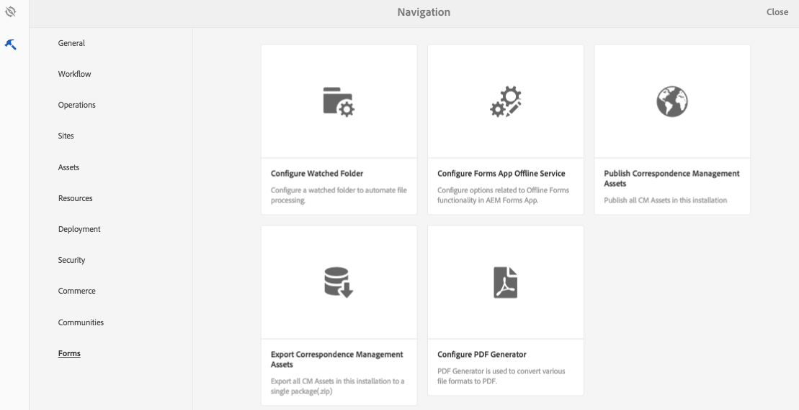

# Pubblicazione e annullamento della pubblicazione di moduli e documenti{#publishing-and-unpublishing-forms-and-documents}

 AEM Forms consente di creare, pubblicare e annullare la pubblicazione dei moduli in modo semplice. Per ulteriori informazioni su  AEM Forms, vedere [Introduzione alla gestione dei moduli](../../forms/using/introduction-managing-forms.md).

Il server AEM Forms  fornisce due istanze: Creazione e pubblicazione. L’istanza Author consente di creare e gestire le risorse e le risorse dei moduli. L’istanza Pubblica serve a mantenere le risorse e le risorse correlate disponibili per gli utenti finali. Potete importare XDP e PDF forms nella modalità Autore. Per ulteriori informazioni, vedere [Ottenimento di documenti XDP e PDF in  AEM Forms](../../forms/using/get-xdp-pdf-documents-aem.md).

## Risorse supportate   {#supported-assets-nbsp}

 AEM Forms supporta i seguenti tipi di risorse:

* Moduli adattivi
* Documenti adattivi
* Frammenti di moduli adattivi
* Temi
* Modelli per moduli (moduli XFA)
* PDF forms
* Documento (documenti PDF semplici)
* Set di moduli
* Risorsa (immagini, schemi e fogli di stile)

Inizialmente, tutte le risorse sono disponibili solo nell’istanza Author. Un amministratore o un autore di moduli può pubblicare tutte le risorse eccetto quelle disponibili.

Quando si seleziona un modulo e lo si pubblica, vengono pubblicate anche le relative risorse e risorse. Tuttavia, le risorse dipendenti non vengono pubblicate. In questo contesto, le risorse e le risorse correlate sono risorse utilizzate o a cui fanno riferimento una risorsa pubblicata. Le risorse dipendenti sono risorse che fanno riferimento a una risorsa pubblicata.

Il Forms adattivo può utilizzare alcune configurazioni, impostazioni e personalizzazioni che non vengono pubblicate automaticamente. È consigliabile pubblicare o attivare queste risorse prima di pubblicare un modulo adattivo.

* Modelli di modulo adattivo modificabili
* Configurazioni di Cloud Service per  modelli di dati Adobe Sign, Typekit, reCAPTCHA e Form
* Le altre configurazioni di servizi Cloud sono attivate solo se l&#39;utente dispone delle autorizzazioni di amministratore.
* Personalizzazioni. Tra questi rientrano, tra l&#39;altro:

   * Layout personalizzati
   * Aspetto personalizzato
   * File CSS - usato come input nella finestra di dialogo delle proprietà del contenitore Modulo adattivo
   * Categoria libreria client - utilizzata come input nella finestra di dialogo delle proprietà del contenitore Modulo adattivo
   * Qualsiasi altra libreria client che può essere stata inclusa nel modello di modulo adattivo.
   * Percorsi di progettazione

## Stati risorsa {#asset-states}

Una risorsa può presentare i seguenti stati:

* **Non pubblicato:** una risorsa che non è mai stata pubblicata (lo stato non pubblicato è applicabile solo alle risorse Forms). Le risorse Gestione corrispondenza non dispongono di uno stato Non pubblicato.
* **Pubblicato**: Risorsa pubblicata ed disponibile nell’istanza Pubblica
* **Modificato**: Risorsa modificata dopo la pubblicazione

## Pubblicare una risorsa {#publish-an-asset}

1. Effettuate l&#39;accesso al server AEM Forms .
1. Per selezionare e pubblicare una risorsa, effettuate una delle seguenti operazioni.

   1. Portate il puntatore su una risorsa e toccate **[!UICONTROL Pubblica]** .
   1. Effettuate una delle seguenti operazioni, quindi toccate Pubblica:

      * Se vi trovate nella vista a schede, toccate **[!UICONTROL Enter Selection]**  e toccate la risorsa. La risorsa è selezionata.
      * Se vi trovate nella vista a elenco, selezionate la casella di controllo di una risorsa. La risorsa è selezionata.
      * Toccate una risorsa per visualizzarne i dettagli.
      * Visualizzare le proprietà di una risorsa toccando Visualizza proprietà .

      >[!NOTE]
      >
      >Non selezionate più risorse. La pubblicazione simultanea di più risorse non è supportata.

1. All’avvio del processo di pubblicazione viene visualizzata una finestra di dialogo di conferma in cui sono elencate tutte le risorse e risorse correlate. Nella finestra di dialogo che contiene le risorse correlate, toccate **[!UICONTROL Pubblica]**. La risorsa viene pubblicata e viene visualizzata la finestra di dialogo Pubblica esito positivo risorse.

   >[!NOTE]
   >
   >Per i moduli adattivi, insieme alle relative risorse, viene visualizzato anche il nome della pagina Modulo adattivo.

   

   Una finestra di dialogo di conferma con tutte le risorse e risorse correlate.

   >[!NOTE]
   >
   >Per Forms Manager, se l&#39;utente non dispone dell&#39;autorizzazione per pubblicare le risorse elencate, l&#39;azione Pubblica è disabilitata. Una risorsa che richiede autorizzazioni aggiuntive viene visualizzata in rosso.

   Dopo la pubblicazione di una risorsa, le proprietà dei metadati della risorsa vengono copiate nell’istanza Pubblica e lo stato della risorsa viene modificato in Pubblicato. Anche lo stato delle risorse dipendenti pubblicate viene modificato in Pubblicato.

   Dopo aver pubblicato una risorsa, potete utilizzare Forms Portal per visualizzare tutte le risorse su una pagina Web. Per ulteriori informazioni, vedere [Introduzione alla pubblicazione di moduli su un portale](../../forms/using/introduction-publishing-forms.md).

## Pubblicare tutte le risorse di gestione della corrispondenza {#publish-all-the-correspondence-management-assets}

 AEM Forms consente di pubblicare tutte le risorse di gestione della corrispondenza su un server contemporaneamente. Le risorse pubblicate includono tutte le risorse Gestione corrispondenza e le relative dipendenze.

Per pubblicare tutte le risorse di Gestione corrispondenza su un server, effettuate i seguenti passaggi:

1. Effettuate l&#39;accesso al server AEM Forms .
1. Toccate **Adobe Experience Manager** nella barra di navigazione globale.
1. Toccate , quindi toccate **Forms**.
1. Toccate **Pubblica risorse di gestione della corrispondenza**.

   

   Viene visualizzata la pagina Pubblica tutte le risorse di gestione della corrispondenza, con le informazioni relative all’ultima volta che è stato tentato il processo Pubblica risorse di gestione della corrispondenza.

   

1. Toccate **Pubblica** e, nel messaggio di conferma, toccate **OK**.

   Al termine di un processo batch, potete visualizzare i dettagli dell&#39;ultima esecuzione. Questo include informazioni come il login dell&#39;amministratore e se il batch viene eseguito correttamente o con esito negativo.

   >[!NOTE]
   >
   >Il processo di pubblicazione non può essere annullato una volta avviato. Inoltre, mentre è in corso l’operazione di pubblicazione, non create, eliminate, modificate o pubblicate risorse, né avviate l’operazione Esporta tutte le risorse di gestione della corrispondenza.

## Automatizzare la pubblicazione e l&#39;annullamento della pubblicazione per Forms e documenti {#automate-publishing-and-unpublishing-for-forms-amp-documents}

 AEM Forms consente di pianificare la pubblicazione e l’annullamento della pubblicazione delle risorse per Forms e documenti. Potete specificare la pianificazione nell’Editor metadati. Per ulteriori informazioni sulla gestione dei metadati del modulo, vedere [Gestione dei metadati del modulo.](../../forms/using/manage-form-metadata.md)

Per pianificare la data e l’ora di pubblicazione e annullamento della pubblicazione delle risorse per Forms e documenti, effettuate le seguenti operazioni:

1. Selezionate una risorsa e toccate **[!UICONTROL Visualizza proprietà]**. Viene visualizzata la pagina Proprietà metadati.
1. Nella pagina Proprietà metadati, toccate **[!UICONTROL Avanzate]**, quindi toccate **[!UICONTROL Modifica]** .
1. Nei campi **[!UICONTROL Pubblica sul tempo]** e **[!UICONTROL Pubblica sul tempo]**, selezionare la data e l&#39;ora.\
   Toccare **[!UICONTROL Done]** .

## Annullare la pubblicazione di una risorsa {#unpublish-an-asset}

1. Selezionate una risorsa pubblicata e toccate **[!UICONTROL Annulla pubblicazione]** .
1. Per selezionare e annullare la pubblicazione di una risorsa, effettuate una delle seguenti operazioni.

   1. Portate il puntatore su una risorsa e toccate **[!UICONTROL Annulla pubblicazione]** .
   1. Effettuate una delle seguenti operazioni, quindi toccate Annulla pubblicazione:

      * Se vi trovate nella vista a schede, toccate **[!UICONTROL Enter Selection]**  e toccate la risorsa. La risorsa è selezionata.

      * Se vi trovate nella vista a elenco, passate il puntatore del mouse su una risorsa e toccate  . La risorsa è selezionata.

      * Toccate una risorsa per visualizzarne i dettagli.
      * Visualizzare le proprietà di una risorsa toccando Visualizza proprietà .

1. All’avvio del processo di annullamento della pubblicazione viene visualizzata una finestra di dialogo di conferma. Toccate **[!UICONTROL Annulla pubblicazione]**.

   >[!NOTE]
   >
   >Solo la risorsa selezionata non viene pubblicata e le eventuali risorse figlie e di riferimento non vengono annullate.

## Ripristino di una risorsa o di una lettera nella versione precedentemente pubblicata {#revert-an-asset-or-letter-to-the-previously-published-version}

Ogni volta che pubblicate una risorsa o una lettera dopo averla modificata, viene creata una versione della risorsa o della lettera. Potete ripristinare una versione pubblicata in precedenza di una risorsa o una lettera. Potrebbe essere necessario eseguire questa operazione in caso di problemi con la versione corrente della risorsa o del documento.

>[!NOTE]
>
>Non ripristinare una lettera a un ultimo stato pubblicato se una risorsa dipendente utilizzata in tale lettera pubblicata viene eliminata dal sistema.

1. Selezionate una risorsa e toccate **[!UICONTROL Torna alla versione pubblicata in precedenza]** .
1. Prima che la risorsa venga ripristinata, viene visualizzata una finestra di dialogo di conferma. Toccate **[!UICONTROL Ripristina]**.

   La risorsa o la lettera viene riportata alla versione precedentemente pubblicata.

## Eliminare una risorsa {#delete-an-asset}

>[!NOTE]
>
>Se eliminate una risorsa, questa viene rimossa dall’istanza di pubblicazione. Se eliminate una risorsa, ne viene rimossa anche la cronologia della versione, tranne la versione di base.

1. Selezionate una risorsa e toccate **[!UICONTROL Elimina]** .

   >[!NOTE]
   >
   >L’opzione Elimina è disponibile anche quando si visualizzano i dettagli della risorsa toccando una risorsa o quando si visualizzano le proprietà di una risorsa toccando Visualizza proprietà .

1. Prima che la risorsa venga eliminata, viene visualizzata una finestra di dialogo di conferma. Toccate **[!UICONTROL Elimina]**.

   >[!NOTE]
   >
   >Vengono eliminate solo le risorse selezionate, le risorse dipendenti e non vengono eliminate. Per controllare i riferimenti di una risorsa, toccate , quindi selezionate una risorsa.
   >
   >
   >Se la risorsa che state tentando di eliminare è una risorsa figlia di un’altra risorsa, non viene eliminata. Per eliminare una risorsa di questo tipo, rimuovete i riferimenti a tale risorsa da altre risorse e riprovate.

## Moduli adattivi protetti {#protected-adaptive-forms}

È possibile abilitare l&#39;autenticazione per i moduli a cui gli utenti selezionati devono accedere. Quando si abilita l&#39;autenticazione per i moduli, gli utenti visualizzano una schermata di accesso prima di accedervi. Solo gli utenti con credenziali autorizzate possono accedere ai moduli.

Per abilitare l&#39;autenticazione per i moduli:

1. Nel browser, aprite configMgr nell’istanza di pubblicazione.\
   URL: `https://<hostname>:<PublishPort>/system/console/configMgr`

1. In Configurazione console Web Adobe Experience Manager, fare clic su **Apache Sling Authentication Service** per configurarlo.
1. Nella finestra di dialogo Apache Sling Authentication Service visualizzata, utilizzate il pulsante **+** per aggiungere i percorsi.\
   Quando si aggiunge un percorso, il servizio di autenticazione è abilitato per i moduli in tale percorso.
