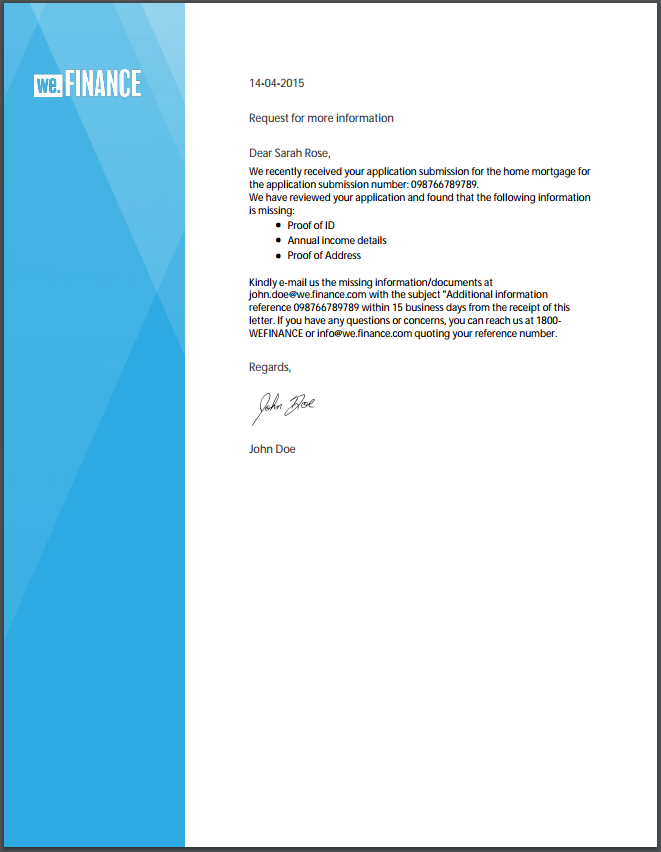
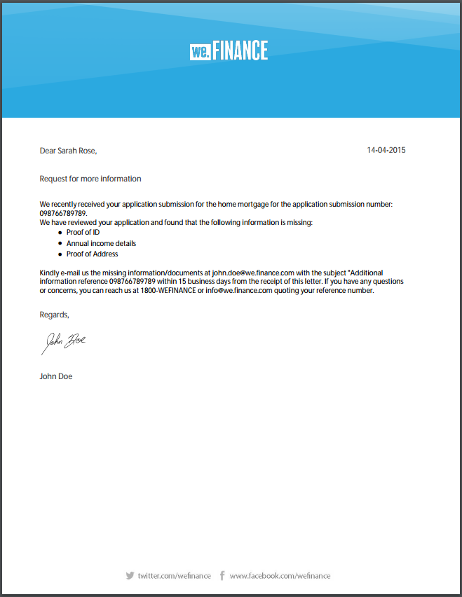

# Modelli di lettera di riferimento {#reference-letter-templates}

In Gestione corrispondenza un modello di lettera contiene campi modulo tipici, funzioni di layout quali intestazione e piè di pagina e &quot;aree target&quot; vuote per il posizionamento del contenuto.

Gestione corrispondenza fornisce modelli di lettera nel [pacchetto aggiuntivo di AEM Forms](https://experienceleague.adobe.com/docs/experience-manager-release-information/aem-release-updates/forms-updates/aem-forms-releases.html?lang=en). È possibile personalizzare i modelli in Designer in base alle esigenze aziendali e di branding. Il pacchetto include i seguenti modelli:

* Classica
* Classic semplice
* Bilanciato a sinistra
* Equilibrato a destra
* A sinistra
* Visual Top
* Visual Top - Classic

Dopo aver installato il pacchetto, i modelli di layout (XDP) sono elencati nella cartella dei modelli nel seguente percorso:

`https://'[server]:[port]'/[context-root]/aem/forms.html/content/dam/formsanddocuments/templates-folder`

Di seguito sono riportati i campi comuni in tutti i modelli di questo pacchetto:

* Data
* Saluto
* Testo di chiusura
* Testo firma

Dopo l&#39;installazione del pacchetto AEM-FORMS-6.3-REFERENCE-LAYOUT-TEMPLATES, i modelli sono elencati in template-folder

## Classica {#classic}

Con un logo in alto, modello Classic è adatto per una semplice lettera professionale.

Anteprima PDF di una lettera creata utilizzando il modello Classic

## Classic semplice {#classic-simple}

Include campi per l’acquisizione del numero di telefono e dell’indirizzo e-mail. Un modello Classic Simple è simile al modello Classic, ma non contiene campi in cui è possibile inserire l’indirizzo del destinatario.

Anteprima PDF di una lettera creata utilizzando il modello Classic Simple

## Bilanciato a sinistra {#balanced-left}

Il modello Bilanciamento a sinistra include il logo a sinistra della lettera.

Anteprima PDF di una lettera creata utilizzando il modello Bilanciato a sinistra

## Equilibrato a destra {#balanced-right}

Il modello bilanciato a destra presenta il logo della società a sinistra e offre spazio per l’inserimento dell’indirizzo dei destinatari nella lettera stessa. Il modello Balancing Right include anche un piè di pagina che si rifà quando la lettera ha più pagine.

Anteprima PDF di una lettera creata utilizzando il modello Balancing Right

## A sinistra {#visual-left}

Il modello a sinistra visivo ha una testa laterale a sinistra della pagina con il logo della società posizionato sulla testa laterale. Il modello Visual Left include un campo oggetto ma non un piè di pagina.

Anteprima PDF di una lettera creata utilizzando il modello a sinistra visivo

## Visual Top {#visual-top}

Il modello Visual Top ha un margine visivo nella parte superiore. Il modello Visual Top dispone di un campo per l&#39;immissione dell&#39;indirizzo del destinatario sulla pagina stessa. Nel modello Visual Top sono inclusi il campo oggetto e il piè di pagina che si rifendono per le lettere che si estendono su più pagine.

Anteprima PDF di una lettera creata utilizzando il modello Visual Top

## Visual Top - Classic {#visual-top-classic}

Il modello Visual Top - Classic ha un&#39;intestazione sopra la pagina con il logo aziendale. Nel modello Visual Top - Classic è disponibile un campo per l&#39;immissione di un oggetto, ma senza piè di pagina.

Anteprima PDF di una lettera creata utilizzando il modello Visual Top - Classic
