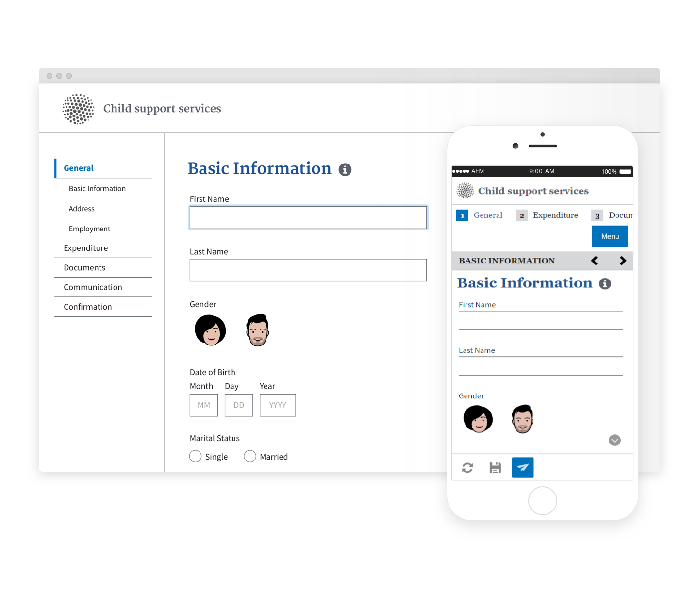

# Temi di riferimento{#reference-themes}

[Temi](../../forms/using/themes.md) consente di applicare uno stile ai moduli senza una profonda conoscenza dei CSS. Oltre al tema predefinito, puoi ottenere i seguenti temi installando il [Pacchetto del componente aggiuntivo AEM Forms](https://experienceleague.adobe.com/docs/experience-manager-release-information/aem-release-updates/forms-updates/aem-forms-releases.html?lang=en):

* Beryl
* Eseg
* Exec-Light
* Libertà
* Ultramarina
* Urbano
* Standard di progettazione Web USA
* Tranquilla

Ogni tema contiene uno stile univoco ed elegante che puoi utilizzare per creare moduli adattivi deliziosi per i tuoi utenti. Contiene uno stile univoco per selettori quali pannello, casella di testo, casella numerica, pulsante di scelta, tabella e interruttore. Gli stili in questi temi sono basati su requisiti. Ad esempio, in uno scenario particolare è necessario un tema minimalista con font puliti. Il tema Liberty ti permette di ottenere questo aspetto.

I temi inclusi in questo pacchetto sono reattivi e lo stile in questi temi è definito per i display mobili e desktop. La maggior parte dei browser moderni su diversi dispositivi può eseguire il rendering di moduli applicati con uno di questi temi senza alcun problema.

Per ulteriori informazioni sull’installazione del pacchetto, consulta [Come utilizzare i pacchetti](/help/sites-administering/package-manager.md).

## Beryl {#beryl}

Il tema Beryl è utilizzato dal modulo adattivo We.Gov e enfatizza l&#39;uso dell&#39;immagine di sfondo, della trasparenza e delle icone grandi e piatte. Nella schermata seguente puoi vedere come si presenta il tema Beryl e come può migliorare lo stile del modulo.

<!--[Click to enlarge

](assets/beryl-1.png)-->

## Eseg {#exec}

Il tema Exec evita riempimenti di sfondo solidi per enfatizzare i componenti del modulo. Se si selezionano e si fa clic sui componenti, i colori dei caratteri vengono modificati. Rispetto al tema predefinito dell&#39;area di lavoro, il colore del carattere del testo nella scheda selezionata diventa blu scuro. Osserva come i pulsanti di navigazione e di invio sono diversi dal tema Beryl.

<!--[Click to enlarge

](assets/exec-1.png)-->

## Luce esecuzione {#exec-light}

Il tema Luce esecuzione utilizza lo spazio bianco per creare un’esperienza fluida. I pulsanti Avanti e Invia consentono di ottenere un riempimento a tinta unita e un&#39;ombreggiatura 3D. Sulle schede selezionate a sinistra compare una freccia invece dei segni di doppio segno di spunta.

<!--[Click to enlarge

](assets/exec-light-1.png)-->

## Libertà {#liberty}

Il tema Liberty usa un approccio minimalista per evidenziare l&#39;importante. Ad esempio, il colore del carattere della scheda visitata diventa verde. È possibile visualizzare solo il bordo inferiore della casella di testo che emula l&#39;aspetto di un modulo cartaceo con righe. La casella di testo attiva ha un bordo inferiore nero, mentre altri hanno un bordo inferiore grigio chiaro.

<!--[Click to enlarge

](assets/liberty-1.png)-->

## Tranquilla {#tranquil}

Il tema Tranquilla fornisce sfumature chiare e scure della combinazione di colori Tranquil per evidenziare diversi componenti di una forma. Ad esempio, i pulsanti di scelta, i pannelli e le schede hanno una tonalità verde diversa.

<!--[Click to enlarge

](assets/tranquil-1.png)-->

## Ultramarina {#ultramarine}

Il tema Ultramarine utilizza tonalità blu profonde per evidenziare componenti quali schede, pannelli, caselle di testo e pulsanti.

<!--[Click to enlarge](assets/ultramarine-1.png)-->

## Urbano {#urbane}

Il tema Urbano enfatizza un aspetto minimalista e funzionale per la tua forma. Quando si applica il tema Urbane al modulo, è possibile vedere che i componenti sono piatti. I pannelli hanno contorni sottili per conferire un aspetto moderno.

<!--[Click to enlarge

](assets/urbane-1.png)-->

## Standard di progettazione Web USA {#u-s-web-design-standards}

Come suggerisce il nome, il tema degli standard di progettazione Web USA utilizza caratteri tipografici e stili descritti nel sito Bozza standard di progettazione Web USA. Lo standard web viene utilizzato dalle organizzazioni federali per creare esperienze web coerenti tra i siti web del governo federale.

<!--[Click to enlarge

](assets/usgov.png)-->
