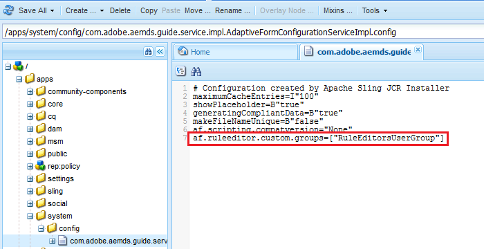

# Concedere l’accesso all’editor di regole a specifici gruppi di utenti{#grant-rule-editor-access-to-select-user-groups}

## Panoramica {#overview}

Puoi avere diversi tipi di utenti con competenze diverse che funzionano con Adaptive Forms. Anche se gli utenti esperti possono avere le conoscenze necessarie per lavorare con script e regole complesse, potrebbero esserci utenti di livello base che devono utilizzare solo il layout e le proprietà di base dei moduli adattivi.

AEM Forms ti consente di limitare l’accesso all’editor di regole agli utenti in base al loro ruolo o funzione. Nelle impostazioni del Servizio di configurazione adattivo di Forms, puoi specificare i [gruppi di utenti](/help/sites-administering/security.md) che possono visualizzare e accedere all&#39;editor di regole.

## Specifica i gruppi di utenti che possono accedere all&#39;editor di regole {#specify-user-groups-that-can-access-rule-editor}

1. Accedi ad AEM Forms come amministratore.
1. Nell&#39;istanza dell&#39;autore, fai clic su Adobe Experience Manager > Strumenti  > Operazioni > Console web. La console Web viene visualizzata in una nuova finestra.

   

1. Nella finestra Console web, individuare e fare clic su **[!UICONTROL Configurazione canale web per moduli adattivi e comunicazioni interattive]**. **[!UICONTROL Viene visualizzata la finestra di dialogo]** Configurazione canale web per modulo adattivo e comunicazione interattiva. Non modificare alcun valore e fare clic su **Salva**.

   Crea un file /apps/system/config/com.adobe.aemds.guide.service.impl.AdaptiveFormConfigurationServiceImpl.config in CRX-repository.

1. Accedi a CRXDE come amministratore. Apri il file /apps/system/config/com.adobe.aemds.guide.service.impl.AdaptiveFormConfigurationServiceImpl.config per la modifica.
1. Utilizzare la seguente proprietà per specificare il nome di un gruppo che può accedere all&#39;editor di regole (ad esempio, RuleEditorsUserGroup) e fare clic su **Salva tutto**.

   `af.ruleeditor.custom.groups=["RuleEditorsUserGroup"]`

   Per abilitare l&#39;accesso per più gruppi, specifica un elenco di valori separati da virgole:

   `af.ruleeditor.custom.groups=["RuleEditorsUserGroup", "PermittedUserGroup"]`

   

   Ora, quando un utente che non fa parte di un gruppo di utenti specificato (in questo caso RuleEditorsUserGroup) tocca un campo, l’icona Modifica regola ( ) non è disponibile per lei nella barra degli strumenti dei componenti:

   

   Barra degli strumenti Componenti visibile a un utente con accesso all’editor di regole

   

   Barra degli strumenti dei componenti visibile per un utente senza accesso all’editor di regole

   Per istruzioni su come aggiungere utenti ai gruppi, consulta [Amministrazione utente e sicurezza](/help/sites-administering/security.md).

