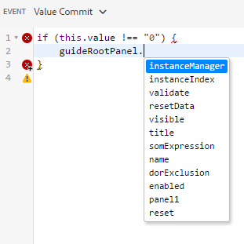
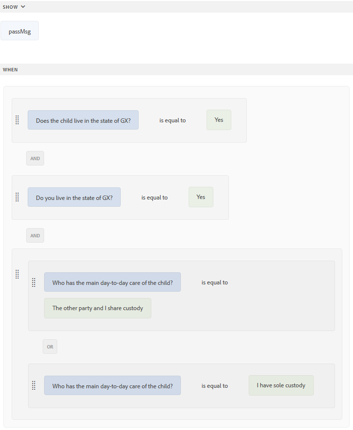
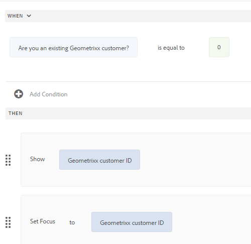
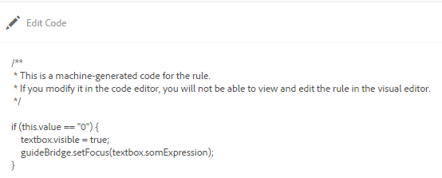

# Editor di regole per moduli adattivi{#adaptive-forms-rule-editor}

<span class="preview"> L’Adobe consiglia di utilizzare l’acquisizione dati moderna ed estensibile [Componenti core](https://experienceleague.adobe.com/docs/experience-manager-core-components/using/adaptive-forms/introduction.html?lang=it) per [creazione di un nuovo Forms adattivo](/help/forms/using/create-an-adaptive-form-core-components.md) o [aggiunta di Forms adattivo alle pagine AEM Sites](/help/forms/using/create-or-add-an-adaptive-form-to-aem-sites-page.md). Questi componenti rappresentano un progresso significativo nella creazione di Forms adattivi, garantendo esperienze utente straordinarie. Questo articolo descrive un approccio precedente all’authoring di Forms adattivi utilizzando i componenti di base. </span>

| Versione | Collegamento articolo |
| -------- | ---------------------------- |
| AEM as a Cloud Service | [Fai clic qui](https://experienceleague.adobe.com/docs/experience-manager-cloud-service/content/forms/adaptive-forms-authoring/authoring-adaptive-forms-foundation-components/add-rules-and-use-expressions-in-an-adaptive-form/rule-editor.html) |
| AEM 6.5 | Questo articolo |

## Panoramica {#overview}

La funzione editor di regole di Adobe Experience Manager Forms consente agli utenti aziendali e agli sviluppatori di Forms di scrivere regole su oggetti modulo adattivi. Queste regole definiscono le azioni da attivare sugli oggetti modulo in base a condizioni preimpostate, input dell&#39;utente e azioni dell&#39;utente sul modulo. Consente di semplificare ulteriormente l’esperienza di compilazione dei moduli, garantendo precisione e velocità.

L’editor di regole fornisce un’interfaccia utente intuitiva e semplificata per scrivere regole. L’editor di regole offre un editor visivo per tutti gli utenti. Inoltre, solo per gli utenti esperti di Forms, l’editor di regole fornisce un editor di codice per scrivere regole e script.
<!-- Some of the key actions that you can perform on adaptive form objects using rules are:

* Show or hide an object
* Enable or disable an object
* Set a value for an object
* Validate the value of an object
* Execute functions to compute the value of an object
* Invoke a form data model service and perform an operation
* Set property of an object -->

L’editor di regole sostituisce le funzionalità di script disponibili in Forms AEM 6.1 e versioni precedenti. Tuttavia, gli script esistenti vengono mantenuti nel nuovo editor di regole. Per ulteriori informazioni sull&#39;utilizzo degli script esistenti nell&#39;editor di regole, vedi [Impatto dell’editor di regole sugli script esistenti](#impact-of-rule-editor-on-existing-scripts).

Gli utenti aggiunti al gruppo forms-power-users possono creare nuovi script e modificare quelli esistenti. Gli utenti del gruppo forms-users possono utilizzare gli script ma non crearli o modificarli.

## Informazioni su una regola {#understanding-a-rule}

Una regola è una combinazione di azioni e condizioni. Nell’editor delle regole, le azioni includono attività quali nascondere, mostrare, abilitare, disabilitare o calcolare il valore di un oggetto in un modulo. Le condizioni sono espressioni booleane che vengono valutate eseguendo controlli e operazioni sullo stato, sul valore o sulla proprietà di un oggetto modulo. Le azioni vengono eseguite in base al valore ( `True` o `False`) restituita valutando una condizione.

L’editor di regole fornisce un set di tipi di regole predefiniti, ad esempio Quando, Mostra, Nascondi, Abilita, Disabilita, Imposta valore di e Convalida, per facilitare la scrittura delle regole. Ogni tipo di regola ti consente di definire condizioni e azioni in una regola. Il documento spiega ulteriormente ogni tipo di regola nei dettagli.

Una regola segue in genere uno dei seguenti costrutti:

**Condizione-Azione** In questo costrutto, una regola definisce prima una condizione seguita da un’azione da attivare. Il costrutto è paragonabile all&#39;istruzione if-then nei linguaggi di programmazione.

Nell’editor delle regole, il **Quando** tipo di regola applica il costrutto condizione-azione.

**Action-Condition** In questo costrutto, una regola definisce prima un’azione da attivare seguita da condizioni per la valutazione. Un’altra variante di questo costrutto è action-condition-alternate action, che definisce anche un’azione alternativa da attivare se la condizione restituisce False.

I tipi di regola Mostra, Nascondi, Abilita, Disabilita, Imposta valore di e Convalida nell&#39;editor di regole applicano il costrutto regola della condizione azione. Per impostazione predefinita, l&#39;azione alternativa per Mostra è Nascondi e per Abilita è Disabilita e viceversa. Non è possibile modificare l&#39;azione alternativa predefinita.

>[!NOTE]
>
>I tipi di regole disponibili, incluse le condizioni e le azioni definite nell&#39;editor di regole, dipendono anche dal tipo di oggetto modulo su cui si sta creando una regola. Nell&#39;editor delle regole vengono visualizzati solo i tipi di regole e le opzioni validi per la scrittura di istruzioni di condizione e azione per un particolare tipo di oggetto modulo. Ad esempio, per un oggetto pannello non vengono visualizzati i tipi di regole Convalida, Imposta valore di, Abilita e Disabilita.

Per ulteriori informazioni sui tipi di regole disponibili nell’editor di regole, consulta [Tipi di regole disponibili nell’editor di regole](#available-rule-types-in-rule-editor).

### Linee guida per la scelta di un costrutto regola {#guidelines-for-choosing-a-rule-construct}

Sebbene sia possibile ottenere la maggior parte dei casi d’uso utilizzando qualsiasi costrutto di regola, di seguito sono riportate alcune linee guida per scegliere un costrutto rispetto a un altro. Per ulteriori informazioni sulle regole disponibili nell’editor di regole, consulta [Tipi di regole disponibili nell’editor di regole](#available-rule-types-in-rule-editor).

* Una regola tipica del pollice durante la creazione di una regola è pensarla nel contesto dell&#39;oggetto su cui si sta scrivendo una regola. Si supponga di voler nascondere o visualizzare il campo B in base al valore specificato dall&#39;utente nel campo A. In questo caso, si sta valutando una condizione nel campo A e, in base al valore restituito, si sta attivando un&#39;azione nel campo B.

  Pertanto, se si scrive un regola sul campo B (l&#39;oggetto su cui si sta valutando una condizione), utilizzare il costrutto condizione-azione o il tipo di regola Quando. Analogamente, utilizzare il costrutto azione-condizione o Mostra o Nascondi tipo di regola nel campo A.

* A volte, è necessario eseguire più azioni in base a una condizione. In questi casi, si consiglia di utilizzare il costrutto condizione-azione. In questo costrutto, puoi valutare una condizione una sola volta e specificare più istruzioni di azione.

  Ad esempio, per nascondere i campi B, C e D in base alla condizione che verifica il valore specificato dall&#39;utente nel campo A, scrivere una regola con il costrutto condizione-azione o il tipo di regola When nel campo A e specificare azioni per controllare la visibilità dei campi B, C e D. In caso contrario, sono necessarie tre regole separate per i campi B, C e D, in cui ogni regola controlla la condizione e mostra o nasconde il rispettivo campo. In questo esempio, è più efficiente scrivere il tipo di regola When su un oggetto anziché Show o Hide su tre oggetti.

* Per attivare un’azione in base a più condizioni, si consiglia di utilizzare il costrutto azione-condizione. Ad esempio, per visualizzare e nascondere campo A valutando le condizioni nei campi B, C e D, utilizzare Mostra o Nascondi regola digitare nel campo A.
* Utilizza il costrutto condizione-azione o condizione azione se la regola contiene un’azione per una condizione.
* Se una regola verifica la presenza di una condizione ed esegue immediatamente un&#39;azione quando fornisce un valore in un campo o esce da un campo, si consiglia di scrivere una regola con il costrutto condizione-azione o il tipo di regola When nel campo in cui viene valutata la condizione.
* La condizione nella regola When viene valutata quando un utente modifica il valore dell&#39;oggetto su cui viene applicata la regola When. Tuttavia, se desideri che l’azione si attivi quando il valore cambia sul lato server, come nel caso di precompilazione del valore, è consigliabile scrivere una regola When che attivi l’azione quando il campo viene inizializzato.
* Quando si scrivono regole per gli oggetti menu a discesa, pulsanti di scelta o caselle di controllo, le opzioni o i valori di tali oggetti modulo nel modulo vengono precompilati nell’editor di regole.

## Tipi di operatori ed eventi disponibili nell’editor di regole {#available-operator-types-and-events-in-rule-editor}

L’editor di regole fornisce i seguenti operatori logici ed eventi utilizzando i quali è possibile creare regole.

* **È uguale a**
* **Non è uguale a**
* **Inizia con**
* **Termina con**
* **Contiene**
* **È vuoto**
* **Non è vuoto**
* **Ha selezionato:** Restituisce true quando l’utente seleziona una particolare opzione per una casella di controllo, un elenco a discesa o un pulsante di scelta.
* **È inizializzato (evento):** Restituisce true quando viene eseguito il rendering di un oggetto modulo nel browser.
* **Viene modificato (evento):** Restituisce true quando l&#39;utente modifica il valore immesso o l&#39;opzione selezionata per un oggetto modulo.

## Tipi di regole disponibili nell’editor di regole {#available-rule-types-in-rule-editor}

L’editor di regole fornisce un set di tipi di regole predefiniti che è possibile utilizzare per scrivere regole. Esaminiamo in dettaglio ogni tipo di regola. Per ulteriori informazioni sulla scrittura di regole nell’editor di regole, consulta [Scrivi regole](#write-rules).

### Quando   {#whenruletype}

Il **Quando** il tipo di regola segue **condizione-azione-azione-azione alternativa** costrutto della regola o, a volte, solo **condizione-azione** costruzione. In questo tipo di regola, devi innanzitutto specificare una condizione per la valutazione seguita da un&#39;azione da attivare se la condizione viene soddisfatta ( `True`). Quando si utilizza il tipo di regola When, è possibile utilizzare più operatori AND e OR per creare [espressioni nidificate](#nestedexpressions).

Utilizzando il tipo di regola When, è possibile valutare una condizione in un oggetto modulo ed eseguire azioni su uno o più oggetti.

In parole povere, un tipico Quando regola è strutturato come segue:

`When on Object A:`

`(Condition 1 AND Condition 2 OR Condition 3) is TRUE;`

`Then, do the following:`

Azione 2 sull&#39;oggetto B;
E
Azione 3 sull&#39;oggetto C;

_

Quando si dispone di un componente con più valori, ad esempio pulsanti di scelta o elenco, durante la creazione di una regola per tale componente le opzioni vengono recuperate e rese disponibili automaticamente al creatore della regola. Non è necessario digitare nuovamente i valori delle opzioni.

Ad esempio, un elenco include quattro opzioni: Rosso, Blu, Verde e Giallo. Durante la creazione della regola, le opzioni (pulsanti di scelta) vengono recuperate automaticamente e rese disponibili al creatore della regola come segue:


Durante la scrittura di una regola When, puoi attivare l&#39;azione Cancella valore di. Cancella valore dell&#39;azione cancella il valore dell&#39;oggetto specificato. L&#39;opzione Clear Value (Cancella valore) nell&#39;istruzione When consente di creare condizioni complesse con più campi.


**Nascondi** Nasconde l&#39;oggetto specificato.

**Spettacolo** Mostra l&#39;oggetto specificato.

**Abilita** Attiva l&#39;oggetto specificato.

**Disattiva** Disattiva l&#39;oggetto specificato.

**Richiama servizio** Richiama un servizio configurato in un modello dati modulo. Quando scegli l’operazione Richiama servizio, viene visualizzato un campo. Quando tocca il campo, vengono visualizzati tutti i servizi configurati in tutti i modelli di dati dei moduli nell’istanza AEM. Quando si sceglie un servizio modello dati modulo, vengono visualizzati campi aggiuntivi in cui è possibile mappare gli oggetti modulo con i parametri di input e output per il servizio specificato. Vedi regola di esempio per richiamare i servizi del modello dati modulo.

Oltre al servizio del modello dati modulo, è possibile specificare un URL WSDL diretto per richiamare un servizio Web. Tuttavia, un servizio di modello dati modulo presenta molti vantaggi e l’approccio consigliato per richiamare un servizio.

Per ulteriori informazioni sulla configurazione dei servizi nel modello dati modulo, vedi [Integrazione dei dati di AEM Forms](/help/forms/using/data-integration.md).

**Imposta valore di** Calcola e imposta il valore dell&#39;oggetto specificato. È possibile impostare il valore dell&#39;oggetto su una stringa, il valore di un altro oggetto, il valore calcolato utilizzando un&#39;espressione matematica o una funzione, il valore di una proprietà di un oggetto o il valore di output di un servizio del modello dati del modulo configurato. Quando scegli l’opzione Servizio web, vengono visualizzati tutti i servizi configurati in tutti i modelli di dati del modulo nell’istanza AEM. Quando si sceglie un servizio modello dati modulo, vengono visualizzati campi aggiuntivi in cui è possibile mappare gli oggetti modulo con i parametri di input e output per il servizio specificato.

Per ulteriori informazioni sulla configurazione dei servizi nel modello dati modulo, vedi [Integrazione dei dati di AEM Forms](/help/forms/using/data-integration.md).

Il **[!UICONTROL Imposta proprietà]** tipo di regola consente di impostare il valore di una proprietà dell&#39;oggetto specificato in base a un&#39;azione condizione. È possibile impostare la proprietà su una delle seguenti opzioni:

* visibile (booleano)
* dorExclusion (booleano)
* chartType (String)
* title (Stringa)
* abilitato (booleano)
* obbligatorio (booleano)
* validationsDisabled (booleano)
* validateExpMessage (Stringa)
* valore (Numero, Stringa, Data)
* items (List)
* valido (booleano)
* errorMessage (stringa)

Consente di definire regole per aggiungere caselle di controllo in modo dinamico al modulo adattivo. È possibile utilizzare una funzione personalizzata, un oggetto modulo o una proprietà oggetto per definire una regola.


Per definire una regola basata su una funzione personalizzata, seleziona **Uscita funzione** dall&#39;elenco a discesa e trascinare una funzione personalizzata dall&#39;elenco **Funzioni** scheda. Se l’azione della condizione viene soddisfatta, il numero di caselle di controllo definite nella funzione personalizzata viene aggiunto al modulo adattivo.

Per definire una regola basata su un oggetto modulo, selezionare **Oggetto modulo** dall&#39;elenco a discesa e trascinare un oggetto modulo dal **Oggetti modulo** scheda. Se l’azione della condizione viene soddisfatta, il numero di caselle di controllo definite nell’oggetto modulo viene aggiunto al modulo adattivo.

Una regola Imposta proprietà basata su una proprietà oggetto consente di aggiungere il numero di caselle di controllo in un modulo adattivo basato su un’altra proprietà oggetto inclusa nel modulo adattivo.

La figura seguente illustra un esempio di aggiunta dinamica di caselle di controllo in base al numero di elenchi a discesa nel modulo adattivo:


**Cancella valore di** Cancella il valore dell&#39;oggetto specificato.

**Imposta Fuoco** Imposta lo stato attivo sull&#39;oggetto specificato.

**Salva modulo** Salva il modulo.

**Invia Forms** Invia il modulo.

**Reimposta modulo** Reimposta il modulo.

**Convalida modulo** Convalida il modulo.

**Aggiungi istanza** Aggiunge un&#39;istanza del pannello o della riga di tabella ripetibile specificata.

**Rimuovi istanza** Rimuove un&#39;istanza del pannello o della riga di tabella ripetibile specificata.

**Accedi a** Passa ad altre comunicazioni interattive, moduli adattivi, altre risorse come immagini o frammenti di documenti o un URL esterno. Per ulteriori informazioni, consulta [Pulsante Aggiungi alla comunicazione interattiva](../../forms/using/create-interactive-communication.md#addbuttontothewebchannel).

### Imposta valore di {#set-value-of}

Il **[!UICONTROL Imposta valore di]** tipo di regola consente di impostare il valore di un oggetto modulo a seconda che la condizione specificata sia soddisfatta o meno. Il valore può essere impostato sul valore di un altro oggetto, una stringa letterale, un valore derivato da un&#39;espressione matematica o una funzione, un valore di una proprietà di un altro oggetto o l&#39;output di un servizio modello dati modulo. Analogamente, è possibile verificare la presenza di una condizione su un componente, una stringa, una proprietà o valori derivati da una funzione o un&#39;espressione matematica.

Il tipo di regola Imposta valore non è disponibile per tutti gli oggetti modulo, ad esempio pannelli e pulsanti della barra degli strumenti. Una regola Set Value Of standard ha la seguente struttura:


Imposta il valore dell&#39;oggetto A su:

(stringa ABC) O
(proprietà oggetto X dell&#39;oggetto C) O
(valore da una funzione) O
(valore da un&#39;espressione matematica) O
(valore di output di un servizio modello di dati o di un servizio Web);

Quando (facoltativo):

(Condizione 1 E Condizione 2 E Condizione 3) è VERO;


Nell&#39;esempio seguente il valore nel campo viene preso come `dependentid` input e il valore del `Relation` campo viene impostato sull&#39;output dell&#39;argomento `Relation` del servizio modello dati `getDependent` modulo.


Esempio di regola Imposta valore tramite il servizio modello dati modulo

>[!NOTE]
>
>Inoltre, è possibile utilizzare Imposta valore della regola per compilare tutti i valori in un componente elenco a discesa dall’output di un servizio modello dati modulo o di un servizio web. Verificare tuttavia che l&#39;argomento di output scelto sia di tipo matrice. Tutti i valori restituiti in un array diventano disponibili nell’elenco a discesa specificato.

### Mostra {#show}

Utilizzo di **Spettacolo** tipo di regola, è possibile scrivere una regola per mostrare o nascondere un oggetto modulo a seconda che una condizione sia soddisfatta o meno. Il tipo di regola Mostra attiva anche l’azione Nascondi se la condizione non viene soddisfatta o restituisce `False`.

Una regola Show tipica è strutturata come segue:


`Show Object A;`

`When:`

`(Condition 1 OR Condition 2 OR Condition 3) is TRUE;`

`Else:`

`Hide Object A;`


### Nascondi {#hide}

Simile al tipo di regola Mostra, puoi utilizzare **Nascondi** tipo di regola per mostrare o nascondere un oggetto modulo in base al soddisfacimento o meno di una condizione. Il tipo di regola Nascondi attiva anche l&#39;azione Mostra nel caso in cui la condizione non sia soddisfatta o restituisca `False`.

Una tipica regola Nascondi è strutturata come segue:


`Hide Object A;`

`When:`

`(Condition 1 AND Condition 2 AND Condition 3) is TRUE;`

`Else:`

`Show Object A;`


### Abilita {#enable}

Il **Abilita** tipo di regola consente di abilitare o disabilitare un oggetto modulo a seconda che una condizione sia soddisfatta o meno. Il tipo di regola Enable attiva anche l&#39;azione Disable nel caso in cui la condizione non sia soddisfatta o restituisca `False`.

Una regola di abilitazione tipica è strutturata come segue:


`Enable Object A;`

`When:`

`(Condition 1 AND Condition 2 AND Condition 3) is TRUE;`

`Else:`

`Disable Object A;`


### Disattiva {#disable}

Simile al tipo di regola Abilita, il **Disattiva** tipo di regola consente di abilitare o disabilitare un oggetto modulo a seconda che una condizione sia soddisfatta o meno. Il tipo di regola Disable attiva anche l’azione Enable nel caso in cui la condizione non sia soddisfatta o restituisca `False`.

Una regola di Disattivazione tipica è strutturata come segue:


`Disable Object A;`

`When:`

`(Condition 1 OR Condition 2 OR Condition 3) is TRUE;`

`Else:`

`Enable Object A;`

### Convalida {#validate}

Il **Convalida** tipo di regola convalida il valore in un campo utilizzando un&#39;espressione. È ad esempio possibile scrivere un&#39;espressione per verificare che la casella di testo per specificare il nome non contenga caratteri o numeri speciali.

Una regola di convalida tipica è strutturata come segue:

`Validate Object A;`

`Using:`

`(Expression 1 AND Expression 2 AND Expression 3) is TRUE;`

>[!NOTE]
>
>Se il valore specificato non è conforme alla regola di convalida, è possibile visualizzare un messaggio di convalida per l&#39;utente. Puoi specificare il messaggio nel **[!UICONTROL Messaggio di convalida script]** nelle proprietà del componente nella barra laterale.


### Imposta opzioni di {#setoptionsof}

Il **Imposta opzioni di** tipo di regola consente di definire regole per aggiungere caselle di controllo in modo dinamico al modulo adattivo. Per definire la regola è possibile utilizzare un modello di dati modulo o una funzione personalizzata.

Per definire una regola basata su una funzione personalizzata, seleziona **Uscita funzione** dall&#39;elenco a discesa e trascinare una funzione personalizzata dall&#39;elenco **Funzioni** scheda. Al modulo adattivo viene aggiunto il numero di caselle di controllo definite nella funzione personalizzata.


Per creare una funzione personalizzata, vedi [funzioni personalizzate nell’editor di regole](#custom-functions).

Per definire una regola basata su un modello dati modulo:

1. Seleziona **Output del servizio** dall’elenco a discesa.
1. Seleziona l’oggetto modello dati.
1. Selezionare una proprietà dell’oggetto modello dati dal menu **Visualizza valore** elenco a discesa. Il numero di caselle di controllo nel modulo adattivo è derivato dal numero di istanze definite per tale proprietà nel database.
1. Selezionare una proprietà dell’oggetto modello dati dal menu **Salva valore** elenco a discesa.


## Interfaccia utente dell’editor di regole {#understanding-the-rule-editor-user-interface}

L’editor di regole fornisce un’interfaccia utente completa ma semplice per scrivere e gestire le regole. Puoi avviare l’interfaccia utente dell’editor di regole da un modulo adattivo in modalità authoring.

Per avviare l’interfaccia utente dell’editor di regole:

1. Apri un modulo adattivo in modalità di authoring.
1. Selezionare l&#39;oggetto modulo per il quale si desidera scrivere una regola e nella barra degli strumenti del componente selezionare . Viene visualizzata l’interfaccia utente dell’editor di regole.

   

   Tutte le regole esistenti sugli oggetti modulo selezionati sono elencate in questa visualizzazione. Per informazioni sulla gestione delle regole esistenti, consulta [Gestisci regole](#manage-rules).

1. Seleziona **[!UICONTROL Crea]** per scrivere una nuova regola. L’editor visivo dell’interfaccia utente dell’editor di regole si apre per impostazione predefinita quando si avvia l’editor di regole la prima volta.

   

Esaminiamo in dettaglio ogni componente dell’interfaccia utente dell’editor di regole.

### A. Visualizzazione delle regole dei componenti {#a-component-rule-display}

Visualizza il titolo dell’oggetto modulo adattivo tramite il quale è stato avviato l’editor di regole e il tipo di regola attualmente selezionato. Nell’esempio precedente, l’editor di regole viene avviato da un oggetto modulo adattivo denominato Stipendio e il tipo di regola selezionato è Quando.

### B. Oggetti e funzioni del modulo {#b-form-objects-and-functions-br}

Il riquadro a sinistra nell’interfaccia utente dell’editor di regole include due schede: **[!UICONTROL Oggetti Forms]** e **[!UICONTROL Funzioni]**.

La scheda Oggetti modulo mostra una vista gerarchica di tutti gli oggetti contenuti nel modulo adattivo. Visualizza il titolo e il tipo degli oggetti. Durante la scrittura di una regola, è possibile trascinare gli oggetti modulo nell’editor di regole. Quando si trascina un oggetto o una funzione in un segnaposto durante la creazione o la modifica di una regola, il segnaposto assume automaticamente il tipo di valore appropriato.

Gli oggetti modulo a cui sono applicate una o più regole valide sono contrassegnati da un punto verde. Se una delle regole applicate a un oggetto modulo non è valida, l&#39;oggetto modulo viene contrassegnato con un punto giallo.

Il scheda Funzioni include un insieme di funzioni predefinite, quali Somma di, Min di, Massimo di, Media di, Numero di e Convalida modulo. È possibile utilizzare queste funzioni per calcolare valori in pannelli e righe di tabella ripetibili e utilizzarli in istruzioni di azione e condizione durante la scrittura di regole. Tuttavia, è possibile creare [anche funzioni](#custom-functions) personalizzate.


>[!NOTE]
>
>È possibile eseguire la ricerca di testo su oggetti e funzioni, nomi e titoli nelle schede Oggetti e funzioni di Forms.

Nell&#39;albero sinistro degli oggetti modulo è possibile selezionare gli oggetti modulo per visualizzare le regole applicate a ciascuno degli oggetti. Non solo è possibile spostarsi tra le regole dei vari oggetti modulo, ma è anche possibile copiare e incollare le regole tra gli oggetti modulo. Per ulteriori informazioni, consulta [Regole di copia e incolla](#copy-paste-rules).

### C. Attivazione/disattivazione di funzioni e oggetti modulo {#c-form-objects-and-functions-toggle-br}

Quando viene toccato, questo pulsante attiva o disattiva il riquadro delle funzioni e degli oggetti del modulo.

### D. Editor di regole visive {#d-visual-rule-editor}

L’editor di regole visive è l’area in cui si scrivono le regole nella modalità editor visivo dell’interfaccia utente dell’editor di regole. Ti consente di selezionare un tipo di regola e di definire di conseguenza condizioni e azioni. Quando si definiscono condizioni e azioni in una regola, è possibile trascinare gli oggetti modulo e le funzioni dal riquadro Oggetti modulo e funzioni.

Per ulteriori informazioni sull’utilizzo dell’editor di regole visive, consulta [Scrivi regole](#write-rules).

### E. Commutatore editor di codice visivo {#e-visual-code-editors-switcher}

Gli utenti del gruppo forms-power-users possono accedere all’editor di codice. Per altri utenti, l’editor di codice non è disponibile. Se disponi dei diritti di, puoi passare dalla modalità editor visivo alla modalità editor di codice dell’editor di regole e viceversa, utilizzando il selettore posto sopra l’editor di regole. Quando avvii l’editor di regole la prima volta, si apre in modalità editor visivo. Puoi scrivere regole in modalità editor visivo o passare alla modalità editor di codice per scrivere uno script di regole. Tuttavia, tieni presente che se modifichi una regola o ne scrivi una nell’editor di codice, non puoi tornare all’editor visivo per tale regola a meno che non annulli l’editor di codice.

AEM Forms tiene traccia della modalità editor di regole utilizzata per ultima per scrivere una regola. La prossima volta che avvii l’editor di regole, si apre in tale modalità. Tuttavia, puoi anche configurare una modalità predefinita per aprire l’editor di regole nella modalità specificata. Per eseguire questa operazione:

1. Vai alla console web dell’AEM all’indirizzo `https://[host]:[port]/system/console/configMgr`.
1. Fai clic per modificare **[!UICONTROL Configurazione di un modulo adattivo e di un canale web di comunicazione interattiva]**.
1. scegli **[!UICONTROL Editor visivo]** o **[!UICONTROL Editor di codice]** dal **[!UICONTROL Modalità predefinita per l’editor di regole]** elenco a discesa

1. Fai clic su **[!UICONTROL Salva]**.

### F. Tasti Done e cancel {#f-done-and-cancel-buttons}

Il **[!UICONTROL Fine]** per salvare una regola. È possibile salvare una regola incompleta. Tuttavia, i dati incompleti non sono validi e non vengono eseguiti. Le regole salvate su un oggetto modulo vengono elencate quando si avvia l’editor di regole la prossima volta dallo stesso oggetto modulo. Puoi gestire le regole esistenti in tale vista. Per ulteriori informazioni, consulta [Gestisci regole](#manage-rules).

Il **[!UICONTROL Annulla]** il pulsante elimina tutte le modifiche apportate a una regola e chiude l’editor di regole.

## Scrivi regole {#write-rules}

Puoi scrivere regole utilizzando l’editor di regole visive o l’editor di codice. Quando avvii l’editor di regole la prima volta, si apre in modalità editor visivo. Puoi passare alla modalità editor di codice e scrivere regole. Tuttavia, tieni presente che se scrivi o modifichi una regola nell’editor di codice, non puoi passare all’editor visivo per tale regola a meno che non annulli l’editor di codice. La prossima volta che avvii l’editor di regole, questo si apre nella modalità utilizzata per ultima per creare la regola.

Vediamo innanzitutto come scrivere regole utilizzando l’editor visivo.

### Utilizzo dell’editor visivo {#using-visual-editor}

Comprendiamo come creare una regola nell’editor visivo utilizzando il seguente modulo di esempio.


La sezione Requisiti del prestito nell&#39;esempio di modulo di domanda di prestito richiede ai richiedenti di specificare il loro stato civile, lo stipendio e, in caso di matrimonio, lo stipendio del coniuge. In base agli input dell’utente, la regola calcola l’importo di idoneità al prestito e viene visualizzata nel campo Idoneità al prestito. Per implementare lo scenario, applica le seguenti regole:

* Il campo Stipendio coniuge viene visualizzato solo quando lo stato civile è sposato.
* L’importo di ammissibilità al prestito è pari al 50% dello stipendio totale.

Per scrivere le regole, effettua le seguenti operazioni:

1. Innanzitutto, scrivi la regola per controllare la visibilità del campo Stipendio coniuge in base all’opzione selezionata dall’utente per il pulsante di opzione Stato civile.

   Apri il modulo di richiesta di prestito in modalità di creazione. Seleziona la **Stato civile** componente e seleziona . Quindi, seleziona **[!UICONTROL Crea]** per avviare l’editor di regole.

   

   Quando si avvia l&#39;editor di regole, la regola When è selezionata per impostazione predefinita. Inoltre, l&#39;oggetto modulo (in questo caso, Stato civile) da cui è stato avviato l&#39;editor di regole è specificato nell&#39;istruzione When.

   Sebbene non sia possibile modificare l&#39;oggetto selezionato, è possibile utilizzare l&#39;elenco a discesa delle regole, come illustrato di seguito, per selezionare un altro tipo di regola. Se desideri creare una regola su un altro oggetto, seleziona Annulla per uscire dall’editor di regole e riavviarlo dall’oggetto modulo desiderato.

1. Seleziona **[!UICONTROL Seleziona stato]** a discesa e selezionare **[!UICONTROL è uguale a]**. Il **[!UICONTROL Inserisci una stringa]** viene visualizzato.

   

   Nel pulsante di opzione Stato civile, **Coniugato** e **Singolo** opzioni assegnate **0** e **1** rispettivamente. È possibile verificare i valori assegnati nella scheda Titolo della finestra di dialogo Modifica pulsante di opzione, come illustrato di seguito.

   

1. In **Inserisci una stringa** nella regola, specifica **0**.

   

   La condizione è stata definita come `When Marital Status is equal to Married`. Quindi, definisci l’azione da eseguire se questa condizione è True.

1. Nell&#39;istruzione Then, selezionare **[!UICONTROL Spettacolo]** dal **[!UICONTROL Seleziona azione]** a discesa.

   

1. Trascina la selezione **Stipendio coniuge** dalla scheda Oggetti modulo nella **Rilascia l&#39;oggetto o seleziona qui** campo. In alternativa, seleziona la **Rilascia l&#39;oggetto o seleziona qui** e selezionare il **Stipendio coniuge** dal menu a comparsa, che elenca tutti gli oggetti modulo del modulo.

   

   La regola viene visualizzata come segue nell’editor di regole.

   

   Seleziona **Fine** per salvare la regola.

1. Ripetere i passaggi da 1 a 5 per definire un&#39;altra regola per nascondere il campo Stipendio coniuge se lo stato civile è Singolo. La regola viene visualizzata come segue nell’editor di regole.

   

   >[!NOTE]
   >
   >In alternativa, è possibile scrivere una regola Mostra nel campo Stipendio coniuge, anziché due regole Quando nel campo Stato civile, per implementare lo stesso comportamento.

   

1. Scrivere quindi una regola per calcolare l&#39;importo dell&#39;idoneità al prestito, che corrisponde al 50% dello stipendio totale, e visualizzarlo nel campo Idoneità al prestito. Per ottenere questo risultato, crea **Imposta valore di** regole sul campo Ammissibilità al prestito.

   In modalità authoring, seleziona la **[!UICONTROL Ammissibilità al prestito]** e seleziona . Quindi, seleziona **[!UICONTROL Crea]** per avviare l’editor di regole.

1. Seleziona **[!UICONTROL Imposta valore di]** regola dal menu a discesa regola.

   

1. Seleziona **[!UICONTROL Seleziona opzione]** e seleziona **[!UICONTROL Espressione matematica]**. Viene aperto un campo per scrivere espressioni matematiche.

   

1. Nel campo espressione:

   * Seleziona o trascina dalla scheda Oggetto Forms il **Salario** campo nel primo **Rilascia l&#39;oggetto o seleziona qui** campo.

   * Seleziona **Più** dal **Seleziona operatore** campo.

   * Seleziona o trascina dalla scheda Oggetto Forms il **Stipendio coniuge** campo nell&#39;altro **Rilascia l&#39;oggetto o seleziona qui** campo.

   

1. Quindi, seleziona nell’area evidenziata intorno al campo espressione e seleziona **Estendi estensione**.

   

   Nel campo espressione estesa, seleziona **diviso per** dal **Seleziona operatore** campo e **Numero** dal **Seleziona opzione** campo. Quindi, specifica **2** nel campo numerico.

   

   >[!NOTE]
   >
   >È possibile creare espressioni complesse utilizzando componenti, funzioni, espressioni matematiche e valori di proprietà dal campo Seleziona opzione.

   Quindi, crea una condizione, che quando restituisce True, l’espressione viene eseguita.

1. Seleziona **Aggiungi condizione** per aggiungere un&#39;istruzione When.

   

   Nell&#39;istruzione When:

   * Seleziona o trascina dalla scheda Oggetto Forms il **Stato civile** campo nel primo **Rilascia l&#39;oggetto o seleziona qui** campo.

   * Seleziona i **s uguale a** dal **Seleziona operatore** campo.

   * Seleziona stringa nell’altro **Rilascia l&#39;oggetto o seleziona qui** e specificare **Coniugato** nel **Inserisci una stringa** campo.

   La regola viene infine visualizzata come segue nell’editor di regole.  

   Seleziona **Fine** per salvare la regola.

1. Ripetere i passaggi da 7 a 12 per definire un&#39;altra regola per calcolare l&#39;idoneità al prestito se lo stato civile è Single. La regola viene visualizzata come segue nell’editor di regole.

   

>[!NOTE]
>
>In alternativa, è possibile utilizzare la regola Imposta valore di per calcolare l&#39;idoneità al prestito nella regola Quando creata per mostrare-nascondere il campo Stipendio coniuge. La regola combinata risultante quando Stato civile è Singolo viene visualizzata come segue nell’editor delle regole.
>
>Analogamente, è possibile scrivere una regola combinata per controllare la visibilità del campo Stipendio coniuge e calcolare l&#39;idoneità al prestito quando lo stato civile è Coniugato.


### Utilizzo dell’editor di codice {#using-code-editor}

Gli utenti aggiunti al gruppo forms-power-users possono utilizzare l’editor di codice. L’editor di regole genera automaticamente il codice JavaScript per qualsiasi regola creata utilizzando l’editor visivo. Puoi passare dall’editor visivo all’editor di codice per visualizzare il codice generato. Tuttavia, se modifichi il codice della regola nell’editor di codice, non puoi tornare all’editor visivo. Se preferisci scrivere le regole nell’editor di codice anziché nell’editor visivo, puoi scriverle nuovamente nell’editor di codice. Il selettore dell’editor di codice visivo consente di passare da una modalità all’altra.

L’editor di codice JavaScript è il linguaggio di espressione dei moduli adattivi. Tutte le espressioni sono espressioni JavaScript valide e utilizzano API di modelli di script per moduli adattivi. Queste espressioni restituiscono valori di determinati tipi. Per l’elenco completo delle classi, degli eventi, degli oggetti e delle API pubbliche dei moduli adattivi, consulta [Riferimento API della libreria JavaScript per i moduli adattivi](https://helpx.adobe.com/experience-manager/6-5/forms/javascript-api/index.html).

Per ulteriori informazioni sulle linee guida per la scrittura di regole nell’editor di codice, consulta [Espressioni modulo adattivo](/help/forms/using/adaptive-form-expressions.md).

Durante la scrittura di codice JavaScript nell’editor di regole, i seguenti suggerimenti visivi sono utili per la struttura e la sintassi:

* Luci di sintassi
* Rientro automatico
* Suggerimenti e suggerimenti per oggetti Form, funzioni e relative proprietà
* Completamento automatico dei nomi dei componenti modulo e delle funzioni JavaScript comuni



#### Funzioni personalizzate nell’editor di regole {#custom-functions}

Oltre alle funzioni predefinite, come *Somma di* elencate in Output funzioni, è possibile scrivere funzioni personalizzate che sono spesso necessarie. Assicurati che la funzione che scrivi sia accompagnata dal `jsdoc` sopra di esso.

Accompagnamento `jsdoc` è obbligatorio:

* Se desideri una configurazione e una descrizione personalizzate
* Perché esistono diversi modi per dichiarare una funzione in `JavaScript,` I commenti e consentono di tenere traccia delle funzioni.

Per ulteriori informazioni, consulta [usejsdoc.org](https://jsdoc.app/).

Supportato `jsdoc` tag:

* **Privato**
Sintassi: `@private`
Una funzione privata non è inclusa come funzione personalizzata.

* **Nome**
Sintassi: `@name funcName <Function Name>`
In alternativa `,` puoi utilizzare: `@function funcName <Function Name>` **o** `@func` `funcName <Function Name>`.
  `funcName` è il nome della funzione (non sono consentiti spazi).
  `<Function Name>` è il nome visualizzato della funzione.

* **Membro**
Sintassi: `@memberof namespace`
Associa uno spazio dei nomi alla funzione.

* **Parametro**
Sintassi: `@param {type} name <Parameter Description>`
In alternativa, puoi utilizzare: `@argument` `{type} name <Parameter Description>` **o** `@arg` `{type}` `name <Parameter Description>`.
Mostra i parametri utilizzati dalla funzione. Una funzione può avere più tag di parametri, uno per ogni parametro in ordine di occorrenza.
  `{type}` rappresenta il tipo di parametro. I tipi di parametri consentiti sono:

   1. stringa
   1. numero
   1. booleano
   1. ambito

  L’ambito viene utilizzato per fare riferimento ai campi di un modulo adattivo. Quando un modulo utilizza il caricamento lento, è possibile utilizzare `scope` per accedere ai relativi campi. È possibile accedere ai campi quando sono caricati o se sono contrassegnati come globali.

  Tutti gli altri tipi di parametri sono classificati in una delle categorie precedenti. Nessuno non è supportato. Accertati di selezionare uno dei tipi riportati sopra. I tipi non fanno distinzione tra maiuscole e minuscole. Il parametro non può contenere spazi `name`. `<Parameter Descrption>` `<parameter>  can have multiple words. </parameter>`

* **Tipo restituito**
Sintassi: `@return {type}`
In alternativa, puoi utilizzare `@returns {type}`.
Aggiunge informazioni sulla funzione, ad esempio l&#39;obiettivo.
{type} rappresenta il tipo restituito della funzione. I tipi restituiti consentiti sono:

   1. stringa
   1. numero
   1. booleano

  Tutti gli altri tipi di reso sono classificati in una delle categorie precedenti. Nessuno non è supportato. Accertati di selezionare uno dei tipi riportati sopra. I tipi restituiti non fanno distinzione tra maiuscole e minuscole.

* **Questo**
Sintassi: `@this currentComponent`

  Utilizza @this per fare riferimento al componente Modulo adattivo su cui è scritta la regola.

  L’esempio seguente è basato sul valore del campo. Nell&#39;esempio seguente, la regola nasconde un campo nel modulo. Il `this` parte di `this.value` fa riferimento al componente modulo adattivo sottostante, su cui viene scritta la regola.

  ```
     /**
     * @function myTestFunction
     * @this currentComponent
     * @param {scope} scope in which code inside function will be executed.
     */
     myTestFunction = function (scope) {
        if(this.value == "O"){
              scope.age.visible = true;
        } else {
           scope.age.visible = false;
        }
     }
  ```

>[!NOTE]
>
>I commenti prima della funzione personalizzata vengono utilizzati per il riepilogo. Il riepilogo può estendersi su più righe fino a quando non viene rilevato un tag. Limita le dimensioni a un singolo per una descrizione concisa nel generatore di regole.

**Aggiunta di una funzione personalizzata**

Ad esempio, si desidera aggiungere una funzione personalizzata che calcola l&#39;area di un quadrato. La lunghezza laterale è l’input dell’utente per la funzione personalizzata, che viene accettata utilizzando una casella numerica nel modulo. L&#39;output calcolato viene visualizzato in un&#39;altra casella numerica del modulo. Per aggiungere una funzione personalizzata, devi innanzitutto creare una libreria client e quindi aggiungerla all’archivio CRX.

Per creare una libreria client e aggiungerla all’archivio CRX, effettua le seguenti operazioni.

1. Crea una libreria client. Per ulteriori informazioni, consulta [Utilizzo delle librerie lato client](/help/sites-developing/clientlibs.md).
1. In CRXDE, aggiungi una proprietà `categories`con valore di tipo stringa come `customfunction` al `clientlib` cartella.

   >[!NOTE]
   >
   >`customfunction`è una categoria di esempio. È possibile scegliere qualsiasi nome per la categoria creata in `clientlib`cartella.

Dopo aver aggiunto la libreria client nell’archivio CRX, utilizzala nel modulo adattivo. Ti consente di utilizzare la funzione personalizzata come regola nel modulo. Per aggiungere la libreria client nel modulo adattivo, effettua le seguenti operazioni.

1. Apri il modulo in modalità di modifica.
Per aprire un modulo in modalità di modifica, selezionare un modulo e selezionare **Apri**.
1. In modalità di modifica, seleziona un componente, quindi fai clic su  > **Contenitore modulo adattivo** e quindi selezionare .
1. Nella barra laterale, in Nome della libreria client, aggiungi la libreria client. ( `customfunction` nell&#39;esempio.)

   

1. Selezionare la casella numerica di input e selezionare  per aprire l’editor di regole.
1. Seleziona **Crea regola**. Utilizzando le opzioni illustrate di seguito, creare una regola per salvare il valore al quadrato dell&#39;input nel campo Output del modulo.
   [](assets/add-custom-rule.png)Seleziona **Fine**. Viene aggiunta la funzione personalizzata.

#### Tipi supportati da dichiarazione di funzione {#function-declaration-supported-types}

**Istruzione Function**

```javascript
function area(len) {
    return len*len;
}
```

Questa funzione è inclusa senza `jsdoc` commenti.

**Espressione funzione**

```javascript
var area;
//Some codes later
/** */
area = function(len) {
    return len*len;
};
```

**Espressione di funzione e istruzione**

```javascript
var b={};
/** */
b.area = function(len) {
    return len*len;
}
```

**Dichiarazione di funzione come variabile**

```javascript
/** */
var x1,
    area = function(len) {
        return len*len;
    },
    x2 =5, x3 =true;
```

Limitazione: la funzione personalizzata seleziona solo la prima dichiarazione di funzione dall’elenco delle variabili, se presente insieme. È possibile utilizzare l&#39;espressione di funzione per ogni funzione dichiarata.

**Dichiarazione di funzione come oggetto**

```javascript
var c = {
    b : {
        /** */
        area : function(len) {
            return len*len;
        }
    }
};
```

>[!NOTE]
>
>Assicurati di utilizzare `jsdoc` per ogni funzione personalizzata. Anche se `jsdoc`i commenti sono incoraggiati, includi un `jsdoc`commento per contrassegnare la funzione come funzione personalizzata. Consente la gestione predefinita della funzione personalizzata.

## Gestisci regole {#manage-rules}

Tutte le regole esistenti su un oggetto modulo vengono elencate quando si seleziona l&#39;oggetto e si seleziona . Puoi visualizzare il titolo e un’anteprima del riepilogo delle regole. Inoltre, l’interfaccia utente consente di espandere e visualizzare il riepilogo completo delle regole, modificarne l’ordine, modificarne le regole ed eliminarle.


Puoi eseguire le seguenti azioni sulle regole:

* **Espandi/Comprimi**: la colonna Contenuto nell’elenco delle regole visualizza il contenuto della regola. Se l&#39;intero contenuto della regola non è visibile nella vista predefinita, seleziona  per espanderlo.

* **Riordina**: tutte le nuove regole create vengono impilate nella parte inferiore dell’elenco di regole. Le regole vengono eseguite dall&#39;alto verso il basso. La regola nella parte superiore viene eseguita per prima seguita da altre regole dello stesso tipo. Ad esempio, se le regole When, Show, Enable e When si trovano rispettivamente nella prima, seconda, terza e quarta posizione dall&#39;alto, la regola When nella parte superiore viene eseguita per prima seguita dalla regola When nella quarta posizione. Quindi, vengono eseguite le regole Mostra e Abilita.
Per modificare l’ordine di una regola, tocca  o trascinarlo nell&#39;ordine desiderato nell&#39;elenco.

* **Modifica**: per modificare una regola, seleziona la casella di controllo accanto al titolo della regola. Vengono visualizzate ulteriori opzioni per modificare ed eliminare la regola. Seleziona **Modifica** per aprire la regola selezionata nell’editor di regole in modalità visiva o editor di codice, a seconda della modalità utilizzata per creare la regola.

* **Elimina**: per eliminare una regola, selezionala e seleziona **Elimina**.

* **Attiva/Disattiva**: potrebbe essere necessario sospendere temporaneamente l’utilizzo di una regola. Puoi selezionare una o più regole, quindi selezionare Disattiva nella barra degli strumenti Azioni per disabilitarle. Se una regola è disabilitata, non viene eseguita in fase di esecuzione. Per abilitare una regola disabilitata, selezionala e seleziona Abilita nella barra degli strumenti delle azioni. La colonna di stato della regola indica se la regola è abilitata o disabilitata.


## Regole di copia e incolla {#copy-paste-rules}

Per risparmiare tempo, puoi copiare e incollare una regola da un campo ad altri campi simili.

Per copiare e incollare le regole, effettuare le seguenti operazioni:

1. Seleziona l’oggetto modulo da cui desideri copiare una regola, quindi nella barra degli strumenti del componente seleziona . Viene visualizzata l’interfaccia utente dell’editor di regole con l’oggetto modulo selezionato e le regole esistenti.

   

   Per informazioni sulla gestione delle regole esistenti, consulta [Gestisci regole](#manage-rules).

1. Selezionare la casella di controllo accanto al titolo della regola. Vengono visualizzate ulteriori opzioni per gestire la regola. Seleziona **Copia**.

   

1. Selezionare un altro oggetto modulo in cui si desidera incollare la regola e selezionare **Incolla**. Inoltre, puoi modificare la regola per apportarvi modifiche.

   >[!NOTE]
   >
   >È possibile incollare una regola in un altro oggetto modulo solo se tale oggetto supporta l&#39;evento della regola copiata. Ad esempio, un pulsante supporta l’evento clic. È possibile incollare una regola con un evento clic su un pulsante ma non su una casella di controllo.

1. Seleziona **Fine** per salvare la regola.

## Espressioni nidificate {#nestedexpressions}

L’editor di regole consente di utilizzare più operatori AND e OR per creare regole nidificate. È possibile combinare più operatori AND e OR nelle regole.

Di seguito è riportato un esempio di regola nidificata che visualizza un messaggio per l’utente sull’idoneità per la custodia di un bambino quando vengono soddisfatte le condizioni richieste.



Puoi anche trascinare le condizioni all’interno di una regola per modificarla. Seleziona e passa il puntatore sull&#39;handle ( ) prima di una condizione. Una volta che il puntatore si trasforma nel simbolo della mano, come illustrato di seguito, trascinare e rilasciare la condizione in qualsiasi punto della regola. La struttura della regola cambia.


## Condizioni di espressione data {#dateexpression}

L’editor di regole consente di utilizzare i confronti tra date per creare condizioni.

Di seguito è riportata una condizione di esempio che visualizza un oggetto di testo statico se l’ipoteca sulla casa è già stata accettata, che l’utente indica compilando il campo data.

Quando la data del mutuo dell’immobile compilata dall’utente è nel passato, il modulo adattivo visualizza una nota sul calcolo del reddito. La regola seguente confronta la data compilata dall&#39;utente con la data corrente. Se la data compilata dall&#39;utente è precedente alla data corrente, nel modulo viene visualizzato il messaggio di testo Income.


Quando la data di compilazione è precedente alla data corrente, nel modulo viene visualizzato il messaggio di testo (Entrate) nel modo seguente:


## Condizioni di confronto dei numeri {#number-comparison-conditions}

L’editor di regole consente di creare condizioni che confrontano due numeri.

Di seguito è riportata una condizione di esempio che visualizza un oggetto di testo statico se il numero di mesi in cui un richiedente risiede al suo indirizzo corrente è inferiore a 36.


Quando l’utente segnala di aver vissuto nel suo attuale domicilio per meno di 36 mesi, il modulo riporta la notifica che può essere richiesta un’ulteriore prova di residenza.


## Impatto dell’editor di regole sugli script esistenti {#impact-of-rule-editor-on-existing-scripts}

Nelle versioni di AEM Forms precedenti al feature pack 1 di AEM 6.1 Forms, gli autori e gli sviluppatori di moduli scrivevano espressioni nella scheda Script della finestra di dialogo Modifica componente per aggiungere un comportamento dinamico ai moduli adattivi. La scheda Script viene ora sostituita dall’editor di regole.

Eventuali script o espressioni che devono essere stati scritti nella scheda Script sono disponibili nell’editor di regole. Sebbene non sia possibile visualizzarli o modificarli nell&#39;editor visivo, se fai parte del gruppo forms-power-users puoi modificare gli script nell&#39;editor di codice.

## Regole di esempio {#example}

### Richiama servizio modello dati modulo {#invoke}

Considerare un servizio Web `GetInterestRates` che prende l&#39;importo del prestito, la locazione e il punteggio di credito del richiedente come input e restituisce un piano di prestito che include l&#39;importo dell&#39;IME e il tasso di interesse. È possibile creare un modello dati modulo utilizzando il servizio Web come origine dati. Si aggiungono oggetti modello dati e un `get` servizio al modello di modulo. Il servizio viene visualizzato nella scheda Servizi del modello dati del modulo. Quindi, crea un modulo adattivo che includa i campi degli oggetti modello dati per acquisire gli input dell’utente per l’importo del prestito, la durata e il punteggio di credito. Aggiungi un pulsante che attiva il servizio web per recuperare i dettagli del piano. L’output viene compilato nei campi appropriati.

La regola seguente mostra come configurare l’azione Richiama servizio per eseguire lo scenario di esempio.


Richiama il servizio del modello dati modulo utilizzando la regola del modulo adattivo

>[!NOTE]
>
>Se l’input è di tipo array, i campi che supportano gli array sono visibili nella sezione a discesa Output.

### Attivazione di più azioni tramite la regola When {#triggering-multiple-actions-using-the-when-rule}

In un modulo di richiesta di prestito, si desidera stabilire se il richiedente è un cliente esistente o meno. In base alle informazioni fornite dall&#39;utente, il campo ID cliente deve essere visualizzato o nascosto. Inoltre, se l’utente è un cliente esistente, imposta il campo ID cliente come elemento attivo. Il modulo di richiesta di prestito presenta le seguenti componenti:

* Un pulsante radiofonico, **sei un cliente Geometrixx esistente?**, che fornisce le opzioni Sì e No. Il valore di Sì è **0** e No è **1**.

* Un campo di testo, **Geometrixx ID** cliente, per specificare l&#39;ID cliente.

Quando si scrive un Quando regola sulla radio pulsante per implementare questo comportamento, il regola viene visualizzato come segue nella regola editor visiva.  

Regola nell&#39;editor visivo

Nell&#39;esempio regola, l&#39;istruzione nella sezione When è la condizione che, quando restituisce True, esegue le azioni specificate nella sezione Then.

Il regola viene visualizzato come segue nel codice editor.



Regola nel codice editor

### Utilizzo di un output di funzione in una regola {#using-a-function-output-in-a-rule}

In un modulo ordine fornitore è disponibile la tabella seguente, in cui gli utenti compileranno i propri ordini. In questa tabella:

* La prima riga è ripetibile, in modo che gli utenti possano ordinare più prodotti e specificare quantità diverse. Il nome elemento è `Row1`.
* Il titolo della cella nella colonna Quantità prodotto della riga ripetibile è Quantità. Il nome elemento per questa cella è `productquantity`.
* La seconda riga della tabella non è ripetibile e il titolo della cella nella colonna Quantità prodotto di questa riga è Quantità totale.


**R.** Riga 1 **B.** Quantità **C.** Quantità totale

Ora si desidera aggiungere le quantità specificate nella colonna Quantità prodotto per tutti i prodotti e visualizzare la somma nella cella Quantità totale. È possibile ottenere questo risultato scrivendo una regola Imposta valore di nella cella Quantità totale, come illustrato di seguito.


Regola nell’editor visivo

La regola viene visualizzata come segue nell’editor di codice.


Regola nell’editor di codice

### Convalida di un valore di campo tramite espressione {#validating-a-field-value-using-expression}

Nel modulo dell&#39;ordine di acquisto illustrato nell&#39;esempio precedente, si desidera impedire agli utenti di ordinare più di una quantità di qualsiasi prodotto il cui prezzo sia superiore a 10000. A questo scopo, puoi scrivere una regola di convalida come mostrato di seguito.


Regola nell’editor visivo

La regola viene visualizzata come segue nell’editor di codice.


Regola nell’editor di codice
