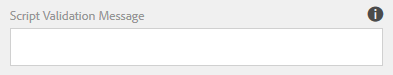
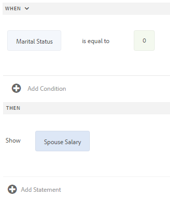
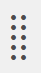
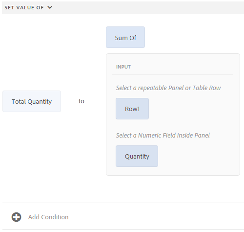

# Editor di regole per moduli adattivi{#adaptive-forms-rule-editor}

## Panoramica {#overview}

La funzione editor di regole in Adobe Experience Manager Forms consente agli utenti aziendali e agli sviluppatori di Forms di scrivere regole sugli oggetti modulo adattivi. Queste regole definiscono le azioni da eseguire sugli oggetti modulo in base a condizioni preimpostate, input dell’utente e azioni dell’utente sul modulo. Consente di semplificare ulteriormente l’esperienza di compilazione dei moduli, garantendo precisione e velocità.

L’editor di regole fornisce un’interfaccia utente intuitiva e semplificata per scrivere regole. L’editor delle regole offre un editor visivo per tutti gli utenti. Inoltre, solo per i moduli che alimentano gli utenti, l&#39;editor di regole fornisce un editor di codice per scrivere regole e script. Alcune delle azioni chiave che è possibile eseguire sugli oggetti modulo adattivo utilizzando le regole sono:

* Mostrare o nascondere un oggetto
* Attivare o disattivare un oggetto
* Impostare un valore per un oggetto
* Convalida il valore di un oggetto
* Esegui funzioni per calcolare il valore di un oggetto
* Richiamare un servizio del modello dati del modulo ed eseguire un’operazione
* Imposta la proprietà di un oggetto

L’editor di regole sostituisce le funzionalità di scripting di AEM 6.1 Forms e versioni precedenti. Tuttavia, gli script esistenti vengono mantenuti nel nuovo editor di regole. Per ulteriori informazioni sull&#39;utilizzo degli script esistenti nell&#39;editor di regole, consulta [Impatto dell&#39;editor di regole sugli script esistenti](../../forms/using/rule-editor.md#p-impact-of-rule-editor-on-existing-scripts-p).

Gli utenti aggiunti al gruppo forms-power-users possono creare nuovi script e modificare quelli esistenti. Gli utenti del gruppo utenti-moduli possono utilizzare gli script ma non creare o modificare gli script.

## Informazioni su una regola {#understanding-a-rule}

Una regola è una combinazione di azioni e condizioni. Nell’editor delle regole, le azioni includono attività quali nascondere, mostrare, abilitare, disabilitare o calcolare il valore di un oggetto in un modulo. Le condizioni sono espressioni booleane valutate effettuando controlli e operazioni sullo stato, il valore o la proprietà di un oggetto modulo. Le azioni vengono eseguite in base al valore ( `True` o `False`) restituito valutando una condizione.

L&#39;editor di regole fornisce un set di tipi di regole predefiniti, ad esempio When, Show, Hide, Enable, Disable, Set Value Of e Validate per facilitare la scrittura di regole. Ogni tipo di regola ti consente di definire condizioni e azioni in una regola. Il documento spiega ulteriormente ogni tipo di regola in dettaglio.

Una regola segue in genere uno dei seguenti costrutti:

**Condition-** ActionIn questo costrutto, una regola definisce prima una condizione seguita da un&#39;azione da attivare. La costruzione è paragonabile all&#39;istruzione if-then nei linguaggi di programmazione.

Nell&#39;editor delle regole, il tipo di regola **When** impone il costrutto condizione-action.

**Azione-** CondizioneIn questo costrutto, una regola definisce prima un&#39;azione da attivare seguita da condizioni per la valutazione. Un&#39;altra variante di questo costrutto è action-condition-alternate action, che definisce anche un&#39;azione alternativa da attivare se la condizione restituisce False.

I tipi di regole Mostra, Nascondi, Abilita, Disabilita, Imposta valore di e Convalida nell&#39;editor delle regole impongono il costrutto della regola della condizione azione. Per impostazione predefinita, l&#39;azione alternativa Mostra è Nascondi e per Abilita è Disabilita e viceversa. Non è possibile modificare l&#39;azione alternativa predefinita.

>[!NOTE]
>
>I tipi di regole disponibili, comprese le condizioni e le azioni definite nell&#39;editor di regole, dipendono anche dal tipo di oggetto modulo da cui si sta creando una regola. L’editor di regole visualizza solo tipi di regole e opzioni validi per la scrittura di istruzioni di condizioni e azioni per un particolare tipo di oggetto modulo. Ad esempio, non vengono visualizzati i tipi di regole Convalida, Imposta valore di, Abilita e Disabilita per un oggetto pannello.

Per ulteriori informazioni sui tipi di regole disponibili nell&#39;editor di regole, consulta [Tipi di regole disponibili nell&#39;editor di regole](../../forms/using/rule-editor.md#p-available-rule-types-in-rule-editor-p).

### Linee guida per la scelta di un costrutto di regola {#guidelines-for-choosing-a-rule-construct}

Sebbene sia possibile ottenere la maggior parte dei casi di utilizzo utilizzando qualsiasi costrutto di regole, di seguito sono riportate alcune linee guida per scegliere un costrutto più un altro. Per ulteriori informazioni sulle regole disponibili nell&#39;editor delle regole, vedi [Tipi di regole disponibili nell&#39;editor delle regole](../../forms/using/rule-editor.md#p-available-rule-types-in-rule-editor-p).

* Una regola tipica del pollice durante la creazione di una regola consiste nel pensarla nel contesto dell&#39;oggetto su cui si sta scrivendo una regola. Tenere presente che si desidera nascondere o mostrare il campo B in base al valore specificato dall&#39;utente nel campo A. In questo caso si sta valutando una condizione nel campo A e, in base al valore restituito, si sta attivando un&#39;azione nel campo B.

   Pertanto, se scrivi una regola sul campo B (l&#39;oggetto su cui stai valutando una condizione), utilizza il costrutto condizione-azione o il tipo di regola When. Allo stesso modo, utilizza il costrutto della condizione azione o il tipo di regola Mostra o Nascondi sul campo A.

* A volte, è necessario eseguire più azioni in base a una condizione. In questi casi, si consiglia di utilizzare il costrutto condizione-azione . In questo costrutto è possibile valutare una condizione una volta e specificare più istruzioni di azione.

   Ad esempio, per nascondere i campi B, C e D in base alla condizione che verifica il valore specificato da un utente nel campo A, scrivere una regola con il costrutto condizione-azione o quando il tipo di regola sul campo A e specificare le azioni per controllare la visibilità dei campi B, C e D. In caso contrario, sono necessarie tre regole separate sui campi B, C e D, dove ogni regola controlla la condizione e mostra o nasconde il rispettivo campo. In questo esempio, è più efficiente scrivere il tipo di regola When su un oggetto anziché il tipo di regola Show o Hide su tre oggetti.

* Per attivare un&#39;azione basata su più condizioni, si consiglia di utilizzare il costrutto a condizione di azione. Ad esempio, per visualizzare e nascondere il campo A valutando le condizioni nei campi B, C e D, utilizzare Mostra o Nascondi tipo di regola nel campo A.
* Utilizza il costrutto condizione-azione o condizione azione se la regola contiene un&#39;azione per una condizione.
* Se una regola verifica una condizione ed esegue immediatamente un&#39;azione quando fornisce un valore in un campo o esce da un campo, si consiglia di scrivere una regola con il costrutto condizione-azione o il tipo di regola Quando sul campo in cui viene valutata la condizione.
* La condizione nella regola When viene valutata quando un utente modifica il valore dell&#39;oggetto in cui viene applicata la regola When. Tuttavia, se si desidera che l&#39;azione si attivi quando il valore cambia sul lato server, come nel caso di precompilazione del valore, è consigliabile scrivere una regola When che attivi l&#39;azione quando il campo viene inizializzato.
* Quando si scrivono regole per oggetti a discesa, pulsanti di scelta o caselle di controllo, le opzioni o i valori di questi oggetti modulo sono precompilati nell’editor di regole.

## Tipi ed eventi di operatori disponibili nell&#39;editor di regole {#available-operator-types-and-events-in-rule-editor}

L&#39;editor di regole fornisce i seguenti operatori logici ed eventi utilizzando i quali puoi creare regole.

* **È uguale a**
* **È diverso da**
* **Inizia con**
* **Termina con**
* **Contiene**
* **È vuoto**
* **Non è vuoto**
* **Selezionato:** restituisce true quando l’utente seleziona una particolare opzione per un pulsante di scelta, un elenco a discesa e una casella di controllo.
* **È inizializzato (evento):** restituisce true quando un oggetto modulo viene riprodotto nel browser.
* **È modificato (evento):** restituisce true quando l’utente modifica il valore immesso o l’opzione selezionata per un oggetto modulo.

## Tipi di regole disponibili nell&#39;editor di regole {#available-rule-types-in-rule-editor}

L&#39;editor di regole fornisce un set di tipi di regole predefiniti che è possibile utilizzare per scrivere regole. Esaminiamo ogni tipo di regola in dettaglio. Per ulteriori informazioni sulla scrittura di regole nell&#39;editor di regole, consulta [Scrivere regole](../../forms/using/rule-editor.md#p-write-rules-p).

### Quando {#whenruletype}

Il tipo di regola **When** segue il costrutto di regola **condition-action-alternate action** o talvolta solo il costrutto **condition-action**. In questo tipo di regola è innanzitutto necessario specificare una condizione per la valutazione seguita da un&#39;azione da attivare se la condizione è soddisfatta ( `True`). Quando utilizzi il tipo di regola When, puoi utilizzare più operatori AND e OR per creare [espressioni nidificate](#nestedexpressions).

Utilizzando il tipo di regola When, è possibile valutare una condizione di un oggetto modulo ed eseguire azioni su uno o più oggetti.

In parole semplici, una regola Quando tipica è strutturata come segue:

`When on Object A:`

`(Condition 1 AND Condition 2 OR Condition 3) is TRUE;`

`Then, do the following:`

Azione 2 sull&#39;oggetto B;
E
Azione 3 sull&#39;oggetto C;

_

Quando si dispone di un componente con più valori, ad esempio pulsanti di scelta o elenco, durante la creazione di una regola per quel componente le opzioni vengono recuperate automaticamente e rese disponibili al creatore di regole. Non è necessario digitare nuovamente i valori delle opzioni.

Ad esempio, un elenco include quattro opzioni: Rosso, Blu, Verde e Giallo. Durante la creazione della regola, le opzioni (pulsanti di scelta) vengono recuperate automaticamente e rese disponibili al creatore della regola come segue:


Quando scrivi una regola When, puoi attivare l&#39;azione Clear Value Of (Cancella valore dell&#39;azione). Cancella valore dell&#39;azione cancella il valore dell&#39;oggetto specificato. L’opzione Cancella valore di come opzione nell’istruzione When consente di creare condizioni complesse con più campi.


**** NascondiNasconde l&#39;oggetto specificato.

**** MostraMostra l’oggetto specificato.

**** AbilitaAbilita l’oggetto specificato.

**** DisableDisabilita l&#39;oggetto specificato.

**Richiama** serviceRichiama un servizio configurato in un modello dati del modulo. Quando si sceglie l&#39;operazione Invoke Service, viene visualizzato un campo. Toccando il campo , vengono visualizzati tutti i servizi configurati in tutti i modelli di dati modulo nell’istanza AEM. Quando si sceglie un servizio del modello dati modulo, vengono visualizzati campi aggiuntivi in cui è possibile mappare gli oggetti modulo con i parametri di input e output per il servizio specificato. Vedere la regola di esempio per richiamare i servizi del modello dati del modulo.

Oltre al servizio del modello dati modulo, è possibile specificare un URL WSDL diretto per richiamare un servizio Web. Tuttavia, un servizio modello dati modulo presenta molti vantaggi e l’approccio consigliato per richiamare un servizio.

Per ulteriori informazioni sulla configurazione dei servizi nel modello dati modulo, vedere [Integrazione dati di AEM Forms](/help/forms/using/data-integration.md).

**Imposta il valore** diComputes e imposta il valore dell&#39;oggetto specificato. È possibile impostare il valore dell&#39;oggetto su una stringa, il valore di un altro oggetto, il valore calcolato utilizzando l&#39;espressione o la funzione matematica, il valore di una proprietà di un oggetto o il valore di output di un servizio del modello dati di modulo configurato. Quando si sceglie l’opzione del servizio Web, vengono visualizzati tutti i servizi configurati in tutti i modelli di dati modulo nell’istanza AEM. Quando si sceglie un servizio del modello dati modulo, vengono visualizzati campi aggiuntivi in cui è possibile mappare gli oggetti modulo con i parametri di input e output per il servizio specificato.

Per ulteriori informazioni sulla configurazione dei servizi nel modello dati modulo, vedere [Integrazione dati di AEM Forms](/help/forms/using/data-integration.md).

Il tipo di regola **Imposta proprietà** consente di impostare il valore di una proprietà dell&#39;oggetto specificato in base a un&#39;azione condizione.

Consente di definire regole per aggiungere le caselle di controllo in modo dinamico al modulo adattivo. È possibile utilizzare una funzione personalizzata, un oggetto modulo o una proprietà oggetto per definire una regola.


Per definire una regola basata su una funzione personalizzata, seleziona **Output funzione** dall&#39;elenco a discesa, quindi trascina e rilascia una funzione personalizzata dalla scheda **Funzioni** . Se l’azione della condizione viene soddisfatta, al modulo adattivo viene aggiunto il numero di caselle di controllo definite nella funzione personalizzata.

Per definire una regola basata su un oggetto modulo, selezionare **Oggetto modulo** dall’elenco a discesa, quindi trascinare un oggetto modulo dalla scheda **Oggetti modulo**. Se l’azione condizione viene soddisfatta, al modulo adattivo viene aggiunto il numero di caselle di controllo definite nell’oggetto modulo.

Una regola Set Property basata su una proprietà oggetto consente di aggiungere il numero di caselle di controllo in un modulo adattivo basato su un&#39;altra proprietà oggetto inclusa nel modulo adattivo.

Nella figura seguente viene illustrato un esempio di aggiunta dinamica di caselle di controllo in base al numero di elenchi a discesa nel modulo adattivo:


**Clear Value** OfCancella il valore dell&#39;oggetto specificato.

**Imposta** FocusSets sullo stato attivo dell&#39;oggetto specificato.

**Salva** moduloSalva il modulo.

**Invia** moduliInvia il modulo.

**Reimposta** FormRipristina il modulo.

**Convalida** del modulo.

**Aggiungi** istanzaAggiunge un&#39;istanza del pannello o della riga di tabella ripetibili specificati.

**Rimuovi** istanzaRimuove un&#39;istanza del pannello o della riga della tabella ripetibili specificati.

**Passa** a Comunicazioni interattive, moduli adattivi, altre risorse quali immagini o frammenti di documento o un URL esterno. Per ulteriori informazioni, vedere [Pulsante Aggiungi alla comunicazione interattiva](../../forms/using/create-interactive-communication.md#addbuttontothewebchannel).

### Imposta valore di {#set-value-of}

Il tipo di regola **[!UICONTROL Imposta valore di]** consente di impostare il valore di un oggetto modulo a seconda che la condizione specificata sia soddisfatta o meno. Il valore può essere impostato su un valore di un altro oggetto, una stringa letterale, un valore derivato da un&#39;espressione matematica o da una funzione, un valore di una proprietà di un altro oggetto o l&#39;output di un servizio del modello dati modulo. Allo stesso modo, è possibile verificare la presenza di una condizione su un componente, una stringa, una proprietà o valori derivati da una funzione o un&#39;espressione matematica.

Tenere presente che il tipo di regola Imposta valore di non è disponibile per tutti gli oggetti modulo, ad esempio i pannelli e i pulsanti della barra degli strumenti. Una regola Set Value Of standard ha la seguente struttura:


Imposta il valore dell&#39;oggetto A su:

(stringa ABC) OR
(proprietà dell&#39;oggetto X dell&#39;oggetto C) OR
(valore da una funzione) OR
(valore da un&#39;espressione matematica) OR
(valore di output di un servizio o servizio Web di un modello dati);

Quando (facoltativo):

(Condizione 1 E condizione 2 E condizione 3) è TRUE;


L’esempio seguente prende il valore nel campo `dependentid` come input e imposta il valore del campo `Relation` sull’output dell’argomento `Relation` del servizio del modello dati del modulo `getDependent`.


Esempio di regola Imposta valore utilizzando il servizio del modello dati del modulo

>[!NOTE]
>
>Inoltre, è possibile utilizzare Imposta valore della regola per compilare tutti i valori di un componente elenco a discesa dall’output di un servizio modello dati modulo o di un servizio Web. Assicurati tuttavia che l&#39;argomento di output scelto sia di tipo matrice. Tutti i valori restituiti in una matrice diventano disponibili nell&#39;elenco a discesa specificato.

### Mostra {#show}

Utilizzando il tipo di regola **Mostra**, è possibile scrivere una regola per mostrare o nascondere un oggetto modulo in base al fatto che una condizione sia soddisfatta o meno. Il tipo di regola Mostra attiva anche l&#39;azione Nascondi nel caso in cui la condizione non sia soddisfatta o restituisca `False`.

Una regola Show tipica è strutturata come segue:


`Show Object A;`

`When:`

`(Condition 1 OR Condition 2 OR Condition 3) is TRUE;`

`Else:`

`Hide Object A;`


### Nascondi {#hide}

Simile al tipo di regola Mostra, è possibile utilizzare il tipo di regola **Nascondi** per mostrare o nascondere un oggetto modulo in base al fatto che una condizione sia soddisfatta o meno. Il tipo di regola Nascondi attiva anche l&#39;azione Mostra nel caso in cui la condizione non sia soddisfatta o restituisca `False`.

Una regola Nascondi tipica è strutturata come segue:


`Hide Object A;`

`When:`

`(Condition 1 AND Condition 2 AND Condition 3) is TRUE;`

`Else:`

`Show Object A;`


### Attiva {#enable}

Il tipo di regola **Abilita** consente di abilitare o disabilitare un oggetto modulo in base al fatto che una condizione sia soddisfatta o meno. Il tipo di regola Abilita attiva inoltre l&#39;azione Disabilita nel caso in cui la condizione non sia soddisfatta o restituisca `False`.

Una regola di abilitazione tipica è strutturata come segue:


`Enable Object A;`

`When:`

`(Condition 1 AND Condition 2 AND Condition 3) is TRUE;`

`Else:`

`Disable Object A;`


### Disattiva {#disable}

Simile al tipo di regola Abilita, il tipo di regola **Disabilita** consente di abilitare o disabilitare un oggetto modulo in base al fatto che una condizione sia soddisfatta o meno. Il tipo di regola Disabilita attiva attiva anche l&#39;azione Abilita nel caso in cui la condizione non sia soddisfatta o restituisca `False`.

Una regola Disabilita tipica è strutturata come segue:


`Disable Object A;`

`When:`

`(Condition 1 OR Condition 2 OR Condition 3) is TRUE;`

`Else:`

`Enable Object A;`

### Convalida {#validate}

Il tipo di regola **Validate** convalida il valore in un campo utilizzando un&#39;espressione. Ad esempio, è possibile scrivere un&#39;espressione per verificare che la casella di testo per specificare il nome non contenga caratteri o numeri speciali.

Una regola Convalida tipica è strutturata come segue:

`Validate Object A;`

`Using:`

`(Expression 1 AND Expression 2 AND Expression 3) is TRUE;`

>[!NOTE]
>
>Se il valore specificato non è conforme alla regola Validate, è possibile visualizzare un messaggio di convalida all&#39;utente. È possibile specificare il messaggio nel campo **[!UICONTROL Messaggio di convalida script]** nelle proprietà del componente nella barra laterale.



### Imposta le opzioni di {#setoptionsof}

Il tipo di regola **Imposta opzioni di** consente di definire regole per aggiungere le caselle di controllo in modo dinamico al modulo adattivo. È possibile utilizzare un modello dati modulo o una funzione personalizzata per definire la regola.

Per definire una regola basata su una funzione personalizzata, seleziona **Output funzione** dall&#39;elenco a discesa, quindi trascina e rilascia una funzione personalizzata dalla scheda **Funzioni** . Al modulo adattivo viene aggiunto il numero di caselle di controllo definite nella funzione personalizzata.


Per creare una funzione personalizzata, consulta [funzioni personalizzate nell&#39;editor di regole](#custom-functions).

Per definire una regola basata su un modello dati modulo:

1. Seleziona **Output servizio** dall&#39;elenco a discesa.
1. Selezionare l&#39;oggetto modello dati.
1. Selezionare una proprietà dell&#39;oggetto modello dati dall&#39;elenco a discesa **Visualizza valore**. Il numero di caselle nel modulo adattivo deriva dal numero di istanze definite per tale proprietà nel database.
1. Selezionare una proprietà dell&#39;oggetto modello dati dall&#39;elenco a discesa **Salva valore**.


## Interfaccia utente dell’editor di regole {#understanding-the-rule-editor-user-interface}

L’editor delle regole fornisce un’interfaccia utente completa ma semplice per scrivere e gestire le regole. Puoi avviare l’interfaccia utente dell’editor di regole da un modulo adattivo in modalità di creazione.

Per avviare l&#39;interfaccia utente dell&#39;editor di regole:

1. Apri un modulo adattivo in modalità di authoring.
1. Toccare l’oggetto modulo per il quale si desidera scrivere una regola e nella barra degli strumenti del componente toccare . Viene visualizzata l’interfaccia utente dell’editor di regole.

   

   In questa visualizzazione sono elencate tutte le regole esistenti sugli oggetti modulo selezionati. Per informazioni sulla gestione delle regole esistenti, consulta [Gestire le regole](../../forms/using/rule-editor.md#p-manage-rules-p).

1. Tocca **[!UICONTROL Crea]** per scrivere una nuova regola. L’editor visivo dell’interfaccia utente dell’editor di regole si apre per impostazione predefinita quando si avvia l’editor di regole la prima volta.

   

Diamo un’occhiata dettagliata a ciascun componente dell’interfaccia utente dell’editor di regole.

### A. Visualizzazione della regola del componente {#a-component-rule-display}

Visualizza il titolo dell’oggetto modulo adattivo attraverso il quale è stato avviato l’editor di regole e il tipo di regola attualmente selezionato. Nell’esempio precedente, l’editor di regole viene avviato da un oggetto modulo adattivo denominato Salario e il tipo di regola selezionato è Quando.

### B. Oggetti e funzioni del modulo {#b-form-objects-and-functions-br}

Il riquadro a sinistra nell&#39;interfaccia utente dell&#39;editor di regole include due schede: **[!UICONTROL Oggetti Forms]** e **[!UICONTROL Funzioni]**.

La scheda Oggetti modulo mostra una visualizzazione gerarchica di tutti gli oggetti contenuti nel modulo adattivo. Visualizza il titolo e il tipo degli oggetti. Quando si scrive una regola, è possibile trascinare gli oggetti modulo nell’editor di regole. Durante la creazione o la modifica di una regola quando si trascina un oggetto o una funzione in un segnaposto, il segnaposto assume automaticamente il tipo di valore appropriato.

Gli oggetti modulo a cui è stata applicata una o più regole valide sono contrassegnati con un punto verde. Se una delle regole applicate a un oggetto modulo non è valida, l’oggetto modulo è contrassegnato da un punto giallo.

La scheda Funzioni include un set di funzioni integrate quali Somma di, Min di, Max di, Media di, Numero di e Convalida del modulo. È possibile utilizzare queste funzioni per calcolare i valori in pannelli e righe di tabella ripetibili e utilizzarli nelle istruzioni di azione e condizione durante la scrittura delle regole. È tuttavia possibile creare anche [funzioni personalizzate](#custom-functions).


>[!NOTE]
>
>È possibile eseguire la ricerca del testo sui nomi e i titoli di oggetti e funzioni nelle schede Oggetti e Funzioni di Forms.

Nella struttura ad albero a sinistra degli oggetti modulo è possibile toccare gli oggetti modulo per visualizzare le regole applicate a ciascuno di essi. Non solo è possibile spostarsi tra le regole dei vari oggetti modulo, ma è anche possibile copiare e incollare le regole tra gli oggetti modulo. Per ulteriori informazioni, consulta [Copia-incolla regole](../../forms/using/rule-editor.md#p-copy-paste-rules-p).

### C. Attiva/disattiva oggetti e funzioni modulo {#c-form-objects-and-functions-toggle-br}

Quando viene toccato, il pulsante di attivazione/disattivazione attiva il riquadro oggetti modulo e funzioni.

### D. Editor di regole visive {#d-visual-rule-editor}

L’editor di regole visive è l’area in modalità editor visivo dell’interfaccia utente dell’editor di regole in cui si scrivono le regole. Ti consente di selezionare un tipo di regola e di conseguenza di definire condizioni e azioni. Quando si definiscono condizioni e azioni in una regola, è possibile trascinare oggetti e funzioni modulo dal riquadro Oggetti modulo e funzioni.

Per ulteriori informazioni sull&#39;utilizzo dell&#39;editor di regole visive, consulta [Scrivere regole](../../forms/using/rule-editor.md#p-write-rules-p).

### E. Switcher di editor di codice visivo {#e-visual-code-editors-switcher}

Gli utenti del gruppo forms-power-users possono accedere all&#39;editor di codice. Per altri utenti, l&#39;editor di codice non è disponibile. Se disponi dei diritti, puoi passare dalla modalità editor visivo alla modalità editor di codice dell’editor di regole e viceversa, utilizzando il commutatore posto sopra l’editor di regole. Quando avvii l’editor di regole la prima volta, questo viene aperto in modalità editor visivo. È possibile scrivere regole in modalità editor visivo o passare alla modalità editor di codice per scrivere uno script di regola. Tuttavia, se modifichi una regola o scrivi una regola nell&#39;editor di codice, non puoi tornare all&#39;editor visivo per quella regola a meno che non cancelli l&#39;editor di codice.

AEM Forms tiene traccia della modalità editor regole utilizzata per ultima per scrivere una regola. Quando avvii l&#39;editor di regole la prossima volta, questo si apre in quella modalità. Tuttavia, puoi anche configurare una modalità predefinita per aprire l’editor di regole nella modalità specificata. Per eseguire questa operazione:

1. Vai AEM console Web all&#39;indirizzo `https://[host]:[port]/system/console/configMgr`.
1. Fare clic per modificare **[!UICONTROL Configurazione canale web per moduli adattivi e comunicazioni interattive]**.
1. scegli **[!UICONTROL Editor visivo]** o **[!UICONTROL Editor di codice]** dal menu a discesa **[!UICONTROL Modalità predefinita per Editor regole]**

1. Fai clic su **[!UICONTROL Salva]**.

### F. Pulsanti Fine e Annulla {#f-done-and-cancel-buttons}

Il pulsante **[!UICONTROL Fine]** viene utilizzato per salvare una regola. È possibile salvare una regola incompleta. Tuttavia, incomplete non sono valide e non vengono eseguite. Le regole salvate in un oggetto modulo vengono elencate quando si avvia l&#39;editor di regole la prossima volta dallo stesso oggetto modulo. In questa visualizzazione puoi gestire le regole esistenti. Per ulteriori informazioni, consulta [Gestire le regole](../../forms/using/rule-editor.md#p-manage-rules-p).

Il pulsante **[!UICONTROL Annulla]** elimina tutte le modifiche apportate a una regola e chiude l&#39;editor di regole.

## Regole di scrittura {#write-rules}

Puoi scrivere regole utilizzando l’editor di regole visive o l’editor di codice. Quando avvii l’editor di regole la prima volta, questo viene aperto in modalità editor visivo. Puoi passare alla modalità editor di codice e alle regole di scrittura. Tuttavia, se scrivi o modifichi una regola nell&#39;editor di codice, non puoi passare all&#39;editor visivo per tale regola a meno che non cancelli l&#39;editor di codice. Quando si avvia l&#39;editor di regole la prossima volta, questo si apre nella modalità utilizzata l&#39;ultima volta per creare la regola.

Per prima cosa, vediamo come scrivere regole utilizzando l’editor visivo.

### Utilizzo dell’editor visivo {#using-visual-editor}

Comprendiamo come creare una regola nell’editor visivo utilizzando il seguente modulo di esempio.


La sezione Requisiti del prestito nel modulo di domanda di prestito di esempio richiede ai richiedenti di specificare lo stato civile, lo stipendio e, se coniugati, lo stipendio del coniuge. In base agli input dell&#39;utente, la regola calcola l&#39;importo di idoneità del prestito e viene visualizzata nel campo Idoneità del prestito . Per implementare lo scenario, applica le seguenti regole:

* Il campo Stipendio del coniuge viene visualizzato solo quando lo Stato civile è sposato.
* L&#39;importo di ammissibilità al prestito è pari al 50% dello stipendio totale.

Esegui i seguenti passaggi per scrivere le regole:

1. Innanzitutto, scrivi la regola per controllare la visibilità del campo Stipendio coniuge in base all&#39;opzione selezionata dall&#39;utente per il pulsante di opzione Stato civile.

   Aprire il modulo di richiesta di prestito in modalità di authoring. Tocca il componente **Stato civile** e tocca . Quindi, tocca **[!UICONTROL Crea]** per avviare l&#39;editor di regole.

   

   Quando si avvia l&#39;editor di regole, la regola When è selezionata per impostazione predefinita. Inoltre, l&#39;oggetto modulo (in questo caso, Stato civile) dal quale è stato avviato l&#39;editor di regole viene specificato nell&#39;istruzione When.

   Sebbene non sia possibile modificare o modificare l’oggetto selezionato, è possibile utilizzare l’elenco a discesa della regola, come illustrato di seguito, per selezionare un altro tipo di regola. Per creare una regola su un altro oggetto, tocca Annulla per uscire dall’editor di regole e avviarla nuovamente dall’oggetto modulo desiderato.

1. Tocca il menu a discesa **[!UICONTROL Seleziona stato]** e seleziona **[!UICONTROL è uguale a]**. Viene visualizzato il campo **[!UICONTROL Enter a String]** .

   

   Nel pulsante di scelta Stato civile, le opzioni **Matrimonio** e **Singola** sono assegnate rispettivamente ai valori **0** e **1**. È possibile verificare i valori assegnati nella scheda Titolo della finestra di dialogo del pulsante di scelta Modifica , come illustrato di seguito.

   

1. Nel campo **Immettere un valore String** nella regola, specificare **0**.

   

   La condizione è stata definita come `When Marital Status is equal to Married`. Quindi, definire l&#39;azione da eseguire se questa condizione è True.

1. Nell&#39;istruzione Then, selezionare **[!UICONTROL Mostra]** dal menu a discesa **[!UICONTROL Seleziona azione]**.

   

1. Trascinare il campo **Stipendio coniuge** dalla scheda Oggetti modulo dell&#39;oggetto **Rilascia o selezionare qui**. In alternativa, toccare l&#39;oggetto **Drop oppure selezionare qui** campo e selezionare il campo **Spouse Salary** dal menu a comparsa, che elenca tutti gli oggetti modulo nel modulo.

   

   La regola viene visualizzata come segue nell&#39;editor di regole.

   

   Tocca **Fine** per salvare la regola.

1. Ripetere i passaggi da 1 a 5 per definire un&#39;altra regola per nascondere il campo Stipendio coniuge se lo Stato coniugale è Singolo. La regola viene visualizzata come segue nell&#39;editor di regole.

   

   >[!NOTE]
   >
   >In alternativa, è possibile scrivere una regola Show sul campo Stipendio coniuge, invece di due regole When sul campo Stato coniugale, per implementare lo stesso comportamento.

   

1. Successivamente, scrivere una regola per calcolare l&#39;importo di idoneità del prestito, che corrisponde al 50% dello stipendio totale, e visualizzarlo nel campo Idoneità del prestito. Per ottenere questo risultato, creare le regole **Imposta valore di** sul campo Idoneità al prestito .

   In modalità di authoring, tocca il campo **[!UICONTROL Idoneità al prestito]** e tocca . Quindi, tocca **[!UICONTROL Crea]** per avviare l&#39;editor di regole.

1. Seleziona **[!UICONTROL Imposta valore di]** regola dal menu a discesa della regola.

   

1. Tocca **[!UICONTROL Seleziona opzione]** e seleziona **[!UICONTROL Espressione matematica]**. Si apre un campo per scrivere un’espressione matematica.

   

1. Nel campo espressione:

   * Seleziona o trascina dalla scheda Oggetto Forms il campo **Salario** nel primo oggetto **Rilascia o seleziona qui** .

   * Selezionare **Più** dal campo **Seleziona operatore**.

   * Seleziona o trascina la selezione dalla scheda Oggetto Forms nel campo **Stipendio del coniuge** nell’altro oggetto **Rilascia o seleziona qui** .

   

1. Quindi, tocca l’area evidenziata intorno al campo espressione e tocca **Estendi espressione**.

   

   Nel campo espressione estesa, seleziona **diviso per** dal campo **Seleziona operatore** e **Numero** dal campo **Seleziona opzione**. Quindi, specifica **2** nel campo numero.

   

   >[!NOTE]
   >
   >È possibile creare espressioni complesse utilizzando componenti, funzioni, espressioni matematiche e valori di proprietà dal campo Seleziona opzione .

   Quindi, creare una condizione, che quando restituisce True, viene eseguita dall&#39;espressione.

1. Tocca **Aggiungi condizione** per aggiungere un’istruzione When.

   

   Nell’istruzione When:

   * Seleziona o trascina dalla scheda Oggetto Forms il campo **Stato civile** nel primo oggetto **Rilascia o seleziona qui** .

   * Seleziona i **s uguale a** dal campo **Seleziona operatore**.

   * Selezionare Stringa nell&#39;altro oggetto **Rilascia o selezionare qui** campo e specificare **Sposato** nel campo **Inserisci una stringa**.

   La regola viene finalmente visualizzata come segue nell&#39;editor di regole.  

   Tocca **Fine** per salvare la regola.

1. Ripetere i passaggi da 7 a 12 per definire un&#39;altra regola per calcolare l&#39;idoneità del prestito se lo stato civile è Single. La regola viene visualizzata come segue nell&#39;editor di regole.

   

>[!NOTE]
>
>In alternativa, è possibile utilizzare la regola Imposta valore di per calcolare l&#39;idoneità del prestito nella regola Quando creata per mostrare e nascondere il campo Stipendio del coniuge. La regola combinata risultante quando lo stato civile è Single viene visualizzata come segue nell&#39;editor di regole.
>
>Allo stesso modo, è possibile scrivere una regola combinata per controllare la visibilità del campo Stipendio coniuge e calcolare l&#39;idoneità del prestito quando lo Stato del matrimonio è sposato.


### Utilizzo dell&#39;editor di codice {#using-code-editor}

Gli utenti aggiunti al gruppo forms-power-users possono utilizzare l&#39;editor di codice. L’editor di regole genera automaticamente il codice JavaScript per qualsiasi regola creata utilizzando l’editor visivo. Puoi passare dall’editor visivo all’editor di codice per visualizzare il codice generato. Tuttavia, se modifichi il codice della regola nell&#39;editor di codice, non puoi tornare all&#39;editor visivo. Se preferisci scrivere regole nell&#39;editor di codice anziché nell&#39;editor visivo, puoi scrivere nuove regole nell&#39;editor di codice. Il commutatore degli editor di codice visivo consente di passare da una modalità all&#39;altra.

JavaScript per l’editor di codice è il linguaggio di espressione dei moduli adattivi. Tutte le espressioni sono espressioni JavaScript valide e utilizzano API modello di script per moduli adattivi. Queste espressioni restituiscono valori di determinati tipi. Per l&#39;elenco completo delle classi, degli eventi, degli oggetti e delle API pubbliche dei moduli adattivi, consulta [Riferimento API della libreria JavaScript per i moduli adattivi](https://helpx.adobe.com/experience-manager/6-5/forms/javascript-api/index.html).

Per ulteriori informazioni sulle linee guida per la scrittura di regole nell&#39;editor di codice, consulta [Espressioni dei moduli adattivi](/help/forms/using/adaptive-form-expressions.md).

Durante la scrittura di codice JavaScript nell’editor di regole, i seguenti suggerimenti visivi sono utili per la struttura e la sintassi:

* Elementi di rilievo della sintassi
* Rientro automatico
* Suggerimenti e suggerimenti per gli oggetti modulo, le funzioni e le relative proprietà
* Completamento automatico dei nomi dei componenti del modulo e delle funzioni JavaScript comuni


#### Funzioni personalizzate nell&#39;editor di regole {#custom-functions}

Oltre alle funzioni predefinite come *Somma di* elencate in Output funzioni, è possibile scrivere funzioni personalizzate di cui si ha spesso bisogno. Assicurati che la funzione scritta sia accompagnata dal `jsdoc` sopra di essa.

È necessario accompagnare `jsdoc`:

* Se desideri una configurazione e una descrizione personalizzate.
* Poiché esistono diversi modi per dichiarare una funzione in `JavaScript,` e i commenti ti consentono di tenere traccia delle funzioni.

Per ulteriori informazioni, consulta [usejsdoc.org](https://usejsdoc.org/).

Tag `jsdoc` supportati:

* ****
SintassiPrivata: Una funzione privata non è inclusa come funzione personalizzata.`@private`
Una funzione privata non è inclusa come funzione personalizzata.

* ****
SintassiNome: In alternativa,  `@name funcName <Function Name>`
puoi  `,` utilizzare:  `@function funcName <Function Name>` **o** `@func` `funcName <Function Name>`.
   `funcName` è il nome della funzione (non sono consentiti spazi).
   `<Function Name>` è il nome visualizzato della funzione.

* ****
Sintassi membro: Associa uno spazio dei nomi alla funzione .`@memberof namespace`
Associa uno spazio dei nomi alla funzione .

* ****
SintassiParametro: In alternativa, puoi utilizzare:  `@param {type} name <Parameter Description>`
In alternativa, puoi utilizzare:  `@argument` `{type} name <Parameter Description>` **o** `@arg` `{type}` `name <Parameter Description>`.
Mostra i parametri utilizzati dalla funzione . Una funzione può avere più tag di parametro, un tag per ogni parametro nell&#39;ordine di occorrenza.
   `{type}` rappresenta il tipo di parametro. I tipi di parametri consentiti sono:

   1. string
   1. numero
   1. booleano

   Tutti gli altri tipi di parametri sono classificati in una delle categorie precedenti. Nessuno non supportato. Assicurati di selezionare uno dei tipi indicati sopra. I tipi non sono sensibili all’uso di maiuscole e minuscole. Gli spazi non sono consentiti nel parametro `name`. `<Parameter Descrption>` `<parameter>  can have multiple words. </parameter>`

* **Sintassi**
tipo di ritorno: In alternativa, puoi utilizzare  `@return {type}`
In alternativa,  `@returns {type}`.
Aggiunge informazioni sulla funzione, ad esempio la sua finalità.
{type} rappresenta il tipo restituito dalla funzione. I tipi di restituzione consentiti sono:

   1. string
   1. numero
   1. booleano

   Tutti gli altri tipi di restituzione sono classificati in una delle situazioni precedenti. Nessuno non supportato. Assicurati di selezionare uno dei tipi indicati sopra. I tipi restituiti non fanno distinzione tra maiuscole e minuscole.

>[!NOTE]
>
>I commenti prima della funzione personalizzata vengono utilizzati per il riepilogo. Il riepilogo può estendersi a più righe finché non viene rilevato un tag . Limita la dimensione a un singolo per una descrizione concisa nel generatore di regole.

**Aggiunta di una funzione personalizzata**

Ad esempio, si desidera aggiungere una funzione personalizzata che calcoli l&#39;area di un quadrato. La lunghezza laterale è l’input dell’utente alla funzione personalizzata, che viene accettata utilizzando una casella numerica del modulo. L’output calcolato viene visualizzato in un’altra casella numerica del modulo. Per aggiungere una funzione personalizzata, devi prima creare una libreria client e poi aggiungerla all&#39;archivio CRX.

Esegui i seguenti passaggi per creare una libreria client e aggiungerla nell&#39;archivio CRX.

1. Crea una libreria client. Per ulteriori informazioni, consulta [Uso delle librerie lato client](/help/sites-developing/clientlibs.md).
1. In CRXDE, aggiungi una proprietà `categories`con il valore del tipo di stringa `customfunction` alla cartella `clientlib`.

   >[!NOTE]
   >
   >`customfunction`è una categoria di esempio. È possibile scegliere qualsiasi nome per la categoria creata nella cartella `clientlib`.

Dopo aver aggiunto la libreria client nell’archivio CRX, utilizzala nel modulo adattivo. Consente di utilizzare la funzione personalizzata come regola nel modulo. Esegui i seguenti passaggi per aggiungere la libreria client nel modulo adattivo.

1. Apri il modulo in modalità di modifica.
Per aprire un modulo in modalità di modifica, selezionalo e tocca **Apri**.
1. In modalità di modifica, seleziona un componente, quindi tocca  > **Contenitore modulo adattivo**, quindi tocca .
1. Nella barra laterale, in Nome libreria client , aggiungi la libreria client. ( `customfunction` nell’esempio.)

   

1. Seleziona la casella numerica di input e tocca  per aprire l&#39;editor di regole.
1. Tocca **Crea regola**. Utilizzando le opzioni visualizzate di seguito, creare una regola per salvare il valore al quadrato dell&#39;input nel campo Output del modulo.
   [ ](assets/add-custom-rule.png)regolaTocca  **Fine**. Viene aggiunta la funzione personalizzata .

#### Tipi supportati per la dichiarazione della funzione {#function-declaration-supported-types}

**Istruzione Function**

```javascript
function area(len) {
    return len*len;
}
```

Questa funzione è inclusa senza `jsdoc` commenti.

**Espressione funzione**

```javascript
var area;
//Some codes later
/** */
area = function(len) {
    return len*len;
};
```

**Espressione e istruzione della funzione**

```javascript
var b={};
/** */
b.area = function(len) {
    return len*len;
}
```

**Dichiarazione di funzione come variabile**

```javascript
/** */
var x1,
    area = function(len) {
        return len*len;
    },
    x2 =5, x3 =true;
```

Limitazione: funzione personalizzata seleziona solo la prima dichiarazione di funzione dall&#39;elenco delle variabili, se insieme. È possibile utilizzare l&#39;espressione di funzione per ogni funzione dichiarata.

**Dichiarazione di funzione come oggetto**

```javascript
var c = {
    b : {
        /** */
        area : function(len) {
            return len*len;
        }
    }
};
```

>[!NOTE]
>
>Assicurati di utilizzare `jsdoc` per ogni funzione personalizzata. Sebbene i `jsdoc`commenti siano incoraggiati, includi un commento vuoto `jsdoc`per contrassegnare la funzione come funzione personalizzata. Abilita la gestione predefinita della funzione personalizzata.

## Gestire le regole {#manage-rules}

Tutte le regole esistenti su un oggetto modulo vengono elencate quando si tocca l’oggetto e si tocca . Puoi visualizzare il titolo e un&#39;anteprima del riepilogo della regola. Inoltre, l’interfaccia utente ti consente di espandere e visualizzare il riepilogo completo delle regole, modificare l’ordine delle regole, modificare le regole ed eliminare le regole.


È possibile eseguire le azioni seguenti sulle regole:

* **Espandi/Comprimi**: La colonna Contenuto nell’elenco delle regole visualizza il contenuto della regola. Se l’intero contenuto della regola non è visibile nella visualizzazione predefinita, tocca  per espanderlo.

* **Riordina**: Qualsiasi nuova regola creata viene impilata in fondo all&#39;elenco delle regole. Le regole vengono eseguite dall’alto verso il basso. La regola nella parte superiore viene eseguita per prima, seguita da altre regole dello stesso tipo. Ad esempio, se le regole When, Show, Enable e When si trovano rispettivamente in prima, seconda, terza e quarta posizione dall&#39;alto, la regola When nella parte superiore viene eseguita per prima seguita dalla regola When nella quarta posizione. Vengono quindi eseguite le regole Mostra e Abilita .
Per modificare l’ordine di una regola, tocca  rispetto a essa oppure trascina il campo nell’ordine desiderato nell’elenco.

* **Modifica**: Per modificare una regola, seleziona la casella di controllo accanto al titolo della regola. Vengono visualizzate altre opzioni per modificare ed eliminare la regola. Tocca **Modifica** per aprire la regola selezionata nell’editor di regole in modalità visiva o editor di codice, a seconda della modalità utilizzata per creare la regola.

* **Elimina**: Per eliminare una regola, selezionala e tocca  **Elimina**.

* **Attiva/Disattiva**: Potrebbe essere necessario sospendere temporaneamente l’utilizzo di una regola. Puoi selezionare una o più regole e toccare Disabilita nella barra degli strumenti Azioni per disattivarle. Se una regola è disabilitata, non viene eseguita in fase di runtime. Per abilitare una regola disabilitata, puoi selezionarla e toccare Abilita nella barra degli strumenti delle azioni. Nella colonna dello stato della regola viene visualizzato se la regola è abilitata o disabilitata.


## Copia e incolla regole {#copy-paste-rules}

Puoi copiare e incollare una regola da un campo ad altri campi simili per risparmiare tempo.

Per copiare e incollare le regole, procedi come segue:

1. Toccare l’oggetto modulo da cui si desidera copiare una regola e, nella barra degli strumenti del componente, toccare . Viene visualizzata l’interfaccia utente dell’editor di regole con l’oggetto modulo selezionato e vengono visualizzate le regole esistenti.

   

   Per informazioni sulla gestione delle regole esistenti, consulta [Gestire le regole](../../forms/using/rule-editor.md#p-manage-rules-p).

1. Seleziona la casella di controllo accanto al titolo della regola. Vengono visualizzate opzioni aggiuntive per gestire la regola. Tocca **Copia**.

   

1. Selezionare un altro oggetto modulo al quale si desidera incollare la regola e toccare **Incolla**. Inoltre, puoi modificare la regola per apportare modifiche.

   >[!NOTE]
   >
   >È possibile incollare una regola in un altro oggetto modulo solo se tale oggetto supporta l&#39;evento della regola copiata. Ad esempio, un pulsante supporta l’evento clic. È possibile incollare una regola con un evento clic su un pulsante ma non su una casella di controllo.

1. Tocca **Fine** per salvare la regola.

## Espressioni nidificate {#nestedexpressions}

L’editor di regole consente di utilizzare più operatori AND e OR per creare regole nidificate. È possibile combinare più operatori AND e OR nelle regole.

Di seguito è riportato un esempio di una regola nidificata che visualizza un messaggio all&#39;utente sull&#39;idoneità per la custodia di un figlio quando vengono soddisfatte le condizioni richieste.


Puoi anche trascinare le condizioni all’interno di una regola per modificarla. Toccare e posizionare il puntatore del mouse sulla maniglia ( ) prima di una condizione. Una volta che il puntatore si trasforma in un simbolo a mano come mostrato di seguito, trascina e rilascia la condizione in qualsiasi punto della regola. La struttura delle regole cambia.


## Condizioni dell&#39;espressione della data {#dateexpression}

L’editor di regole consente di utilizzare confronti di date per creare condizioni.

Di seguito è riportato un esempio di condizione che visualizza un oggetto di testo statico se l&#39;ipoteca sulla casa è già stata acquisita, che l&#39;utente indica compilando il campo data.

Quando la data del mutuo della proprietà compilata dall&#39;utente è passata, nel modulo adattivo viene visualizzata una nota relativa al calcolo del reddito. La regola seguente confronta la data compilata dall’utente con la data corrente e, se la data compilata dall’utente è precedente alla data corrente, nel modulo viene visualizzato il messaggio di testo (denominato Entrate).


Quando la data di compilazione è precedente alla data corrente, nel modulo viene visualizzato il messaggio di testo (Entrate) come segue:


## Condizioni di confronto dei numeri {#number-comparison-conditions}

L’editor delle regole ti consente di creare condizioni che confrontano due numeri.

Di seguito è riportato un esempio di condizione che visualizza un oggetto di testo statico se il numero di mesi in cui un richiedente risiede al suo indirizzo corrente è inferiore a 36.


Se l&#39;utente indica di aver soggiornato presso il suo indirizzo residenziale attuale per meno di 36 mesi, il modulo indica che può essere richiesta una prova supplementare della residenza.


## Impatto dell&#39;editor di regole sugli script esistenti {#impact-of-rule-editor-on-existing-scripts}

Nelle versioni AEM Forms precedenti al feature pack 1 di Forms 6.1, gli autori e gli sviluppatori dei moduli utilizzavano per scrivere espressioni nella scheda Script della finestra di dialogo Modifica componente per aggiungere un comportamento dinamico ai moduli adattivi. La scheda Script viene ora sostituita dall’editor di regole.

Tutti gli script o le espressioni che è necessario scrivere nella scheda Script sono disponibili nell’editor di regole. Sebbene non sia possibile visualizzarli o modificarli nell&#39;editor visivo, se fai parte del gruppo utenti di forms-power-users puoi modificare gli script nell&#39;editor di codice.

## Regole di esempio {#example}

### Richiama del servizio del modello dati del modulo {#invoke}

Considera un servizio Web `GetInterestRates` che prende l&#39;importo del prestito, la durata e il punteggio di credito del richiedente come input e restituisce un piano di prestito che include l&#39;importo e il tasso di interesse dell&#39;IME. È possibile creare un modello dati modulo utilizzando il servizio Web come origine dati. Al modello di modulo è possibile aggiungere oggetti modello dati e un servizio `get`. Il servizio viene visualizzato nella scheda Servizi del modello dati del modulo. Quindi, creare un modulo adattivo che includa i campi degli oggetti del modello dati per acquisire gli input degli utenti per l’importo del prestito, la durata e il punteggio di credito. Aggiungi un pulsante che attiva il servizio Web per recuperare i dettagli del piano. L’output viene compilato nei campi appropriati.

La regola seguente mostra come configurare l&#39;azione del servizio Invoke per eseguire lo scenario di esempio.


Richiamare il servizio del modello dati del modulo utilizzando la regola del modulo adattivo

### Attivazione di più azioni utilizzando la regola When {#triggering-multiple-actions-using-the-when-rule}

In un modulo di domanda di prestito, si desidera acquisire se il richiedente è un cliente esistente o meno. In base alle informazioni fornite dall’utente, il campo ID cliente deve essere visualizzato o nascosto. Inoltre, se l&#39;utente è un cliente esistente, imposta lo stato attivo sul campo ID cliente . Il modulo di domanda di prestito presenta le seguenti componenti:

* Un pulsante di scelta **Sei un cliente Geometrixx esistente?**, che fornisce le opzioni Sì e No. Il valore per Sì è **0** e No è **1**.

* Un campo di testo **Geometrixx ID cliente** per specificare l&#39;ID cliente.

Quando scrivi una regola When sul pulsante di scelta per implementare questo comportamento, la regola viene visualizzata come segue nell’editor di regole visive.  

Regola nell’editor visivo

Nella regola di esempio, l&#39;istruzione nella sezione When è la condizione che, quando restituisce True, esegue le azioni specificate nella sezione Then.

La regola viene visualizzata come segue nell&#39;editor di codice.


Regola nell’editor di codice

### Utilizzo dell&#39;output di una funzione in una regola {#using-a-function-output-in-a-rule}

In un modulo di ordine di acquisto è disponibile la tabella seguente, in cui gli utenti compileranno i loro ordini. In questa tabella:

* La prima riga è ripetibile, in modo che gli utenti possano ordinare più prodotti e specificare quantità diverse. Il nome dell’elemento è `Row1`.
* Il titolo della cella nella colonna Quantità prodotto della riga ripetibile è Quantità. Il nome dell’elemento per questa cella è `productquantity`.
* La seconda riga della tabella non è ripetibile e il titolo della cella nella colonna Quantità prodotto in questa riga è Quantità totale.


**A.** Riga1  **B.** Quantità  **C.** Quantità totale

A questo punto, è necessario aggiungere quantità specificate nella colonna Quantità prodotto per tutti i prodotti e visualizzare la somma nella cella Quantità totale. Per ottenere questo risultato, scrivi una regola Imposta valore di sulla cella Quantità totale come mostrato di seguito.



Regola nell’editor visivo

La regola viene visualizzata come segue nell&#39;editor di codice.


Regola nell’editor di codice

### Convalida di un valore di campo utilizzando l’espressione {#validating-a-field-value-using-expression}

Nel modulo di ordine di acquisto illustrato nell&#39;esempio precedente, si desidera impedire all&#39;utente di ordinare più di una quantità di qualsiasi prodotto il cui prezzo è superiore a 10000. A questo scopo, puoi scrivere una regola Convalida come mostrato di seguito.


Regola nell’editor visivo

La regola viene visualizzata come segue nell&#39;editor di codice.


Regola nell’editor di codice

