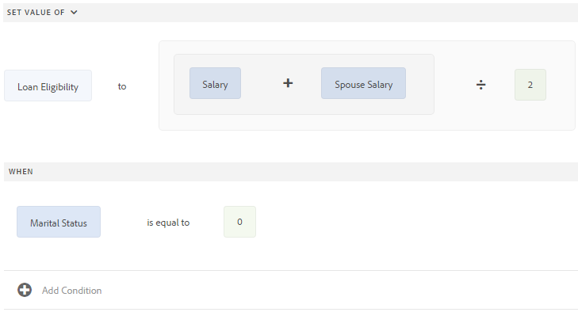
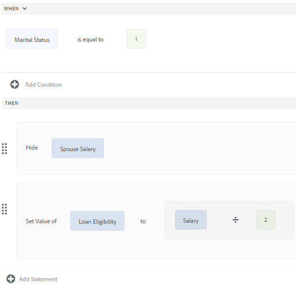

# Editor di regole per moduli adattivi{#adaptive-forms-rule-editor}

## Panoramica {#overview}

La funzione Editor regole di  Adobe Experience Manager Forms consente agli utenti aziendali e agli sviluppatori di moduli di scrivere regole sugli oggetti modulo adattivi. Queste regole definiscono le azioni da eseguire sugli oggetti modulo in base a condizioni predefinite, input dell&#39;utente e azioni dell&#39;utente sul modulo. Consente di semplificare ulteriormente la compilazione dei moduli, garantendo precisione e velocità.

L&#39;editor di regole fornisce un&#39;interfaccia utente intuitiva e semplificata per scrivere le regole. L’editor delle regole offre un editor visivo a tutti gli utenti. Inoltre, solo per gli utenti che utilizzano i moduli, l&#39;editor di regole fornisce un editor di codice per scrivere regole e script. Alcune delle azioni chiave che è possibile eseguire sugli oggetti modulo adattivi utilizzando le regole sono:

* Mostrare o nascondere un oggetto
* Abilitare o disabilitare un oggetto
* Impostare un valore per un oggetto
* Convalida del valore di un oggetto
* Esecuzione di funzioni per calcolare il valore di un oggetto
* Richiamare un servizio del modello dati del modulo ed eseguire un&#39;operazione
* Imposta proprietà di un oggetto

L&#39;editor di regole sostituisce le funzionalità di scripting in AEM 6.1 Forms e nelle versioni precedenti. Tuttavia, gli script esistenti vengono mantenuti nel nuovo editor di regole. Per ulteriori informazioni sull&#39;utilizzo degli script esistenti nell&#39;editor delle regole, vedere [Impatto dell&#39;editor delle regole sugli script](../../forms/using/rule-editor.md#p-impact-of-rule-editor-on-existing-scripts-p)esistenti.

Gli utenti aggiunti al gruppo form-power-users possono creare nuovi script e modificare quelli esistenti. Gli utenti del gruppo form-users possono utilizzare gli script ma non creare o modificare script.

## Comprendere una regola {#understanding-a-rule}

Una regola è una combinazione di azioni e condizioni. Nell&#39;editor delle regole, le azioni includono attività quali nascondere, mostrare, abilitare, disabilitare o calcolare il valore di un oggetto in un modulo. Le condizioni sono espressioni booleane che vengono valutate eseguendo controlli e operazioni sullo stato, il valore o la proprietà di un oggetto modulo. Le azioni vengono eseguite in base al valore ( `True` o `False`) restituito valutando una condizione.

L&#39;editor di regole fornisce un set di tipi di regole predefiniti, ad esempio Quando, Mostra, Nascondi, Abilita, Disabilita, Imposta valore di e Convalida per facilitare la scrittura delle regole. Ogni tipo di regola consente di definire condizioni e azioni in una regola. Nel documento vengono inoltre descritti in dettaglio ogni tipo di regola.

Una regola segue in genere uno dei seguenti costrutti:

**Condizione-Azione** In questo costrutto, una regola definisce innanzitutto una condizione seguita da un&#39;azione da attivare. Il costrutto è paragonabile all&#39;istruzione if-then nei linguaggi di programmazione.

Nell&#39;editor delle regole, il tipo di regola **Quando** applica il costrutto condizione-azione.

**Action-Condition** In questo costrutto, una regola definisce innanzitutto un&#39;azione da attivare seguita da condizioni per la valutazione. Un&#39;altra variante di questo costrutto è action-condition-alternate action, che definisce anche un&#39;azione alternativa da attivare se la condizione restituisce False.

I tipi di regola Mostra, Nascondi, Abilita, Disattiva, Imposta valore di e Convalida nell&#39;editor di regole applicano il costrutto della regola della condizione azione. Per impostazione predefinita, l’azione alternativa per Mostra è Nascondi e per Abilita è Disattiva e viceversa. Non è possibile modificare l&#39;azione alternativa predefinita.

>[!NOTE]
>
>I tipi di regole disponibili, comprese le condizioni e le azioni definite nell&#39;editor delle regole, dipendono anche dal tipo di oggetto modulo da cui si sta creando una regola. L&#39;editor di regole visualizza solo tipi di regole e opzioni validi per la scrittura di istruzioni di condizione e azione per un particolare tipo di oggetto modulo. Ad esempio, non vengono visualizzati i tipi di regola Convalida, Imposta valore di, Abilita e Disattiva per un oggetto pannello.

Per ulteriori informazioni sui tipi di regole disponibili nell&#39;editor delle regole, vedere Tipi di regole [disponibili nell&#39;editor](../../forms/using/rule-editor.md#p-available-rule-types-in-rule-editor-p)delle regole.

### Linee guida per la scelta di un costrutto di regola {#guidelines-for-choosing-a-rule-construct}

Sebbene sia possibile ottenere la maggior parte dei casi di utilizzo utilizzando qualsiasi costrutto di regola, di seguito sono riportate alcune linee guida per scegliere un costrutto più di un altro. Per ulteriori informazioni sulle regole disponibili nell&#39;editor delle regole, vedere Tipi di regole [disponibili nell&#39;editor](../../forms/using/rule-editor.md#p-available-rule-types-in-rule-editor-p)delle regole.

* Una regola tipica del pollice durante la creazione di una regola consiste nel pensarci nel contesto dell&#39;oggetto su cui si sta scrivendo una regola. Tenere presente che si desidera nascondere o mostrare il campo B in base al valore specificato dall&#39;utente nel campo A. In questo caso, si sta valutando una condizione nel campo A e, in base al valore restituito, si sta attivando un&#39;azione nel campo B.

   Pertanto, se si scrive una regola nel campo B (l&#39;oggetto su cui si sta valutando una condizione), utilizzare il costrutto condizione-azione o il tipo di regola Quando. Allo stesso modo, utilizzare il costrutto della condizione azione o il tipo di regola Mostra o Nascondi nel campo A.

* In alcuni casi, è necessario eseguire più azioni in base a una condizione. In tali casi, si consiglia di utilizzare il costrutto condizione-azione. In questo costrutto, è possibile valutare una condizione una volta e specificare più istruzioni di azione.

   Ad esempio, per nascondere i campi B, C e D in base alla condizione che verifica il valore specificato dall&#39;utente nel campo A, scrivere una regola con il costrutto condizione-azione o Quando il tipo di regola sul campo A e specificare le azioni per controllare la visibilità dei campi B, C e D. In caso contrario, sono necessarie tre regole separate per i campi B, C e D, dove ogni regola controlla la condizione e mostra o nasconde il rispettivo campo. In questo esempio, è più efficace scrivere il tipo di regola Quando su un oggetto anziché mostrare o nascondere il tipo di regola su tre oggetti.

* Per attivare un&#39;azione basata su più condizioni, si consiglia di utilizzare il costrutto di condizione azione. Ad esempio, per visualizzare e nascondere il campo A valutando le condizioni nei campi B, C e D, utilizzare Mostra o Nascondi tipo di regola nel campo A.
* Utilizzare il costrutto condizione-azione o condizione azione se la regola contiene un&#39;azione per una condizione.
* Se una regola cerca una condizione ed esegue immediatamente un&#39;azione quando fornisce un valore in un campo o esce da un campo, è consigliabile scrivere una regola con il costrutto condizione-azione o il tipo di regola Quando nel campo in cui viene valutata la condizione.
* La condizione nella regola Quando viene valutata quando un utente modifica il valore dell&#39;oggetto a cui viene applicata la regola Quando. Tuttavia, se si desidera che l&#39;azione venga attivata quando il valore cambia sul lato server, come nel caso di precompilazione del valore, è consigliabile scrivere una regola Quando che attivi l&#39;azione quando il campo viene inizializzato.
* Quando si scrivono regole per gli oggetti a discesa, pulsanti di scelta o caselle di controllo, le opzioni o i valori di questi oggetti modulo nel modulo sono precompilati nell&#39;editor delle regole.

## Tipi di operatori ed eventi disponibili nell&#39;editor delle regole {#available-operator-types-and-events-in-rule-editor}

L&#39;editor di regole fornisce i seguenti operatori logici ed eventi tramite i quali è possibile creare le regole.

* **È uguale a**
* **Non è uguale a**
* **Inizia con**
* **Termina con**
* **Contiene**
* **È vuoto**
* **Non è vuoto**
* **Con selezionato:** Restituisce true quando l&#39;utente seleziona una particolare opzione per un pulsante di scelta, un pulsante di scelta a discesa e una casella di controllo.
* **È inizializzato (evento):** Restituisce true quando un oggetto modulo viene riprodotto nel browser.
* **È modificato (evento):** Restituisce true quando l&#39;utente modifica il valore immesso o l&#39;opzione selezionata per un oggetto modulo.

## Tipi di regole disponibili nell&#39;editor di regole {#available-rule-types-in-rule-editor}

L&#39;editor di regole fornisce un set di tipi di regole predefiniti che è possibile utilizzare per scrivere regole. Vediamo ogni tipo di regola nei dettagli. Per ulteriori informazioni sulla scrittura di regole nell&#39;editor di regole, vedere [Regole](../../forms/using/rule-editor.md#p-write-rules-p)di scrittura.

### Quando {#whenruletype}

Il tipo di regola **Quando** segue il costrutto della regola di azione **alternata** condizione-azione o, talvolta, solo il costrutto **condizione-azione** . In questo tipo di regola, specificare prima una condizione per la valutazione seguita da un&#39;azione da attivare se la condizione è soddisfatta ( `True`). Quando si utilizza il tipo di regola Quando, è possibile utilizzare più operatori AND e OR per creare espressioni [](#nestedexpressions)nidificate.

Utilizzando il tipo di regola Quando, è possibile valutare una condizione su un oggetto modulo ed eseguire azioni su uno o più oggetti.

In parole semplici, una regola Quando tipica è strutturata come segue:

`When on Object A:`

`(Condition 1 AND Condition 2 OR Condition 3) is TRUE;`

`Then, do the following:`

Azione 2 sull&#39;oggetto B;
ANDAction 3 sull&#39;oggetto C;

_

Quando si dispone di un componente con più valori, ad esempio pulsanti di scelta o elenco, durante la creazione di una regola per tale componente le opzioni vengono recuperate automaticamente e rese disponibili al creatore della regola. Non è necessario digitare nuovamente i valori delle opzioni.

Ad esempio, un elenco include quattro opzioni: Rosso, Blu, Verde e Giallo. Durante la creazione della regola, le opzioni (pulsanti di scelta) vengono recuperate automaticamente e rese disponibili al creatore della regola, come segue:


Durante la scrittura di una regola Quando, è possibile attivare l&#39;azione Cancella valore di. Cancella valore dell&#39;azione cancella il valore dell&#39;oggetto specificato. L&#39;opzione Cancella valore come opzione nell&#39;istruzione When consente di creare condizioni complesse con più campi.


**Nascondi** nasconde l&#39;oggetto specificato.

**Mostra** Mostra l&#39;oggetto specificato.

**Abilita** Abilita l&#39;oggetto specificato.

**Disattiva** disabilita l&#39;oggetto specificato.

**Richiama il servizio** Richiama un servizio configurato in un modello dati del modulo. Quando si sceglie l&#39;operazione di richiamo del servizio, viene visualizzato un campo. Toccando il campo, vengono visualizzati tutti i servizi configurati in tutti i modelli di dati del modulo nell&#39;istanza di AEM. Quando si sceglie un servizio del modello dati modulo, vengono visualizzati campi aggiuntivi in cui è possibile mappare gli oggetti modulo con i parametri di input e output per il servizio specificato. Vedere regola di esempio per richiamare i servizi del modello dati del modulo.

Oltre al servizio del modello dati modulo, è possibile specificare un URL WSDL diretto per richiamare un servizio Web. Tuttavia, un servizio del modello dati modulo presenta molti vantaggi e l&#39;approccio consigliato per richiamare un servizio.

Per ulteriori informazioni sulla configurazione dei servizi nel modello dati del modulo, vedere Integrazione [dei dati](/help/forms/using/data-integration.md)AEM Forms.

**Impostare il valore** Computes e impostare il valore dell&#39;oggetto specificato. È possibile impostare il valore dell&#39;oggetto su una stringa, il valore di un altro oggetto, il valore calcolato utilizzando l&#39;espressione o la funzione matematica, il valore di una proprietà di un oggetto o il valore di output da un servizio del modello dati del modulo configurato. Quando si sceglie l&#39;opzione del servizio Web, vengono visualizzati tutti i servizi configurati in tutti i modelli di dati del modulo nell&#39;istanza di AEM. Quando si sceglie un servizio del modello dati modulo, vengono visualizzati campi aggiuntivi in cui è possibile mappare gli oggetti modulo con i parametri di input e output per il servizio specificato.

Per ulteriori informazioni sulla configurazione dei servizi nel modello dati del modulo, vedere Integrazione [dei dati](/help/forms/using/data-integration.md)AEM Forms.

Il tipo di regola **Imposta proprietà** consente di impostare il valore di una proprietà dell&#39;oggetto specificato in base a un&#39;azione di condizione.

Consente di definire regole per aggiungere le caselle di controllo in modo dinamico al modulo adattivo. È possibile utilizzare una funzione personalizzata, un oggetto modulo o una proprietà oggetto per definire una regola.


Per definire una regola basata su una funzione personalizzata, selezionare Output **** funzione dall&#39;elenco a discesa, quindi trascinare una funzione personalizzata dalla scheda **Funzioni** . Se l&#39;azione condizione è soddisfatta, al modulo adattivo viene aggiunto il numero di caselle di controllo definite nella funzione personalizzata.

Per definire una regola basata su un oggetto modulo, selezionare Oggetto **** modulo dall&#39;elenco a discesa, quindi trascinare un oggetto modulo dalla scheda Oggetti **** modulo. Se l&#39;azione della condizione è soddisfatta, al modulo adattivo viene aggiunto il numero di caselle di controllo definite nell&#39;oggetto modulo.

Una regola Imposta proprietà basata su una proprietà oggetto consente di aggiungere il numero di caselle di controllo in un modulo adattivo in base a un&#39;altra proprietà oggetto inclusa nel modulo adattivo.

La figura seguente illustra un esempio di aggiunta dinamica di caselle di controllo in base al numero di elenchi a discesa nel modulo adattivo:


**Cancella valore** Cancella il valore dell&#39;oggetto specificato.

**Imposta lo stato attivo** per l&#39;oggetto specificato.

**Salva modulo** Salva il modulo.

**Invia moduli** Invia il modulo.

**Ripristina modulo** Ripristina il modulo.

**Convalida modulo** Convalida il modulo.

**Aggiungi istanza** Aggiunge un&#39;istanza del pannello o della riga di tabella ripetibili specificati.

**Rimuovi istanza** Rimuove un&#39;istanza del pannello o della riga di tabella ripetibili specificati.

**Passa** a Comunicazioni interattive, moduli adattivi, altre risorse quali immagini o frammenti di documento o a un URL esterno. Per ulteriori informazioni, vedere [Pulsante Aggiungi alla comunicazione](../../forms/using/create-interactive-communication.md#addbuttontothewebchannel)interattiva.

### Imposta valore di {#set-value-of}

Il **[!UICONTROL valore impostato del]** tipo di regola consente di impostare il valore di un oggetto modulo a seconda che la condizione specificata sia soddisfatta o meno. Il valore può essere impostato su un valore di un altro oggetto, una stringa letterale, un valore derivato da un&#39;espressione matematica o una funzione, un valore di una proprietà di un altro oggetto o l&#39;output di un servizio del modello dati del modulo. Analogamente, è possibile verificare la presenza di una condizione su un componente, una stringa, una proprietà o valori derivati da una funzione o un&#39;espressione matematica.

Il tipo di regola Imposta valore di non è disponibile per tutti gli oggetti modulo, ad esempio i pannelli e i pulsanti della barra degli strumenti. Una regola Set Value Of standard ha la struttura seguente:


Impostate il valore dell&#39;oggetto A su:

(stringa ABC) OR(proprietà dell&#39;oggetto X dell&#39;oggetto C) OR(valore di una funzione) OR(valore di un&#39;espressione matematica) OR(valore di output di un servizio del modello dati o di un servizio Web);

Quando (facoltativo):

(condizione 1 E condizione 2 E condizione 3) è TRUE;


L&#39;esempio seguente prende il valore in `dependentid` campo come input e imposta il valore del `Relation` campo sull&#39;output dell&#39; `Relation` argomento del servizio del modello dati del `getDependent` modulo.


Esempio di regola Imposta valore tramite il servizio del modello dati del modulo

>[!NOTE]
>
>È inoltre possibile utilizzare Imposta valore regola per compilare tutti i valori di un componente elenco a discesa dall&#39;output di un servizio del modello dati del modulo o di un servizio Web. Tuttavia, accertatevi che l&#39;argomento di output scelto sia di tipo matrice. Tutti i valori restituiti in una matrice diventano disponibili nell&#39;elenco a discesa specificato.

### Mostra {#show}

Utilizzando il tipo di regola **Mostra** , è possibile scrivere una regola per mostrare o nascondere un oggetto modulo a seconda che una condizione sia soddisfatta o meno. Il tipo di regola Mostra attiva anche l&#39;azione Nascondi se la condizione non è soddisfatta o restituisce `False`.

Una regola Show tipica è strutturata come segue:


`Show Object A;`

`When:`

`(Condition 1 OR Condition 2 OR Condition 3) is TRUE;`

`Else:`

`Hide Object A;`


### Nascondi {#hide}

Simile al tipo di regola Mostra, è possibile utilizzare il tipo di regola **Nascondi** per mostrare o nascondere un oggetto modulo in base al fatto che una condizione sia soddisfatta o meno. Il tipo di regola Nascondi attiva anche l&#39;azione Mostra se la condizione non è soddisfatta o restituisce `False`.

Una regola Nascondi tipica è strutturata come segue:


`Hide Object A;`

`When:`

`(Condition 1 AND Condition 2 AND Condition 3) is TRUE;`

`Else:`

`Show Object A;`


### Abilita {#enable}

Il tipo di regola **Abilita** consente di abilitare o disabilitare un oggetto modulo a seconda che una condizione sia soddisfatta o meno. Il tipo di regola Abilita attiva anche l&#39;azione Disattiva nel caso in cui la condizione non sia soddisfatta o restituisca `False`.

Una regola Enable tipica è strutturata come segue:


`Enable Object A;`

`When:`

`(Condition 1 AND Condition 2 AND Condition 3) is TRUE;`

`Else:`

`Disable Object A;`


### Disattiva {#disable}

Simile al tipo di regola Abilita, il tipo di regola **Disattiva** consente di abilitare o disabilitare un oggetto modulo in base al fatto che una condizione sia soddisfatta o meno. Il tipo di regola Disable attiva anche l&#39;azione Enable nel caso in cui la condizione non sia soddisfatta o restituisca `False`.

Una regola di disattivazione tipica è strutturata come segue:


`Disable Object A;`

`When:`

`(Condition 1 OR Condition 2 OR Condition 3) is TRUE;`

`Else:`

`Enable Object A;`

### Convalida {#validate}

Il tipo di regola **Validate** convalida il valore in un campo utilizzando un&#39;espressione. Ad esempio, è possibile scrivere un&#39;espressione per verificare che la casella di testo per la specifica del nome non contenga caratteri speciali o numeri.

Una regola Convalida tipica è strutturata come segue:

`Validate Object A;`

`Using:`

`(Expression 1 AND Expression 2 AND Expression 3) is TRUE;`

>[!NOTE]
>
>Se il valore specificato non è conforme alla regola Validate, è possibile visualizzare all&#39;utente un messaggio di convalida. È possibile specificare il messaggio nel campo del messaggio **[!UICONTROL di convalida]** script delle proprietà del componente nella barra laterale.


### Set Options Of {#setoptionsof}

Il tipo **Imposta opzioni** regola consente di definire le regole per aggiungere le caselle di controllo in modo dinamico al modulo adattivo. È possibile utilizzare un modello dati modulo o una funzione personalizzata per definire la regola.

Per definire una regola basata su una funzione personalizzata, selezionare Output **** funzione dall&#39;elenco a discesa, quindi trascinare una funzione personalizzata dalla scheda **Funzioni** . Il numero di caselle di controllo definite nella funzione personalizzata viene aggiunto al modulo adattivo.


Per creare una funzione personalizzata, vedere Funzioni [personalizzate nell&#39;editor](#custom-functions)delle regole.

Per definire una regola basata su un modello dati del modulo:

1. Selezionare Output **** servizio dall&#39;elenco a discesa.
1. Selezionare l&#39;oggetto modello dati.
1. Selezionare una proprietà dell&#39;oggetto modello dati dall&#39;elenco a discesa **Visualizza valore** . Il numero di caselle di controllo nel modulo adattivo deriva dal numero di istanze definite per tale proprietà nel database.
1. Selezionare una proprietà dell&#39;oggetto modello dati dall&#39;elenco a discesa **Salva valore** .


## Interfaccia utente dell&#39;editor di regole {#understanding-the-rule-editor-user-interface}

L&#39;editor di regole fornisce un&#39;interfaccia utente completa ma semplice per scrivere e gestire le regole. È possibile avviare l&#39;interfaccia utente dell&#39;editor di regole da un modulo adattivo in modalità di creazione.

Per avviare l&#39;interfaccia utente dell&#39;editor di regole:

1. Aprire un modulo adattivo in modalità di creazione.
1. Toccare l&#39;oggetto modulo per il quale si desidera scrivere una regola e nella barra degli strumenti del componente toccare di modifica. Viene visualizzata l&#39;interfaccia utente dell&#39;editor di regole.

   

   In questa visualizzazione sono elencate tutte le regole esistenti per gli oggetti modulo selezionati. Per informazioni sulla gestione delle regole esistenti, consultate [Gestire le regole](../../forms/using/rule-editor.md#p-manage-rules-p).

1. Toccate **[!UICONTROL Crea]** per scrivere una nuova regola. L&#39;editor visivo dell&#39;interfaccia utente dell&#39;editor di regole si apre per impostazione predefinita quando si avvia l&#39;editor di regole la prima volta.
[ Interfaccia utente dell&#39;Editor 

   Fare clic per visualizzare l&#39;immagine ingrandita

   ](assets/rule-editor-ui-1.png)Esaminiamo ogni componente dell’interfaccia utente dell’editor di regole in dettaglio.

### A. Visualizzazione di regole di componente {#a-component-rule-display}

Visualizza il titolo dell&#39;oggetto modulo adattivo tramite il quale sono stati avviati l&#39;editor di regole e il tipo di regola attualmente selezionato. Nell&#39;esempio precedente, l&#39;editor di regole viene avviato da un oggetto modulo adattivo denominato Salario e il tipo di regola selezionato è Quando.

### B. Form objects and functions {#b-form-objects-and-functions-br}

Il riquadro a sinistra nell&#39;interfaccia utente dell&#39;editor di regole include due schede: **[!UICONTROL Oggetti]** e **[!UICONTROL funzioni]** dei moduli.

La scheda Oggetti modulo mostra una visualizzazione gerarchica di tutti gli oggetti contenuti nel modulo adattivo. Visualizza il titolo e il tipo degli oggetti. Durante la scrittura di una regola, è possibile trascinare gli oggetti modulo nell&#39;editor di regole. Durante la creazione o la modifica di una regola quando si trascina un oggetto o una funzione in un segnaposto, il segnaposto assume automaticamente il tipo di valore appropriato.

Gli oggetti modulo a cui sono applicate una o più regole valide sono contrassegnati con un punto verde. Se una delle regole applicate a un oggetto modulo non è valida, l&#39;oggetto modulo è contrassegnato da un punto giallo.

La scheda Funzioni include un set di funzioni integrate, ad esempio Somma di, Min di, Max di, Media di, Numero di e Convalida modulo. È possibile utilizzare queste funzioni per calcolare i valori nei pannelli e nelle righe di tabella ripetibili e utilizzarle nelle istruzioni di azione e condizione durante la scrittura delle regole. È tuttavia possibile creare anche funzioni [](#custom-functions) personalizzate.


>[!NOTE]
>
>È possibile eseguire la ricerca del testo nei nomi e nei titoli di oggetti e funzioni delle schede Oggetti e funzioni di Forms.

Nella struttura ad albero a sinistra degli oggetti modulo è possibile toccare gli oggetti modulo per visualizzare le regole applicate a ciascuno di essi. Non solo è possibile spostarsi tra le regole dei vari oggetti modulo, ma è anche possibile copiare e incollare le regole tra gli oggetti modulo. Per ulteriori informazioni, consultate [Copiare e incollare le regole](../../forms/using/rule-editor.md#p-copy-paste-rules-p).

### C. Oggetti e funzioni del modulo {#c-form-objects-and-functions-toggle-br}

Quando viene toccato, il pulsante di attivazione/disattivazione attiva il riquadro oggetti modulo e funzioni.

### D. Editor di regole visive {#d-visual-rule-editor}

L&#39;editor di regole visive è l&#39;area nella modalità di editor visivo dell&#39;interfaccia utente dell&#39;editor di regole in cui si scrivono le regole. Consente di selezionare un tipo di regola e di definire di conseguenza le condizioni e le azioni. Quando si definiscono le condizioni e le azioni in una regola, è possibile trascinare oggetti modulo e funzioni dal riquadro Oggetti modulo e funzioni.

Per ulteriori informazioni sull&#39;utilizzo dell&#39;editor di regole visive, vedere [Regole](../../forms/using/rule-editor.md#p-write-rules-p)di scrittura.

### E. Switcher editor di codice visivo {#e-visual-code-editors-switcher}

Gli utenti del gruppo form-power-users possono accedere all&#39;editor di codice. Per altri utenti, l’editor di codice non è disponibile. Se disponete dei diritti, potete passare dalla modalità editor visivo alla modalità editor di codice dell&#39;editor di regole e viceversa, utilizzando lo switcher immediatamente sopra l&#39;editor di regole. Quando si avvia l&#39;editor di regole la prima volta, questo viene aperto in modalità editor visivo. È possibile scrivere regole in modalità editor visivo o passare alla modalità editor di codice per scrivere uno script di regola. Tuttavia, se modificate una regola o scrivete una regola nell&#39;editor di codice, non potete tornare all&#39;editor visivo per tale regola a meno che non cancellate l&#39;editor di codice.

AEM Forms tiene traccia della modalità editor regole utilizzata per scrivere una regola. Quando si avvia l&#39;editor di regole la prossima volta, questo si apre in tale modalità. Tuttavia, potete anche configurare una modalità predefinita per aprire l&#39;editor di regole nella modalità specificata. A questo scopo:

1. Andate alla console Web di AEM all&#39;indirizzo `https://[host]:[port]/system/console/configMgr`.
1. Fare clic per modificare il servizio **[!UICONTROL di configurazione del modulo]** adattivo.
1. scegliere Editor **** visivo o Editor **[!UICONTROL di]** codice dal menu a discesa Modalità **[!UICONTROL predefinita per Editor]** regola

1. Fai clic su **[!UICONTROL Salva]**.

### F. Pulsanti Fine e Annulla {#f-done-and-cancel-buttons}

Per salvare una regola viene utilizzato il pulsante **[!UICONTROL Fine]** . È possibile salvare una regola incompleta. Tuttavia, incompleti non sono validi e non vengono eseguiti. Le regole salvate in un oggetto modulo vengono elencate al successivo avvio dell&#39;editor di regole dallo stesso oggetto modulo. È possibile gestire le regole esistenti in tale visualizzazione. Per ulteriori informazioni, consultate [Gestire le regole](../../forms/using/rule-editor.md#p-manage-rules-p).

Il pulsante **[!UICONTROL Annulla]** elimina tutte le modifiche apportate a una regola e chiude l&#39;editor di regole.

## Regole di scrittura {#write-rules}

Potete scrivere le regole utilizzando l&#39;editor di regole visive o l&#39;editor di codice. Quando si avvia per la prima volta l&#39;editor di regole, questo si apre in modalità editor visivo. È possibile passare alla modalità editor di codice e scrivere regole. Tuttavia, se si scrive o si modifica una regola nell&#39;editor di codice, non è possibile passare all&#39;editor visivo per tale regola a meno che non si cancelli l&#39;editor di codice. Quando si avvia l&#39;editor di regole la prossima volta, questo si apre nella modalità utilizzata l&#39;ultima volta per creare la regola.

Vediamo innanzitutto come scrivere regole utilizzando l&#39;editor visivo.

### Utilizzo dell’editor visivo {#using-visual-editor}

Comprendere come creare una regola nell&#39;editor visivo utilizzando il seguente modulo di esempio.


La sezione Requisiti del prestito nel modulo di domanda di prestito di esempio richiede ai richiedenti di specificare il loro stato civile, lo stipendio e, se sposati, lo stipendio del coniuge. In base agli input dell&#39;utente, la regola calcola l&#39;importo di idoneità del prestito e viene visualizzata nel campo Idoneità del prestito. Applicate le seguenti regole per implementare lo scenario:

* Il campo Stipendio del coniuge viene visualizzato solo quando lo Stato coniugale è sposato.
* L&#39;importo di ammissibilità al prestito è pari al 50% dello stipendio totale.

Effettuare le seguenti operazioni per scrivere le regole:

1. Innanzitutto, scrivere la regola per controllare la visibilità del campo Stipendio coniuge in base all&#39;opzione selezionata dall&#39;utente per il pulsante di scelta Stato coniugale.

   Aprire il modulo di richiesta di prestito in modalità di creazione. Toccate il componente Stato **** civile e toccate le regole modifica. Quindi, toccate **[!UICONTROL Crea]** per avviare l&#39;editor delle regole.

   

   Quando si avvia l&#39;editor delle regole, la regola Quando è selezionata per impostazione predefinita. Inoltre, l&#39;oggetto modulo (in questo caso, Stato civile) dal quale è stato avviato l&#39;editor di regole è specificato nell&#39;istruzione When.

   Anche se non è possibile modificare l&#39;oggetto selezionato, è possibile utilizzare il menu a discesa Regola, come illustrato di seguito, per selezionare un altro tipo di regola. Se si desidera creare una regola su un altro oggetto, toccare Annulla per uscire dall&#39;editor delle regole e avviarlo nuovamente dall&#39;oggetto modulo desiderato.

1. Toccate **[!UICONTROL Seleziona stato]** e selezionate **[!UICONTROL è uguale]** a. Viene visualizzato il campo **[!UICONTROL Immettere una stringa]** .

   

   Nel pulsante di scelta Stato civile, alle opzioni **Sposato** e **Singolo** vengono assegnati rispettivamente **0** e **1** . È possibile verificare i valori assegnati nella scheda Titolo della finestra di dialogo del pulsante di scelta Modifica, come illustrato di seguito.

   

1. Nel campo **Immettere una stringa** nella regola, specificare **0**.

   

   La condizione è stata definita come `When Marital Status is equal to Married`. Quindi, definire l&#39;azione da eseguire se questa condizione è True.

1. Nell&#39;istruzione Quindi, selezionare **[!UICONTROL Mostra]** dal menu a discesa **[!UICONTROL Seleziona azione]** .

   

1. Trascinare il campo Stipendio **** coniuge dalla scheda Oggetti modulo dell&#39;oggetto **Drop oppure selezionare il campo here** . In alternativa, toccare l&#39;oggetto **Drop (Rilascia) o selezionare qui** field (Seleziona qui) e selezionare il campo Stipendio **** coniuge dal menu a comparsa, che elenca tutti gli oggetti modulo nel modulo.

   

   La regola viene visualizzata come segue nell&#39;editor di regole.

   

   Toccate **Fine** per salvare la regola.

1. Ripetere i passaggi da 1 a 5 per definire un&#39;altra regola per nascondere il campo Stipendio coniuge se lo Stato coniugale è Singolo. La regola viene visualizzata come segue nell&#39;editor di regole.

   

   >[!NOTE]
   >
   >In alternativa, è possibile scrivere una regola Mostra nel campo Stipendio coniuge, invece di due regole Quando nel campo Stato coniugale, per implementare lo stesso comportamento.

   

1. Quindi, scrivere una regola per calcolare l&#39;importo di idoneità del prestito, che corrisponde al 50% dello stipendio totale, e visualizzarla nel campo Idoneità del prestito. A tal fine, creare un valore **impostato delle** regole nel campo Idoneità del prestito.

   In modalità di authoring, toccate il campo **[!UICONTROL Idoneità]** prestito e toccate le regole modifica. Quindi, toccate **[!UICONTROL Crea]** per avviare l&#39;editor delle regole.

1. Selezionate **[!UICONTROL Imposta valore]** regola dal menu a discesa Regola.

   

1. Toccate **[!UICONTROL Seleziona opzione]** e selezionate Espressione **** matematica. Si apre un campo per scrivere un&#39;espressione matematica.

   

1. Nel campo espressione:

   * Selezionare o trascinare dalla scheda Oggetto modulo il campo **Stipendio** del primo oggetto **Drop oppure selezionare il campo qui** .

   * Selezionare **Plus** dal campo **Seleziona operatore** .

   * Selezionare o trascinare il campo Stipendio **del** coniuge dalla scheda Oggetto Forms nell&#39;altro oggetto **Drop oppure selezionare il campo qui** .

   

1. Quindi, toccate l&#39;area evidenziata intorno al campo espressione e toccate **Estendi espressione**.

   

   Nel campo espressione estesa, selezionare **diviso per** dal campo **Seleziona operatore** e **Numero** dal campo **Seleziona opzione** . Quindi, specificate **2** nel campo numerico.

   

   >[!NOTE]
   >
   >È possibile creare espressioni complesse utilizzando componenti, funzioni, espressioni matematiche e valori delle proprietà dal campo Seleziona opzione.

   Quindi, creare una condizione, che quando restituisce True, viene eseguita dall&#39;espressione.

1. Toccate **Aggiungi condizione** per aggiungere un&#39;istruzione When.

   

   Nell&#39;istruzione When:

   * Selezionare o trascinare dalla scheda Oggetto Forms il campo Stato **** civile del primo oggetto **Drop oppure selezionare il campo qui** .

   * Seleziona **è uguale** al campo **Seleziona operatore** .

   * Selezionare Stringa nell&#39;altro oggetto **Drop oppure selezionare qui** field e specificare **Sposato** nel campo **Enter a String** .

   La regola viene finalmente visualizzata come segue nell&#39;editor di regole.  

   Toccate **Fine** per salvare la regola.

1. Ripetere i passaggi da 7 a 12 per definire un&#39;altra regola per calcolare l&#39;idoneità del prestito se lo stato civile è Single. La regola viene visualizzata come segue nell&#39;editor di regole.

   

>[!NOTE]
>
>In alternativa, è possibile utilizzare la regola Imposta valore di per calcolare l&#39;idoneità del prestito nella regola Quando creata per mostrare o nascondere il campo Stipendio del coniuge. La regola combinata risultante quando Stato civile è Single viene visualizzata come segue nell&#39;editor delle regole.
>
>Allo stesso modo, è possibile scrivere una regola combinata per controllare la visibilità del campo Stipendio del coniuge e calcolare l&#39;idoneità del prestito quando lo Stato del matrimonio è sposato.



### Utilizzo dell&#39;editor di codice {#using-code-editor}

Gli utenti aggiunti al gruppo form-power-users possono utilizzare l&#39;editor di codice. L&#39;editor di regole genera automaticamente il codice JavaScript per qualsiasi regola creata utilizzando l&#39;editor visivo. È possibile passare dall&#39;editor visivo all&#39;editor di codice per visualizzare il codice generato. Tuttavia, se modificate il codice della regola nell&#39;editor di codice, non potete tornare all&#39;editor visivo. Se preferite scrivere le regole nell&#39;editor di codice piuttosto che nell&#39;editor visivo, potete scrivere di nuovo le regole nell&#39;editor di codice. Lo switcher di modifica del codice visivo consente di passare da una modalità all&#39;altra.

JavaScript dell&#39;editor di codice è il linguaggio di espressione dei moduli adattivi. Tutte le espressioni sono espressioni JavaScript valide e utilizzano API per modelli di script di moduli adattivi. Queste espressioni restituiscono valori di determinati tipi. Per l&#39;elenco completo delle classi, degli eventi, degli oggetti e delle API pubbliche dei moduli adattivi, consultare il documento Riferimento API della libreria [JavaScript per i moduli](https://helpx.adobe.com/experience-manager/6-5/forms/javascript-api/index.html)adattivi.

Per ulteriori informazioni sulle linee guida per la scrittura di regole nell&#39;editor di codice, vedere Espressioni [modulo](/help/forms/using/adaptive-form-expressions.md)adattive.

Durante la scrittura di codice JavaScript nell&#39;editor delle regole, i seguenti suggerimenti visivi sono utili per la struttura e la sintassi:

* Evidenziazione della sintassi
* Rientro automatico
* Suggerimenti e suggerimenti per oggetti modulo, funzioni e relative proprietà
* Completamento automatico dei nomi dei componenti e delle funzioni JavaScript comuni


#### Funzioni personalizzate nell&#39;editor di regole {#custom-functions}

Oltre alle funzioni pronte all&#39;uso, come *Somma di* , elencate in Output funzioni, è possibile scrivere funzioni personalizzate di cui si ha spesso bisogno. Assicurarsi che la funzione scritta sia accompagnata da quanto `jsdoc` sopra.

È `jsdoc` necessario accompagnare:

* Se desiderate una configurazione e una descrizione personalizzate.
* Poiché esistono diversi modi per dichiarare una funzione in `JavaScript,` e i commenti, è possibile tenere traccia delle funzioni.

For more information, see [usejsdoc.org](https://usejsdoc.org/).

Tag supportati `jsdoc` :

* **Sintassi privata**: 
Una funzione privata non è inclusa come funzione personalizzata.`@private`
Una funzione privata non è inclusa come funzione personalizzata.

* **Sintassi nome**: 
In `@name funcName <Function Name>`alternativa `,` è possibile utilizzare: `@function funcName <Function Name>` **o** `@func` `funcName <Function Name>`.
   `funcName` è il nome della funzione (non sono consentiti spazi).
   `<Function Name>` è il nome visualizzato della funzione.

* **Sintassi membro**: 
Associa uno spazio dei nomi alla funzione.`@memberof namespace`
Associa uno spazio dei nomi alla funzione.

* **Sintassi parametro**: 
In alternativa, potete utilizzare: `@param {type} name <Parameter Description>`
In alternativa, potete utilizzare: `@argument` `{type} name <Parameter Description>` **o** `@arg` `{type}``name <Parameter Description>`.
Mostra i parametri utilizzati dalla funzione. Una funzione può avere più tag di parametro, un tag per ogni parametro nell&#39;ordine di occorrenza.
   `{type}` rappresenta il tipo di parametro. I tipi di parametri consentiti sono:

   1. string
   1. numero
   1. booleano

   Tutti gli altri tipi di parametri sono classificati in una delle categorie precedenti. Nessuno non è supportato. Accertatevi di selezionare uno dei tipi riportati sopra. I tipi non fanno distinzione tra maiuscole e minuscole. Gli spazi non sono consentiti nel parametro `name`. `<Parameter Descrption>` `<parameter>  can have multiple words. </parameter>`

* **Tipo**di ritorno: 
In alternativa, potete utilizzare `@return {type}`Alternativamente `@returns {type}`.
Aggiunge informazioni sulla funzione, ad esempio l&#39;obiettivo.
{type} rappresenta il tipo restituito dalla funzione. I tipi restituiti consentiti sono:

   1. string
   1. numero
   1. booleano

   Tutti gli altri tipi di reso sono classificati in una delle categorie precedenti. Nessuno non è supportato. Accertatevi di selezionare uno dei tipi riportati sopra. I tipi restituiti non fanno distinzione tra maiuscole e minuscole.

>[!NOTE]
>
>I commenti prima della funzione personalizzata vengono utilizzati per il riepilogo. Il riepilogo può estendersi a più righe finché non viene rilevato un tag. Limita la dimensione a un singolo per una descrizione sintetica nel generatore di regole.

**Aggiunta di una funzione personalizzata**

Ad esempio, si desidera aggiungere una funzione personalizzata che calcola l&#39;area di un quadrato. La lunghezza laterale è l&#39;input dell&#39;utente alla funzione personalizzata, che viene accettata utilizzando una casella numerica nel modulo. L&#39;output calcolato viene visualizzato in un&#39;altra casella numerica del modulo. Per aggiungere una funzione personalizzata, è innanzitutto necessario creare una libreria client e quindi aggiungerla all&#39;archivio CRX.

Per creare una libreria client e aggiungerla nell&#39;archivio CRX, procedere come segue.

1. Creare una libreria client. Per ulteriori informazioni, consultate [Utilizzo delle librerie](/help/sites-developing/clientlibs.md)lato client.
1. In CRXDE, aggiungete una proprietà `categories`con il valore del tipo di stringa `customfunction` alla `clientlib` cartella.

   >[!NOTE]
   >
   >`customfunction`è una categoria di esempio. Potete scegliere qualsiasi nome per la categoria creata nella `clientlib`cartella.

Dopo aver aggiunto la libreria client nell&#39;archivio CRX, utilizzatela nel modulo adattivo. Consente di utilizzare la funzione personalizzata come regola nel modulo. Per aggiungere la libreria client al modulo adattivo, effettuare le operazioni seguenti.

1. Aprire il modulo in modalità di modifica.
Per aprire un modulo in modalità di modifica, selezionare un modulo e toccare **Apri**.
1. In modalità di modifica, selezionare un componente, quindi toccare il livello  campo > Contenitore **modulo** adattivo, quindi toccare .
1. Nella barra laterale, in Nome libreria client, aggiungete la libreria client. ( `customfunction` nell&#39;esempio).

   

1. Selezionate la casella numerica di input e toccate  di modifica per aprire l&#39;editor di regole.
1. Toccate **Crea regola**. Utilizzando le opzioni visualizzate di seguito, creare una regola per salvare il valore quadrato dell&#39;input nel campo Output del modulo.
   [ ](assets/add-custom-rule.png)regolaToccate **Fine**. Viene aggiunta la funzione personalizzata.

#### Tipi supportati per la dichiarazione di funzione {#function-declaration-supported-types}

**Istruzione Function**

```javascript
function area(len) {
    return len*len;
}
```

Questa funzione è inclusa senza `jsdoc` commenti.

**Espressione funzione**

```javascript
var area;
//Some codes later
/** */
area = function(len) {
    return len*len;
};
```

**Espressione di funzione e istruzione**

```
var b={};
/** */
b.area = function(len) {
    return len*len;
}
```

**Dichiarazione di funzione come variabile**

```
/** */
var x1,
    area = function(len) {
        return len*len;
    },
    x2 =5, x3 =true;
```

Limitazione: la funzione personalizzata seleziona solo la prima dichiarazione di funzione dall&#39;elenco delle variabili, se insieme. È possibile utilizzare l&#39;espressione di funzione per ogni funzione dichiarata.

**Dichiarazione di funzione come oggetto**

```
var c = {
    b : {
        /** */
        area : function(len) {
            return len*len;
        }
    }
};
```

>[!NOTE]
>
>Assicurarsi di utilizzare `jsdoc` per ogni funzione personalizzata. Anche se `jsdoc`i commenti sono incoraggiati, includete un `jsdoc`commento vuoto per contrassegnare la funzione come funzione personalizzata. Attiva la gestione predefinita della funzione personalizzata.

## Gestire le regole {#manage-rules}

Eventuali regole esistenti in un oggetto modulo vengono elencate quando si tocca l&#39;oggetto e si tocca . Potete visualizzare il titolo e un&#39;anteprima del riepilogo della regola. Inoltre, l&#39;interfaccia utente consente di espandere e visualizzare il riepilogo completo delle regole, modificare l&#39;ordine delle regole, modificare le regole ed eliminarle.


È possibile eseguire le azioni seguenti sulle regole:

* **Espandi/Comprimi**: La colonna Contenuto nell&#39;elenco delle regole visualizza il contenuto della regola. Se l&#39;intero contenuto della regola non è visibile nella visualizzazione predefinita, toccate  della regola per espanderlo.

* **Riordina**: Qualsiasi nuova regola creata viene sovrapposta in fondo all&#39;elenco delle regole. Le regole vengono eseguite dall&#39;alto verso il basso. La regola nella parte superiore viene eseguita prima da altre regole dello stesso tipo. Ad esempio, se le regole Quando, Mostra, Abilita e Quando si trovano rispettivamente in prima, seconda, terza e quarta posizione dall&#39;alto, la regola Quando in alto viene eseguita prima dalla regola Quando nella quarta posizione. Le regole Mostra e Abilita verranno quindi eseguite.
Per modificare l&#39;ordine di una regola, toccate  di ordinamento oppure trascinatela nell&#39;ordine desiderato nell&#39;elenco.

* **Modifica**: Per modificare una regola, selezionate la casella di controllo accanto al titolo della regola. Vengono visualizzate ulteriori opzioni per modificare ed eliminare la regola. Toccate **Modifica** per aprire la regola selezionata nell&#39;editor di regole in modalità visiva o editor di codice, a seconda della modalità utilizzata per creare la regola.

* **Elimina**: Per eliminare una regola, selezionatela e toccate **Elimina**.

* **Attiva/Disattiva**: Potrebbe essere necessario sospendere temporaneamente l&#39;utilizzo di una regola. Potete selezionare una o più regole e toccare Disattiva nella barra degli strumenti Azioni per disattivarle. Se una regola è disabilitata, non viene eseguita in fase di esecuzione. Per abilitare una regola disattivata, potete selezionarla e toccare Attiva nella barra degli strumenti delle azioni. La colonna di stato della regola indica se la regola è abilitata o disabilitata.


## Regole di copia e incolla {#copy-paste-rules}

È possibile copiare e incollare una regola da un campo ad altri campi simili per risparmiare tempo.

Per copiare e incollare le regole, effettuate le seguenti operazioni:

1. Toccate l&#39;oggetto modulo dal quale desiderate copiare una regola e, nella barra degli strumenti del componente, toccate . Viene visualizzata l&#39;interfaccia utente dell&#39;editor di regole con l&#39;oggetto modulo selezionato e le regole esistenti.

   

   Per informazioni sulla gestione delle regole esistenti, consultate [Gestire le regole](../../forms/using/rule-editor.md#p-manage-rules-p).

1. Selezionate la casella di controllo accanto al titolo della regola. Vengono visualizzate ulteriori opzioni per gestire la regola. Tocca **Copia**.

   

1. Selezionare un altro oggetto modulo al quale si desidera incollare la regola e toccare **Incolla**. Inoltre, potete modificare la regola per apportarvi delle modifiche.

   >[!NOTE]
   >
   >È possibile incollare una regola in un altro oggetto modulo solo se tale oggetto supporta l&#39;evento della regola copiata. Ad esempio, un pulsante supporta l&#39;evento click. È possibile incollare una regola con un evento click su un pulsante ma non su una casella di controllo.

1. Toccate **Fine** per salvare la regola.

## Espressioni nidificate {#nestedexpressions}

L&#39;editor di regole consente di utilizzare più operatori AND e OR per creare regole nidificate. È possibile combinare più operatori AND e OR nelle regole.

Di seguito è riportato un esempio di una regola nidificata che visualizza un messaggio all&#39;utente in merito all&#39;idoneità per la custodia di un figlio quando vengono soddisfatte le condizioni richieste.


Potete anche trascinare le condizioni all&#39;interno di una regola per modificarla. Toccate e passate il mouse sulla maniglia ( ) prima di una condizione. Una volta che il puntatore si trasforma in un simbolo a mano come mostrato di seguito, trascinare la condizione in qualsiasi punto della regola. La struttura della regola cambia.


## Condizioni di espressione data {#dateexpression}

L&#39;editor delle regole consente di utilizzare il confronto delle date per creare condizioni.

Di seguito è riportata una condizione di esempio che visualizza un oggetto di testo statico se il mutuo sulla casa è già in uso, che l&#39;utente indica compilando il campo data.

Quando la data del mutuo dell&#39;immobile, come compilato dall&#39;utente, è passata, nel modulo adattivo viene visualizzata una nota sul calcolo del reddito. La regola seguente confronta la data compilata dall&#39;utente con la data corrente e, se la data compilata dall&#39;utente è precedente alla data corrente, nel modulo viene visualizzato il messaggio di testo (denominato Reddito).


Quando la data di compilazione è precedente alla data corrente, il modulo visualizza il messaggio di testo (Entrate) come segue:


## Condizioni di confronto numeri {#number-comparison-conditions}

L&#39;editor di regole consente di creare condizioni che confrontano due numeri.

Di seguito è riportata una condizione di esempio che visualizza un oggetto di testo statico se il numero di mesi in cui il richiedente si trova all&#39;indirizzo corrente è inferiore a 36.


Se l&#39;utente indica che ha soggiornato presso il suo attuale indirizzo di residenza per meno di 36 mesi, il modulo riporta una notifica che può essere richiesta una prova supplementare di residenza.


## Impatto dell&#39;editor di regole sugli script esistenti {#impact-of-rule-editor-on-existing-scripts}

Nelle versioni AEM Forms precedenti al feature pack 1 di AEM 6.1 per moduli, gli autori e gli sviluppatori dei moduli utilizzavano per scrivere espressioni nella scheda Script della finestra di dialogo Modifica componente per aggiungere comportamenti dinamici ai moduli adattivi. La scheda Script viene ora sostituita dall&#39;editor di regole.

Tutti gli script o le espressioni che è necessario scrivere nella scheda Script sono disponibili nell&#39;editor delle regole. Anche se non è possibile visualizzarli o modificarli nell&#39;editor visivo, se si fa parte del gruppo di utenti che si occupano di moduli è possibile modificare gli script nell&#39;editor di codice.

## Regole di esempio {#example}

### Invoke form data model service {#invoke}

Considerare un servizio Web `GetInterestRates` che prende l&#39;importo del prestito, la durata e il punteggio di credito del richiedente come input e restituisce un piano di prestito che include l&#39;importo e il tasso di interesse dell&#39;IME. È possibile creare un modello dati del modulo utilizzando il servizio Web come origine dati. È possibile aggiungere oggetti modello dati e un `get` servizio al modello di modulo. Il servizio viene visualizzato nella scheda Servizi del modello dati del modulo. Quindi, creare un modulo adattivo che includa i campi degli oggetti del modello dati per acquisire gli input dell&#39;utente per l&#39;importo del prestito, la durata e il punteggio di credito. Aggiungere un pulsante che attivi il servizio Web per recuperare i dettagli del piano. L&#39;output viene compilato nei campi appropriati.

La regola seguente mostra come configurare l&#39;azione del servizio Invoke per eseguire lo scenario di esempio.


Richiamo del servizio del modello dati del modulo utilizzando la regola del modulo adattivo

### Attivazione di più azioni mediante la regola Quando {#triggering-multiple-actions-using-the-when-rule}

In un modulo di domanda di prestito, si desidera verificare se il richiedente è un cliente esistente o meno. In base alle informazioni fornite dall&#39;utente, il campo ID cliente deve essere visualizzato o nascosto. Inoltre, se l&#39;utente è un cliente esistente, è necessario impostare l&#39;attenzione sul campo ID cliente. Il modulo di domanda di prestito include i seguenti componenti:

* Un pulsante di scelta, **Siete già clienti Geometrixx?**, che fornisce le opzioni Sì e No. Il valore per Sì è **0** e No è **1**.

* Un campo di testo, ID **cliente** Geometrixx, per specificare l’ID cliente.

Quando si scrive una regola Quando sul pulsante di scelta per implementare questo comportamento, la regola viene visualizzata come segue nell&#39;editor di regole visive.  

Regola nell&#39;editor visivo

Nella regola di esempio, l&#39;istruzione nella sezione Quando è la condizione, che quando restituisce True, esegue le azioni specificate nella sezione Then.

La regola viene visualizzata come segue nell&#39;editor di codice.


Regola nell&#39;editor di codice

### Utilizzo dell&#39;output di una funzione in una regola {#using-a-function-output-in-a-rule}

In un modulo di ordine di acquisto è presente la tabella seguente, nella quale gli utenti compileranno i propri ordini. In questa tabella:

* La prima riga è ripetibile, in modo che gli utenti possano ordinare più prodotti e specificare quantità diverse. Il nome dell’elemento è `Row1`.
* Il titolo della cella nella colonna Quantità prodotto della riga ripetibile è Quantità. Il nome dell&#39;elemento per questa cella è `productquantity`.
* La seconda riga della tabella non è ripetibile e il titolo della cella nella colonna Quantità prodotto di questa riga è Quantità totale.


**A.** Riga1 **B.** Quantità **C.** Quantità totale

A questo punto, si desidera aggiungere quantità specificate nella colonna Quantità prodotto per tutti i prodotti e visualizzare la somma nella cella Quantità totale. A tal fine, è possibile scrivere una regola Imposta valore di nella cella Quantità totale come illustrato di seguito.


Regola nell&#39;editor visivo

La regola viene visualizzata come segue nell&#39;editor di codice.


Regola nell&#39;editor di codice

### Convalida del valore di un campo con espressione {#validating-a-field-value-using-expression}

Nel modulo di ordine di acquisto illustrato nell&#39;esempio precedente, si desidera impedire all&#39;utente di ordinare più quantità di qualsiasi prodotto il cui prezzo sia superiore a 10000. A tal fine, puoi scrivere una regola di convalida come mostrato di seguito.


Regola nell&#39;editor visivo

La regola viene visualizzata come segue nell&#39;editor di codice.


Regola nell&#39;editor di codice

