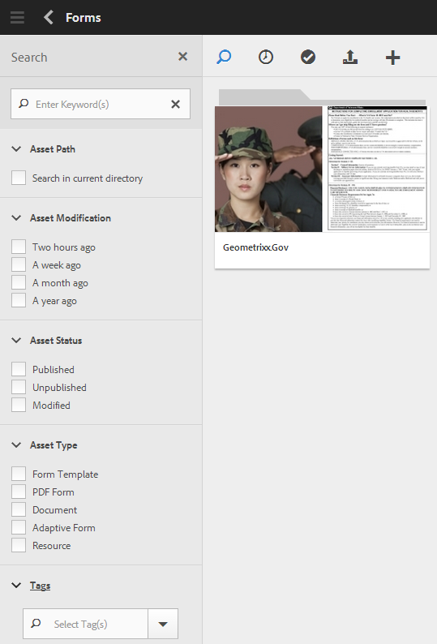

# Ricerca di moduli e risorse{#searching-for-forms-and-assets}

È possibile cercare i moduli o le risorse dei moduli utilizzando una stringa di testo o una stringa di testo insieme a caratteri jolly. Potete anche restringere la ricerca utilizzando i criteri disponibili in varie categorie nel pannello Ricerca.

Quando selezioni uno o più criteri e specifichi anche una stringa di testo, l’intersezione del testo e dei criteri viene restituita come risultato della ricerca. I risultati della ricerca sono validi quanto il modulo e i metadati della risorsa forniti.

Clic , per mostrare o nascondere il pannello di ricerca.

## Ricerca di base {#basic-search}

Una ricerca di base è la ricerca predefinita, eseguita senza specificare alcun filtro. AEM Forms esegue una ricerca full-text sulle proprietà dei metadati.

Per eseguire una ricerca di base, immetti la query di ricerca nel campo di testo e premi Invio. È inoltre possibile immettere il carattere jolly (&#42;) per trovare una corrispondenza con un numero qualsiasi di caratteri.

Adobe Experience Manager cerca il testo immesso nelle proprietà dei metadati e restituisce i risultati corrispondenti. Se si digitano più parole, l&#39;operazione di ricerca corrisponderà al testo completo per la ricerca.

Per quanto riguarda la ricerca di base, tieni presente quanto segue:

* La ricerca viene eseguita utilizzando le proprietà dei metadati del modulo e della risorsa.
* Se si digitano più parole, l&#39;operazione di ricerca corrisponderà al testo completo per la ricerca.
* La ricerca non fa distinzione tra maiuscole e minuscole. Ad esempio, quando si digita `geometrixx`, risorse con titoli `Geometrixx`, `GEOMETRIXX`, e `GeoMetRixx` vengono visualizzati nei risultati della ricerca.

* Le corrispondenze parziali di una parola non sono supportate. Per eseguire una ricerca utilizzando stringhe parziali, utilizzare &#42; carattere jolly. Tuttavia, se la query di ricerca corrisponde a una parola completa, viene visualizzata la maschera o la risorsa corrispondente.
* Gli spazi aggiuntivi vengono rispettati e non vengono tagliati durante la ricerca. Ad esempio: `My form` non è la stessa query di ricerca `My form`.

* Se i dati e i valori visualizzati dei campi nelle proprietà dei metadati sono diversi, non è possibile utilizzare i valori visualizzati come parametri di ricerca. Ad esempio, non è possibile eseguire ricerche in base a uno stato, ad esempio Modificato o Pubblicato, poiché queste proprietà vengono memorizzate in un formato diverso.

## Ricerca avanzata {#advanced-search}

Nei criteri di ricerca, oltre alla query puoi specificare alcuni parametri di ricerca per rendere la ricerca di base più efficiente e mirata.

Campo di ricerca e parametri o filtri per il modulo AEM e la ricerca di risorse

### Percorso risorsa {#asset-path}

Utilizzando il filtro percorso risorsa, puoi limitare i risultati della ricerca alla directory corrente. Se l&#39;opzione Cerca nella directory corrente non è selezionata, i risultati della ricerca contengono le risorse della directory di base. Se la pagina corrente non è una directory e l’opzione &quot;cerca nella directory corrente&quot; è selezionata, la ricerca restituisce le risorse presenti nella directory principale.

### Modifica risorsa {#asset-modification}

Seleziona una delle seguenti opzioni per eseguire ricerche in tutte le risorse modificate in un determinato periodo di tempo.

| **Opzione** | **Descrizione** |
|---|---|
| Due ore fa | Cerca in tutte le risorse modificate nelle ultime due ore. |
| Una settimana fa | Cerca in tutte le risorse modificate nell&#39;ultima settimana. |
| Un mese fa | Cerca in tutte le risorse modificate nell&#39;ultimo mese. |
| Un anno fa | Cerca in tutte le risorse modificate nell&#39;ultimo anno. |

### Stato risorsa {#asset-status}

Puoi cercare le risorse utilizzando uno dei seguenti stati:

* **Pubblicato**: cerca tutte le risorse pubblicate e non modificate dopo la pubblicazione.

* **Non pubblicato**: cerca tutte le risorse che non vengono mai pubblicate.

* **Modificato**: cerca tutte le risorse modificate o non pubblicate dopo la pubblicazione.

### Tipo risorsa {#asset-type}

Puoi selezionare un numero qualsiasi di tipi di risorse. La ricerca restituisce l’unione di tutti i tipi di risorse selezionati.

<table>
 <tbody>
  <tr>
   <th>Opzione</th> 
   <th>Descrizione</th> 
  </tr>
  <tr>
   <td>Modello modulo  </td> 
   <td>Cerca in tutti i modelli di modulo.  </td> 
  </tr>
  <tr>
   <td>Modulo PDF</td> 
   <td>Cerca in tutti i documenti di PDF.</td> 
  </tr>
  <tr>
   <td>Documento</td> 
   <td>Cerca in tutti i documenti.</td> 
  </tr>
  <tr>
   <td>Modulo adattivo  </td> 
   <td>Cerca in tutti i moduli adattivi.</td> 
  </tr>
  <tr>
   <td>Risorsa</td> 
   <td>Cerca in tutte le risorse.  </td> 
  </tr>
 </tbody>
</table>

### Tag {#tags}

I tag sono etichette allegate alle risorse per l’identificazione. Durante la ricerca, seleziona un numero qualsiasi di tag dal menu a discesa o aggiungi tag personalizzati, se necessario. Un risultato di ricerca contiene l&#39;intersezione dei tag selezionati.
