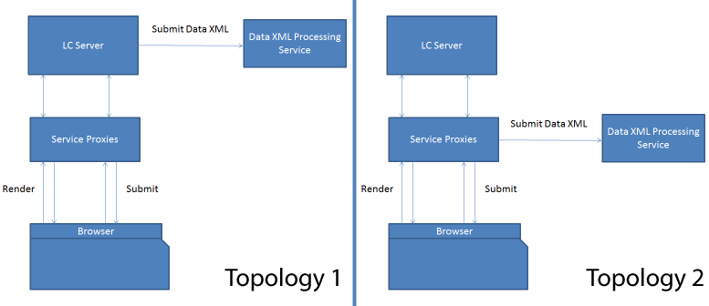

# Proxy del servizio HTML5 forms{#html-forms-service-proxy}

Il proxy di servizio HTML5 forms è una configurazione per registrare un proxy per il servizio di invio. Per configurare il proxy di servizio, specifica l’URL del servizio di invio tramite il parametro di richiesta *submitServiceProxy*.

## Vantaggi del proxy di servizio {#benefits-of-service-proxy-br}

Il proxy del servizio elimina quanto segue:

* Il flusso di lavoro dei moduli di HTML5 richiede l’apertura del servizio di invio &quot;/content/xfaforms/submit/default&quot; per gli utenti dei moduli di HTML5. Espone AEM server a un pubblico non intenzionale più ampio.
* L’URL del servizio è incorporato nel modello runtime del modulo. Non è possibile modificare il percorso URL del servizio.
* L’invio avviene in due fasi. Per inviare i dati del modulo, l’invio richiede almeno due percorsi al server. Pertanto, aumenta il carico sul server.
* I moduli di HTML5 inviano dati nella richiesta di POST anziché nella richiesta di PDF. Per i flussi di lavoro che coinvolgono sia i moduli di PDF che HTML5, sono necessari due diversi metodi di elaborazione degli invii.

### Topologie {#topologies-br}

I moduli di HTML5 possono utilizzare le seguenti topologie per connettersi ai server di AEM.

* Topologia in cui AEM server o HTML5 inviano dati tramite POST al server.
* Una topologia in cui il server proxy invia dati POST al server.

topologie proxy del servizio HTML5 forms

I moduli di HTML5 si connettono ai server AEM per eseguire script, servizi Web e invii lato server. Il runtime XFA dei moduli HTML5 utilizza le chiamate Ajax al punto finale &quot;/bin/xfaforms/submitaction&quot; con vari parametri per la connessione ai server AEM. HTML5 forms collega AEM server per eseguire le operazioni seguenti:

#### Esegui script lato server e servizi Web {#execute-server-sided-scripts-and-web-services}

Gli script contrassegnati per l&#39;esecuzione sul server sono noti come script sul lato server. Nella tabella seguente sono elencati tutti i parametri utilizzati negli script lato server e nei servizi Web.

<table>
 <tbody>
  <tr>
   <td>
<strong>Parametro</strong>
 </td>
   <td>
<strong>Descrizione</strong>
 </td>
  </tr>
  <tr>
   <td>
activity
 </td>
   <td>
L’attività contiene gli eventi che attivano la richiesta. Ad esempio clic, uscita o modifica
 </td>
  </tr>
  <tr>
   <td>
contextSom
 </td>
   <td>
contextSom contiene l'espressione SOM dell'oggetto in cui vengono eseguiti gli eventi.
 </td>
  </tr>
  <tr>
   <td>
Modello
 </td>
   <td>
Il modello contiene il modello utilizzato per eseguire il rendering del modulo.
 </td>
  </tr>
  <tr>
   <td>
contentRoot
 </td>
   <td>
contentRoot contiene la directory principale dei modelli utilizzata per eseguire il rendering del modulo.
 </td>
  </tr>
  <tr>
   <td>
Dati
 </td>
   <td>
I dati contengono byte utilizzati per il rendering del modulo.
 </td>
  </tr>
  <tr>
   <td>
formDom
 </td>
   <td>
formDom contiene il DOM del modulo HTML5 in formato JSON.
 </td>
  </tr>
  <tr>
   <td>
packet
 </td>
   <td>
il pacchetto è specificato come modulo.
 </td>
  </tr>
  <tr>
   <td>
debugDir
 </td>
   <td>
debugDir contiene la directory di debug utilizzata per eseguire il rendering del modulo.
 </td>
  </tr>
 </tbody>
</table>

#### Invia dati {#submit-data}

Facendo clic sul pulsante di invio, HTML5 forms invia i dati al server. Nella tabella seguente sono elencati tutti i parametri inviati al server dai moduli HTML5.

<table>
 <tbody>
  <tr>
   <td>
<strong>Parametro</strong>
 </td>
   <td>
<strong>Descrizione</strong>
 </td>
  </tr>
  <tr>
   <td>
Modello
 </td>
   <td>
Modello utilizzato per il rendering del modulo.
 </td>
  </tr>
  <tr>
   <td>
contentRoot
 </td>
   <td>
directory principale dei modelli utilizzata per eseguire il rendering del modulo.
 </td>
  </tr>
  <tr>
   <td>
Dati
 </td>
   <td>
byte utilizzati per il rendering del modulo.
 </td>
  </tr>
  <tr>
   <td>
formDom
 </td>
   <td>
DOM del modulo HTML5 in formato JSON.
 </td>
  </tr>
  <tr>
   <td>
submiturl
 </td>
   <td>
URL in cui vengono inviati i dati XML.
 </td>
  </tr>
  <tr>
   <td>
debugDir
 </td>
   <td>
Directory di debug utilizzata per eseguire il rendering del modulo.
 </td>
  </tr>
 </tbody>
</table>

#### Come funziona il proxy di invio? {#how-nbsp-the-nbsp-submit-proxy-works}

Il proxy del servizio di invio funge da pass-through se il submiturl non è presente nel parametro della richiesta. Agisce come un passaggio. Invia la richiesta al punto finale /bin/xfaforms/submitaction e invia la risposta al runtime XFA.

Il proxy del servizio di invio seleziona una topologia se il submiturl è presente nel parametro della richiesta.

* Se AEM server pubblicano i dati, il servizio proxy funge da pass-through. Invia la richiesta al punto finale /bin/xfaforms/submitaction e invia la risposta al runtime XFA.
* Se il proxy invia i dati, il servizio proxy trasmette tutti i parametri eccetto submitUrl al */bin/xfaforms/submitaction* end point e riceve byte xml nel flusso di risposta. Quindi, il servizio proxy invia i byte xml dei dati a submitUrl per l&#39;elaborazione.

* Prima di inviare dati (richiesta POST) a un server, HTML5 forms verifica la connettività e la disponibilità del server. Per verificare connettività e disponibilità, i moduli di HTML inviano una richiesta head vuota al server. Se il server è disponibile, il modulo HTML5 invia i dati (richiesta POST) al server. Se il server non è disponibile, viene visualizzato un messaggio di errore *Impossibile connettersi al server,* viene visualizzato. Il rilevamento anticipato impedisce agli utenti di compilare il modulo con difficoltà. Il servlet proxy gestisce la richiesta head e non genera l&#39;eccezione.
