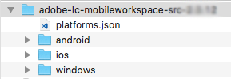

# Configura il progetto Android™ Studio e crea l&#39;app Android™ {#set-up-the-android-studio-project-and-build-the-android-app}

Questo articolo è destinato alla creazione dell’app AEM Forms 6.3.1.1 e versioni successive. Per creare un’app dal codice sorgente dell’app AEM Forms 6.3, consulta [Configurare il progetto Eclipse e creare l’app Android™](/help/forms/using/setup-eclipse-project-build-installer.md).

AEM Forms fornisce il codice sorgente completo dell’app AEM Forms. L’origine contiene tutti i componenti per creare un’app AEM Forms personalizzata. L’archivio del codice sorgente, `adobe-lc-mobileworkspace-src-<version>.zip` fa parte di `adobe-aemfd-forms-app-src-pkg-<version>.zip` pacchetto sulla Distribuzione di software.

Per ottenere l’origine dell’app AEM Forms, effettua le seguenti operazioni:

1. Apri [Software Distribution](https://experience.adobe.com/downloads). Per accedere a Software Distribution è necessario disporre di un Adobe ID.
1. Seleziona **[!UICONTROL Adobe Experience Manager]** disponibile nel menu di intestazione.
1. In **[!UICONTROL Filtri]** sezione:
   1. Seleziona **[!UICONTROL Forms]** dal **[!UICONTROL Soluzione]** elenco a discesa.
   2. Seleziona la versione e digita per il pacchetto. È inoltre possibile utilizzare **[!UICONTROL Cerca download]** per filtrare i risultati.
1. Selezionare il nome del pacchetto applicabile al sistema operativo in uso, quindi selezionare **[!UICONTROL Accetta termini EULA]**, e seleziona **[!UICONTROL Scarica]**.
1. Apri [Gestione pacchetti](https://experienceleague.adobe.com/docs/experience-manager-65/administering/contentmanagement/package-manager.html)  e fai clic su **[!UICONTROL Carica pacchetto]** per caricare il pacchetto.
1. Seleziona il pacchetto e fai clic su **[!UICONTROL Installa]**.

Nell&#39;immagine seguente viene visualizzato il contenuto estratto del `adobe-lc-mobileworkspace-src-<version>.zip`.

Nell&#39;immagine seguente viene visualizzata la struttura di directory del `android`cartella in `src`cartella.

## Creare un’app AEM Forms standard {#set-up-the-xcode-project}

1. Per configurare un progetto in Android™ Studio e fornire un’identità di firma, effettua le seguenti operazioni:

   Accedi a un computer in cui è installato e configurato Android™ Studio.

1. Copia il scaricato `adobe-lc-mobileworkspace-src-<version>.zip` archivia in:

   **Per gli utenti Mac**: `[User_Home]/Projects`

   **Per gli utenti Windows®**: `%HOMEPATH%\Projects`

   >[!NOTE]
   >
   >Per Windows®, si consiglia di mantenere il progetto Android™ nell&#39;unità di sistema.

1. Estrai l’archivio nella seguente directory:

   **Per gli utenti Mac**: `[User_Home]/Projects/[your-project]`

   **Per gli utenti Windows®**: `%HOMEPATH%\Projects\[your-project]`

   >[!NOTE]
   >
   Si consiglia di mantenere il progetto Android estratto nell&#39;unità di sistema prima di importarlo in Android™ Studio.

1. Avvia Android™ Studio.

   **Per gli utenti Mac**: aggiorna il `local.properties` file presente in `[User_Home]/Projects/[your-project]/android` cartella e puntare `sdk.dir` variabile a `SDK` sul desktop.

   **Per gli utenti Windows®**: aggiorna il `local.properties` file presente in `%HOMEPATH%\Projects\[your-project]\android` cartella e puntare `sdk.dir` variabile a `SDK` sul desktop.

1. Clic **[!UICONTROL Fine]** per generare il progetto.

   Il progetto è disponibile in Gestione progetti ADT.

   

1. In Android™ Studio, seleziona **[!UICONTROL Importa progetto (Eclipse ADT, Gradle, Ecc.)]**.
1. In Esplora progetti, seleziona la directory principale del progetto che desideri creare in **Directory principale** casella di testo:

   **Per gli utenti di Mac:** [User_Home]/Projects/MobileWorkspace/src/android

   **Per gli utenti di Windows®:** %HOMEPATH%\Projects\MobileWorkspace\src\android

1. Dopo l’importazione del progetto, viene visualizzato un pop-up con l’opzione di aggiornamento del plug-in Android™ Gradle. Fai clic sul pulsante appropriato a seconda delle tue esigenze.

   

1. Dopo aver generato la gradle, viene visualizzata la seguente schermata. Collegare il dispositivo o l&#39;emulatore appropriato al sistema e fare clic su **[!UICONTROL Esegui Android™]**.

   

1. Android™ Studio visualizza i dispositivi collegati e gli emulatori disponibili. Selezionare il dispositivo su cui si desidera eseguire l&#39;applicazione e quindi fare clic su **OK**.

   

Dopo aver creato il progetto, puoi scegliere di installare l’app utilizzando Android™ Debug Bridge o Android™ Studio.

### Utilizzo di Android™ Debug Bridge {#andriod-debug-bridge}

È possibile installare l&#39;applicazione su un dispositivo Android™ tramite [Bridge di debug Android™](https://developer.android.com/tools/adb) con il comando seguente:

**Per gli utenti Mac**: `adb install [User_Home]/Projects/[your-project]/adobe-lc-mobileworkspace-src-[version]/android/build/outputs/apk/android-debug.apk`

**Per gli utenti Windows®**: `adb install %HOMEPATH%\Projects\[your-project]\adobe-lc-mobileworkspace-src-[version]\android\build\outputs\apk\android-debug.apk`
