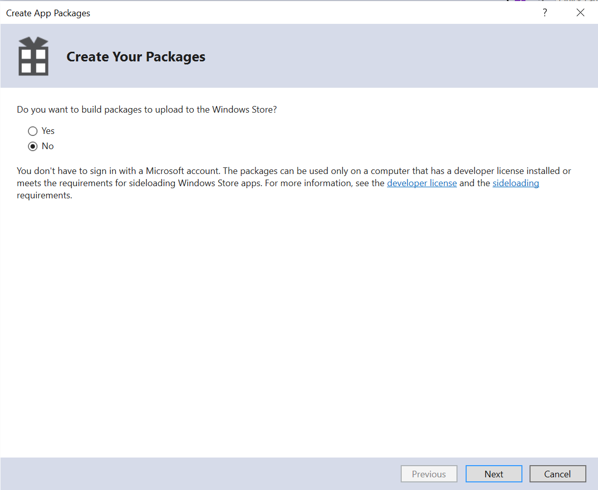
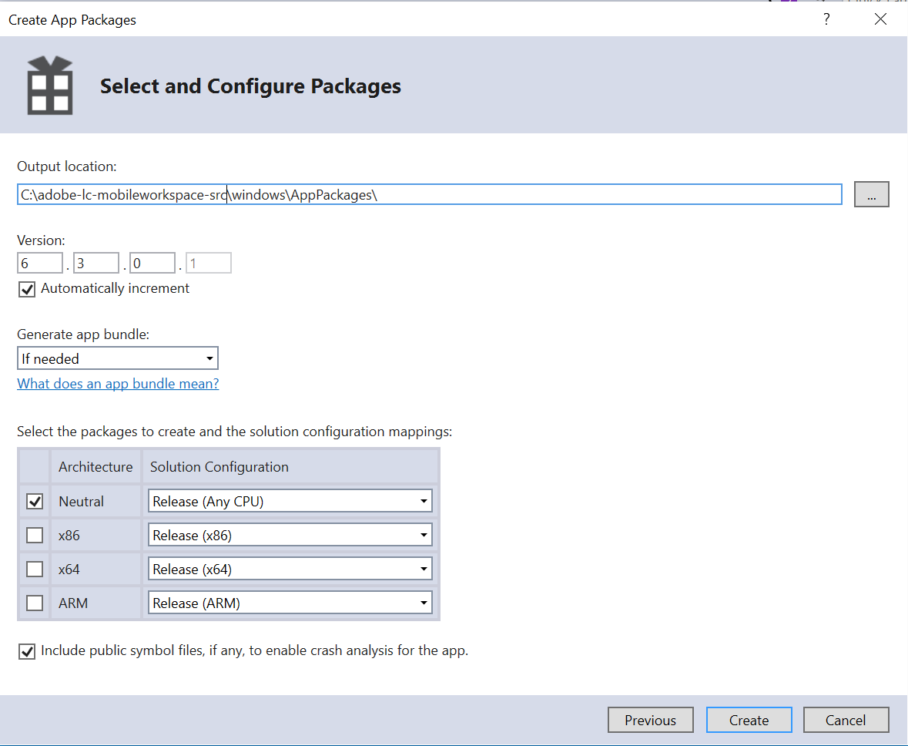

# Configurare il progetto Visual Studio e creare l&#39;app Windows{#set-up-the-visual-studio-project-and-build-the-windows-app}

 AEM Forms fornisce il codice sorgente completo dell&#39;app AEM Forms . L&#39;origine contiene tutti i componenti per creare un&#39;applicazione area di lavoro personalizzata. L&#39;archivio del codice sorgente, `adobe-lc-mobileworkspace-src-<version>.zip`è una parte del pacchetto `adobe-aemfd-forms-app-src-pkg-<version>.zip` sulla distribuzione del software.

Per ottenere l&#39;origine dell&#39;app AEM Forms , effettuate le seguenti operazioni:

1. Aprire [Distribuzione software](https://experience.adobe.com/downloads). È necessario un Adobe ID  per accedere a Distribuzione software.
1. Toccate **[!UICONTROL Adobe Experience Manager]** disponibile nel menu di intestazione.
1. Nella sezione **[!UICONTROL Filtri]**:
   1. Selezionare **[!UICONTROL Forms]** dall&#39;elenco a discesa **[!UICONTROL Soluzione]**.
   2. Selezionate la versione e digitate il tipo di pacchetto. Potete anche utilizzare l&#39;opzione **[!UICONTROL Download di ricerca]** per filtrare i risultati.
1. Toccate il nome del pacchetto applicabile al sistema operativo in uso, selezionate **[!UICONTROL Accetta termini EULA]**, quindi toccate **[!UICONTROL Scarica]**.
1. Aprite [Gestione pacchetti](https://docs.adobe.com/content/help/en/experience-manager-65/administering/contentmanagement/package-manager.html) e fate clic su **[!UICONTROL Carica pacchetto]** per caricare il pacchetto.
1. Selezionate il pacchetto e fate clic su **[!UICONTROL Installa]**.

1. Per scaricare l&#39;archivio del codice sorgente, aprite `https://<server>:<port>/crx/de/content/forms/mobileapps/src/adobe-lc-mobileworkspace-src-<version>.zip` nel browser.\
   Il pacchetto di origine viene scaricato sul dispositivo.

Nell&#39;immagine seguente sono visualizzati i contenuti estratti della `adobe-lc-mobileworkspace-src-<version>.zip`.

Nell&#39;immagine seguente viene visualizzata la struttura di directory della cartella `windows` nella cartella `src`.

## Impostazione dell&#39;ambiente {#setting-up-the-environment}

Per i dispositivi Windows, è necessario:

* Microsoft Windows 8.1 o Windows 10
* Microsoft Visual Studio 2015
* Microsoft Visual Studio Tools per Apache Cordova

## Configurazione di Visual Studio Project per  app AEM Forms {#setting-up-visual-studio-project-for-aem-forms-app}

Per impostare il progetto dell&#39;app AEM Forms  in Visual Studio, eseguite i seguenti passaggi.

1. Copiare l&#39;archivio `adobe-lc-mobileworkspace-src-<version>.zip` nella cartella `%HOMEPATH%\Projects` del dispositivo Windows 8.1 o Windows 10 con Visual Studio 2015 installato e configurato.
1. Estrarre l&#39;archivio nella directory `%HOMEPATH%\Projects\MobileWorkspace`.
1. Andate alla directory `%HOMEPATH%\Projects\MobileWorkspace\adobe-lc-mobileworkspace-src-[versionsrc]\windows`.
1. Aprire il file `CordovaApp.sln` utilizzando Visual Studio 2015 e procedere alla creazione dell&#39;app AEM Forms .

## Creare  app AEM Forms {#build-aem-forms-app}

Effettuate le seguenti operazioni per creare e distribuire  app AEM Forms.

>[!NOTE]
>
>I dati memorizzati nel file system Windows per  app AEM Forms non sono crittografati. Si consiglia di utilizzare uno strumento di terze parti come Crittografia unità BitLocker di Windows per crittografare i dati del disco.

1. Nella barra degli strumenti di Visual Studio Standard, selezionare **Release** dall&#39;elenco a discesa per la modalità di creazione.

1. Seleziona Windows-AnyCPU, Windows-x64 o Windows-x86 in base alla piattaforma in uso. Si consiglia Windows-AnyCPU.
1. In Esplora soluzioni di Visual Studio fare clic con il pulsante destro del mouse sul progetto **CordovaApp.Windows** e selezionare **Store > Create AppPackages**.

   

   Viene visualizzata la procedura guidata Crea pacchetti app.

   Il file del programma di installazione CordovaApp.Windows_3.0.2.0_anycpu.appx viene creato nella directory platforms\windows\AppPackages\CordovaApp.Windows_3.0.2.0_anycpu_Test.

   Se si verifica l&#39;errore `Retarget to windows 8.1 required`, fare clic con il pulsante destro del mouse sull&#39;errore e, nel menu a comparsa, selezionare **Riavvio a Windows 8.1**.

   

1. Nella procedura guidata Crea pacchetti app, seleziona il tempo atmosferico o non vuoi caricare l&#39;app nello store Windows, quindi fai clic su **Avanti**.

   

1. Apportate le modifiche necessarie ai parametri, ad esempio la versione e il percorso di output della build dell&#39;app.

   

1. Dopo aver creato il progetto, potete installare l&#39;app utilizzando:

   * Windows PowerShell
   * Visual Studio

   Il pacchetto `.appx` richiede che i seguenti elementi vengano installati correttamente:

   1. Libreria WinJS
   1. Verificate che il pacchetto sia dotato di un certificato autofirmato o di un&#39;autorità affidabile firmata come VeriSign.
   1. Licenza sviluppatore

   La directory Platforms\windows\AppPackages\CordovaApp.Windows_3.0.2.0_anycpu_Test contiene i quattro componenti principali:

   1. `.appx` file
   1. Certificato (attualmente è un certificato autofirmato di Apache Cordova)
   1. Cartella dipendenze
   1. File PowerShell (.ps1 extension)

## Distribuzione di un&#39;app tramite Windows PowerShell {#deploying-an-app-using-windows-powershell}

Esistono due modi per installare l&#39;applicazione su un dispositivo Windows.

### Acquisendo la licenza sviluppatore {#by-acquiring-the-developer-license}

1. Fare clic con il pulsante destro del mouse sul file PowerShell ( `Add-AppDevPackage.ps1)`, quindi scegliere **Esegui con PowerShell**.

1. La configurazione richiede di ottenere una licenza sviluppatore. Utilizzate le credenziali dell&#39;account Microsoft per ottenere la licenza per lo sviluppatore.\
   Questa licenza è valida per 30 giorni e può essere rinnovata gratuitamente.
1. Quando acquistate la licenza di sviluppatore, la configurazione installa il certificato autofirmato sul sistema e l&#39;applicazione viene installata correttamente.

### Utilizzando dispositivi di proprietà aziendale {#by-using-enterprise-owned-devices}

Per i dispositivi di proprietà dell&#39;azienda che fanno parte del dominio dell&#39;azienda, non è necessario acquisire una licenza sviluppatore.

I dispositivi di proprietà Enterprise utilizzano le edizioni Professional ed Enterprise di Windows.

Microsoft consiglia di installare un certificato pubblico emesso da un&#39;autorità affidabile, ad esempio VeriSign.

Per distribuire l&#39;app:

* Assicurarsi che il dispositivo sia unito al dominio dell&#39;organizzazione.
* Abilitare l&#39;impostazione dei criteri di gruppo.

**Per abilitare l&#39;impostazione dei criteri di gruppo:**

1. Nel dispositivo, eseguire `gpedit.msc`.
1. Andate a **Configurazione computer > Modelli amministrativi > Componente Windows > Distribuzione pacchetto app**.
1. Fare clic con il pulsante destro del mouse su **Consenti l&#39;installazione di tutte le app attendibili**.
1. Fare clic su **Modifica** e selezionare **Abilitato**.

1. Fai clic su **OK**.

Modificare lo script PowerShell generato da Visual Studio per impedirne l&#39;acquisizione da parte dello sviluppatore.

Nello script PowerShell, impostare la variabile: `$NeedDeveloperLicense = $false`.

Per i dispositivi che non fanno parte del dominio, è necessario il codice di attivazione del prodotto per il caricamento laterale. È possibile acquistarlo da un rivenditore Windows.

Per Windows 8.1 Home Edition non è disponibile alcun criterio di gruppo, il caricamento laterale dell&#39;organizzazione non è consentito e non è possibile unirsi a esso con il dominio Enterprise. Distribuite l&#39;app su un dispositivo Windows 8.1 Home Edition utilizzando la licenza per sviluppatori.

Per ulteriori informazioni, fare clic su [qui](https://blogs.msdn.com/b/mvpawardprogram/archive/2014/03/24/side-loading-deployment-of-windows-store-apps-in-enterprises-step-by-step.aspx).

## Distribuzione di un&#39;app utilizzando Visual Studio {#deploying-an-app-using-visual-studio}

Per installare l&#39;app in Windows utilizzando Visual Studio:

1. Collegare il dispositivo mediante il debugger remoto.\
   Per ulteriori informazioni, vedere [Eseguire app Windows Store su un computer remoto](https://docs.microsoft.com/en-us/visualstudio/debugger/run-windows-store-apps-on-a-remote-machine).

1. Con l&#39;app aperta in Visual Studio, scegliere Windows-x64, Windows-x86 o Windows-AnyCPU dall&#39;elenco Piattaforme soluzione, quindi selezionare **Computer remoto**.
1. L&#39;app è distribuita sul computer remoto.

