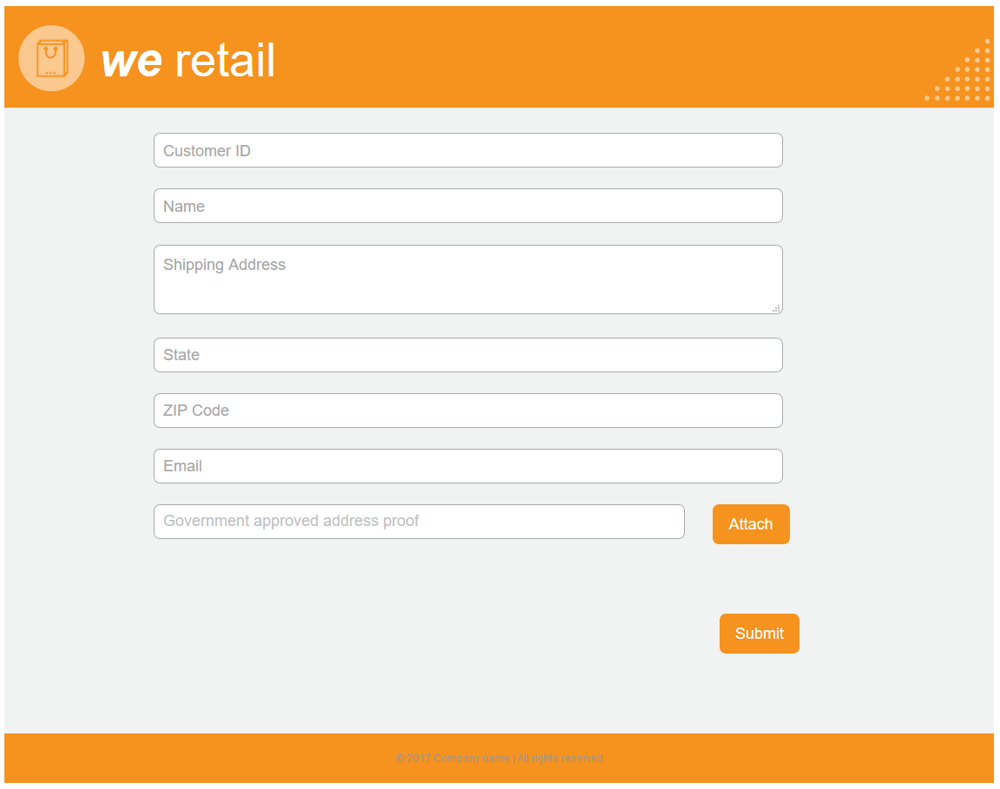
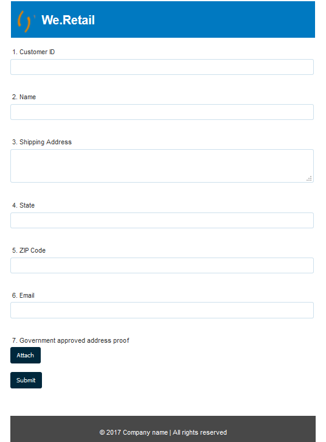
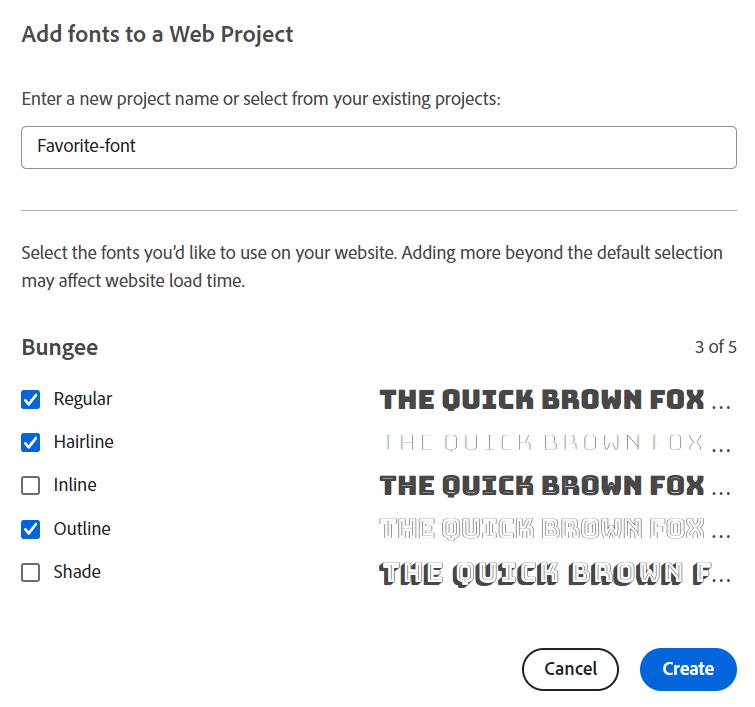

# Personalizzare lo stile del modulo adattivo {#do-not-publish-style-your-adaptive-form}

Scopri come creare un tema personalizzato, assegnare uno stile ai singoli componenti e utilizzare i Web Fonts in un tema.

Questo tutorial è un passaggio del [Creare il primo modulo adattivo](https://helpx.adobe.com/it/experience-manager/6-3/forms/using/create-your-first-adaptive-form.html) serie. L’Adobe consiglia di seguire la serie in sequenza cronologica per comprendere, eseguire e dimostrare il caso di utilizzo completo dell’esercitazione.

## Informazioni sull’esercitazione  {#about-the-tutorial}

Puoi utilizzare i temi per fornire un aspetto e uno stile unici a un modulo adattivo. Puoi applicare i temi predefiniti forniti con l’editor di moduli adattivi o creare temi personalizzati. AEM [!DNL Forms] fornisci un [editor temi](https://helpx.adobe.com/experience-manager/6-3/forms/using/themes.html) per creare temi personalizzati. Un singolo tema può fornire un aspetto diverso allo stesso modulo adattivo aperto su dispositivi mobili, tablet o desktop. Qualsiasi conoscenza precedente di CSS o LESS non è necessaria per utilizzare l’editor di temi, ma è preferibile.

Al termine dell’esercitazione, dovresti essere in grado di effettuare le seguenti operazioni:

* Applicare un tema preconfigurato a un modulo adattivo
* Creare un tema per il modulo adattivo tramite l’editor tema
* Personalizzare lo stile dei singoli componenti
* Sezione bonus: Utilizzare i Web Fonts in un tema personalizzato

Dopo aver completato l’esercitazione, il modulo dovrebbe avere un aspetto simile al seguente:

## Prima di iniziare {#before-you-start}

Scarica sul computer locale le immagini con lo stile dell’intestazione e il logo forniti di seguito. L’intestazione del `shipping-address-add-update-form` il modulo adattivo utilizza le immagini con stile di intestazione e logo. L&#39;immagine in stile intestazione viene visualizzata sul lato destro dell&#39;intestazione.

[Ottieni file](assets/header-style.png)

[Ottieni file](assets/logo-1.png)

## Passaggio 1: applicare un tema al modulo adattivo {#step-apply-a-theme-to-your-adaptive-form}

L’editor di moduli adattivi fornisce più temi predefiniti. Se prevedi di non utilizzare uno stile personalizzato per il modulo adattivo, puoi pubblicare i moduli adattivi anche con un tema predefinito. I temi sono indipendenti dai moduli adattivi. Puoi applicare lo stesso tema a più moduli adattivi.

**Per applicare un tema al modulo adattivo:**

1. Apri il modulo adattivo per la modifica.

   [http://localhost:4502/editor.html/content/forms/af/shipping-address-add-update-form.html](http://localhost:4502/editor.html/content/forms/af/shipping-address-add-update-form.html)

1. Apri proprietà di **[!UICONTROL Contenitore di moduli adattivi]**. Nel browser delle proprietà, passa a **[!UICONTROL Base]** > **[!UICONTROL Tema modulo adattivo]**. Il **[!UICONTROL Tema modulo adattivo]** elenca tutti i temi predefiniti e personalizzati. Per impostazione predefinita, viene applicato il tema Area di lavoro.
1. Seleziona un tema da **[!UICONTROL Tema modulo adattivo]** campo. Ad esempio: **Tema del sondaggio**. Seleziona  quindi puoi applicare il tema selezionato.

   

   **Figura:** *Modulo adattivo con tema predefinito*

   

   **Figura:** *Modulo adattivo con tema sondaggio*

## Passaggio 2: aggiornare il modulo adattivo {#step-update-your-adaptive-form}

La progettazione mostrata sopra richiede modifiche nel testo segnaposto e nel logo del modulo adattivo esistente.

**Per aggiornare il modulo adattivo:**

1. Modifica il logo e il testo esistenti dell’intestazione. Per rimuovere il logo:

   1. Apri il modulo nell’editor moduli.

      [http://localhost:4502/editor.html/content/forms/af/shipping-address-add-update-form.html](http://localhost:4502/editor.html/content/forms/af/shipping-address-add-update-form.html)

   1. Selezionare l&#39;immagine del logo nella [!UICONTROL intestazione] componente e seleziona  **[!UICONTROL proprietà]**. In [!UICONTROL immagine] , selezionare X per rimuovere l&#39;immagine del logo esistente.
   1. Seleziona **[!UICONTROL caricare]**, selezionare logo.png e quindi fare clic su  per salvare le modifiche. L&#39;immagine è stata scaricata in [Prima di iniziare](/help/forms/using/style-your-adaptive-form.md#before-you-start) sezione.
   1. Seleziona il testo dell’intestazione, `We.Retail`, e seleziona  **[!UICONTROL modifica]**. Cambia il testo dell&#39;intestazione in `we retail`. Applica il formato grassetto solo a `we`in `we retail`.

      

1. Rimuovi titolo e aggiungi testo segnaposto:

   1. Seleziona il campo ID cliente e seleziona  proprietà.
   1. Copia il contenuto del **[!UICONTROL Titolo]** campo al **[!UICONTROL Testo segnaposto]** campo.
   1. Elimina il contenuto del **[!UICONTROL Titolo]** e seleziona .
   1. Ripetere i tre passaggi precedenti per tutte le caselle di testo, la casella numerica e il campo e-mail del modulo.

      

## Passaggio 3: creare un tema personalizzato per il modulo adattivo {#step-create-a-custom-theme-for-your-adaptive-form}

È possibile utilizzare [editor temi](/help/forms/using/themes.md) per creare temi personalizzati. L’editor del tema è un potente editor WYSIWYG. È un metodo visivo per applicare CSS a vari componenti di un modulo adattivo. Fornisce controlli più precisi per formattare i componenti e i pannelli di un modulo adattivo.

Un tema è un’entità separata come i moduli adattivi. Contiene stili (CSS) per i componenti e i pannelli di un modulo adattivo. Gli stili includono proprietà CSS come i colori di sfondo, i colori degli stati, la trasparenza, l’allineamento e le dimensioni. Quando si applica un tema, lo stile specificato viene applicato ai componenti corrispondenti di un modulo adattivo.

In questo tutorial potrai applicare stili a intestazione e piè di pagina, componenti di testo e numerici, componenti di allegati e pulsanti. Iniziamo con la creazione di un tema:

### Creare un tema {#create-a-theme}

1. Accedi all’istanza di authoring dell’AEM e passa a **[!UICONTROL Adobe Experience Manager]** > **[!UICONTROL Forms]** > **[!UICONTROL Temi]**. L’URL predefinito è [http://localhost:4502/aem/forms.html/content/dam/formsanddocuments-themes](http://localhost:4502/aem/forms.html/content/dam/formsanddocuments-themes).
1. Seleziona **[!UICONTROL Crea]** e seleziona **[!UICONTROL Tema]**. Il [!UICONTROL Crea tema] viene visualizzata una pagina con i campi necessari per creare un tema. Il **[!UICONTROL Titolo]** e **[!UICONTROL Nome]** I campi sono obbligatori:

   * **Titolo:** Specifica un titolo per il tema. Ad esempio: **Tema globale.** Il titolo consente di identificare il tema dall’elenco dei temi.
   * **Nome:** Specifica il nome del tema. Ad esempio: **Tema globale.** Nell&#39;archivio viene creato un nodo con il nome specificato. Quando si inizia a digitare un titolo, il valore del campo del nome viene generato automaticamente. Puoi modificare il valore suggerito. Il campo nome può contenere solo caratteri alfanumerici, trattini e caratteri di sottolineatura. Tutti gli input non validi vengono sostituiti da un trattino.

1. Seleziona **[!UICONTROL Crea]**. Viene creato un tema e viene visualizzata una finestra di dialogo per aprire il modulo per la modifica. Seleziona **[!UICONTROL Apri]** per aprire il tema appena creato in una nuova scheda. Il tema viene aperto nell’editor temi. Per lo stile, l’editor temi utilizza un modulo adattivo fornito con l’AEM [!DNL Forms].

   Per informazioni sull’utilizzo dell’interfaccia utente dell’editor temi, consulta [Informazioni sull’editor temi](/help/forms/using/themes.md#aboutthethemeeditor).

1. Seleziona **[!UICONTROL Opzioni tema]**  > **[!UICONTROL Configura]**. In **[!UICONTROL Anteprima modulo]** , selezionare il campo **shipping-address-add-update-form** modulo adattivo, seleziona , seleziona **[!UICONTROL Salva]**. Ora l’editor temi è configurato per utilizzare un modulo adattivo personalizzato invece del modulo adattivo predefinito. Seleziona **[!UICONTROL Annulla]** per tornare all’editor temi.

   

   **Figura:** *Editor temi con il modulo adattivo shipping-address-add-update-form*

   

   **Figura:** *Modulo adattivo con modulo predefinito*

### Stile intestazione e piè di pagina {#style-header-and-footer}

Intestazione e piè di pagina forniscono un aspetto coerente e distintivo a un modulo adattivo. In genere, l’intestazione contiene il logo e il nome dell’organizzazione, il piè di pagina contiene informazioni sul copyright, che rimangono identiche in più forme di un’organizzazione. Per assegnare uno stile all’intestazione e al piè di pagina del modulo adattivo shipping-address-add-update-form:

1. Navigare nel **[!UICONTROL Intestazione]** > **[!UICONTROL Testo]** selettori. Il pannello Selettori si trova a sinistra dell’editor temi. Se il pannello non è visibile, seleziona  Attiva/Disattiva pannello laterale.

1. Imposta le seguenti proprietà in **[!UICONTROL Testo]** Pannello a soffietto e selezione .

   | Proprietà | Valore |
   |---|---|
   | Famiglia di caratteri | Arial® |
   | Colore carattere | FFFFFF |
   | Dimensione font | 54 px |

1. Seleziona la [!UICONTROL intestazione] widget e seleziona **[!UICONTROL Intestazione]**. Le opzioni per assegnare uno stile al widget Intestazione vengono visualizzate a sinistra. Espandi **[!UICONTROL Dimension e posizione]** Pannello a soffietto, imposta **[!UICONTROL Altezza]** a `120px`, e seleziona .
1. Espandi **[!UICONTROL Sfondo]** pannello a soffietto del widget intestazione, imposta **[!UICONTROL Colore di sfondo]** a `F6921E.`

   Passa il cursore sopra **[!UICONTROL Immagine e sfumatura]** > **[!UICONTROL + Aggiungi]**, seleziona **[!UICONTROL Immagine]**. Imposta le seguenti proprietà e seleziona .

   | Proprietà | Valore |
   |---|---|
   | immagine | Carica l’header-style.png. L&#39;immagine è stata scaricata in [Prima di iniziare](/help/forms/using/style-your-adaptive-form.md#before-you-start) sezione. |
   | Posizione | A destra in basso |
   | Divisione in porzioni | Nessuna ripetizione |

1. Nell’editor del tema, seleziona il logo nell’intestazione e fai clic su **[!UICONTROL Logo intestazione]**. Espandi il pannello a soffietto Dimension e posizione, imposta le seguenti proprietà e seleziona .

   <table> 
    <tbody> 
     <tr> 
      <td><b>Margine</b></td> 
      <td><b>Valore</b></td> 
     </tr> 
     <tr> 
      <td>Margine</td> 
      <td> 
       <ul> 
        <li>Superiore: 1,5 rem</li> 
        <li>Inferiore: -35 px</li> 
        <li>Sinistra: 1rem<strong>  </strong></li> 
       </ul> 
<strong>Suggerimento</strong> Seleziona la  icona di collegamento per fornire un valore diverso a ciascun campo.  
 </td> 
     </tr> 
     <tr> 
      <td>Altezza</td> 
      <td>4,75 rem</td> 
     </tr> 
    </tbody> 
   </table>

1. Selezionate il widget piè di pagina e selezionate **[!UICONTROL Piè di pagina]**. Espandi **[!UICONTROL Sfondo]** Pannello a soffietto, imposta **[!UICONTROL Colore di sfondo]** a `F6921E`, e seleziona .

### Personalizzare lo stile del componente di acquisizione dati e applicare uno sfondo al modulo adattivo {#style-the-data-capture-component-and-apply-a-background-to-the-adaptive-form}

Per acquisire i dati, in un modulo adattivo puoi utilizzare più componenti. Casella di testo e casella numerica. Puoi fornire uno stile identico a tutti i componenti di acquisizione dati o uno stile separato per ciascun componente. In questa esercitazione, viene applicato uno stile identico alle caselle numeriche (ID cliente, CAP) e alle caselle di testo (ID cliente, Nome, Indirizzo di spedizione, Stato, E-mail). Per assegnare uno stile ai componenti di acquisizione dati:

1. Seleziona la **[!UICONTROL ID cliente]** e selezionare il **[!UICONTROL Widget campo]** opzione. Imposta le seguenti proprietà e seleziona .

   <table> 
    <tbody> 
     <tr> 
      <td><b>Pannello a soffietto</b></td> 
      <td><b>Proprietà</b></td> 
      <td><b>Valore</b></td> 
     </tr> 
     <tr> 
      <td>Bordo</td> 
      <td>Colore bordo</td> 
      <td>A7A9AC</td> 
     </tr> 
     <tr> 
      <td>Bordo</td> 
      <td>Raggio bordo </td> 
      <td> 
       <ul> 
        <li>Superiore: 7 px  </li> 
        <li>Destra: 7 px  </li> 
        <li>Inferiore: 7 px  </li> 
        <li>Sinistra: 7 px  </li> 
       </ul> </td> 
     </tr> 
     <tr> 
      <td>Testo</td> 
      <td>Famiglia di caratteri</td> 
      <td>Arial®</td> 
     </tr> 
     <tr> 
      <td>Testo</td> 
      <td>Colore carattere</td> 
      <td>939598  </td> 
     </tr> 
     <tr> 
      <td>Testo</td> 
      <td>Dimensione font</td> 
      <td>18 px</td> 
     </tr> 
     <tr> 
      <td>Dimension e posizione</td> 
      <td>Larghezza</td> 
      <td>60%</td> 
     </tr> 
     <tr> 
      <td>Dimension e posizione</td> 
      <td>Margine</td> 
      <td> 
       <ul> 
        <li>Sinistra: 10 rem</li> 
       </ul> </td> 
     </tr> 
    </tbody> 
    </table>

1. Seleziona l’area vuota sopra il **[!UICONTROL ID cliente]** e seleziona **[!UICONTROL Contenitore pannello responsivo]**. Imposta il **[!UICONTROL Sfondo]** > **[!UICONTROL Colore di sfondo]** F1F2F2. Seleziona .

   

### Personalizzare lo stile dei pulsanti {#style-the-buttons}

È possibile utilizzare un tema personalizzato per applicare uno stile identico a tutti i pulsanti del modulo adattivo e [stile in linea](/help/forms/using/inline-style-adaptive-forms.md) per applicare uno stile a un pulsante specifico. Per assegnare uno stile ai pulsanti:

1. Seleziona la **[!UICONTROL Invia]** e selezionare il pulsante **[!UICONTROL Pulsante]** opzione. Imposta le seguenti proprietà e seleziona .

   <table> 
    <tbody> 
     <tr> 
      <td><b>Pannello a soffietto</b></td> 
      <td><b>Proprietà</b></td> 
      <td><b>Valore</b></td> 
     </tr> 
     <tr> 
      <td>Informazioni di base</td> 
      <td>Colore di sfondo</td> 
      <td>F6921E</td> 
     </tr> 
     <tr> 
      <td>Bordo  </td> 
      <td>Colore bordo</td> 
      <td>F6921E</td> 
     </tr> 
     <tr> 
      <td>Bordo</td> 
      <td>Raggio bordo </td> 
      <td> 
       <ul> 
        <li>Superiore: 7 px  </li> 
        <li>Destra: 7 px  </li> 
        <li>Inferiore: 7 px  </li> 
        <li>Sinistra: 7 px</li> 
       </ul> </td> 
     </tr> 
     <tr> 
      <td>Testo  </td> 
      <td>Famiglia di caratteri</td> 
      <td>Arial®</td> 
     </tr> 
     <tr> 
      <td>Testo</td> 
      <td>Colore carattere</td> 
      <td>FFFFFF</td> 
     </tr> 
     <tr> 
      <td>Testo</td> 
      <td>Dimensione font</td> 
      <td>18 px</td> 
     </tr> 
    </tbody> 
   </table>

1. [Applicare il tema personalizzato](/help/forms/using/style-your-adaptive-form.md#step-apply-a-theme-to-your-adaptive-form), tema globale, al tuo modulo adattivo. Se lo stile non riflette il modulo adattivo, pulisci la cache del browser e riprova.

   

## Passaggio 4: Personalizzare lo stile dei singoli componenti {#step-style-individual-components}

Alcuni stili sono applicabili solo a un componente specifico. Tali componenti sono formattati nell’editor di moduli adattivi.

1. Apri il modulo adattivo per la modifica. [http://localhost:4502/editor.html/content/forms/af/shipping-address-add-update-form.html](http://localhost:4502/editor.html/content/forms/af/change-billing-shipping-address.html)
1. Nella barra superiore, seleziona la **[!UICONTROL Stile]** opzione.

   

1. Seleziona la **[!UICONTROL Allega]** e selezionare il pulsante icona. Imposta le seguenti proprietà in **[!UICONTROL Dimension e posizione]** Pannello a soffietto:

   | Proprietà | Valore |
   |---|---|
   | Mobile | Sinistra |
   | Larghezza | 10% |

1. Seleziona la **[!UICONTROL Bozza indirizzo approvato dal governo]** e selezionare il icona. Imposta le seguenti proprietà:

   <table> 
    <tbody> 
     <tr> 
      <td><b>Pannello a soffietto</b></td> 
      <td><b>Proprietà</b></td> 
      <td><b>Valore</b></td> 
     </tr> 
     <tr> 
      <td>Dimensioni e posizione</td> 
      <td>Mobile</td> 
      <td>Sinistra</td> 
     </tr> 
     <tr> 
      <td>Dimensioni e posizione</td> 
      <td>Larghezza</td> 
      <td>73%</td> 
     </tr> 
     <tr> 
      <td>Dimensioni e posizione</td> 
      <td>Riempimento</td> 
      <td> 
       <ul> 
        <li>Sinistra: 10 px</li> 
       </ul> </td> 
     </tr> 
     <tr> 
      <td>Dimensioni e posizione</td> 
      <td>Altezza</td> 
      <td>40 px</td> 
     </tr> 
     <tr> 
      <td>Dimension e posizione  </td> 
      <td>Margine</td> 
      <td>  
       <ul> 
        <li>Destra: 2 rem</li> 
        <li>Sinistra: 10 rem </li> 
       </ul> </td> 
     </tr> 
     <tr> 
      <td>Informazioni di base</td> 
      <td>Colore di sfondo</td> 
      <td>FFFFFF</td> 
     </tr> 
     <tr> 
      <td>Bordo</td> 
      <td>Spessore bordo</td> 
      <td>1 px</td> 
     </tr> 
     <tr> 
      <td>Bordo</td> 
      <td>Stile bordo</td> 
      <td>Uniforme</td> 
     </tr> 
     <tr> 
      <td>Bordo</td> 
      <td>Colore bordo</td> 
      <td>A7A9AC</td> 
     </tr> 
     <tr> 
      <td>Bordo</td> 
      <td>Raggio bordo</td> 
      <td>7 px</td> 
     </tr> 
     <tr> 
      <td>Testo</td> 
      <td>Famiglia di caratteri</td> 
      <td>Arial®</td> 
     </tr> 
     <tr> 
      <td>Testo</td> 
      <td>Colore carattere</td> 
      <td>BCBEC0</td> 
     </tr> 
     <tr> 
      <td>Testo</td> 
      <td>Dimensione font</td> 
      <td>18 px</td> 
     </tr> 
     <tr> 
      <td>Testo</td> 
      <td>Altezza riga</td> 
      <td>2</td> 
     </tr> 
     </tr> 
    </tbody> 
   </table>

1. Seleziona la **[!UICONTROL Invia]** e selezionare il pulsante  icona. Imposta le seguenti proprietà:

   <table> 
    <tbody> 
     <tr> 
      <td><b>Pannello a soffietto</b></td> 
      <td><b>Proprietà</b></td> 
      <td><b>Valore</b></td> 
     </tr> 
     <tr> 
      <td>Dimension e posizione</td> 
      <td>Mobile</td> 
      <td>Destra</td> 
     </tr> 
     <tr> 
      <td>Dimension e posizione</td> 
      <td>Margine</td> 
      <td> 
       <ul> 
        <li>Superiore: 5 rem</li> 
        <li>A destra: 14 rem</li> 
        <li>Inferiore: 20 px</li> 
        <li>Sinistra: 20 px  </li> 
       </ul> </td> 
     </tr> 
     <tr> 
      <td>Informazioni di base</td> 
      <td>Colore di sfondo</td> 
      <td>F6921E</td> 
     </tr> 
     <tr> 
      <td>Bordo</td> 
      <td>Colore bordo</td> 
      <td>F6921E</td> 
     </tr> 
    </tbody> 
   </table>

   

## Passaggio 5: sezione bonus: utilizzo di Web Fonts in un tema personalizzato {#step-bonus-section-using-web-fonts-in-a-custom-theme}

Puoi utilizzare vari font per progettare un modulo adattivo. È possibile che in tutti i dispositivi su cui viene visualizzato il modulo adattivo non siano presenti i font utilizzati per progettarlo. È possibile utilizzare un servizio di caratteri Web per fornire i caratteri richiesti al dispositivo di destinazione.

[!DNL Adobe Fonts] è un servizio di Web Fonts. Puoi configurare e utilizzare il servizio con i moduli adattivi. Da utilizzare [!DNL Adobe Fonts] in un modulo adattivo:
1. Sfoglia [libreria di font di Adobe](https://fonts.adobe.com/) e scegliere il tipo di carattere con cui applicare lo stile al modulo.
<!--
>[!NOTE]
>
> [!DNL Typekit] is now called Adobe Fonts and is included with Creative Cloud and other subscriptions. [Learn more](https://fonts.adobe.com/).-->

>[!NOTE]
>
> È possibile aggiungere tag o filtri per perfezionare l&#39;elenco dei caratteri.

1. Fai clic sul pulsante &lt;/> per aggiungere la famiglia a un progetto web, nel caso in cui trovi un font che ti piace.

   

   Viene visualizzata la finestra di dialogo Aggiungi font a un progetto web.

   >[!NOTE]
   >
   > È possibile aggiungere caratteri al progetto Web solo se il pulsante &lt;/> è disponibile.

2. Assegna un nome al progetto web.
3. Selezionare le caselle di controllo per selezionare i pesi e gli stili dei caratteri che si desidera includere.

   

4. Seleziona **Clic** per creare il progetto.
5. Copia il codice da incorporare e l’URL dalla schermata.
   

6. Clic **Fine** per chiudere la finestra del progetto web.
7. Accedi all’istanza AEM e vai all’URL `http://server:port/crx/de/index.jsp#`
8. Creare una struttura di cartelle in CRXDE, ad esempio `/apps/[fontslibrary]/[customlibrary(clientlibrary)]`.
9. Passa alla nuova `clientlibs` cartella e aggiungi `allowProxy` e `categories` proprietà.
10. Accedi a `/apps/[fontslibrary]/[customlibrary(clientlibrary)]` e crea una cartella css.
11. Vai alla cartella CSS creata e crea un file. Ad esempio, crea un file come `fonts.css` e incolla il codice da incorporare insieme all’URL.
   
12. Salva le modifiche.

>[!NOTE]
>
> Per utilizzare i font personalizzati aggiunti in un modulo adattivo, accertati che il nome della libreria client nel **[!UICONTROL Categoria libreria client]** viene allineato con il nome specificato nell’opzione categorie della cartella clientlib.

I font inclusi sono ora accessibili al modulo adattivo tramite la seguente libreria client font personalizzata.

<!--
Create Adobe Fonts Configuration

1. To create a API Token, go to **login** > **API Token** > **Make me a new API token**.

   

2. Once, you click **Make me a new API token**, a new token is generated. 
3. Copy the generated token for future use.
4. Now login to your AEM  author instance. On the author instance, go to **[!UICONTROL Tools]**>**[!UICONTROL Cloud Services]**> **[!UICONTROL Adobe Fonts]**.
5. Select the configuration container and click **Create**. **[UICONTROL Create Adobe Fonts Configuration]** screen appears.
    

6. Spceify the name and paste the API token in the **[!UICONTROL Kit ID]** textbox.
7. Click **Create**.

The fonts added to the **[!UICONTROL Adobe Fonts]** are available for selection in the **[!UICONTROL Text]** accordion of all the components.
1. In the theme editor, navigate to **[!UICONTROL Theme Options]**  > **[!UICONTROL Configure]**. 
2. In the **[!UICONTROL Adobe Fonts Configuration]** field, select the kit, and click **[!UICONTROL Save]**.

1. Create an [Adobe Fonts](https://fonts.adobe.com/?ref=tk.com) account, create a kit, add font Myriad Pro to the kit, publish the kit, and obtain the Kit ID. It is required to use [!DNL Adobe Fonts] (Web Fonts) in an adaptive form. 
1. In the AEM [!DNL Forms] Server, navigate to  **[!UICONTROL Adobe Experience Manager]** > **[!UICONTROL Tools]**  > **[!UICONTROL Adobe Fonts]**. Now, open a configuration folder. If a configuration is already available, click the **[!UICONTROL Create]** button to create an instance.

   On the Create Configuration dialog, specify a **Title** for the configuration, and click **[!UICONTROL Create]**. You are redirected to the configuration page. In the [!UICONTROL Edit Component] dialog that appears, provide your **Kit ID** and click **[!UICONTROL OK]**. -->

