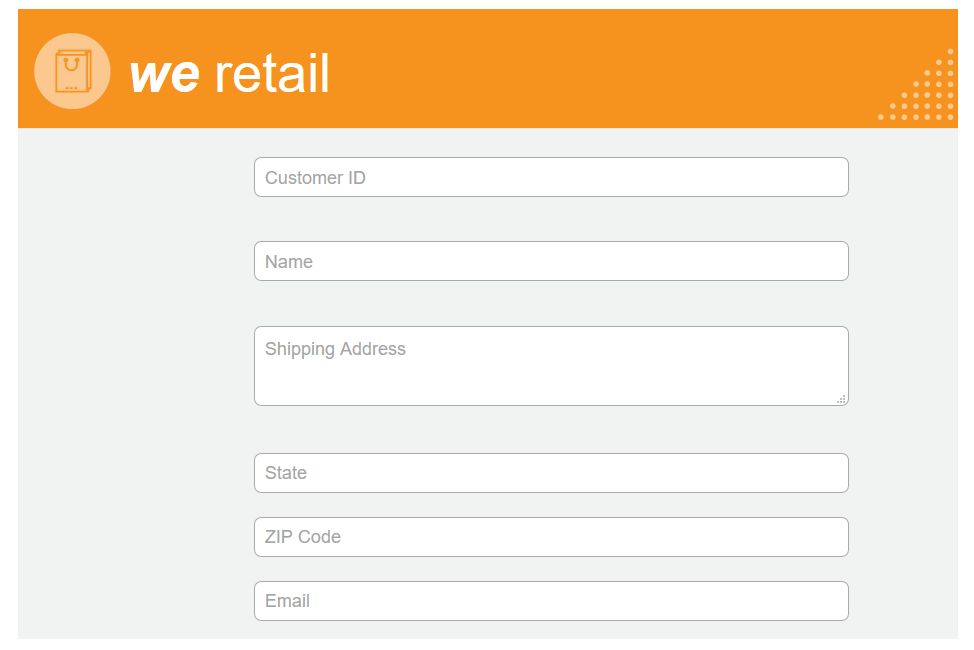

# Personalizzare lo stile del modulo adattivo {#do-not-publish-style-your-adaptive-form}

Scopri come creare un tema personalizzato, personalizzare lo stile dei singoli componenti e utilizzare i font web in un tema

Questa esercitazione è un passaggio nel [Creare il primo modulo adattivo](https://helpx.adobe.com/it/experience-manager/6-3/forms/using/create-your-first-adaptive-form.html) serie. Si consiglia di seguire la serie in sequenza cronologica per comprendere, eseguire e illustrare il caso d’uso completo dell’esercitazione.

## Informazioni sull’esercitazione  {#about-the-tutorial}

È possibile utilizzare i temi per fornire un aspetto e uno stile unici a un modulo adattivo. Puoi applicare i temi predefiniti forniti con l’editor di moduli adattivi o creare temi personalizzati. AEM [!DNL Forms] fornire [editor a tema](https://helpx.adobe.com/experience-manager/6-3/forms/using/themes.html) per creare temi personalizzati. Un singolo tema può dare un aspetto diverso allo stesso modulo adattivo aperto su dispositivi mobili, tablet o desktop. Qualsiasi conoscenza precedente di CSS o LESS non è necessaria per utilizzare l&#39;editor di temi, ma è desiderato.

Al termine dell’esercitazione, imparerai a:

* Applicare un tema preconfigurato a un modulo adattivo
* Creare un tema per un modulo adattivo utilizzando l’editor di temi
* Personalizzare lo stile dei singoli componenti
* Sezione bonus: Utilizzare i font web in un tema personalizzato

Dopo aver completato l’esercitazione, il modulo avrà un aspetto simile al seguente:

## Prima di iniziare {#before-you-start}

Scarica le immagini in stile intestazione e logo, riportate di seguito, sul computer locale. Intestazione del `shipping-address-add-update-form` Il modulo adattivo utilizza le immagini in stile intestazione e logo. L’immagine in stile intestazione viene visualizzata sul lato destro dell’intestazione.

[Ottieni file](assets/header-style.png)

[Ottieni file](assets/logo-1.png)

## Passaggio 1: Applicare un tema al modulo adattivo {#step-apply-a-theme-to-your-adaptive-form}

L’editor di moduli adattivi offre diversi temi predefiniti. Se si intende non utilizzare uno stile personalizzato per il modulo adattivo, è anche possibile pubblicare i moduli adattivi con un tema preconfigurato. I temi sono indipendenti dai moduli adattivi. È possibile applicare lo stesso tema a più moduli adattivi. Per applicare un tema a un modulo adattivo:

1. Apri il modulo adattivo per la modifica.

   [http://localhost:4502/editor.html/content/forms/af/shipping-address-add-update-form.html](http://localhost:4502/editor.html/content/forms/af/shipping-address-add-update-form.html)

1. Apri proprietà di **[!UICONTROL Contenitore Modulo adattivo]**. Nel browser delle proprietà, passa a **[!UICONTROL Base]** > **[!UICONTROL Tema modulo adattivo]**. La **[!UICONTROL Tema modulo adattivo]** elenca tutti i temi predefiniti e personalizzati. Per impostazione predefinita, viene applicato il tema Area di lavoro.
1. Seleziona un tema dal **[!UICONTROL Tema modulo adattivo]** campo . Ad esempio: **Tema del sondaggio**. Tocca  per applicare il tema selezionato.

   

   **Figura:** *Modulo adattivo con tema predefinito*

   

   **Figura:** *Modulo adattivo con il tema Survey*

## Passaggio 2: Aggiornare il modulo adattivo {#step-update-your-adaptive-form}

La struttura visualizzata sopra richiede modifiche nel testo segnaposto e nel logo del modulo adattivo esistente. Esegui le seguenti operazioni per apportare le modifiche richieste:

1. Modifica il logo e il testo esistenti dell’intestazione. Per rimuovere il logo:

   1. Aprire il modulo nell’editor del modulo.

      [http://localhost:4502/editor.html/content/forms/af/shipping-address-add-update-form.html](http://localhost:4502/editor.html/content/forms/af/shipping-address-add-update-form.html)

   1. Tocca l’immagine del logo nella [!UICONTROL header] componente e tocco  **[!UICONTROL proprietà]**. In [!UICONTROL immagine] tocca X per rimuovere l&#39;immagine del logo esistente.
   1. Tocca **[!UICONTROL caricare]**, seleziona il logo.png e tocca  per salvare le modifiche. L&#39;immagine è stata scaricata nel [Prima di iniziare](/help/forms/using/style-your-adaptive-form.md#before-you-start) sezione .
   1. Tocca il testo dell’intestazione, `We.Retail`, e tocca  **[!UICONTROL modifica]**. Cambia testo intestazione in `we retail`. Applica la formattazione in grassetto solo a `we`in `we retail`.

      

1. Rimuovere il titolo e aggiungere il testo segnaposto:

   1. Tocca il campo ID cliente e tocca  proprietà.
   1. Copia il contenuto del **[!UICONTROL Titolo]** al campo **[!UICONTROL Testo segnaposto]** campo .
   1. Elimina il contenuto del **[!UICONTROL Titolo]** campo e tocco .
   1. Ripetere i tre passaggi precedenti per tutte le caselle di testo, le caselle numeriche e i campi e-mail del modulo.

      

## Passaggio 3: Creare un tema personalizzato per il modulo adattivo {#step-create-a-custom-theme-for-your-adaptive-form}

È possibile utilizzare [editor a tema](/help/forms/using/themes.md) per creare temi personalizzati. L&#39;editor a tema è un potente editor WYSIWYG. È un metodo visivo per applicare CSS a vari componenti di un modulo adattivo. Fornisce controlli più precisi per assegnare uno stile ai componenti e ai pannelli di un modulo adattivo.

Un tema è un’entità separata come i moduli adattivi. Contiene stili (CSS) per i componenti e i pannelli di un modulo adattivo. Gli stili includono proprietà CSS quali colori di sfondo, colori dello stato, trasparenza, allineamento e dimensioni. Quando si applica un tema, lo stile specificato viene applicato ai componenti corrispondenti di un modulo adattivo.

In questa esercitazione verranno formattati intestazione e piè di pagina, componenti di testo e numerici, componenti di allegato e pulsanti. Cominciamo con la creazione di un tema:

### Creare un tema {#create-a-theme}

1. Accedi all&#39;istanza di authoring AEM e passa a **[!UICONTROL Adobe Experience Manager]** > **[!UICONTROL Forms]** > **[!UICONTROL Temi]**. L’URL predefinito è [http://localhost:4502/aem/forms.html/content/dam/formsanddocuments-themes](http://localhost:4502/aem/forms.html/content/dam/formsanddocuments-themes).
1. Tocca **[!UICONTROL Crea]** e seleziona **[!UICONTROL Tema]**. La [!UICONTROL Crea tema] viene visualizzata una pagina con i campi necessari per creare un tema. La **[!UICONTROL Titolo]** e **[!UICONTROL Nome]** i campi sono obbligatori:

   * **Titolo:** Specifica un titolo del tema. Ad esempio: **Tema globale.** Il titolo ti aiuta a identificare il tema dall’elenco dei temi.
   * **Nome:** Specifica il nome del tema. Ad esempio: **Tema globale.** Nel repository viene creato un nodo con il nome specificato. Quando si inizia a digitare un titolo, il valore del campo nome viene generato automaticamente. È possibile modificare il valore suggerito. Il campo name può includere solo caratteri alfanumerici, trattini e caratteri di sottolineatura. Tutti gli input non validi vengono sostituiti con un trattino.

1. Tocca **[!UICONTROL Crea]**. Viene creato un tema e viene visualizzata una finestra di dialogo per aprire il modulo per la modifica. Tocca **[!UICONTROL Apri]** per aprire il tema appena creato in una nuova scheda. Il tema si apre nell’editor di temi. Per lo stile, l’editor di temi utilizza un modulo adattivo preconfigurato fornito con AEM [!DNL Forms].

   Per informazioni sull’utilizzo dell’interfaccia utente dell’editor di temi, consulta [Informazioni sull’editor di temi](/help/forms/using/themes.md#aboutthethemeeditor).

1. Tocca **[!UICONTROL Opzioni tema]**  > **[!UICONTROL Configura]**. In **[!UICONTROL Anteprima modulo]** selezionare il campo **modulo di aggiornamento-indirizzo-spedizione** modulo adattivo, tocca , tocca **[!UICONTROL Salva]**. Ora, l’editor di temi è configurato per utilizzare il proprio modulo adattivo invece del modulo adattivo predefinito. Tocca **[!UICONTROL Annulla]** per tornare all’editor di temi.

   

   **Figura:** *Editor di temi con modulo adattivo per indirizzo di spedizione-add-update-form*

   

   **Figura:** *Modulo adattivo con il modulo predefinito*

### Intestazione e piè di pagina dello stile {#style-header-and-footer}

Le intestazioni e i piè di pagina forniscono un aspetto coerente e distintivo a un modulo adattivo. In genere, l’intestazione contiene il logo e il nome dell’organizzazione, il piè di pagina contiene informazioni sul copyright e queste rimangono identiche in più forme di un’organizzazione. Per assegnare uno stile a intestazione e piè di pagina del modulo adattivo per l’indirizzo di spedizione-add-update-form:

1. Passa alla **[!UICONTROL Intestazione]** > **[!UICONTROL Testo]** nel pannello Selettori. Il pannello Selettori si trova a sinistra dell’editor di temi. Se il pannello non è visibile, tocca  Attiva/Disattiva pannello laterale.

1. Imposta le seguenti proprietà in **[!UICONTROL Testo]** a soffietto .

   | Proprietà | Valore |
   |---|---|
   | Famiglia font | Arial |
   | Colore font | FFFFFF |
   | Dimensione font | 54 px |

1. Tocca [!UICONTROL header] widget e toccare **[!UICONTROL Intestazione]**. Le opzioni di stile del widget Intestazione vengono visualizzate a sinistra. Espandi la **[!UICONTROL Dimension e posizione]** a soffietto, impostare **[!UICONTROL Altezza]** a `120px`, e tocca .
1. Espandi la **[!UICONTROL Sfondo]** a seconda del widget di intestazione, imposta il **[!UICONTROL Colore di sfondo]** a `F6921E.`

   Passa il cursore **[!UICONTROL Immagine e sfumatura]** > **[!UICONTROL + Aggiungi]**, tocca **[!UICONTROL Immagine]**. Imposta le seguenti proprietà e tocca .

   | Proprietà | Valore |
   |---|---|
   | immagine | Carica header-style.png. L&#39;immagine è stata scaricata nel [Prima di iniziare](/help/forms/using/style-your-adaptive-form.md#before-you-start) sezione . |
   | Posizione | A destra in basso |
   | Divisione in porzioni | Nessuna ripetizione |

1. Nell’editor di temi, tocca il logo nell’intestazione e tocca **[!UICONTROL Logo intestazione]**. Espandi il pannello a soffietto Dimension e posizione, imposta le seguenti proprietà e tocca .

   <table> 
    <tbody> 
     <tr> 
      <td><b>immagine</b></td> 
      <td><b>Valore</b></td> 
     </tr> 
     <tr> 
      <td>immagine</td> 
      <td> 
       <ul> 
        <li>Top: 1,5 rem</li> 
        <li>Inferiore: -35 px</li> 
        <li>Sinistra: 1rem<strong>  </strong></li> 
       </ul> 
<strong>Suggerimento:</strong> Tocca  icona di collegamento per fornire un valore diverso a ciascun campo.  
 </td> 
     </tr> 
     <tr> 
      <td>Altezza</td> 
      <td>4,75rem</td> 
     </tr> 
    </tbody> 
   </table>

1. Tocca il widget piè di pagina e tocca **[!UICONTROL Piè di pagina]**. Espandi la **[!UICONTROL Sfondo]** a soffietto, impostare **[!UICONTROL Colore di sfondo]** a `F6921E`, e tocca .

### Personalizzare lo stile del componente di acquisizione dati e applicare uno sfondo al modulo adattivo {#style-the-data-capture-component-and-apply-a-background-to-the-adaptive-form}

È possibile utilizzare più componenti in un modulo adattivo per acquisire i dati. Ad esempio, casella di testo e casella numerica. È possibile fornire uno stile identico a tutti i componenti di acquisizione dati o uno stile separato per ciascun componente. In questa esercitazione, alle caselle numeriche (ID cliente, CAP) e alle caselle di testo (ID cliente, Nome, Indirizzo di spedizione, Stato, E-mail) viene applicato uno stile identico. Per assegnare uno stile ai componenti di acquisizione dati:

1. Tocca **[!UICONTROL ID cliente]** e tocca **[!UICONTROL Widget campo]** opzione . Imposta le seguenti proprietà e tocca .

   <table> 
    <tbody> 
     <tr> 
      <td><b>Pannello a soffietto</b></td> 
      <td><b>Proprietà</b></td> 
      <td><b>Valore</b></td> 
     </tr> 
     <tr> 
      <td>Bordo</td> 
      <td>Colore bordo</td> 
      <td>A7A9AC</td> 
     </tr> 
     <tr> 
      <td>Bordo</td> 
      <td>Raggio bordo </td> 
      <td> 
       <ul> 
        <li>Top: 7 px  </li> 
        <li>A destra: 7 px  </li> 
        <li>Inferiore: 7 px  </li> 
        <li>Sinistra: 7 px  </li> 
       </ul> </td> 
     </tr> 
     <tr> 
      <td>Testo</td> 
      <td>Famiglia font</td> 
      <td>Arial</td> 
     </tr> 
     <tr> 
      <td>Testo</td> 
      <td>Colore font</td> 
      <td>939598  </td> 
     </tr> 
     <tr> 
      <td>Testo</td> 
      <td>Dimensione font</td> 
      <td>18 px</td> 
     </tr> 
     <tr> 
      <td>Dimension e posizione</td> 
      <td>Larghezza</td> 
      <td>60%</td> 
     </tr> 
     <tr> 
      <td>Dimension e posizione</td> 
      <td>immagine</td> 
      <td> 
       <ul> 
        <li>Sinistra: 10rem</li> 
       </ul> </td> 
     </tr> 
    </tbody> 
    </table>

1. Toccare l’area vuota sopra la **[!UICONTROL ID cliente]** campo e tocco **[!UICONTROL Contenitore pannello reattivo]**. Imposta la **[!UICONTROL Sfondo]** > **[!UICONTROL Colore di sfondo]** a F1F2F2. Tocca .

   

### Personalizzare lo stile dei pulsanti {#style-the-buttons}

È possibile utilizzare un tema personalizzato per applicare uno stile identico a tutti i pulsanti del modulo adattivo e [stile in linea](/help/forms/using/inline-style-adaptive-forms.md) per applicare uno stile a un pulsante specifico. Per assegnare uno stile ai pulsanti:

1. Tocca **[!UICONTROL Invia]** e tocca **[!UICONTROL Pulsante]** opzione . Imposta le seguenti proprietà e tocca .

   <table> 
    <tbody> 
     <tr> 
      <td><b>Pannello a soffietto</b></td> 
      <td><b>Proprietà</b></td> 
      <td><b>Valore</b></td> 
     </tr> 
     <tr> 
      <td>Informazioni di base</td> 
      <td>Colore sfondo</td> 
      <td>F6921E</td> 
     </tr> 
     <tr> 
      <td>Bordo  </td> 
      <td>Colore bordo</td> 
      <td>F6921E</td> 
     </tr> 
     <tr> 
      <td>Bordo</td> 
      <td>Raggio bordo </td> 
      <td> 
       <ul> 
        <li>Top: 7 px  </li> 
        <li>A destra: 7 px  </li> 
        <li>Inferiore: 7 px  </li> 
        <li>Sinistra: 7 px</li> 
       </ul> </td> 
     </tr> 
     <tr> 
      <td>Testo  </td> 
      <td>Famiglia font</td> 
      <td>Arial</td> 
     </tr> 
     <tr> 
      <td>Testo</td> 
      <td>Colore font</td> 
      <td>FFFFFF</td> 
     </tr> 
     <tr> 
      <td>Testo</td> 
      <td>Dimensione font</td> 
      <td>18 px</td> 
     </tr> 
    </tbody> 
   </table>

1. [Applicare il tema personalizzato](/help/forms/using/style-your-adaptive-form.md#step-apply-a-theme-to-your-adaptive-form), Tema globale, nel modulo adattivo. Se lo stile non si riflette sul modulo adattivo, svuota la cache del browser e riprova.

   

## Passaggio 4: Personalizzare lo stile dei singoli componenti {#step-style-individual-components}

Alcuni stili si applicano solo a un componente specifico. Tali componenti sono formattati nell’editor di moduli adattivi.

1. Apri il modulo adattivo per la modifica. [http://localhost:4502/editor.html/content/forms/af/shipping-address-add-update-form.html](http://localhost:4502/editor.html/content/forms/af/change-billing-shipping-address.html)
1. Nella barra superiore, seleziona la **[!UICONTROL Stile]** opzione .

   

1. Tocca **[!UICONTROL Allega]** e tocca icona. Imposta le seguenti proprietà in **[!UICONTROL Dimension e posizione]** fisarmonica:

   | Proprietà | Valore |
   |---|---|
   | Mobile | Sinistra |
   | Larghezza | 10% |

1. Tocca **[!UICONTROL Documento d&#39;indirizzo approvato dal governo]** e tocca icona. Imposta le seguenti proprietà:

   <table> 
    <tbody> 
     <tr> 
      <td><b>Pannello a soffietto</b></td> 
      <td><b>Proprietà</b></td> 
      <td><b>Valore</b></td> 
     </tr> 
     <tr> 
      <td>Dimensioni e posizione</td> 
      <td>Mobile</td> 
      <td>Sinistra</td> 
     </tr> 
     <tr> 
      <td>Dimensioni e posizione</td> 
      <td>Larghezza</td> 
      <td>73%</td> 
     </tr> 
     <tr> 
      <td>Dimensioni e posizione</td> 
      <td>Riempimento</td> 
      <td> 
       <ul> 
        <li>Sinistra: 10 px</li> 
       </ul> </td> 
     </tr> 
     <tr> 
      <td>Dimensioni e posizione</td> 
      <td>Altezza</td> 
      <td>40 px</td> 
     </tr> 
     <tr> 
      <td>Dimensioni e posizione  </td> 
      <td>immagine</td> 
      <td>  
       <ul> 
        <li>A destra: 2rem</li> 
        <li>Sinistra: 10rem </li> 
       </ul> </td> 
     </tr> 
     <tr> 
      <td>Informazioni di base</td> 
      <td>Colore sfondo</td> 
      <td>FFFFFF</td> 
     </tr> 
     <tr> 
      <td>Bordo</td> 
      <td>Spessore bordo</td> 
      <td>1 px</td> 
     </tr> 
     <tr> 
      <td>Bordo</td> 
      <td>Stile bordo</td> 
      <td>Uniforme</td> 
     </tr> 
     <tr> 
      <td>Bordo</td> 
      <td>Colore bordo</td> 
      <td>A7A9AC</td> 
     </tr> 
     <tr> 
      <td>Bordo</td> 
      <td>Raggio bordo</td> 
      <td>7 px</td> 
     </tr> 
     <tr> 
      <td>Testo</td> 
      <td>Famiglia font</td> 
      <td>Arial</td> 
     </tr> 
     <tr> 
      <td>Testo</td> 
      <td>Colore font</td> 
      <td>BCBEC0</td> 
     </tr> 
     <tr> 
      <td>Testo</td> 
      <td>Dimensione font</td> 
      <td>18 px</td> 
     </tr> 
     <tr> 
      <td>Testo</td> 
      <td>Altezza riga</td> 
      <td>2</td> 
     </tr> 
     </tr> 
    </tbody> 
   </table>

1. Tocca **[!UICONTROL Invia]** e tocca  icona. Imposta le seguenti proprietà:

   <table> 
    <tbody> 
     <tr> 
      <td><b>Pannello a soffietto</b></td> 
      <td><b>Proprietà</b></td> 
      <td><b>Valore</b></td> 
     </tr> 
     <tr> 
      <td>Dimension e posizione</td> 
      <td>Mobile</td> 
      <td>Destra</td> 
     </tr> 
     <tr> 
      <td>Dimension e posizione</td> 
      <td>immagine</td> 
      <td> 
       <ul> 
        <li>Top: 5rem</li> 
        <li>A destra: 14rem</li> 
        <li>Inferiore: 20 px</li> 
        <li>Sinistra: 20 px  </li> 
       </ul> </td> 
     </tr> 
     <tr> 
      <td>Informazioni di base</td> 
      <td>Colore sfondo</td> 
      <td>F6921E</td> 
     </tr> 
     <tr> 
      <td>Bordo</td> 
      <td>Colore bordo</td> 
      <td>F6921E</td> 
     </tr> 
    </tbody> 
   </table>

   

## Passaggio 5: Sezione bonus: Utilizzo di font web in un tema personalizzato {#step-bonus-section-using-web-fonts-in-a-custom-theme}

È possibile utilizzare vari font per progettare un modulo adattivo. Tutti i dispositivi su cui viene visualizzato il modulo adattivo potrebbero non avere i font utilizzati per progettare il modulo adattivo. È possibile utilizzare un servizio di font Web per fornire i font richiesti al dispositivo di destinazione.

[!DNL Adobe Fonts] è un servizio di font web. Puoi configurare e utilizzare il servizio con moduli adattivi. Per utilizzare [!DNL Adobe Fonts] in un modulo adattivo:

>[!NOTE]
>
> [!DNL Typekit] è ora denominato Adobe Fonts ed è incluso con Creative Cloud e altri abbonamenti. [Per saperne di più](https://fonts.adobe.com/).

1. Crea un [Adobe Fonts](https://typekit.com/) creare un kit, aggiungere il font Myriad Pro al kit, pubblicare il kit e ottenere l&#39;ID kit. È necessario utilizzare [!DNL Adobe Fonts] (Font web) in un modulo adattivo.
1. Nel AEM [!DNL Forms] server, passa a  **[!UICONTROL Adobe Experience Manager]** > **[!UICONTROL Strumenti]**  > **[!UICONTROL Adobe Fonts]**. Ora apri una cartella di configurazione. Se una configurazione è già disponibile, fai clic sul pulsante **[!UICONTROL Crea]** per creare una nuova istanza.

   Nella finestra di dialogo Crea configurazione , specifica un **Titolo** per la configurazione e fai clic su **[!UICONTROL Crea]**. Verrai reindirizzato alla pagina di configurazione. In [!UICONTROL Modifica componente] finestra di dialogo visualizzata, fornisci **ID kit** e fai clic su **[!UICONTROL OK]**.

1. Configura il tema per utilizzare la [!DNL Adobe Fonts] configurazione. Nell’istanza dell’autore, apri **[!UICONTROL Tema globale]** nell’editor tematico. Nell’editor di temi, passa a **[!UICONTROL Opzioni tema]**  > **[!UICONTROL Configura]**. In **[!UICONTROL Configurazione Adobe Fonts]** selezionare il kit e fare clic su **[!UICONTROL Salva]**.

   I font aggiunti al **[!UICONTROL Adobe Fonts]** sono disponibili per la selezione in **[!UICONTROL Testo]** tutti i componenti.
