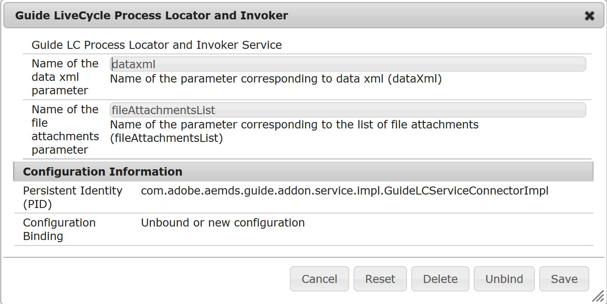

# Configurazione di  AEM Forms per l&#39;invio dei dati del modulo a un AEM Forms  nel processo JEE{#configuring-aem-forms-to-submit-form-data-to-an-aem-forms-on-jee-process}

I moduli adattivi supportano l&#39;invio di dati a un  AEM Forms su JEE per un&#39;ulteriore elaborazione. Consente di attivare un processo AEM Forms  su JEE con i dati disponibili nel modulo inviato. Per abilitare l&#39;istanza di AEM Forms  a inviare un modulo adattivo a  AEM Forms nel processo JEE, procedere come segue:

## Configurare il server AEM Forms  {#configure-your-aem-forms-server}

Per abilitare il server AEM moduli per l&#39;invio di dati a un AEM Forms  su un server JEE, procedere come segue:

1. Andate AEM console di configurazione Web all&#39;indirizzo https://[*host*]:[*port*]/system/console/configMgr.

1. Individuate e fate clic sul componente **LiveCycle di Adobe Client SDK Configuration**.
1. Fate clic per modificare l&#39;URL del server di configurazione, il nome utente e la password per l&#39;AEM Forms  sul server JEE.
1. Esaminare le impostazioni e fare clic su **Salva**.

## Mappare i dati con i campi di processo {#map-data-with-process-fields}

Una volta configurato il  AEM Forms, mappare l&#39;XML dei dati e gli allegati del modulo inviato ai campi del processo  AEM Forms su JEE. Per effettuare ciò:

1. Nella console di configurazione Web AEM, fare clic per modificare la configurazione **Guide LiveCycle Process Locator and Invoker**.
1. Specificate i seguenti parametri:

   * **Nome del parametro**  data xml (obbligatorio): Specificare il file di proprietà XML del processo  AEM Forms su JEE che deve elaborare i dati inviati. Il valore predefinito è **dataxml**.

   * **Nome del parametro**  degli allegati del file (facoltativo): Specificare l&#39;elenco degli oggetti del documento che il processo  AEM Forms su JEE deve elaborare. Il valore predefinito è **fileAttachmentsList**.

1. Esaminare le impostazioni e fare clic su **Salva**.

Una volta configurata, l&#39;azione Invia al Forms Workflow elenca i processi AEM Forms  sul server JEE contenenti il parametro XML dei dati specificato.
